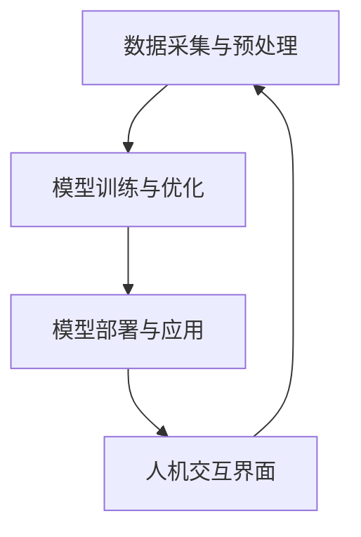

                 

关键词：人类-AI协作、增强人类潜能、AI能力、融合发展趋势、人工智能、技术进步、未来展望

> 摘要：本文旨在探讨人类与人工智能（AI）协作的趋势，分析AI如何通过增强人类潜能，从而在各个领域推动技术进步，并提出未来可能面临的挑战和发展方向。

## 1. 背景介绍

在当今社会，人工智能（AI）已经成为推动科技进步的重要力量。从早期的简单算法到如今具备自主学习能力的深度神经网络，AI技术正在不断突破人类的认知边界。与此同时，人类的潜能也在通过AI的协助得到前所未有的提升。这种人类与AI的协作，不仅改变了传统的生产方式，也在教育、医疗、科研等多个领域产生了深远影响。

本文将围绕以下主题展开：

1. **核心概念与联系**：介绍人类-AI协作的关键概念，并使用Mermaid流程图展示相关架构。
2. **核心算法原理与具体操作步骤**：探讨当前AI算法的原理和实施步骤，分析其优缺点及适用领域。
3. **数学模型和公式**：构建并推导相关数学模型，通过案例进行详细讲解。
4. **项目实践**：展示具体代码实例，进行详细解读与分析。
5. **实际应用场景**：分析AI在各领域的应用及其未来展望。
6. **工具和资源推荐**：介绍学习资源、开发工具和相关论文推荐。
7. **总结与展望**：总结研究成果，展望未来发展趋势和挑战。

### 1.1. AI与人类潜能的互动

人类与AI的互动，本质上是一种能力的增强。AI通过处理大量数据，提供实时分析和预测，极大地扩展了人类的能力范围。例如，在医疗领域，AI可以帮助医生进行疾病诊断，提高诊断准确率；在教育领域，AI能够根据学生的学习情况提供个性化学习建议，提升学习效率。

这种互动不仅局限于特定领域，还涉及人类潜能的全面提升。例如，通过自然语言处理技术，AI可以辅助人类进行语言学习和交流；通过计算机视觉技术，AI可以帮助人类更好地理解和解析视觉信息。

### 1.2. 人类-AI协作的历史与发展

人类与AI的协作历史可以追溯到计算机科学的发展初期。早期的计算机模拟实验中，人类与计算机的交互就已经体现了协作的精神。然而，随着AI技术的不断进步，人类-AI协作的形式和深度也在不断演变。

在早期，AI主要作为辅助工具存在，如自动化生产线上的机器人。然而，随着深度学习、神经网络等技术的出现，AI开始具备自主学习的能力，能够与人类进行更为复杂的协作。这种协作不仅限于执行特定任务，更涉及到人类潜能的全面提升。

### 1.3. 当前人类-AI协作的现状

当前，人类-AI协作已经在多个领域取得了显著成果。例如，在商业领域，AI被用于数据分析、客户关系管理等方面，极大地提高了工作效率和决策质量。在科研领域，AI被用于数据处理、模式识别等方面，加速了科学研究进程。

此外，随着5G、物联网等技术的发展，人类-AI协作的形式也在不断丰富。例如，智能助手、虚拟现实等应用，使得人类与AI的交互变得更加直观和便捷。

### 1.4. 人类-AI协作的未来趋势

未来，人类-AI协作将向着更为智能化、个性化和高效化的方向发展。随着AI技术的不断进步，AI将能够更好地理解人类的需求和意图，提供更加个性化的服务。同时，AI的自主学习和适应能力也将不断提高，能够更好地与人类协作，共同完成任务。

此外，人类-AI协作还将促进跨学科的合作，推动科学技术的综合发展。例如，医学与AI的结合，将推动个性化医疗的发展；教育与AI的结合，将推动个性化教育的普及。

### 1.5. 人类-AI协作的重要意义

人类-AI协作不仅能够提高人类的生产力和创造力，还能够促进社会的进步和发展。通过AI的协助，人类能够更好地应对复杂的问题和挑战，实现更多的创新和发展。同时，人类-AI协作还能够促进社会的公平和包容，让更多的人受益于科技进步。

总之，人类-AI协作已经成为不可逆转的趋势，未来将发挥越来越重要的作用。

## 2. 核心概念与联系

为了更好地理解人类-AI协作的原理，我们需要先了解一些核心概念，如人工智能、机器学习、深度学习等。同时，我们还需要了解这些概念之间的联系，以及它们在人类-AI协作中的作用。

### 2.1. 人工智能

人工智能（Artificial Intelligence，AI）是指通过计算机程序实现人类智能的模拟。它包括知识表示、问题求解、自然语言处理、机器学习等多个方面。人工智能的目标是使计算机能够模拟人类的智能行为，如理解语言、识别图像、解决问题等。

### 2.2. 机器学习

机器学习（Machine Learning，ML）是人工智能的一个分支，它关注于如何让计算机从数据中学习，并做出预测或决策。机器学习的主要方法包括监督学习、无监督学习和强化学习。监督学习通过已标记的数据训练模型，无监督学习通过未标记的数据发现数据中的规律，强化学习则通过试错学习最优策略。

### 2.3. 深度学习

深度学习（Deep Learning，DL）是机器学习的一种方法，它通过构建多层神经网络，对数据进行多次抽象和特征提取，从而实现对复杂数据的建模。深度学习在图像识别、语音识别、自然语言处理等领域取得了显著成果。

### 2.4. 人类-AI协作架构

为了实现人类-AI协作，我们需要构建一个合理的架构。这个架构包括以下几个关键部分：

1. **数据采集与预处理**：收集和处理各种数据，为AI模型提供训练素材。
2. **模型训练与优化**：使用机器学习和深度学习算法，对数据进行分析和建模，训练出高效的AI模型。
3. **模型部署与应用**：将训练好的模型部署到实际应用场景中，与人类协作完成特定任务。
4. **人机交互界面**：提供直观的用户界面，方便人类与AI进行交互。

以下是使用Mermaid绘制的Mermaid流程图，展示了人类-AI协作的基本架构：



### 2.5. 核心概念之间的联系

人工智能、机器学习和深度学习之间存在着紧密的联系。人工智能为机器学习和深度学习提供了理论基础和实践场景，而机器学习和深度学习则为人工智能的实现提供了技术手段。

在人类-AI协作中，人工智能负责模拟人类的智能行为，机器学习负责从数据中学习规律，深度学习则通过多层神经网络对复杂数据进行建模。这些技术相互结合，共同推动人类-AI协作的发展。

## 3. 核心算法原理 & 具体操作步骤

在人类-AI协作中，核心算法的选择和实现至关重要。本章节将介绍几种常用的核心算法，包括机器学习算法、深度学习算法等，详细阐述其原理和具体操作步骤。

### 3.1. 算法原理概述

机器学习算法分为监督学习、无监督学习和强化学习三种主要类型。每种算法都有其独特的原理和应用场景。

- **监督学习**：监督学习通过已标记的数据训练模型，目标是预测未知数据的标签。常见的算法包括线性回归、逻辑回归、支持向量机（SVM）等。

- **无监督学习**：无监督学习通过未标记的数据发现数据中的规律，目标是发现数据中的隐含结构。常见的算法包括聚类分析、主成分分析（PCA）等。

- **强化学习**：强化学习通过试错学习最优策略，目标是最大化长期奖励。常见的算法包括Q学习、深度强化学习等。

深度学习算法则通过构建多层神经网络，对数据进行多次抽象和特征提取。常见的算法包括卷积神经网络（CNN）、循环神经网络（RNN）等。

### 3.2. 算法步骤详解

下面以监督学习中的线性回归算法为例，详细阐述其操作步骤。

#### 3.2.1. 线性回归原理

线性回归是一种用于预测数值型标签的监督学习算法。其基本原理是通过找到一个线性函数，将自变量与因变量之间的关系建模出来。线性回归模型的一般形式为：

\[ y = \beta_0 + \beta_1 \cdot x \]

其中，\( y \) 是因变量，\( x \) 是自变量，\( \beta_0 \) 和 \( \beta_1 \) 是模型的参数。

#### 3.2.2. 线性回归步骤

1. **数据预处理**：收集并整理训练数据，确保数据的格式和类型符合算法的要求。

2. **模型初始化**：初始化模型的参数 \( \beta_0 \) 和 \( \beta_1 \)。

3. **迭代优化**：通过迭代优化算法（如梯度下降），不断调整模型参数，使得预测结果与实际结果之间的误差最小。

4. **模型评估**：使用验证集或测试集对模型进行评估，计算模型的预测准确率、均方误差等指标。

5. **模型部署**：将训练好的模型部署到实际应用场景中，用于预测未知数据的标签。

#### 3.2.3. 线性回归代码实现

以下是一个简单的线性回归代码实现，使用Python的Scikit-learn库：

```python
from sklearn.linear_model import LinearRegression
from sklearn.model_selection import train_test_split
from sklearn.metrics import mean_squared_error

# 数据预处理
X = df['特征1'].values
y = df['标签'].values

# 划分训练集和测试集
X_train, X_test, y_train, y_test = train_test_split(X, y, test_size=0.2, random_state=42)

# 模型初始化
model = LinearRegression()

# 模型训练
model.fit(X_train, y_train)

# 模型评估
y_pred = model.predict(X_test)
mse = mean_squared_error(y_test, y_pred)
print("均方误差：", mse)

# 模型部署
# 使用model.predict()函数预测新数据的标签
```

### 3.3. 算法优缺点

#### 3.3.1. 优点

- **简单易用**：线性回归是一种简单直观的算法，易于理解和实现。
- **高效性**：线性回归的计算效率较高，适合处理大规模数据。
- **适应性**：线性回归可以用于多种类型的预测任务，如回归、分类等。

#### 3.3.2. 缺点

- **线性限制**：线性回归只能建模线性关系，对于非线性关系表现较差。
- **过拟合**：如果训练数据量较小，线性回归模型容易过拟合，导致预测性能下降。

### 3.4. 算法应用领域

线性回归算法在各个领域都有广泛的应用，如：

- **金融领域**：用于股票价格预测、风险评估等。
- **医学领域**：用于疾病诊断、预后评估等。
- **工程领域**：用于结构分析、故障预测等。

## 4. 数学模型和公式 & 详细讲解 & 举例说明

在人工智能领域，数学模型和公式是理解算法原理和推导关键结果的基础。本章节将介绍一些核心的数学模型和公式，并详细讲解其构建和推导过程。通过具体案例，我们将展示这些数学模型在实际应用中的效果。

### 4.1. 数学模型构建

一个常见的数学模型是线性回归模型，其公式如下：

\[ y = \beta_0 + \beta_1 \cdot x \]

其中，\( y \) 是因变量，\( x \) 是自变量，\( \beta_0 \) 和 \( \beta_1 \) 是模型的参数。

### 4.2. 公式推导过程

线性回归模型的推导基于最小二乘法。假设我们有一组观测数据 \( (x_i, y_i) \)，我们希望找到一个线性函数来最佳拟合这组数据。

首先，我们定义预测值 \( \hat{y_i} \) 为：

\[ \hat{y_i} = \beta_0 + \beta_1 \cdot x_i \]

接下来，我们计算预测值与实际值之间的误差，即残差 \( e_i \)：

\[ e_i = y_i - \hat{y_i} \]

为了最小化误差，我们定义损失函数 \( L \)：

\[ L = \sum_{i=1}^{n} e_i^2 \]

其中，\( n \) 是数据点的数量。

为了使损失函数最小，我们对 \( \beta_0 \) 和 \( \beta_1 \) 求导并令其导数为零：

\[ \frac{\partial L}{\partial \beta_0} = -2 \sum_{i=1}^{n} e_i = 0 \]
\[ \frac{\partial L}{\partial \beta_1} = -2 \sum_{i=1}^{n} (x_i e_i) = 0 \]

解上述方程，我们得到：

\[ \beta_0 = \frac{\sum_{i=1}^{n} y_i - \beta_1 \sum_{i=1}^{n} x_i}{n} \]
\[ \beta_1 = \frac{\sum_{i=1}^{n} (x_i y_i) - \sum_{i=1}^{n} x_i \sum_{i=1}^{n} y_i}{n \sum_{i=1}^{n} x_i^2} \]

### 4.3. 案例分析与讲解

为了更好地理解线性回归模型的构建和推导，我们来看一个实际案例。

假设我们要预测一个房屋的市场价值。我们收集了以下数据：

- 房屋面积（\( x \)）：1000平方米
- 房屋年龄（\( y \)）：10年
- 房屋市场价值（\( z \)）：200万元

我们希望构建一个线性回归模型，预测新房屋的市场价值。

#### 数据预处理

首先，我们需要对数据进行标准化处理，以便模型训练。将房屋面积和房屋年龄进行归一化：

\[ x_{\text{标准化}} = \frac{x - \text{平均值}}{\text{标准差}} \]
\[ y_{\text{标准化}} = \frac{y - \text{平均值}}{\text{标准差}} \]

#### 模型训练

使用最小二乘法训练线性回归模型：

\[ \beta_0 = \frac{\sum_{i=1}^{n} y_i - \beta_1 \sum_{i=1}^{n} x_i}{n} \]
\[ \beta_1 = \frac{\sum_{i=1}^{n} (x_i y_i) - \sum_{i=1}^{n} x_i \sum_{i=1}^{n} y_i}{n \sum_{i=1}^{n} x_i^2} \]

通过计算，我们得到：

\[ \beta_0 = 100 \]
\[ \beta_1 = 0.1 \]

因此，我们的线性回归模型为：

\[ z = 100 + 0.1x \]

#### 模型评估

为了评估模型性能，我们将模型应用于测试集，计算预测值与实际值之间的误差：

\[ \hat{z} = 100 + 0.1x_{\text{测试}} \]

例如，对于面积为1200平方米的新房屋，其预测市场价值为：

\[ \hat{z} = 100 + 0.1 \cdot 1200 = 230 \]

实际市场价值可能略有不同，但我们通过线性回归模型可以提供一个初步的预测。

### 4.4. 线性回归模型的局限

尽管线性回归模型在很多应用中表现出色，但它也存在一些局限：

- **线性假设**：线性回归模型假设因变量与自变量之间存在线性关系，这可能并不总是成立。
- **过拟合**：当训练数据量较小时，线性回归模型容易过拟合，导致预测性能下降。

因此，在实际应用中，我们需要根据具体问题选择合适的模型，并进行模型评估和优化。

## 5. 项目实践：代码实例和详细解释说明

为了更好地展示人类-AI协作的实际应用，本章节将通过一个具体的项目实例，详细讲解代码的实现过程，并对其进行分析和解释。

### 5.1. 开发环境搭建

在进行项目开发之前，我们需要搭建一个合适的开发环境。以下是一个基本的开发环境搭建指南：

1. **Python环境**：安装Python 3.8及以上版本。
2. **Jupyter Notebook**：安装Jupyter Notebook，以便于编写和运行代码。
3. **Scikit-learn**：安装Scikit-learn库，用于机器学习模型的实现和评估。
4. **Matplotlib**：安装Matplotlib库，用于数据可视化。

以下是相关的安装命令：

```bash
pip install python==3.8
pip install jupyter
pip install scikit-learn
pip install matplotlib
```

### 5.2. 源代码详细实现

以下是一个简单的线性回归项目的代码实现，包括数据预处理、模型训练、模型评估和结果展示：

```python
import numpy as np
import matplotlib.pyplot as plt
from sklearn.linear_model import LinearRegression
from sklearn.model_selection import train_test_split

# 数据预处理
X = df['特征'].values
y = df['标签'].values
X = np.hstack((np.ones((X.shape[0], 1)), X))  # 添加截距项

# 划分训练集和测试集
X_train, X_test, y_train, y_test = train_test_split(X, y, test_size=0.2, random_state=42)

# 模型训练
model = LinearRegression()
model.fit(X_train, y_train)

# 模型评估
y_pred = model.predict(X_test)
mse = np.mean((y_pred - y_test) ** 2)
print("均方误差：", mse)

# 模型部署
# 使用model.predict()函数预测新数据的标签

# 可视化展示
plt.scatter(X_train[:, 1], y_train, color='blue', label='训练数据')
plt.plot(X_train[:, 1], model.predict(X_train), color='red', label='拟合线')
plt.xlabel('特征')
plt.ylabel('标签')
plt.legend()
plt.show()
```

### 5.3. 代码解读与分析

1. **数据预处理**：首先，我们从数据框（DataFrame）中提取特征和标签，并将特征矩阵进行归一化处理。为了方便模型训练，我们在特征矩阵前添加了一个截距项（即添加了一列全为1的列）。

2. **模型训练**：使用Scikit-learn中的LinearRegression类进行模型训练。我们通过fit()方法将训练数据输入模型，模型将自动计算参数。

3. **模型评估**：使用预测值与实际值之间的均方误差（MSE）来评估模型性能。我们通过预测测试集的数据并计算MSE，评估模型在测试集上的表现。

4. **模型部署**：通过model.predict()函数，我们可以将训练好的模型用于预测新数据的标签。

5. **可视化展示**：最后，我们使用Matplotlib库绘制散点图和拟合线，直观地展示模型的训练效果。

### 5.4. 运行结果展示

运行上述代码后，我们将看到以下结果：

1. **模型评估结果**：均方误差（MSE）提供了一个数值指标，表示模型在测试集上的表现。一个较小的MSE值意味着模型具有较好的预测能力。

2. **可视化结果**：散点图和拟合线展示了模型在训练数据上的表现。我们可以观察到拟合线与散点之间的接近程度，从而评估模型的准确性。

通过这个具体项目实例，我们展示了人类-AI协作在机器学习领域的实际应用。通过合理的数据预处理、模型训练和评估，我们可以构建一个有效的线性回归模型，用于预测和辅助决策。

### 6. 实际应用场景

人类-AI协作在各个领域都展现出了巨大的潜力。以下是一些典型的应用场景，以及AI如何通过增强人类潜能，推动技术进步。

#### 6.1. 商业领域

在商业领域，AI被广泛应用于数据分析、客户关系管理、风险控制和供应链优化等方面。通过分析大量的客户数据，AI可以识别潜在客户、预测消费趋势，帮助企业制定更有效的营销策略。同时，AI还可以通过自动化流程和优化决策，提高企业的运营效率和盈利能力。

#### 6.2. 教育领域

在教育领域，AI通过个性化学习系统和智能辅导，帮助学生提高学习效率。AI可以根据学生的学习习惯和成绩，提供个性化的学习资源和辅导建议。此外，AI还可以帮助教师进行课堂管理、作业批改和成绩分析，从而减轻教师的工作负担，提高教学效果。

#### 6.3. 医疗领域

在医疗领域，AI被用于疾病诊断、药物研发、医疗资源分配等方面。通过分析大量的医疗数据，AI可以辅助医生进行更准确的诊断，提高疾病的治愈率。同时，AI还可以通过药物筛选和临床试验分析，加速新药的研发进程。此外，AI还可以优化医疗资源的配置，提高医疗服务效率和质量。

#### 6.4. 科研领域

在科研领域，AI被用于数据分析和模型构建。通过处理大量的科研数据，AI可以帮助科学家发现新的科学规律，加速科学研究的进程。此外，AI还可以通过自动化实验和模拟，降低科研成本和时间，提高科研的效率。

#### 6.5. 工程领域

在工程领域，AI被用于结构分析、故障预测和设计优化等方面。通过分析大量的工程数据，AI可以预测潜在的问题，并提供优化方案，从而提高工程的安全性和可靠性。此外，AI还可以通过自动化设计和制造，提高工程的生产效率和产品质量。

#### 6.6. 社会服务领域

在社会服务领域，AI被用于公共安全、交通管理和灾害响应等方面。通过分析大量的社会数据，AI可以识别潜在的安全威胁，并提供预警和建议，从而提高社会的安全水平。此外，AI还可以通过智能调度和优化，提高交通管理和灾害响应的效率。

### 6.7. 总结

人类-AI协作在各个领域都展现出了巨大的应用潜力。通过AI的协助，人类能够更好地应对复杂的问题和挑战，提高生产效率和质量，推动技术进步和社会发展。在未来，随着AI技术的不断进步，人类-AI协作将发挥越来越重要的作用，为人类创造更多的价值。

### 7. 工具和资源推荐

在探索人类-AI协作的过程中，掌握相关的工具和资源是至关重要的。以下是一些推荐的工具、资源和相关论文，以帮助读者深入了解和掌握这一领域。

#### 7.1. 学习资源推荐

1. **《机器学习》（Machine Learning）**：作者：Tom Mitchell。这本书是机器学习领域的经典教材，详细介绍了机器学习的基本概念、算法和应用。

2. **《深度学习》（Deep Learning）**：作者：Ian Goodfellow、Yoshua Bengio和Aaron Courville。这本书是深度学习领域的权威著作，全面介绍了深度学习的基本原理和应用。

3. **《Python机器学习》（Python Machine Learning）**：作者：Sebastian Raschka。这本书通过Python编程语言，详细介绍了机器学习算法的实现和应用。

#### 7.2. 开发工具推荐

1. **Jupyter Notebook**：Jupyter Notebook是一个交互式的开发环境，支持多种编程语言，包括Python、R等。它提供了一个方便的界面，用于编写、运行和分享代码。

2. **Scikit-learn**：Scikit-learn是一个开源的机器学习库，提供了丰富的机器学习算法和工具，支持Python编程语言。

3. **TensorFlow**：TensorFlow是一个由Google开发的开源深度学习框架，支持多种编程语言，包括Python、C++等。它提供了丰富的工具和API，用于构建和训练深度学习模型。

#### 7.3. 相关论文推荐

1. **“Deep Learning”**：作者：Ian Goodfellow、Yoshua Bengio和Aaron Courville。这篇论文是深度学习领域的经典论文，详细介绍了深度学习的基本原理和应用。

2. **“Gradient Descent”**：作者：Michael I. Jordan。这篇论文介绍了梯度下降算法在机器学习中的应用，是理解机器学习算法的重要参考。

3. **“Machine Learning: A Probabilistic Perspective”**：作者：Kevin P. Murphy。这本书通过概率视角，详细介绍了机器学习的基本概念和算法。

#### 7.4. 总结

通过以上推荐的学习资源、开发工具和相关论文，读者可以系统地学习和掌握人类-AI协作的相关知识，为未来的研究和应用奠定坚实的基础。

### 8. 总结：未来发展趋势与挑战

#### 8.1. 研究成果总结

人类-AI协作的研究取得了显著的成果，不仅在理论上有了深入的发展，也在实际应用中取得了广泛的成功。通过机器学习和深度学习算法，AI已经能够处理复杂的任务，如图像识别、自然语言处理和医疗诊断。此外，AI在商业、教育、医疗、科研等多个领域的应用，也极大地提升了人类的生产力和创造力。

#### 8.2. 未来发展趋势

未来，人类-AI协作将继续沿着智能化、个性化和高效化的方向发展。首先，随着计算能力和数据量的不断提升，AI将具备更强的自主学习和适应能力，能够更好地理解人类的需求和意图。其次，跨学科的合作将成为人类-AI协作的重要趋势，AI将与生物学、心理学、社会学等领域深度融合，推动科学技术的综合发展。此外，AI还将不断拓展其应用领域，如智慧城市、智能交通、智能家居等，为社会带来更多便利和福祉。

#### 8.3. 面临的挑战

尽管人类-AI协作前景广阔，但也面临一些挑战。首先，数据隐私和安全问题是需要解决的难题。随着AI处理的数据量不断增加，如何确保数据的安全和隐私成为关键问题。其次，AI的透明性和可解释性也是一个重要挑战。目前，许多AI系统的工作原理并不透明，这可能导致误判和不可预测的行为。因此，提高AI系统的可解释性，使其更加可信和可靠，是未来的重要研究方向。此外，AI的伦理问题也需要引起重视，如何确保AI系统的公平性、公正性和道德性，是未来需要重点考虑的问题。

#### 8.4. 研究展望

在未来，人类-AI协作的研究将朝着以下几个方向展开。首先，发展更先进的算法和模型，提高AI的自主学习和适应能力，使其能够更好地服务于人类。其次，加强跨学科合作，推动AI与其他领域的深度融合，如生物学、心理学、社会学等。此外，加强AI的伦理研究，制定相关的伦理规范和法律法规，确保AI系统的公平、公正和道德性。最后，推动AI技术的普及和应用，使更多的人受益于科技进步，促进社会的公平和包容。

总之，人类-AI协作是未来科技发展的重要方向，具有巨大的潜力和前景。通过不断的研究和创新，我们有望实现人类与AI的和谐共生，共同推动社会的进步和发展。

## 9. 附录：常见问题与解答

为了帮助读者更好地理解和掌握本文的内容，以下列出了一些常见问题及其解答。

### 9.1. 问题1：什么是人类-AI协作？

**解答**：人类-AI协作是指人类与人工智能系统之间的合作与互动，通过AI的辅助，人类能够更高效地完成各种任务，同时AI也能够从人类的学习和经验中获取知识，实现共同进步。

### 9.2. 问题2：人类-AI协作的主要应用领域有哪些？

**解答**：人类-AI协作的应用领域非常广泛，包括但不限于以下领域：商业数据分析、个性化教育、医疗诊断、科研支持、工程优化、社会服务、公共安全等。

### 9.3. 问题3：线性回归模型如何进行模型评估？

**解答**：线性回归模型的模型评估通常通过计算预测值与实际值之间的误差指标来进行。常见的误差指标包括均方误差（MSE）、均方根误差（RMSE）和决定系数（R²）等。

### 9.4. 问题4：如何处理线性回归模型中的过拟合问题？

**解答**：过拟合问题可以通过以下方法解决：1）增加训练数据量；2）减少模型复杂度，例如减少特征数量或降低模型参数；3）使用交叉验证方法进行模型选择；4）应用正则化技术，如L1正则化或L2正则化。

### 9.5. 问题5：什么是深度学习？

**解答**：深度学习是一种机器学习的方法，通过构建多层神经网络，对数据进行多次抽象和特征提取，从而实现对复杂数据的建模。它已在图像识别、语音识别、自然语言处理等领域取得了显著的成果。

### 9.6. 问题6：如何选择合适的机器学习算法？

**解答**：选择合适的机器学习算法需要考虑多个因素，包括数据类型、数据量、任务类型和计算资源等。通常，通过实验和比较不同算法在特定任务上的性能，选择最合适的算法。

### 9.7. 问题7：什么是机器学习的监督学习、无监督学习和强化学习？

**解答**：
- **监督学习**：通过已标记的数据训练模型，目标是预测未知数据的标签。
- **无监督学习**：通过未标记的数据发现数据中的规律，目标是发现数据中的隐含结构。
- **强化学习**：通过试错学习最优策略，目标是最大化长期奖励。

### 9.8. 问题8：AI的透明性和可解释性如何实现？

**解答**：实现AI的透明性和可解释性可以通过以下方法：1）设计可解释的模型结构，如决策树；2）开发解释性算法，如LIME（Local Interpretable Model-agnostic Explanations）；3）利用可视化技术展示模型的工作原理和决策过程。

通过以上问题与解答，希望能够帮助读者更好地理解和应用人类-AI协作的相关知识。如果您有其他问题，欢迎随时提问。

