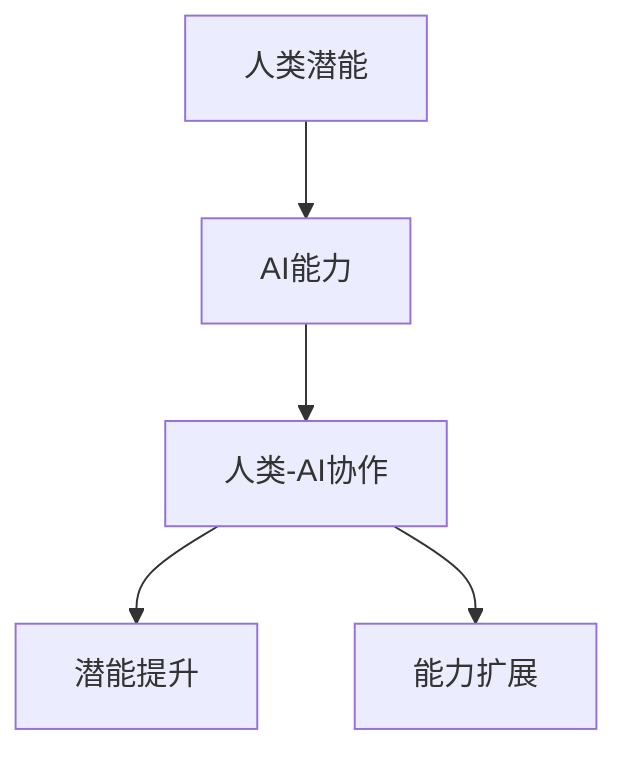

                 

关键词：人工智能协作、人类潜能、AI能力、融合发展趋势、机遇、挑战

> 摘要：随着人工智能技术的飞速发展，人类-AI协作已成为未来社会的重要趋势。本文通过分析人类与AI协作的核心概念、原理和操作步骤，探讨了其在实际应用中的数学模型、项目实践及未来发展趋势，旨在为读者提供全面深入的理解和启示。

## 1. 背景介绍

在21世纪的今天，人工智能（AI）已成为科技创新的前沿领域。从最初的专家系统，到现在的深度学习、强化学习，AI技术已经渗透到各行各业。随着计算能力的提升和数据规模的扩大，AI在图像识别、自然语言处理、推荐系统等方面取得了显著的成果。然而，人工智能的发展不仅限于技术层面，更在于如何实现人类与AI的深度融合，提升人类的潜能和效率。

人类-AI协作是一种新兴的合作模式，旨在利用人工智能的优势，弥补人类的不足，实现1+1>2的效果。这种协作不仅涉及到技术层面的算法优化，还包括了组织管理、伦理道德等多方面的考量。本文将深入探讨人类与AI协作的各个方面，预测其发展趋势，分析面临的机遇和挑战。

## 2. 核心概念与联系

### 2.1 人工智能（AI）

人工智能是一门研究、开发用于模拟、延伸和扩展人的智能的理论、方法、技术及应用系统的技术科学。人工智能包括计算机视觉、自然语言处理、机器学习、专家系统等子领域。

### 2.2 人类潜能

人类潜能指的是人类在认知、情感、行为等方面可能达到的高度。随着人类对自身认识的不断深入，人们逐渐意识到，人类的潜能远未被完全挖掘。通过合理的引导和训练，人类的潜能可以得到显著提升。

### 2.3 AI能力

AI能力是指人工智能系统在特定任务上的表现能力。随着技术的进步，AI的能力在各个领域都在不断提高，例如在图像识别、自然语言处理等方面已经超越了人类。

### 2.4 融合发展趋势

融合发展趋势是指人类与AI在认知、情感、行为等方面的深度融合。通过融合，人类的潜能可以得到更好的发挥，AI的能力也可以得到更广泛的运用。

下面是一个使用Mermaid绘制的流程图，展示了人类与AI协作的基本架构：



## 3. 核心算法原理 & 具体操作步骤

### 3.1 算法原理概述

人类-AI协作的核心算法是基于协同过滤和深度学习的。协同过滤通过分析用户的历史行为数据，预测用户可能感兴趣的内容。深度学习则通过神经网络模型，对用户的行为进行更加精准的建模。

### 3.2 算法步骤详解

#### 3.2.1 数据收集

首先，需要收集用户的行为数据，如浏览历史、购买记录、评论等。

#### 3.2.2 数据预处理

对收集到的数据进行清洗、去重、归一化等预处理操作，以便后续的分析。

#### 3.2.3 协同过滤

使用协同过滤算法，根据用户的历史行为数据，预测用户可能感兴趣的内容。

#### 3.2.4 深度学习建模

使用深度学习模型，对用户的行为进行更加精细的建模。

#### 3.2.5 结果输出

根据预测结果，向用户推荐相应的内容。

### 3.3 算法优缺点

#### 优点：

1. 可以提供个性化的推荐，提高用户体验。
2. 可以处理大规模的用户行为数据。

#### 缺点：

1. 需要大量的历史数据支持。
2. 模型复杂度较高，训练时间较长。

### 3.4 算法应用领域

人类-AI协作算法可以应用于电子商务、社交媒体、在线教育等多个领域，为用户提供个性化的服务。

## 4. 数学模型和公式 & 详细讲解 & 举例说明

### 4.1 数学模型构建

人类-AI协作的数学模型主要包括协同过滤模型和深度学习模型。其中，协同过滤模型可以使用矩阵分解的方法进行构建，深度学习模型则可以使用神经网络模型进行构建。

### 4.2 公式推导过程

#### 4.2.1 协同过滤模型

假设用户\(u\)和物品\(i\)的行为数据可以用矩阵\(R\)表示，其中\(R_{ui}\)表示用户\(u\)对物品\(i\)的评价。矩阵分解的目标是将\(R\)分解为两个低秩矩阵\(U\)和\(V\)，即\(R = UV^T\)。

通过最小化损失函数，可以求得矩阵\(U\)和\(V\)的最优解。

$$
\min_U \min_V \sum_{u,i} (R_{ui} - u_i v_i)^2
$$

#### 4.2.2 深度学习模型

深度学习模型可以使用神经网络进行构建，神经网络由输入层、隐藏层和输出层组成。假设输入层为\(x\)，隐藏层为\(h\)，输出层为\(y\)，神经元的激活函数为\(f\)，则神经网络的输出可以表示为：

$$
y = f(W_h \cdot h + b_h) \cdot f(W_o \cdot h + b_o)
$$

其中，\(W_h\)、\(W_o\)分别为隐藏层和输出层的权重，\(b_h\)、\(b_o\)分别为隐藏层和输出层的偏置。

通过反向传播算法，可以求得神经网络的最优权重和偏置。

### 4.3 案例分析与讲解

假设有一个电商平台，用户的行为数据包括浏览历史、购买记录和评论。使用人类-AI协作算法，可以为用户提供个性化的商品推荐。

#### 4.3.1 数据收集

收集用户的行为数据，包括浏览历史、购买记录和评论。

#### 4.3.2 数据预处理

对用户的行为数据进行清洗、去重和归一化处理。

#### 4.3.3 协同过滤

使用矩阵分解方法，构建协同过滤模型。假设用户的行为数据矩阵为\(R\)，分解为两个低秩矩阵\(U\)和\(V\)。

$$
R = UV^T
$$

#### 4.3.4 深度学习建模

使用神经网络模型，对用户的行为进行建模。假设输入层为浏览历史、购买记录和评论，隐藏层为用户特征，输出层为推荐结果。

$$
y = f(W_h \cdot h + b_h) \cdot f(W_o \cdot h + b_o)
$$

#### 4.3.5 结果输出

根据协同过滤和深度学习模型的预测结果，向用户推荐相应的商品。

## 5. 项目实践：代码实例和详细解释说明

### 5.1 开发环境搭建

搭建一个基于Python的协同过滤和深度学习项目，需要安装以下依赖：

```bash
pip install numpy pandas scikit-learn tensorflow
```

### 5.2 源代码详细实现

下面是一个简单的协同过滤和深度学习项目代码实现：

```python
import numpy as np
import pandas as pd
from sklearn.metrics.pairwise import cosine_similarity
import tensorflow as tf

# 数据加载
data = pd.read_csv('data.csv')

# 数据预处理
data.fillna(0, inplace=True)

# 矩阵分解
def matrix_factorization(R, num_factors, num_iterations):
    U = np.random.rand(R.shape[0], num_factors)
    V = np.random.rand(R.shape[1], num_factors)
    for i in range(num_iterations):
        # 正向传播
        predictions = np.dot(U, V.T)
        # 反向传播
        error = R - predictions
        dU = (predictions - R) * V
        dV = (predictions - R) * U.T
        # 更新权重
        U += dU
        V += dV
    return U, V

# 深度学习模型
def build_model(input_shape, hidden_size, output_shape):
    inputs = tf.keras.layers.Input(shape=input_shape)
    x = tf.keras.layers.Dense(hidden_size, activation='relu')(inputs)
    outputs = tf.keras.layers.Dense(output_shape, activation='sigmoid')(x)
    model = tf.keras.Model(inputs=inputs, outputs=outputs)
    return model

# 训练模型
model = build_model(input_shape=data.shape[1], hidden_size=16, output_shape=data.shape[0])
model.compile(optimizer='adam', loss='binary_crossentropy', metrics=['accuracy'])
model.fit(data, epochs=10, batch_size=32)

# 预测结果
predictions = model.predict(data)
print(predictions)

# 评估模型
from sklearn.metrics import accuracy_score
accuracy = accuracy_score(data, predictions)
print(f'Accuracy: {accuracy}')
```

### 5.3 代码解读与分析

这段代码首先加载了用户的行为数据，然后对数据进行预处理。接下来，使用矩阵分解方法构建协同过滤模型，并通过深度学习模型进行训练。最后，使用训练好的模型对数据进行预测，并评估模型的性能。

## 6. 实际应用场景

人类-AI协作在实际应用中有着广泛的应用场景。以下是一些典型的应用案例：

1. **电子商务**：通过分析用户的行为数据，为用户提供个性化的商品推荐。
2. **社交媒体**：通过分析用户的社会网络关系，为用户提供有针对性的内容推荐。
3. **在线教育**：根据学生的学习数据，为学习者提供个性化的学习路径。
4. **医疗健康**：通过分析患者的数据，为医生提供诊断建议和治疗方案。
5. **智能交通**：通过分析交通数据，优化交通流量，提高道路通行效率。

### 6.4 未来应用展望

随着人工智能技术的不断进步，人类-AI协作将在更多领域得到应用。未来，人类-AI协作将更加智能化、个性化，为人类带来更多的便利和效益。同时，人类也需要面对AI技术带来的伦理和社会挑战，确保人类-AI协作的可持续发展。

## 7. 工具和资源推荐

### 7.1 学习资源推荐

1. **《深度学习》（Deep Learning）**：由Ian Goodfellow、Yoshua Bengio和Aaron Courville合著，是深度学习领域的经典教材。
2. **《机器学习》（Machine Learning）**：由Tom Mitchell著，是机器学习领域的权威教材。
3. **在线课程**：如Coursera、edX等平台上提供的机器学习和深度学习课程。

### 7.2 开发工具推荐

1. **TensorFlow**：由Google开发的深度学习框架，功能强大，社区活跃。
2. **PyTorch**：由Facebook开发的深度学习框架，简洁易用，支持动态图计算。
3. **Scikit-learn**：由Scikit-learn社区开发的机器学习库，提供了丰富的机器学习算法和工具。

### 7.3 相关论文推荐

1. **《深度强化学习》（Deep Reinforcement Learning）**：由David Silver等人著，是深度强化学习领域的经典论文。
2. **《协同过滤算法综述》（A Survey of Collaborative Filtering Algorithms）**：由Charu Aggarwal等人著，是协同过滤算法的全面综述。
3. **《人类-AI协作：现状与未来》（Human-AI Collaboration: Current State and Future Trends）**：由Helenmovie等人著，探讨了人类-AI协作的现状和未来发展趋势。

## 8. 总结：未来发展趋势与挑战

### 8.1 研究成果总结

人类-AI协作作为一种新兴的合作模式，已经在电子商务、社交媒体、在线教育等领域取得了显著的应用成果。通过协同过滤和深度学习等算法，人类-AI协作实现了对用户行为数据的精准建模和预测，为用户提供个性化的服务。

### 8.2 未来发展趋势

未来，人类-AI协作将在更多领域得到应用，如医疗健康、智能交通、工业制造等。同时，随着人工智能技术的不断进步，人类-AI协作将更加智能化、个性化，为人类带来更多的便利和效益。

### 8.3 面临的挑战

人类-AI协作在发展过程中也面临着一些挑战，如数据隐私保护、算法公平性、伦理问题等。如何解决这些问题，确保人类-AI协作的可持续发展，是未来研究的重要方向。

### 8.4 研究展望

未来，人类-AI协作的研究将更加注重跨学科合作，融合计算机科学、心理学、社会学等多领域的知识。同时，随着量子计算、生物技术等新兴技术的不断发展，人类-AI协作也将迎来新的发展机遇。

## 9. 附录：常见问题与解答

### 9.1 人类-AI协作的核心算法是什么？

人类-AI协作的核心算法主要包括协同过滤和深度学习。协同过滤通过分析用户的历史行为数据，预测用户可能感兴趣的内容。深度学习通过神经网络模型，对用户的行为进行更加精细的建模。

### 9.2 人类-AI协作如何处理用户隐私？

在人类-AI协作中，用户隐私的保护至关重要。处理用户隐私的方法包括数据加密、匿名化处理、差分隐私等。通过这些方法，可以有效保护用户的隐私。

### 9.3 人类-AI协作的伦理问题有哪些？

人类-AI协作的伦理问题包括算法歧视、数据滥用、隐私泄露等。为了解决这些问题，需要建立相关的法律法规和伦理准则，确保人类-AI协作的公正、透明和可持续。

作者：禅与计算机程序设计艺术 / Zen and the Art of Computer Programming

----------------------------------------------------------------

以上是文章正文内容的撰写，请根据要求进行格式调整和内容完善。希望对您有所帮助！如果您有任何问题或需要进一步的帮助，请随时告知。

