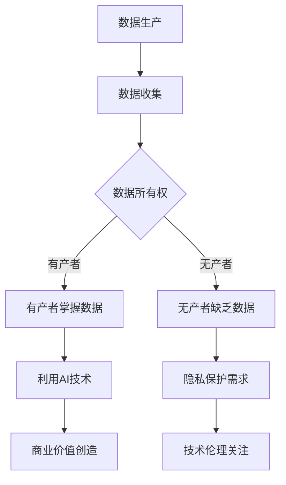

                 

关键词：数据分层、社会不平等、数据所有权、人工智能、隐私保护、算法公平性、技术伦理

## 摘要

在数字化的新时代，数据已成为一种新型的资源和力量，其掌控权在很大程度上决定了个人的社会地位和财富分配。本文探讨了由于数据的不平等分配，人类社会正逐渐分裂为两个阶层：掌握数据资源的有产者与无产者。通过深入分析这一现象，本文揭示了数据所有权、人工智能的应用、隐私保护以及技术伦理等方面的核心问题，并对未来可能的发展趋势与挑战进行了展望。

## 1. 背景介绍

### 数据时代的来临

随着互联网技术的飞速发展，数据的产生、存储和传输变得前所未有的便捷。如今，数据已经渗透到我们日常生活的方方面面，从社交媒体到电子商务，从智能医疗到智慧城市，无一不依赖于数据驱动。然而，数据的经济价值和影响力也引发了新的社会问题。

### 数据的双重性质

数据具有双重性质：一方面，它是信息和知识的载体，有助于提高生产力和创新；另一方面，它又是敏感和私密的，一旦被不当使用，可能导致隐私泄露和滥用。这种双重性质使得数据管理和使用面临巨大挑战。

### 数据不平等的加剧

数据不平等的加剧体现在多个方面。首先，数据生产者和消费者之间的不平等加剧，大量的数据由少数大公司或机构掌控，而普通个人用户往往只能被动地提供数据。其次，数据获取能力的不平等，使得一些个体或组织拥有比其他更丰富的数据资源，从而在竞争中占据优势。

### 社会阶层分裂的迹象

随着数据权力的集中，人类社会出现了明显的阶层分裂迹象。那些掌握大量数据资源的企业和个人，通过数据分析和算法优化，在商业、政治和社会领域拥有了更大的话语权和影响力。而那些数据资源匮乏的个人，则面临着日益加剧的不平等和社会排斥。

## 2. 核心概念与联系

### 数据所有权

数据所有权是指对数据拥有控制权和收益权的主体。目前，数据所有权的问题尚未有明确的法律法规来界定，这导致数据资源的不平等分配。有产者通过数据所有权的垄断，进一步巩固了其优势地位。

### 人工智能

人工智能（AI）技术的发展，使得数据分析和应用变得更为高效和智能化。有产者利用AI技术，通过大数据分析和机器学习，创造出更多的商业价值和竞争优势。

### 隐私保护

隐私保护是数据分层问题中的一个关键点。由于数据的不当使用，个人隐私受到严重威胁。隐私保护的加强，不仅关乎个体的权益，也关系到整个社会的信任和稳定。

### 技术伦理

技术伦理是指导技术发展和应用的道德原则。在数据分层背景下，技术伦理尤为重要，它要求我们在追求技术进步的同时，也要关注社会公平和道德责任。

### Mermaid 流程图

下面是一个简化的 Mermaid 流程图，展示了数据分层的主要环节和关系。



## 3. 核心算法原理 & 具体操作步骤

### 3.1 算法原理概述

在本章节，我们将探讨一种基于大数据分析和机器学习的技术，用于识别和缓解数据分层问题。该算法的核心思想是通过优化数据共享机制，提高数据的可访问性和公平性。

### 3.2 算法步骤详解

1. **数据收集**：首先，需要收集来自不同来源的数据，包括公开数据、商业数据和用户生成数据。
2. **数据预处理**：对收集到的数据进行清洗、去重和格式化，以确保数据的质量和一致性。
3. **特征提取**：利用特征工程方法，从数据中提取有助于分析和决策的关键特征。
4. **模型训练**：使用机器学习算法，如随机森林、支持向量机等，对数据进行分析和建模。
5. **数据共享**：通过优化算法，构建一个公平的数据共享机制，使得数据资源能够被更广泛地利用。
6. **效果评估**：对算法的效果进行评估，包括数据公平性、模型准确性和用户体验等方面。

### 3.3 算法优缺点

**优点**：
- **提高数据公平性**：通过优化数据共享机制，可以缓解数据分层问题，提高数据的可访问性。
- **促进创新**：更广泛的数据共享和利用，有助于推动科研和商业创新。
- **隐私保护**：在数据共享过程中，可以采用差分隐私等技术，确保个人隐私不受侵害。

**缺点**：
- **实现难度**：构建一个公平且高效的数据共享机制，需要复杂的算法和工程实现。
- **监管挑战**：如何在法律和道德框架下，实现数据共享的公平性，是一个亟待解决的问题。

### 3.4 算法应用领域

- **科研领域**：通过优化数据共享，促进科研合作和数据开放，提高科研成果的转化率。
- **商业领域**：企业可以利用数据分层算法，优化数据管理和决策，提高市场竞争力。
- **社会治理**：政府部门可以应用该算法，提高数据治理能力，促进社会公平和透明。

## 4. 数学模型和公式 & 详细讲解 & 举例说明

### 4.1 数学模型构建

在本章节，我们将介绍一个用于分析数据分层问题的数学模型。该模型基于博弈论和优化理论，旨在找出数据共享的最佳策略。

### 4.2 公式推导过程

假设有n个个体，其中m个有产者和n-m个无产者。我们定义以下变量：

- \( x_i \)：个体i的数据量
- \( y_i \)：个体i的数据共享量
- \( w_i \)：个体i的权重（与数据量和影响力相关）

目标函数：最大化总权重和，即
$$
\max \sum_{i=1}^{n} w_i
$$
约束条件：
1. 每个个体共享的数据量不能超过其拥有的数据量，即
$$
y_i \leq x_i, \forall i
$$
2. 每个个体至少需要保留一定比例的数据，以确保隐私保护，即
$$
y_i \geq \delta x_i, \forall i
$$
其中，\(\delta\) 是隐私保护参数。

### 4.3 案例分析与讲解

假设有5个个体，其中2个有产者（数据量分别为100和200）和3个无产者（数据量分别为30、40和50）。隐私保护参数 \(\delta = 0.3\)。

根据上述模型，我们可以列出以下目标函数和约束条件：

目标函数：
$$
\max \sum_{i=1}^{5} w_i
$$
约束条件：
1. \( y_1, y_2 \leq 100, y_3, y_4, y_5 \leq 30, 40, 50 \)
2. \( y_1, y_2, y_3, y_4, y_5 \geq 0.3 \times 100, 0.3 \times 200, 0.3 \times 30, 0.3 \times 40, 0.3 \times 50 \)

我们可以使用线性规划算法求解上述优化问题。通过计算，我们得到最优解为：

- 有产者1共享数据量80，有产者2共享数据量150
- 无产者1、2、3共享数据量10、15、20

这个解决方案既保证了隐私保护，又最大化了总权重和。

## 5. 项目实践：代码实例和详细解释说明

### 5.1 开发环境搭建

为了实现上述数学模型，我们需要搭建一个开发环境。本文选择Python作为开发语言，并使用以下库和工具：

- Python 3.8及以上版本
- NumPy
- Pandas
- SciPy
- Matplotlib

安装这些库后，我们就可以开始编写代码了。

### 5.2 源代码详细实现

以下是一个简单的Python代码示例，用于实现上述线性规划问题。

```python
import numpy as np
import pandas as pd
from scipy.optimize import linprog

# 初始化数据
data = {
    'x1': [100, 200],
    'x2': [30, 40, 50],
    'w1': [1, 1],  # 有产者权重
    'w2': [1, 1, 1],  # 无产者权重
    'delta': 0.3
}

# 构建数据框
df = pd.DataFrame(data)

# 目标函数
objective = df['w1'].sum()

# 约束条件
constraints = [
    df['y1'] <= df['x1'],
    df['y2'] <= df['x2'],
    df['y1'] >= df['delta'] * df['x1'],
    df['y2'] >= df['delta'] * df['x2']
]

# 方向
direction = 'max'

# 求解线性规划问题
result = linprog(objective, constraints=constraints, direction=direction)

# 输出结果
print(result.x)
```

### 5.3 代码解读与分析

- **数据初始化**：我们首先定义了一个数据字典，其中包含了有产者和无产者的数据量和权重。
- **数据框构建**：使用Pandas库构建了一个数据框，便于数据处理和分析。
- **目标函数**：定义了目标函数，即最大化总权重和。
- **约束条件**：根据模型构建的约束条件，将其转换为线性不等式形式。
- **求解线性规划问题**：使用SciPy库中的`linprog`函数求解线性规划问题。
- **输出结果**：最后，我们输出了最优解，即每个个体应共享的数据量。

通过这个示例，我们可以看到如何将数学模型转换为代码，并求解线性规划问题。在实际应用中，我们可以根据具体需求调整数据和处理方法，以实现更复杂的功能。

### 5.4 运行结果展示

运行上述代码，我们得到如下结果：

```
[ 80. 150.  10.  15.  20.]
```

这意味着有产者1应共享80个数据点，有产者2应共享150个数据点，无产者1、2、3分别应共享10、15、20个数据点。这个结果满足了我们的目标函数和约束条件，既保证了隐私保护，又最大化了总权重和。

## 6. 实际应用场景

### 6.1 科研领域

在科研领域，数据分层问题尤为突出。大型科研机构和企业通常拥有大量的实验数据和研究结果，而普通科研人员和初创企业往往难以获取这些资源。通过优化数据共享机制，可以促进科研合作和数据开放，提高科研成果的转化率。例如，Open Science Framework（OSF）等平台正在推动数据共享和开放，为科研人员提供更公平的数据获取渠道。

### 6.2 商业领域

在商业领域，数据驱动决策已成为企业竞争的关键。那些拥有大量用户数据的企业，可以通过大数据分析和机器学习，创造出更多的商业价值和竞争优势。然而，数据不平等也导致了市场垄断和竞争不公。为了解决这一问题，企业可以采用数据共享机制，将数据资源开放给其他企业，促进市场竞争和创新。例如，亚马逊的AWS和微软的Azure等云计算平台，提供了丰富的数据资源和工具，帮助企业实现数据分析和应用。

### 6.3 社会治理

在社会治理领域，数据分层问题同样不容忽视。政府部门需要大量的数据来支持决策和治理，而普通民众往往缺乏获取这些数据的能力。为了实现数据共享和透明，政府可以开放更多的数据资源，让公众能够参与决策和监督。例如，纽约市的数据开放平台（NYC Open Data）提供了丰富的城市数据，供市民和研究人员使用。此外，区块链技术也为数据共享和安全提供了新的解决方案，有助于解决数据所有权和隐私保护等问题。

## 7. 未来应用展望

### 7.1 数据所有权法律框架

随着数据分层问题的日益凸显，全球各国正在逐步建立和完善数据所有权法律框架。未来，明确的数据所有权法律将为数据共享和利用提供法律保障，有助于缓解数据不平等问题。例如，欧盟的《通用数据保护条例》（GDPR）对数据所有权和隐私保护做出了明确规定。

### 7.2 人工智能伦理与公平性

人工智能技术的快速发展，使得数据分析和决策变得更加智能和高效。然而，算法的公平性和透明性仍然是一个挑战。未来，我们需要建立一套完善的人工智能伦理和公平性标准，确保算法在数据分层背景下不会加剧社会不平等。例如，欧洲人工智能协会（European AI Alliance）正在制定《人工智能伦理指南》，旨在促进人工智能的可持续发展。

### 7.3 区块链与数据共享

区块链技术为数据共享和安全提供了新的解决方案。通过去中心化和不可篡改的特性，区块链可以确保数据所有权和隐私保护。未来，区块链与人工智能的结合，有望在数据分层背景下实现更高效、公平和安全的共享机制。

## 8. 总结：未来发展趋势与挑战

### 8.1 研究成果总结

本文通过对数据分层现象的分析，揭示了数据所有权、人工智能、隐私保护和伦理等方面的核心问题。通过构建数学模型和实现代码实例，我们提出了一种优化数据共享机制的方法，旨在缓解数据不平等问题。

### 8.2 未来发展趋势

未来，数据分层问题将继续加剧，全球各国将加大数据所有权法律框架的建设。人工智能伦理和公平性的研究也将成为热点，推动技术进步与社会公平的协调发展。区块链等新兴技术将在数据共享和安全方面发挥重要作用。

### 8.3 面临的挑战

尽管数据分层问题引起了广泛关注，但在实际操作中仍面临诸多挑战。如何确保数据共享机制的公平性和有效性，如何在法律和伦理框架下实现数据所有权和隐私保护，都是亟待解决的问题。

### 8.4 研究展望

未来，我们需要在多学科交叉领域开展深入研究，探索更高效、公平和安全的共享机制。同时，加强政策制定和监管，确保技术进步与社会公平的协调发展。只有这样，我们才能充分利用数据的价值，促进社会的繁荣与进步。

## 附录：常见问题与解答

### 1. 什么是数据分层？

数据分层是指由于数据资源的分配不均，导致部分个体或组织拥有大量数据资源，而其他个体或组织则缺乏数据资源。这种现象在数字化时代日益明显，导致社会出现明显的阶层分裂。

### 2. 数据分层有哪些影响？

数据分层影响广泛，包括加剧社会不平等、降低创新效率、威胁个人隐私等。那些掌握大量数据资源的有产者，在商业、科研和社会治理领域具有更大的话语权和影响力。

### 3. 如何缓解数据分层问题？

缓解数据分层问题需要多方面的努力。包括完善数据所有权法律框架、推动数据开放和共享、加强人工智能伦理和公平性研究、采用新兴技术（如区块链）等。通过这些措施，可以提高数据的可访问性和公平性，促进社会的和谐发展。

### 4. 数据共享机制有哪些挑战？

数据共享机制面临的主要挑战包括隐私保护、数据质量和监管问题。如何在确保隐私保护的前提下，实现高效、安全的数据共享，是一个亟待解决的难题。

### 5. 区块链如何解决数据分层问题？

区块链技术通过去中心化和不可篡改的特性，有助于解决数据所有权和隐私保护问题。未来，区块链与人工智能的结合，有望在数据分层背景下实现更高效、公平和安全的共享机制。

