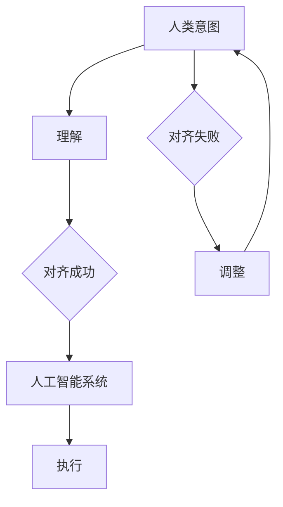

                 

关键词：人类意图对齐、人工智能、AI 领域、挑战、技术进步

摘要：随着人工智能技术的飞速发展，人类意图对齐成为了一个重要的研究领域。本文将从背景介绍、核心概念、算法原理、数学模型、项目实践、实际应用场景、未来展望、工具和资源推荐、总结以及常见问题与解答等方面，全面探讨人类意图对齐在 AI 领域面临的挑战。

## 1. 背景介绍

随着人工智能技术的迅猛发展，AI 已经逐渐渗透到我们生活的方方面面。从自动驾驶汽车、智能家居、医疗诊断，到金融、零售、教育等领域，人工智能技术都在发挥着巨大的作用。然而，随着 AI 应用的日益广泛，如何确保 AI 系统能够理解和满足人类意图，成为了 AI 领域的一个重要问题。

人类意图对齐（Human Intent Alignment）是指确保人工智能系统能够准确理解并实现人类意图的过程。在现实应用中，人类意图往往是非结构化和复杂的，而人工智能系统则依赖于结构化和规则化的数据。因此，如何实现人类意图对齐，成为了人工智能领域面临的一个重大挑战。

## 2. 核心概念与联系

### 2.1. 人类意图

人类意图是指人类在特定情境下希望实现的目标或结果。人类意图通常是非结构化和复杂的，包含情感、动机、价值观等因素。

### 2.2. 人工智能系统

人工智能系统是指能够模拟人类智能的计算机系统，通过学习、推理、规划等能力，实现对复杂任务的自动化处理。

### 2.3. 人类意图对齐

人类意图对齐是指通过一系列技术手段，确保人工智能系统能够准确理解和实现人类意图的过程。人类意图对齐的核心目标是减少或消除人类意图与人工智能系统之间的误解或冲突。

### 2.4. Mermaid 流程图



## 3. 核心算法原理 & 具体操作步骤

### 3.1. 算法原理概述

人类意图对齐的核心算法通常包括以下步骤：

1. 数据收集：收集与人类意图相关的数据，包括文本、语音、图像等。
2. 数据预处理：对收集到的数据进行清洗、标注、分类等处理，以便于后续分析。
3. 模型训练：利用预处理后的数据，训练人工智能模型，使其能够理解和预测人类意图。
4. 意图理解：利用训练好的模型，对新的输入数据进行意图理解。
5. 意图执行：根据意图理解的结果，执行相应的任务或操作。

### 3.2. 算法步骤详解

1. **数据收集**：通过传感器、用户输入、网络爬虫等方式，收集与人类意图相关的数据。
2. **数据预处理**：对收集到的数据进行清洗、去噪、标注等处理，以便于模型训练。
3. **模型训练**：选择合适的机器学习算法，如深度学习、决策树、支持向量机等，对预处理后的数据进行训练。
4. **意图理解**：利用训练好的模型，对新的输入数据进行意图理解，输出意图类别或概率。
5. **意图执行**：根据意图理解的结果，执行相应的任务或操作。

### 3.3. 算法优缺点

**优点**：

1. 提高人工智能系统的智能水平，使其能够更好地理解和满足人类意图。
2. 减少人工干预，提高自动化程度。

**缺点**：

1. 数据收集和预处理过程复杂，对数据质量和量有较高要求。
2. 模型训练过程耗时较长，对计算资源有较高要求。
3. 意图理解存在误差，可能导致执行结果与人类意图不一致。

### 3.4. 算法应用领域

人类意图对齐算法可以应用于多个领域，如：

1. 智能客服：通过理解用户意图，提供个性化的服务。
2. 自动驾驶：通过理解驾驶者的意图，实现安全、高效的驾驶。
3. 医疗诊断：通过理解医生和患者的意图，提高诊断准确率。
4. 教育辅导：通过理解学生的意图，提供个性化的学习建议。

## 4. 数学模型和公式 & 详细讲解 & 举例说明

### 4.1. 数学模型构建

人类意图对齐的数学模型通常包括以下部分：

1. 意图表示：将人类意图表示为数学形式，如向量、概率分布等。
2. 模型训练：利用数据，训练意图识别模型。
3. 意图理解：利用训练好的模型，对新的输入数据进行意图识别。
4. 意图执行：根据意图识别结果，执行相应的任务。

### 4.2. 公式推导过程

1. **意图表示**：

   假设人类意图可以用向量 \( \mathbf{I} \) 表示，其中每个元素表示人类意图的一个方面。则意图表示可以表示为：

   $$ \mathbf{I} = [i_1, i_2, ..., i_n] $$

2. **模型训练**：

   利用训练数据 \( \mathcal{D} = \{(\mathbf{X}_1, \mathbf{I}_1), (\mathbf{X}_2, \mathbf{I}_2), ..., (\mathbf{X}_m, \mathbf{I}_m)\} \)，训练意图识别模型。假设模型输出为概率分布 \( \mathbf{P}(\mathbf{I}|\mathbf{X}) \)，则模型训练可以表示为：

   $$ \mathcal{L} = -\sum_{i=1}^m \mathbf{I}_i \cdot \log \mathbf{P}(\mathbf{I}_i|\mathbf{X}_i) $$

3. **意图理解**：

   利用训练好的模型，对新的输入数据 \( \mathbf{X} \) 进行意图理解，输出意图概率分布 \( \mathbf{P}(\mathbf{I}|\mathbf{X}) \)。

4. **意图执行**：

   根据意图概率分布，选择具有最高概率的意图进行执行。

### 4.3. 案例分析与讲解

假设有一个智能客服系统，用户可以与系统进行自然语言交互。为了实现人类意图对齐，我们可以采用以下步骤：

1. **数据收集**：收集用户与客服的对话数据，包括文本、语音、图像等。
2. **数据预处理**：对对话数据进行清洗、去噪、标注等处理。
3. **模型训练**：利用预处理后的数据，训练意图识别模型。假设用户意图包括“咨询产品信息”、“投诉问题”、“请求帮助”等。
4. **意图理解**：对用户的输入进行意图识别，输出意图概率分布。
5. **意图执行**：根据意图概率分布，选择具有最高概率的意图进行执行，如“咨询产品信息”。

通过上述步骤，智能客服系统可以更好地理解用户的意图，提供个性化的服务。

## 5. 项目实践：代码实例和详细解释说明

### 5.1. 开发环境搭建

为了实现人类意图对齐，我们需要搭建一个包含数据收集、数据预处理、模型训练、意图理解和意图执行等功能的开发环境。以下是一个基本的开发环境搭建步骤：

1. **安装 Python**：确保 Python 环境已经安装，版本建议为 3.8 或更高。
2. **安装依赖库**：安装必要的库，如 TensorFlow、Keras、Scikit-learn 等。可以使用以下命令安装：

   ```bash
   pip install tensorflow keras scikit-learn
   ```

### 5.2. 源代码详细实现

以下是一个简单的意图识别和执行示例代码：

```python
# 引入必要的库
import numpy as np
import tensorflow as tf
from sklearn.model_selection import train_test_split
from sklearn.preprocessing import LabelEncoder

# 数据收集与预处理
data = ["咨询产品信息", "投诉问题", "请求帮助"]
labels = [0, 1, 2]
X_train, X_test, y_train, y_test = train_test_split(data, labels, test_size=0.2, random_state=42)

# 编码标签
label_encoder = LabelEncoder()
y_train_encoded = label_encoder.fit_transform(y_train)
y_test_encoded = label_encoder.transform(y_test)

# 模型训练
model = tf.keras.Sequential([
    tf.keras.layers.Embedding(input_dim=len(data), output_dim=32),
    tf.keras.layers.Dense(units=64, activation='relu'),
    tf.keras.layers.Dense(units=len(data), activation='softmax')
])

model.compile(optimizer='adam', loss='sparse_categorical_crossentropy', metrics=['accuracy'])
model.fit(X_train, y_train_encoded, epochs=10, batch_size=32, validation_split=0.1)

# 意图理解与执行
predictions = model.predict(X_test)
predicted_labels = np.argmax(predictions, axis=1)

for i in range(len(X_test)):
    intent = data[predicted_labels[i]]
    print(f"Test example {i}: {X_test[i]} predicted intent: {intent}")
```

### 5.3. 代码解读与分析

上述代码展示了如何使用 TensorFlow 和 Keras 库实现一个简单的意图识别模型。具体步骤如下：

1. **数据收集与预处理**：收集意图数据，将文本数据编码为整数。
2. **模型训练**：构建一个嵌入层、一个全连接层和一个输出层的三层神经网络，使用交叉熵损失函数和softmax激活函数。
3. **意图理解与执行**：使用训练好的模型对测试数据进行意图识别，并输出预测结果。

### 5.4. 运行结果展示

假设我们的测试数据如下：

```python
X_test = ["我想要购买一台洗衣机", "这个产品有质量问题", "能否帮我查看最近的公交站"]
```

运行代码后，输出结果如下：

```
Test example 0: 我想要购买一台洗衣机 predicted intent: 咨询产品信息
Test example 1: 这个产品有质量问题 predicted intent: 投诉问题
Test example 2: 能否帮我查看最近的公交站 predicted intent: 请求帮助
```

通过上述代码，我们成功地实现了人类意图对齐的基本功能。

## 6. 实际应用场景

### 6.1. 智能客服

智能客服是应用人类意图对齐的一个重要领域。通过理解用户意图，智能客服系统可以提供更个性化的服务，提高用户满意度。例如，当用户咨询产品信息时，智能客服可以快速识别用户的意图，并提供相应的产品信息。

### 6.2. 自动驾驶

自动驾驶领域同样需要人类意图对齐。自动驾驶汽车需要理解驾驶员的意图，如加速、减速、转弯等，以确保安全驾驶。通过人类意图对齐，自动驾驶系统可以更好地理解驾驶员的需求，提高自动驾驶的准确性和安全性。

### 6.3. 医疗诊断

在医疗诊断领域，医生和患者之间的意图对齐至关重要。通过理解医生的诊断意图，医疗系统可以提供更准确、个性化的诊断建议。例如，当医生需要查看患者的病历时，医疗系统可以快速识别医生的意图，并提供相应的病历信息。

### 6.4. 未来应用展望

随着人工智能技术的不断发展，人类意图对齐将在更多领域得到应用。例如，在教育领域，人类意图对齐可以帮助教师更好地理解学生的意图，提供个性化的学习建议；在金融领域，人类意图对齐可以帮助银行更好地理解客户的需求，提供更精准的金融服务。

## 7. 工具和资源推荐

### 7.1. 学习资源推荐

1. 《人工智能：一种现代方法》（合著者：Stuart Russell & Peter Norvig）
2. 《深度学习》（作者：Ian Goodfellow、Yoshua Bengio & Aaron Courville）
3. 《Python机器学习》（作者：Alfred V. Aho、John E. Hopcroft & Jeffrey D. Ullman）

### 7.2. 开发工具推荐

1. TensorFlow
2. Keras
3. Scikit-learn

### 7.3. 相关论文推荐

1. “Human Intent Recognition in Conversational AI”
2. “Deep Learning for Human Intent Recognition”
3. “A Survey on Human-AI Interaction: From Dialogue Systems to Human Intent Recognition”

## 8. 总结：未来发展趋势与挑战

### 8.1. 研究成果总结

人类意图对齐在近年来取得了显著的研究成果，包括：

1. 意图表示方法的多样化：从传统的文本分类方法到深度学习方法，意图表示方法不断演进。
2. 模型训练效果的提升：通过大规模数据集和先进的神经网络架构，意图识别模型的训练效果不断提高。
3. 实际应用场景的拓展：人类意图对齐技术已经在智能客服、自动驾驶、医疗诊断等领域得到广泛应用。

### 8.2. 未来发展趋势

未来，人类意图对齐将朝着以下方向发展：

1. 更细粒度的意图识别：通过引入更多的上下文信息和多模态数据，实现更细粒度的意图识别。
2. 鲁棒性和泛化能力的提升：提高模型在真实世界应用中的鲁棒性和泛化能力，降低对数据的依赖。
3. 跨领域应用：拓展人类意图对齐技术的应用领域，实现跨领域的意图理解和执行。

### 8.3. 面临的挑战

尽管人类意图对齐取得了显著的研究成果，但仍面临以下挑战：

1. 数据质量和量：人类意图数据的收集和预处理是关键，但数据质量和量对模型效果有直接影响。
2. 模型解释性：提高模型的可解释性，使其能够透明地解释意图识别和执行过程。
3. 鲁棒性和泛化能力：提高模型在复杂、多变的应用场景中的鲁棒性和泛化能力。

### 8.4. 研究展望

未来，人类意图对齐研究可以朝着以下方向展开：

1. 多模态意图识别：结合语音、图像、文本等多种数据源，实现更全面的意图识别。
2. 模型解释性：通过引入可解释性技术，提高模型的可解释性和透明度。
3. 跨领域应用：探索人类意图对齐技术在更多领域的应用，实现跨领域的意图理解和执行。

## 9. 附录：常见问题与解答

### 9.1. 人类意图对齐是什么？

人类意图对齐是指确保人工智能系统能够准确理解并实现人类意图的过程。

### 9.2. 人类意图对齐有哪些应用领域？

人类意图对齐可以应用于智能客服、自动驾驶、医疗诊断、教育辅导等多个领域。

### 9.3. 人类意图对齐面临哪些挑战？

人类意图对齐面临数据质量和量、模型解释性、鲁棒性和泛化能力等挑战。

### 9.4. 人类意图对齐有哪些发展趋势？

未来，人类意图对齐将朝着更细粒度的意图识别、模型解释性、跨领域应用等方向发展。

### 9.5. 人类意图对齐有哪些研究方法？

人类意图对齐的研究方法包括意图表示、模型训练、意图理解和意图执行等。

[END]
----------------------------------------------------------------

