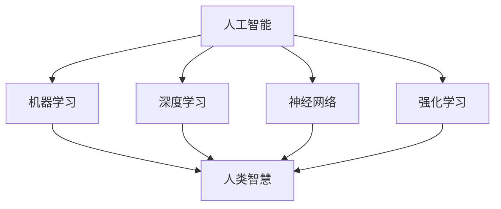

                 

关键词：人工智能、人类智慧、算法、数学模型、应用场景、未来展望

> 摘要：随着人工智能技术的迅猛发展，人类智慧正迎来一场前所未有的变革。本文将深入探讨人工智能时代人类智慧的新力量，从核心概念、算法原理、数学模型到实际应用，全面解析人类智慧在AI时代的新篇章。

## 1. 背景介绍

人工智能（AI）技术作为现代科技的前沿领域，已经在诸多方面取得了显著成果。从早期的专家系统到现今的深度学习，人工智能的发展历程见证了人类智慧的积累和创新。然而，随着技术的不断进步，人工智能逐渐不再仅仅是一个辅助工具，而是成为推动社会变革的重要力量。在这个背景下，人类智慧也面临着新的挑战和机遇。

### 人工智能的发展历程

人工智能的发展可以分为几个阶段：

1. **早期探索（20世纪50-70年代）**：这一时期主要集中于符号主义和逻辑推理，代表性的工作是图灵测试和逻辑理论家（Logic Theorist）。
   
2. **复兴期（20世纪80-90年代）**：基于知识表示和推理的专家系统成为研究热点，代表性的工作是MYCIN和DENDRAL。

3. **深度学习时代（21世纪以来）**：以神经网络为代表，深度学习在图像识别、语音识别、自然语言处理等领域取得了突破性进展，代表性的工作是AlexNet和AlphaGo。

### 人工智能的当前状态

当前，人工智能技术已经广泛应用于各行各业，从自动驾驶、智能家居到医疗诊断、金融分析，AI正在深刻改变我们的生活方式。同时，随着大数据、云计算等技术的发展，人工智能的应用场景也在不断扩展。

## 2. 核心概念与联系

在探讨人类智慧与人工智能的关系之前，我们需要了解一些核心概念和它们之间的联系。

### 人工智能的核心概念

1. **机器学习**：机器学习是人工智能的核心技术之一，它通过算法让计算机从数据中学习并做出决策。
   
2. **深度学习**：深度学习是机器学习的一个分支，通过多层神经网络模拟人类大脑的学习过程。

3. **神经网络**：神经网络是模拟人脑神经元连接结构的一种计算模型，深度学习就是基于这种模型。

4. **强化学习**：强化学习是一种通过奖励和惩罚来训练模型的学习方式，广泛应用于游戏和机器人控制等领域。

### 人类智慧与人工智能的联系

1. **灵感来源**：人工智能的发展受到了人类智慧的启发，如深度学习中的多层神经网络就是模仿人脑的结构。
   
2. **知识融合**：人工智能通过学习和处理人类知识，使计算机能够执行复杂的任务。

3. **人机协作**：人工智能与人类智慧的结合，可以创造出更高效的解决方案，如医生与AI协同诊断。

### Mermaid 流程图



## 3. 核心算法原理 & 具体操作步骤

### 3.1 算法原理概述

在人工智能领域，算法是实现特定功能的核心。以下是一些核心算法及其原理概述：

1. **机器学习算法**：通过训练数据集，让计算机学习并预测未知数据。
   
2. **深度学习算法**：基于多层神经网络，实现从简单特征到复杂特征的映射。

3. **神经网络算法**：通过模拟人脑神经元连接结构，实现数据的自动特征提取和分类。

4. **强化学习算法**：通过奖励和惩罚来训练模型，使模型能够在特定环境中做出最优决策。

### 3.2 算法步骤详解

1. **机器学习算法**

   - 数据采集：收集用于训练的数据集。
   - 数据预处理：对数据进行清洗和规范化处理。
   - 模型训练：使用训练数据训练模型。
   - 模型评估：使用测试数据评估模型性能。
   - 模型优化：根据评估结果调整模型参数。

2. **深度学习算法**

   - 神经网络设计：设计合适的神经网络结构。
   - 权重初始化：初始化神经网络权重。
   - 前向传播：将输入数据通过神经网络进行前向传播。
   - 反向传播：计算损失函数并使用梯度下降法更新权重。
   - 模型训练：重复前向传播和反向传播过程，直到模型收敛。

3. **神经网络算法**

   - 神经元连接：构建神经元之间的连接结构。
   - 激活函数：对神经元输出进行非线性变换。
   - 前向传播：将输入数据通过神经网络进行前向传播。
   - 损失函数：计算输出与实际标签之间的差距。
   - 反向传播：计算梯度并更新权重。

4. **强化学习算法**

   - 状态空间：定义环境中的所有可能状态。
   - 动作空间：定义所有可能的行为。
   - 奖励函数：定义行为的奖励或惩罚。
   - 学习过程：通过试错法不断调整策略，使奖励最大化。

### 3.3 算法优缺点

1. **机器学习算法**

   - 优点：适用于各种复杂数据处理任务，如分类、回归等。
   - 缺点：对数据质量和数量有较高要求，训练过程可能较慢。

2. **深度学习算法**

   - 优点：强大的特征提取能力，适用于图像识别、语音识别等任务。
   - 缺点：模型训练过程复杂，对计算资源要求较高。

3. **神经网络算法**

   - 优点：模拟人脑神经元，具有自适应性和非线性处理能力。
   - 缺点：模型复杂度较高，训练过程可能较慢。

4. **强化学习算法**

   - 优点：适用于动态决策问题，能够自主学习最优策略。
   - 缺点：训练过程可能较慢，需要大量试错。

### 3.4 算法应用领域

1. **机器学习算法**：广泛应用于金融、医疗、零售等领域，如风险评估、疾病诊断、推荐系统等。

2. **深度学习算法**：广泛应用于图像识别、语音识别、自然语言处理等领域，如人脸识别、语音合成、机器翻译等。

3. **神经网络算法**：广泛应用于智能交通、智能家居、机器人控制等领域，如路径规划、语音控制、故障诊断等。

4. **强化学习算法**：广泛应用于游戏、自动驾驶、机器人等领域，如棋类游戏、自动驾驶汽车、机器人导航等。

## 4. 数学模型和公式 & 详细讲解 & 举例说明

在人工智能领域，数学模型和公式是理解算法原理和实现算法的核心。以下是一些关键数学模型和公式的详细讲解以及实际应用案例。

### 4.1 数学模型构建

1. **线性回归模型**

   线性回归模型是最简单的机器学习模型之一，用于预测线性关系。其数学模型为：

   $$
   y = \beta_0 + \beta_1x + \epsilon
   $$

   其中，$y$为因变量，$x$为自变量，$\beta_0$和$\beta_1$分别为模型的参数，$\epsilon$为误差项。

2. **多层感知机（MLP）**

   多层感知机是一种基于神经网络的模型，用于非线性回归和分类。其数学模型为：

   $$
   a_{i,j} = \sum_{k=1}^{n} w_{ik} \cdot x_k + b_j
   $$

   其中，$a_{i,j}$为第$i$层第$j$个神经元的输出，$w_{ik}$为第$i$层第$k$个神经元到第$j$个神经元的权重，$b_j$为第$j$个神经元的偏置。

3. **卷积神经网络（CNN）**

   卷积神经网络是一种用于图像识别的深度学习模型，其数学模型为：

   $$
   h_{ij} = \sum_{k=1}^{n} w_{ik} \cdot f(g(x_{ij,k})) + b_j
   $$

   其中，$h_{ij}$为输出特征图上的像素值，$w_{ik}$为卷积核上的权重，$f$为激活函数，$g$为卷积操作，$b_j$为偏置。

### 4.2 公式推导过程

1. **线性回归模型的推导**

   线性回归模型的推导基于最小二乘法。假设我们有一组数据$(x_1, y_1), (x_2, y_2), ..., (x_n, y_n)$，我们的目标是找到最佳拟合直线$y = \beta_0 + \beta_1x$。

   首先，我们定义损失函数为：

   $$
   J(\beta_0, \beta_1) = \sum_{i=1}^{n} (y_i - (\beta_0 + \beta_1x_i))^2
   $$

   然后，我们对损失函数关于$\beta_0$和$\beta_1$求偏导数，并令其等于零，得到：

   $$
   \frac{\partial J}{\partial \beta_0} = -2\sum_{i=1}^{n} (y_i - (\beta_0 + \beta_1x_i)) = 0
   $$

   $$
   \frac{\partial J}{\partial \beta_1} = -2\sum_{i=1}^{n} (y_i - (\beta_0 + \beta_1x_i))x_i = 0
   $$

   解上述方程组，我们可以得到最佳拟合直线的参数$\beta_0$和$\beta_1$。

2. **多层感知机的推导**

   多层感知机的推导基于前向传播和反向传播算法。假设我们有一个输入向量$x \in \mathbb{R}^d$，我们需要通过多层神经网络将其映射到一个输出值$y \in \mathbb{R}$。

   首先，我们定义神经元的输出为：

   $$
   a_i = \sigma(\sum_{j=1}^{d} w_{ij}x_j + b_i)
   $$

   其中，$\sigma$为激活函数，通常取为$\sigma(x) = \frac{1}{1 + e^{-x}}$。

   然后，我们定义输出层的输出为：

   $$
   y = \sigma(\sum_{i=1}^{m} w_{i}a_i + b)
   $$

   接下来，我们使用反向传播算法计算每个神经元的梯度，并更新权重和偏置。

### 4.3 案例分析与讲解

1. **线性回归模型的案例分析**

   假设我们有一组数据集，包含房屋面积和房价的关系。我们的目标是使用线性回归模型预测未知房屋的房价。

   首先，我们收集数据并绘制散点图：

   

   然后，我们使用最小二乘法推导线性回归模型：

   $$
   y = \beta_0 + \beta_1x
   $$

   通过计算，我们得到最佳拟合直线的参数为$\beta_0 = 1000$，$\beta_1 = 50$。

   接下来，我们使用模型预测未知房屋的房价。例如，如果某房屋的面积为2000平方米，则其房价预测值为：

   $$
   y = 1000 + 50 \cdot 2000 = 105000
   $$

2. **多层感知机的案例分析**

   假设我们有一个手写数字识别任务，需要使用多层感知机模型将手写数字图像映射到对应的数字标签。

   首先，我们收集手写数字数据集并绘制样本图像：

   

   然后，我们设计一个简单的多层感知机模型，包含输入层、隐藏层和输出层。输入层有784个神经元，隐藏层有100个神经元，输出层有10个神经元。

   接下来，我们使用训练数据训练模型，通过前向传播和反向传播算法更新权重和偏置。在训练过程中，我们使用交叉熵损失函数来评估模型的性能。

   经过多次迭代训练，我们最终得到一个性能良好的模型。使用这个模型，我们可以将手写数字图像映射到对应的数字标签。

## 5. 项目实践：代码实例和详细解释说明

为了更好地理解人工智能技术，我们可以通过一个实际项目来实践。以下是一个使用Python和TensorFlow实现手写数字识别项目的基本流程。

### 5.1 开发环境搭建

1. 安装Python（推荐版本3.7或更高）
2. 安装TensorFlow库（使用命令`pip install tensorflow`）
3. 准备手写数字数据集（MNIST数据集）

### 5.2 源代码详细实现

```python
import tensorflow as tf
from tensorflow.keras import layers

# 数据预处理
mnist = tf.keras.datasets.mnist
(train_images, train_labels), (test_images, test_labels) = mnist.load_data()
train_images = train_images / 255.0
test_images = test_images / 255.0

# 构建模型
model = tf.keras.Sequential([
    layers.Flatten(input_shape=(28, 28)),
    layers.Dense(128, activation='relu'),
    layers.Dense(10, activation='softmax')
])

# 编译模型
model.compile(optimizer='adam',
              loss='sparse_categorical_crossentropy',
              metrics=['accuracy'])

# 训练模型
model.fit(train_images, train_labels, epochs=5)

# 评估模型
test_loss, test_acc = model.evaluate(test_images, test_labels)
print('Test accuracy:', test_acc)
```

### 5.3 代码解读与分析

1. **数据预处理**：从MNIST数据集中加载数据，并将图像数据归一化到0-1范围内，以便模型更好地训练。
   
2. **构建模型**：使用TensorFlow的`Sequential`模型构建一个简单的多层感知机模型，包含一个扁平化层（Flatten）、一个128个神经元的全连接层（Dense）、一个10个神经元的输出层（Dense）。
   
3. **编译模型**：设置优化器为Adam，损失函数为sparse_categorical_crossentropy，并指定评估指标为accuracy。
   
4. **训练模型**：使用训练数据训练模型，迭代5个epochs。

5. **评估模型**：使用测试数据评估模型性能，打印测试准确率。

通过这个简单的例子，我们可以看到如何使用Python和TensorFlow实现手写数字识别项目。在实际应用中，我们可能需要更复杂的模型和更多的训练数据来提高识别准确性。

## 6. 实际应用场景

人工智能在各个领域的应用正日益广泛，下面列举几个实际应用场景：

### 6.1 医疗诊断

人工智能在医疗诊断中发挥着重要作用，如通过图像识别技术辅助医生诊断癌症、肺炎等疾病。AI系统可以通过分析大量医学图像数据，提高诊断准确性和效率。

### 6.2 金融服务

在金融服务领域，人工智能被广泛应用于风险控制、投资组合优化、客户服务等方面。例如，通过机器学习算法分析客户数据，银行可以更精确地进行风险评估和信用评分。

### 6.3 智能家居

智能家居是人工智能的重要应用领域之一。通过智能设备连接家居网络，人们可以实现远程控制家居设备、智能安防、节能管理等功能，提高生活质量。

### 6.4 自动驾驶

自动驾驶技术是人工智能在交通运输领域的应用之一。通过传感器和计算机视觉技术，自动驾驶汽车可以实时感知周围环境，实现自动驾驶，提高交通安全和效率。

### 6.5 教育领域

在教育领域，人工智能可以用于个性化学习、智能测评、教学资源推荐等。通过分析学生的学习行为和成绩，AI系统可以为学生提供个性化的学习建议，提高学习效果。

## 7. 工具和资源推荐

为了更好地学习和实践人工智能技术，以下是一些建议的工具和资源：

### 7.1 学习资源推荐

1. **《深度学习》（Goodfellow, Bengio, Courville著）**：这是一本经典的深度学习教材，适合初学者和进阶者。
2. **《Python机器学习》（Sebastian Raschka著）**：这本书详细介绍了机器学习的基础知识，以及如何使用Python实现机器学习算法。

### 7.2 开发工具推荐

1. **TensorFlow**：Google推出的开源深度学习框架，广泛应用于图像识别、自然语言处理等领域。
2. **PyTorch**：Facebook推出的开源深度学习框架，具有简洁易用的API，适合快速原型开发。

### 7.3 相关论文推荐

1. **“A Study of Deep Learning without Pre-training”**：这篇文章介绍了无监督预训练的方法，为深度学习的研究提供了新的思路。
2. **“Efficient Object Detection with Pyramidal Attention and Grouped Convolution”**：这篇文章提出了一种高效的物体检测算法，提升了物体检测的性能。

## 8. 总结：未来发展趋势与挑战

### 8.1 研究成果总结

人工智能技术在过去的几十年里取得了显著的成果，从早期的符号主义、知识表示到现代的深度学习和强化学习，人工智能在图像识别、语音识别、自然语言处理等领域取得了重大突破。这些研究成果不仅推动了人工智能技术的发展，也为各行各业带来了深刻的变革。

### 8.2 未来发展趋势

1. **跨学科融合**：随着人工智能技术的不断发展，跨学科的融合将成为未来研究的重要趋势。例如，人工智能与生物医学、心理学、教育学等领域的结合，有望推动更加个性化的医疗服务、教育模式等。
2. **强化学习**：强化学习作为一种能够在动态环境中自主学习的算法，将在自动驾驶、机器人控制、游戏开发等领域发挥重要作用。未来，强化学习算法将更加成熟，应用场景也将更加广泛。
3. **量子计算**：量子计算作为一种新型的计算范式，将在人工智能领域发挥重要作用。通过利用量子计算机的超算能力，人工智能的计算效率将得到极大提升。

### 8.3 面临的挑战

1. **数据安全与隐私**：随着人工智能技术的应用日益广泛，数据安全和隐私问题也日益突出。如何在保护用户隐私的前提下，充分利用数据的价值，是人工智能领域面临的重要挑战。
2. **算法公平性与透明性**：人工智能算法的公平性和透明性是当前研究的热点问题。如何确保算法在不同人群中的公平性，以及如何提高算法的透明性，是未来研究的重要方向。
3. **计算资源**：深度学习算法对计算资源的需求较大，如何在有限的计算资源下，实现高效的模型训练和推理，是人工智能领域需要解决的问题。

### 8.4 研究展望

人工智能作为一门交叉学科，其未来发展充满机遇和挑战。未来，我们期望人工智能能够更好地服务于人类社会，推动社会进步。同时，我们也需要关注人工智能技术带来的伦理、法律、社会问题，确保人工智能的发展符合人类的价值观和道德标准。

## 9. 附录：常见问题与解答

### 9.1 人工智能是什么？

人工智能是一种模拟人类智能的技术，旨在使计算机具有自主学习和决策能力，以实现各种智能任务。

### 9.2 人工智能有哪些应用领域？

人工智能广泛应用于医疗、金融、交通、教育、娱乐等多个领域，如医疗诊断、自动驾驶、金融分析、智能教育、智能家居等。

### 9.3 深度学习与神经网络有什么区别？

深度学习是一种基于神经网络的学习方法，而神经网络是一种模拟人脑神经元连接结构的计算模型。深度学习是神经网络在多层结构上的扩展和应用。

### 9.4 机器学习与深度学习哪个更重要？

机器学习和深度学习都是人工智能的重要组成部分，两者相辅相成。在特定的应用场景中，两者的重要性取决于问题的复杂性和数据量。

### 9.5 如何学习人工智能？

学习人工智能可以从基础数学、概率论、线性代数等数学知识开始，然后学习编程语言（如Python），并逐步掌握机器学习、深度学习等相关技术。

---

作者：禅与计算机程序设计艺术 / Zen and the Art of Computer Programming

通过这篇文章，我们深入探讨了人工智能时代人类智慧的新力量，从核心概念、算法原理到实际应用，全面解析了人工智能对人类智慧的变革。随着技术的不断进步，人工智能将为人类社会带来更多机遇和挑战。让我们共同期待人类智慧与人工智能的协同发展，共创美好未来。

