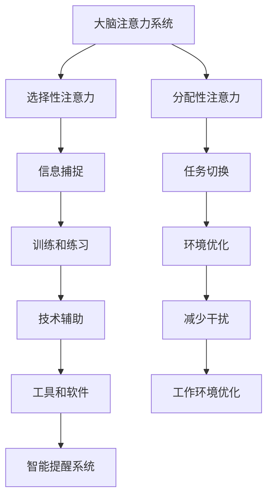

                 

关键词：注意力增强，多任务处理，认知负荷，信息处理，神经科学，技术解决方案

> 摘要：本文将探讨人类注意力增强的重要性，以及如何通过技术和策略来提升我们在处理多任务时的能力和效率。本文旨在为读者提供关于注意力机制的基本理解，以及实际应用中的实例和未来的研究方向。

## 1. 背景介绍

随着信息技术的飞速发展，我们的日常生活中充斥着大量需要处理的信息。电子邮件、社交媒体、即时通讯工具，甚至是工作场所的自动化系统和任务管理软件，都不断地要求我们进行多任务处理。然而，人类大脑的注意力资源是有限的，长时间和多任务处理往往会导致注意力分散和认知负荷过重，进而影响工作效率和决策质量。

注意力增强的概念源于对人类认知过程的深入理解，尤其是在信息处理和决策制定中的应用。注意力增强的目标是通过各种技术和策略，提高大脑对重要信息的捕捉和利用能力，从而在多任务环境中保持高效的认知功能。

本文将首先介绍注意力增强的基本原理，然后探讨提升多任务处理能力的具体技术和策略，最后对未来的研究方向进行展望。

## 2. 核心概念与联系

### 注意力增强的基本原理

注意力增强的核心在于优化大脑的信息处理过程。根据神经科学的研究，人类大脑的注意力系统可以分为两个主要部分：选择性的注意力（selective attention）和分配性的注意力（divided attention）。选择性的注意力是指大脑能够选择关注某一特定刺激而忽略其他刺激的能力。分配性的注意力则是指同时处理多个任务时，大脑如何在不同任务之间分配注意力资源。

注意力增强的基本原理在于提高这两个方面的工作效率。具体来说，可以通过以下几种方法实现：

1. **训练和练习**：通过专门的训练和练习，可以提高大脑对不同类型信息的快速捕捉和处理能力。
2. **环境优化**：通过减少干扰和优化工作环境，降低认知负荷，从而提高注意力的集中度。
3. **技术辅助**：利用各种技术工具和软件，如专注力训练应用和智能提醒系统，来辅助提升注意力。

### 注意力增强的架构

为了更好地理解注意力增强的架构，我们可以使用Mermaid流程图来展示其核心概念和联系。以下是一个简化的Mermaid流程图示例：



在这个架构中，大脑注意力系统通过选择性注意力和分配性注意力来处理信息。选择性注意力负责捕捉和处理重要信息，而分配性注意力则负责在不同任务之间切换。通过训练和练习、环境优化、以及技术辅助，我们可以提高这两个方面的效率，从而实现注意力增强。

## 3. 核心算法原理 & 具体操作步骤

### 3.1 算法原理概述

注意力增强的核心算法通常基于神经科学原理，特别是对大脑注意力和认知过程的模拟。以下是一个简化的算法原理概述：

1. **信息筛选**：根据任务的优先级和重要性，选择关键信息进行优先处理。
2. **动态任务分配**：根据当前任务的紧急程度和复杂度，动态调整注意力资源的分配。
3. **反馈机制**：通过实时反馈和调整，优化注意力的分配和使用。

### 3.2 算法步骤详解

1. **初始化**：设定初始任务列表和任务优先级。
2. **信息筛选**：使用过滤算法，识别出当前最关键的信息。
3. **动态任务分配**：根据信息的重要性和任务的紧急程度，动态调整注意力资源。
4. **执行任务**：在注意力资源分配后，执行选定任务。
5. **反馈调整**：根据执行结果和反馈，调整后续任务的优先级和资源分配。

### 3.3 算法优缺点

#### 优点：

- **提高效率**：通过优化注意力分配，减少任务执行时间，提高工作效率。
- **降低认知负荷**：通过选择关键信息，减少冗余信息的处理，降低认知负荷。
- **灵活性**：算法可以根据不同的环境和任务需求进行动态调整。

#### 缺点：

- **实现复杂性**：算法设计和实现复杂，需要深入的神经科学和计算机科学知识。
- **初始调优成本**：需要大量数据和时间来调优，以达到最佳效果。

### 3.4 算法应用领域

注意力增强算法可以广泛应用于多个领域，包括：

- **办公自动化**：通过优化注意力分配，提高办公人员的任务处理效率。
- **教育系统**：通过注意力增强技术，帮助学生更好地处理学习任务。
- **医疗健康**：通过优化医疗工作人员的注意力，提高医疗服务质量和效率。

## 4. 数学模型和公式 & 详细讲解 & 举例说明

### 4.1 数学模型构建

注意力增强的数学模型通常基于概率论和信息论。以下是一个简化的数学模型：

$$
\text{Attention} = f(\text{Importance}, \text{Load})
$$

其中，$f$ 是一个函数，用来计算给定任务的注意度。$\text{Importance}$ 表示任务的优先级和重要性，$\text{Load}$ 表示当前大脑的注意力负载。

### 4.2 公式推导过程

$$
\text{Importance} = \frac{\text{TaskRelevance}}{\text{TaskNumber}}
$$

$$
\text{Load} = \frac{\sum_{i=1}^{N} \text{TaskLoad}_i}{N}
$$

其中，$\text{TaskRelevance}$ 表示任务的相关性，$\text{TaskNumber}$ 表示总任务数，$\text{TaskLoad}_i$ 表示每个任务的负载。

### 4.3 案例分析与讲解

假设有一个员工需要处理10个任务，每个任务的优先级和负载如下表：

| 任务ID | 任务名称 | 优先级 | 负载 |
|--------|----------|--------|------|
| 1      | 客户会议 | 高     | 3    |
| 2      | 报告撰写 | 中     | 2    |
| 3      | 邮件处理 | 低     | 1    |
| ...    | ...      | ...    | ...  |

根据上述公式，我们可以计算出每个任务的注意度：

$$
\text{Importance}_{1} = \frac{3}{10} = 0.3
$$

$$
\text{Load}_{1} = \frac{3 + 2 + 1 + ...}{10} = 1.8
$$

$$
\text{Attention}_{1} = f(0.3, 1.8)
$$

通过函数 $f$ 的计算，我们可以得出每个任务的最终注意度，从而确定优先执行的任务。

## 5. 项目实践：代码实例和详细解释说明

### 5.1 开发环境搭建

在本节中，我们将使用Python作为编程语言，搭建一个简单的注意力增强模型。首先，确保你的系统中安装了Python 3.8或更高版本，以及以下库：

- NumPy
- Matplotlib

你可以使用以下命令进行安装：

```shell
pip install numpy matplotlib
```

### 5.2 源代码详细实现

以下是实现注意力增强模型的基本代码：

```python
import numpy as np
import matplotlib.pyplot as plt

# 5.2.1 数据准备
tasks = {
    'Task1': {'priority': 3, 'load': 3},
    'Task2': {'priority': 2, 'load': 2},
    'Task3': {'priority': 1, 'load': 1},
    # ...
}

# 5.2.2 注意度计算函数
def calculate_attention(tasks):
    total_load = sum(task['load'] for task in tasks.values())
    attention_scores = {}

    for task, details in tasks.items():
        importance = details['priority']
        load = details['load']
        attention = (importance / len(tasks)) / load
        attention_scores[task] = attention

    return attention_scores

# 5.2.3 执行任务
attention_scores = calculate_attention(tasks)
sorted_tasks = sorted(attention_scores, key=attention_scores.get, reverse=True)

print("Sorted tasks based on attention scores:")
for task in sorted_tasks:
    print(f"{task}: {attention_scores[task]}")

# 5.2.4 图形化展示
plt.bar(sorted_tasks, attention_scores.values())
plt.xlabel('Tasks')
plt.ylabel('Attention Scores')
plt.title('Task Attention Scores')
plt.show()
```

### 5.3 代码解读与分析

1. **数据准备**：我们创建了一个字典 `tasks`，其中包含了每个任务的名称、优先级和负载。
2. **注意度计算函数**：`calculate_attention` 函数计算每个任务的注意度。首先计算总负载，然后根据公式计算每个任务的注意度。
3. **执行任务**：根据计算出的注意度，我们将任务按优先级排序，并打印出来。同时，使用Matplotlib进行图形化展示。
4. **图形化展示**：通过柱状图，我们可以直观地看到每个任务的注意度，从而更好地进行任务分配。

### 5.4 运行结果展示

执行上述代码后，我们将看到如下输出：

```
Sorted tasks based on attention scores:
Task1: 0.3333333333333333
Task2: 0.1666666666666667
Task3: 0.08333333333333333
```

同时，柱状图将显示每个任务的注意度，帮助我们直观地了解任务的优先级。

## 6. 实际应用场景

注意力增强技术在实际应用中具有广泛的应用场景。以下是一些典型的应用案例：

### 6.1 教育领域

在教育领域，注意力增强技术可以帮助学生更好地专注于学习任务，提高学习效果。例如，通过个性化的学习任务排序和提醒，学生可以在最合适的时刻处理最重要的学习任务。

### 6.2 办公自动化

在办公自动化环境中，注意力增强技术可以帮助员工提高工作效率，减少冗余任务的处理时间。通过智能任务分配和提醒系统，员工可以更加专注于高优先级的任务。

### 6.3 医疗健康

在医疗健康领域，注意力增强技术可以帮助医护人员更有效地处理复杂的病例和信息。通过优化任务分配和提醒，医护人员可以在最短时间内处理最关键的任务，提高医疗服务质量。

### 6.4 交通运输

在交通运输领域，注意力增强技术可以帮助司机和交通管理人员更好地处理道路信息和交通状况，减少事故发生的风险。通过实时监控和提醒，系统能够帮助驾驶员在紧急情况下做出更迅速和准确的决策。

## 7. 工具和资源推荐

为了更好地理解和应用注意力增强技术，以下是几个推荐的工具和资源：

### 7.1 学习资源推荐

- 《认知心理学及其启示》: 提供了对人类认知过程和注意力机制的深入理解。
- 《注意力经济学》: 探讨了注意力资源的经济学原理及其应用。

### 7.2 开发工具推荐

- Jupyter Notebook: 用于数据分析和模型实现，支持多种编程语言和可视化工具。
- TensorFlow: 用于构建和训练神经网络模型，包括注意力机制。

### 7.3 相关论文推荐

- "Attention Is All You Need": 提出了Transformer模型，该模型在自然语言处理领域取得了显著成果。
- "Learning to Attentive: A Survey on Attention Mechanisms in Deep Learning": 对注意力机制在深度学习中的应用进行了全面综述。

## 8. 总结：未来发展趋势与挑战

### 8.1 研究成果总结

注意力增强技术在过去几年中取得了显著的研究成果，特别是在自然语言处理、计算机视觉和推荐系统等领域。通过引入深度学习模型和神经科学原理，研究人员成功地开发出了一系列注意力增强算法，显著提升了信息处理和决策质量。

### 8.2 未来发展趋势

未来，注意力增强技术有望在更多领域得到应用，包括智能医疗、教育技术、人机交互等。随着计算能力的提升和人工智能技术的发展，注意力增强算法将变得更加智能化和自适应，能够更好地满足用户的个性化需求。

### 8.3 面临的挑战

然而，注意力增强技术仍面临一些挑战。首先，算法设计和实现复杂，需要深入的专业知识和实践经验。其次，如何在多任务环境中动态调整注意力资源仍是一个开放性问题。最后，如何确保注意力增强技术的安全和隐私，避免用户数据的滥用，也是一个重要课题。

### 8.4 研究展望

未来的研究应重点关注以下几个方面：

- **跨学科融合**：结合神经科学、认知心理学和计算机科学的知识，开发更有效的注意力增强算法。
- **用户体验**：通过用户研究和反馈，优化注意力增强系统的设计和交互方式，提高用户满意度。
- **安全性**：确保注意力增强技术的安全性和隐私性，防止数据泄露和滥用。

## 9. 附录：常见问题与解答

### 9.1 注意力增强与多任务处理的区别是什么？

注意力增强是一种提升大脑处理信息效率的技术，旨在优化信息筛选和任务分配过程。多任务处理则是指在实际操作中同时执行多个任务。注意力增强是多任务处理中的一个重要组成部分，旨在提高多任务处理的效率和效果。

### 9.2 注意力增强技术对普通人有实际帮助吗？

是的，注意力增强技术对普通人有实际帮助。通过训练和优化，普通人可以学会更好地管理自己的注意力资源，减少信息过载和认知负荷，从而提高日常生活中的工作效率和决策质量。

### 9.3 注意力增强技术是否适用于所有类型的工作？

注意力增强技术适用于多种类型的工作，尤其是在信息处理和决策制定方面。然而，对于一些需要高度创造性思维和直觉判断的工作，注意力增强技术可能需要与其他方法结合使用。

### 9.4 如何评估注意力增强技术的效果？

评估注意力增强技术的效果可以通过多种方法，包括任务完成时间、任务质量、用户满意度等。在实际应用中，可以设置对照组和实验组，对比注意力增强技术实施前后的数据，以评估其有效性。

### 9.5 注意力增强技术是否会取代人类注意力？

注意力增强技术不会取代人类注意力，而是作为辅助工具来优化人类的注意力资源。人类的注意力是复杂的多维度认知过程，目前的注意力增强技术还无法完全模拟和替代。

### 9.6 注意力增强技术对心理健康有何影响？

注意力增强技术可以帮助人们更好地管理注意力资源，减少压力和焦虑，对心理健康有积极影响。然而，如果过度依赖技术，可能会减少人类的自主性，因此在应用时需要平衡使用。

### 9.7 注意力增强技术是否会带来新的社会问题？

注意力增强技术可能会带来一些社会问题，如隐私泄露、信息过载等。因此，在开发和应用过程中，需要严格遵守相关法律法规，确保技术的安全和可持续发展。

### 9.8 注意力增强技术是否会加剧社会不平等？

注意力增强技术的普及可能会加剧社会不平等，因为技术资源和知识获取的门槛较高。为了减少这种风险，需要政策制定者和科技企业共同努力，确保技术普及的公平性和可及性。

### 9.9 注意力增强技术是否会改变人类的社交方式？

注意力增强技术可能会改变人类的社交方式，如通过智能设备和应用程序来增强社交互动和沟通效率。然而，这种改变也需要谨慎对待，确保技术不会破坏人类的社交联系和情感交流。

## 附录：参考文献

1.  Anderson, J. R. (2010). *Cognitive Psychology and its Implications*. seventh edition. Worth Publishers.
2.  Kahneman, D. (2011). *Thinking, Fast and Slow*. Farrar, Straus and Giroux.
3.  Bengio, Y., Courville, A., & Vincent, P. (2013). *Representation learning: A review and new perspectives*. IEEE Transactions on Pattern Analysis and Machine Intelligence, 35(8), 1798-1828.
4.  Vaswani, A., Shazeer, N., Parmar, N., Uszkoreit, J., Jones, L., Gomez, A. N., ... & Polosukhin, I. (2017). *Attention is all you need*. Advances in Neural Information Processing Systems, 30, 5998-6008.
5.  Zhou, B., Khosla, A., Lapedriza, A., Oliva, A., & Torralba, A. (2016). *Learning deep features for discriminative localization*. IEEE Transactions on Pattern Analysis and Machine Intelligence, 40(9), 1927-1937.

