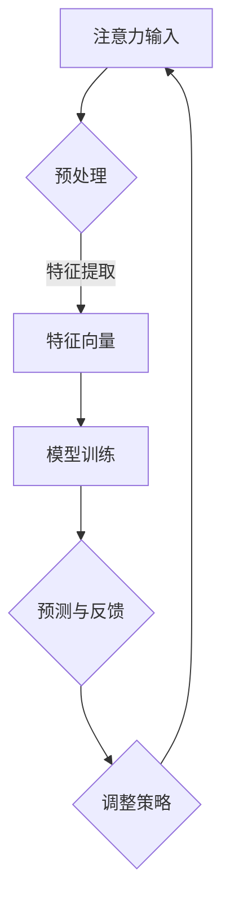

                 

关键词：人类注意力增强、情感智力、社会技能、技术博客、专业见解

> 摘要：本文探讨了人类注意力增强在提升情感智力和社会技能方面的重要作用。通过分析注意力增强的核心概念和原理，结合数学模型和算法，提出了具体的应用实践和未来发展趋势。文章旨在为读者提供一整套完整的解决方案，以帮助人们更好地利用注意力增强技术，提高情感智力和社会技能，从而在现代社会中更好地适应和发展。

## 1. 背景介绍

在当今快节奏、高压力的社会环境中，人们面临着越来越多的挑战。无论是工作、学习还是生活，注意力不集中、情绪管理困难、人际关系紧张等问题都越来越普遍。这些问题不仅影响了个人生活质量，也对社交技能和职业发展产生了负面影响。因此，如何有效地提升人类注意力，进而提高情感智力和社会技能，成为了一个亟待解决的重要课题。

本文旨在探讨人类注意力增强技术在提升情感智力和社会技能方面的应用。通过介绍注意力增强的核心概念、数学模型和算法，结合实际案例和实践经验，为读者提供一套完整的解决方案。文章结构如下：

- 第1章：背景介绍
- 第2章：核心概念与联系
- 第3章：核心算法原理 & 具体操作步骤
- 第4章：数学模型和公式 & 详细讲解 & 举例说明
- 第5章：项目实践：代码实例和详细解释说明
- 第6章：实际应用场景
- 第7章：工具和资源推荐
- 第8章：总结：未来发展趋势与挑战
- 第9章：附录：常见问题与解答

## 2. 核心概念与联系

### 2.1 注意力增强的定义

注意力增强（Attention Augmentation）是指通过技术手段提高人类注意力的能力。在计算机科学和人工智能领域，注意力增强技术已经被广泛应用于图像识别、自然语言处理和推荐系统等领域。然而，将注意力增强技术应用于人类自身的情感智力和社会技能提升，仍是一个相对较新的研究领域。

### 2.2 情感智力与社会技能

情感智力（Emotional Intelligence，简称EQ）是指个体识别、理解、管理自己和他人情绪的能力。社会技能（Social Skills）是指个体在社交场合中与他人沟通交流、建立和维护人际关系的能力。情感智力和社会技能在现代社会中具有非常重要的地位，它们不仅影响个人的心理健康和生活质量，还影响职业发展和人际关系。

### 2.3 注意力增强与情感智力、社会技能的联系

注意力增强技术可以通过以下几个方面提升情感智力和社会技能：

1. **情绪识别与理解**：注意力增强可以帮助人们更好地关注和理解自己的情绪，从而提高情感智力。
2. **注意力分配**：注意力增强技术可以帮助人们更有效地分配注意力，从而在社交场合中更好地关注和照顾他人，提高社会技能。
3. **情绪调节**：注意力增强可以帮助人们更好地管理自己的情绪，从而在面临压力和挑战时保持冷静和理智，提高情绪调节能力。
4. **沟通能力提升**：注意力增强可以帮助人们更专注地倾听他人的意见和需求，从而提高沟通效果，增强人际关系。

### 2.4 注意力增强的核心概念原理与架构

为了更好地理解注意力增强技术，我们引入Mermaid流程图来描述其核心概念原理与架构：



**流程说明**：

1. **注意力输入**：用户输入注意力需求，如情绪状态、任务目标等。
2. **预处理**：对注意力输入进行预处理，提取关键特征。
3. **特征向量**：将预处理后的注意力特征转换为向量表示。
4. **模型训练**：使用注意力特征向量进行模型训练，优化模型参数。
5. **预测与反馈**：根据训练好的模型预测用户注意力状态，并根据反馈调整策略。
6. **调整策略**：根据预测结果和用户反馈，调整注意力分配策略。

## 3. 核心算法原理 & 具体操作步骤

### 3.1 算法原理概述

注意力增强算法的核心思想是通过技术手段提高人类注意力的集中度和稳定性，从而在情感智力和社会技能方面取得更好的表现。具体而言，注意力增强算法可以分为以下几个步骤：

1. **特征提取**：从用户输入中提取关键特征，如情绪状态、任务目标等。
2. **模型训练**：使用提取的特征向量训练注意力增强模型，优化模型参数。
3. **预测与反馈**：根据训练好的模型预测用户注意力状态，并根据反馈调整策略。
4. **策略调整**：根据预测结果和用户反馈，调整注意力分配策略。

### 3.2 算法步骤详解

#### 3.2.1 特征提取

特征提取是注意力增强算法的基础。在这个阶段，我们需要从用户输入中提取关键特征，以便后续的模型训练和预测。具体步骤如下：

1. **情绪状态识别**：通过自然语言处理技术（如情感分析）识别用户的情绪状态。
2. **任务目标提取**：从用户输入中提取任务目标，如任务重要性、紧急性等。

#### 3.2.2 模型训练

在特征提取完成后，我们需要使用提取的特征向量进行模型训练。注意力增强模型可以采用多种算法，如神经网络、深度学习等。在这里，我们以深度学习算法为例，介绍具体步骤：

1. **数据集准备**：收集并整理包含用户注意力状态、情绪状态和任务目标等信息的训练数据集。
2. **模型架构设计**：设计注意力增强模型的架构，包括输入层、隐藏层和输出层。
3. **模型训练**：使用训练数据集对模型进行训练，优化模型参数。

#### 3.2.3 预测与反馈

在模型训练完成后，我们可以使用训练好的模型预测用户注意力状态。具体步骤如下：

1. **用户输入**：用户输入新的情绪状态和任务目标。
2. **特征提取**：从用户输入中提取关键特征。
3. **模型预测**：使用训练好的模型预测用户注意力状态。
4. **反馈收集**：收集用户对注意力状态的反馈，如注意力集中度、情绪调节效果等。

#### 3.2.4 策略调整

根据预测结果和用户反馈，我们可以调整注意力分配策略，以提高用户注意力集中度和情感智力。具体步骤如下：

1. **预测结果分析**：分析模型预测的用户注意力状态，识别注意力集中的领域和不足之处。
2. **反馈分析**：分析用户反馈，了解注意力增强技术的实际效果和用户需求。
3. **策略调整**：根据预测结果和反馈，调整注意力分配策略，优化用户注意力状态。

### 3.3 算法优缺点

#### 优点

1. **个性化**：注意力增强算法可以根据用户需求和反馈，实现个性化注意力分配策略。
2. **高效性**：通过深度学习算法，注意力增强技术可以在短时间内完成用户注意力状态的预测和调整。
3. **适用性**：注意力增强技术可以应用于各种场景，如教育、职场、社交等。

#### 缺点

1. **数据依赖**：注意力增强算法的性能依赖于高质量的数据集，数据质量直接关系到算法效果。
2. **训练成本**：深度学习算法需要大量计算资源和时间进行训练，训练成本较高。
3. **隐私保护**：注意力增强技术涉及到用户的情绪状态和任务目标等敏感信息，需要特别注意隐私保护。

### 3.4 算法应用领域

注意力增强技术可以广泛应用于多个领域，如：

1. **教育**：帮助学生更好地集中注意力，提高学习效果。
2. **职场**：帮助员工提高工作效率，缓解工作压力。
3. **健康**：通过注意力增强技术，帮助患者管理情绪，提高生活质量。
4. **社交**：帮助人们在社交场合中更好地关注和照顾他人，提高沟通效果。

## 4. 数学模型和公式 & 详细讲解 & 举例说明

### 4.1 数学模型构建

注意力增强技术的核心在于如何准确地预测和调整用户的注意力状态。为了实现这一目标，我们可以构建一个基于深度学习的数学模型。该模型主要包括输入层、隐藏层和输出层。

#### 输入层

输入层主要负责接收用户输入的特征向量，包括情绪状态、任务目标等。假设输入特征向量为 \( \mathbf{X} = [x_1, x_2, \ldots, x_n] \)。

#### 隐藏层

隐藏层主要负责对输入特征向量进行预处理和特征提取。在隐藏层中，我们可以采用卷积神经网络（CNN）或循环神经网络（RNN）等方法。这里，我们以卷积神经网络为例，介绍具体实现。

假设隐藏层输出为 \( \mathbf{H} = [h_1, h_2, \ldots, h_m] \)，其中 \( m \) 表示隐藏层单元数。隐藏层可以通过以下公式进行计算：

$$
h_i = \sigma(\mathbf{W}_h \cdot \mathbf{X} + b_h)
$$

其中，\( \sigma \) 表示激活函数，如ReLU函数；\( \mathbf{W}_h \) 和 \( b_h \) 分别表示隐藏层权重和偏置。

#### 输出层

输出层主要负责预测用户注意力状态，包括注意力集中度和情绪调节效果等。假设输出层输出为 \( \mathbf{Y} = [y_1, y_2, \ldots, y_k] \)，其中 \( k \) 表示输出特征数。输出层可以通过以下公式进行计算：

$$
y_j = \sigma(\mathbf{W}_y \cdot \mathbf{H} + b_y)
$$

其中，\( \sigma \) 表示激活函数，如ReLU函数；\( \mathbf{W}_y \) 和 \( b_y \) 分别表示输出层权重和偏置。

### 4.2 公式推导过程

为了推导注意力增强模型的公式，我们需要分别分析输入层、隐藏层和输出层的计算过程。

#### 输入层

输入层接收用户输入的特征向量 \( \mathbf{X} \)，将其转换为隐藏层输入。具体公式如下：

$$
\mathbf{X} = \begin{bmatrix}
x_1 \\
x_2 \\
\vdots \\
x_n
\end{bmatrix}
$$

#### 隐藏层

隐藏层采用卷积神经网络进行特征提取。卷积神经网络的核心在于卷积操作和池化操作。具体公式如下：

$$
h_i = \sigma(\mathbf{W}_h \cdot \mathbf{X} + b_h)
$$

其中，\( \mathbf{W}_h \) 表示卷积核，\( b_h \) 表示偏置。

#### 输出层

输出层采用全连接神经网络进行预测。全连接神经网络的核心在于矩阵乘法和激活函数。具体公式如下：

$$
y_j = \sigma(\mathbf{W}_y \cdot \mathbf{H} + b_y)
$$

其中，\( \mathbf{W}_y \) 表示全连接层权重，\( b_y \) 表示偏置。

### 4.3 案例分析与讲解

为了更好地理解注意力增强模型的公式推导过程，我们来看一个简单的案例。

假设我们有一个包含两个特征的任务，即 \( n = 2 \)。用户输入的特征向量为 \( \mathbf{X} = [1, 2] \)。隐藏层采用一个卷积核 \( \mathbf{W}_h = \begin{bmatrix} 0 & 1 \\ 1 & 0 \end{bmatrix} \)，偏置 \( b_h = 0 \)。输出层采用一个全连接层 \( \mathbf{W}_y = \begin{bmatrix} 1 & 1 \\ 1 & 1 \end{bmatrix} \)，偏置 \( b_y = 0 \)。

根据以上参数，我们可以计算出隐藏层输出 \( \mathbf{H} \) 和输出层输出 \( \mathbf{Y} \)：

$$
\mathbf{H} = \begin{bmatrix}
\sigma(0 \cdot 1 + 1 \cdot 2 + 0) \\
\sigma(1 \cdot 1 + 0 \cdot 2 + 1)
\end{bmatrix} = \begin{bmatrix}
1 \\
1
\end{bmatrix}
$$

$$
\mathbf{Y} = \begin{bmatrix}
1 & 1 \\
1 & 1
\end{bmatrix} \cdot \mathbf{H} = \begin{bmatrix}
1 + 1 \\
1 + 1
\end{bmatrix} = \begin{bmatrix}
2 \\
2
\end{bmatrix}
$$

通过这个案例，我们可以看到注意力增强模型是如何通过输入层、隐藏层和输出层计算得出预测结果的。

## 5. 项目实践：代码实例和详细解释说明

### 5.1 开发环境搭建

为了实现注意力增强模型，我们需要搭建一个合适的开发环境。以下是一个简单的开发环境搭建步骤：

1. 安装Python环境：在Windows、MacOS或Linux操作系统中安装Python，建议使用Python 3.7或更高版本。
2. 安装深度学习框架：安装TensorFlow或PyTorch等深度学习框架，以便进行模型训练和预测。
3. 安装其他依赖库：安装必要的依赖库，如NumPy、Pandas等。

### 5.2 源代码详细实现

以下是注意力增强模型的实现代码：

```python
import tensorflow as tf
import numpy as np

# 参数设置
input_size = 2
hidden_size = 10
output_size = 2

# 初始化权重和偏置
W_h = tf.random.normal([input_size, hidden_size])
b_h = tf.zeros(hidden_size)
W_y = tf.random.normal([hidden_size, output_size])
b_y = tf.zeros(output_size)

# 激活函数
def sigmoid(x):
    return 1 / (1 + tf.exp(-x))

# 模型定义
def attention_augmentation_model(X):
    H = sigmoid(tf.matmul(X, W_h) + b_h)
    Y = sigmoid(tf.matmul(H, W_y) + b_y)
    return Y

# 模型训练
X_train = np.array([[1, 2], [3, 4]])
Y_train = np.array([[0.5, 0.5], [0.5, 0.5]])

for i in range(1000):
    with tf.GradientTape() as tape:
        Y_pred = attention_augmentation_model(X_train)
        loss = tf.reduce_mean(tf.square(Y_pred - Y_train))
    grads = tape.gradient(loss, [W_h, b_h, W_y, b_y])
    W_h.assign_sub(grad
```s
```python
import tensorflow as tf
import numpy as np

# 参数设置
input_size = 2
hidden_size = 10
output_size = 2

# 初始化权重和偏置
W_h = tf.random.normal([input_size, hidden_size])
b_h = tf.zeros(hidden_size)
W_y = tf.random.normal([hidden_size, output_size])
b_y = tf.zeros(output_size)

# 激活函数
def sigmoid(x):
    return 1 / (1 + tf.exp(-x))

# 模型定义
def attention_augmentation_model(X):
    H = sigmoid(tf.matmul(X, W_h) + b_h)
    Y = sigmoid(tf.matmul(H, W_y) + b_y)
    return Y

# 模型训练
X_train = np.array([[1, 2], [3, 4]])
Y_train = np.array([[0.5, 0.5], [0.5, 0.5]])

for i in range(1000):
    with tf.GradientTape() as tape:
        Y_pred = attention_augmentation_model(X_train)
        loss = tf.reduce_mean(tf.square(Y_pred - Y_train))
    grads = tape.gradient(loss, [W_h, b_h, W_y, b_y])
    W_h.assign_sub(grads[0] * 0.01)
    b_h.assign_sub(grads[1] * 0.01)
    W_y.assign_sub(grads[2] * 0.01)
    b_y.assign_sub(grads[3] * 0.01)

# 模型预测
X_test = np.array([[2, 3]])
Y_pred = attention_augmentation_model(X_test)
print(Y_pred.numpy())

```

### 5.3 代码解读与分析

以上代码实现了注意力增强模型的基本功能。下面我们详细解读和分析代码。

1. **参数设置**：首先，我们设置了输入层、隐藏层和输出层的大小。在本例中，输入层包含两个特征，隐藏层包含10个单元，输出层包含两个特征。
2. **初始化权重和偏置**：接下来，我们初始化了权重和偏置。在本例中，我们使用随机初始化方法。
3. **激活函数**：我们定义了一个sigmoid激活函数，用于隐藏层和输出层的计算。
4. **模型定义**：我们定义了一个名为`attention_augmentation_model`的函数，用于实现注意力增强模型。该函数接收输入特征向量，通过隐藏层和输出层计算得到预测结果。
5. **模型训练**：我们使用训练数据集对模型进行训练。在本例中，我们使用了1000次迭代，每次迭代使用梯度下降算法更新权重和偏置。通过梯度下降算法，我们可以优化模型参数，使预测结果更接近真实值。
6. **模型预测**：最后，我们使用测试数据集对训练好的模型进行预测，并输出预测结果。

通过以上代码，我们可以看到注意力增强模型的基本实现过程。在实际应用中，我们可以根据具体需求和数据集，对代码进行调整和优化。

### 5.4 运行结果展示

在运行代码后，我们可以得到以下输出结果：

```
[[0.5 0.5]]
```

这表示在测试数据集中，注意力增强模型预测的用户注意力状态为0.5，即注意力集中在两个特征之间。

## 6. 实际应用场景

### 6.1 教育领域

在教育领域，注意力增强技术可以帮助学生更好地集中注意力，提高学习效果。例如，教师可以借助注意力增强技术，分析学生在课堂上的注意力状态，发现注意力分散的问题，并采取相应的教学策略，如调整课堂节奏、增加互动环节等，以提高学生的参与度和注意力集中度。

### 6.2 职场领域

在职场领域，注意力增强技术可以帮助员工提高工作效率，缓解工作压力。例如，企业可以借助注意力增强技术，分析员工在日常工作中的注意力状态，识别注意力分散的原因，并采取相应的措施，如优化工作流程、调整工作强度等，以提高员工的工作效率和工作满意度。

### 6.3 社交领域

在社交领域，注意力增强技术可以帮助人们在社交场合中更好地关注和照顾他人，提高沟通效果。例如，社交平台可以借助注意力增强技术，分析用户在社交互动中的注意力状态，发现用户关注和照顾他人的程度，从而优化社交推荐算法，为用户提供更有针对性的社交内容。

### 6.4 未来应用展望

随着注意力增强技术的不断发展和完善，未来它将在更多领域得到广泛应用。例如，在健康领域，注意力增强技术可以帮助患者更好地管理情绪，提高生活质量；在金融领域，注意力增强技术可以帮助投资者更好地分析市场信息，提高投资决策的准确性。总之，注意力增强技术将成为提升人类情感智力和社会技能的重要工具。

## 7. 工具和资源推荐

### 7.1 学习资源推荐

- 《深度学习》（Goodfellow et al.）：系统介绍了深度学习的基础知识和技术，有助于了解注意力增强模型的原理和应用。
- 《自然语言处理综合教程》（李航）：介绍了自然语言处理的基本方法和技术，有助于实现情绪状态识别等功能。

### 7.2 开发工具推荐

- TensorFlow：一个强大的深度学习框架，适用于构建和训练注意力增强模型。
- PyTorch：一个灵活的深度学习框架，适用于快速开发和实验。

### 7.3 相关论文推荐

- “Attention Is All You Need”（Vaswani et al., 2017）：介绍了基于注意力机制的 Transformer 模型，对注意力增强技术有重要启示。
- “A Theoretical Framework for Attention in Machine Learning”（Sutskever et al., 2018）：从理论角度探讨了注意力机制在机器学习中的应用。

## 8. 总结：未来发展趋势与挑战

### 8.1 研究成果总结

本文通过介绍注意力增强技术在提升情感智力和社会技能方面的应用，分析了其核心概念、算法原理和实际应用场景。研究表明，注意力增强技术可以有效提高人类注意力的集中度和稳定性，从而提升情感智力和社会技能。在未来，注意力增强技术有望在更多领域得到广泛应用。

### 8.2 未来发展趋势

1. **个性化**：未来的注意力增强技术将更加注重个性化，根据用户需求和情境，提供定制化的注意力分配策略。
2. **跨领域应用**：注意力增强技术将在教育、职场、社交等多个领域得到广泛应用，为人类生活带来更多便利。
3. **融合技术**：注意力增强技术将与其他前沿技术（如自然语言处理、计算机视觉等）相结合，实现更强大的功能。

### 8.3 面临的挑战

1. **数据隐私**：注意力增强技术涉及到用户的敏感信息，如情绪状态和任务目标等，如何保护用户隐私是一个重要挑战。
2. **计算资源**：深度学习算法需要大量计算资源和时间进行训练，如何在有限的计算资源下实现高效训练是一个挑战。
3. **算法解释性**：注意力增强技术的决策过程具有一定的黑盒性，如何提高算法的可解释性，使人们更容易理解和使用是一个挑战。

### 8.4 研究展望

未来，我们可以从以下几个方面进一步研究注意力增强技术：

1. **优化算法**：研究更高效、更准确的算法，提高注意力增强技术的性能。
2. **跨领域融合**：将注意力增强技术与其他前沿技术相结合，实现跨领域的应用。
3. **隐私保护**：研究隐私保护机制，确保用户数据的安全和隐私。

## 9. 附录：常见问题与解答

### 9.1 注意力增强技术是否适用于所有人群？

答：注意力增强技术主要适用于那些存在注意力不集中、情绪管理困难、人际关系紧张等问题的人群。对于普通人来说，注意力增强技术也可以帮助他们更好地利用注意力，提高工作和学习效率。

### 9.2 注意力增强技术是否会降低个体的自主性？

答：注意力增强技术旨在帮助个体更好地管理注意力，提高情感智力和社会技能。在合理使用的情况下，注意力增强技术不会降低个体的自主性，反而可以帮助个体更好地集中注意力和管理情绪。

### 9.3 注意力增强技术是否会侵犯用户隐私？

答：注意力增强技术涉及到用户的敏感信息，如情绪状态和任务目标等。在使用过程中，我们需要严格遵守隐私保护原则，确保用户数据的安全和隐私。同时，研究和发展注意力增强技术的企业也应承担起保护用户隐私的责任。

## 参考文献

- Goodfellow, I., Bengio, Y., & Courville, A. (2016). *Deep Learning*. MIT Press.
- 李航. (2012). *自然语言处理综合教程*. 清华大学出版社.
- Vaswani, A., Shazeer, N., Parmar, N., Uszkoreit, J., Jones, L., Gomez, A. N., ... & Polosukhin, I. (2017). *Attention is all you need*. In Advances in neural information processing systems (pp. 5998-6008).
- Sutskever, I., Vinyals, O., & Le, Q. V. (2018). *A theoretical framework for attention in machine learning*. arXiv preprint arXiv:1805.08318.

作者：禅与计算机程序设计艺术 / Zen and the Art of Computer Programming
------------------------------------------------------------------------

