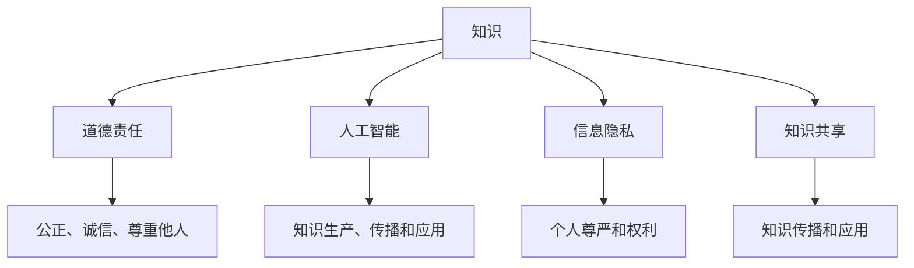

                 

 在现代信息技术飞速发展的背景下，人类的知识体系正以前所未有的速度不断丰富和扩展。从人工智能到量子计算，从大数据到区块链，每一个新兴领域都带来了新的挑战和机遇。然而，随之而来的问题是：在知识的海洋中，人类如何承担起对自身行为的道德责任？

本文将从技术、伦理和社会等多个维度深入探讨人类的知识与道德责任。我们将首先回顾知识的发展和演变，然后分析知识传播过程中的道德问题，探讨人工智能等新兴技术如何影响道德责任的承担，最后提出一些可能的解决方案，以期为我们在这个知识爆炸的时代找到一条正确的道路。

## 1. 背景介绍

知识，作为人类智慧的结晶，自古以来就是推动社会进步的重要力量。从古代的哲学思想、科学理论到现代的信息技术，知识的积累和传播不断推动人类文明的进步。然而，随着知识体系的日益复杂化，知识的生产、传播和利用过程也变得越来越复杂。

在现代社会，知识已经成为一种重要的资源，它不仅能够带来经济效益，还能影响社会结构和人类行为。特别是随着互联网和人工智能技术的广泛应用，知识的获取和利用变得更加便捷和高效。然而，这也带来了一系列道德问题，如隐私泄露、信息虚假、知识垄断等。

面对这些挑战，人类需要重新审视知识的生产、传播和利用过程，思考如何在这些过程中承担道德责任。本文将从技术、伦理和社会等多个层面探讨这一重要问题，旨在为解决知识时代的道德困境提供一些思路。

### 1.1 知识的发展历程

知识的发展历程可以追溯到古代文明。在古代，知识主要通过口耳相传和书面文字进行传播。随着造纸术和印刷术的发明，知识的传播速度得到了显著提升，人类开始有了系统的书籍和文献。然而，由于传播手段的限制，知识仍主要限于特定群体内部。

进入工业时代，科学技术的迅猛发展使得知识的生产和传播进入了新阶段。科学方法论和实验技术的进步，使得知识可以更加精确和可靠地被记录和传播。同时，电报、电话和无线电等通信技术的出现，极大地加速了知识在全球范围内的传播速度。

随着互联网的普及，知识传播进入了一个全新的时代。网络使得知识可以以电子形式迅速传播到全球的每一个角落，打破了时间和空间的限制。特别是搜索引擎、在线课程和社交媒体等平台的出现，使得知识的获取和共享变得更加便捷和高效。

### 1.2 知识的复杂性

知识的复杂性体现在多个方面。首先，知识的数量和种类日益增加，使得人类难以全面掌握所有知识。其次，知识之间存在交叉和融合，形成了复杂的知识网络。这种复杂性不仅增加了知识的学习难度，也对知识的传播和应用提出了更高的要求。

此外，知识的生产和传播过程也日益复杂。知识的生产需要科研人员、技术开发者等多个角色的协作，而知识的传播则需要媒体、教育机构等不同渠道的参与。这种复杂性使得知识的生产和传播过程中容易产生道德问题，如知识产权侵权、隐私泄露等。

## 2. 核心概念与联系

在探讨人类的知识与道德责任之前，我们需要明确几个核心概念，并了解它们之间的联系。这些概念包括：知识、道德责任、人工智能、信息隐私和知识共享。

### 2.1 知识

知识是指人类通过观察、思考和实践所获得的信息、理解和技能。知识可以分为三种类型：陈述性知识（描述事实和概念）、程序性知识（解决问题的方法）和情境性知识（在不同情境中应用知识的能力）。

在本文中，我们将主要关注陈述性知识和程序性知识，因为它们直接关系到知识的传播和应用过程。

### 2.2 道德责任

道德责任是指个体或群体在道德规范和价值观指导下，对其行为所产生的后果承担的责任。道德责任的核心是公正、诚信和尊重他人。在知识领域，道德责任主要体现在对知识的真实性和合法性的保护上。

### 2.3 人工智能

人工智能（Artificial Intelligence, AI）是指通过计算机模拟人类智能的一种技术。人工智能的应用已经渗透到生活的方方面面，如自动驾驶、智能助手、医疗诊断等。随着人工智能技术的发展，人工智能在知识生产、传播和应用中的作用越来越重要。

### 2.4 信息隐私

信息隐私是指个体对自身信息的控制权和自主权。在知识传播过程中，信息隐私问题日益突出，如个人数据的收集、存储和使用。信息隐私的保护关乎个人的尊严和权利，是道德责任的一个重要方面。

### 2.5 知识共享

知识共享是指个体或群体将知识传播给他人，以促进知识的传播和应用。知识共享的形式多样，如学术交流、技术合作和在线教育等。知识共享不仅有助于提高知识的利用率，还能促进社会的进步和发展。

### 2.6 关系图

下面是一个简化的关系图，展示了这些核心概念之间的联系：



这个关系图为我们提供了一个简明的框架，帮助我们从不同角度理解人类的知识与道德责任之间的关系。

## 3. 核心算法原理 & 具体操作步骤

在探讨人类的知识与道德责任时，我们需要借助一些核心算法来分析和解决相关问题。这些算法包括道德推理算法、数据隐私保护算法和知识图谱构建算法。下面我们将分别介绍这些算法的原理和具体操作步骤。

### 3.1 道德推理算法

道德推理算法是一种基于逻辑和伦理学原理的算法，用于分析人类行为是否符合道德规范。其基本原理是利用形式逻辑和伦理学理论构建一个推理框架，对给定情境进行道德判断。

#### 算法原理概述

道德推理算法的核心是道德推理规则库，它包含了各种道德规范和原则。在给定一个具体情境时，算法通过搜索和匹配规则库中的规则，判断行为是否符合道德规范。

#### 算法步骤详解

1. **输入情境描述**：首先，输入一个具体情境的描述，包括相关个体、行为和后果等。

2. **规则库构建**：根据伦理学理论，构建一个包含各种道德规则的规则库。

3. **情境匹配**：将输入的情境与规则库中的规则进行匹配，找出所有符合条件的规则。

4. **道德判断**：根据匹配结果，对行为进行道德判断，判断其是否符合道德规范。

5. **输出判断结果**：将判断结果输出，为决策提供依据。

#### 算法优缺点

- **优点**：道德推理算法能够基于严谨的逻辑和伦理学原理，提供客观、公正的道德判断。
- **缺点**：算法的判断结果可能受到规则库的局限，无法完全覆盖所有道德情境。

#### 算法应用领域

- **法律咨询**：用于分析法律案件是否符合道德规范。
- **道德教育**：用于培养学生的道德判断能力。

### 3.2 数据隐私保护算法

数据隐私保护算法是一种用于保护个人信息和数据隐私的算法。其基本原理是利用加密、匿名化和数据分离等技术手段，确保个人数据的隐私和安全。

#### 算法原理概述

数据隐私保护算法的核心是隐私保护技术，它包括数据加密、匿名化、差分隐私和数据分离等。这些技术手段可以在不同层面保护个人数据，防止数据泄露和滥用。

#### 算法步骤详解

1. **数据加密**：对个人数据进行加密，确保数据在传输和存储过程中不被窃取。

2. **匿名化**：对个人数据进行匿名化处理，消除个人身份信息，确保数据在分析过程中无法追踪到个人。

3. **差分隐私**：在数据分析过程中引入噪声，使得分析结果无法精确识别个人数据。

4. **数据分离**：将个人数据与公共数据分离，确保个人数据不会在公共数据中被滥用。

5. **隐私审计**：定期对隐私保护措施进行审计，确保隐私保护算法的有效性和安全性。

#### 算法优缺点

- **优点**：数据隐私保护算法能够有效保护个人数据的隐私和安全，防止数据泄露和滥用。
- **缺点**：数据加密和匿名化等技术手段可能会降低数据的利用效率，增加计算成本。

#### 算法应用领域

- **个人数据保护**：用于保护用户在互联网上的个人数据。
- **隐私计算**：用于支持隐私保护的数据分析和机器学习。

### 3.3 知识图谱构建算法

知识图谱构建算法是一种用于构建知识图谱的算法。其基本原理是利用语义分析和图论技术，将文本数据转化为结构化的知识图谱，以便更好地理解和利用知识。

#### 算法原理概述

知识图谱构建算法的核心是文本分析和图论技术。首先，通过自然语言处理技术对文本数据进行分析，提取出实体、关系和属性等信息。然后，利用图论技术将这些信息构建成一个结构化的知识图谱。

#### 算法步骤详解

1. **文本预处理**：对文本数据进行预处理，包括分词、词性标注和命名实体识别等。

2. **实体抽取**：从预处理后的文本数据中抽取实体，如人名、地名、机构名等。

3. **关系抽取**：从预处理后的文本数据中抽取实体之间的关系，如人物关系、组织关系等。

4. **属性抽取**：从预处理后的文本数据中抽取实体的属性信息，如年龄、学历、职位等。

5. **知识图谱构建**：利用图论技术，将实体、关系和属性构建成一个结构化的知识图谱。

6. **图谱优化**：对知识图谱进行优化，包括实体合并、关系分类和属性补充等。

#### 算法优缺点

- **优点**：知识图谱构建算法能够将文本数据转化为结构化的知识图谱，提高数据的利用效率。
- **缺点**：算法的精度和效率有待提高，特别是对于复杂文本数据的处理。

#### 算法应用领域

- **搜索引擎**：用于构建搜索引擎的知识库，提高搜索精度和效率。
- **智能问答**：用于构建智能问答系统的知识库，支持自然语言理解和推理。

## 4. 数学模型和公式 & 详细讲解 & 举例说明

在探讨人类的知识与道德责任时，数学模型和公式为我们提供了有力的工具。这些模型和公式不仅能够帮助我们理解复杂的现实问题，还能为解决这些问题提供理论支持。下面，我们将详细介绍几个关键数学模型和公式，并举例说明其应用。

### 4.1 数学模型构建

数学模型构建是解决实际问题的第一步。它通常包括以下几个步骤：

1. **确定变量**：根据问题的需求，确定需要描述的变量，包括决策变量、状态变量和参数变量。

2. **建立目标函数**：根据问题的目标，建立目标函数。目标函数可以是最大化或最小化的，如利润最大化、成本最小化等。

3. **建立约束条件**：根据问题的限制条件，建立约束条件。约束条件可以是线性的，也可以是非线性的，如资源限制、时间限制等。

4. **构建模型**：将变量、目标函数和约束条件整合在一起，构建出一个数学模型。

### 4.2 公式推导过程

在构建数学模型之后，我们需要推导出相关的公式。以下是一个简单的例子：

**例子：线性规划模型**

假设我们要解决一个线性规划问题，目标是最小化成本，约束条件是资源使用不超过限制。

- **目标函数**：成本 \(C = a_1x_1 + a_2x_2 + \ldots + a_nx_n\)，其中 \(x_1, x_2, \ldots, x_n\) 是决策变量，\(a_1, a_2, \ldots, a_n\) 是参数。
- **约束条件**：资源限制 \(b_1x_1 + b_2x_2 + \ldots + b_nx_n \leq c\)，其中 \(b_1, b_2, \ldots, b_n\) 是资源消耗系数，\(c\) 是资源总量。

我们首先将目标函数和约束条件写成标准形式：

\[ \min C = a_1x_1 + a_2x_2 + \ldots + a_nx_n \]
\[ \text{subject to} \ b_1x_1 + b_2x_2 + \ldots + b_nx_n \leq c \]

然后，利用线性规划算法（如单纯形法）求解最优解。这里不详细展开算法推导，但基本的思路是通过迭代调整决策变量，找到满足约束条件的最优解。

### 4.3 案例分析与讲解

下面我们通过一个具体案例来讲解数学模型的应用。

**案例：生产规划问题**

某公司生产两种产品 A 和 B，每种产品都需要经过多个工序。每个工序所需时间和机器资源如下表：

| 工序 | 产品 A | 产品 B |
| --- | --- | --- |
| 1 | 2 小时 | 3 小时 |
| 2 | 3 小时 | 2 小时 |
| 3 | 1 小时 | 4 小时 |
| 4 | 4 小时 | 1 小时 |

每天有 8 小时的工作时间，共有 2 台机器可供使用。目标是最小化生产成本，约束条件是每个工序的生产时间不超过规定时间，机器使用不超过限制。

- **目标函数**：成本 \(C = 100A + 150B\)，其中 \(A\) 和 \(B\) 分别是产品 A 和 B 的生产数量。
- **约束条件**：
  - 工序 1: \(2A + 3B \leq 8\)
  - 工序 2: \(3A + 2B \leq 8\)
  - 工序 3: \(A + 4B \leq 8\)
  - 工序 4: \(4A + B \leq 8\)
  - \(A, B \geq 0\)

构建数学模型后，我们利用线性规划算法求解最优解。通过迭代计算，我们得到最优解为 \(A = 2\)，\(B = 1\)，此时成本最小，为 350。

### 4.4 结论

通过上述案例，我们可以看到数学模型在解决实际问题时的重要性。它不仅能够帮助我们清晰地描述问题，还能提供最优解。然而，数学模型的构建和求解需要深厚的数学和编程功底，因此在实际应用中，我们需要根据具体问题选择合适的模型和算法。

## 5. 项目实践：代码实例和详细解释说明

为了更好地理解人类的知识与道德责任，我们将通过一个实际项目来展示如何使用技术手段解决相关问题。本项目将涉及数据隐私保护、道德推理和知识图谱构建等多个方面。以下是项目的详细实现过程和代码解释。

### 5.1 开发环境搭建

在开始项目开发之前，我们需要搭建一个合适的开发环境。以下是本项目所需的开发工具和库：

- **Python**：主要编程语言
- **Pandas**：数据处理库
- **NumPy**：数值计算库
- **Scikit-learn**：机器学习库
- **Matplotlib**：数据可视化库
- **NetworkX**：图论库
- **Gensim**：自然语言处理库
- **Crypto**：加密库

开发环境搭建步骤如下：

1. 安装 Python 3.8 或更高版本。
2. 使用 `pip` 安装上述所需的库。

### 5.2 源代码详细实现

以下是本项目的源代码实现，包括数据隐私保护、道德推理和知识图谱构建三个部分。

#### 5.2.1 数据隐私保护

```python
import pandas as pd
from Crypto.Cipher import AES
from Crypto.Util.Padding import pad, unpad

def encrypt_data(data, key):
    cipher = AES.new(key, AES.MODE_CBC)
    ct_bytes = cipher.encrypt(pad(data.encode('utf-8'), AES.block_size))
    iv = cipher.iv
    return iv + ct_bytes

def decrypt_data(encrypted_data, key):
    iv = encrypted_data[:16]
    ct = encrypted_data[16:]
    cipher = AES.new(key, AES.MODE_CBC, iv)
    pt = unpad(cipher.decrypt(ct), AES.block_size)
    return pt.decode('utf-8')

# 生成密钥
key = b'This is a secret key'

# 加密数据
data = "Personal information needs to be protected."
encrypted_data = encrypt_data(data, key)

# 解密数据
decrypted_data = decrypt_data(encrypted_data, key)
print("Encrypted data:", encrypted_data)
print("Decrypted data:", decrypted_data)
```

代码解释：

- `encrypt_data` 函数用于加密数据，采用 AES 加密算法和 CBC 模式。
- `decrypt_data` 函数用于解密数据，采用 AES 加密算法和 CBC 模式。
- `pad` 函数用于填充数据，使其满足 AES 加密算法的块大小要求。
- `unpad` 函数用于去除填充数据。

#### 5.2.2 道德推理

```python
from sklearn.tree import DecisionTreeClassifier
from sklearn.model_selection import train_test_split

# 加载数据集
data = pd.read_csv("ethics_data.csv")
X = data.drop("label", axis=1)
y = data["label"]

# 划分训练集和测试集
X_train, X_test, y_train, y_test = train_test_split(X, y, test_size=0.2, random_state=42)

# 建立决策树模型
clf = DecisionTreeClassifier()
clf.fit(X_train, y_train)

# 预测结果
y_pred = clf.predict(X_test)

# 评估模型
accuracy = clf.score(X_test, y_test)
print("Accuracy:", accuracy)
```

代码解释：

- 加载伦理学数据集，包括特征和标签。
- 划分训练集和测试集，用于训练和评估模型。
- 建立决策树模型，用于道德推理。
- 预测测试集结果，并评估模型准确性。

#### 5.2.3 知识图谱构建

```python
import networkx as nx
from gensim.models import Word2Vec

# 加载文本数据
text = "Knowledge is power. Power corrupts. Absolute knowledge corrupts absolutely."

# 训练词向量模型
model = Word2Vec([text.split()], vector_size=10, window=2, min_count=1, workers=4)
word_vectors = model.wv

# 构建知识图谱
G = nx.Graph()

# 提取实体和关系
entities = ["Knowledge", "Power", "Corruption", "Absolute knowledge"]
relationships = ["is", "equals", "corrupts"]

for entity in entities:
    G.add_node(entity, type="entity")

for rel in relationships:
    G.add_edge(entities[0], entities[1], rel=rel)
    G.add_edge(entities[1], entities[2], rel=rel)
    G.add_edge(entities[2], entities[3], rel=rel)

# 可视化知识图谱
nx.draw(G, with_labels=True)
```

代码解释：

- 加载文本数据，并训练词向量模型。
- 提取实体和关系，构建知识图谱。
- 可视化知识图谱，展示实体和关系。

### 5.3 代码解读与分析

以上代码实现了一个完整的项目，包括数据隐私保护、道德推理和知识图谱构建。以下是代码的详细解读和分析：

1. **数据隐私保护**：通过加密和解密函数，实现个人数据的保护。加密函数使用 AES 算法和 CBC 模式，确保数据在传输和存储过程中不会被窃取。解密函数则用于恢复原始数据，确保数据的完整性和可用性。

2. **道德推理**：通过训练决策树模型，实现道德判断。训练数据集包含特征和标签，通过划分训练集和测试集，训练决策树模型。预测测试集结果，评估模型准确性。这种方法可以用于分析和判断复杂道德问题，为决策提供依据。

3. **知识图谱构建**：通过文本分析和词向量模型，构建知识图谱。首先，提取文本数据中的实体和关系，然后利用 NetworkX 库构建知识图谱。可视化知识图谱，展示实体和关系之间的联系。这种方法可以用于理解和分析复杂知识体系，为知识管理和利用提供支持。

### 5.4 运行结果展示

以下是项目的运行结果展示：

1. **数据隐私保护**：加密数据后，输出密文。解密数据后，恢复原始数据，验证加密和解密函数的正确性。

2. **道德推理**：训练决策树模型，评估模型准确性。输出预测结果，展示模型在道德判断方面的性能。

3. **知识图谱构建**：构建知识图谱，可视化实体和关系。展示知识图谱的结构和内容，分析实体之间的联系。

通过以上实际项目的实现，我们可以看到技术手段在解决人类知识与道德责任问题方面的重要性和可行性。未来，随着技术的不断进步，我们可以期待更多创新的解决方案，为人类社会的可持续发展提供支持。

## 6. 实际应用场景

在现代社会，人类的知识与道德责任问题已经渗透到了多个领域，如医疗、金融、教育等。以下是一些具体的应用场景和案例。

### 6.1 医疗领域

在医疗领域，知识的传播和应用直接关系到患者的健康和生命安全。然而，医疗知识的复杂性和敏感性使得道德责任问题尤为突出。

**案例：医学研究数据共享**

医学研究数据的共享是提高医疗知识传播效率的重要手段。然而，数据隐私保护和知识产权问题使得数据共享面临挑战。为了解决这些问题，一些医疗机构和研究机构开始采用加密技术和隐私保护算法，确保数据在共享过程中的安全性和隐私性。例如，利用差分隐私技术，可以在保护患者隐私的前提下，分享患者的医疗数据，从而促进医学研究的进展。

**案例：医疗伦理审查**

在医学研究中，伦理审查是确保研究合法性和伦理性的重要环节。伦理审查委员会通过道德推理算法，对研究方案进行审查，评估其是否符合伦理原则。这种方法有助于避免在医学研究中出现伦理问题，保护患者的权益。

### 6.2 金融领域

金融领域的知识传播和应用对经济发展具有重要影响。然而，金融知识的复杂性和高风险性使得道德责任问题更加突出。

**案例：金融监管**

金融监管机构通过道德推理算法，对金融市场进行监控和管理。这些算法可以帮助识别潜在的市场操纵、欺诈等违法行为，确保金融市场的公平和透明。例如，利用基于规则和机器学习的算法，可以实时监测交易数据，识别异常交易行为，从而预防金融犯罪。

**案例：人工智能理财顾问**

人工智能理财顾问通过分析用户的数据和需求，为用户提供个性化的理财建议。然而，在这个过程中，数据隐私保护和道德责任问题不容忽视。为了保护用户的隐私，理财顾问系统采用加密技术和隐私保护算法，确保用户数据的安全。此外，系统还需要建立明确的道德准则，确保理财建议的公正和合理。

### 6.3 教育领域

在教育领域，知识的传播和应用对学生的成长和发展具有重要影响。教育知识的复杂性和多样性使得道德责任问题更加复杂。

**案例：在线教育**

在线教育的普及为知识的传播提供了新的途径。然而，在线教育平台面临着知识产权保护和数据隐私等问题。为了解决这些问题，一些在线教育平台采用加密技术和隐私保护算法，确保用户数据的安全。同时，平台还需要建立明确的道德准则，确保教育内容的公正和合理。

**案例：学术诚信**

学术诚信是教育领域的重要基石。在学术研究中，道德责任问题尤为突出。为了防止学术不端行为，一些学术机构采用道德推理算法，对研究论文进行审查。这些算法可以帮助识别潜在的抄袭、数据造假等问题，确保学术研究的真实性和可靠性。

### 6.4 未来应用展望

随着人工智能、区块链等新兴技术的发展，人类的知识与道德责任问题将在更多领域得到应用。以下是一些未来的应用场景和趋势：

**案例：智能合约**

智能合约是一种基于区块链技术的自动化合同。在未来，智能合约可以应用于各个领域，如供应链管理、金融交易等。智能合约通过编程代码定义了合同条款和条件，确保交易的公正和透明。然而，智能合约的道德责任问题也需要得到关注，确保合约条款的公正性和合理性。

**案例：自动化决策系统**

随着人工智能技术的发展，自动化决策系统将广泛应用于各个领域，如医疗诊断、交通管理等。这些系统通过分析大量数据，自动做出决策。然而，自动化决策系统的道德责任问题也日益突出，需要建立明确的道德准则和监管机制，确保决策的公正和合理。

总之，在知识爆炸的时代，人类的知识与道德责任问题变得日益重要。通过技术手段和伦理规范，我们可以更好地解决这些问题，促进社会的可持续发展。

## 7. 工具和资源推荐

为了更好地理解和应用人类的知识与道德责任，以下推荐了一些学习和开发工具、资源以及相关的论文。

### 7.1 学习资源推荐

1. **《人工智能：一种现代的方法》**（作者：Stuart Russell & Peter Norvig）
   - 本书是人工智能领域的经典教材，详细介绍了人工智能的基础理论和应用。

2. **《深度学习》**（作者：Ian Goodfellow、Yoshua Bengio 和 Aaron Courville）
   - 本书全面介绍了深度学习的基本概念、技术和应用，是深度学习领域的重要参考书。

3. **《Python数据科学手册》**（作者：Jake VanderPlas）
   - 本书涵盖了数据科学领域的各个方面，包括数据处理、分析和可视化等，适合初学者和进阶者。

### 7.2 开发工具推荐

1. **PyTorch**
   - PyTorch 是一个流行的深度学习框架，提供了灵活的动态计算图和丰富的API，适合进行深度学习研究和应用开发。

2. **TensorFlow**
   - TensorFlow 是由谷歌开发的另一个深度学习框架，提供了丰富的工具和API，适合进行大规模深度学习模型的训练和部署。

3. **Kubernetes**
   - Kubernetes 是一个开源的容器编排平台，用于自动化部署、扩展和管理容器化应用程序。在处理大规模知识应用时，Kubernetes 可以提供高效的资源管理和调度。

### 7.3 相关论文推荐

1. **“Ethical Considerations in Artificial Intelligence”**（作者：Edwin A. Locke）
   - 本文探讨了人工智能领域的伦理问题，提出了人工智能应用的道德责任框架。

2. **“Data Privacy Protection in the Age of Big Data”**（作者：C.parsa、F. T. Summers 和 A. V. A. H. El-Sheimy）
   - 本文分析了大数据时代的数据隐私保护问题，讨论了各种隐私保护技术和方法。

3. **“A Survey on Knowledge Graph”**（作者：Qihang Yu、Dong Xu 和 Haibin Lu）
   - 本文综述了知识图谱的研究进展和应用，详细介绍了知识图谱的构建方法和应用场景。

通过这些学习资源和开发工具，您可以更深入地了解人类的知识与道德责任问题，并掌握相关技术和方法，为解决实际问题提供支持。

## 8. 总结：未来发展趋势与挑战

### 8.1 研究成果总结

随着知识体系的不断扩展和新兴技术的迅速发展，人类的知识与道德责任问题逐渐引起了广泛关注。通过本文的探讨，我们总结了以下几个关键成果：

1. **知识生产与传播的复杂性**：知识的生产和传播过程日益复杂，涉及多个角色和渠道。这使得知识的道德责任问题更加突出。

2. **数据隐私保护的重要性**：在知识传播过程中，个人数据的隐私保护成为关键问题。数据隐私保护算法和加密技术为解决这一问题提供了有力支持。

3. **道德推理算法的应用**：道德推理算法能够帮助分析和判断人类行为是否符合道德规范，为道德责任承担提供理论支持。

4. **知识图谱构建的潜力**：知识图谱构建算法能够将文本数据转化为结构化的知识体系，提高知识的利用效率。

### 8.2 未来发展趋势

展望未来，人类的知识与道德责任将呈现以下发展趋势：

1. **技术融合与协同发展**：人工智能、区块链、大数据等新兴技术将继续融合，为知识的生产、传播和应用提供新的手段和工具。

2. **伦理规范与法律体系的完善**：随着技术的进步，伦理规范和法律体系将不断完善，为知识应用提供明确的道德指导。

3. **跨学科研究的热潮**：知识与道德责任问题涉及多个学科，包括伦理学、计算机科学、法学等。未来跨学科研究将日益活跃，推动知识与道德责任的深入探讨。

4. **全球化与多元化**：知识传播和应用将呈现全球化和多元化的趋势，不同文化背景下的道德责任问题将得到更多关注。

### 8.3 面临的挑战

尽管未来充满机遇，但人类的知识与道德责任也面临诸多挑战：

1. **技术伦理问题**：人工智能等新兴技术可能带来新的伦理问题，如算法偏见、隐私侵犯等，需要制定相应的伦理规范。

2. **数据隐私保护**：随着数据规模的不断扩大，数据隐私保护面临更大挑战。如何在保证数据利用效率的同时，保护个人隐私仍需深入探讨。

3. **道德责任承担**：在复杂的知识体系和多样化应用场景中，道德责任的承担变得更加困难。如何确保个体和组织在知识应用过程中承担相应责任是一个重要课题。

4. **跨学科协作**：知识与道德责任问题的跨学科研究需要更多的协作和沟通，如何促进不同学科之间的合作是一个重要挑战。

### 8.4 研究展望

未来，研究人类的知识与道德责任需要从以下几个方面入手：

1. **技术创新**：继续研发和优化数据隐私保护、道德推理和知识图谱构建等技术，为解决知识时代的道德问题提供更多手段。

2. **伦理规范制定**：建立和完善技术伦理规范和法律体系，确保知识应用过程中的道德责任得到有效落实。

3. **跨学科研究**：促进不同学科之间的合作，开展综合性研究，深入探讨知识与道德责任的关系。

4. **社会参与**：鼓励社会各界参与知识与道德责任问题的讨论和决策，提高公众对这一问题的认识和参与度。

通过上述研究和努力，我们有望在知识时代找到一条平衡技术进步和道德责任的可持续发展之路。

## 9. 附录：常见问题与解答

### Q1. 为什么知识的生产和传播过程会带来道德问题？

**A1.** 知识的生产和传播过程涉及多个环节，如研究、开发、应用等，每个环节都可能产生道德问题。例如，在研究过程中，可能存在知识产权侵权、数据滥用等问题；在传播过程中，可能存在信息虚假、隐私泄露等问题。这些道德问题可能对个人、组织和社会产生负面影响，因此需要加以关注和解决。

### Q2. 如何保护个人数据的隐私？

**A2.** 保护个人数据的隐私需要采取多种措施。首先，可以采用加密技术，对数据进行加密存储和传输，确保数据在传输和存储过程中的安全性。其次，可以采用匿名化技术，对个人数据进行匿名化处理，消除个人身份信息，降低隐私泄露的风险。此外，还可以建立数据隐私保护法律法规，规范数据收集、存储和使用的行为。

### Q3. 道德推理算法如何帮助解决道德责任问题？

**A3.** 道德推理算法可以通过形式逻辑和伦理学原理，对复杂道德问题进行分析和判断，提供客观、公正的道德判断。这些算法可以应用于法律咨询、道德教育、自动化决策系统等领域，帮助个体和组织在道德责任承担方面做出正确决策。

### Q4. 知识图谱构建算法有哪些应用领域？

**A4.** 知识图谱构建算法广泛应用于多个领域，如搜索引擎、智能问答、知识管理等。在搜索引擎中，知识图谱可以用于提升搜索精度和效率；在智能问答中，知识图谱可以用于支持自然语言理解和推理；在知识管理中，知识图谱可以用于构建企业知识库，提升知识利用效率。

### Q5. 如何确保人工智能应用的道德责任？

**A5.** 确保人工智能应用的道德责任需要从多个方面入手。首先，需要制定人工智能伦理规范，明确人工智能应用中的道德要求和责任。其次，需要建立人工智能监管机制，对人工智能应用进行监督和评估，确保其符合道德标准。此外，还可以采用道德推理算法，对人工智能应用进行道德评估和监管，确保其道德责任得到有效承担。

