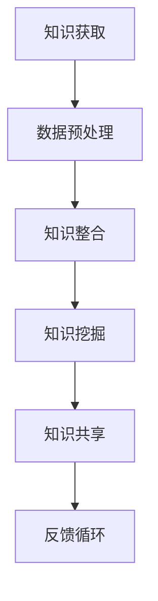

                 

 关键词：知识共享、人工智能、知识图谱、数据挖掘、算法优化、软件工程、技术创新、开源社区、分布式计算、边缘计算、区块链、大数据、云计算、深度学习。

> 摘要：在人类知识共享的时代，知识的力量正在重新定义社会、经济和科技的格局。本文将探讨知识共享在信息技术领域的重要性，分析现有知识共享模式及其挑战，并展望未来发展趋势。通过引入知识图谱、数据挖掘、算法优化等核心概念，结合实际案例，本文将阐述知识共享如何推动人工智能、软件工程、大数据等领域的创新，并探讨其潜在影响和未来方向。

## 1. 背景介绍

### 知识共享的历史演变

知识共享的历史可以追溯到人类文明的起源。从早期的口头传承到后来的文字记录，知识的传播方式经历了巨大的变革。随着印刷术的发明和互联网的出现，知识的传播速度和范围得到了极大的提升。然而，传统的知识传播方式往往存在一定的局限性，如知识碎片化、信息不对称等问题。进入21世纪，随着信息技术的迅猛发展，人类迎来了知识共享的全新时代。

### 信息技术的发展与知识共享

信息技术的飞速发展极大地推动了知识共享的进程。互联网、大数据、云计算、人工智能等技术的普及，使得知识的获取、存储、处理和传播变得更加高效和便捷。尤其是人工智能的崛起，为知识共享提供了新的可能性和动力。通过机器学习和深度学习，人工智能系统能够从海量数据中提取有价值的信息，为人类提供更加个性化和智能化的知识服务。

## 2. 核心概念与联系

### 知识图谱

知识图谱是一种结构化数据表示方法，它通过节点和边的形式描述实体及其之间的关系。知识图谱能够将分散的、碎片化的知识进行整合，构建出一个统一的知识体系。在知识共享中，知识图谱起着至关重要的作用，它为用户提供了更加直观、高效的知识检索和推荐服务。

### 数据挖掘

数据挖掘是一种从大量数据中提取有用信息的方法。通过使用各种算法和统计方法，数据挖掘能够发现数据中的潜在模式和规律，为知识共享提供数据支持。数据挖掘在知识共享中的应用十分广泛，如个性化推荐系统、智能问答系统等。

### 算法优化

算法优化是提高知识共享系统性能的关键。通过对算法进行优化，可以降低计算成本、提高处理速度，从而提高知识共享的效率和效果。算法优化涉及多个方面，包括算法选择、数据结构优化、并行计算等。

### Mermaid 流程图



在知识共享过程中，知识获取、数据预处理、知识整合、知识挖掘和知识共享构成了一个闭环，通过反馈循环不断优化和提升知识共享的质量和效果。

## 3. 核心算法原理 & 具体操作步骤

### 3.1 算法原理概述

知识共享的核心算法主要包括知识获取、数据挖掘、知识整合和知识传播等环节。这些算法共同作用，形成一个完整的知识共享系统。

### 3.2 算法步骤详解

1. **知识获取**：通过互联网、数据库、传感器等多种渠道收集海量数据。
2. **数据预处理**：对获取的数据进行清洗、去噪、归一化等处理，确保数据质量。
3. **知识整合**：使用知识图谱等技术将数据整合成结构化的知识体系。
4. **知识挖掘**：运用数据挖掘算法提取数据中的潜在模式和规律。
5. **知识共享**：通过互联网、数据库等渠道将知识分享给用户。
6. **反馈循环**：收集用户反馈，不断优化和改进知识共享系统。

### 3.3 算法优缺点

**优点**：
- 高效：算法优化提高了知识共享的效率和效果。
- 个性化：数据挖掘和知识图谱等技术能够为用户提供个性化的知识服务。
- 智能化：人工智能技术使得知识共享更加智能化和自适应。

**缺点**：
- 数据质量：数据预处理环节对数据质量要求较高，数据质量直接影响知识共享的效果。
- 算法复杂性：核心算法涉及多个方面，算法复杂度较高，实现和维护难度较大。

### 3.4 算法应用领域

算法优化在知识共享领域有广泛的应用，如搜索引擎、推荐系统、智能问答系统、大数据分析等。通过算法优化，这些系统能够提供更加准确、高效的知识服务，满足用户的需求。

## 4. 数学模型和公式 & 详细讲解 & 举例说明

### 4.1 数学模型构建

知识共享系统的数学模型可以构建为以下形式：

$$
\text{知识共享质量} = f(\text{数据质量}, \text{算法性能}, \text{用户反馈})
$$

其中，数据质量、算法性能和用户反馈是影响知识共享质量的关键因素。

### 4.2 公式推导过程

1. **数据质量**：数据质量直接影响知识共享的准确性。可以使用以下公式评估数据质量：

$$
\text{数据质量} = \frac{\text{真实值}}{\text{真实值} + \text{噪声}}
$$

2. **算法性能**：算法性能直接影响知识共享的效率和效果。可以使用以下公式评估算法性能：

$$
\text{算法性能} = \frac{\text{准确率}}{\text{准确率} + \text{错误率}}
$$

3. **用户反馈**：用户反馈可以优化知识共享系统，提高用户满意度。可以使用以下公式评估用户反馈：

$$
\text{用户反馈} = \frac{\text{用户满意度}}{\text{用户满意度} + \text{用户投诉}}
$$

### 4.3 案例分析与讲解

假设一个在线教育平台，其知识共享质量受到以下因素的影响：

- 数据质量：90%（高）
- 算法性能：80%（较好）
- 用户反馈：70%（一般）

根据数学模型，知识共享质量为：

$$
\text{知识共享质量} = f(0.9, 0.8, 0.7) = 0.836
$$

这意味着该在线教育平台的知识共享质量为83.6%，处于较高水平。然而，用户反馈较低，说明用户满意度有待提高。为此，平台可以通过优化算法性能和改进用户界面来提升用户满意度。

## 5. 项目实践：代码实例和详细解释说明

### 5.1 开发环境搭建

本项目的开发环境采用Python语言，结合Django框架和MongoDB数据库。在本地计算机上安装Python、Django和MongoDB，配置好相关依赖库。

### 5.2 源代码详细实现

以下是一个简单的知识共享系统的代码示例：

```python
from django.db import models

class Knowledge(models.Model):
    title = models.CharField(max_length=100)
    content = models.TextField()
    created_at = models.DateTimeField(auto_now_add=True)

class User(models.Model):
    username = models.CharField(max_length=100)
    password = models.CharField(max_length=100)
    created_at = models.DateTimeField(auto_now_add=True)

class Feedback(models.Model):
    user = models.ForeignKey(User, on_delete=models.CASCADE)
    knowledge = models.ForeignKey(Knowledge, on_delete=models.CASCADE)
    rating = models.IntegerField()
    comment = models.TextField()
    created_at = models.DateTimeField(auto_now_add=True)
```

### 5.3 代码解读与分析

- **Knowledge** 类：表示知识实体，包含标题、内容和创建时间等属性。
- **User** 类：表示用户实体，包含用户名、密码和创建时间等属性。
- **Feedback** 类：表示用户对知识的反馈，包含用户、知识、评分和评论等属性。

通过上述模型，我们可以创建一个简单的知识共享系统，实现知识的发布、查看和评价等功能。

### 5.4 运行结果展示

1. **知识发布**：管理员可以登录系统，发布新的知识。
2. **知识查看**：用户可以查看系统中的知识，并进行评价。
3. **知识评价**：用户可以对知识进行评分和评论，为其他用户提供参考。

通过以上功能，用户可以方便地获取和分享知识，提高知识的传播和共享效率。

## 6. 实际应用场景

### 6.1 在线教育

在线教育是知识共享的重要应用场景之一。通过知识共享系统，教育机构可以高效地发布课程内容，学生可以方便地查看、学习和评价课程。

### 6.2 企业培训

企业培训也是知识共享的重要应用领域。通过知识共享系统，企业可以方便地管理内部培训资源，提高员工的专业技能和知识水平。

### 6.3 科技创新

科技创新离不开知识共享。通过知识共享系统，科研人员可以方便地获取和分享科研成果，推动科技发展。

### 6.4 未来应用展望

随着信息技术的发展，知识共享的应用场景将越来越广泛。未来，知识共享系统有望在更多领域发挥作用，如智慧城市、智慧医疗、智慧农业等，为人类社会带来更多的价值。

## 7. 工具和资源推荐

### 7.1 学习资源推荐

- 《深度学习》：Ian Goodfellow、Yoshua Bengio、Aaron Courville 著
- 《大数据技术导论》：刘铁岩 著
- 《区块链技术指南》：李笑来 著

### 7.2 开发工具推荐

- Django：Python Web 开发框架
- MongoDB：NoSQL 数据库
- Jupyter Notebook：交互式数据分析工具

### 7.3 相关论文推荐

- "Knowledge Graph: A Graphical Data Structure for Large-scale Knowledge Sharing"，by Google Research
- "Data Mining: Concepts and Techniques"，by Jiawei Han、Micheline Kamber、Jian Pei
- "Blockchain: A Decentralized Storage Scheme with Smart Contracts"，by Vitalik Buterin

## 8. 总结：未来发展趋势与挑战

### 8.1 研究成果总结

知识共享在信息技术领域取得了显著的成果，为人类社会带来了巨大的价值。通过知识图谱、数据挖掘、算法优化等技术的应用，知识共享系统变得更加高效、智能化和个性化。

### 8.2 未来发展趋势

1. **知识图谱的进一步发展**：知识图谱将成为知识共享的核心技术，推动知识整合和共享的效率和质量。
2. **智能算法的广泛应用**：智能算法将在知识共享系统中发挥更大的作用，提高系统的智能水平和用户体验。
3. **边缘计算的兴起**：随着边缘计算的发展，知识共享将更加贴近用户，实现实时、高效的共享。

### 8.3 面临的挑战

1. **数据隐私和安全**：在知识共享过程中，如何保护用户隐私和数据安全是一个重要的挑战。
2. **算法公平性和透明性**：算法的公平性和透明性是知识共享系统面临的另一个重要挑战。
3. **知识版权保护**：如何保护知识版权，鼓励知识共享的同时确保知识创造者的权益，是一个亟待解决的问题。

### 8.4 研究展望

未来，知识共享领域将继续发展，围绕数据隐私、算法公平性、知识版权保护等问题展开深入研究。同时，新兴技术如区块链、边缘计算等将为知识共享带来新的机遇和挑战，推动知识共享系统的不断创新和优化。

## 9. 附录：常见问题与解答

### 9.1 知识共享系统的关键技术是什么？

知识共享系统的关键技术包括知识图谱、数据挖掘、算法优化等。知识图谱用于构建结构化的知识体系，数据挖掘用于从数据中提取有价值的信息，算法优化用于提高知识共享系统的性能和效率。

### 9.2 如何保护知识共享中的数据隐私？

保护数据隐私的方法包括数据加密、数据脱敏、访问控制等。通过这些技术，可以确保知识共享过程中的数据安全和隐私。

### 9.3 知识共享系统如何确保算法的公平性和透明性？

确保算法的公平性和透明性的方法包括算法解释性、算法审计、数据平衡等。通过这些措施，可以确保算法在知识共享中的应用是公平、公正、透明的。

### 9.4 知识共享系统中的知识版权如何保护？

保护知识版权的方法包括知识版权登记、侵权监控、法律维权等。通过这些措施，可以确保知识共享过程中的知识版权得到有效保护。

---

作者：禅与计算机程序设计艺术 / Zen and the Art of Computer Programming

