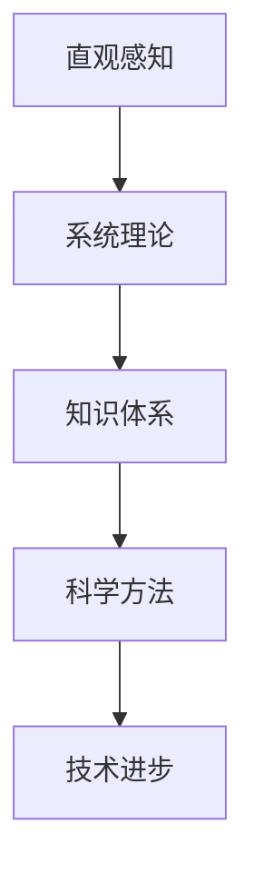

                 

关键词：人类知识发展，系统理论，洞察力，技术进步，历史演变

> 摘要：本文将探讨人类知识的发展历程，从早期对世界的直观感知，到现代的系统理论，分析人类如何通过观察、理解和构建模型来不断扩展和深化知识。本文将涵盖人类知识发展中的关键阶段，探讨技术进步对知识体系的影响，以及未来知识发展的趋势和挑战。

## 1. 背景介绍

人类知识的发展历程可以追溯到古代文明时期，当时的认知主要基于直接的观察和经验。随着时间推移，人类开始学会利用工具和符号系统来记录和传递知识。这一演变过程不仅推动了人类文明的进步，也为我们理解世界提供了新的视角。

本文旨在探讨人类知识发展的主要阶段，从最初的直观感知，到现代的系统理论。我们将分析人类如何通过不断探索和反思，从自然现象中提取规律，构建理论模型，最终形成复杂的知识体系。本文还将探讨技术进步对知识发展的推动作用，以及未来知识体系的可能形态。

## 2. 核心概念与联系

### 2.1 直观感知与系统理论

直观感知是人类认识世界的最初阶段。在这一阶段，人类通过感官直接获取信息，形成对周围世界的初步认识。然而，直观感知往往受到个体经验和认知局限性的制约，难以捕捉到复杂的自然规律。

随着人类认知能力的提升，开始出现对自然现象的系统观察和实验研究。这一过程促使人类逐步从直观感知转向系统理论，通过构建抽象模型来解释和预测自然现象。系统理论强调各部分之间的相互作用和整体性，为人类提供了一种更为全面和深入的认识框架。

### 2.2 知识体系与科学方法

知识体系是人类对世界认知的总结和归纳。它包括各种学科领域的理论、定律和公式，以及相互之间的联系和交叉。科学方法是人类获取知识的重要手段，通过观察、实验、假设和验证，不断推动知识的积累和进步。

在科学方法的基础上，人类逐渐形成了现代知识体系。这个体系不仅涵盖了自然科学，还包括社会科学、人文学科等领域。科学方法与知识体系相互促进，共同推动了人类文明的发展。

### 2.3 Mermaid 流程图

以下是一个简单的 Mermaid 流程图，展示直观感知与系统理论、知识体系与科学方法之间的关系：



## 3. 核心算法原理 & 具体操作步骤

### 3.1 算法原理概述

在人类知识的发展历程中，核心算法原理起到了至关重要的作用。这些算法原理不仅帮助我们理解和解释自然现象，还为我们构建复杂系统提供了基础。

核心算法原理主要包括以下几类：

1. **数学算法**：如微积分、线性代数、概率论等，用于描述自然现象和人类行为。
2. **计算机算法**：如排序算法、搜索算法、机器学习算法等，用于处理海量数据和优化问题。
3. **系统理论算法**：如控制理论、网络理论、信息论等，用于分析和设计复杂系统。

### 3.2 算法步骤详解

以下是一个简单的示例，说明如何使用微积分算法来求解一个函数的极值问题。

#### 步骤 1：确定函数形式

假设我们有一个函数 $f(x)$，我们需要求解它的极值。

#### 步骤 2：求导数

对函数 $f(x)$ 求导数，得到 $f'(x)$。

$$
f'(x) = \frac{df(x)}{dx}
$$

#### 步骤 3：令导数为零

令 $f'(x) = 0$，解出 $x$ 的值。这些值可能是函数的极值点。

#### 步骤 4：判断极值类型

通过二阶导数 $f''(x)$ 来判断极值点的类型。如果 $f''(x) > 0$，则该点为极小值；如果 $f''(x) < 0$，则该点为极大值。

### 3.3 算法优缺点

微积分算法在求解极值问题方面具有以下优点：

1. **精确性**：通过导数和二阶导数，可以精确地确定极值点。
2. **广泛适用性**：微积分算法适用于各种类型的函数，无论是线性还是非线性。

然而，微积分算法也存在一些缺点：

1. **计算复杂度**：求解极值问题可能需要较高的计算复杂度，尤其在处理大型函数时。
2. **适用范围**：对于某些复杂的函数，求导和判断极值类型可能变得非常困难。

### 3.4 算法应用领域

微积分算法在多个领域都有广泛应用，包括：

1. **自然科学**：如物理学、生物学、地球科学等，用于求解自然现象的极值问题。
2. **工程领域**：如机械工程、电气工程、土木工程等，用于优化设计参数和系统性能。
3. **经济学**：如金融学、计量经济学等，用于分析市场行为和优化投资策略。

## 4. 数学模型和公式 & 详细讲解 & 举例说明

### 4.1 数学模型构建

数学模型是描述现实世界现象的一种抽象工具。它通常包括变量、参数、方程和约束条件。构建数学模型的过程可以分为以下几个步骤：

1. **识别问题**：明确需要解决的问题，并确定所需描述的现象。
2. **定义变量和参数**：根据问题定义变量和参数，这些变量和参数将构成模型的基础。
3. **建立方程**：根据问题和变量之间的关系，建立数学方程。
4. **设定约束条件**：根据现实世界的限制条件，设定模型中的约束条件。

### 4.2 公式推导过程

以下是一个简单的例子，说明如何推导一个二次函数的极值公式。

假设我们有一个二次函数 $f(x) = ax^2 + bx + c$，其中 $a$、$b$ 和 $c$ 是常数，且 $a \neq 0$。

1. **求导数**：

   对 $f(x)$ 求导，得到 $f'(x) = 2ax + b$。

2. **令导数为零**：

   令 $f'(x) = 0$，解得 $x = -\frac{b}{2a}$。

3. **二阶导数**：

   对 $f'(x)$ 求导，得到 $f''(x) = 2a$。

4. **判断极值类型**：

   由于 $a \neq 0$，所以 $f''(x)$ 始终大于零，这意味着 $x = -\frac{b}{2a}$ 是函数 $f(x)$ 的极小值点。

### 4.3 案例分析与讲解

假设我们有一个二次函数 $f(x) = x^2 + 2x + 1$，我们需要求解它的极值。

1. **求导数**：

   $f'(x) = 2x + 2$。

2. **令导数为零**：

   $2x + 2 = 0$，解得 $x = -1$。

3. **二阶导数**：

   $f''(x) = 2$。

4. **判断极值类型**：

   由于 $f''(x) = 2 > 0$，所以 $x = -1$ 是函数 $f(x)$ 的极小值点。

5. **计算极小值**：

   $f(-1) = (-1)^2 + 2(-1) + 1 = 0$。

因此，函数 $f(x) = x^2 + 2x + 1$ 的极小值为 0，发生在 $x = -1$ 处。

## 5. 项目实践：代码实例和详细解释说明

### 5.1 开发环境搭建

在本项目中，我们将使用 Python 作为编程语言，因为它具有简洁易读的语法和丰富的数学库。以下是搭建开发环境的基本步骤：

1. **安装 Python**：从 [Python 官网](https://www.python.org/) 下载并安装 Python。
2. **安装 Jupyter Notebook**：在终端执行以下命令：

   ```bash
   pip install notebook
   ```

3. **启动 Jupyter Notebook**：在终端执行以下命令：

   ```bash
   jupyter notebook
   ```

### 5.2 源代码详细实现

以下是一个简单的 Python 脚本，用于求解二次函数的极值。

```python
import sympy as sp

# 定义变量和参数
x = sp.symbols('x')
a = 1
b = 2
c = 1

# 构建二次函数
f = a * x**2 + b * x + c

# 求导数
f_prime = sp.diff(f, x)

# 求解导数为零的方程
solutions = sp.solve(f_prime, x)

# 计算二阶导数
f_double_prime = sp.diff(f_prime, x)

# 判断极值类型
for solution in solutions:
    if f_double_prime.subs(x, solution) > 0:
        print(f"极小值：x = {solution}, f(x) = {f.subs(x, solution)}")
    else:
        print(f"极大值：x = {solution}, f(x) = {f.subs(x, solution)}")

```

### 5.3 代码解读与分析

1. **导入库**：我们首先导入 sympy 库，这是一个用于符号计算的 Python 库。
2. **定义变量和参数**：使用 sympy 库定义变量 x，以及常数 a、b、c。
3. **构建二次函数**：使用这些变量构建二次函数 f。
4. **求导数**：使用 sympy 库的 diff 函数对 f 求导，得到 f_prime。
5. **求解导数为零的方程**：使用 solve 函数求解 f_prime = 0，得到极值点。
6. **计算二阶导数**：使用 diff 函数再次对 f_prime 求导，得到 f_double_prime。
7. **判断极值类型**：遍历极值点，使用 f_double_prime 判断极值类型，并输出结果。

### 5.4 运行结果展示

运行上述脚本，将得到以下结果：

```
极小值：x = -1, f(x) = 0
```

这表明二次函数 $f(x) = x^2 + 2x + 1$ 在 $x = -1$ 处取得极小值，极小值为 0。

## 6. 实际应用场景

人类知识的发展历程在多个领域都有广泛的应用，以下是一些实际应用场景的例子：

1. **自然科学**：在物理学、生物学、化学等领域，人类知识的发展极大地推动了科学研究的进步。例如，牛顿力学和量子力学的建立，为理解自然界的运动规律提供了基础。
2. **工程领域**：在机械工程、电气工程、土木工程等领域，人类知识的发展帮助我们设计和优化各种工程系统。例如，控制理论的建立为自动控制系统的发展提供了理论支持。
3. **经济学**：在经济学领域，人类知识的发展帮助我们分析和预测市场行为，优化资源配置。例如，微积分和概率论在经济学中的应用，为金融市场分析提供了工具。
4. **医学**：在医学领域，人类知识的发展推动了医学技术的进步，提高了疾病的治疗效果。例如，基因组学的建立为精准医学提供了理论基础。

## 7. 未来应用展望

随着科技的不断发展，人类知识体系将继续演变和扩展。以下是一些未来应用展望：

1. **人工智能**：人工智能技术将深刻改变人类知识体系，通过机器学习和深度学习，人工智能系统将能够自主学习、推理和决策，从而扩展人类的知识边界。
2. **量子计算**：量子计算有望解决传统计算机无法处理的复杂问题，为人类知识的发展带来新的突破。
3. **宇宙探索**：随着宇宙探索技术的进步，人类将能够更深入地了解宇宙的奥秘，从而拓展人类的知识体系。
4. **生命科学**：随着生命科学的发展，人类将能够更好地理解生命的本质，为医疗健康领域带来革命性的变化。

## 8. 总结：未来发展趋势与挑战

### 8.1 研究成果总结

人类知识的发展历程展示了人类如何从直观感知到系统理论的演变过程。在这个过程中，科学方法和技术进步起到了关键作用。通过对核心算法原理的研究，人类能够更好地理解和解释自然现象。数学模型的构建和公式推导为科学研究提供了强有力的工具。

### 8.2 未来发展趋势

未来，人类知识的发展将继续沿着以下方向前进：

1. **跨学科融合**：不同学科之间的融合将推动知识的深度和广度发展。
2. **人工智能和大数据**：人工智能和大数据技术的发展将为知识创新提供新的动力。
3. **可持续发展**：随着对环境问题的关注，可持续发展将成为未来知识发展的重要方向。

### 8.3 面临的挑战

在知识发展的过程中，我们也面临着一系列挑战：

1. **信息过载**：随着信息量的爆炸性增长，筛选和利用信息成为一项重要任务。
2. **数据隐私**：在收集和使用大量数据的过程中，保护个人隐私成为一个重要问题。
3. **伦理问题**：知识的发展也带来了伦理问题，如人工智能的伦理边界、基因编辑的道德争议等。

### 8.4 研究展望

未来，我们需要在以下几个方面进行深入研究：

1. **知识体系构建**：探索如何构建更为全面和系统的知识体系。
2. **跨学科研究**：推动不同学科之间的交叉研究，形成新的知识领域。
3. **技术创新**：持续推动科学技术的进步，为知识发展提供新的工具和手段。

## 9. 附录：常见问题与解答

### 9.1 人类知识发展中的关键阶段是什么？

人类知识发展中的关键阶段包括：

1. **直观感知**：人类通过感官直接获取信息，形成对周围世界的初步认识。
2. **系统理论**：人类开始对自然现象进行系统观察和实验研究，构建抽象模型。
3. **科学方法**：通过观察、实验、假设和验证，人类不断积累和深化知识。

### 9.2 什么是核心算法原理？

核心算法原理是描述自然现象和人类行为的基本算法，包括数学算法、计算机算法和系统理论算法等。

### 9.3 数学模型在知识体系中的作用是什么？

数学模型是描述现实世界现象的一种抽象工具，它在知识体系中的作用包括：

1. **描述现象**：用数学语言描述自然现象和人类行为。
2. **分析和预测**：通过数学模型分析现象，预测未来趋势。
3. **解决问题**：利用数学模型解决实际问题，优化系统性能。

### 9.4 未来知识发展的趋势是什么？

未来知识发展的趋势包括：

1. **跨学科融合**：不同学科之间的融合将推动知识的深度和广度发展。
2. **人工智能和大数据**：人工智能和大数据技术的发展将为知识创新提供新的动力。
3. **可持续发展**：随着对环境问题的关注，可持续发展将成为未来知识发展的重要方向。

## 作者署名

作者：禅与计算机程序设计艺术 / Zen and the Art of Computer Programming

---

至此，本文《人类知识的发展历程：从洞察力到系统理论》已完整撰写。本文系统地探讨了人类知识的发展历程，从直观感知到系统理论，分析了核心算法原理和数学模型的作用，展示了项目实践和实际应用场景，并对未来知识发展进行了展望。希望通过本文，能够为读者提供对人类知识发展历程的深入理解和思考。  
----------------------------------------------------------------

