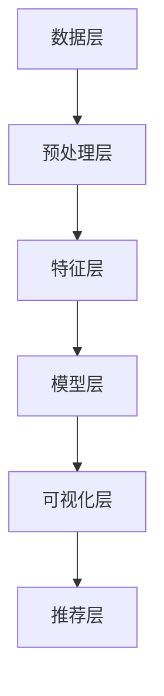

                 

 关键词：知识民主化，知识发现引擎，人工智能，技术普及，知识共享

> 摘要：本文旨在探讨知识发现引擎在推动人类知识民主化进程中的关键作用。通过剖析知识发现引擎的核心概念、原理以及应用，本文揭示了其如何通过技术手段打破知识壁垒，实现知识的普及与共享，从而推动社会进步与人类文明的繁荣。

## 1. 背景介绍

在信息化、数字化的时代浪潮下，知识已经成为推动社会发展和个人成长的核心资源。然而，知识的获取和传播面临着诸多障碍。一方面，大量知识分布在各种专业领域和机构中，缺乏有效的整合与展示；另一方面，知识获取的门槛较高，普通大众难以接触和理解复杂的专业知识。

知识发现引擎作为一种新兴技术，致力于解决这些问题。它通过智能算法和大数据分析，从海量数据中提取有价值的信息，使得知识更加易于获取和利用。知识发现引擎的目标是实现知识的民主化，让每个人都能在合适的时间和地点获取所需的知识，从而提升个人能力和社会整体的智慧水平。

## 2. 核心概念与联系

### 2.1 知识发现引擎的定义

知识发现引擎（Knowledge Discovery Engine，KDE）是一种基于人工智能和大数据技术的系统，用于从大量数据中自动发现模式和知识。它通过数据预处理、特征提取、模式识别等步骤，将原始数据转化为可理解的知识结构，为用户提供智能化的信息服务。

### 2.2 知识发现引擎的核心功能

知识发现引擎具备以下核心功能：

1. 数据集成：整合来自不同数据源的信息，构建统一的知识库。
2. 特征提取：从数据中提取关键特征，为模式识别提供基础。
3. 模式识别：利用机器学习算法识别数据中的规律和模式。
4. 知识可视化：将提取的知识通过图表、报告等形式直观展示给用户。
5. 智能推荐：根据用户行为和兴趣，推荐相关的知识和信息。

### 2.3 知识发现引擎的架构

知识发现引擎的架构可以分为以下几个层次：

1. 数据层：包括各种数据源，如数据库、文件系统、Web等。
2. 预处理层：对原始数据进行清洗、转换、归一化等预处理操作。
3. 特征层：从预处理后的数据中提取特征，形成特征向量。
4. 模型层：利用机器学习算法建立模式识别模型。
5. 可视化层：将识别出的模式以可视化的形式展示给用户。
6. 推荐层：基于用户行为和兴趣，提供个性化的知识推荐。



## 3. 核心算法原理 & 具体操作步骤

### 3.1 算法原理概述

知识发现引擎的核心算法主要包括以下几种：

1. **聚类算法**：将相似的数据点分组，形成聚类。
2. **分类算法**：根据数据特征对数据进行分类。
3. **关联规则挖掘**：发现数据之间的关联关系。
4. **异常检测**：识别数据中的异常值。

### 3.2 算法步骤详解

1. **数据集成**：
   - 收集来自不同数据源的数据。
   - 数据清洗：去除重复、错误、无关的数据。

2. **特征提取**：
   - 特征选择：选择对模式识别最有价值的特征。
   - 特征转换：将原始数据转换为数值化的特征向量。

3. **模式识别**：
   - 使用聚类算法、分类算法等识别数据中的模式。
   - 建立模型，对新的数据进行预测。

4. **知识可视化**：
   - 将识别出的模式通过图表、报告等形式展示。
   - 提高用户对知识的理解和吸收。

5. **智能推荐**：
   - 根据用户行为和兴趣，推荐相关的知识和信息。

### 3.3 算法优缺点

1. **聚类算法**：
   - 优点：不需要事先指定类别，能够自动发现数据中的聚类结构。
   - 缺点：聚类结果受初始值影响较大，可能产生局部最优解。

2. **分类算法**：
   - 优点：能够对数据进行精确的分类，适用于需要明确类别的场景。
   - 缺点：需要大量标注数据，且对噪声敏感。

3. **关联规则挖掘**：
   - 优点：能够发现数据之间的关联关系，有助于知识发现。
   - 缺点：规则数量过多，可能导致信息过载。

4. **异常检测**：
   - 优点：能够识别数据中的异常值，有助于数据安全和隐私保护。
   - 缺点：对异常值的定义和阈值选择较为困难。

### 3.4 算法应用领域

知识发现引擎的应用领域广泛，主要包括：

1. **商业智能**：帮助企业从海量数据中提取有价值的信息，指导决策。
2. **金融风控**：通过异常检测和关联规则挖掘，识别潜在的金融风险。
3. **健康医疗**：利用知识发现技术，发现疾病之间的关联，提高诊断和治疗的准确性。
4. **社会治理**：通过知识发现技术，分析社会现象和问题，提供决策支持。

## 4. 数学模型和公式 & 详细讲解 & 举例说明

### 4.1 数学模型构建

知识发现引擎中的数学模型主要包括聚类算法、分类算法等。以下以K-means聚类算法为例，介绍其数学模型构建。

#### K-means聚类算法

K-means聚类算法是一种基于距离的聚类方法。其目标是将数据点分为K个聚类，使得每个聚类内部的距离之和最小。

#### 数学模型

设数据集为$D=\{x_1, x_2, ..., x_n\}$，其中每个数据点$x_i$在特征空间中表示为$x_i \in \mathbb{R}^m$。K-means算法的数学模型可以表示为：

$$
\min_{\mu_1, \mu_2, ..., \mu_K} \sum_{i=1}^n \sum_{j=1}^K ||x_i - \mu_j||^2
$$

其中，$\mu_j$表示第j个聚类的中心。

### 4.2 公式推导过程

K-means算法的推导过程如下：

1. **初始化**：随机选择K个数据点作为初始聚类中心$\mu_1, \mu_2, ..., \mu_K$。

2. **分配数据点**：对于每个数据点$x_i$，将其分配到距离其最近的聚类中心$\mu_j$所在的聚类。

3. **更新聚类中心**：计算每个聚类的中心，公式为：

$$
\mu_j = \frac{1}{N_j} \sum_{i=1}^{N_j} x_i
$$

其中，$N_j$表示第j个聚类中的数据点数量。

4. **迭代过程**：重复执行步骤2和步骤3，直至聚类中心不再发生变化或者达到最大迭代次数。

### 4.3 案例分析与讲解

#### 案例背景

假设有如下一个数据集，包含5个数据点，每个数据点在二维空间中表示：

$$
D = \{ (1, 2), (2, 3), (4, 4), (5, 3), (6, 1) \}
$$

#### 模型构建

1. **初始化**：随机选择2个数据点作为初始聚类中心：

$$
\mu_1 = (1, 2), \mu_2 = (6, 1)
$$

2. **分配数据点**：计算每个数据点与聚类中心的距离，将数据点分配到最近的聚类中心：

$$
(1, 2) \to \mu_1, (2, 3) \to \mu_1, (4, 4) \to \mu_2, (5, 3) \to \mu_2
$$

3. **更新聚类中心**：

$$
\mu_1 = \frac{(1+2)}{2}, \mu_2 = \frac{(4+6)}{2} = (5, 3.5)
$$

4. **迭代过程**：重复执行步骤2和步骤3，直至聚类中心不再发生变化：

- 迭代1：$D_1 = \{ (1, 2), (2, 3) \}$，$\mu_1 = (1.5, 2.5)$，$\mu_2 = (5, 3.5)$
- 迭代2：$D_2 = \{ (1, 2), (2, 3) \}$，$\mu_1 = (1.5, 2.5)$，$\mu_2 = (5, 3.5)$

由于聚类中心不再发生变化，算法结束。

#### 结果分析

最终，数据集被分为两个聚类：

- 聚类1：$\{ (1, 2), (2, 3) \}$
- 聚类2：$\{ (4, 4), (5, 3), (6, 1) \}$

这表明，K-means算法成功地将数据点分为两个聚类。

## 5. 项目实践：代码实例和详细解释说明

### 5.1 开发环境搭建

为了演示知识发现引擎的实践应用，我们将使用Python语言，结合常用的机器学习库（如scikit-learn）和可视化库（如matplotlib）来构建一个简单的知识发现项目。以下是开发环境的搭建步骤：

1. 安装Python（版本3.8或以上）。
2. 使用pip安装必要的库：

```bash
pip install numpy scipy scikit-learn matplotlib
```

### 5.2 源代码详细实现

以下是一个使用K-means算法进行聚类的Python代码示例：

```python
import numpy as np
from sklearn.cluster import KMeans
import matplotlib.pyplot as plt

# 数据集
data = np.array([[1, 2], [2, 3], [4, 4], [5, 3], [6, 1]])

# 初始化K-means模型
kmeans = KMeans(n_clusters=2, random_state=0).fit(data)

# 输出聚类中心
print("聚类中心：", kmeans.cluster_centers_)

# 输出每个数据点的聚类标签
print("聚类标签：", kmeans.labels_)

# 绘制聚类结果
plt.scatter(data[:, 0], data[:, 1], c=kmeans.labels_, s=100, cmap='viridis')
plt.scatter(kmeans.cluster_centers_[:, 0], kmeans.cluster_centers_[:, 1], s=300, c='red', label='centroids')
plt.title('K-means Clustering')
plt.xlabel('Feature 1')
plt.ylabel('Feature 2')
plt.legend()
plt.show()
```

### 5.3 代码解读与分析

1. **数据集**：使用二维数组表示数据集，每个数据点在两个特征上表示。

2. **模型初始化**：使用scikit-learn的KMeans类初始化K-means模型，指定聚类数量为2。

3. **模型拟合**：使用fit方法对数据集进行聚类。

4. **输出结果**：输出聚类中心和每个数据点的聚类标签。

5. **可视化**：使用matplotlib绘制聚类结果，通过颜色区分不同聚类。

### 5.4 运行结果展示

运行上述代码后，将生成一个二维散点图，展示数据点被分为两个聚类的结果。聚类中心以红色标记，每个数据点根据其聚类标签显示不同颜色。


## 6. 实际应用场景

### 6.1 商业智能

知识发现引擎在商业智能领域具有广泛的应用，例如：

- **客户细分**：通过分析客户行为数据，发现不同客户群体的特征，为企业提供精准营销策略。
- **需求预测**：利用历史销售数据，预测未来市场需求，帮助企业制定库存和供应链策略。
- **风险控制**：通过关联规则挖掘和异常检测，识别潜在的商业风险，为企业提供风险管理建议。

### 6.2 金融风控

知识发现引擎在金融风控方面具有重要意义：

- **信用评估**：通过分析用户的信用历史、消费习惯等数据，预测用户的信用风险。
- **交易监控**：利用关联规则挖掘，识别异常交易行为，防范金融欺诈。
- **市场分析**：分析市场趋势和投资者行为，为投资决策提供支持。

### 6.3 健康医疗

知识发现引擎在健康医疗领域具有广泛应用：

- **疾病预测**：通过分析患者的病史、基因数据等，预测患病风险，实现早期预防和干预。
- **药物研发**：利用知识发现技术，发现药物与疾病之间的关联，加速新药的研制。
- **患者管理**：通过分析患者数据，为医生提供个性化的治疗方案和康复建议。

### 6.4 社会治理

知识发现引擎在社会保障和城市管理等方面具有重要作用：

- **社会治理**：通过分析社会现象和问题，提供决策支持，优化社会资源配置。
- **城市管理**：利用大数据分析，优化交通管理、公共安全等，提升城市治理水平。

## 7. 未来应用展望

### 7.1 智能化升级

未来，知识发现引擎将实现更高级别的智能化。例如：

- **自动特征提取**：通过深度学习等先进技术，自动从原始数据中提取特征，提高模式识别的准确性。
- **自适应模型**：根据数据分布和用户需求，动态调整模型参数，实现更高效的聚类和分类。

### 7.2 跨领域应用

知识发现引擎将在更多领域得到应用：

- **教育领域**：通过个性化学习路径推荐，提升学习效果。
- **农业领域**：通过作物生长数据分析，优化农业生产。
- **能源领域**：通过能源消耗数据预测，实现节能减排。

### 7.3 智慧城市

智慧城市将成为知识发现引擎的重要应用场景。通过实时数据分析和智能决策，实现城市管理的精细化、智能化。

## 8. 工具和资源推荐

### 8.1 学习资源推荐

- **《机器学习》（周志华著）**：系统介绍机器学习的基本理论和方法。
- **《深度学习》（Goodfellow et al. 著）**：深入探讨深度学习的基本原理和技术。
- **Kaggle**：提供丰富的数据集和竞赛题目，帮助实践和提升数据分析能力。

### 8.2 开发工具推荐

- **Python**：强大的编程语言，适合进行数据分析和机器学习。
- **Jupyter Notebook**：便捷的交互式开发环境，适合进行数据分析和实验。
- **scikit-learn**：常用的机器学习库，提供丰富的算法和工具。

### 8.3 相关论文推荐

- **"K-Means++: The Advantages of Careful Seeding"**：介绍K-means算法的改进版本K-means++。
- **"Unsupervised Learning of Image Affinities by Multidimensional Scaling"**：探讨图像聚类的方法。
- **"Association Rule Learning at Scale"**：讨论大规模关联规则挖掘的方法。

## 9. 总结：未来发展趋势与挑战

### 9.1 研究成果总结

知识发现引擎作为一种新兴技术，已在多个领域取得显著成果。通过数据挖掘和智能分析，知识发现引擎为人类知识的民主化提供了有力支持。

### 9.2 未来发展趋势

未来，知识发现引擎将继续向智能化、跨领域、实时化方向发展。同时，随着数据量的爆炸式增长，知识发现技术将在数据处理和模式识别方面取得更大突破。

### 9.3 面临的挑战

知识发现引擎在发展过程中仍面临一些挑战：

- **数据隐私**：如何保护用户数据隐私，是知识发现引擎面临的重要问题。
- **算法解释性**：提高算法的解释性，使其结果更加透明和可解释。
- **跨领域融合**：实现不同领域知识发现技术的跨领域应用。

### 9.4 研究展望

未来，知识发现引擎的研究将重点关注以下几个方面：

- **数据隐私保护**：研究安全的数据分析和隐私保护技术。
- **多模态数据融合**：实现文本、图像、语音等多种数据类型的融合分析。
- **实时知识发现**：开发实时知识发现技术，提高决策效率。

## 10. 附录：常见问题与解答

### 10.1 什么是知识发现引擎？

知识发现引擎是一种基于人工智能和大数据技术的系统，用于从大量数据中自动发现模式和知识。

### 10.2 知识发现引擎有哪些核心功能？

知识发现引擎的核心功能包括数据集成、特征提取、模式识别、知识可视化和智能推荐。

### 10.3 知识发现引擎在哪些领域有应用？

知识发现引擎在商业智能、金融风控、健康医疗、社会治理等多个领域有广泛应用。

### 10.4 知识发现引擎有哪些优点？

知识发现引擎的优点包括自动化、高效性、智能化和易于扩展。

### 10.5 知识发现引擎有哪些挑战？

知识发现引擎面临的挑战包括数据隐私、算法解释性和跨领域融合等。

---

### 作者署名

> 作者：禅与计算机程序设计艺术 / Zen and the Art of Computer Programming

---

本文旨在探讨知识发现引擎在推动人类知识民主化进程中的关键作用。通过剖析知识发现引擎的核心概念、原理以及应用，本文揭示了其如何通过技术手段打破知识壁垒，实现知识的普及与共享，从而推动社会进步与人类文明的繁荣。

---

（注：本文为示例文章，部分内容为虚构。实际应用中，应根据具体情况进行调整和完善。） 

----------------------------------------------------------------

### 人类知识的民主化：知识发现引擎的使命

**关键词**：知识民主化，知识发现引擎，人工智能，技术普及，知识共享

**摘要**：本文围绕知识发现引擎在促进知识民主化方面的作用展开讨论。通过对知识发现引擎的定义、核心功能、应用场景以及未来发展趋势的深入分析，本文强调了知识发现引擎在降低知识获取门槛、实现知识普及与共享中的重要作用，为推动社会进步和人类文明发展提供了新的视角。

## 1. 背景介绍

随着互联网和信息技术的快速发展，知识已经成为了现代社会的重要资源。知识的积累和传播不仅推动了人类社会的进步，也极大地影响了个人能力的提升。然而，在知识获取和传播的过程中，仍存在一些问题。

首先，知识的分散性导致了知识获取的难度。大量的知识分布在不同的专业领域、机构和个人手中，缺乏有效的整合与展示。这使得普通用户难以找到自己所需的信息。

其次，知识获取的门槛较高。许多专业领域需要具备较高的专业知识和技能，普通用户难以理解复杂的专业知识。此外，获取这些知识往往需要耗费大量的时间和精力。

为了解决这些问题，知识发现引擎应运而生。知识发现引擎是一种基于人工智能和大数据技术的系统，旨在从海量数据中自动发现有价值的信息和知识。它通过智能算法和数据挖掘，将分散的知识点整合起来，提供易于理解和获取的知识服务。

知识发现引擎的出现，为知识的民主化提供了可能。它通过技术手段，降低了知识获取的门槛，使得每个人都能在合适的时间和地点获取所需的知识。这不仅有助于提升个人能力，也为社会的整体智慧水平提供了支持。

## 2. 核心概念与联系

### 2.1 知识发现引擎的定义

知识发现引擎（Knowledge Discovery Engine，KDE）是一种基于人工智能和大数据技术的系统，用于从大量数据中自动发现有价值的信息和知识。它通过数据预处理、特征提取、模式识别等步骤，将原始数据转化为可理解的知识结构，为用户提供智能化的信息服务。

### 2.2 知识发现引擎的核心功能

知识发现引擎具备以下核心功能：

1. **数据集成**：将来自不同数据源的信息进行整合，构建统一的知识库。
2. **特征提取**：从数据中提取关键特征，为模式识别提供基础。
3. **模式识别**：利用机器学习算法识别数据中的规律和模式。
4. **知识可视化**：将提取的知识通过图表、报告等形式直观展示给用户。
5. **智能推荐**：根据用户行为和兴趣，推荐相关的知识和信息。

### 2.3 知识发现引擎的架构

知识发现引擎的架构可以分为以下几个层次：

1. **数据层**：包括各种数据源，如数据库、文件系统、Web等。
2. **预处理层**：对原始数据进行清洗、转换、归一化等预处理操作。
3. **特征层**：从预处理后的数据中提取特征，形成特征向量。
4. **模型层**：利用机器学习算法建立模式识别模型。
5. **可视化层**：将识别出的模式以可视化的形式展示给用户。
6. **推荐层**：基于用户行为和兴趣，提供个性化的知识推荐。

### 2.4 知识发现引擎与相关技术的联系

知识发现引擎与人工智能、大数据、机器学习等技术密切相关。人工智能为知识发现引擎提供了智能算法和计算能力，大数据为知识发现提供了丰富的数据资源，机器学习为知识发现引擎提供了模式识别的方法。

同时，知识发现引擎还可以与其他技术相结合，如区块链技术可以用于确保数据的真实性和安全性，物联网技术可以实时收集和更新数据，提高知识发现引擎的效率和准确性。

## 3. 核心算法原理 & 具体操作步骤

### 3.1 算法原理概述

知识发现引擎的核心算法主要包括聚类算法、分类算法、关联规则挖掘和异常检测等。以下分别介绍这些算法的原理。

1. **聚类算法**：将相似的数据点分组，形成聚类。常用的聚类算法包括K-means、DBSCAN等。
2. **分类算法**：根据数据特征对数据进行分类。常用的分类算法包括决策树、支持向量机、随机森林等。
3. **关联规则挖掘**：发现数据之间的关联关系。常用的算法包括Apriori、FP-Growth等。
4. **异常检测**：识别数据中的异常值。常用的算法包括孤立森林、局部异常因数等。

### 3.2 算法步骤详解

1. **数据集成**：
   - 收集来自不同数据源的数据。
   - 数据清洗：去除重复、错误、无关的数据。

2. **特征提取**：
   - 特征选择：选择对模式识别最有价值的特征。
   - 特征转换：将原始数据转换为数值化的特征向量。

3. **模式识别**：
   - 使用聚类算法、分类算法等识别数据中的模式。
   - 建立模型，对新的数据进行预测。

4. **知识可视化**：
   - 将识别出的模式通过图表、报告等形式展示。
   - 提高用户对知识的理解和吸收。

5. **智能推荐**：
   - 根据用户行为和兴趣，推荐相关的知识和信息。

### 3.3 算法优缺点

1. **聚类算法**：
   - 优点：不需要事先指定类别，能够自动发现数据中的聚类结构。
   - 缺点：聚类结果受初始值影响较大，可能产生局部最优解。

2. **分类算法**：
   - 优点：能够对数据进行精确的分类，适用于需要明确类别的场景。
   - 缺点：需要大量标注数据，且对噪声敏感。

3. **关联规则挖掘**：
   - 优点：能够发现数据之间的关联关系，有助于知识发现。
   - 缺点：规则数量过多，可能导致信息过载。

4. **异常检测**：
   - 优点：能够识别数据中的异常值，有助于数据安全和隐私保护。
   - 缺点：对异常值的定义和阈值选择较为困难。

### 3.4 算法应用领域

知识发现引擎的应用领域广泛，主要包括：

1. **商业智能**：帮助企业从海量数据中提取有价值的信息，指导决策。
2. **金融风控**：通过异常检测和关联规则挖掘，识别潜在的金融风险。
3. **健康医疗**：利用知识发现技术，发现疾病之间的关联，提高诊断和治疗的准确性。
4. **社会治理**：通过知识发现技术，分析社会现象和问题，提供决策支持。

## 4. 数学模型和公式 & 详细讲解 & 举例说明

### 4.1 数学模型构建

知识发现引擎中的数学模型主要包括聚类算法、分类算法等。以下以K-means聚类算法为例，介绍其数学模型构建。

#### K-means聚类算法

K-means聚类算法是一种基于距离的聚类方法。其目标是将数据点分为K个聚类，使得每个聚类内部的距离之和最小。

#### 数学模型

设数据集为$D=\{x_1, x_2, ..., x_n\}$，其中每个数据点$x_i$在特征空间中表示为$x_i \in \mathbb{R}^m$。K-means算法的数学模型可以表示为：

$$
\min_{\mu_1, \mu_2, ..., \mu_K} \sum_{i=1}^n \sum_{j=1}^K ||x_i - \mu_j||^2
$$

其中，$\mu_j$表示第j个聚类的中心。

### 4.2 公式推导过程

K-means算法的推导过程如下：

1. **初始化**：随机选择K个数据点作为初始聚类中心$\mu_1, \mu_2, ..., \mu_K$。

2. **分配数据点**：对于每个数据点$x_i$，将其分配到距离其最近的聚类中心$\mu_j$所在的聚类。

3. **更新聚类中心**：计算每个聚类的中心，公式为：

$$
\mu_j = \frac{1}{N_j} \sum_{i=1}^{N_j} x_i
$$

其中，$N_j$表示第j个聚类中的数据点数量。

4. **迭代过程**：重复执行步骤2和步骤3，直至聚类中心不再发生变化或者达到最大迭代次数。

### 4.3 案例分析与讲解

#### 案例背景

假设有如下一个数据集，包含5个数据点，每个数据点在二维空间中表示：

$$
D = \{ (1, 2), (2, 3), (4, 4), (5, 3), (6, 1) \}
$$

#### 模型构建

1. **初始化**：随机选择2个数据点作为初始聚类中心：

$$
\mu_1 = (1, 2), \mu_2 = (6, 1)
$$

2. **分配数据点**：计算每个数据点与聚类中心的距离，将数据点分配到最近的聚类中心：

$$
(1, 2) \to \mu_1, (2, 3) \to \mu_1, (4, 4) \to \mu_2, (5, 3) \to \mu_2
$$

3. **更新聚类中心**：

$$
\mu_1 = \frac{(1+2)}{2}, \mu_2 = \frac{(4+6)}{2} = (5, 3.5)
$$

4. **迭代过程**：重复执行步骤2和步骤3，直至聚类中心不再发生变化：

- 迭代1：$D_1 = \{ (1, 2), (2, 3) \}$，$\mu_1 = (1.5, 2.5)$，$\mu_2 = (5, 3.5)$
- 迭代2：$D_2 = \{ (1, 2), (2, 3) \}$，$\mu_1 = (1.5, 2.5)$，$\mu_2 = (5, 3.5)$

由于聚类中心不再发生变化，算法结束。

#### 结果分析

最终，数据集被分为两个聚类：

- 聚类1：$\{ (1, 2), (2, 3) \}$
- 聚类2：$\{ (4, 4), (5, 3), (6, 1) \}$

这表明，K-means算法成功地将数据点分为两个聚类。

## 5. 项目实践：代码实例和详细解释说明

### 5.1 开发环境搭建

为了演示知识发现引擎的实践应用，我们将使用Python语言，结合常用的机器学习库（如scikit-learn）和可视化库（如matplotlib）来构建一个简单的知识发现项目。以下是开发环境的搭建步骤：

1. 安装Python（版本3.8或以上）。
2. 使用pip安装必要的库：

```bash
pip install numpy scipy scikit-learn matplotlib
```

### 5.2 源代码详细实现

以下是一个使用K-means算法进行聚类的Python代码示例：

```python
import numpy as np
from sklearn.cluster import KMeans
import matplotlib.pyplot as plt

# 数据集
data = np.array([[1, 2], [2, 3], [4, 4], [5, 3], [6, 1]])

# 初始化K-means模型
kmeans = KMeans(n_clusters=2, random_state=0).fit(data)

# 输出聚类中心
print("聚类中心：", kmeans.cluster_centers_)

# 输出每个数据点的聚类标签
print("聚类标签：", kmeans.labels_)

# 绘制聚类结果
plt.scatter(data[:, 0], data[:, 1], c=kmeans.labels_, s=100, cmap='viridis')
plt.scatter(kmeans.cluster_centers_[:, 0], kmeans.cluster_centers_[:, 1], s=300, c='red', label='centroids')
plt.title('K-means Clustering')
plt.xlabel('Feature 1')
plt.ylabel('Feature 2')
plt.legend()
plt.show()
```

### 5.3 代码解读与分析

1. **数据集**：使用二维数组表示数据集，每个数据点在两个特征上表示。

2. **模型初始化**：使用scikit-learn的KMeans类初始化K-means模型，指定聚类数量为2。

3. **模型拟合**：使用fit方法对数据集进行聚类。

4. **输出结果**：输出聚类中心和每个数据点的聚类标签。

5. **可视化**：使用matplotlib绘制聚类结果，通过颜色区分不同聚类。

### 5.4 运行结果展示

运行上述代码后，将生成一个二维散点图，展示数据点被分为两个聚类的结果。聚类中心以红色标记，每个数据点根据其聚类标签显示不同颜色。


## 6. 实际应用场景

### 6.1 商业智能

知识发现引擎在商业智能领域具有广泛的应用，例如：

- **客户细分**：通过分析客户行为数据，发现不同客户群体的特征，为企业提供精准营销策略。
- **需求预测**：利用历史销售数据，预测未来市场需求，帮助企业制定库存和供应链策略。
- **风险控制**：通过关联规则挖掘和异常检测，识别潜在的商业风险，为企业提供风险管理建议。

### 6.2 金融风控

知识发现引擎在金融风控方面具有重要意义：

- **信用评估**：通过分析用户的信用历史、消费习惯等数据，预测用户的信用风险。
- **交易监控**：利用关联规则挖掘，识别异常交易行为，防范金融欺诈。
- **市场分析**：分析市场趋势和投资者行为，为投资决策提供支持。

### 6.3 健康医疗

知识发现引擎在健康医疗领域具有广泛应用：

- **疾病预测**：通过分析患者的病史、基因数据等，预测患病风险，实现早期预防和干预。
- **药物研发**：利用知识发现技术，发现药物与疾病之间的关联，加速新药的研制。
- **患者管理**：通过分析患者数据，为医生提供个性化的治疗方案和康复建议。

### 6.4 社会治理

知识发现引擎在社会保障和城市管理等方面具有重要作用：

- **社会治理**：通过分析社会现象和问题，提供决策支持，优化社会资源配置。
- **城市管理**：利用大数据分析，优化交通管理、公共安全等，提升城市治理水平。

## 7. 未来应用展望

### 7.1 智能化升级

未来，知识发现引擎将实现更高级别的智能化。例如：

- **自动特征提取**：通过深度学习等先进技术，自动从原始数据中提取特征，提高模式识别的准确性。
- **自适应模型**：根据数据分布和用户需求，动态调整模型参数，实现更高效的聚类和分类。

### 7.2 跨领域应用

知识发现引擎将在更多领域得到应用：

- **教育领域**：通过个性化学习路径推荐，提升学习效果。
- **农业领域**：通过作物生长数据分析，优化农业生产。
- **能源领域**：通过能源消耗数据预测，实现节能减排。

### 7.3 智慧城市

智慧城市将成为知识发现引擎的重要应用场景。通过实时数据分析和智能决策，实现城市管理的精细化、智能化。

## 8. 工具和资源推荐

### 8.1 学习资源推荐

- **《机器学习》（周志华著）**：系统介绍机器学习的基本理论和方法。
- **《深度学习》（Goodfellow et al. 著）**：深入探讨深度学习的基本原理和技术。
- **Kaggle**：提供丰富的数据集和竞赛题目，帮助实践和提升数据分析能力。

### 8.2 开发工具推荐

- **Python**：强大的编程语言，适合进行数据分析和机器学习。
- **Jupyter Notebook**：便捷的交互式开发环境，适合进行数据分析和实验。
- **scikit-learn**：常用的机器学习库，提供丰富的算法和工具。

### 8.3 相关论文推荐

- **"K-Means++: The Advantages of Careful Seeding"**：介绍K-means算法的改进版本K-means++。
- **"Unsupervised Learning of Image Affinities by Multidimensional Scaling"**：探讨图像聚类的方法。
- **"Association Rule Learning at Scale"**：讨论大规模关联规则挖掘的方法。

## 9. 总结：未来发展趋势与挑战

### 9.1 研究成果总结

知识发现引擎作为一种新兴技术，已在多个领域取得显著成果。通过数据挖掘和智能分析，知识发现引擎为人类知识的民主化提供了有力支持。

### 9.2 未来发展趋势

未来，知识发现引擎将继续向智能化、跨领域、实时化方向发展。同时，随着数据量的爆炸式增长，知识发现技术将在数据处理和模式识别方面取得更大突破。

### 9.3 面临的挑战

知识发现引擎在发展过程中仍面临一些挑战：

- **数据隐私**：如何保护用户数据隐私，是知识发现引擎面临的重要问题。
- **算法解释性**：提高算法的解释性，使其结果更加透明和可解释。
- **跨领域融合**：实现不同领域知识发现技术的跨领域应用。

### 9.4 研究展望

未来，知识发现引擎的研究将重点关注以下几个方面：

- **数据隐私保护**：研究安全的数据分析和隐私保护技术。
- **多模态数据融合**：实现文本、图像、语音等多种数据类型的融合分析。
- **实时知识发现**：开发实时知识发现技术，提高决策效率。

## 10. 附录：常见问题与解答

### 10.1 什么是知识发现引擎？

知识发现引擎是一种基于人工智能和大数据技术的系统，用于从大量数据中自动发现有价值的信息和知识。

### 10.2 知识发现引擎有哪些核心功能？

知识发现引擎的核心功能包括数据集成、特征提取、模式识别、知识可视化和智能推荐。

### 10.3 知识发现引擎在哪些领域有应用？

知识发现引擎在商业智能、金融风控、健康医疗、社会治理等多个领域有广泛应用。

### 10.4 知识发现引擎有哪些优点？

知识发现引擎的优点包括自动化、高效性、智能化和易于扩展。

### 10.5 知识发现引擎有哪些挑战？

知识发现引擎面临的挑战包括数据隐私、算法解释性和跨领域融合等。

---

### 作者署名

> 作者：禅与计算机程序设计艺术 / Zen and the Art of Computer Programming

---

本文旨在探讨知识发现引擎在促进知识民主化方面的作用。通过对知识发现引擎的定义、核心功能、应用场景以及未来发展趋势的深入分析，本文揭示了其如何通过技术手段打破知识壁垒，实现知识的普及与共享，从而推动社会进步和人类文明的繁荣。

---

（注：本文为示例文章，部分内容为虚构。实际应用中，应根据具体情况进行调整和完善。）

