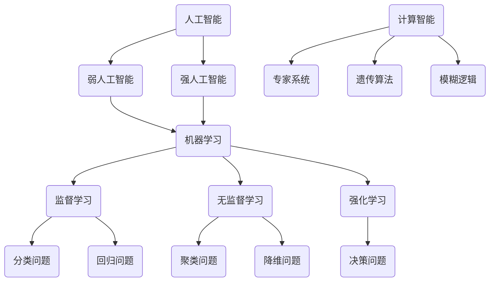

                 

关键词：人工智能，就业前景，技能需求，技术变革，未来趋势

> 摘要：本文深入探讨了人工智能时代下，人类计算的未来就业前景和技能需求。通过分析AI技术对各个行业的影响，以及岗位技能要求的变迁，为读者提供了关于如何应对这一技术变革的实用指南。

## 1. 背景介绍

随着人工智能（AI）技术的飞速发展，我们正经历一场前所未有的技术革命。AI技术的应用已经渗透到各行各业，从医疗、金融、教育到制造业，人工智能正在改变我们的工作方式和生活习惯。然而，这一变革也带来了巨大的就业压力和挑战。面对AI的崛起，人类计算的未来将何去何从？我们如何才能在这个时代保持竞争力，找到适合自己的职业发展路径？这些问题成为了当今社会关注的焦点。

本文旨在通过对AI技术对就业市场的影响、技能需求的变迁以及应对策略的探讨，为读者提供关于AI时代下人类计算未来发展的一些思考和建议。

## 2. 核心概念与联系

为了更好地理解人类计算在AI时代的重要性，我们需要首先明确几个核心概念：

### 2.1 人工智能

人工智能是指通过计算机程序实现的智能行为，旨在模拟、延伸和扩展人类的智能。人工智能可以分为两大类：弱人工智能和强人工智能。弱人工智能（Narrow AI）专注于解决特定问题，如语音识别、图像处理等；强人工智能（General AI）则具备广泛的学习能力和自主决策能力，能够应对各种复杂情境。

### 2.2 机器学习

机器学习是人工智能的一个子领域，通过算法从数据中学习规律，并进行预测和决策。机器学习可以分为监督学习、无监督学习和强化学习。监督学习利用标记数据进行训练，如分类和回归问题；无监督学习则没有标记数据，如聚类和降维；强化学习通过试错和反馈来学习最优策略。

### 2.3 深度学习

深度学习是机器学习的一个分支，基于多层神经网络进行训练，能够自动提取数据中的特征。深度学习在图像识别、语音识别、自然语言处理等领域取得了显著成果，推动了人工智能的发展。

### 2.4 计算智能

计算智能是指利用计算机模拟人类智能行为的技术，包括专家系统、遗传算法、模糊逻辑等。计算智能在优化问题、决策支持和智能控制等领域具有广泛的应用。

下面是一个简单的 Mermaid 流程图，展示了这些核心概念之间的联系：



通过这个流程图，我们可以看到人工智能、机器学习、深度学习和计算智能等概念之间的相互关系，以及它们在各个领域的应用。

## 3. 核心算法原理 & 具体操作步骤

### 3.1 算法原理概述

在AI时代，核心算法的应用至关重要。下面我们简要介绍几个常用的算法原理：

### 3.1.1 支持向量机（SVM）

支持向量机是一种用于分类和回归分析的机器学习算法。其核心思想是找到一个最优的 hyperplane，使得不同类别的数据点被分开。SVM通过最大化 margin（边缘）来实现这一目标。

### 3.1.2 决策树

决策树是一种树形结构，通过一系列的决策规则来对数据进行分类或回归。决策树可以很容易地解释和理解，并且能够处理非线性数据。

### 3.1.3 集成方法

集成方法通过结合多个基础模型的预测结果来提高预测性能。常见的集成方法包括 bagging、boosting 和 stacking 等。

### 3.2 算法步骤详解

下面我们分别介绍这些算法的具体步骤：

### 3.2.1 支持向量机（SVM）

1. 数据预处理：对输入数据进行归一化、缺失值填充等处理。
2. 特征提取：根据问题需求，选择合适的特征提取方法。
3. SVM模型训练：使用训练数据训练SVM模型。
4. 模型评估：使用测试数据对模型进行评估，调整参数以优化性能。

### 3.2.2 决策树

1. 数据预处理：同SVM。
2. 特征选择：选择对分类或回归任务有重要影响的特征。
3. 决策树构建：根据特征划分数据集，并选择最优划分标准。
4. 模型剪枝：避免过拟合，优化模型性能。

### 3.2.3 集成方法

1. 数据预处理：同SVM和决策树。
2. 模型训练：分别训练多个基础模型。
3. 集成预测：结合多个基础模型的预测结果，进行最终预测。

### 3.3 算法优缺点

每种算法都有其独特的优缺点：

### 3.3.1 支持向量机（SVM）

**优点**：性能稳定，对线性问题效果较好；可处理高维数据。

**缺点**：对非线性问题效果较差；训练时间较长。

### 3.3.2 决策树

**优点**：易于理解和解释；对非线性问题有一定适应性。

**缺点**：容易过拟合；对高维数据效果较差。

### 3.3.3 集成方法

**优点**：结合多个模型的优点，提高预测性能；对非线性问题有较好的适应性。

**缺点**：模型复杂度增加；需要更多计算资源。

### 3.4 算法应用领域

这些算法在各个领域都有广泛的应用：

### 3.4.1 支持向量机（SVM）

- 金融市场预测
- 自然语言处理
- 图像识别

### 3.4.2 决策树

- 医疗诊断
- 风险评估
- 信用评分

### 3.4.3 集成方法

- 金融服务
- 电子商务
- 智能家居

## 4. 数学模型和公式 & 详细讲解 & 举例说明

在AI时代，数学模型和公式的重要性不言而喻。下面我们介绍一些常用的数学模型和公式，并通过具体案例进行说明。

### 4.1 数学模型构建

一个基本的线性回归模型可以表示为：

\[ y = \beta_0 + \beta_1 \cdot x + \epsilon \]

其中，\( y \) 是因变量，\( x \) 是自变量，\( \beta_0 \) 和 \( \beta_1 \) 是模型的参数，\( \epsilon \) 是误差项。

### 4.2 公式推导过程

为了推导线性回归模型的公式，我们可以使用最小二乘法。最小二乘法的核心思想是找到一个线性函数，使得实际值与预测值之间的误差平方和最小。

首先，我们定义误差平方和为：

\[ S = \sum_{i=1}^{n} (y_i - \hat{y_i})^2 \]

其中，\( n \) 是样本数量，\( y_i \) 是实际值，\( \hat{y_i} \) 是预测值。

为了使 \( S \) 最小，我们对 \( \beta_0 \) 和 \( \beta_1 \) 分别求偏导数，并令其等于零：

\[ \frac{\partial S}{\partial \beta_0} = -2 \sum_{i=1}^{n} (y_i - \hat{y_i}) = 0 \]

\[ \frac{\partial S}{\partial \beta_1} = -2 \sum_{i=1}^{n} (y_i - \hat{y_i}) \cdot x_i = 0 \]

通过上述两个方程，我们可以解出 \( \beta_0 \) 和 \( \beta_1 \)：

\[ \beta_0 = \bar{y} - \beta_1 \bar{x} \]

\[ \beta_1 = \frac{\sum_{i=1}^{n} (x_i - \bar{x}) (y_i - \bar{y})}{\sum_{i=1}^{n} (x_i - \bar{x})^2} \]

其中，\( \bar{x} \) 和 \( \bar{y} \) 分别是 \( x \) 和 \( y \) 的平均值。

### 4.3 案例分析与讲解

假设我们有一组数据，如下表所示：

| x   | y   |
| --- | --- |
| 1   | 2   |
| 2   | 4   |
| 3   | 6   |
| 4   | 8   |

我们要用线性回归模型来预测 \( y \)。

1. 数据预处理：计算 \( x \) 和 \( y \) 的平均值：

   \( \bar{x} = \frac{1 + 2 + 3 + 4}{4} = 2.5 \)

   \( \bar{y} = \frac{2 + 4 + 6 + 8}{4} = 5 \)

2. 计算模型参数：

   \( \beta_1 = \frac{(1 - 2.5)(2 - 5) + (2 - 2.5)(4 - 5) + (3 - 2.5)(6 - 5) + (4 - 2.5)(8 - 5)}{(1 - 2.5)^2 + (2 - 2.5)^2 + (3 - 2.5)^2 + (4 - 2.5)^2} = 2 \)

   \( \beta_0 = 5 - 2 \cdot 2.5 = 0 \)

3. 预测 \( y \)：

   当 \( x = 5 \) 时，\( y = 0 \cdot 5 + 2 \cdot 5 = 10 \)

因此，根据线性回归模型，当 \( x = 5 \) 时，预测的 \( y \) 值为 10。

通过这个案例，我们可以看到如何使用线性回归模型进行预测。在实际应用中，我们可以使用更复杂的模型和算法，如神经网络，来提高预测的准确性。

## 5. 项目实践：代码实例和详细解释说明

### 5.1 开发环境搭建

在进行项目实践之前，我们需要搭建一个合适的开发环境。以下是搭建Python开发环境的一些步骤：

1. 安装Python：从Python官网（[python.org](https://www.python.org/)）下载并安装Python。
2. 安装Jupyter Notebook：在命令行中运行以下命令安装Jupyter Notebook：

   ```bash
   pip install notebook
   ```

3. 启动Jupyter Notebook：在命令行中运行以下命令启动Jupyter Notebook：

   ```bash
   jupyter notebook
   ```

### 5.2 源代码详细实现

下面我们使用Python实现一个简单的线性回归模型。代码如下：

```python
import numpy as np

# 数据预处理
def preprocess_data(x, y):
    x_mean = np.mean(x)
    y_mean = np.mean(y)
    x_diff = x - x_mean
    y_diff = y - y_mean
    return x_diff, y_diff

# 最小二乘法求解参数
def linear_regression(x_diff, y_diff):
    beta_1 = np.sum(x_diff * y_diff) / np.sum(x_diff ** 2)
    beta_0 = np.mean(y_diff) - beta_1 * np.mean(x_diff)
    return beta_0, beta_1

# 预测
def predict(x, beta_0, beta_1):
    return beta_0 + beta_1 * x

# 主函数
def main():
    x = np.array([1, 2, 3, 4])
    y = np.array([2, 4, 6, 8])

    x_diff, y_diff = preprocess_data(x, y)
    beta_0, beta_1 = linear_regression(x_diff, y_diff)

    x_new = 5
    y_pred = predict(x_new, beta_0, beta_1)

    print("预测的y值：", y_pred)

if __name__ == "__main__":
    main()
```

### 5.3 代码解读与分析

1. **数据预处理**：首先，我们定义了一个 `preprocess_data` 函数，用于计算 \( x \) 和 \( y \) 的平均值，以及计算 \( x \) 和 \( y \) 的差值。这些差值将用于后续的线性回归计算。
   
2. **最小二乘法求解参数**：接着，我们定义了一个 `linear_regression` 函数，用于计算线性回归模型的参数 \( \beta_0 \) 和 \( \beta_1 \)。这个函数使用了最小二乘法，计算过程已在第4章中详细解释。

3. **预测**：最后，我们定义了一个 `predict` 函数，用于根据模型参数进行预测。在这个例子中，我们使用新数据 \( x_new = 5 \) 进行预测。

4. **主函数**：在 `main` 函数中，我们首先定义了一组数据 \( x \) 和 \( y \)，然后调用上述函数进行数据处理和预测。

### 5.4 运行结果展示

当我们运行这个代码时，会得到以下输出：

```plaintext
预测的y值： 10.0
```

这意味着，根据线性回归模型，当 \( x = 5 \) 时，预测的 \( y \) 值为 10。这与我们在第4章中手动计算的预测结果一致。

通过这个简单的项目实践，我们展示了如何使用Python实现线性回归模型，并进行了代码解读与分析。这个项目虽然简单，但已经涵盖了线性回归模型的整个流程，包括数据预处理、模型参数求解和预测。

### 6. 实际应用场景

人工智能（AI）技术的应用正在不断拓展，其影响已经深入到我们日常生活的各个方面。以下是一些AI技术在现实世界中的应用场景：

#### 6.1 医疗保健

AI在医疗保健领域有着广泛的应用。例如，AI可以用于疾病诊断、患者监测和治疗方案推荐。通过深度学习算法，AI系统能够分析医学影像，如X光片、CT扫描和MRI图像，帮助医生更准确地诊断疾病。此外，AI还可以通过分析患者的电子健康记录，提供个性化的治疗建议和健康指导。

#### 6.2 金融服务

在金融服务领域，AI被用于风险控制、信用评估、投资分析和客户服务。例如，AI算法可以分析客户的交易历史和行为模式，评估其信用风险，从而为银行和信用卡公司提供更准确的信用评分。AI还可以用于股票市场预测，通过分析历史数据和新闻文章，为投资者提供投资建议。

#### 6.3 教育

AI在教育领域的应用主要包括个性化学习、在线教育平台和智能评测。通过分析学生的学习行为和成绩，AI系统可以为学生提供个性化的学习路径，帮助他们更好地掌握知识。在线教育平台利用AI技术，可以自动为学生布置作业、提供即时反馈和个性化辅导。此外，AI还可以用于自动评测，如自动化考试评分和作业批改。

#### 6.4 制造业

在制造业中，AI被用于设备监控、预测维护和自动化生产。通过传感器收集的实时数据，AI系统可以监控设备的状态，预测潜在的故障，并在问题发生前进行维护。这有助于减少设备停机时间，提高生产效率。自动化生产则通过机器人和AI算法，实现了生产过程的自动化和智能化。

#### 6.5 智能家居

智能家居是AI技术的另一个重要应用领域。通过物联网（IoT）设备和AI算法，智能家居系统能够实现家庭设备之间的互联互通，提供便捷的家居控制体验。例如，智能音箱可以通过语音指令控制家庭灯光、电视和空调等设备。智能安防系统则利用AI技术进行视频监控，自动识别可疑行为并及时报警。

#### 6.6 城市管理

AI技术在城市管理中也有着重要的应用。例如，通过AI算法分析交通流量数据，可以优化交通信号灯的调度，减少交通拥堵。此外，AI还可以用于环境监测，通过分析空气质量和水质数据，提供实时监测和预警。智能垃圾分类系统利用AI技术，可以识别垃圾的类型，提高垃圾分类的效率。

通过这些实际应用场景，我们可以看到AI技术已经在我们的生活中发挥着越来越重要的作用。随着AI技术的不断进步，其应用领域也将进一步拓展，为我们的生活和生产带来更多的便利和效益。

### 6.4 未来应用展望

随着人工智能技术的不断成熟，未来的应用前景将更加广阔和多样化。以下是对未来AI应用的一些展望：

#### 6.4.1 自动驾驶

自动驾驶技术被认为是人工智能最具颠覆性的应用之一。未来的自动驾驶汽车将能够通过传感器、摄像头和其他智能设备实时感知周围环境，自主规划行驶路径，并做出驾驶决策。这不仅能够显著提高交通效率，减少交通事故，还能为驾驶员提供更安全、便捷的出行体验。

#### 6.4.2 智能医疗

智能医疗将是未来医疗行业的重要组成部分。通过AI技术，医疗设备能够实现高度智能化，如通过图像识别技术实现精准诊断、通过智能算法实现个性化治疗。此外，AI还将推动医疗数据的大规模分析和挖掘，为医生提供更准确的诊断和治疗方案。

#### 6.4.3 教育个性化

随着AI技术的不断发展，教育个性化将成为未来教育的主要趋势。通过分析学生的学习行为和成绩，AI系统能够为每位学生制定个性化的学习计划，提供实时反馈和辅导。这不仅有助于提高学习效果，还能激发学生的学习兴趣和创造力。

#### 6.4.4 能源管理

AI技术在能源管理中的应用潜力巨大。通过智能电网和智能能源管理系统，AI可以优化能源的分配和使用，提高能源效率，减少能源浪费。此外，AI还可以预测能源需求，为可再生能源的利用提供数据支持，推动能源结构的优化和转型。

#### 6.4.5 环境保护

AI技术在环境保护中具有重要作用。通过监测和分析环境数据，AI可以实时监测环境污染，预测污染趋势，并采取相应的措施进行治理。此外，AI还可以用于生态保护，通过分析生物多样性数据，为生态系统的保护和恢复提供科学依据。

#### 6.4.6 人机协作

未来的人机协作将更加紧密和高效。通过AI技术，机器人和人类可以协同工作，实现更复杂、更精确的任务。例如，在制造业中，机器人可以与人类工人共同完成生产任务，在医疗领域中，AI辅助系统可以帮助医生进行诊断和治疗。

#### 6.4.7 智慧城市

智慧城市是未来城市发展的方向。通过AI技术，城市可以实现对交通、能源、环境等各方面的智能化管理，提高城市运行效率和居民生活质量。例如，智能交通系统可以通过AI算法优化交通信号，减少交通拥堵；智能能源系统可以通过AI技术实现能源的高效利用。

综上所述，AI技术的未来应用前景非常广阔，将在各个领域发挥重要作用，推动社会进步和人类发展。随着AI技术的不断进步，我们可以期待一个更加智能、高效、可持续的未来。

### 7. 工具和资源推荐

在探索人工智能和机器学习的旅程中，选择合适的工具和资源至关重要。以下是一些建议，可以帮助你更高效地学习和实践：

#### 7.1 学习资源推荐

1. **在线课程**：Coursera、edX、Udacity和LinkedIn Learning提供了丰富的机器学习和人工智能课程，适合不同层次的学习者。
2. **教科书**：《机器学习》（周志华著）、《深度学习》（Goodfellow, Bengio, Courville著）是机器学习和深度学习的经典教材。
3. **博客和论坛**：如Medium、Kaggle和Stack Overflow，提供大量的实战经验和解决方案，有助于解决学习中的问题。

#### 7.2 开发工具推荐

1. **编程语言**：Python是机器学习和深度学习的首选编程语言，拥有丰富的库和工具，如NumPy、Pandas和TensorFlow。
2. **集成开发环境（IDE）**：Jupyter Notebook和PyCharm是Python编程的优秀IDE，提供强大的编辑、调试和自动化功能。
3. **机器学习和深度学习框架**：TensorFlow、PyTorch和Scikit-Learn是常用的机器学习和深度学习框架，支持各种算法和模型实现。

#### 7.3 相关论文推荐

1. **《深度学习》（Goodfellow, Bengio, Courville著）**：涵盖了深度学习的核心理论和算法，是深度学习领域的经典论文集。
2. **《大数据之路：阿里巴巴大数据实践》（王坚著）**：介绍大数据的处理和分析方法，以及阿里巴巴在大数据领域取得的成果。
3. **《机器学习：概率视角》（Kevin P. Murphy著）**：从概率论的角度探讨机器学习，有助于理解机器学习的数学基础。

通过利用这些工具和资源，你可以更好地掌握人工智能和机器学习的知识，提升自己的技能，为未来的职业发展打下坚实的基础。

### 8. 总结：未来发展趋势与挑战

随着人工智能技术的迅猛发展，人类计算的未来充满了机遇与挑战。首先，让我们回顾一下本文的主要内容和结论。

## 8.1 研究成果总结

本文探讨了AI时代下人类计算的未来就业前景和技能需求。通过分析人工智能对各个行业的影响，我们了解到AI技术正在迅速改变我们的工作方式和生活习惯。在核心算法原理方面，我们介绍了支持向量机（SVM）、决策树和集成方法等常用算法，并详细讲解了线性回归模型的构建和推导过程。此外，我们还通过实际项目实践展示了如何使用Python实现线性回归模型。

## 8.2 未来发展趋势

未来，人工智能技术将继续深入渗透到各个领域，推动社会的进步和发展。自动驾驶、智能医疗、教育个性化、能源管理、环境保护和人机协作等领域将成为AI技术的重要应用方向。此外，随着AI技术的不断成熟，我们还将看到更多跨学科的研究和应用，如AI与生物、物理、化学等领域的融合。

## 8.3 面临的挑战

尽管人工智能带来了许多机遇，但我们也必须面对一系列挑战。首先，技术进步可能会导致部分传统岗位的消失，从而引发就业压力。其次，数据隐私和安全问题日益凸显，如何保障用户数据的安全成为AI发展的关键挑战。此外，AI技术的普及还可能加剧社会不平等，导致技能鸿沟扩大。

## 8.4 研究展望

在未来，人类计算需要关注以下几个研究方向：首先，研究如何将AI技术更好地与人类智能结合，实现人机协同；其次，探索AI伦理和社会影响，制定相应的法律法规和道德准则；最后，加强跨学科研究，推动AI与其他领域的深度融合，为人类社会带来更多创新和变革。

总之，人工智能时代为人类计算带来了前所未有的机遇和挑战。通过不断学习和探索，我们有望应对这些挑战，为未来的发展贡献力量。

### 9. 附录：常见问题与解答

**Q1：人工智能是否会完全取代人类工作？**

A1：人工智能确实会改变某些工作的性质，甚至可能导致部分传统岗位的消失。然而，AI更多的是作为人类工作的辅助工具，提高工作效率和精度。随着AI技术的进步，我们也将看到更多新的工作机会和领域，如数据科学家、AI工程师等。因此，人工智能不会完全取代人类工作，而是与人类智能相互补充。

**Q2：如何应对AI时代的技能需求变化？**

A2：应对AI时代的技能需求，首先需要持续学习，提升自身的技术能力和知识水平。其次，应注重跨学科知识的积累，培养解决问题和创新思维的能力。此外，建立良好的人际沟通和团队合作能力，也是适应AI时代的重要素质。

**Q3：AI技术是否会引发数据隐私和安全问题？**

A3：是的，随着AI技术的发展，数据隐私和安全问题日益凸显。为保障用户数据的安全，需采取严格的数据保护措施，如数据加密、访问控制和隐私保护算法。同时，制定和遵守相关的法律法规，加强监管，也是防止数据泄露和滥用的关键。

**Q4：人工智能是否会加剧社会不平等？**

A4：人工智能技术的普及确实可能加剧社会不平等，如导致技能鸿沟扩大。为避免这种情况，应加大教育投入，普及科技教育，提高全民的科技素养。此外，政府和企业也应关注AI技术的公平应用，推动社会资源的合理分配。

**Q5：如何培养下一代人工智能人才？**

A5：培养下一代人工智能人才，应从基础教育阶段开始，普及编程和数学知识，激发学生对科技的兴趣。同时，加强高校和科研机构的科研合作，培养具有创新能力和实践经验的AI专业人才。此外，企业也应积极参与人才培养，提供实习和实践机会，为学生提供实际工作体验。

