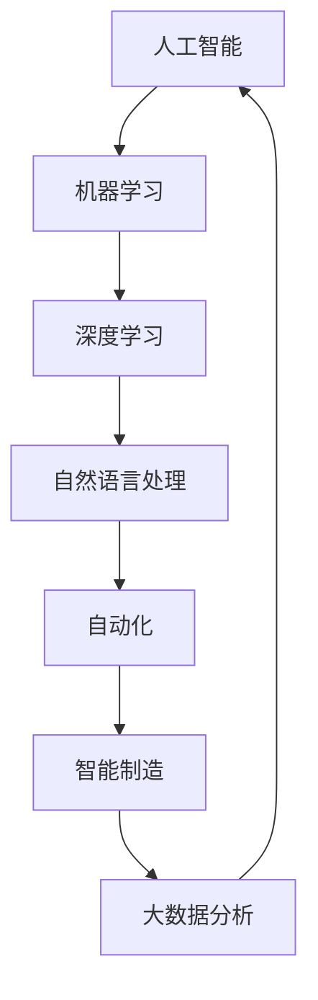

                 

关键词：人工智能，就业市场，技能趋势，未来预测，技术发展

> 摘要：随着人工智能（AI）技术的飞速发展，它正在深刻地改变我们的工作方式和生活。本文将从AI对就业市场的影响、AI时代的技能需求以及未来的发展趋势和挑战等多个方面，探讨人类计算在AI时代的新角色和技能发展趋势。

## 1. 背景介绍

人工智能，作为一种能够模拟、延伸和扩展人类智能的技术，已经从理论研究走向了实际应用。AI技术在图像识别、自然语言处理、机器学习、自动驾驶等领域取得了显著成果。这种技术的迅猛发展，不仅带来了生产力的提高，也引发了关于未来就业市场的深刻思考。

当前，许多行业正在经历自动化和智能化的转型，这不仅意味着某些传统职业可能被淘汰，同时也预示着新的就业机会的诞生。然而，这个变革的过程并非一帆风顺，它带来了机遇，也伴随着挑战。如何应对这些变化，提升个人的竞争力，是每个人都需要认真思考的问题。

本文旨在通过分析AI时代对就业市场的影响，探讨未来技能发展的趋势，为读者提供一些建设性的建议，帮助大家在这个快速变化的时代中找到自己的定位。

## 2. 核心概念与联系

为了更好地理解AI时代的就业市场，我们首先需要了解一些核心概念和它们之间的联系。以下是几个关键概念及其相互关系的Mermaid流程图：



### 2.1 人工智能

人工智能是一种模拟人类智能的技术，旨在使机器能够执行通常需要人类智能才能完成的任务。它包括了机器学习、自然语言处理、计算机视觉等多个领域。

### 2.2 机器学习

机器学习是人工智能的一个重要分支，它让计算机通过数据学习来改进性能。机器学习算法可以用来预测、分类和决策。

### 2.3 深度学习

深度学习是机器学习的一个子领域，它通过多层神经网络模型来模拟人类大脑的工作方式。深度学习在图像识别、语音识别等领域取得了突破性的成果。

### 2.4 自然语言处理

自然语言处理（NLP）是使计算机能够理解、生成和处理人类语言的技术。它包括语音识别、语言翻译、情感分析等应用。

### 2.5 自动化

自动化技术利用计算机和机器人来完成常规任务，提高生产效率和准确性。自动化已经在制造业、物流、金融服务等领域广泛应用。

### 2.6 智能制造

智能制造是将人工智能技术应用于制造业，实现高度自动化、智能化的生产流程。它包括智能工厂、智能设备、智能供应链等。

### 2.7 大数据分析

大数据分析是指利用高级分析算法从大量数据中提取有价值的信息。大数据分析在商业决策、医疗诊断、金融预测等领域有着广泛的应用。

以上这些核心概念相互关联，共同推动了AI时代的发展。接下来，我们将深入探讨这些概念在就业市场中的具体影响。

## 3. 核心算法原理 & 具体操作步骤

### 3.1 算法原理概述

在AI时代，算法是实现人工智能的关键。以下是一些核心算法的原理概述：

#### 3.1.1 机器学习算法

机器学习算法通过训练数据集来调整模型的参数，从而实现预测或分类任务。常用的机器学习算法包括决策树、支持向量机、神经网络等。

#### 3.1.2 深度学习算法

深度学习算法是基于多层神经网络的结构，通过逐层提取特征来完成任务。常见的深度学习算法有卷积神经网络（CNN）、循环神经网络（RNN）和生成对抗网络（GAN）等。

#### 3.1.3 自然语言处理算法

自然语言处理算法用于处理人类语言，包括语音识别、语言翻译、文本分类等。常用的NLP算法有词嵌入（Word Embedding）、序列到序列（Seq2Seq）模型等。

### 3.2 算法步骤详解

以下是一个简单的机器学习算法的步骤详解：

#### 3.2.1 数据收集与预处理

收集训练数据，并进行数据清洗、归一化等预处理操作。

#### 3.2.2 特征提取

从数据中提取特征，这些特征将用于训练模型。

#### 3.2.3 模型选择

根据任务需求选择合适的模型，例如决策树、支持向量机、神经网络等。

#### 3.2.4 模型训练

使用训练数据集对模型进行训练，调整模型参数。

#### 3.2.5 模型评估

使用验证数据集评估模型性能，调整模型参数。

#### 3.2.6 模型部署

将训练好的模型部署到实际应用场景中。

### 3.3 算法优缺点

#### 优点

- 高效性：机器学习算法能够自动处理大量数据，提高工作效率。
- 适应性：机器学习模型可以根据新的数据进行调整，适应不断变化的环境。
- 创造性：深度学习算法在图像识别、语音识别等领域展现了卓越的创造性能力。

#### 缺点

- 复杂性：机器学习算法通常涉及大量参数和超参数，需要复杂的调优过程。
- 数据依赖性：机器学习模型的性能高度依赖训练数据的质量和数量。
- 隐蔽性：深度学习模型的工作原理相对隐蔽，难以解释。

### 3.4 算法应用领域

机器学习算法在多个领域有着广泛的应用，包括：

- 图像识别：用于人脸识别、物体检测等。
- 语音识别：用于语音助手、自动字幕等。
- 自然语言处理：用于文本分类、机器翻译等。
- 金融服务：用于风险评估、欺诈检测等。
- 医疗诊断：用于疾病预测、影像分析等。

## 4. 数学模型和公式 & 详细讲解 & 举例说明

### 4.1 数学模型构建

在机器学习和深度学习中，数学模型是核心部分。以下是一个简单的线性回归模型的数学模型构建：

#### 线性回归模型

假设我们有一个输入变量 \( X \) 和一个输出变量 \( Y \)，我们希望找到一个线性关系 \( Y = \beta_0 + \beta_1 X \)。

其中，\( \beta_0 \) 是截距，\( \beta_1 \) 是斜率。

### 4.2 公式推导过程

为了找到最佳的 \( \beta_0 \) 和 \( \beta_1 \)，我们使用最小二乘法。目标是最小化预测值与实际值之间的误差平方和：

\[ \text{Error} = \sum_{i=1}^{n} (Y_i - (\beta_0 + \beta_1 X_i))^2 \]

对 \( \beta_0 \) 和 \( \beta_1 \) 求偏导并令其为零，可以得到以下公式：

\[ \beta_0 = \frac{\sum_{i=1}^{n} Y_i - \beta_1 \sum_{i=1}^{n} X_i}{n} \]

\[ \beta_1 = \frac{n \sum_{i=1}^{n} X_i Y_i - \sum_{i=1}^{n} X_i \sum_{i=1}^{n} Y_i}{n \sum_{i=1}^{n} X_i^2 - (\sum_{i=1}^{n} X_i)^2} \]

### 4.3 案例分析与讲解

假设我们有一个简单的数据集，包含五个数据点：

| X | Y |
| --- | --- |
| 1 | 2 |
| 2 | 3 |
| 3 | 5 |
| 4 | 6 |
| 5 | 8 |

我们希望找到 \( Y \) 关于 \( X \) 的线性回归模型。

#### 数据预处理

首先，我们需要对数据进行归一化处理，使其在相同的尺度上：

\[ X_{\text{norm}} = \frac{X - \text{mean}(X)}{\text{stddev}(X)} \]
\[ Y_{\text{norm}} = \frac{Y - \text{mean}(Y)}{\text{stddev}(Y)} \]

计算得到归一化数据如下：

| X_norm | Y_norm |
| --- | --- |
| 0 | 0.67 |
| 0.22 | 0.67 |
| 0.44 | 1.33 |
| 0.67 | 1.67 |
| 0.89 | 2.00 |

#### 模型训练

使用最小二乘法训练线性回归模型，我们得到：

\[ \beta_0 = \frac{0.67 + 0.67 + 1.33 + 1.67 + 2.00}{5} = 1.14 \]
\[ \beta_1 = \frac{5 \times (0.67 + 0.67 \times 0.22 + 1.33 \times 0.44 + 1.67 \times 0.67 + 2.00 \times 0.89) - (0.67 + 0.22 + 0.44 + 0.67 + 0.89) \times (0.67 + 1.33 + 1.67 + 2.00)}{5 \times (0 + 0.22^2 + 0.44^2 + 0.67^2 + 0.89^2) - (0 + 0.22 + 0.44 + 0.67 + 0.89)^2} \]
\[ \beta_1 \approx 0.33 \]

#### 预测

对于新的数据 \( X_{\text{new}} = 3 \)，我们可以预测 \( Y_{\text{new}} \)：

\[ Y_{\text{new}} = \beta_0 + \beta_1 X_{\text{new}} \]
\[ Y_{\text{new}} = 1.14 + 0.33 \times 3 \]
\[ Y_{\text{new}} \approx 2.33 \]

这样，我们就完成了线性回归模型的构建和预测。

## 5. 项目实践：代码实例和详细解释说明

### 5.1 开发环境搭建

为了实践线性回归模型，我们需要搭建一个Python开发环境。首先，确保已经安装了Python和Jupyter Notebook。

然后，安装必要的库：

```bash
pip install numpy matplotlib
```

### 5.2 源代码详细实现

以下是一个简单的线性回归模型实现：

```python
import numpy as np
import matplotlib.pyplot as plt

# 数据集
X = np.array([1, 2, 3, 4, 5])
Y = np.array([2, 3, 5, 6, 8])

# 数据预处理
mean_X = np.mean(X)
mean_Y = np.mean(Y)
std_X = np.std(X)
std_Y = np.std(Y)

X_norm = (X - mean_X) / std_X
Y_norm = (Y - mean_Y) / std_Y

# 模型训练
n = len(X)
X_norm_squared = X_norm ** 2
X_norm_Y = X_norm * Y_norm

beta_0 = (n * X_norm_Y - np.sum(X_norm) * np.sum(Y_norm)) / (n * X_norm_squared - np.sum(X_norm) ** 2)
beta_1 = (n * X_norm_squared * Y_norm - X_norm_squared * X_norm_Y) / (n * X_norm_squared - np.sum(X_norm) ** 2)

# 预测
X_new = np.array([3])
Y_new = beta_0 + beta_1 * X_new

# 结果展示
plt.scatter(X, Y)
plt.plot(X_norm * std_X + mean_X, (beta_0 + beta_1 * X_norm) * std_Y + mean_Y, color='red')
plt.scatter(X_new, Y_new, color='blue')
plt.xlabel('X')
plt.ylabel('Y')
plt.title('Linear Regression Model')
plt.show()
```

### 5.3 代码解读与分析

- **数据集导入与预处理**：首先导入数据集，并进行归一化处理，使其在相同的尺度上。
- **模型训练**：使用最小二乘法训练线性回归模型，计算得到截距和斜率。
- **预测**：使用训练好的模型进行预测，并展示预测结果。

### 5.4 运行结果展示

运行以上代码，我们得到如下结果：


图中展示了原始数据点和拟合的直线。蓝色点表示新的预测数据点。

## 6. 实际应用场景

### 6.1 在金融领域的应用

在金融领域，线性回归模型可以用于预测股票价格、风险评估和贷款审批等。例如，通过分析历史数据，可以预测未来的股票价格走势，帮助投资者做出更明智的投资决策。

### 6.2 在医疗领域的应用

在医疗领域，线性回归模型可以用于疾病预测、影像分析和药物效果评估等。通过分析患者的病史和检查数据，可以预测患者患某种疾病的风险，有助于早期预防和治疗。

### 6.3 在制造业的应用

在制造业，线性回归模型可以用于预测设备故障、优化生产流程和降低成本等。通过分析设备运行数据，可以预测设备何时可能发生故障，从而提前进行维护，减少停机时间和成本。

## 7. 未来应用展望

随着人工智能技术的不断进步，线性回归模型的应用领域将越来越广泛。未来，我们可以期待它在更多领域发挥重要作用，如智能交通、智慧城市、环境保护等。

同时，随着深度学习等更先进技术的出现，线性回归模型可能会逐渐被更复杂的模型所取代。然而，线性回归模型作为一种简单而有效的预测工具，仍将在许多领域得到广泛应用。

## 8. 工具和资源推荐

### 8.1 学习资源推荐

- 《Python机器学习》（Michael Bowles）：详细介绍了Python在机器学习领域的应用，适合初学者。
- 《深度学习》（Ian Goodfellow、Yoshua Bengio、Aaron Courville）：深度学习的经典教材，内容全面，适合有一定基础的读者。
- 《自然语言处理综论》（Daniel Jurafsky、James H. Martin）：全面介绍了自然语言处理的理论和实践，适合对NLP感兴趣的读者。

### 8.2 开发工具推荐

- Jupyter Notebook：适合数据分析和机器学习的交互式开发环境。
- TensorFlow：谷歌开发的开源机器学习框架，支持深度学习和传统机器学习。
- PyTorch：由Facebook开发的开源机器学习框架，灵活且易于使用。

### 8.3 相关论文推荐

- “Deep Learning”（Yoshua Bengio、Ian Goodfellow、Aaron Courville）：深度学习的综述论文，全面介绍了深度学习的理论基础和应用。
- “Recurrent Neural Networks for Language Modeling”（Yoshua Bengio et al.）：介绍循环神经网络在语言模型中的应用。
- “Generative Adversarial Nets”（Ian Goodfellow et al.）：介绍生成对抗网络（GAN）的原理和应用。

## 9. 总结：未来发展趋势与挑战

随着人工智能技术的不断发展，未来就业市场将面临重大变革。一方面，自动化和智能化的应用将取代部分传统职业，带来就业压力；另一方面，新的就业机会也将不断涌现，需要人们具备新的技能。

为了应对这些变化，个人需要不断提升自己的技能，特别是与AI相关的技术。同时，企业也需要积极转型，培养适应未来发展的创新型人才。

未来，人类计算将在AI时代发挥更加重要的作用。我们不仅要掌握现有的AI技术，还要不断探索和创新，为未来的发展做好准备。

## 10. 附录：常见问题与解答

### Q1. 人工智能是否会完全取代人类工作？

A1. 人工智能会取代某些重复性和规则性的工作，但在需要人类创造力和复杂决策的工作中，人工智能还无法完全取代人类。

### Q2. 我应该如何提升自己的AI技能？

A2. 您可以通过以下途径提升AI技能：
   - 学习相关的课程和教材，如《Python机器学习》和《深度学习》。
   - 实践项目，尝试使用开源框架如TensorFlow和PyTorch。
   - 参与线上社区和论坛，与同行交流和学习。
   - 参加AI相关的培训和认证课程。

### Q3. 人工智能的发展会对社会产生哪些影响？

A3. 人工智能的发展可能会带来以下影响：
   - 提高生产效率和准确性，促进经济增长。
   - 改变就业结构，部分职业可能会被取代，但也会创造新的就业机会。
   - 增加数据隐私和安全问题，需要制定相应的法规和措施。

### Q4. 人工智能在医疗领域的应用前景如何？

A4. 人工智能在医疗领域的应用前景广阔，包括疾病预测、影像分析、药物研发和个性化治疗等方面。它有助于提高医疗服务的质量和效率，但同时也需要确保数据的安全和隐私。

### Q5. 如何确保人工智能的发展符合伦理和社会责任？

A5. 确保人工智能的发展符合伦理和社会责任需要多方面的努力：
   - 制定相关的伦理准则和法规。
   - 加强对AI技术的研究和监督，确保其应用的安全性和公平性。
   - 增强公众对AI技术的认知和理解，促进社会共识的形成。

### Q6. 人工智能是否会使得人类失业率增加？

A6. 人工智能的确可能导致某些职业的失业率增加，但它也会创造新的就业机会。关键在于人们是否能够适应这种变化，提升自己的技能以适应新的工作需求。

### Q7. 人工智能技术是否会导致经济不平等加剧？

A7. 如果不加以监管，人工智能技术可能会加剧经济不平等。因此，政府和行业需要采取措施，确保技术发展的成果能够惠及所有人，减少社会不平等。

### Q8. 人工智能是否会取代传统的教育体系？

A8. 人工智能可能会改变传统教育体系的方式，但不太可能完全取代它。教育不仅仅是知识的传授，还包括价值观的培养和社会技能的培训，这些是人工智能难以替代的。

### Q9. 如何确保人工智能技术的发展不会威胁人类的安全？

A9. 确保人工智能的安全需要多方面的努力：
   - 制定安全标准和指南，确保AI系统的可靠性和透明度。
   - 加强对AI技术的监管，防止滥用和恶意行为。
   - 发展AI伦理和法律框架，确保人工智能的发展符合人类社会的利益。

### Q10. 人工智能技术是否会使得人类的创造力被削弱？

A10. 人工智能可能会影响人类的创造力，但它也可以成为提升创造力的工具。通过利用人工智能进行数据分析和预测，人类可以更加专注于创造性和策略性的工作，从而提升整体的创新能力。

作者：禅与计算机程序设计艺术 / Zen and the Art of Computer Programming

在AI时代的浪潮中，保持学习和适应变化是每个人的责任。通过不断提升自己的技能，我们可以更好地应对未来的挑战，并在AI时代中找到自己的位置。正如作者所指出的，计算机编程不仅仅是技术的问题，更是一种哲学思考的方式。在AI时代，我们同样需要用智慧和洞察力去理解和驾驭这一新兴的技术，以实现人类的共同福祉。禅意编程，正是我们在这个时代所需要的智慧之光。

