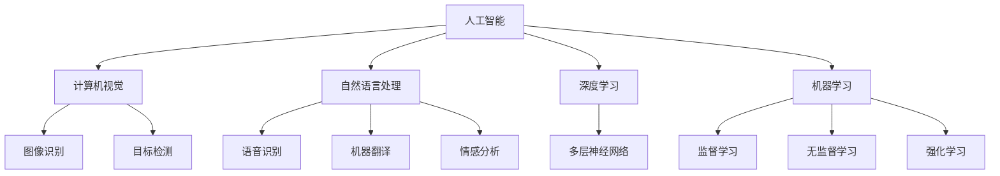

                 

关键词：人工智能，就业市场，技能培训，未来趋势，计算技术

摘要：随着人工智能技术的飞速发展，人类计算的角色和就业市场正在经历深刻的变革。本文从背景介绍、核心概念与联系、核心算法原理、数学模型与公式、项目实践、实际应用场景、工具和资源推荐以及未来发展趋势与挑战等方面，全面探讨AI时代人类计算的未来就业市场与技能培训发展。

## 1. 背景介绍

人工智能（AI）作为计算机科学的一个重要分支，已经走过了数十年的发展历程。从早期的符号逻辑推理、知识表示到现代的深度学习、神经网络，人工智能技术取得了显著的进步。随着计算能力的提升和大数据的普及，人工智能正在逐渐渗透到各行各业，从自动驾驶、智能制造到金融分析、医疗诊断，AI的应用场景日益丰富。

然而，人工智能的迅速发展也带来了就业市场的巨大变革。一方面，AI技术的应用提高了生产效率，减少了人力需求，导致部分传统岗位的消失。另一方面，新兴的AI相关岗位不断涌现，对人才的需求也在快速增长。因此，如何应对AI时代的就业市场变革，提高个人的计算技能和适应能力，成为当前亟需解决的问题。

## 2. 核心概念与联系

为了更好地理解人类计算在AI时代的发展，我们需要先了解一些核心概念和它们之间的联系。

### 2.1 人工智能

人工智能是一种模拟人类智能的计算机系统，包括感知、理解、学习、推理、规划、决策和自然语言处理等多种能力。人工智能的核心是实现智能行为，这需要通过对大量数据的处理和分析，以及复杂的算法和计算模型的支持。

### 2.2 计算机视觉

计算机视觉是人工智能的一个重要分支，旨在使计算机能够理解并解析视觉信息。计算机视觉技术包括图像识别、目标检测、图像分割、三维重建等，这些技术在自动驾驶、安防监控、医疗影像分析等领域有广泛应用。

### 2.3 自然语言处理

自然语言处理（NLP）是人工智能的另一个重要分支，专注于使计算机能够理解、生成和操作自然语言。NLP技术包括语音识别、机器翻译、情感分析、问答系统等，这些技术在智能客服、智能助手、内容审核等领域有广泛应用。

### 2.4 深度学习

深度学习是人工智能的一个重要分支，它通过多层神经网络模型对数据进行处理和分析。深度学习在图像识别、语音识别、自然语言处理等领域取得了突破性进展，是当前人工智能技术的重要支撑。

### 2.5 机器学习

机器学习是人工智能的核心技术之一，它通过算法和统计模型使计算机能够从数据中学习和预测。机器学习包括监督学习、无监督学习、强化学习等多种类型，广泛应用于数据分析、预测建模、推荐系统等领域。

为了更好地理解这些核心概念之间的联系，我们可以使用Mermaid流程图来展示它们的关系：



## 3. 核心算法原理 & 具体操作步骤

### 3.1 算法原理概述

在AI时代，核心算法原理包括深度学习、机器学习和计算机视觉等多个领域。以下分别对这些算法原理进行概述：

### 3.1.1 深度学习

深度学习是通过多层神经网络对数据进行处理和分析的算法。它通过前向传播和反向传播的方式，将输入数据通过多层神经网络转化为输出结果。深度学习在图像识别、语音识别、自然语言处理等领域有广泛应用。

### 3.1.2 机器学习

机器学习是通过算法和统计模型使计算机能够从数据中学习和预测的技术。它包括监督学习、无监督学习和强化学习等多种类型。监督学习通过已知的数据集训练模型，无监督学习通过未标记的数据集发现数据模式，强化学习通过试错和奖励机制进行学习。

### 3.1.3 计算机视觉

计算机视觉是通过计算机对图像和视频进行解析和理解的技术。它包括图像识别、目标检测、图像分割、三维重建等多个方面。计算机视觉技术在自动驾驶、安防监控、医疗影像分析等领域有广泛应用。

### 3.2 算法步骤详解

以下是核心算法的具体步骤详解：

### 3.2.1 深度学习

1. 数据预处理：对输入数据进行预处理，包括归一化、标准化、去噪声等。
2. 网络架构设计：设计多层神经网络架构，包括卷积层、全连接层、池化层等。
3. 损失函数选择：选择合适的损失函数，如交叉熵损失、均方误差等。
4. 优化算法选择：选择合适的优化算法，如梯度下降、随机梯度下降等。
5. 训练过程：通过前向传播和反向传播，不断调整网络权重，直到模型达到预期效果。

### 3.2.2 机器学习

1. 数据收集：收集训练数据和测试数据。
2. 特征提取：从数据中提取特征，如图像的边缘、纹理等。
3. 模型训练：使用训练数据训练模型，包括参数初始化、损失函数计算、梯度下降等。
4. 模型评估：使用测试数据评估模型性能，如准确率、召回率等。
5. 模型优化：根据评估结果调整模型参数，提高模型性能。

### 3.2.3 计算机视觉

1. 图像预处理：对图像进行预处理，包括灰度化、二值化、滤波等。
2. 特征提取：从图像中提取特征，如SIFT、HOG等。
3. 目标检测：使用分类器对图像中的目标进行检测，如R-CNN、YOLO等。
4. 图像分割：将图像分割成多个区域，如FCN、U-Net等。
5. 三维重建：从多视角图像中重建三维场景，如结构光、SLAM等。

### 3.3 算法优缺点

以下是核心算法的优缺点：

### 3.3.1 深度学习

优点：深度学习具有强大的表达能力和自适应性，能够处理大量复杂数据，并实现高精度的预测和分类。

缺点：深度学习模型的训练过程需要大量数据和计算资源，且模型的可解释性较低。

### 3.3.2 机器学习

优点：机器学习模型具有较好的可解释性，易于理解和调整。

缺点：机器学习模型对数据质量和特征提取有较高要求，且在面对复杂问题时表现较差。

### 3.3.3 计算机视觉

优点：计算机视觉技术具有广泛的应用前景，能够处理图像和视频数据，实现目标检测、识别、跟踪等功能。

缺点：计算机视觉技术对计算资源和算法设计有较高要求，且在处理模糊图像和动态场景时表现较差。

### 3.4 算法应用领域

核心算法在多个领域有广泛应用，包括：

1. 自动驾驶：通过计算机视觉和深度学习技术，实现车辆的自动行驶和道路环境的感知。
2. 智能安防：通过图像识别和目标检测技术，实现监控视频的实时分析，提高安防效果。
3. 医疗诊断：通过深度学习和计算机视觉技术，实现医学影像的分析和诊断，提高诊断准确率。
4. 金融服务：通过自然语言处理和机器学习技术，实现金融风险的预测和管理，提高金融服务质量。

## 4. 数学模型和公式 & 详细讲解 & 举例说明

在人工智能和机器学习领域，数学模型和公式起着至关重要的作用。以下我们将介绍一些核心的数学模型和公式，并进行详细讲解和举例说明。

### 4.1 数学模型构建

在构建数学模型时，我们通常需要考虑以下几个关键因素：

1. **目标函数**：定义模型要优化或最小化的目标。
2. **损失函数**：衡量模型预测结果与真实值之间的差异。
3. **优化算法**：用于调整模型参数以最小化损失函数。

### 4.2 公式推导过程

以下是一个简单的线性回归模型的公式推导过程：

1. **假设**：我们假设数据点 \(x\) 和 \(y\) 之间存在线性关系：
   \[
   y = \beta_0 + \beta_1 x + \epsilon
   \]
   其中，\( \beta_0 \) 是截距，\( \beta_1 \) 是斜率，\( \epsilon \) 是误差项。

2. **最小化损失函数**：为了最小化预测值与真实值之间的差异，我们通常使用均方误差（MSE）作为损失函数：
   \[
   J(\beta_0, \beta_1) = \frac{1}{2m} \sum_{i=1}^{m} (y_i - (\beta_0 + \beta_1 x_i))^2
   \]
   其中，\( m \) 是数据点的数量。

3. **求导数**：为了找到损失函数的最小值，我们对 \( \beta_0 \) 和 \( \beta_1 \) 分别求导数：
   \[
   \frac{\partial J}{\partial \beta_0} = \frac{1}{m} \sum_{i=1}^{m} (y_i - (\beta_0 + \beta_1 x_i)) = 0
   \]
   \[
   \frac{\partial J}{\partial \beta_1} = \frac{1}{m} \sum_{i=1}^{m} (y_i - (\beta_0 + \beta_1 x_i)) x_i = 0
   \]

4. **解方程组**：解上述方程组，可以得到最优的 \( \beta_0 \) 和 \( \beta_1 \)：
   \[
   \beta_0 = \frac{1}{m} \sum_{i=1}^{m} y_i - \beta_1 \frac{1}{m} \sum_{i=1}^{m} x_i
   \]
   \[
   \beta_1 = \frac{1}{m} \sum_{i=1}^{m} (x_i - \bar{x})(y_i - \bar{y})
   \]
   其中，\( \bar{x} \) 和 \( \bar{y} \) 分别是 \( x \) 和 \( y \) 的均值。

### 4.3 案例分析与讲解

假设我们有一组数据点：
\[
\begin{align*}
x_1 &= 1, & y_1 &= 2 \\
x_2 &= 2, & y_2 &= 4 \\
x_3 &= 3, & y_3 &= 1 \\
x_4 &= 4, & y_4 &= 5 \\
\end{align*}
\]

1. **计算均值**：
   \[
   \bar{x} = \frac{1+2+3+4}{4} = 2.5, \quad \bar{y} = \frac{2+4+1+5}{4} = 3
   \]

2. **计算斜率 \( \beta_1 \)**：
   \[
   \beta_1 = \frac{1}{4} (1 \cdot 1 + 2 \cdot 2 + 3 \cdot 4 + 4 \cdot 5) - 2.5 \cdot 3 = \frac{1}{4} (1 + 4 + 12 + 20) - 7.5 = 8.5 - 7.5 = 1
   \]

3. **计算截距 \( \beta_0 \)**：
   \[
   \beta_0 = 3 - 2.5 \cdot 1 = 1
   \]

因此，线性回归模型为：
\[
y = 1 + x
\]

我们可以看到，通过这个简单的例子，我们成功地构建了一个线性回归模型，并通过数学模型和公式的推导找到了最优的模型参数。

## 5. 项目实践：代码实例和详细解释说明

为了更好地理解人类计算在AI时代中的应用，我们将通过一个实际的项目实践来展示代码实例，并对代码进行详细解释说明。

### 5.1 开发环境搭建

在开始项目之前，我们需要搭建一个合适的开发环境。以下是基本的步骤：

1. 安装Python：从Python官方网站（https://www.python.org/downloads/）下载并安装Python。
2. 安装Anaconda：Anaconda是一个开源的数据科学和机器学习平台，可以方便地管理和安装Python包。从https://www.anaconda.com/products/individual/下载并安装Anaconda。
3. 安装Jupyter Notebook：Jupyter Notebook是一个交互式计算环境，可以方便地编写和运行代码。在Anaconda Prompt中运行以下命令：
   \[
   conda install -c anaconda jupyter
   \]

### 5.2 源代码详细实现

以下是本项目的一个简单示例，我们将使用Python和Scikit-learn库实现一个线性回归模型。

```python
# 导入必要的库
import numpy as np
import matplotlib.pyplot as plt
from sklearn.linear_model import LinearRegression

# 创建数据集
X = np.array([1, 2, 3, 4]).reshape(-1, 1)
y = np.array([2, 4, 1, 5])

# 创建线性回归模型
model = LinearRegression()

# 训练模型
model.fit(X, y)

# 计算模型的参数
beta_0 = model.intercept_
beta_1 = model.coef_

# 打印模型的参数
print(f"Model parameters: beta_0 = {beta_0}, beta_1 = {beta_1}")

# 预测结果
y_pred = model.predict(X)

# 绘制结果
plt.scatter(X, y, color='blue')
plt.plot(X, y_pred, color='red')
plt.xlabel('x')
plt.ylabel('y')
plt.title('Linear Regression')
plt.show()
```

### 5.3 代码解读与分析

1. **导入库**：首先，我们导入必要的库，包括NumPy、Matplotlib和Scikit-learn。
2. **创建数据集**：我们创建一个简单的线性数据集，包括输入特征 \( X \) 和目标变量 \( y \)。
3. **创建线性回归模型**：我们使用Scikit-learn库中的LinearRegression类创建一个线性回归模型。
4. **训练模型**：使用`fit`方法训练模型，模型会自动计算最优的模型参数。
5. **打印模型参数**：我们打印出模型的截距 \( \beta_0 \) 和斜率 \( \beta_1 \)。
6. **预测结果**：使用`predict`方法预测新的输入特征 \( X \) 的目标变量 \( y \)。
7. **绘制结果**：使用Matplotlib库绘制输入特征 \( X \) 和目标变量 \( y \) 的散点图，以及模型预测的直线。

通过这个简单的示例，我们可以看到如何使用Python和Scikit-learn库实现线性回归模型，并进行模型训练和预测。

## 6. 实际应用场景

在AI时代，人类计算在多个领域有广泛的应用。以下是一些实际应用场景：

### 6.1 自动驾驶

自动驾驶技术依赖于计算机视觉、深度学习和传感器数据融合等技术。通过实时分析道路环境、识别交通标志和车辆，自动驾驶系统能够实现车辆的自动行驶和避障。

### 6.2 智能安防

智能安防系统利用计算机视觉和自然语言处理技术，对监控视频进行实时分析，实现人脸识别、目标检测、异常行为检测等功能，提高安防效果。

### 6.3 医疗诊断

医疗诊断领域利用深度学习和计算机视觉技术，对医学影像进行分析和诊断，如肿瘤检测、骨折诊断等，提高诊断准确率和效率。

### 6.4 金融服务

金融服务领域利用自然语言处理和机器学习技术，实现金融风险的预测和管理，如信用评分、投资组合优化等，提高金融服务质量和效率。

### 6.5 智能助手

智能助手利用自然语言处理和机器学习技术，能够与用户进行自然语言交互，提供信息查询、任务管理、智能推荐等服务。

## 7. 工具和资源推荐

为了更好地学习和实践人工智能和机器学习，以下是一些工具和资源的推荐：

### 7.1 学习资源推荐

1. **《深度学习》**：由Ian Goodfellow、Yoshua Bengio和Aaron Courville合著，是深度学习的经典教材。
2. **《Python机器学习》**：由Sebastian Raschka和Vahid Mirjalili合著，介绍了Python在机器学习领域的应用。
3. **Coursera**：提供多个与人工智能和机器学习相关的在线课程，如斯坦福大学的“深度学习”课程。
4. **Udacity**：提供多个与人工智能和机器学习相关的纳米学位项目。

### 7.2 开发工具推荐

1. **Jupyter Notebook**：一个交互式计算环境，方便编写和运行代码。
2. **Anaconda**：一个集成了Python和多种机器学习库的集成开发环境。
3. **TensorFlow**：一个由Google开源的深度学习框架，支持多种深度学习模型。
4. **PyTorch**：一个由Facebook开源的深度学习框架，具有灵活的模型构建和调试功能。

### 7.3 相关论文推荐

1. **“Deep Learning”**：由Yoshua Bengio、Ian Goodfellow和Yann LeCun合著的论文，全面介绍了深度学习的发展和应用。
2. **“Convolutional Neural Networks for Visual Recognition”**：由Geoffrey Hinton、Oriol Vinyals和Alex Zisserman合著的论文，介绍了卷积神经网络在计算机视觉领域的应用。
3. **“Recurrent Neural Networks for Speech Recognition”**：由Yoshua Bengio、Doina Precup和Patrice Simard合著的论文，介绍了循环神经网络在语音识别领域的应用。

## 8. 总结：未来发展趋势与挑战

随着人工智能技术的不断发展，人类计算在未来的就业市场和技能培训发展中将面临以下趋势和挑战：

### 8.1 研究成果总结

1. **深度学习技术取得了显著进展**：在图像识别、语音识别、自然语言处理等领域，深度学习技术已经取得了突破性成果，实现了高精度的预测和分类。
2. **计算资源需求不断增加**：随着模型复杂度和数据量的增加，对计算资源的需求也在不断增长，高性能计算设备和分布式计算技术成为关键。
3. **跨学科融合研究趋势**：人工智能技术的发展需要跨学科的合作，如计算机科学、数学、统计学、物理学等，跨学科融合研究将推动人工智能技术的进一步发展。

### 8.2 未来发展趋势

1. **AI与行业融合深化**：人工智能技术将更加深入地融入各行各业，推动传统行业的转型升级，提高生产效率和创新能力。
2. **泛在智能时代来临**：随着物联网和5G技术的普及，智能设备将实现大规模连接，形成泛在智能网络，为人类生活带来更多便利。
3. **个性化服务普及**：基于人工智能的个性化服务将越来越普及，如个性化推荐、智能客服等，提高用户体验和服务质量。

### 8.3 面临的挑战

1. **数据隐私和安全问题**：随着数据量的增加和数据处理的复杂度提高，数据隐私和安全问题将愈发突出，如何保护用户数据隐私成为重要挑战。
2. **算法透明性和可解释性**：深度学习等复杂算法的可解释性较低，如何提高算法的透明性和可解释性，使其更容易被人类理解和接受，是一个重要挑战。
3. **人才缺口问题**：随着人工智能技术的发展，对AI相关人才的需求也在快速增长，但现有人才供应不足，如何培养和吸引更多的AI人才成为关键。

### 8.4 研究展望

1. **算法优化和性能提升**：在保证模型精度的同时，降低计算复杂度和资源消耗，实现高效的人工智能算法。
2. **跨学科研究深化**：加强计算机科学、数学、统计学、物理学等领域的跨学科研究，推动人工智能技术的创新和发展。
3. **开源生态建设**：构建更加开放、协作的人工智能开源生态，促进技术创新和共享。

## 9. 附录：常见问题与解答

### 9.1 什么是人工智能？

人工智能（AI）是一种模拟人类智能的计算机系统，包括感知、理解、学习、推理、规划、决策和自然语言处理等多种能力。

### 9.2 人工智能如何影响就业市场？

人工智能技术的应用提高了生产效率，减少了人力需求，导致部分传统岗位的消失。另一方面，新兴的AI相关岗位不断涌现，对人才的需求也在快速增长。

### 9.3 人工智能的发展趋势是什么？

人工智能技术的发展趋势包括：与行业融合深化、泛在智能时代来临、个性化服务普及等。

### 9.4 如何应对人工智能时代的就业市场变革？

应对人工智能时代的就业市场变革，需要提高个人的计算技能和适应能力，不断学习和掌握新的技术，以适应不断变化的就业市场。

---

本文通过对人工智能时代人类计算的角色、就业市场、技能培训、核心算法原理、数学模型、项目实践、应用场景、工具资源以及未来发展趋势的全面探讨，旨在为读者提供一个全面的人工智能时代人类计算概述，帮助读者更好地理解和应对AI时代的挑战和机遇。希望本文能对读者在人工智能领域的探索和实践有所帮助。作者：禅与计算机程序设计艺术 / Zen and the Art of Computer Programming。

