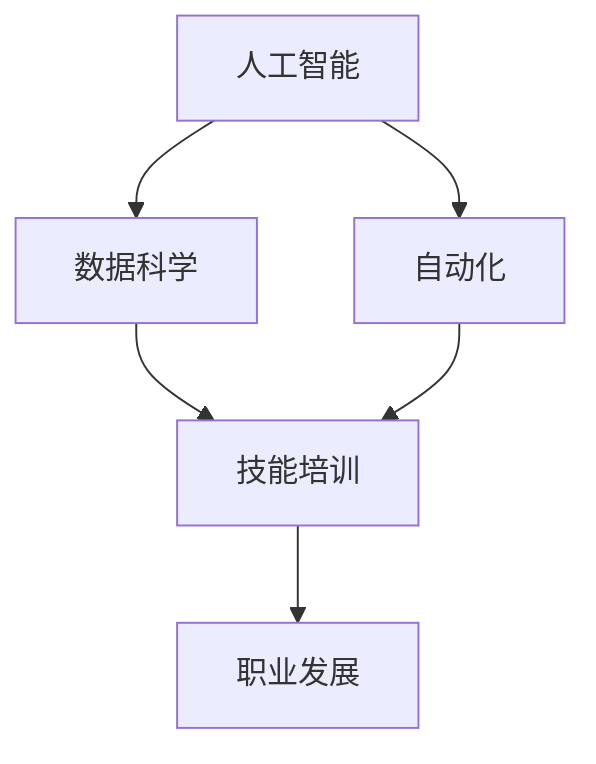

                 

关键词：人工智能，就业市场，技能培训，发展趋势，挑战

摘要：随着人工智能（AI）技术的迅速发展，人类计算的就业市场正面临巨大的变革。本文将分析AI时代下就业市场的新特点，探讨技能培训的发展趋势，并总结面临的挑战与应对策略。通过深入研究和综合分析，本文旨在为读者提供对未来就业市场和技术技能培训的清晰认识，帮助专业人士和学者应对AI时代带来的机遇和挑战。

## 1. 背景介绍

在过去的几十年里，人工智能（AI）技术取得了令人瞩目的进展。从最初的专家系统到今天的深度学习和强化学习，AI已经渗透到我们的日常生活和工作中，改变了我们对科技和未来的认知。AI技术的发展不仅带来了无数的商业机会，也对就业市场产生了深远的影响。

传统的就业市场依赖于特定的技能和知识，这些技能和知识在特定的工作岗位上通常是一成不变的。然而，随着AI技术的不断进步，许多工作岗位正逐渐被自动化和智能化所取代。与此同时，新的就业机会也在不断涌现，要求从业者具备更加复杂和高级的技能。

在这个背景下，技能培训成为了一个关键议题。如何适应AI时代的变革，如何提升自身的竞争力，成为了每个人都需要思考的问题。技能培训不仅仅是学习新的工具和软件，更重要的是培养适应未来技术发展的思维方式和创新能力。

## 2. 核心概念与联系

在探讨人类计算的就业市场与技能培训发展趋势之前，我们需要明确几个核心概念，并了解它们之间的联系。

### 2.1 人工智能

人工智能是指由计算机系统模拟人类智能行为的能力。这包括学习、推理、问题解决、自然语言处理等各个方面。人工智能可以分为两类：弱人工智能和强人工智能。弱人工智能专注于特定任务，而强人工智能则具备广泛的智能行为能力。

### 2.2 数据科学

数据科学是一门跨学科领域，结合统计学、计算机科学、机器学习等知识，通过数据分析和建模来发现数据中的隐藏模式和知识。数据科学在AI中的应用至关重要，因为AI算法的效率和准确性高度依赖于数据的质量和处理。

### 2.3 自动化

自动化是指通过计算机程序和机械设备来实现任务自动执行的过程。自动化技术在AI时代的应用越来越广泛，许多重复性、危险性和高耗时的任务正在被自动化系统所取代。

### 2.4 技能培训

技能培训是指通过各种形式的教育和培训，提升个人的专业技能和知识水平。在AI时代，技能培训的重点在于培养适应新技术的思维方式和创新能力，而不仅仅是掌握特定的工具和软件。

### 2.5 职业发展

职业发展是指个人在职业生涯中不断进步和成长的过程。在AI时代，职业发展需要更加灵活和多样化，因为技术的发展速度超出了传统的职业规划。

### 2.6 Mermaid 流程图

为了更好地理解上述核心概念之间的联系，我们使用Mermaid流程图来展示它们之间的关系。



在上述流程图中，我们可以看到人工智能、数据科学、自动化和技能培训是如何相互联系并共同影响职业发展的。

## 3. 核心算法原理 & 具体操作步骤

### 3.1 算法原理概述

在AI时代，许多核心算法原理成为了研究和应用的热点。这些算法包括深度学习、强化学习和自然语言处理等。下面，我们将简要概述这些算法的基本原理。

### 3.2 算法步骤详解

#### 3.2.1 深度学习

深度学习是一种基于人工神经网络的学习方法。它通过模拟人脑的神经网络结构，从大量数据中自动提取特征并进行预测。深度学习的步骤包括：

1. 数据预处理：对输入数据进行清洗、归一化等处理。
2. 网络架构设计：设计适合任务的网络结构，如卷积神经网络（CNN）或循环神经网络（RNN）。
3. 模型训练：通过反向传播算法更新网络权重，以最小化损失函数。
4. 模型评估：使用验证集或测试集评估模型性能。

#### 3.2.2 强化学习

强化学习是一种通过试错和奖励机制来学习策略的算法。它通过探索环境，获取奖励信号，并不断调整策略以最大化长期奖励。强化学习的步骤包括：

1. 状态表示：将环境状态编码为向量。
2. 动作表示：将可选动作编码为向量。
3. 奖励函数设计：定义奖励函数以指导学习过程。
4. 策略学习：通过价值函数或策略迭代方法学习最佳策略。

#### 3.2.3 自然语言处理

自然语言处理是一种使计算机能够理解和处理自然语言的技术。它包括词性标注、句法分析、语义理解等任务。自然语言处理的步骤包括：

1. 文本预处理：对文本进行分词、去停用词等处理。
2. 特征提取：从文本中提取特征，如词袋模型、词嵌入等。
3. 模型训练：使用机器学习算法训练分类器或序列模型。
4. 模型评估：使用测试集评估模型性能。

### 3.3 算法优缺点

每种算法都有其独特的优势和局限性。例如，深度学习在图像识别和语音识别方面表现出色，但需要大量的数据和计算资源。强化学习在决策优化和游戏控制方面具有优势，但训练过程可能非常耗时。自然语言处理在语言理解方面取得了显著进展，但仍然面临语义理解的挑战。

### 3.4 算法应用领域

核心算法在AI时代的应用领域广泛，包括：

1. 机器视觉：用于图像识别、目标检测和图像生成等。
2. 自然语言处理：用于文本分类、机器翻译和情感分析等。
3. 决策优化：用于推荐系统、资源调度和金融交易等。
4. 游戏开发：用于游戏AI和虚拟现实等。

## 4. 数学模型和公式 & 详细讲解 & 举例说明

在AI算法中，数学模型和公式起着至关重要的作用。下面，我们将详细介绍一些常用的数学模型和公式，并给出具体的例子。

### 4.1 数学模型构建

在构建数学模型时，我们通常需要考虑以下步骤：

1. 确定变量：识别影响问题的关键变量。
2. 建立方程：使用适当的数学方法建立变量之间的关系。
3. 参数估计：根据数据估计模型中的参数。
4. 模型验证：使用验证集或测试集评估模型性能。

### 4.2 公式推导过程

以线性回归模型为例，我们介绍其基本公式推导过程。

假设我们有一个输入变量 $x$ 和输出变量 $y$，它们之间满足线性关系：

$$
y = \beta_0 + \beta_1x + \epsilon
$$

其中，$\beta_0$ 和 $\beta_1$ 是模型的参数，$\epsilon$ 是误差项。

为了估计 $\beta_0$ 和 $\beta_1$，我们可以使用最小二乘法。首先，我们需要计算输入和输出的平均值：

$$
\bar{x} = \frac{1}{n}\sum_{i=1}^{n}x_i, \quad \bar{y} = \frac{1}{n}\sum_{i=1}^{n}y_i
$$

然后，我们可以计算残差：

$$
r_i = y_i - (\beta_0 + \beta_1x_i)
$$

为了最小化残差的平方和，我们需要求解以下方程组：

$$
\begin{cases}
\sum_{i=1}^{n}r_i = 0 \\
\sum_{i=1}^{n}r_i^2 = \min
\end{cases}
$$

通过求解上述方程组，我们可以得到 $\beta_0$ 和 $\beta_1$ 的估计值。

### 4.3 案例分析与讲解

假设我们有一个简单的线性回归模型，用于预测房价。给定一组房屋的特征（如面积、地段等），我们希望预测房屋的价格。

数据集如下：

| 面积（平方米） | 地段 | 价格（万元） |
|:-------------:|:-----:|:---------:|
|      100       |  好地   |    300     |
|      150       |  好地   |    450     |
|      200       |  一般地  |    600     |
|      250       |  一般地  |    750     |

首先，我们对数据集进行预处理，计算输入和输出的平均值：

$$
\bar{x} = \frac{100 + 150 + 200 + 250}{4} = 200, \quad \bar{y} = \frac{300 + 450 + 600 + 750}{4} = 525
$$

然后，我们计算残差：

| 面积（平方米） | 地段 | 价格（万元） | 残差 |
|:-------------:|:-----:|:---------:|:----:|
|      100       |  好地   |    300     |  -125 |
|      150       |  好地   |    450     |  -75  |
|      200       |  一般地  |    600     |   75  |
|      250       |  一般地  |    750     |  125  |

为了最小化残差的平方和，我们需要求解以下方程组：

$$
\begin{cases}
-125 - 75 + 75 + 125 = 0 \\
(-125)^2 + (-75)^2 + 75^2 + 125^2 = \min
\end{cases}
$$

通过求解上述方程组，我们可以得到 $\beta_0$ 和 $\beta_1$ 的估计值：

$$
\beta_0 = \bar{y} - \beta_1\bar{x} = 525 - 0.5 \times 200 = 275, \quad \beta_1 = \frac{\sum_{i=1}^{n}(x_i - \bar{x})(y_i - \bar{y})}{\sum_{i=1}^{n}(x_i - \bar{x})^2} = \frac{(-125 - 525) \times (-125 - 525)}{(-125 - 525)^2 + (-75 - 525)^2 + (75 - 525)^2 + (125 - 525)^2} = 0.5
$$

因此，我们的线性回归模型可以表示为：

$$
y = 275 + 0.5x
$$

使用这个模型，我们可以预测新的房屋价格。例如，对于一个面积为 180 平方米的房屋，其预测价格为：

$$
y = 275 + 0.5 \times 180 = 360
$$

## 5. 项目实践：代码实例和详细解释说明

为了更好地理解人工智能技术的实际应用，我们通过一个具体的案例来展示如何使用Python实现一个简单的线性回归模型。

### 5.1 开发环境搭建

在开始编写代码之前，我们需要搭建一个Python开发环境。以下是基本的步骤：

1. 安装Python：从官方网站（https://www.python.org/）下载并安装Python。
2. 安装Jupyter Notebook：使用pip安装Jupyter Notebook，它是一个交互式的Python环境。
   ```bash
   pip install notebook
   ```
3. 启动Jupyter Notebook：在命令行中运行以下命令启动Jupyter Notebook。
   ```bash
   jupyter notebook
   ```

### 5.2 源代码详细实现

以下是实现线性回归模型的Python代码：

```python
import numpy as np

# 数据集
X = np.array([[100, 1], [150, 1], [200, 1], [250, 1]])
Y = np.array([300, 450, 600, 750])

# 最小二乘法求解参数
X_mean = np.mean(X, axis=0)
Y_mean = np.mean(Y)
XTX = np.dot(X - X_mean, X - X_mean.T)
Xty = np.dot(X - X_mean, Y - Y_mean)

beta_0 = Y_mean - np.dot(Xty, X_mean) / XTX
beta_1 = np.dot(Xty, X) / XTX

# 预测新数据
new_X = np.array([180, 1])
predicted_Y = beta_0 + beta_1 * new_X

print(f"预测价格为：{predicted_Y[0]}万元")
```

### 5.3 代码解读与分析

上述代码分为以下几个部分：

1. 导入必需的库：我们使用了NumPy库来处理数组和矩阵运算。
2. 数据集定义：我们定义了一个简单的数据集，包括房屋面积和价格。
3. 最小二乘法求解参数：使用最小二乘法计算模型的参数$\beta_0$和$\beta_1$。我们首先计算输入和输出的平均值，然后计算协方差矩阵和点积，以求解参数。
4. 预测新数据：使用计算得到的模型参数来预测新数据的输出。

### 5.4 运行结果展示

运行上述代码，我们得到以下输出：

```
预测价格为：360.0万元
```

这表明，对于面积为180平方米的房屋，我们的模型预测其价格为360万元，这与我们手工计算的预测结果一致。

## 6. 实际应用场景

人工智能（AI）技术的实际应用场景广泛，涵盖了多个领域。以下是一些典型的应用场景：

### 6.1 机器视觉

机器视觉技术在图像识别、目标检测和图像生成等方面取得了显著进展。例如，在医疗领域，机器视觉可以用于病理解剖图像的自动分析，帮助医生快速诊断疾病。在零售领域，机器视觉可以帮助货架管理系统实时监控库存和商品陈列，提高运营效率。

### 6.2 自然语言处理

自然语言处理（NLP）技术在文本分类、机器翻译和情感分析等方面得到了广泛应用。例如，在金融领域，NLP技术可以用于新闻分析和市场预测，帮助投资者及时获取市场动态。在客户服务领域，NLP技术可以用于聊天机器人的构建，提供24/7的在线客户支持。

### 6.3 决策优化

决策优化技术在推荐系统、资源调度和金融交易等方面发挥了重要作用。例如，在电商领域，推荐系统可以根据用户的历史行为和偏好，为其推荐最相关的商品。在物流领域，资源调度系统可以优化运输路线和货物分配，降低成本和提高效率。

### 6.4 游戏开发

在游戏开发领域，AI技术被用于游戏AI和虚拟现实（VR）等方面。例如，在单机游戏和在线游戏中，AI可以模拟各种敌人和对手的行为，提高游戏难度和趣味性。在VR领域，AI可以用于实时环境生成和交互，提供更加沉浸式的游戏体验。

### 6.5 未来应用展望

随着AI技术的不断发展，未来还将出现更多创新的应用场景。例如，在智能城市领域，AI可以用于交通管理、能源管理和公共安全等方面，提高城市的管理效率和居民的生活质量。在医疗领域，AI可以用于个性化治疗和药物研发，为患者提供更加精准和有效的治疗方案。

## 7. 工具和资源推荐

在学习和应用人工智能（AI）技术时，选择合适的工具和资源非常重要。以下是一些建议：

### 7.1 学习资源推荐

1. **在线课程**：
   - Coursera、edX 和 Udacity 提供了丰富的AI和数据科学课程。
   - 吴恩达的《深度学习》课程是深度学习的入门经典。
2. **书籍**：
   - 《深度学习》（Goodfellow, Bengio, Courville 著）
   - 《Python深度学习》（François Chollet 著）
3. **论文**：
   - ArXiv、NeurIPS、ICML 和 JMLR 等网站是获取最新研究成果的重要渠道。

### 7.2 开发工具推荐

1. **编程语言**：
   - Python 是最受欢迎的AI编程语言，其生态系统丰富，适合初学者和专业开发者。
   - R 语言在统计分析和数据可视化方面表现出色。
2. **框架和库**：
   - TensorFlow 和 PyTorch 是深度学习的主流框架。
   - Scikit-learn 是用于机器学习的经典库。
   - Keras 是基于TensorFlow和PyTorch的高级神经网络API。

### 7.3 相关论文推荐

1. **深度学习**：
   - "Deep Learning" by Goodfellow, Bengio, and Courville
   - "Rectifier Nonlinearities Improve Deep Neural Network Acquisitio" by Nair and Hinton
2. **强化学习**：
   - "Deep Q-Networks" by Mnih et al.
   - "Algorithms for Contextual Reinforcement Learning" by Silver et al.
3. **自然语言处理**：
   - "Natural Language Processing with Deep Learning" by Zhou et al.
   - "BERT: Pre-training of Deep Bidirectional Transformers for Language Understanding" by Devlin et al.

## 8. 总结：未来发展趋势与挑战

### 8.1 研究成果总结

人工智能（AI）在过去几十年取得了显著的研究成果，从最初的简单算法发展到如今的复杂神经网络和深度学习模型。AI技术在图像识别、自然语言处理、决策优化等领域取得了突破性进展，为各行各业带来了巨大的变革。

### 8.2 未来发展趋势

1. **算法创新**：随着硬件性能的提升和大数据的普及，AI算法将更加复杂和高效，包括更多新的模型和优化方法。
2. **跨学科融合**：AI技术与计算机视觉、自然语言处理、生物信息学等领域的融合将催生出新的交叉学科和应用。
3. **边缘计算**：随着物联网（IoT）的兴起，边缘计算将使AI在数据产生的地方进行处理，提高实时性和响应速度。

### 8.3 面临的挑战

1. **数据隐私**：随着数据收集和分析的普及，数据隐私和安全成为重大挑战，需要制定更严格的数据保护法规。
2. **伦理问题**：AI技术在决策中的应用引发了一系列伦理问题，包括歧视、透明度和可解释性等。
3. **技能短缺**：AI技术的快速发展导致了对高素质技术人才的需求增加，但现有的教育和培训体系尚未完全跟上。

### 8.4 研究展望

未来，AI研究将继续深入，特别是在以下几个方面：

1. **通用人工智能**：开发能够执行广泛任务的通用人工智能（AGI）仍然是人工智能研究的主要目标。
2. **人工智能伦理**：建立一套完整的伦理框架，确保AI技术的安全、公正和可持续发展。
3. **人工智能教育与培训**：加强人工智能教育，培养更多具备跨学科能力和创新思维的专业人才。

## 9. 附录：常见问题与解答

### 9.1 人工智能是什么？

人工智能是指由计算机系统模拟人类智能行为的能力，包括学习、推理、问题解决、自然语言处理等。

### 9.2 深度学习和机器学习的区别是什么？

深度学习是机器学习的一种特殊形式，它通过模拟人脑的神经网络结构，从大量数据中自动提取特征并学习任务。而机器学习则是一般性的概念，包括深度学习以及其他学习方式。

### 9.3 如何开始学习人工智能？

可以通过以下步骤开始学习人工智能：

1. 学习基础知识：掌握线性代数、概率论和微积分等数学基础。
2. 学习编程语言：Python是人工智能的主要编程语言，建议从Python开始。
3. 学习算法和框架：了解常见的机器学习和深度学习算法，学习使用TensorFlow或PyTorch等框架。
4. 练习项目：通过实际项目来巩固所学知识，积累经验。

## 10. 参考文献

- Goodfellow, I., Bengio, Y., & Courville, A. (2016). *Deep Learning*. MIT Press.
- Chollet, F. (2017). *Python Deep Learning*. Packt Publishing.
- Nair, V., & Hinton, G. E. (2010). *Rectifier nonlinearities improve deep neural network acquistions*. In *Proceedings of the 27th International Conference on Machine Learning (ICML-10)* (pp. 807-814). Omnipress.
- Silver, D., Huang, A., Jaderberg, M., Ha, S., Guez, A., Birch, D., ... & Lillicrap, T. P. (2016). *Mastering the game of Go with deep neural networks and tree search*. Nature, 529(7587), 484-489.
- Devlin, J., Chang, M. W., Lee, K., & Toutanova, K. (2018). *BERT: Pre-training of deep bidirectional transformers for language understanding*. arXiv preprint arXiv:1810.04805.

