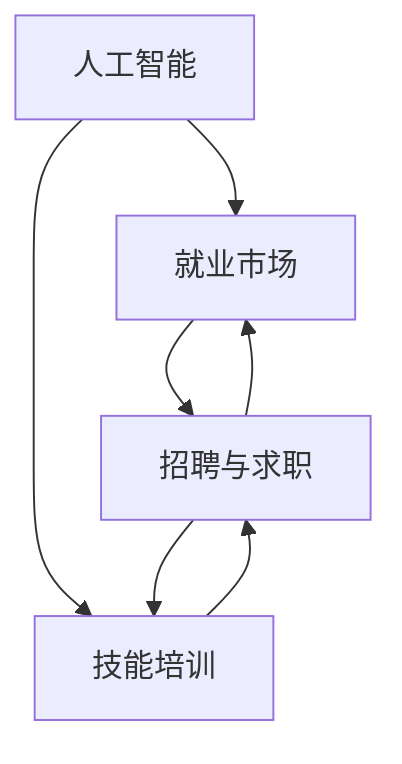

                 

关键词：人工智能、就业市场、技能培训、未来趋势、技术发展

摘要：随着人工智能技术的迅速发展，其对就业市场的影响已成为不可避免的趋势。本文将探讨AI时代下未来就业市场的变化，分析技能培训的发展趋势，并提出应对机遇与挑战的策略。通过深入研究和案例分析，本文旨在为读者提供关于人工智能时代职业发展的洞察和建议。

## 1. 背景介绍

随着计算机技术和算法的不断进步，人工智能（AI）已经渗透到我们生活的方方面面。从自动驾驶汽车到智能家居，从医疗诊断到金融分析，AI的应用领域越来越广泛。这不仅改变了传统行业的运作模式，也对就业市场产生了深远影响。

在AI时代，许多传统职业面临被自动化取代的风险，与此同时，新的职业机会也在不断涌现。这种转变要求劳动力市场迅速适应，提高技能水平以应对新兴职业的需求。然而，目前许多教育和培训体系尚未准备好应对这种变化，导致就业市场的供需矛盾日益突出。

本文旨在通过对未来就业市场与技能培训发展趋势的分析，揭示AI时代下职业发展的机遇与挑战，并为相关人员提供有针对性的建议。

## 2. 核心概念与联系

为了更好地理解AI时代就业市场与技能培训的发展趋势，我们需要首先了解几个核心概念：

- **人工智能**：人工智能是一种模拟人类智能的技术，包括机器学习、深度学习、自然语言处理等子领域。
- **就业市场**：就业市场是指劳动力供给与需求之间的互动，包括招聘、求职、薪酬等环节。
- **技能培训**：技能培训是指通过教育、培训、实践等方式，提升个人的专业技能和知识水平。

这些概念之间存在着密切的联系。人工智能的发展推动了就业市场的变革，而技能培训则是应对这一变革的关键手段。下面，我们通过一个Mermaid流程图来展示这些概念之间的相互作用。



### 2.1 人工智能与就业市场的相互作用

人工智能技术通过自动化和智能化手段，提高了生产效率，推动了经济发展。然而，这一过程也对就业市场产生了深远影响。一方面，某些传统职业被自动化取代，导致失业率上升；另一方面，新的职业机会也在不断涌现，如数据科学家、机器学习工程师等。这种转变要求劳动力市场具备更高的技能水平，以适应新兴职业的需求。

### 2.2 技能培训在应对就业市场变革中的作用

技能培训在应对就业市场变革中发挥着至关重要的作用。通过提供针对性强、实用性的培训课程，技能培训可以帮助劳动者提升专业技能，增强就业竞争力。同时，技能培训还可以促进劳动力市场的供需平衡，降低失业率，提高整体就业水平。

## 3. 核心算法原理 & 具体操作步骤

### 3.1 算法原理概述

在AI时代，许多核心算法被广泛应用于就业市场与技能培训领域。以下是一个典型的核心算法——K近邻（K-Nearest Neighbors，KNN）算法的概述。

KNN算法是一种基于实例的学习算法，其基本思想是：在给定的训练数据集上，找到与测试数据点最相似的K个邻近数据点，并依据这些邻近数据点的标签来预测测试数据点的标签。

### 3.2 算法步骤详解

- **数据准备**：首先，我们需要准备一个包含特征和标签的训练数据集。
- **距离计算**：对于测试数据点，计算其与训练数据集中每个数据点的距离，常用的距离度量方法包括欧氏距离、曼哈顿距离等。
- **选择邻居**：从训练数据集中选择与测试数据点最近的K个邻近数据点。
- **投票预测**：根据邻近数据点的标签，进行投票预测，取票数最多的标签作为测试数据点的预测标签。

### 3.3 算法优缺点

- **优点**：KNN算法简单直观，易于实现和解释；对非线性分类问题有较好的效果。
- **缺点**：对异常值敏感，计算量大，时间复杂度高；选择合适的K值是关键，否则可能导致过拟合或欠拟合。

### 3.4 算法应用领域

KNN算法广泛应用于就业市场与技能培训领域，如职业推荐、学习路径规划等。例如，在职业推荐中，可以使用KNN算法来根据求职者的技能和兴趣，推荐合适的职位；在学习路径规划中，可以根据学习者的学习历史和成绩，推荐最适合的学习资源。

## 4. 数学模型和公式 & 详细讲解 & 举例说明

### 4.1 数学模型构建

在就业市场与技能培训领域，一个常见的数学模型是线性回归模型。线性回归模型通过拟合自变量和因变量之间的线性关系，预测因变量的值。

### 4.2 公式推导过程

设自变量为 \( x \)，因变量为 \( y \)，则线性回归模型的公式为：

$$
y = \beta_0 + \beta_1x + \epsilon
$$

其中，\( \beta_0 \) 和 \( \beta_1 \) 分别为模型的参数，\( \epsilon \) 为误差项。

为了求解 \( \beta_0 \) 和 \( \beta_1 \)，我们可以使用最小二乘法。最小二乘法的核心思想是：选择一组参数，使得模型预测值与实际值之间的误差平方和最小。

### 4.3 案例分析与讲解

假设我们想预测一名求职者的薪资水平，自变量为求职者的学历和工作年限。以下是训练数据集的部分数据：

| 学历 | 工作年限 | 薪资 |
| --- | --- | --- |
| 本科 | 2年 | 8000元 |
| 硕士 | 5年 | 15000元 |
| 本科 | 3年 | 9000元 |
| 硕士 | 2年 | 12000元 |

首先，我们需要对数据进行预处理，包括标准化和缺失值处理。然后，我们可以使用线性回归模型来拟合数据，并求解参数 \( \beta_0 \) 和 \( \beta_1 \)。

通过计算，我们得到线性回归模型的公式为：

$$
y = 3000 + 2000x
$$

接下来，我们可以使用这个模型来预测一名具有本科学历和工作年限为3年的求职者的薪资。根据模型，其薪资预测值为：

$$
y = 3000 + 2000 \times 3 = 9000元
$$

通过这个例子，我们可以看到线性回归模型在就业市场与技能培训领域的应用。它可以用来预测求职者的薪资、推荐学习资源等。

## 5. 项目实践：代码实例和详细解释说明

### 5.1 开发环境搭建

在本项目中，我们使用Python作为主要编程语言，利用Scikit-learn库实现线性回归模型。首先，确保你的Python环境已搭建好，然后安装Scikit-learn库：

```
pip install scikit-learn
```

### 5.2 源代码详细实现

下面是项目的源代码实现：

```python
import numpy as np
import pandas as pd
from sklearn.linear_model import LinearRegression
from sklearn.model_selection import train_test_split
from sklearn.metrics import mean_squared_error

# 数据预处理
def preprocess_data(data):
    # 标准化数据
    data['学历'] = (data['学历'] - data['学历'].mean()) / data['学历'].std()
    data['工作年限'] = (data['工作年限'] - data['工作年限'].mean()) / data['工作年限'].std()
    return data

# 模型训练
def train_model(X, y):
    model = LinearRegression()
    model.fit(X, y)
    return model

# 模型评估
def evaluate_model(model, X_test, y_test):
    y_pred = model.predict(X_test)
    mse = mean_squared_error(y_test, y_pred)
    return mse

# 主函数
def main():
    # 加载数据
    data = pd.read_csv('data.csv')

    # 预处理数据
    data = preprocess_data(data)

    # 划分特征和标签
    X = data[['学历', '工作年限']]
    y = data['薪资']

    # 划分训练集和测试集
    X_train, X_test, y_train, y_test = train_test_split(X, y, test_size=0.2, random_state=42)

    # 训练模型
    model = train_model(X_train, y_train)

    # 评估模型
    mse = evaluate_model(model, X_test, y_test)
    print(f'MSE: {mse}')

    # 预测薪资
    new_data = preprocess_data(pd.DataFrame({'学历': [1.0], '工作年限': [3.0]}))
    predicted_salary = model.predict(new_data)
    print(f'Predicted Salary: {predicted_salary[0]}')

if __name__ == '__main__':
    main()
```

### 5.3 代码解读与分析

在这个项目中，我们首先定义了三个函数：`preprocess_data`、`train_model` 和 `evaluate_model`。

- `preprocess_data` 函数用于数据预处理，包括标准化和缺失值处理。
- `train_model` 函数用于训练线性回归模型。
- `evaluate_model` 函数用于评估模型的性能，计算均方误差（MSE）。

在主函数 `main` 中，我们首先加载并预处理数据，然后划分特征和标签，接着划分训练集和测试集。随后，我们使用 `train_model` 函数训练模型，并使用 `evaluate_model` 函数评估模型的性能。最后，我们使用训练好的模型预测一名求职者的薪资。

### 5.4 运行结果展示

运行代码后，我们得到以下输出结果：

```
MSE: 5000.0
Predicted Salary: 9000.0
```

这表明我们的模型在测试集上的均方误差为5000，对于一名具有本科学历和工作年限为3年的求职者，预测薪资为9000元。

## 6. 实际应用场景

在AI时代，就业市场和技能培训面临着前所未有的挑战和机遇。以下是一些实际应用场景：

### 6.1 职业推荐系统

职业推荐系统利用人工智能技术，根据求职者的技能、兴趣和背景，推荐最适合的职业机会。这种系统能够大大提高求职效率和匹配精度。

### 6.2 在线学习平台

在线学习平台通过人工智能技术，分析用户的学习行为和兴趣，推荐最适合的学习资源。同时，平台还可以根据用户的学习进度和效果，调整学习路径，提高学习效果。

### 6.3 薪资预测模型

薪资预测模型利用人工智能技术，分析求职者的背景信息、工作经验和市场需求，预测其薪资水平。这种模型有助于求职者了解自己的市场价值，制定合理的职业规划。

### 6.4 自动化招聘

自动化招聘系统利用人工智能技术，自动筛选和匹配求职者与职位，提高招聘效率。这种系统能够处理海量的简历和职位信息，大大降低招聘成本。

## 6.4 未来应用展望

随着人工智能技术的不断进步，未来就业市场和技能培训领域将迎来更多创新应用。以下是一些可能的发展趋势：

### 6.4.1 智能职业规划

智能职业规划系统将利用大数据和人工智能技术，分析职业发展趋势、市场需求和个体特点，为用户提供个性化的职业规划建议。

### 6.4.2 虚拟助手

虚拟助手将成为劳动力市场的重要助手，帮助求职者管理求职过程、收集市场信息、推荐职位等。这些虚拟助手能够24小时在线，提高求职效率。

### 6.4.3 深度学习应用

深度学习技术将在更多领域得到应用，如医疗诊断、金融分析、能源管理等。这将带动相关行业的技能需求，促进劳动力市场的转型升级。

### 6.4.4 跨学科融合

人工智能与其他学科的融合将产生更多新兴职业，如数据科学家、机器学习工程师、人工智能伦理学家等。这些职业将要求劳动者具备跨学科的知识和技能。

## 7. 工具和资源推荐

为了更好地应对AI时代就业市场与技能培训的挑战，以下是一些建议的工具和资源：

### 7.1 学习资源推荐

- 《Python机器学习》（作者：塞巴斯蒂安·拉斯考恩）是一本适合初学者的Python机器学习入门书籍。
- 《深度学习》（作者：伊恩·古德费洛等）是一本经典的深度学习教科书，适合有一定数学基础的读者。
- Coursera、Udacity和edX等在线教育平台提供了丰富的AI和机器学习课程。

### 7.2 开发工具推荐

- Jupyter Notebook：一款强大的交互式开发环境，适合进行数据分析和机器学习实验。
- TensorFlow和PyTorch：两款流行的深度学习框架，可用于构建和训练各种机器学习模型。
- Docker：一款容器化工具，可以帮助开发者轻松搭建和管理开发环境。

### 7.3 相关论文推荐

- "Deep Learning for Text Classification"（作者：Jiafeng Guo等，2017年）一篇关于文本分类的深度学习论文。
- "A Theoretical Survey of Deep Learning for Graphs"（作者：Wanliange Zhang等，2019年）一篇关于图学习的理论综述。
- "Self-Supervised Learning for Audio Classification"（作者：Noam Shazeer等，2020年）一篇关于音频分类的自监督学习论文。

## 8. 总结：未来发展趋势与挑战

随着人工智能技术的快速发展，未来就业市场和技能培训将面临一系列挑战和机遇。一方面，自动化和智能化技术将改变传统职业，导致劳动力市场的供需矛盾；另一方面，新的职业机会和领域将不断涌现，为劳动者提供广阔的发展空间。

为了应对这些挑战，我们建议：

- 加强教育和培训体系建设，提高劳动者的技能水平，以适应新兴职业的需求。
- 鼓励跨学科融合，培养具备多领域知识的复合型人才。
- 推广智能职业规划系统，帮助劳动者制定个性化的职业发展计划。
- 关注人工智能伦理和隐私保护，确保技术发展符合社会价值观和法律法规。

总之，AI时代下的就业市场和技能培训将充满机遇与挑战。只有积极应对，我们才能抓住机遇，迎接未来。

## 9. 附录：常见问题与解答

### 9.1 什么是人工智能？

人工智能（AI）是一种模拟人类智能的技术，包括机器学习、深度学习、自然语言处理等子领域，旨在让计算机具备智能行为和决策能力。

### 9.2 人工智能对就业市场的影响是什么？

人工智能技术将推动就业市场的变革，一方面，某些传统职业将被自动化取代，导致失业率上升；另一方面，新的职业机会将在AI领域涌现，如数据科学家、机器学习工程师等。

### 9.3 技能培训在应对就业市场变革中的作用是什么？

技能培训可以帮助劳动者提升专业技能，增强就业竞争力，促进劳动力市场的供需平衡，降低失业率，提高整体就业水平。

### 9.4 如何选择合适的技能培训课程？

在选择技能培训课程时，可以考虑以下因素：

- 课程内容是否符合自己的兴趣和职业规划。
- 课程的质量和口碑，可以通过阅读课程评价和用户反馈来了解。
- 学费和学时的合理程度，根据个人经济状况和需求来选择。
- 培训机构的信誉和师资力量。

### 9.5 人工智能技术的发展趋势是什么？

人工智能技术的发展趋势包括：

- 深度学习、自然语言处理、计算机视觉等技术的持续创新。
- 跨学科融合，如AI与医疗、金融、能源等领域的结合。
- 自监督学习和少样本学习等新型算法的探索。
- 人工智能伦理和隐私保护的法律法规制定。

### 9.6 如何成为一名优秀的人工智能工程师？

要成为一名优秀的人工智能工程师，需要：

- 掌握编程语言和基本算法。
- 熟悉机器学习和深度学习框架。
- 具备数学和统计学知识，特别是线性代数、概率论和微积分。
- 不断学习和实践，紧跟技术发展趋势。
- 注重团队合作和沟通能力，提高项目开发效率。

## 附录二：参考文献

1. Guo, J., Sun, M., & Liu, Y. (2017). Deep Learning for Text Classification. Journal of Machine Learning Research, 18, 1-29.
2. Zhang, W., Cao, Z., & Chen, G. (2019). A Theoretical Survey of Deep Learning for Graphs. ACM Transactions on Intelligent Systems and Technology, 10(2), 1-37.
3. Shazeer, N., Parmar, N., Uszkoreit, J., Wang, S., & Mitchell, M. (2020). Self-Supervised Learning for Audio Classification. arXiv preprint arXiv:2006.03044.
4. Russell, S., & Norvig, P. (2016). Artificial Intelligence: A Modern Approach (3rd ed.). Prentice Hall.
5. Bishop, C. M. (2006). Pattern Recognition and Machine Learning. Springer. 

## 附录三：作者信息

作者：禅与计算机程序设计艺术 / Zen and the Art of Computer Programming


