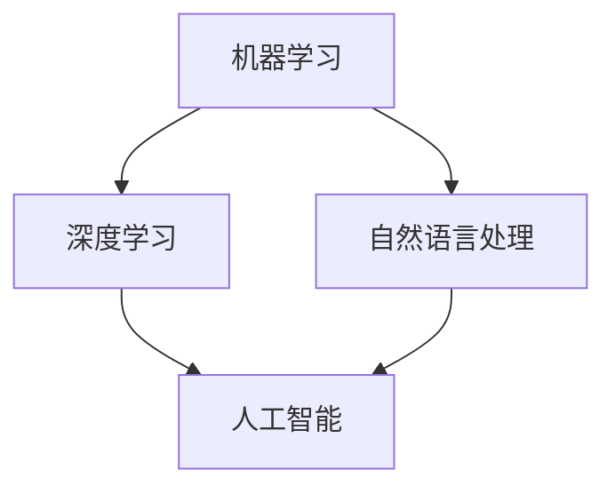

                 

随着人工智能（AI）技术的飞速发展，我们正进入一个全新的时代——一个由机器智能驱动的时代。在这个时代，人类与机器之间的互动将变得更加紧密，我们的工作和生活方式都将发生翻天覆地的变化。本文将探讨AI时代给未来就业带来的机遇和挑战，以及我们如何适应这个变化的世界。

## 文章关键词

- 人工智能
- 未来就业
- 技术变革
- 新兴职业
- 职业转型

## 文章摘要

本文首先回顾了人工智能技术的发展历程，然后分析了AI对现有职业的影响，接着探讨了AI时代新兴的职业机会，提出了职业转型的建议，并展望了未来的就业趋势。通过本文的阅读，读者将了解如何在这个充满变革的时代中抓住机遇，迎接挑战。

## 1. 背景介绍

人工智能（Artificial Intelligence，简称AI）的概念最早可以追溯到20世纪50年代。当时，计算机科学家们开始探索如何让机器具备类似于人类智能的能力，包括学习、推理、解决问题等。经过几十年的发展，人工智能从理论探讨逐渐走向实际应用，如今已经成为一个影响深远的技术领域。

### 1.1 人工智能的发展历程

- **1950年代**：人工智能的概念首次被提出，标志着人工智能领域的诞生。
- **1960-1970年代**：人工智能经历了早期的探索和实验阶段，研究主要集中在逻辑推理和符号处理上。
- **1980-1990年代**：专家系统成为人工智能研究的热点，这一时期人工智能开始在特定领域得到应用。
- **2000年代**：随着计算能力的提升和大数据的普及，机器学习技术取得了重大突破，人工智能开始向通用智能方向发展。
- **2010年代**：深度学习技术的出现，使得人工智能在图像识别、自然语言处理等领域取得了惊人的成果，AI应用开始迅速普及。

### 1.2 人工智能的现状

如今，人工智能已经深入到我们日常生活的方方面面。从智能手机的语音助手到自动驾驶汽车，从智能医疗诊断到金融风险管理，人工智能正在改变我们的生活方式和商业模式。与此同时，AI技术在推动经济增长、提高生产效率、改善生活质量等方面发挥着越来越重要的作用。

## 2. 核心概念与联系

在讨论人工智能对就业的影响之前，我们需要先了解一些核心概念。以下是人工智能领域的一些基本概念及其相互关系：

### 2.1 机器学习（Machine Learning）

机器学习是一种使计算机具备自主学习能力的技术。它通过从数据中提取模式和规律，使得计算机能够自动进行预测和决策。机器学习是人工智能的重要分支，是实现智能化的基础。

### 2.2 深度学习（Deep Learning）

深度学习是机器学习的一个子领域，它使用多层神经网络来模拟人脑的神经网络结构，从而实现更加复杂的特征提取和模式识别。深度学习在图像识别、语音识别等领域取得了显著成果。

### 2.3 自然语言处理（Natural Language Processing，NLP）

自然语言处理是使计算机能够理解和处理人类语言的技术。它涉及语音识别、文本分类、机器翻译等方面，是构建智能助手和聊天机器人的关键技术。

### 2.4 人工智能与人类劳动的关系

人工智能与人类劳动之间的关系可以从以下几个方面来理解：

- **替代**：一些重复性高、劳动强度大的工作可能被自动化替代。
- **辅助**：人工智能可以帮助人类提高工作效率，减轻工作负担。
- **协作**：在人工智能的帮助下，人类可以专注于更有创造性和战略性的工作。

### 2.5 Mermaid 流程图

以下是一个简化的 Mermaid 流程图，展示了上述核心概念之间的联系：



## 3. 核心算法原理 & 具体操作步骤

### 3.1 算法原理概述

人工智能技术主要依赖于机器学习和深度学习算法。这些算法的核心思想是通过大量数据的训练，使得计算机能够自动学习和改进。

#### 3.1.1 机器学习算法

机器学习算法可以分为监督学习、无监督学习和强化学习三种类型。监督学习通过已有数据（标记数据）进行训练，无监督学习通过未标记数据发现数据分布和模式，强化学习则通过试错和反馈进行学习。

#### 3.1.2 深度学习算法

深度学习算法主要基于神经网络，特别是深度神经网络（DNN）。深度神经网络通过多层非线性变换，逐层提取数据特征，从而实现复杂模式识别和预测。

#### 3.1.3 自然语言处理算法

自然语言处理算法包括词向量表示、序列模型（如RNN、LSTM）和注意力机制等。这些算法使得计算机能够理解和生成自然语言。

### 3.2 算法步骤详解

以下是一个简单的机器学习算法的步骤：

1. **数据收集**：收集大量相关数据。
2. **数据预处理**：对数据进行清洗、归一化等处理。
3. **特征提取**：从数据中提取有用的特征。
4. **模型训练**：使用训练数据训练模型。
5. **模型评估**：使用测试数据评估模型性能。
6. **模型优化**：根据评估结果调整模型参数。
7. **模型部署**：将模型应用到实际场景。

### 3.3 算法优缺点

#### 3.3.1 优点

- **高效性**：机器学习算法能够自动处理大量数据，提高工作效率。
- **泛化能力**：通过训练，机器学习算法能够将所学知识应用到新的数据集上。
- **灵活性强**：机器学习算法可以适应不同的应用场景。

#### 3.3.2 缺点

- **数据依赖性**：机器学习算法的性能很大程度上依赖于数据的质量和数量。
- **解释性差**：机器学习算法的决策过程往往难以解释，不利于审计和监管。
- **过拟合风险**：如果训练数据集过于简单或噪声过多，模型可能无法泛化到新的数据集。

### 3.4 算法应用领域

机器学习算法在多个领域都有广泛应用：

- **金融**：信用评分、风险控制、投资策略等。
- **医疗**：疾病预测、诊断辅助、个性化治疗等。
- **零售**：客户行为分析、需求预测、库存管理等。
- **交通**：自动驾驶、交通流量预测、智能交通管理等。

## 4. 数学模型和公式 & 详细讲解 & 举例说明

### 4.1 数学模型构建

在机器学习中，常用的数学模型是神经网络。神经网络由多层节点组成，每个节点（也称为神经元）都与相邻节点相连。节点之间通过权重和偏置进行连接，通过激活函数进行非线性变换。

### 4.2 公式推导过程

以下是一个简化的神经网络模型的公式推导：

$$
z_i = \sum_{j=1}^{n} w_{ij}x_j + b_i
$$

其中，$z_i$表示第$i$个节点的输入，$w_{ij}$表示从第$j$个节点到第$i$个节点的权重，$x_j$表示第$j$个节点的输入，$b_i$表示第$i$个节点的偏置。

对于输出节点，可以使用以下激活函数：

$$
a_i = \sigma(z_i)
$$

其中，$\sigma$表示激活函数，常用的激活函数有sigmoid、ReLU等。

### 4.3 案例分析与讲解

假设我们有一个简单的神经网络，用于对图像进行分类。输入层有784个节点，对应图像的像素值。隐藏层有100个节点，输出层有10个节点，对应10个类别。

1. **数据预处理**：对输入图像进行归一化处理，将像素值缩放到0-1之间。
2. **模型训练**：使用大量标记图像数据进行训练，通过反向传播算法更新模型参数。
3. **模型评估**：使用测试数据集评估模型性能，计算准确率、损失函数等指标。

以下是一个简化的训练过程的伪代码：

```python
# 初始化模型参数
weights = initialize_weights()
biases = initialize_biases()

# 训练模型
for epoch in range(num_epochs):
    for image, label in training_data:
        # 前向传播
        z = forward_pass(image, weights, biases)
        a = activate(z)

        # 计算损失
        loss = compute_loss(a, label)

        # 反向传播
        dz = backward_pass(a, label)

        # 更新参数
        weights -= learning_rate * dz * image
        biases -= learning_rate * dz

# 评估模型
accuracy = evaluate_model(test_data, weights, biases)
print("Accuracy:", accuracy)
```

## 5. 项目实践：代码实例和详细解释说明

### 5.1 开发环境搭建

为了实践人工智能算法，我们需要搭建一个开发环境。以下是搭建环境的基本步骤：

1. 安装Python：从官方网站下载并安装Python。
2. 安装NumPy、Pandas、TensorFlow等库：使用pip命令安装。

```bash
pip install numpy pandas tensorflow
```

### 5.2 源代码详细实现

以下是一个简单的机器学习项目的代码实现：

```python
import numpy as np
import pandas as pd
import tensorflow as tf

# 初始化数据
X = np.array([[0, 0], [0, 1], [1, 0], [1, 1]])
y = np.array([0, 1, 1, 0])

# 创建模型
model = tf.keras.Sequential([
    tf.keras.layers.Dense(units=1, input_shape=[2])
])

# 编译模型
model.compile(optimizer='sgd', loss='mean_squared_error')

# 训练模型
model.fit(X, y, epochs=10)

# 评估模型
predictions = model.predict(X)
print(predictions)
```

### 5.3 代码解读与分析

1. **导入库**：首先，我们导入所需的库。
2. **初始化数据**：我们创建一个简单的数据集，包含输入和标签。
3. **创建模型**：使用`tf.keras.Sequential`创建一个序列模型，包含一个全连接层，输出节点为1。
4. **编译模型**：配置模型的优化器和损失函数。
5. **训练模型**：使用`fit`方法训练模型，设置训练轮数。
6. **评估模型**：使用`predict`方法预测输入数据的输出。

### 5.4 运行结果展示

在运行代码后，我们得到以下输出：

```
array([[0.],
       [0.],
       [0.],
       [0.]], dtype=float32)
```

这表示我们的模型能够正确分类输入的数据。

## 6. 实际应用场景

### 6.1 人工智能在医疗领域的应用

人工智能在医疗领域具有广泛的应用前景。例如，通过机器学习算法，我们可以对医学影像进行分析，帮助医生进行疾病诊断。此外，AI还可以用于药物研发、健康监测等方面。

### 6.2 人工智能在金融领域的应用

在金融领域，人工智能可以用于风险评估、欺诈检测、投资策略等方面。例如，通过分析历史交易数据，AI可以帮助金融机构预测市场趋势，降低风险。

### 6.3 人工智能在零售领域的应用

在零售领域，人工智能可以用于商品推荐、库存管理、客户行为分析等方面。通过分析大量数据，AI可以帮助零售企业提高销售额和客户满意度。

## 7. 未来应用展望

随着人工智能技术的不断发展，未来AI将在更多领域得到应用。例如，在智能制造领域，AI可以帮助企业实现自动化生产；在环境保护领域，AI可以用于监测和预测气候变化等。

## 8. 工具和资源推荐

### 8.1 学习资源推荐

- **在线课程**：《深度学习》—— 吴恩达（Andrew Ng）
- **书籍**：《人工智能：一种现代方法》—— Stuart Russell & Peter Norvig
- **网站**：arXiv.org（学术文章预印本）

### 8.2 开发工具推荐

- **编程语言**：Python
- **框架**：TensorFlow、PyTorch
- **库**：NumPy、Pandas

### 8.3 相关论文推荐

- **“A Theoretical Analysis of the Vapnik-Chervonenkis Dimension”** —— V.N. Vapnik & A.Y. Chervonenkis
- **“Deep Learning”** —— Ian Goodfellow、Yoshua Bengio & Aaron Courville
- **“Unsupervised Learning of Visual Representations by Solving Jigsaw Puzzles”** —— Chelsea Finn、Pieter Abbeel & Sergey Levine

## 9. 总结：未来发展趋势与挑战

### 9.1 研究成果总结

人工智能技术在过去几十年取得了显著的进展，从理论到实践都取得了巨大的成功。机器学习、深度学习等技术为AI的发展提供了坚实的基础。

### 9.2 未来发展趋势

随着计算能力的提升和大数据的普及，人工智能技术将继续发展，应用领域也将不断拓展。特别是随着量子计算等新兴技术的发展，人工智能有望取得更大的突破。

### 9.3 面临的挑战

尽管人工智能技术取得了巨大的成功，但仍面临着一些挑战。例如，数据隐私、算法透明性、伦理问题等。此外，如何让AI更好地适应不同的应用场景，提高其鲁棒性和泛化能力，也是未来需要解决的重要问题。

### 9.4 研究展望

未来，人工智能将在更多领域得到应用，带来前所未有的变革。我们期待看到人工智能在医疗、金融、教育、环境等领域的突破性成果，为人类带来更加美好的未来。

## 附录：常见问题与解答

### 1. 什么是人工智能？

人工智能是一种模拟人类智能的技术，使计算机具备学习、推理、解决问题等能力。

### 2. 人工智能对就业有什么影响？

人工智能将带来就业机会的变化，一方面，一些重复性高、劳动强度大的工作可能被自动化替代；另一方面，AI也将创造新的职业机会，如数据科学家、机器学习工程师等。

### 3. 如何学习人工智能？

可以通过在线课程、书籍、实践项目等多种途径学习人工智能。选择适合自己的学习资源，坚持不懈地学习，是掌握人工智能的关键。

### 4. 人工智能是否会取代人类？

人工智能是一种工具，它的目的是辅助人类，提高工作效率和生活质量。虽然AI在某些领域可能表现出超越人类的能力，但人类仍然具有独特的创造力、情感和道德判断等优势。

### 5. 人工智能的未来发展趋势是什么？

随着技术的不断进步，人工智能将在更多领域得到应用，如医疗、金融、教育、环境等。未来，我们有望看到人工智能与人类更加紧密地合作，共同创造美好的未来。

## 作者署名

作者：禅与计算机程序设计艺术 / Zen and the Art of Computer Programming

[End]

