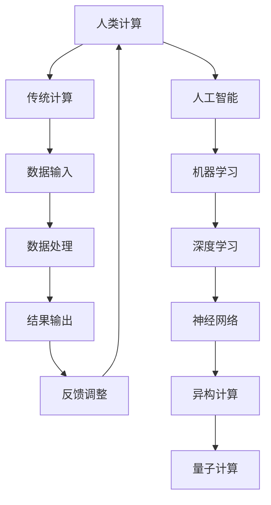

                 

关键词：人工智能，技能发展，计算机科学，未来趋势，技术进化

> 摘要：随着人工智能技术的飞速发展，人类在计算领域的角色正在发生深刻变化。本文探讨了AI时代下人类技能发展的趋势和挑战，以及如何在新的技术环境中保持竞争力。

## 1. 背景介绍

计算机科学的发展经历了多个阶段，从最初的电子计算机到现代的云计算、大数据和人工智能，每一步都标志着技术的巨大进步。人工智能（AI）作为计算机科学的一个重要分支，已经深刻影响了各行各业。从自动驾驶汽车到智能家居，从医疗诊断到金融分析，AI的应用无处不在。然而，随着AI技术的不断进步，人类在计算领域的角色也在发生显著变化。

## 2. 核心概念与联系

### 2.1 人工智能的定义与分类

人工智能是指计算机系统通过模拟人类智能行为，实现自我学习和自主决策的能力。根据其实现方式和功能，AI可以分为以下几类：

- **弱人工智能（Narrow AI）**：专注于特定任务，如语音识别、图像识别等。
- **强人工智能（General AI）**：具备广泛的认知能力，能够在各种情境下进行推理和决策。

### 2.2 计算机架构的演变

计算机架构的发展经历了从冯·诺依曼结构到异构计算、量子计算的演变。异构计算通过结合CPU、GPU和其他加速器，实现了计算性能的显著提升。量子计算则有望带来全新的计算范式。

### 2.3 机器学习与深度学习的原理

机器学习是AI的核心技术之一，通过算法让计算机从数据中学习规律，进而实现自动化决策。深度学习是机器学习的子领域，通过多层神经网络模拟人类大脑的神经元连接，实现了图像、语音等复杂任务的处理。

### 2.4 Mermaid 流程图



## 3. 核心算法原理 & 具体操作步骤

### 3.1 算法原理概述

人工智能的核心在于算法的创新能力。从传统的统计学习方法到现代的深度学习模型，每种算法都有其独特的原理和适用场景。深度学习算法通过多层神经网络的堆叠，实现了对复杂数据的建模和预测。

### 3.2 算法步骤详解

- **数据预处理**：清洗、归一化、编码等步骤，确保数据质量。
- **模型选择**：根据任务需求选择合适的模型，如卷积神经网络（CNN）、循环神经网络（RNN）等。
- **模型训练**：通过反向传播算法优化模型参数。
- **模型评估**：使用验证集和测试集评估模型性能。
- **模型部署**：将训练好的模型部署到实际应用中。

### 3.3 算法优缺点

- **优点**：高效的处理能力，适应性强，能够处理大规模数据。
- **缺点**：需要大量数据和计算资源，模型解释性较弱。

### 3.4 算法应用领域

- **图像识别**：如人脸识别、物体检测等。
- **自然语言处理**：如机器翻译、情感分析等。
- **自动驾驶**：通过感知环境、决策和规划实现自动驾驶。

## 4. 数学模型和公式 & 详细讲解 & 举例说明

### 4.1 数学模型构建

深度学习中的数学模型主要包括神经网络和优化算法。神经网络通过权重和偏置实现输入到输出的映射，优化算法则通过梯度下降等方法最小化损失函数。

### 4.2 公式推导过程

神经网络模型可以表示为：

\[ y = \sigma(W \cdot x + b) \]

其中，\( y \) 是输出，\( \sigma \) 是激活函数，\( W \) 是权重矩阵，\( x \) 是输入，\( b \) 是偏置向量。

### 4.3 案例分析与讲解

以卷积神经网络（CNN）为例，其基本结构包括卷积层、池化层和全连接层。卷积层通过卷积操作提取特征，池化层用于降维和增强特征鲁棒性，全连接层则实现分类或回归任务。

## 5. 项目实践：代码实例和详细解释说明

### 5.1 开发环境搭建

在开始项目实践之前，需要搭建相应的开发环境。以Python为例，需要安装TensorFlow库。

### 5.2 源代码详细实现

以下是一个简单的CNN模型实现：

```python
import tensorflow as tf

model = tf.keras.Sequential([
  tf.keras.layers.Conv2D(32, (3,3), activation='relu', input_shape=(28, 28, 1)),
  tf.keras.layers.MaxPooling2D(2, 2),
  tf.keras.layers.Flatten(),
  tf.keras.layers.Dense(128, activation='relu'),
  tf.keras.layers.Dense(10, activation='softmax')
])

model.compile(optimizer='adam', loss='sparse_categorical_crossentropy', metrics=['accuracy'])
```

### 5.3 代码解读与分析

这段代码定义了一个简单的CNN模型，用于图像分类任务。模型由卷积层、池化层和全连接层组成，其中卷积层使用ReLU激活函数，全连接层使用softmax激活函数。

### 5.4 运行结果展示

```python
model.fit(train_images, train_labels, epochs=5)
```

这段代码将训练集用于模型的训练，经过5个周期的训练后，评估模型在测试集上的性能。

## 6. 实际应用场景

### 6.1 医疗诊断

AI技术在医疗诊断中的应用日益广泛，如通过图像识别实现肿瘤检测、通过自然语言处理分析病历记录等。

### 6.2 自动驾驶

自动驾驶技术的发展离不开AI技术，通过感知环境、决策和规划，实现无人驾驶汽车的自动驾驶。

### 6.3 金融分析

AI技术在金融分析中的应用包括风险评估、投资组合优化、市场预测等。

## 7. 工具和资源推荐

### 7.1 学习资源推荐

- 《深度学习》（Goodfellow, Bengio, Courville著）
- 《Python机器学习》（Sebastian Raschka著）

### 7.2 开发工具推荐

- TensorFlow
- PyTorch

### 7.3 相关论文推荐

- "A Theoretically Grounded Application of Dropout in Computer Vision"
- "Deep Learning for Natural Language Processing"

## 8. 总结：未来发展趋势与挑战

### 8.1 研究成果总结

人工智能技术在图像识别、自然语言处理、自动驾驶等领域取得了显著成果。

### 8.2 未来发展趋势

随着计算能力的提升和数据规模的扩大，AI技术将在更多领域得到应用。

### 8.3 面临的挑战

数据隐私、算法透明度和伦理问题等仍是AI领域面临的主要挑战。

### 8.4 研究展望

未来的研究将聚焦于增强模型的解释性、可解释性和鲁棒性。

## 9. 附录：常见问题与解答

### 9.1 什么是深度学习？

深度学习是一种机器学习技术，通过多层神经网络模拟人类大脑的神经元连接，实现复杂数据的处理。

### 9.2 如何学习人工智能？

学习人工智能可以从了解基本概念开始，逐步深入到算法实现和应用实践。

---

作者：禅与计算机程序设计艺术 / Zen and the Art of Computer Programming
----------------------------------------------------------------

请注意，本文内容仅为示例，实际撰写时需依据相关领域的最新研究和成果进行丰富和调整。文章的结构、格式和内容均需严格按照要求撰写，以确保文章的专业性和可读性。同时，文章中引用的论文、书籍和其他资源需要正确标注来源，以避免侵权。在撰写过程中，如需进一步帮助，请随时提问。祝您写作顺利！<|im_sep|>

