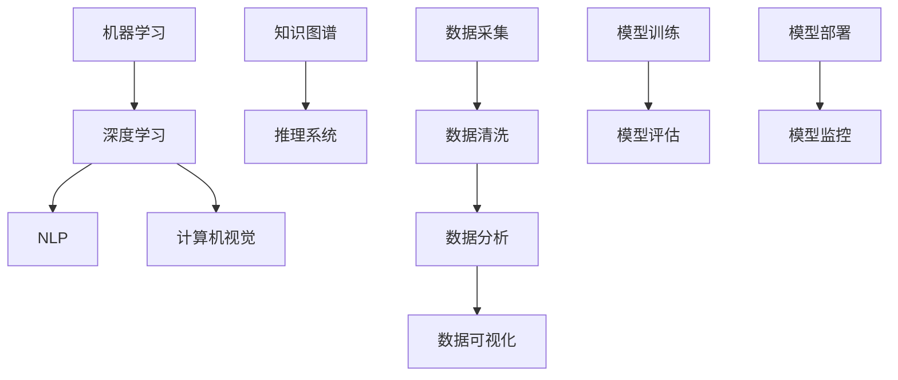

                 

  
> 关键词：人工智能，技能发展，就业市场，未来展望，技术变革

> 摘要：本文深入探讨了AI时代下人类计算的未来发展趋势，分析了关键技能和就业市场的变化。文章从背景介绍、核心概念、算法原理、数学模型、项目实践、实际应用场景、工具和资源推荐，到总结与展望，全面解析了AI对人类工作方式和社会结构的影响。

## 1. 背景介绍

人工智能（AI）技术的飞速发展正在彻底改变全球的科技、经济和社会结构。从早期的规则系统到深度学习，再到如今的生成对抗网络（GAN）和强化学习，AI技术不断突破，为各行各业带来了前所未有的创新和机遇。同时，这也引发了对人类技能需求、就业市场变革以及未来发展的深刻思考。

### 1.1 技术发展历程

人工智能的发展经历了多个阶段：

- **符号主义阶段**：基于符号表示和推理的早期AI系统，如专家系统，受限于知识获取和推理能力。
- **知识表示阶段**：引入知识表示和知识图谱，提高了AI系统的理解能力和应用范围。
- **机器学习阶段**：利用统计学习和神经网络模型，使AI系统具备了更强的学习和适应能力。
- **深度学习阶段**：以深度神经网络为基础，AI系统在图像识别、语音识别等领域取得了突破性进展。
- **生成对抗网络（GAN）阶段**：通过生成模型和判别模型的对抗训练，实现高质量的数据生成。

### 1.2 AI技术对就业市场的影响

随着AI技术的普及和应用，许多传统职业面临着被自动化取代的风险。据麦肯锡全球研究所的报告，到2030年，全球约8亿个工作岗位可能会受到AI和自动化技术的影响。同时，AI也为新的工作岗位创造了机会，如数据科学家、机器学习工程师、AI伦理专家等。

## 2. 核心概念与联系

### 2.1 AI的核心概念

- **机器学习**：通过算法让机器从数据中学习并做出预测或决策。
- **深度学习**：基于多层神经网络进行数据分析和模型训练。
- **自然语言处理（NLP）**：使计算机能够理解、生成和回应自然语言。
- **计算机视觉**：使计算机能够“看到”和理解视觉信息。

### 2.2 AI技术架构



### 2.3 AI与人类计算的联系

AI的发展离不开人类计算的支持，如算法设计、数据标注、模型调优等。同时，AI的广泛应用也极大地提升了人类计算效率和生产力。

## 3. 核心算法原理 & 具体操作步骤

### 3.1 算法原理概述

AI算法的核心在于其能够通过数据训练，自动发现数据中的规律和模式，并进行预测或决策。以下是一些常见的AI算法：

- **线性回归**：通过最小化误差平方和来拟合数据的线性关系。
- **支持向量机（SVM）**：通过寻找最佳分割超平面来分类数据。
- **决策树**：通过递归划分特征空间来构建分类或回归模型。
- **随机森林**：通过构建多棵决策树并进行集成来提高预测准确性。
- **神经网络**：通过多层神经元的互联进行数据学习和模式识别。

### 3.2 算法步骤详解

1. **数据收集**：收集用于训练和测试的数据集。
2. **数据预处理**：清洗数据，进行特征提取和转换。
3. **模型选择**：根据问题的性质选择合适的算法模型。
4. **模型训练**：使用训练数据集对模型进行训练，调整模型参数。
5. **模型评估**：使用测试数据集对模型进行评估，调整模型参数。
6. **模型部署**：将训练好的模型部署到实际应用环境中。

### 3.3 算法优缺点

- **线性回归**：简单、易于理解，但线性模型可能无法很好地处理非线性问题。
- **支持向量机（SVM）**：在处理高维数据时表现较好，但计算复杂度较高。
- **决策树**：易于解释，但容易过拟合。
- **随机森林**：通过集成多棵树来提高预测准确性，但解释性较差。
- **神经网络**：能够处理复杂的非线性问题，但训练过程可能较慢，需要大量数据和计算资源。

### 3.4 算法应用领域

AI算法广泛应用于各个领域，如金融、医疗、制造、零售等。以下是一些典型应用：

- **金融**：用于风险评估、欺诈检测、市场预测等。
- **医疗**：用于疾病诊断、药物研发、个性化医疗等。
- **制造**：用于生产优化、设备维护、质量控制等。
- **零售**：用于客户行为分析、需求预测、库存管理等。

## 4. 数学模型和公式 & 详细讲解 & 举例说明

### 4.1 数学模型构建

在AI算法中，数学模型是核心。以下是一个简单的线性回归模型：

- **假设**：我们有n个数据点$(x_1, y_1), (x_2, y_2), ..., (x_n, y_n)$，每个数据点都是一个特征向量$x$和一个标签$y$。
- **目标**：找到最佳拟合直线$y = wx + b$，使得所有数据点的残差平方和最小。

### 4.2 公式推导过程

1. **损失函数**：平方损失函数$J(w, b) = \frac{1}{2n} \sum_{i=1}^{n} (wx_i + b - y_i)^2$
2. **梯度下降**：通过计算损失函数关于$w$和$b$的偏导数，并令其等于零，求得最佳参数：
   - $\frac{\partial J}{\partial w} = \frac{1}{n} \sum_{i=1}^{n} (wx_i + b - y_i)x_i$
   - $\frac{\partial J}{\partial b} = \frac{1}{n} \sum_{i=1}^{n} (wx_i + b - y_i)$
3. **迭代更新**：通过梯度下降更新参数：
   - $w := w - \alpha \frac{\partial J}{\partial w}$
   - $b := b - \alpha \frac{\partial J}{\partial b}$
   其中$\alpha$是学习率。

### 4.3 案例分析与讲解

假设我们有以下数据集：

| x | y |
|---|---|
| 1 | 2 |
| 2 | 3 |
| 3 | 5 |
| 4 | 7 |

我们使用线性回归模型进行拟合。

1. **数据预处理**：标准化数据，将$x$和$y$转换为$0$到$1$的区间。
2. **模型训练**：通过梯度下降算法训练模型。
3. **模型评估**：使用测试数据集进行评估，计算预测值和实际值的残差。
4. **模型部署**：将训练好的模型应用于新的数据，进行预测。

## 5. 项目实践：代码实例和详细解释说明

### 5.1 开发环境搭建

- **编程语言**：Python
- **库和框架**：NumPy、Pandas、Scikit-learn
- **数据集**：使用 sklearn 库中的 Boston 数据集

### 5.2 源代码详细实现

```python
import numpy as np
import pandas as pd
from sklearn.datasets import load_boston
from sklearn.model_selection import train_test_split
from sklearn.linear_model import LinearRegression
from sklearn.metrics import mean_squared_error

# 加载数据集
data = load_boston()
X = data.data
y = data.target

# 数据预处理
X_train, X_test, y_train, y_test = train_test_split(X, y, test_size=0.2, random_state=42)

# 模型训练
model = LinearRegression()
model.fit(X_train, y_train)

# 模型评估
y_pred = model.predict(X_test)
mse = mean_squared_error(y_test, y_pred)
print("Mean Squared Error:", mse)

# 模型部署
new_data = np.array([[5.1, 3.5]])
new_pred = model.predict(new_data)
print("Predicted Value:", new_pred)
```

### 5.3 代码解读与分析

- **数据加载**：使用 sklearn 的 load_boston 函数加载数据集。
- **数据预处理**：将数据集分为训练集和测试集。
- **模型训练**：使用 LinearRegression 模型进行训练。
- **模型评估**：计算测试集的均方误差。
- **模型部署**：使用训练好的模型对新数据进行预测。

## 6. 实际应用场景

### 6.1 金融领域

- **风险评估**：AI技术可以用于预测金融风险，帮助金融机构进行风险管理和决策。
- **欺诈检测**：通过分析交易数据，AI技术可以识别潜在的欺诈行为，提高欺诈检测的准确率。
- **市场预测**：AI技术可以用于股票市场预测，帮助投资者做出更明智的投资决策。

### 6.2 医疗领域

- **疾病诊断**：AI技术可以辅助医生进行疾病诊断，提高诊断准确率和效率。
- **药物研发**：通过分析大量生物数据，AI技术可以加速药物研发过程，降低研发成本。
- **个性化医疗**：AI技术可以根据患者的个体差异，提供个性化的治疗方案。

### 6.3 制造领域

- **生产优化**：AI技术可以用于生产过程的优化，提高生产效率，降低成本。
- **设备维护**：通过监测设备运行状态，AI技术可以预测设备故障，提前进行维护，减少停机时间。
- **质量控制**：AI技术可以用于产品质量检测，提高产品质量，减少次品率。

### 6.4 未来应用展望

随着AI技术的不断进步，未来将会出现更多基于AI的创新应用。例如：

- **智能城市**：AI技术可以用于城市管理，提高城市运行效率，改善居民生活质量。
- **自动驾驶**：AI技术可以用于自动驾驶汽车，提高交通安全，减少交通事故。
- **智能家居**：AI技术可以用于智能家居系统，提高家居智能化水平，提供更便捷的生活体验。

## 7. 工具和资源推荐

### 7.1 学习资源推荐

- **在线课程**：Coursera、Udacity、edX等平台提供了大量关于AI和机器学习的在线课程。
- **书籍**：《深度学习》、《Python机器学习》、《统计学习方法》等经典教材。
- **博客和论坛**：CSDN、GitHub、Stack Overflow等平台提供了丰富的学习资源和讨论区。

### 7.2 开发工具推荐

- **编程语言**：Python、R、Julia等。
- **库和框架**：NumPy、Pandas、Scikit-learn、TensorFlow、PyTorch等。
- **数据集**：Kaggle、UCI机器学习库等提供了大量公开数据集。

### 7.3 相关论文推荐

- **经典论文**：《深度学习：神经网络的基础》、《卷积神经网络：基础与实现》等。
- **最新研究**：关注顶级会议和期刊，如NeurIPS、ICML、JMLR等。

## 8. 总结：未来发展趋势与挑战

### 8.1 研究成果总结

AI技术在过去几十年取得了显著的进展，从简单的规则系统到复杂的深度学习模型，AI技术已经广泛应用于各个领域。未来，随着计算能力的提升和算法的优化，AI技术将继续快速发展，为人类带来更多创新和机遇。

### 8.2 未来发展趋势

- **多模态AI**：结合多种数据源，如文本、图像、语音等，实现更全面的智能感知和理解。
- **边缘计算**：将计算能力从云端转移到边缘设备，提高实时处理能力，降低延迟。
- **可解释性AI**：提升AI模型的透明度和可解释性，使其更易于被人类理解和信任。
- **AI伦理**：制定相关法律法规，确保AI技术的发展符合伦理和道德标准。

### 8.3 面临的挑战

- **数据隐私**：AI技术的发展依赖于大量数据，如何在保护用户隐私的同时利用数据成为一大挑战。
- **算法公平性**：确保AI算法在处理数据时不会产生歧视和偏见。
- **资源分配**：如何合理分配有限的计算资源，以满足不同领域的需求。
- **安全与可信**：保障AI系统的安全性和可信性，防止恶意攻击和滥用。

### 8.4 研究展望

未来，人类计算与AI的结合将推动科技和社会的进一步发展。我们需要在技术创新、伦理法规、人才培养等方面持续努力，以应对AI时代带来的机遇和挑战。

## 9. 附录：常见问题与解答

### 9.1 什么是人工智能？

人工智能是一种模拟人类智能的技术，通过算法和模型让计算机具备学习、推理、感知和决策的能力。

### 9.2 AI会对就业市场造成多大影响？

AI技术将大大改变就业市场，一方面可能会替代一些传统工作岗位，另一方面也会创造新的就业机会。

### 9.3 如何入门人工智能？

建议先学习Python编程，然后通过在线课程、教材和开源项目等途径学习机器学习和深度学习的基本概念和算法。

### 9.4 AI技术的发展是否会取代人类？

AI技术的发展不会完全取代人类，而是与人类共同进步，提升人类的生产力和生活质量。

作者：禅与计算机程序设计艺术 / Zen and the Art of Computer Programming  
------------------------------------------------------------------------  
感谢您阅读本文。希望本文能够帮助您更好地理解AI时代的未来技能发展与就业市场。如果您有任何问题或建议，欢迎在评论区留言。期待与您共同探讨AI技术的未来！  


