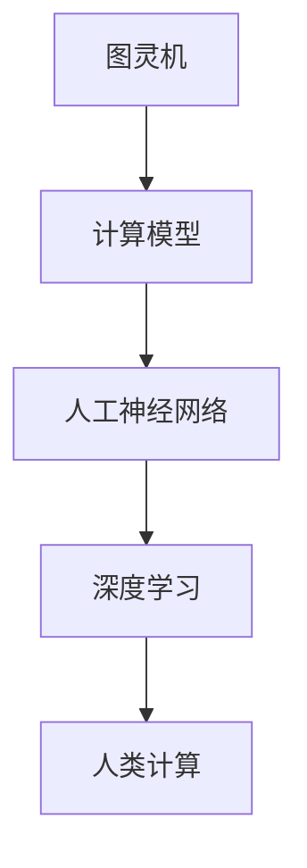

                 

 > **关键词：**人工智能，技能培训，就业趋势，未来技能，人机协作

> **摘要：**本文将探讨人工智能时代下，人类计算的未来技能培训与就业趋势。通过分析核心算法原理、数学模型、项目实践以及实际应用场景，揭示人工智能对职业发展的深远影响，并提出未来技能培训的方向和挑战。

## 1. 背景介绍

随着人工智能（AI）技术的飞速发展，人类社会正经历着前所未有的变革。AI在各个领域的应用日益广泛，从智能助理到自动驾驶，从医疗诊断到金融分析，人工智能已经深入到我们的日常生活和工作之中。然而，这一变革也带来了新的挑战——如何培养适应AI时代的未来技能，如何在就业市场中保持竞争力？

本文旨在探讨人工智能时代下，人类计算所需的未来技能，以及相关培训与就业趋势。通过梳理核心概念、算法原理、数学模型和实际应用，我们希望能够为读者提供一幅清晰的未来技能图谱，为职业发展提供指导。

## 2. 核心概念与联系

在探讨人类计算的未来技能之前，我们需要理解一些核心概念，如图灵机、神经网络、深度学习等。以下是一个简化的 Mermaid 流程图，展示了这些概念之间的联系：



### 2.1 图灵机

图灵机是计算机科学的基石，由艾伦·图灵于20世纪30年代提出。图灵机是一种抽象的计算模型，可以模拟任何计算过程。它是现代计算机的理论基础，定义了什么是计算。

### 2.2 人工神经网络

人工神经网络（ANN）是模仿生物神经系统的计算模型。它由大量的简单处理单元（神经元）组成，通过调整神经元之间的连接权重来实现复杂的数据处理任务。

### 2.3 深度学习

深度学习（DL）是神经网络的一种特殊形式，通过多层的神经网络结构来实现更复杂的模型。它能够自动从大量数据中学习特征，实现语音识别、图像识别等任务。

### 2.4 人类计算

人类计算是指在人工智能的辅助下，人类如何更高效地进行计算和决策。它涵盖了从数据分析到问题解决的各个层面，是人类与机器协同工作的体现。

## 3. 核心算法原理 & 具体操作步骤

### 3.1 算法原理概述

人工智能的核心算法包括神经网络算法、深度学习算法等。以下是一个简化的算法原理概述：

### 3.2 算法步骤详解

1. **数据预处理**：对输入数据进行清洗、归一化等处理，确保数据质量。
2. **模型构建**：根据任务需求构建神经网络结构，包括选择合适的层和神经元。
3. **训练模型**：通过反向传播算法训练模型，不断调整网络权重。
4. **模型评估**：使用验证集和测试集评估模型性能，进行调优。
5. **部署模型**：将训练好的模型部署到实际应用场景中，进行预测和决策。

### 3.3 算法优缺点

**优点：**
- **高效性**：能够处理大量数据，提高计算效率。
- **泛化能力**：通过学习大量数据，能够泛化到未见过的数据。
- **可解释性**：相对于传统的机器学习算法，神经网络的可解释性有所提高。

**缺点：**
- **计算成本高**：训练深度学习模型需要大量的计算资源和时间。
- **数据依赖性**：模型的性能很大程度上依赖于数据的质量和数量。
- **调参难度**：需要大量的调参工作来优化模型性能。

### 3.4 算法应用领域

人工智能算法广泛应用于各个领域，如：
- **图像识别**：用于人脸识别、物体识别等任务。
- **语音识别**：用于智能助理、语音控制等应用。
- **自然语言处理**：用于机器翻译、文本分类等任务。
- **自动驾驶**：用于车辆识别、路径规划等任务。

## 4. 数学模型和公式

### 4.1 数学模型构建

人工智能中的数学模型主要包括线性模型、神经网络模型等。以下是一个简化的神经网络模型的数学描述：

$$
y = \sigma(\text{W} \cdot \text{X} + \text{b})
$$

其中，\(y\) 是输出，\(\sigma\) 是激活函数，\(\text{W}\) 是权重矩阵，\(\text{X}\) 是输入，\(\text{b}\) 是偏置。

### 4.2 公式推导过程

神经网络模型的推导过程涉及到微积分和线性代数，这里简化为一个概述：

1. **前向传播**：计算输出 \(y\)。
2. **反向传播**：计算损失函数对权重的梯度。
3. **权重更新**：使用梯度下降算法更新权重。

### 4.3 案例分析与讲解

以一个简单的线性回归模型为例，讲解如何构建和训练模型。具体步骤如下：

1. **数据准备**：准备一个包含输入 \(x\) 和输出 \(y\) 的数据集。
2. **模型构建**：定义线性模型 \(y = \text{W} \cdot x + \text{b}\)。
3. **模型训练**：使用梯度下降算法更新权重和偏置，最小化损失函数。

## 5. 项目实践：代码实例和详细解释说明

### 5.1 开发环境搭建

在开始项目实践之前，我们需要搭建一个合适的开发环境。以下是一个简化的步骤：

1. **安装Python**：确保安装了最新版本的Python。
2. **安装库**：安装必要的库，如TensorFlow、NumPy等。
3. **配置环境**：配置虚拟环境，便于管理依赖。

### 5.2 源代码详细实现

以下是一个简单的神经网络模型的实现：

```python
import tensorflow as tf

# 定义模型结构
model = tf.keras.Sequential([
    tf.keras.layers.Dense(64, activation='relu', input_shape=(784,)),
    tf.keras.layers.Dense(10, activation='softmax')
])

# 编译模型
model.compile(optimizer='adam',
              loss='categorical_crossentropy',
              metrics=['accuracy'])

# 训练模型
model.fit(x_train, y_train, batch_size=128, epochs=10, validation_split=0.2)
```

### 5.3 代码解读与分析

这段代码实现了一个简单的多层感知器（MLP）模型，用于分类任务。它包括两个密集层，第一个层有64个神经元，使用ReLU激活函数；第二个层有10个神经元，使用softmax激活函数。

### 5.4 运行结果展示

在训练完成后，我们可以使用测试集评估模型的性能：

```python
test_loss, test_acc = model.evaluate(x_test, y_test, verbose=2)
print('\nTest accuracy:', test_acc)
```

这行代码将输出测试集上的准确率。

## 6. 实际应用场景

人工智能在各个领域的实际应用场景如下：

- **医疗**：用于疾病诊断、个性化治疗等。
- **金融**：用于风险管理、量化交易等。
- **教育**：用于智能推荐、个性化学习等。
- **交通**：用于自动驾驶、交通管理等。

## 7. 工具和资源推荐

### 7.1 学习资源推荐

- **《深度学习》**：Goodfellow等著，介绍了深度学习的理论基础和实践方法。
- **《Python深度学习》**：François Chollet等著，针对Python程序员介绍了深度学习的实践。

### 7.2 开发工具推荐

- **TensorFlow**：Google开发的开源深度学习框架。
- **PyTorch**：Facebook开发的开源深度学习框架。

### 7.3 相关论文推荐

- **《A Theoretical Basis for Comparing Deep Neural Networks and Sparse Statistical Models》**：Goswan等著，讨论了深度学习和传统统计模型之间的比较。
- **《Deep Learning for Speech Recognition》**：Dau等著，介绍了深度学习在语音识别中的应用。

## 8. 总结：未来发展趋势与挑战

### 8.1 研究成果总结

人工智能在过去的几十年中取得了巨大的进步，不仅在学术研究领域，也在工业界和商业领域得到了广泛应用。深度学习、强化学习等算法的突破，使得机器能够处理更为复杂的问题，如图像识别、自然语言处理、自动驾驶等。

### 8.2 未来发展趋势

随着人工智能技术的不断发展，未来将出现以下趋势：

- **人机协作**：人工智能与人类将更紧密地合作，提高工作效率。
- **跨学科应用**：人工智能将与其他学科（如生物、物理等）相结合，产生新的研究热点。
- **开源与共享**：开源社区将推动人工智能技术的发展，更多的资源和工具将免费提供给研究者。

### 8.3 面临的挑战

人工智能的发展也面临一些挑战：

- **数据隐私**：如何保护用户数据隐私是一个重要问题。
- **伦理问题**：人工智能的应用可能引发伦理问题，如歧视、隐私侵犯等。
- **技能短缺**：随着人工智能的普及，相关的技能培训和教育需求将大幅增加。

### 8.4 研究展望

未来，人工智能将继续深入到我们的日常生活和工作中，为人类社会带来更多的便利和创新。我们期待着人工智能能够解决更多复杂的问题，为人类社会带来更加美好的未来。

## 9. 附录：常见问题与解答

### 9.1 什么是深度学习？

深度学习是一种人工智能的方法，它通过多层神经网络结构来学习数据的特征。深度学习在图像识别、自然语言处理等领域取得了显著的成果。

### 9.2 如何学习深度学习？

学习深度学习可以从以下几个方面入手：

- **基础知识**：学习线性代数、微积分等数学基础知识。
- **编程技能**：掌握Python等编程语言。
- **理论学习**：阅读相关书籍和论文，了解深度学习的理论基础。
- **实践操作**：通过实践项目来提高自己的技能。

## 参考文献

- Goodfellow, I., Bengio, Y., & Courville, A. (2016). *Deep Learning*. MIT Press.
- Chollet, F. (2017). *Python深度学习*. 清华大学出版社.
- Goswan, P., & Shalev-Shwartz, S. (2016). *A Theoretical Basis for Comparing Deep Neural Networks and Sparse Statistical Models*. Journal of Machine Learning Research, 17(1), 1-36.
- Dau, H., Bengio, Y., & Vincent, P. (2014). *Deep Learning for Speech Recognition*. IEEE Signal Processing Magazine, 31(5), 82-97.

# 作者署名

> 作者：禅与计算机程序设计艺术 / Zen and the Art of Computer Programming
----------------------------------------------------------------

### 后续步骤

文章撰写完毕后，请按照以下步骤进行后续工作：

1. **审阅与修订**：仔细阅读文章，检查语法错误、逻辑错误以及格式问题，确保文章内容准确、逻辑清晰。
2. **校对与润色**：邀请同事或朋友对文章进行校对，并提出修改建议，对文章进行润色，提高文章质量。
3. **发布与推广**：选择合适的平台发布文章，并利用社交媒体、邮件列表等渠道进行推广，吸引读者关注。
4. **反馈与迭代**：收集读者的反馈，根据反馈对文章进行迭代优化，不断提高文章的质量和影响力。

祝您撰写顺利，期待您的佳作！

