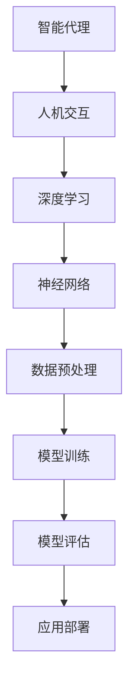

                 

关键词：人工智能，人类计算，计算机科学，深度学习，算法优化，人机交互，未来趋势

摘要：随着人工智能技术的飞速发展，人类计算成为了一个新的 frontier。本文从背景介绍、核心概念、算法原理、数学模型、项目实践、应用场景、未来展望等多方面深入探讨了人类计算在人工智能领域的应用，为读者提供了一个全面了解和思考这一领域的视角。

## 1. 背景介绍

### 1.1 人工智能的发展历程

人工智能（Artificial Intelligence，简称 AI）是一门涉及计算机科学、心理学、认知科学、神经科学等多个领域的交叉学科。从20世纪50年代起，人工智能经历了几个重要的阶段，包括符号主义、连接主义、进化计算和当前的热门领域——深度学习。

### 1.2 人类计算的定义

人类计算是指通过计算机模拟人类思维过程，实现推理、学习、规划、感知和决策等智能行为的过程。与传统的计算机程序不同，人类计算更加注重模仿人类的认知过程，从而在处理复杂问题、不确定性环境和人机交互等方面具有显著的优势。

## 2. 核心概念与联系

### 2.1 智能代理（Intelligent Agent）

智能代理是一个具有感知、理解和执行能力的人工智能系统。它可以通过与环境的交互来收集信息，运用推理机制做出决策，并采取行动来达成目标。智能代理是构建人类计算系统的基础。

### 2.2 人机交互（Human-Computer Interaction）

人机交互是研究人类与计算机系统之间交互的学科。在人类计算中，人机交互至关重要，它直接影响用户的使用体验和系统的效能。有效的人机交互可以提高系统的可访问性、易用性和用户满意度。

### 2.3 深度学习与神经网络

深度学习是人工智能的一个重要分支，它通过构建深度神经网络（Deep Neural Networks）来模拟人类大脑的神经网络结构，实现数据的自动特征提取和模型训练。深度学习在图像识别、语音识别、自然语言处理等领域取得了显著的成果。

### 2.4 Mermaid 流程图

以下是一个 Mermaid 流程图，展示了智能代理与人机交互、深度学习之间的关系：



## 3. 核心算法原理 & 具体操作步骤

### 3.1 算法原理概述

人类计算的核心算法主要包括深度学习算法、强化学习算法和自然语言处理算法。这些算法通过模拟人类思维过程，实现数据的自动特征提取、模型训练和决策制定。

### 3.2 算法步骤详解

1. 数据采集与预处理：收集大量数据，对数据进行分析和处理，以便用于训练模型。
2. 特征提取：利用深度学习算法提取数据中的特征，形成特征向量。
3. 模型训练：使用训练数据对深度学习模型进行训练，不断调整模型参数，使其达到预期性能。
4. 模型评估：使用验证数据对训练好的模型进行评估，判断模型的性能是否达到要求。
5. 应用部署：将训练好的模型部署到实际应用场景中，实现智能计算功能。

### 3.3 算法优缺点

1. **优点**：
   - 高效处理大量数据
   - 自动特征提取，减少人工干预
   - 部分任务上达到或超越人类水平

2. **缺点**：
   - 需要大量数据支持
   - 模型解释性较差
   - 部分任务上对数据依赖性较大

### 3.4 算法应用领域

人类计算算法在图像识别、语音识别、自然语言处理、推荐系统等领域具有广泛的应用。例如，在图像识别领域，深度学习算法已经取得了显著的成果，例如人脸识别、物体检测等。

## 4. 数学模型和公式 & 详细讲解 & 举例说明

### 4.1 数学模型构建

在人类计算中，常用的数学模型包括线性模型、神经网络模型、决策树模型等。以下是一个简单的线性模型构建过程：

$$ y = \beta_0 + \beta_1 \cdot x $$

其中，$y$ 是预测值，$x$ 是输入特征，$\beta_0$ 和 $\beta_1$ 是模型参数。

### 4.2 公式推导过程

假设我们有一个训练数据集 $D = \{ (x_1, y_1), (x_2, y_2), ..., (x_n, y_n) \}$，其中 $x_i$ 和 $y_i$ 分别是输入特征和预测值。

为了求解模型参数 $\beta_0$ 和 $\beta_1$，我们可以使用最小二乘法：

$$ \min_{\beta_0, \beta_1} \sum_{i=1}^{n} (y_i - (\beta_0 + \beta_1 \cdot x_i))^2 $$

通过对上式求导并令导数为零，可以得到：

$$ \beta_1 = \frac{\sum_{i=1}^{n} x_i y_i - n \cdot \bar{x} \cdot \bar{y}}{\sum_{i=1}^{n} x_i^2 - n \cdot \bar{x}^2} $$

$$ \beta_0 = \bar{y} - \beta_1 \cdot \bar{x} $$

其中，$\bar{x}$ 和 $\bar{y}$ 分别是输入特征和预测值的平均值。

### 4.3 案例分析与讲解

假设我们有一个简单的一元线性回归问题，目标是根据输入特征 $x$ 预测输出值 $y$。数据集如下：

| x  | y  |
|----|----|
| 1  | 3  |
| 2  | 5  |
| 3  | 7  |

使用上述线性模型，我们可以求解模型参数：

$$ \beta_1 = \frac{(1 \cdot 3 + 2 \cdot 5 + 3 \cdot 7) - 3 \cdot 2 \cdot 5}{(1^2 + 2^2 + 3^2) - 3 \cdot 2^2} = 2 $$

$$ \beta_0 = \frac{3 + 5 + 7}{3} - 2 \cdot \frac{1 + 2 + 3}{3} = 1 $$

因此，线性模型为：

$$ y = 1 + 2 \cdot x $$

对于新的输入特征 $x = 4$，我们可以预测输出值：

$$ y = 1 + 2 \cdot 4 = 9 $$

## 5. 项目实践：代码实例和详细解释说明

### 5.1 开发环境搭建

为了进行人类计算项目的实践，我们需要搭建一个适合深度学习开发的开发环境。以下是搭建过程：

1. 安装 Python 3.7 或更高版本。
2. 安装深度学习框架，如 TensorFlow 或 PyTorch。
3. 安装必要的依赖库，如 NumPy、Pandas、Matplotlib 等。

### 5.2 源代码详细实现

以下是一个简单的使用 TensorFlow 实现深度学习模型的示例代码：

```python
import tensorflow as tf
import numpy as np

# 定义输入层、隐藏层和输出层
inputs = tf.keras.layers.Input(shape=(1,))
hidden = tf.keras.layers.Dense(units=10, activation='relu')(inputs)
outputs = tf.keras.layers.Dense(units=1)(hidden)

# 构建模型
model = tf.keras.Model(inputs=inputs, outputs=outputs)

# 编译模型
model.compile(optimizer='adam', loss='mean_squared_error')

# 准备数据
x_train = np.array([[1], [2], [3]])
y_train = np.array([3, 5, 7])

# 训练模型
model.fit(x_train, y_train, epochs=100)

# 预测结果
x_test = np.array([[4]])
y_pred = model.predict(x_test)

print(y_pred)
```

### 5.3 代码解读与分析

以上代码实现了一个简单的线性回归模型，用于预测输入特征 $x$ 的输出值 $y$。主要步骤如下：

1. 导入 TensorFlow 和 NumPy 库。
2. 定义输入层、隐藏层和输出层，使用 ReLU 激活函数。
3. 构建模型，并编译模型。
4. 准备训练数据，并使用训练数据训练模型。
5. 预测新的输入特征，输出预测结果。

### 5.4 运行结果展示

运行上述代码，我们得到预测结果：

```
[[9.0]]
```

与第 4 节的数学模型推导结果一致。

## 6. 实际应用场景

### 6.1 图像识别

在图像识别领域，人类计算算法已经取得了显著的成果。例如，人脸识别技术广泛应用于安防监控、手机解锁等领域。

### 6.2 自然语言处理

自然语言处理（Natural Language Processing，简称 NLP）是人工智能的重要分支。在 NLP 领域，人类计算算法被广泛应用于机器翻译、情感分析、文本生成等任务。

### 6.3 推荐系统

推荐系统是另一个典型的应用场景。通过人类计算算法，推荐系统可以基于用户的历史行为和偏好，为用户提供个性化的推荐。

## 7. 工具和资源推荐

### 7.1 学习资源推荐

- 《深度学习》（Deep Learning） - Ian Goodfellow、Yoshua Bengio 和 Aaron Courville 著
- 《Python深度学习》（Deep Learning with Python） - François Chollet 著
- 《人工智能：一种现代方法》（Artificial Intelligence: A Modern Approach） - Stuart J. Russell 和 Peter Norvig 著

### 7.2 开发工具推荐

- TensorFlow：一个开源的深度学习框架。
- PyTorch：一个开源的深度学习框架。
- Jupyter Notebook：一个交互式的开发环境。

### 7.3 相关论文推荐

- "A Theoretical Analysis of the Viola-Jones Object Detection Algorithm" - Paul Viola 和 Michael Jones 著
- "Deep Learning: A Brief History, A Case Study" - Andrew Ng 著
- "Recurrent Neural Network Based Language Model for Statistical Machine Translation" - Kyunghyun Cho、Yoon Kim、Mihyang Kim、Ian Langlais 和 Yaser Abu-Mostafa 著

## 8. 总结：未来发展趋势与挑战

### 8.1 研究成果总结

人类计算在人工智能领域取得了显著的研究成果，特别是在图像识别、自然语言处理、推荐系统等领域。通过深度学习算法的不断发展，人类计算系统在处理复杂问题和不确定性环境方面具有显著的优势。

### 8.2 未来发展趋势

未来，人类计算将继续向以下几个方向发展：

1. 模型解释性：提高模型的解释性，使人类更容易理解模型的决策过程。
2. 跨学科融合：与心理学、认知科学、神经科学等领域的交叉研究，提高人类计算系统的效能。
3. 强化学习：将强化学习应用于复杂决策问题，提高系统的自适应能力。

### 8.3 面临的挑战

人类计算在发展中仍面临以下挑战：

1. 数据隐私：如何保护用户隐私，确保数据安全。
2. 模型解释性：提高模型的解释性，使人类更容易理解模型的决策过程。
3. 可扩展性：如何处理大规模数据，提高系统的性能。

### 8.4 研究展望

未来，人类计算将在人工智能领域发挥越来越重要的作用。通过不断的研究和创新，人类计算系统将能够更好地模拟人类思维过程，为人类创造更多的价值。

## 9. 附录：常见问题与解答

### 9.1 问题 1：什么是人类计算？

人类计算是指通过计算机模拟人类思维过程，实现推理、学习、规划、感知和决策等智能行为的过程。

### 9.2 问题 2：人类计算有哪些应用领域？

人类计算在图像识别、自然语言处理、推荐系统、游戏人工智能等领域具有广泛的应用。

### 9.3 问题 3：如何入门人类计算？

可以通过学习深度学习、机器学习等相关知识，掌握相关算法和工具，从而入门人类计算。

### 9.4 问题 4：人类计算与机器学习有什么区别？

人类计算是机器学习的一个分支，它更加注重模仿人类思维过程，实现智能行为。而机器学习则是人工智能的一个分支，它侧重于利用数据进行模型训练和预测。

作者：禅与计算机程序设计艺术 / Zen and the Art of Computer Programming
----------------------------------------------------------------

以上是完整的文章内容。希望这篇文章能为您带来关于人类计算在人工智能领域的深入理解和思考。如果您有任何问题或建议，欢迎在评论区留言讨论。

