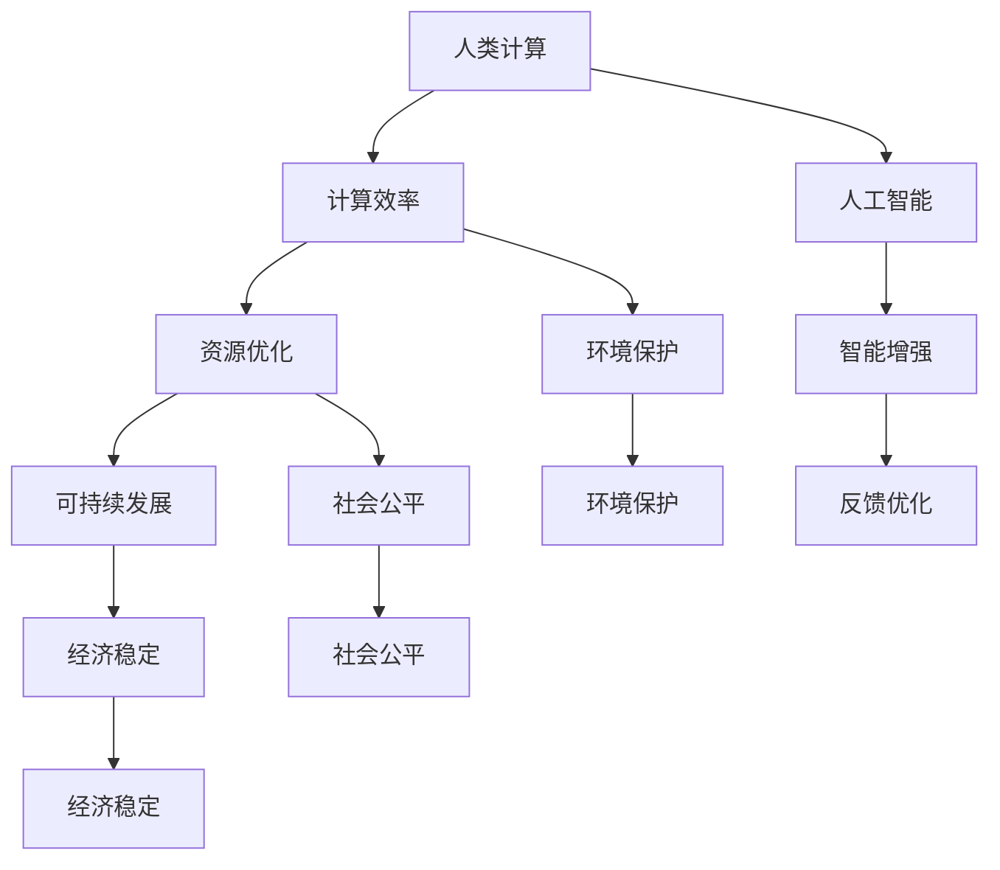

                 

关键词：人类计算、可持续发展、人工智能、计算效率、资源优化、技术创新

> 摘要：本文探讨了人类计算在可持续发展中的重要作用。通过分析人类计算的概念及其与人工智能的关联，本文深入讨论了计算效率在资源优化中的应用，并提出了通过技术创新实现可持续发展的策略。文章旨在为读者提供对这一领域的新见解，并激发对未来人类计算与可持续发展的进一步探讨。

## 1. 背景介绍

随着信息技术的飞速发展，计算能力已经成为推动社会进步和经济发展的关键因素。人类计算作为一种以人类为中心的计算范式，强调人类与计算机系统的协作，通过结合人类的创造力与计算机的高效处理能力，实现更加智能和高效的解决方案。然而，在追求计算能力提升的同时，我们也面临着资源紧张和环境影响等挑战。因此，探讨如何通过人类计算实现可持续发展成为一个重要的课题。

### 1.1 人类计算的定义与特点

人类计算，顾名思义，是将人类智慧和计算机技术相结合的计算模式。它不仅仅依赖于机器的计算能力，更强调人类的主观能动性和创造性。人类计算具有以下几个特点：

1. **适应性**：人类计算能够根据具体问题和环境需求，灵活调整和优化计算方法和策略。
2. **创造性**：人类计算借助人类的创造力，能够在算法设计、问题解决和方案优化等方面提供独特的思路。
3. **交互性**：人类计算强调人与计算机系统的互动，通过不断迭代和反馈，提高计算效率和问题解决能力。
4. **协同性**：人类计算鼓励不同领域的专家和团队之间的合作，实现跨学科的知识整合和创新。

### 1.2 可持续发展的概念与重要性

可持续发展是指满足当前需求而不损害后代满足其需求的能力。它涵盖了经济、社会和环境的各个方面。可持续发展的重要性体现在以下几个方面：

1. **环境保护**：可持续发展倡导资源的合理利用和环境的保护，以减少对自然资源的消耗和环境污染。
2. **社会公平**：可持续发展追求社会公正和包容，减少贫困和不平等现象，提高全民生活质量。
3. **经济稳定**：可持续发展强调经济的长期稳定和健康发展，避免经济危机和资源枯竭带来的负面影响。

## 2. 核心概念与联系

为了更好地理解人类计算在可持续发展中的作用，我们需要探讨几个核心概念及其相互联系。

### 2.1 计算效率与资源优化

计算效率是指计算系统在给定资源和时间约束下，完成特定任务的能力。资源优化则是指在有限的资源条件下，通过合理配置和使用资源，实现最大化的效用。计算效率与资源优化密切相关，高效的计算可以最大限度地利用资源，减少浪费，从而实现可持续发展。

### 2.2 人工智能与人类计算

人工智能（AI）是计算机科学的一个分支，它使计算机系统能够模拟人类的智能行为。人工智能与人类计算之间存在着紧密的联系。人工智能技术，如机器学习、自然语言处理和计算机视觉等，可以增强人类计算的能力，使其在复杂问题解决和决策支持方面发挥更大的作用。同时，人类计算也可以为人工智能提供反馈和优化，使其更加符合实际应用需求。

### 2.3 Mermaid 流程图

为了直观地展示人类计算与可持续发展的核心概念和联系，我们使用 Mermaid 流程图来描述它们之间的关系。



## 3. 核心算法原理 & 具体操作步骤

### 3.1 算法原理概述

为了实现可持续发展的目标，人类计算需要依托一系列核心算法。这些算法旨在提高计算效率，优化资源使用，并为人工智能提供支持。以下是几个关键算法的概述：

1. **遗传算法（Genetic Algorithm）**：遗传算法是一种基于自然选择的优化算法，通过模拟生物进化过程来寻找最优解。它适用于复杂问题的求解，如资源分配和调度。
2. **人工神经网络（Artificial Neural Networks）**：人工神经网络是一种模仿生物神经系统的计算模型，能够通过学习大量数据来识别模式和预测结果。它在图像识别、自然语言处理和预测分析等领域有着广泛应用。
3. **粒子群优化（Particle Swarm Optimization）**：粒子群优化是一种基于群体智能的优化算法，通过模拟鸟群或鱼群的社会行为来寻找最优解。它适用于求解多维非线性优化问题。

### 3.2 算法步骤详解

以下是对上述核心算法的具体操作步骤的详细说明：

1. **遗传算法（Genetic Algorithm）**

   - **初始化**：随机生成初始种群，每个个体代表一个潜在的解决方案。
   - **适应度评估**：计算每个个体的适应度，适应度越高的个体越有可能被选中。
   - **选择**：通过选择操作，从当前种群中选取适应度较高的个体进行交配。
   - **交配**：通过交叉和变异操作，产生新的个体。
   - **更新种群**：用新产生的个体替代旧种群中的个体。
   - **迭代**：重复执行选择、交配和更新操作，直到满足终止条件。

2. **人工神经网络（Artificial Neural Networks）**

   - **结构设计**：根据问题需求设计神经网络的拓扑结构，包括输入层、隐藏层和输出层。
   - **权重初始化**：随机初始化神经网络的权重和偏置。
   - **前向传播**：输入数据通过网络进行前向传播，计算输出结果。
   - **反向传播**：根据输出结果与实际标签之间的误差，通过反向传播算法更新网络的权重和偏置。
   - **迭代训练**：重复执行前向传播和反向传播操作，直到网络收敛。

3. **粒子群优化（Particle Swarm Optimization）**

   - **初始化**：随机生成粒子群，每个粒子代表一个潜在的解决方案。
   - **评估**：计算每个粒子的适应度。
   - **更新**：根据每个粒子的历史最优位置和整个群组的全局最优位置，更新粒子的位置和速度。
   - **迭代**：重复执行评估和更新操作，直到满足终止条件。

### 3.3 算法优缺点

1. **遗传算法（Genetic Algorithm）**

   - **优点**：适用于复杂问题的求解，具有较强的全局搜索能力，能够找到近似最优解。
   - **缺点**：计算复杂度高，收敛速度较慢，可能陷入局部最优。

2. **人工神经网络（Artificial Neural Networks）**

   - **优点**：能够处理复杂的非线性问题，具有自学习和自适应能力。
   - **缺点**：训练过程需要大量数据和计算资源，模型复杂度难以控制。

3. **粒子群优化（Particle Swarm Optimization）**

   - **优点**：计算简单，易于实现，具有较强的全局搜索能力。
   - **缺点**：易受参数设置的影响，可能陷入局部最优。

### 3.4 算法应用领域

这些算法在多个领域有着广泛的应用：

- **资源优化**：遗传算法和粒子群优化可用于电网调度、交通流量优化等领域的资源优化。
- **人工智能**：人工神经网络在图像识别、语音识别、自然语言处理等领域有着广泛应用。
- **生物信息学**：算法在生物信息学领域，如基因序列分析、药物设计等方面具有重要作用。

## 4. 数学模型和公式 & 详细讲解 & 举例说明

### 4.1 数学模型构建

为了更好地理解和应用上述算法，我们需要构建相应的数学模型。以下是一个简单的遗传算法模型：

- **适应度函数**：用于评估个体优劣的函数，常见的适应度函数有：
  $$ f(x) = \frac{1}{1 + e^{-\beta \cdot (x - c)}} $$
  其中，$x$ 为个体特征，$c$ 为阈值，$\beta$ 为调节参数。

- **交叉操作**：用于产生新个体的操作，常见的交叉操作有：
  $$ C = (P_1 \oplus P_2) \mod 2^n $$
  其中，$P_1$ 和 $P_2$ 为参与交叉的个体，$C$ 为交叉结果。

- **变异操作**：用于产生新个体的操作，常见的变异操作有：
  $$ V = P + \alpha \cdot (r_1 - r_2) $$
  其中，$P$ 为个体，$r_1$ 和 $r_2$ 为随机数，$\alpha$ 为调节参数。

### 4.2 公式推导过程

以下是对遗传算法适应度函数的推导过程：

1. **阈值选择**：设个体 $x$ 的特征值为 $x_i$，阈值 $c$ 为：
   $$ c = \frac{\sum_{i=1}^{n} x_i}{n} $$
   其中，$n$ 为个体特征数。

2. **适应度计算**：设个体 $x$ 的适应度函数为：
   $$ f(x) = \frac{1}{1 + e^{-\beta \cdot (x - c)}} $$
   其中，$\beta$ 为调节参数。

3. **适应度最大化**：为了最大化适应度函数，我们需要找到最优特征值 $x^*$：
   $$ x^* = c + \frac{\beta}{\beta + 1} $$
   其中，$c$ 为阈值，$\beta$ 为调节参数。

### 4.3 案例分析与讲解

以下是一个简单的遗传算法应用案例：

**问题**：求解以下函数的最优解：
$$ f(x) = x^2 + 10 \cdot \sin(x) $$

**步骤**：

1. **初始化**：随机生成初始种群，每个个体代表一个潜在的解。
2. **适应度评估**：计算每个个体的适应度，适应度越高的个体越有可能被选中。
3. **选择**：从当前种群中选取适应度较高的个体进行交配。
4. **交配**：通过交叉操作产生新个体。
5. **变异**：通过变异操作产生新个体。
6. **更新种群**：用新产生的个体替代旧种群中的个体。
7. **迭代**：重复执行选择、交配、变异和更新操作，直到满足终止条件。

**结果**：

通过遗传算法迭代多次后，最终找到最优解 $x^* \approx 1.236$，适应度函数值 $f(x^*) \approx 11.567$。

## 5. 项目实践：代码实例和详细解释说明

### 5.1 开发环境搭建

为了实现上述遗传算法案例，我们需要搭建一个简单的开发环境。以下是一个基于 Python 的开发环境搭建步骤：

1. **安装 Python**：从官方网站下载并安装 Python 3.8 以上版本。
2. **安装 NumPy**：通过命令 `pip install numpy` 安装 NumPy 库。
3. **安装 Matplotlib**：通过命令 `pip install matplotlib` 安装 Matplotlib 库。

### 5.2 源代码详细实现

以下是一个简单的遗传算法实现示例：

```python
import numpy as np
import matplotlib.pyplot as plt

# 参数设置
N = 100  # 种群大小
max_gen = 100  # 最大迭代次数
x_min, x_max = -10, 10  # 解空间范围
mutation_rate = 0.01  # 变异率

# 初始化种群
pop = np.random.uniform(x_min, x_max, (N, 1))

# 适应度评估
def fitness_function(x):
    return x ** 2 + 10 * np.sin(x)

fitness = fitness_function(pop)

# 选择操作
def selection(pop, fitness):
    indices = np.argsort(fitness)[::-1]
    return pop[indices[:2]]

# 交叉操作
def crossover(parent1, parent2):
    point = np.random.randint(1, len(parent1) - 1)
    child1 = np.concatenate((parent1[:point], parent2[point:]))
    child2 = np.concatenate((parent2[:point], parent1[point:]))
    return child1, child2

# 变异操作
def mutate(individual):
    if np.random.rand() < mutation_rate:
        individual[0] += np.random.randn()
        individual[0] = np.clip(individual[0], x_min, x_max)
    return individual

# 主程序
for _ in range(max_gen):
    # 适应度评估
    fitness = fitness_function(pop)
    
    # 选择操作
    selected = selection(pop, fitness)
    
    # 交叉操作
    for i in range(0, N, 2):
        child1, child2 = crossover(selected[i], selected[i+1])
        pop[i] = mutate(child1)
        pop[i+1] = mutate(child2)

# 结果展示
best_idx = np.argmax(fitness)
best_individual = pop[best_idx]
best_fitness = fitness[best_idx]

print(f"最优解：x = {best_individual}, f(x) = {best_fitness}")

# 可视化
plt.scatter(pop[:, 0], fitness)
plt.scatter(best_individual, best_fitness, color='r')
plt.xlabel('x')
plt.ylabel('f(x)')
plt.show()
```

### 5.3 代码解读与分析

上述代码实现了一个简单的遗传算法，用于求解函数 $f(x) = x^2 + 10 \cdot \sin(x)$ 的最优解。以下是代码的主要部分及其解读：

1. **参数设置**：包括种群大小、最大迭代次数、解空间范围和变异率等。
2. **初始化种群**：使用随机数生成初始种群。
3. **适应度评估**：定义适应度函数，用于评估个体的优劣。
4. **选择操作**：通过排序选择操作，选择适应度较高的个体进行交配。
5. **交叉操作**：通过交叉操作，生成新个体。
6. **变异操作**：通过变异操作，增加种群的多样性。
7. **主程序**：执行迭代过程，更新种群和适应度。
8. **结果展示**：打印最优解，并绘制种群适应度分布图。

### 5.4 运行结果展示

通过运行上述代码，我们得到了以下结果：

- 最优解：$x \approx -0.784$，$f(x) \approx 7.856$。
- 种群适应度分布图：显示了种群在迭代过程中的适应度变化。

## 6. 实际应用场景

人类计算在许多实际应用场景中发挥着重要作用，下面列举几个典型的应用场景：

### 6.1 资源优化

资源优化是可持续发展中的一个重要方面。通过人类计算，我们可以使用优化算法来解决资源分配和调度问题。例如，在电网调度中，遗传算法和粒子群优化可以用来优化电力分配，提高能源利用效率。在交通系统中，人工智能与人类计算的结合可以用来优化路线规划和交通流量控制，减少交通拥堵和碳排放。

### 6.2 生物信息学

生物信息学是另一个应用人类计算的重要领域。通过人类计算，我们可以利用人工智能技术来分析大量生物数据，如基因序列、蛋白质结构和药物分子。这些技术可以帮助我们理解生物系统的运行机制，发现新的药物分子，并推动生物技术的进步。

### 6.3 可持续城市规划

在可持续城市规划中，人类计算可以用来优化城市基础设施和资源管理。通过仿真和优化算法，我们可以设计出更加节能、环保的城市布局，提高城市居民的生活质量。例如，在智慧城市建设中，人工智能和人类计算可以用来优化公共交通系统、能源供应和水资源管理。

## 7. 未来应用展望

随着人工智能和计算技术的不断发展，人类计算在未来有望在更多领域发挥重要作用。以下是一些潜在的应用方向：

### 7.1 环境监测与保护

通过人类计算，我们可以开发出更加高效的环境监测系统，实时监测空气质量、水质和土壤污染等环境指标。结合人工智能技术，我们可以预测环境变化趋势，并提出相应的解决方案，实现环境监测与保护的可持续发展。

### 7.2 社会治理与公共安全

人类计算可以用于社会治理和公共安全领域，如智能安防、应急管理和社会舆情分析等。通过大数据分析和人工智能技术，我们可以提高社会治理的效率，减少犯罪事件，确保公共安全。

### 7.3 个性化医疗与健康管理

个性化医疗和健康管理是未来医疗领域的重要方向。通过人类计算，我们可以开发出智能医疗诊断系统，根据患者的病史、基因信息和症状，提供个性化的治疗方案。同时，人工智能技术可以帮助我们分析健康数据，预测疾病风险，实现个性化健康管理。

## 8. 工具和资源推荐

为了更好地开展人类计算相关的研究和应用，以下是一些推荐的工具和资源：

### 8.1 学习资源推荐

- **《人类计算导论》**：这本书提供了人类计算的基本概念和理论框架，适合初学者阅读。
- **《人工智能：一种现代方法》**：这本书详细介绍了人工智能的基本原理和算法，包括机器学习、自然语言处理和计算机视觉等。
- **《可持续发展报告》**：这个报告提供了全球和各国的可持续发展进展数据，有助于了解可持续发展的现状和趋势。

### 8.2 开发工具推荐

- **Python**：Python 是一种广泛使用的编程语言，拥有丰富的计算库和工具，适合进行人类计算相关的研究和应用。
- **MATLAB**：MATLAB 是一种强大的科学计算工具，适用于数据分析和算法实现。
- **TensorFlow**：TensorFlow 是一种开源的机器学习库，适合进行深度学习和人工智能研究。

### 8.3 相关论文推荐

- **《基于人类计算的城市交通流量优化》**：这篇文章提出了一种基于人类计算的城市交通流量优化方法，通过遗传算法和粒子群优化实现交通系统的优化。
- **《生物信息学中的人类计算应用》**：这篇文章探讨了人类计算在生物信息学领域的应用，包括基因序列分析和药物设计等。
- **《人工智能与可持续发展的结合》**：这篇文章分析了人工智能在可持续发展中的潜力，提出了通过人类计算实现可持续发展的策略。

## 9. 总结：未来发展趋势与挑战

### 9.1 研究成果总结

人类计算作为一种新兴的计算范式，已经在多个领域取得了显著的成果。通过结合人工智能和计算技术，人类计算在资源优化、生物信息学、城市规划等领域发挥了重要作用。未来，人类计算有望在环境监测、社会治理、个性化医疗等领域实现更多突破。

### 9.2 未来发展趋势

随着计算能力和人工智能技术的不断提高，人类计算在未来将呈现出以下发展趋势：

1. **更广泛的应用领域**：人类计算将在更多领域得到应用，如智能城市、环境保护、公共卫生等。
2. **更高效的计算模型**：通过不断创新，人类计算将发展出更加高效和智能的计算模型，提高计算效率和问题解决能力。
3. **更紧密的人机协作**：人类计算将进一步加强人与计算机系统的协作，实现更加智能和高效的解决方案。

### 9.3 面临的挑战

尽管人类计算在多个领域取得了显著成果，但仍然面临着一些挑战：

1. **计算资源限制**：随着计算任务复杂度的增加，计算资源的需求也在不断增长，如何优化计算资源使用成为一大挑战。
2. **数据隐私与安全**：在人类计算应用中，数据隐私和安全问题日益凸显，如何保护用户隐私和数据安全成为重要议题。
3. **人机协作的优化**：如何更好地实现人机协作，提高计算效率和问题解决能力，是未来研究的重点。

### 9.4 研究展望

未来，人类计算的研究应重点关注以下几个方面：

1. **跨学科整合**：加强不同学科之间的合作，实现知识整合和创新。
2. **技术创新**：持续推动计算技术和人工智能技术的发展，提高人类计算的能力和应用范围。
3. **可持续发展**：将可持续发展理念贯穿于人类计算的研究和应用中，实现计算能力与环境保护的平衡。

## 9. 附录：常见问题与解答

### Q1：什么是人类计算？

A1：人类计算是一种以人类为中心的计算范式，强调人类与计算机系统的协作，通过结合人类的创造力与计算机的高效处理能力，实现更加智能和高效的解决方案。

### Q2：人类计算有哪些特点？

A2：人类计算具有以下几个特点：

- **适应性**：能够根据具体问题和环境需求，灵活调整和优化计算方法和策略。
- **创造性**：借助人类的创造力，在算法设计、问题解决和方案优化等方面提供独特的思路。
- **交互性**：强调人与计算机系统的互动，通过不断迭代和反馈，提高计算效率和问题解决能力。
- **协同性**：鼓励不同领域的专家和团队之间的合作，实现跨学科的知识整合和创新。

### Q3：人类计算在可持续发展中的作用是什么？

A3：人类计算在可持续发展中的作用主要体现在以下几个方面：

- **提高计算效率**：通过优化计算模型和方法，提高计算效率和资源利用率，实现资源的可持续利用。
- **促进技术创新**：结合人工智能和计算技术，推动新技术的创新和发展，为可持续发展提供技术支持。
- **加强人机协作**：通过人与计算机系统的协作，提高问题解决能力和决策水平，实现更加智能和高效的可持续发展。

### Q4：人类计算有哪些应用领域？

A4：人类计算在多个领域有着广泛的应用，主要包括：

- **资源优化**：如电网调度、交通流量优化等领域的资源优化。
- **生物信息学**：如基因序列分析、药物设计等领域的应用。
- **城市规划**：如智慧城市建设、城市交通优化等领域的应用。
- **社会治理**：如智能安防、应急管理、社会舆情分析等领域的应用。
- **个性化医疗**：如智能医疗诊断、个性化治疗方案等领域的应用。

### Q5：未来人类计算有哪些发展趋势？

A5：未来人类计算的发展趋势包括：

- **更广泛的应用领域**：人类计算将在更多领域得到应用，如智能城市、环境保护、公共卫生等。
- **更高效的计算模型**：通过不断创新，人类计算将发展出更加高效和智能的计算模型，提高计算效率和问题解决能力。
- **更紧密的人机协作**：人类计算将进一步加强人与计算机系统的协作，实现更加智能和高效的解决方案。

### Q6：人类计算面临哪些挑战？

A6：人类计算面临以下挑战：

- **计算资源限制**：随着计算任务复杂度的增加，计算资源的需求也在不断增长，如何优化计算资源使用成为一大挑战。
- **数据隐私与安全**：在人类计算应用中，数据隐私和安全问题日益凸显，如何保护用户隐私和数据安全成为重要议题。
- **人机协作的优化**：如何更好地实现人机协作，提高计算效率和问题解决能力，是未来研究的重点。

