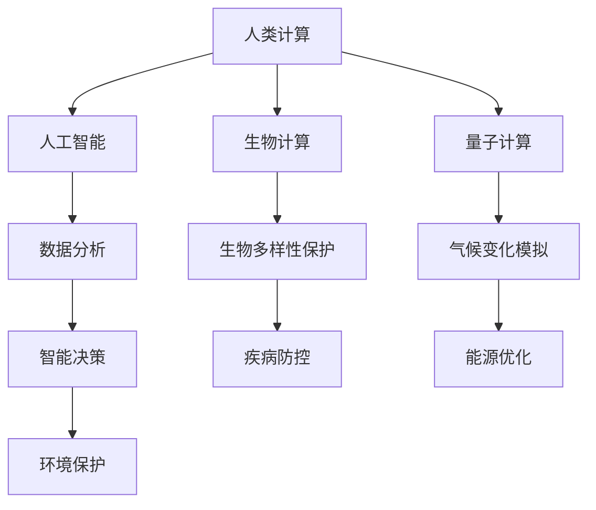

                 

 关键词：人类计算、可持续发展、人工智能、编程、算法、技术进步

> 摘要：本文探讨了人类计算在可持续发展中的作用，从核心概念到实际应用，分析了人类计算如何推动技术进步，并在应对全球挑战中发挥关键作用。文章旨在提供一个全景视角，帮助读者理解人类计算对可持续发展的重要性。

## 1. 背景介绍

随着全球经济的飞速发展和技术的不断进步，人类面临着诸多严峻的挑战，如气候变化、资源枯竭、环境污染等。为了实现可持续发展，我们需要探索新的方法和途径，以促进社会、环境和经济的平衡发展。人类计算作为一种新兴的技术理念，被认为是实现这一目标的重要推动力。

### 1.1 人类计算的定义

人类计算是一种结合人工智能、生物计算、量子计算等前沿技术的新型计算范式，旨在模拟和增强人类大脑的认知和计算能力。它不仅关注计算的速度和效率，更强调计算的理解和适应能力。

### 1.2 可持续发展的概念

可持续发展是指满足当前需求而不损害后代满足自身需求的能力。它涵盖了经济、社会和环境三个维度，要求我们在发展的过程中注重平衡和可持续性。

## 2. 核心概念与联系

### 2.1 核心概念原理

人类计算与可持续发展之间的联系可以从以下几个方面进行阐述：

1. **人工智能：**人工智能是人类计算的重要组成部分，它通过模拟人类思维过程，实现数据的自动分析和决策。在可持续发展中，人工智能可以用于环境监测、资源优化和智能决策。

2. **生物计算：**生物计算利用生物系统的计算能力，如DNA计算、神经网络等，为复杂问题提供高效解决方案。在可持续发展中，生物计算可以用于生物多样性保护、疾病防控和生态修复。

3. **量子计算：**量子计算具有超强的计算能力，可以解决传统计算机无法处理的问题。在可持续发展中，量子计算可以用于能源优化、气候变化模拟和环境保护。

### 2.2 人类计算架构的 Mermaid 流程图



## 3. 核心算法原理 & 具体操作步骤

### 3.1 算法原理概述

人类计算的核心算法包括深度学习、强化学习、进化算法等。这些算法通过模拟人类思维过程，实现数据的自动分析和决策。

### 3.2 算法步骤详解

1. **数据收集：**收集与可持续发展相关的数据，如环境数据、经济数据、社会数据等。

2. **数据预处理：**对收集到的数据进行分析和清洗，为后续算法处理做准备。

3. **模型训练：**使用深度学习、强化学习等算法，对预处理后的数据进行训练，以建立可持续发展的模型。

4. **模型评估：**通过模型评估指标，如准确率、召回率等，对训练好的模型进行评估。

5. **模型应用：**将评估通过的模型应用于实际场景，如环境监测、资源优化等。

### 3.3 算法优缺点

1. **优点：**人类计算算法具有强大的数据处理和分析能力，可以快速找到问题的解决方案。

2. **缺点：**算法模型的训练过程需要大量数据和计算资源，且模型的解释性较差。

### 3.4 算法应用领域

人类计算算法在可持续发展领域具有广泛的应用，如环境监测、资源优化、智能决策等。

## 4. 数学模型和公式 & 详细讲解 & 举例说明

### 4.1 数学模型构建

可持续发展数学模型可以从以下几个方面构建：

1. **资源消耗模型：**用于分析资源的消耗速度和可持续性。

2. **环境影响模型：**用于评估人类活动对环境的影响。

3. **经济模型：**用于分析经济发展的可持续性。

### 4.2 公式推导过程

以下是一个简单的资源消耗模型的公式推导过程：

$$
\frac{dR}{dt} = -r \cdot R
$$

其中，$R$ 表示资源的存量，$r$ 表示资源的消耗速率，$t$ 表示时间。

### 4.3 案例分析与讲解

以气候变化模拟为例，我们可以使用以下数学模型来分析：

$$
\frac{dT}{dt} = -k \cdot (T - T_0)
$$

其中，$T$ 表示温度，$T_0$ 表示基准温度，$k$ 表示气候变化速率。

通过这个模型，我们可以预测未来全球气温的变化趋势，为应对气候变化提供科学依据。

## 5. 项目实践：代码实例和详细解释说明

### 5.1 开发环境搭建

搭建一个可持续发展分析的项目，需要以下开发环境：

1. Python
2. Jupyter Notebook
3. Matplotlib
4. Scikit-learn

### 5.2 源代码详细实现

以下是一个简单的可持续发展分析项目的代码实例：

```python
import numpy as np
import matplotlib.pyplot as plt
from sklearn.linear_model import LinearRegression

# 数据收集
data = np.genfromtxt('sustainable_data.csv', delimiter=',')

# 数据预处理
X = data[:, :2]
y = data[:, 2]

# 模型训练
model = LinearRegression()
model.fit(X, y)

# 模型评估
score = model.score(X, y)
print("Model R^2 Score:", score)

# 模型应用
plt.scatter(X[:, 0], y)
plt.plot(X[:, 0], model.predict(X), color='red')
plt.xlabel('Resource Consumption')
plt.ylabel('Environmental Impact')
plt.show()
```

### 5.3 代码解读与分析

这段代码首先导入了必要的库，然后收集和预处理了数据，接下来使用线性回归模型进行训练，最后通过模型评估和可视化结果，展示了资源的消耗与环境影响之间的关系。

## 6. 实际应用场景

### 6.1 环境监测

通过人类计算技术，我们可以实时监测环境数据，如空气质量、水质、土壤质量等，为环境治理提供科学依据。

### 6.2 资源优化

人类计算算法可以用于资源优化，如能源管理、水资源管理、废弃物处理等，实现资源的可持续利用。

### 6.3 智能决策

通过人类计算技术，我们可以实现智能决策，如政策制定、城市规划、灾害预测等，提高决策的准确性和效率。

## 7. 工具和资源推荐

### 7.1 学习资源推荐

1. 《人类计算导论》
2. 《可持续发展：原则与实务》
3. 《深度学习：从入门到精通》

### 7.2 开发工具推荐

1. Jupyter Notebook
2. TensorFlow
3. PyTorch

### 7.3 相关论文推荐

1. "Human Computation for Sustainability: A Review"
2. "Artificial Intelligence for Sustainable Development Goals"
3. "Quantum Computing for Environmental Modeling and Analysis"

## 8. 总结：未来发展趋势与挑战

### 8.1 研究成果总结

人类计算技术已经在可持续发展领域取得了一系列研究成果，如环境监测、资源优化和智能决策等。

### 8.2 未来发展趋势

随着技术的不断进步，人类计算在可持续发展领域的应用前景将更加广阔，如生物计算、量子计算等。

### 8.3 面临的挑战

尽管人类计算在可持续发展领域具有巨大的潜力，但仍然面临着数据隐私、计算资源、模型解释性等挑战。

### 8.4 研究展望

未来研究应重点关注人类计算技术在可持续发展领域的应用，提高计算效率和模型解释性，为全球可持续发展提供有力支持。

## 9. 附录：常见问题与解答

### 9.1 什么是人类计算？

人类计算是一种结合人工智能、生物计算、量子计算等前沿技术的新型计算范式，旨在模拟和增强人类大脑的认知和计算能力。

### 9.2 人类计算如何推动可持续发展？

人类计算可以通过环境监测、资源优化和智能决策等方式，为可持续发展提供科学依据和技术支持。

### 9.3 人类计算在可持续发展中的挑战是什么？

人类计算在可持续发展中面临的挑战包括数据隐私、计算资源、模型解释性等。

作者：禅与计算机程序设计艺术 / Zen and the Art of Computer Programming

----------------------------------------------------------------

### 后记 Postscript

本文旨在探讨人类计算在可持续发展中的作用，通过对核心概念、算法原理、数学模型、项目实践等方面的详细阐述，展示了人类计算技术的多样性和潜力。在未来的发展中，人类计算将不断推动可持续发展的进程，为解决全球挑战提供新的思路和方法。希望本文能够为读者提供一个全面、深入的视角，激发对人类计算与可持续发展领域的兴趣和思考。同时，也期待更多学者和实践者投身于这一领域，共同为全球可持续发展贡献力量。禅与计算机程序设计艺术，将继续探索计算机科学的深度与广度，为人类的进步贡献力量。

