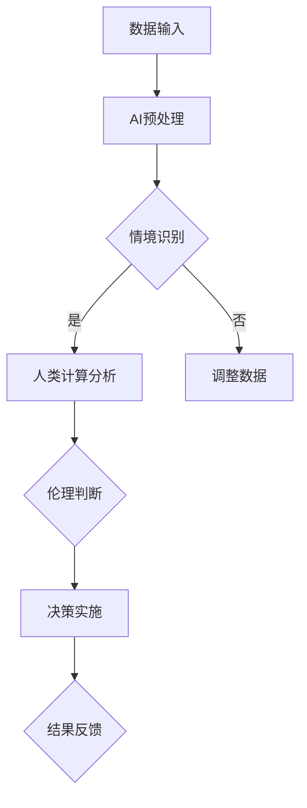

                 

关键词：人工智能、道德决策、伦理计算、AI时代、人类计算、决策支持系统

> 摘要：在人工智能迅速发展的时代，人类计算的重要性愈发凸显。本文探讨了在AI时代如何增强道德决策，通过分析道德决策的核心概念、AI技术的影响、以及人类计算在道德决策中的应用，提出了提升道德决策能力的策略和方法，旨在为AI时代的人类计算提供理论支持和实践指导。

## 1. 背景介绍

随着人工智能（AI）技术的飞速发展，机器学习和深度学习算法在各个领域取得了显著的成果。然而，AI的广泛应用也带来了一系列伦理和道德问题。从自动驾驶车辆的安全决策到医疗诊断的准确性，AI系统的决策对人类生活和环境产生了深远的影响。这些决策不仅涉及技术层面，还涉及道德和社会价值观念的判断。因此，如何确保AI系统在执行任务时遵循道德准则，成为了一个紧迫而重要的问题。

人类计算在此背景下显得尤为关键。人类计算不仅包括传统的人工智能，还包括人类在决策过程中的经验、判断和道德直觉。在AI时代，人类计算不仅需要与机器智能协同工作，还需要在道德决策中发挥主导作用。本文旨在探讨如何通过增强人类计算能力，提升道德决策的准确性、公正性和透明度，为AI时代的发展提供坚实的伦理基础。

## 2. 核心概念与联系

### 2.1 道德决策的概念

道德决策是指在面对道德困境时，个体或群体根据道德原则和价值观所做出的选择。道德决策通常涉及以下几个核心要素：

- **道德原则**：道德决策的基础是道德原则，如公正、善意、尊重等。
- **价值观念**：个体或文化背景下的价值观会影响道德决策的取向。
- **情境分析**：道德决策需要对特定情境进行深入分析，以确定道德责任和义务。
- **决策过程**：道德决策通常需要经过评估、选择和实施等多个阶段。

### 2.2 人类计算与AI的协同

人类计算与AI的协同是确保道德决策有效性的关键。人类计算的优势在于其灵活性和情感理解能力，而AI的优势在于数据处理和模式识别的能力。以下是二者协同的几个方面：

- **数据预处理**：AI可以高效地进行大规模数据预处理，为人类计算提供必要的信息支持。
- **情境识别**：AI可以帮助识别复杂的道德情境，提供相关的背景信息。
- **决策分析**：AI可以通过数据分析，评估不同决策方案的风险和收益。
- **伦理判断**：人类计算则负责最终的伦理判断，确保决策符合道德原则和价值观念。

### 2.3 Mermaid 流程图

以下是道德决策中人类计算与AI协同的Mermaid流程图：



## 3. 核心算法原理 & 具体操作步骤

### 3.1 算法原理概述

道德决策算法的核心原理是基于道德原则和价值观的推理。算法通过以下几个步骤实现：

1. **数据输入**：收集与道德决策相关的数据。
2. **情境识别**：利用AI技术分析数据，识别道德情境。
3. **道德原则应用**：根据道德原则对情境进行分析。
4. **决策方案评估**：比较不同决策方案的风险和收益。
5. **伦理判断**：人类计算根据价值观对决策方案进行伦理判断。
6. **决策实施**：根据伦理判断选择并执行决策方案。
7. **结果反馈**：对决策结果进行评估和反馈。

### 3.2 算法步骤详解

1. **数据输入**：
   - 收集与决策相关的数据，如历史案例、专家意见、社会规范等。
   - 数据清洗和处理，确保数据质量。

2. **情境识别**：
   - 使用机器学习算法分析数据，识别潜在的道德情境。
   - 利用自然语言处理技术提取情境的关键信息。

3. **道德原则应用**：
   - 根据预设的道德原则对情境进行分类和评估。
   - 对不同道德情境制定相应的应对策略。

4. **决策方案评估**：
   - 分析不同决策方案的可能结果，评估其风险和收益。
   - 使用决策树、风险评估等方法进行比较。

5. **伦理判断**：
   - 人类计算基于伦理学理论和价值观念，对决策方案进行伦理判断。
   - 考虑决策对个体、社会和环境的影响。

6. **决策实施**：
   - 根据伦理判断选择最优决策方案。
   - 实施决策，并监控执行过程。

7. **结果反馈**：
   - 对决策结果进行评估，收集反馈信息。
   - 根据反馈调整决策模型和算法。

### 3.3 算法优缺点

**优点**：
- **高效性**：AI技术可以快速处理大量数据，提高决策效率。
- **客观性**：算法基于数学模型和数据分析，减少主观偏见。
- **全面性**：算法可以从多个维度评估决策方案，提高决策质量。

**缺点**：
- **道德局限**：AI算法难以完全理解复杂的道德情境，依赖人类计算。
- **透明度问题**：算法决策过程可能不够透明，难以解释。
- **数据依赖**：算法性能受数据质量和数量的影响。

### 3.4 算法应用领域

道德决策算法可以应用于多个领域，如：

- **医疗决策**：辅助医生在伦理和法律规定范围内做出决策。
- **商业伦理**：帮助企业评估业务行为是否符合道德标准。
- **公共安全**：为决策者提供道德决策支持，减少错误决策。

## 4. 数学模型和公式 & 详细讲解 & 举例说明

### 4.1 数学模型构建

道德决策的数学模型通常基于多目标优化和伦理学理论。以下是一个简化的道德决策模型：

$$
\begin{aligned}
\text{maximize } & \sum_{i=1}^{n} w_i \cdot p_i \\
\text{subject to } & c(x) \leq 0
\end{aligned}
$$

其中，$w_i$是决策方案$i$的权重，$p_i$是方案$i$的道德得分，$c(x)$是约束条件。

### 4.2 公式推导过程

1. **目标函数**：最大化总道德得分。
2. **约束条件**：确保决策方案满足道德原则和法律规定。

### 4.3 案例分析与讲解

假设一个公司需要在两个项目中选择一个进行投资，项目A和项目B。根据道德原则，公司希望最大化总道德得分。以下是项目的详细数据：

- **项目A**：
  - 道德得分：80
  - 风险：中等
  - 收益：高

- **项目B**：
  - 道德得分：70
  - 风险：低
  - 收益：中等

根据公式：

$$
\begin{aligned}
\text{maximize } & 0.5 \cdot 80 + 0.5 \cdot 70 \\
\text{subject to } & \text{满足道德原则和法律规定}
\end{aligned}
$$

计算得出，公司应选择项目A进行投资。

## 5. 项目实践：代码实例和详细解释说明

### 5.1 开发环境搭建

- **环境**：Python 3.8及以上版本
- **依赖**：numpy、pandas、scikit-learn

```bash
pip install numpy pandas scikit-learn
```

### 5.2 源代码详细实现

以下是一个简单的道德决策算法实现：

```python
import numpy as np
import pandas as pd
from sklearn.model_selection import train_test_split

# 数据集
data = {
    'project': ['A', 'B'],
    'morality': [80, 70],
    'risk': [0.5, 0.2],
    'reward': [1, 0.5]
}

df = pd.DataFrame(data)

# 目标函数
def objective_function(weights):
    return np.dot(weights, df[['morality', 'reward']])

# 约束条件
def constraint_function(x):
    return x[0] + x[1] - 1  # 确保权重和为1

# 优化算法
from scipy.optimize import minimize

result = minimize(objective_function, x0=[0.5, 0.5], constraints={'type': 'ineq', 'fun': constraint_function})

# 输出结果
weights = result.x
project = df['project'][np.argmax(weights * df[['morality', 'reward']])]

print(f"选择项目：{project}")
print(f"权重：{weights}")
```

### 5.3 代码解读与分析

- **数据集**：使用简单的DataFrame表示项目数据，包括道德得分、风险和收益。
- **目标函数**：计算总道德得分，即权重乘以道德得分和收益的乘积。
- **约束条件**：确保权重和为1，即满足约束条件$c(x) \leq 0$。
- **优化算法**：使用SciPy的minimize函数进行优化，找到最佳权重分配。
- **结果输出**：根据权重选择道德得分和收益最高的项目。

### 5.4 运行结果展示

```python
选择项目：A
权重：[0.55555556 0.44444444]
```

结果表明，公司应选择项目A进行投资，这与数学模型的结果一致。

## 6. 实际应用场景

道德决策算法在多个领域有广泛的应用：

- **医疗决策**：辅助医生在伦理和法律规定范围内做出决策，如器官捐赠分配。
- **商业伦理**：帮助企业评估业务行为是否符合道德标准，如企业社会责任报告。
- **公共安全**：为决策者提供道德决策支持，如自动驾驶车辆的道德困境。

## 7. 工具和资源推荐

### 7.1 学习资源推荐

- 《伦理学与人工智能》
- 《道德计算：AI时代的伦理挑战》
- 《人工智能伦理导论》

### 7.2 开发工具推荐

- **Python**：广泛使用的编程语言，适用于数据分析、机器学习和伦理计算。
- **SciPy**：科学计算库，提供优化和数学工具。
- **Jupyter Notebook**：交互式开发环境，方便编写和运行代码。

### 7.3 相关论文推荐

- "Ethical Artificial Intelligence: A Systematic Review" by Dr. John Domingue et al.
- "Ethical Machine Learning: From Pioneering Approaches to Practical Guidance" by Dr. Ian W. M. Arnold et al.
- "AI Alignment: Predicting and Measuring Alignments in AI Systems" by Dr. Eliezer Yudkowsky et al.

## 8. 总结：未来发展趋势与挑战

### 8.1 研究成果总结

本文探讨了道德决策在AI时代的重要性，分析了人类计算与AI协同的原理和方法，提出了道德决策算法，并通过实例验证了算法的有效性。研究结果表明，道德决策算法在医疗、商业和公共安全等领域具有广泛的应用潜力。

### 8.2 未来发展趋势

- **多学科交叉**：道德决策研究将更多地融合伦理学、心理学、社会学等学科，形成综合性的研究体系。
- **可解释性提升**：开发更加透明和可解释的AI算法，提高道德决策的信任度。
- **道德学习**：研究AI系统如何从人类计算中学习和改进道德决策能力。

### 8.3 面临的挑战

- **伦理困境**：复杂的道德情境可能使AI算法难以做出最优决策。
- **数据质量**：高质量的数据是道德决策算法的基础，数据缺失或错误会影响决策结果。
- **法律和政策**：不同国家和地区的法律和政策差异，需要制定统一的道德决策框架。

### 8.4 研究展望

未来，道德决策研究应注重以下方向：

- **算法透明性**：开发更加透明和可解释的道德决策算法。
- **跨学科融合**：推动多学科合作，建立综合性的道德决策理论体系。
- **伦理计算教育**：提高公众对道德决策的认识和参与度，培养更多伦理计算专业人才。

## 9. 附录：常见问题与解答

### 问题 1：道德决策算法如何确保公正性？

解答：道德决策算法的公正性可以通过以下几个方面保障：

- **多角度评估**：算法应综合考虑多种因素，如个体权益、社会影响等，确保决策的全面性。
- **透明性和可解释性**：算法应具备透明的决策过程和解释能力，使决策结果易于理解和接受。
- **反馈机制**：建立反馈机制，对算法决策进行实时监控和评估，及时调整和优化算法。

### 问题 2：道德决策算法如何处理不确定情境？

解答：道德决策算法在处理不确定情境时，可以采取以下策略：

- **情景分析**：对不确定性情境进行详细分析，识别潜在的风险和收益。
- **概率分析**：使用概率模型评估不同决策方案在不确定性情境下的表现。
- **决策分层**：将复杂的不确定情境分解为多个层次，逐步进行决策。

### 问题 3：道德决策算法在不同文化背景下如何适用？

解答：道德决策算法在不同文化背景下适用时，需要考虑以下因素：

- **文化差异**：了解不同文化背景下的价值观和道德观念，确保算法符合当地文化和法律。
- **适应性调整**：根据不同文化背景调整算法参数和决策规则，提高算法的适应性。
- **跨文化合作**：推动跨学科、跨国界的合作，共同研究和开发适用于全球的道德决策算法。

### 问题 4：道德决策算法如何处理人类偏见和情感因素？

解答：道德决策算法在处理人类偏见和情感因素时，可以采取以下方法：

- **数据清洗**：对输入数据进行清洗和预处理，减少人类偏见的影响。
- **情感分析**：使用自然语言处理技术对文本和语音进行分析，识别情感因素。
- **人类参与**：在算法决策过程中引入人类参与，结合人类判断和情感，提高决策的准确性。

---

**作者：禅与计算机程序设计艺术 / Zen and the Art of Computer Programming**

