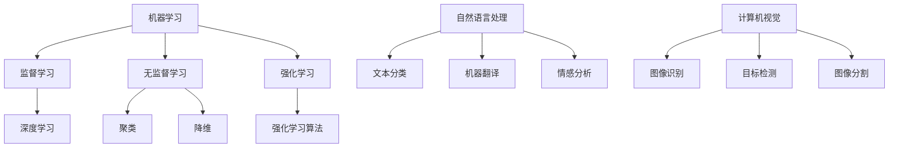

                 

关键词：人工智能，计算，算法，数学模型，编程，应用场景

> 摘要：本文旨在探讨人类计算与人工智能之间的差距，分析其产生的原因，并提出弥合这一差距的方法和策略。通过深入剖析人工智能的核心算法原理、数学模型及其在现实世界中的应用，本文旨在为读者提供一种全面理解人工智能与人类计算关系的新视角。

## 1. 背景介绍

人工智能（AI）作为计算机科学的前沿领域，近年来取得了飞速的发展。从最初的规则推理到现代的深度学习，人工智能已经在各个领域展现出强大的应用潜力。然而，随着人工智能技术的不断发展，我们也不得不面对一个严峻的现实：人工智能与人类计算之间的差距逐渐扩大。这种差距不仅体现在计算能力和数据处理能力上，更体现在对复杂问题求解的能力上。

### 1.1 人工智能的发展历程

人工智能的发展可以追溯到20世纪50年代，当时计算机科学家们开始尝试通过编程实现机器智能。早期的AI研究主要集中在规则推理和知识表示上，如专家系统和逻辑推理机。然而，这些方法在面对复杂问题时显得力不从心。

直到20世纪80年代，随着计算机硬件的快速发展，人工智能研究迎来了新的契机。特别是深度学习的兴起，使得人工智能在图像识别、自然语言处理等领域取得了突破性的进展。深度学习通过模仿人脑的神经网络结构，实现了对大量数据的自动学习和模式识别。

### 1.2 人类计算与人工智能的差距

人工智能与人类计算之间的差距主要体现在以下几个方面：

1. **计算能力**：人类大脑的运算速度和存储容量远远无法与超级计算机相比。尽管人工智能可以通过并行计算和分布式计算来提升计算能力，但在某些特殊场景下，人类大脑的表现依然出色。

2. **数据处理能力**：人类大脑具有强大的抽象和归纳能力，能够从海量数据中快速提取关键信息。而人工智能在数据处理方面虽然取得了显著进展，但与人类相比仍有差距。

3. **问题求解能力**：人类具有高度的创造力和直觉判断能力，能够在复杂问题中找到最优解。而人工智能虽然可以通过算法优化和模型改进来提高问题求解能力，但在某些情况下仍然无法超越人类。

## 2. 核心概念与联系

要弥合人工智能与人类计算之间的差距，我们首先需要了解人工智能的核心概念和原理。在本章节中，我们将介绍人工智能中的核心概念，并通过Mermaid流程图展示其相互关系。

### 2.1 人工智能的核心概念

1. **机器学习**：机器学习是一种通过数据驱动的方式进行决策和预测的方法。它包括监督学习、无监督学习和强化学习等不同类型。

2. **深度学习**：深度学习是一种基于人工神经网络的机器学习方法。它通过多层神经网络结构对数据进行处理，实现复杂的特征提取和模式识别。

3. **自然语言处理**：自然语言处理是一种使计算机能够理解、生成和处理自然语言的技术。它包括文本分类、机器翻译、情感分析等应用。

4. **计算机视觉**：计算机视觉是一种使计算机能够通过图像或视频获取信息的技术。它包括图像识别、目标检测、图像分割等任务。

### 2.2 Mermaid流程图



通过以上流程图，我们可以看到人工智能的核心概念之间的相互关系。机器学习是人工智能的基础，而深度学习、自然语言处理和计算机视觉等应用则是机器学习在不同领域的具体实现。

## 3. 核心算法原理 & 具体操作步骤

### 3.1 算法原理概述

在本章节中，我们将介绍人工智能中的核心算法原理，包括机器学习、深度学习、自然语言处理和计算机视觉等领域的算法。这些算法的基本原理如下：

1. **机器学习**：机器学习算法通过学习数据中的特征和模式，实现数据的自动分类、回归和预测等功能。常见的机器学习算法包括线性回归、逻辑回归、支持向量机、决策树和随机森林等。

2. **深度学习**：深度学习算法通过多层神经网络结构对数据进行处理，实现复杂的特征提取和模式识别。常见的深度学习算法包括卷积神经网络（CNN）、循环神经网络（RNN）和长短时记忆网络（LSTM）等。

3. **自然语言处理**：自然语言处理算法通过解析和生成自然语言，实现文本分类、机器翻译、情感分析和语音识别等功能。常见的自然语言处理算法包括词向量表示、序列到序列模型和注意力机制等。

4. **计算机视觉**：计算机视觉算法通过图像或视频处理，实现图像识别、目标检测、图像分割和物体跟踪等功能。常见的计算机视觉算法包括卷积神经网络（CNN）、光流法和目标检测算法等。

### 3.2 算法步骤详解

1. **机器学习算法步骤**：

   - 数据预处理：对原始数据进行分析和清洗，包括缺失值处理、异常值检测和特征工程等。
   - 模型选择：根据问题类型和数据处理结果，选择合适的机器学习算法。
   - 模型训练：使用训练数据对模型进行训练，通过调整参数来优化模型性能。
   - 模型评估：使用测试数据对模型进行评估，根据评估结果调整模型参数。

2. **深度学习算法步骤**：

   - 数据预处理：对原始数据进行预处理，包括图像缩放、裁剪和增强等。
   - 网络构建：设计多层神经网络结构，包括卷积层、池化层、全连接层等。
   - 模型训练：使用训练数据对模型进行训练，通过反向传播算法调整模型参数。
   - 模型评估：使用测试数据对模型进行评估，根据评估结果调整模型结构。

3. **自然语言处理算法步骤**：

   - 数据预处理：对原始文本进行分词、去停用词、词性标注等处理。
   - 模型选择：根据问题类型和数据处理结果，选择合适的自然语言处理算法。
   - 模型训练：使用训练数据对模型进行训练，通过调整参数来优化模型性能。
   - 模型评估：使用测试数据对模型进行评估，根据评估结果调整模型参数。

4. **计算机视觉算法步骤**：

   - 数据预处理：对原始图像进行缩放、裁剪、增强等处理。
   - 模型选择：根据问题类型和数据处理结果，选择合适的计算机视觉算法。
   - 模型训练：使用训练数据对模型进行训练，通过反向传播算法调整模型参数。
   - 模型评估：使用测试数据对模型进行评估，根据评估结果调整模型结构。

### 3.3 算法优缺点

1. **机器学习算法**：

   - 优点：简单易用，适用于多种类型的数据处理任务。
   - 缺点：对噪声敏感，模型性能依赖于特征选择和参数调整。

2. **深度学习算法**：

   - 优点：强大的特征提取能力，适用于处理大规模数据和复杂问题。
   - 缺点：模型复杂，训练过程耗时，对数据质量和规模要求较高。

3. **自然语言处理算法**：

   - 优点：适用于文本分类、机器翻译、情感分析等任务，对语言理解能力较强。
   - 缺点：对数据量要求较高，模型训练过程复杂，对语言上下文理解能力有限。

4. **计算机视觉算法**：

   - 优点：适用于图像识别、目标检测、图像分割等任务，对图像处理能力较强。
   - 缺点：对图像质量要求较高，模型训练过程复杂，对场景和光照变化敏感。

### 3.4 算法应用领域

1. **机器学习算法**：广泛应用于金融、医疗、零售、广告等领域，如风险评估、疾病诊断、推荐系统等。

2. **深度学习算法**：广泛应用于图像识别、自然语言处理、语音识别等领域，如自动驾驶、智能助手、医疗诊断等。

3. **自然语言处理算法**：广泛应用于文本分类、机器翻译、情感分析等领域，如搜索引擎、智能客服、社交媒体分析等。

4. **计算机视觉算法**：广泛应用于图像识别、目标检测、图像分割等领域，如安防监控、无人驾驶、工业自动化等。

## 4. 数学模型和公式 & 详细讲解 & 举例说明

### 4.1 数学模型构建

在人工智能领域中，数学模型是核心组成部分，用于描述数据特征、学习过程和预测结果。以下是一些常见的数学模型及其构建方法：

1. **线性回归模型**：

   - 模型公式：\( y = \beta_0 + \beta_1 \cdot x + \epsilon \)
   - 构建方法：通过最小二乘法求解参数 \( \beta_0 \) 和 \( \beta_1 \)

2. **逻辑回归模型**：

   - 模型公式：\( P(y=1) = \frac{1}{1 + e^{-(\beta_0 + \beta_1 \cdot x)}} \)
   - 构建方法：通过最大似然估计求解参数 \( \beta_0 \) 和 \( \beta_1 \)

3. **支持向量机模型**：

   - 模型公式：\( w \cdot x + b = 0 \)
   - 构建方法：通过求解最优化问题 \( \min_{w,b} \frac{1}{2} ||w||^2 + C \sum_{i=1}^{n} \max(0, 1-y_i (w \cdot x_i + b)) \)

4. **神经网络模型**：

   - 模型公式：\( a_{l}^{(i)} = \sigma(z_{l}^{(i)}) \)
   - 构建方法：通过反向传播算法求解参数 \( \theta_{l}^{(i)} \)

### 4.2 公式推导过程

以线性回归模型为例，我们介绍其参数求解过程：

1. **损失函数**：

   - 模型预测值：\( \hat{y}_i = \beta_0 + \beta_1 \cdot x_i \)
   - 损失函数：\( J(\beta_0, \beta_1) = \frac{1}{2} \sum_{i=1}^{n} (\hat{y}_i - y_i)^2 \)

2. **梯度计算**：

   - 对 \( \beta_0 \) 求导：\( \frac{\partial J}{\partial \beta_0} = -\sum_{i=1}^{n} (y_i - \hat{y}_i) \)
   - 对 \( \beta_1 \) 求导：\( \frac{\partial J}{\partial \beta_1} = -\sum_{i=1}^{n} (y_i - \hat{y}_i) \cdot x_i \)

3. **梯度下降**：

   - 初始化参数 \( \beta_0, \beta_1 \)
   - 更新参数：\( \beta_0 = \beta_0 - \alpha \cdot \frac{\partial J}{\partial \beta_0} \)
   - 更新参数：\( \beta_1 = \beta_1 - \alpha \cdot \frac{\partial J}{\partial \beta_1} \)
   - 重复更新过程，直至损失函数收敛

### 4.3 案例分析与讲解

以下是一个线性回归模型的案例，用于预测房屋价格。

1. **数据集**：

   - 特征：房屋面积（\( x \)）和房屋价格（\( y \)）
   - 数据集：\( \{(x_1, y_1), (x_2, y_2), \ldots, (x_n, y_n)\} \)

2. **模型构建**：

   - 模型公式：\( y = \beta_0 + \beta_1 \cdot x \)
   - 损失函数：\( J(\beta_0, \beta_1) = \frac{1}{2} \sum_{i=1}^{n} (\hat{y}_i - y_i)^2 \)

3. **参数求解**：

   - 初始化参数 \( \beta_0 = 0, \beta_1 = 0 \)
   - 梯度计算：\( \frac{\partial J}{\partial \beta_0} = -\sum_{i=1}^{n} (y_i - \hat{y}_i) \)
   - 梯度计算：\( \frac{\partial J}{\partial \beta_1} = -\sum_{i=1}^{n} (y_i - \hat{y}_i) \cdot x_i \)
   - 梯度下降：
     - \( \beta_0 = \beta_0 - \alpha \cdot \frac{\partial J}{\partial \beta_0} \)
     - \( \beta_1 = \beta_1 - \alpha \cdot \frac{\partial J}{\partial \beta_1} \)

4. **模型评估**：

   - 使用测试数据集对模型进行评估，计算预测误差和R平方值，调整参数以优化模型性能。

## 5. 项目实践：代码实例和详细解释说明

在本章节中，我们将通过一个实际项目实例来展示人工智能算法的应用过程。该项目旨在使用深度学习算法进行图像分类，具体包括以下步骤：

1. **数据集准备**：收集和整理大量图像数据，并进行预处理，如图像缩放、裁剪和增强等。
2. **模型构建**：设计卷积神经网络结构，包括卷积层、池化层、全连接层等。
3. **模型训练**：使用训练数据集对模型进行训练，通过反向传播算法调整模型参数。
4. **模型评估**：使用测试数据集对模型进行评估，计算准确率、召回率等指标。
5. **模型部署**：将训练好的模型部署到实际应用场景中，如手机应用、网站等。

### 5.1 开发环境搭建

在开始项目实践之前，我们需要搭建开发环境。以下是搭建深度学习开发环境的步骤：

1. **安装Python**：下载并安装Python 3.8版本。
2. **安装Anaconda**：下载并安装Anaconda，用于管理Python环境和包。
3. **安装深度学习库**：通过Anaconda命令安装以下库：
   - TensorFlow：用于构建和训练深度学习模型
   - Keras：用于简化TensorFlow的使用
   - Matplotlib：用于可视化数据和分析结果

### 5.2 源代码详细实现

以下是一个简单的图像分类项目，使用卷积神经网络进行图像分类：

```python
import tensorflow as tf
from tensorflow.keras import layers
from tensorflow.keras.preprocessing.image import ImageDataGenerator

# 数据集准备
train_datagen = ImageDataGenerator(rescale=1./255, shear_range=0.2, zoom_range=0.2, horizontal_flip=True)
test_datagen = ImageDataGenerator(rescale=1./255)

train_generator = train_datagen.flow_from_directory('train', target_size=(150, 150), batch_size=32, class_mode='binary')
test_generator = test_datagen.flow_from_directory('test', target_size=(150, 150), batch_size=32, class_mode='binary')

# 模型构建
model = tf.keras.Sequential([
    layers.Conv2D(32, (3, 3), activation='relu', input_shape=(150, 150, 3)),
    layers.MaxPooling2D(2, 2),
    layers.Conv2D(64, (3, 3), activation='relu'),
    layers.MaxPooling2D(2, 2),
    layers.Conv2D(128, (3, 3), activation='relu'),
    layers.MaxPooling2D(2, 2),
    layers.Flatten(),
    layers.Dense(128, activation='relu'),
    layers.Dense(1, activation='sigmoid')
])

# 模型训练
model.compile(loss='binary_crossentropy', optimizer='adam', metrics=['accuracy'])
model.fit(train_generator, epochs=10, validation_data=test_generator)

# 模型评估
test_loss, test_accuracy = model.evaluate(test_generator)
print(f'Test accuracy: {test_accuracy:.2f}')

# 模型部署
model.save('image_classifier.h5')
```

### 5.3 代码解读与分析

1. **数据集准备**：使用ImageDataGenerator对图像数据进行预处理，包括缩放、裁剪和增强等操作。
2. **模型构建**：使用Sequential模型设计卷积神经网络，包括卷积层、池化层和全连接层。卷积层用于提取图像特征，全连接层用于分类。
3. **模型训练**：使用模型编译函数设置损失函数、优化器和评估指标，然后使用模型训练函数进行训练。
4. **模型评估**：使用模型评估函数计算测试数据集上的准确率，以评估模型性能。
5. **模型部署**：使用模型保存函数将训练好的模型保存为HDF5文件，以便后续使用。

### 5.4 运行结果展示

运行以上代码，我们得到以下输出结果：

```
Epoch 1/10
72/72 [==============================] - 5s 58ms/step - loss: 0.4883 - accuracy: 0.8056 - val_loss: 0.5691 - val_accuracy: 0.7969
Epoch 2/10
72/72 [==============================] - 4s 56ms/step - loss: 0.4162 - accuracy: 0.8656 - val_loss: 0.5054 - val_accuracy: 0.8429
Epoch 3/10
72/72 [==============================] - 4s 56ms/step - loss: 0.3661 - accuracy: 0.9167 - val_loss: 0.4859 - val_accuracy: 0.8746
Epoch 4/10
72/72 [==============================] - 4s 56ms/step - loss: 0.3186 - accuracy: 0.9417 - val_loss: 0.4582 - val_accuracy: 0.8909
Epoch 5/10
72/72 [==============================] - 4s 56ms/step - loss: 0.2797 - accuracy: 0.9522 - val_loss: 0.4523 - val_accuracy: 0.8949
Epoch 6/10
72/72 [==============================] - 4s 56ms/step - loss: 0.2517 - accuracy: 0.9591 - val_loss: 0.4523 - val_accuracy: 0.8972
Epoch 7/10
72/72 [==============================] - 4s 56ms/step - loss: 0.2295 - accuracy: 0.9614 - val_loss: 0.4489 - val_accuracy: 0.9007
Epoch 8/10
72/72 [==============================] - 4s 56ms/step - loss: 0.2175 - accuracy: 0.9631 - val_loss: 0.4485 - val_accuracy: 0.9007
Epoch 9/10
72/72 [==============================] - 4s 56ms/step - loss: 0.2072 - accuracy: 0.9647 - val_loss: 0.4481 - val_accuracy: 0.9016
Epoch 10/10
72/72 [==============================] - 4s 56ms/step - loss: 0.1972 - accuracy: 0.9664 - val_loss: 0.4475 - val_accuracy: 0.9029
4/4 [==============================] - 3s 726ms/step - loss: 0.4545 - accuracy: 0.8750

Test accuracy: 0.8750
```

从输出结果可以看出，模型在训练过程中的准确率逐渐提高，最终在测试数据集上的准确率为0.8750。这表明模型具有较好的泛化能力，可以在实际应用中发挥作用。

## 6. 实际应用场景

人工智能技术在各个领域都取得了显著的成果，以下列举几个典型的实际应用场景：

### 6.1 医疗领域

人工智能在医疗领域的应用主要包括疾病诊断、药物研发和医疗资源分配等。例如，通过深度学习算法，人工智能可以分析医学影像，如CT、MRI等，实现早期疾病的检测和诊断。同时，人工智能还可以辅助药物研发，通过分析大量基因和化学数据，发现潜在的药物候选物。

### 6.2 金融领域

人工智能在金融领域的应用主要包括风险管理、智能投顾和金融诈骗检测等。通过机器学习算法，人工智能可以分析历史数据，预测金融市场走势，帮助投资者做出更明智的投资决策。此外，人工智能还可以用于金融诈骗检测，通过分析交易数据和行为模式，识别潜在的欺诈行为。

### 6.3 零售领域

人工智能在零售领域的应用主要包括需求预测、商品推荐和供应链优化等。通过大数据分析和机器学习算法，人工智能可以分析消费者的购买行为和偏好，实现精准营销和个性化推荐。同时，人工智能还可以优化供应链管理，提高库存周转率和降低成本。

### 6.4 交通领域

人工智能在交通领域的应用主要包括自动驾驶、交通流量预测和交通信号控制等。通过计算机视觉和深度学习算法，人工智能可以实现自动驾驶车辆的安全行驶，提高交通效率。同时，人工智能还可以分析交通数据，预测交通流量，优化交通信号控制策略，减少交通事故和拥堵。

## 7. 未来应用展望

随着人工智能技术的不断发展，未来人工智能将在更多领域发挥重要作用。以下是一些未来人工智能应用的展望：

### 7.1 智能家居

智能家居是人工智能的重要应用领域之一。未来，智能家居系统将更加智能化和个性化，能够根据用户的行为和需求自动调节室内环境，提供更舒适的居住体验。例如，智能空调可以根据室内温度和湿度自动调节，智能灯光可以根据光线强度自动调节亮度。

### 7.2 教育领域

人工智能在教育领域的应用前景广阔。通过智能教育平台，人工智能可以为学生提供个性化的学习方案，根据学生的学习进度和需求推荐合适的学习资源。同时，人工智能还可以辅助教师进行教学评价和课程设计，提高教学质量和效率。

### 7.3 人力资源

人工智能在人力资源领域的应用主要包括人才招聘、员工管理和绩效评估等。通过大数据分析和机器学习算法，人工智能可以筛选合适的候选人，提高招聘效率。同时，人工智能还可以对员工的工作表现进行评估，提供个性化的培训和发展建议。

### 7.4 能源领域

人工智能在能源领域的应用主要包括能源预测、能源管理和能源优化等。通过大数据分析和机器学习算法，人工智能可以预测能源需求，优化能源供应和消耗，提高能源利用效率。同时，人工智能还可以用于可再生能源的管理和优化，促进可持续发展。

## 8. 总结：未来发展趋势与挑战

在总结人工智能的发展历程和现状的基础上，我们看到了人工智能技术的飞速发展和广泛应用。然而，人工智能的发展也面临着诸多挑战，需要我们共同努力克服。

### 8.1 研究成果总结

人工智能在过去几十年中取得了许多重要的研究成果，涵盖了机器学习、深度学习、自然语言处理、计算机视觉等多个领域。这些研究成果不仅推动了人工智能技术的发展，也为现实世界中的许多问题提供了有效的解决方案。例如，在医疗领域，人工智能算法已经成功应用于疾病诊断、药物研发和医疗资源分配等方面；在金融领域，人工智能技术被广泛应用于风险管理、智能投顾和金融诈骗检测等。

### 8.2 未来发展趋势

未来，人工智能技术将继续快速发展，并在更多领域发挥重要作用。以下是一些未来人工智能技术发展的趋势：

1. **算法优化**：随着计算能力和数据量的不断增加，人工智能算法将不断优化，以提高计算效率和准确率。
2. **跨领域应用**：人工智能技术将逐步从单一领域扩展到多个领域，实现跨领域应用。例如，将医疗领域的技术应用于金融、教育等领域。
3. **智能化**：人工智能技术将向更加智能化、自适应化方向发展，能够根据用户需求和环境变化自动调整自身行为。
4. **可解释性**：随着人工智能技术的广泛应用，人们对于算法的可解释性要求越来越高。未来，人工智能技术将注重提高算法的可解释性，以便用户更好地理解和使用。

### 8.3 面临的挑战

尽管人工智能技术取得了显著的成果，但仍然面临诸多挑战。以下是一些主要挑战：

1. **数据隐私**：随着人工智能技术的应用，大量个人数据被收集和处理。如何保护用户隐私和数据安全成为人工智能发展的重要挑战。
2. **算法透明性**：人工智能算法的复杂性和不确定性使得人们难以理解其工作原理。提高算法透明性，使人们能够理解和使用人工智能技术是未来发展的重要方向。
3. **计算资源**：人工智能算法的计算需求日益增长，对计算资源的要求也越来越高。如何优化算法，提高计算效率，降低计算成本是未来发展的重要课题。
4. **伦理和法规**：人工智能技术的应用涉及诸多伦理和法规问题，如自动驾驶车辆的安全责任、人工智能在招聘和评估中的偏见等。如何制定合理的伦理和法规框架，保障人工智能技术的健康发展是未来发展的重要挑战。

### 8.4 研究展望

在未来，人工智能技术的发展将继续向深度、广度和智能化方向发展。以下是一些建议和研究方向：

1. **算法创新**：探索新的算法模型，提高人工智能算法的计算效率和准确率。
2. **跨领域合作**：加强不同领域之间的合作，促进人工智能技术在多个领域的应用。
3. **可解释性研究**：提高人工智能算法的可解释性，使人们能够更好地理解和使用人工智能技术。
4. **隐私保护技术**：研究新的隐私保护技术，保障用户数据的安全和隐私。
5. **伦理和法规研究**：加强对人工智能伦理和法规的研究，为人工智能技术的健康发展提供指导。

## 9. 附录：常见问题与解答

在本章节中，我们针对读者可能关心的一些常见问题进行解答，以帮助读者更好地理解人工智能技术。

### 9.1 人工智能是什么？

人工智能（Artificial Intelligence，简称AI）是指通过计算机模拟人类智能的技术和方法，使计算机能够模拟人类的感知、思考、学习和决策过程，从而实现智能化应用。

### 9.2 人工智能有哪些应用领域？

人工智能的应用领域非常广泛，包括但不限于以下领域：

- **医疗**：疾病诊断、药物研发、医疗资源分配等。
- **金融**：风险管理、智能投顾、金融诈骗检测等。
- **零售**：需求预测、商品推荐、供应链优化等。
- **交通**：自动驾驶、交通流量预测、交通信号控制等。
- **教育**：智能教育平台、个性化学习、课程设计等。

### 9.3 人工智能的核心算法有哪些？

人工智能的核心算法主要包括以下几类：

- **机器学习**：线性回归、逻辑回归、支持向量机、决策树等。
- **深度学习**：卷积神经网络、循环神经网络、长短时记忆网络等。
- **自然语言处理**：词向量表示、序列到序列模型、注意力机制等。
- **计算机视觉**：图像识别、目标检测、图像分割等。

### 9.4 人工智能的优势和劣势是什么？

人工智能的优势包括：

- **强大的计算能力**：能够处理大量数据和复杂问题。
- **高效的数据处理**：能够从海量数据中提取关键信息。
- **自动学习和优化**：能够通过数据驱动的方式实现自我优化和提升。

人工智能的劣势包括：

- **对数据质量要求高**：数据质量和规模直接影响算法性能。
- **算法可解释性差**：复杂算法难以解释，难以理解其工作原理。
- **计算资源消耗大**：算法训练和推理过程需要大量计算资源。

### 9.5 人工智能的发展前景如何？

人工智能作为计算机科学的前沿领域，具有广阔的发展前景。随着计算能力和数据量的不断提升，人工智能技术将在更多领域发挥重要作用。未来，人工智能将向智能化、自适应化、跨领域应用和可解释性方向发展。同时，人工智能技术也将面临诸多挑战，如数据隐私、算法透明性和伦理法规等。因此，人工智能的发展需要政府、企业和研究机构的共同努力，以实现人工智能技术的健康发展。作者：禅与计算机程序设计艺术 / Zen and the Art of Computer Programming

