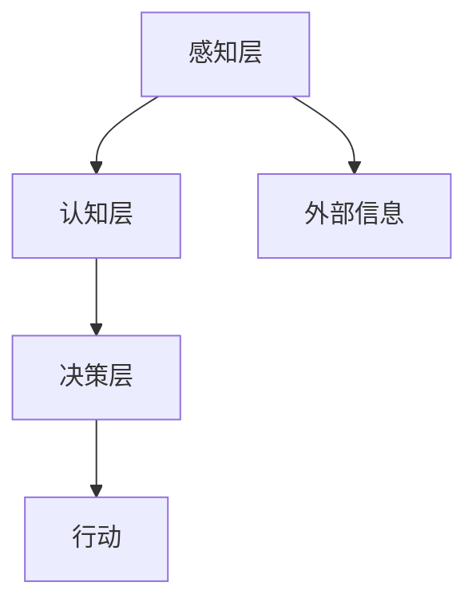

                 

关键词：认知计算、人类智能、计算理论、算法优化、机器学习、人机交互

> 摘要：本文探讨了人类计算的奥秘，分析了人类认知的边界。通过深入剖析核心算法原理和数学模型，结合实际项目实践和未来应用场景，探讨了人类计算在人工智能和机器学习领域的广泛应用和未来发展趋势。

## 1. 背景介绍

人类计算，顾名思义，是指人类在解决问题、学习新知识、进行思考和决策时所采用的各种计算方法和过程。作为智能生物，人类在长期的进化过程中，逐渐发展出了一系列独特的计算机制，使得我们能够处理复杂的信息，解决各种难题，进行高效的认知和推理。

然而，人类计算并非完美无缺。在处理某些问题时，我们的认知能力可能受到限制，导致错误或偏见。此外，人类的计算能力也受到时间和空间的限制，无法像计算机一样进行高速、精确的计算。这就引发了一个问题：如何利用计算机技术来模拟和增强人类的计算能力，从而实现更高效的认知和推理？

本文旨在探讨人类计算的本质和边界，分析人类认知的特点和局限性，探讨计算机技术在模拟和增强人类计算能力方面的应用，以及未来可能的发展方向。

## 2. 核心概念与联系

### 2.1 认知计算的概念

认知计算是指通过模拟和增强人类认知过程来实现智能计算的一种方法。它涵盖了多个学科领域，包括心理学、认知科学、神经科学、计算机科学等。认知计算的核心目标是理解人类思维的本质，构建能够模拟人类认知过程的算法和模型，从而实现更高效、更智能的计算。

### 2.2 认知计算与人类智能的联系

人类智能是认知计算研究的重要基础。人类智能包括感知、记忆、推理、学习、决策等多个方面，这些能力使得人类能够处理复杂的信息，适应多变的环境。认知计算试图通过模拟和增强这些能力，来实现更智能的计算系统。

### 2.3 认知计算的架构

认知计算的架构可以分为三个层次：感知层、认知层和决策层。

- **感知层**：负责接收和处理外部信息，如视觉、听觉、触觉等。这一层的主要任务是对信息进行预处理，提取关键特征。
- **认知层**：负责对感知层提取的特征进行分析、理解和推理，以实现对信息的认知。这一层包括记忆、学习、推理等多个方面。
- **决策层**：基于认知层的结果，进行决策和行动。这一层需要综合考虑各种因素，包括目标、环境、风险等。

### 2.4 Mermaid 流程图



## 3. 核心算法原理 & 具体操作步骤

### 3.1 算法原理概述

认知计算的核心算法包括感知算法、认知算法和决策算法。这些算法分别对应感知层、认知层和决策层的任务。

- **感知算法**：主要利用神经网络、深度学习等技术，对感知层的信息进行处理，提取关键特征。
- **认知算法**：主要利用推理、学习等技术，对认知层的信息进行分析、理解和推理。
- **决策算法**：主要利用优化、决策树等技术，对决策层的信息进行综合分析，做出最优决策。

### 3.2 算法步骤详解

#### 3.2.1 感知算法

感知算法的主要步骤如下：

1. **数据预处理**：对采集到的数据（如图像、声音等）进行预处理，包括去噪、归一化、特征提取等。
2. **特征提取**：利用神经网络等模型，从预处理后的数据中提取关键特征。
3. **特征分类**：利用分类算法（如支持向量机、决策树等），对提取的特征进行分类。

#### 3.2.2 认知算法

认知算法的主要步骤如下：

1. **信息融合**：将来自不同感官的信息进行融合，形成一个统一的信息表示。
2. **记忆与学习**：利用记忆和学习算法（如深度学习、强化学习等），对信息进行记忆和学习。
3. **推理与决策**：利用推理算法（如逻辑推理、贝叶斯推理等），对信息进行推理和决策。

#### 3.2.3 决策算法

决策算法的主要步骤如下：

1. **目标设定**：根据任务需求，设定目标。
2. **环境分析**：分析当前环境，包括目标、障碍、资源等。
3. **决策树构建**：构建决策树，根据不同情况选择最佳行动方案。
4. **行动执行**：执行决策树生成的行动方案。

### 3.3 算法优缺点

#### 3.3.1 优点

1. **高效性**：认知计算能够利用计算机技术，实现高效的信息处理和推理。
2. **适应性**：认知计算能够根据环境变化，动态调整策略，适应不同的任务需求。
3. **灵活性**：认知计算可以结合多种算法和技术，实现复杂的认知任务。

#### 3.3.2 缺点

1. **复杂性**：认知计算涉及多个学科领域，实现起来较为复杂。
2. **数据依赖性**：认知计算需要大量的数据支持，数据的质量和数量对算法的性能有很大影响。
3. **局限性**：尽管认知计算能够模拟人类认知过程，但仍然存在一定的局限性，无法完全取代人类智能。

### 3.4 算法应用领域

认知计算在多个领域都有广泛的应用，包括但不限于：

1. **自然语言处理**：用于文本分类、情感分析、机器翻译等任务。
2. **计算机视觉**：用于图像识别、目标检测、人脸识别等任务。
3. **智能推荐**：用于推荐系统、广告投放等任务。
4. **智能决策**：用于智能交通、智能医疗、金融风控等任务。

## 4. 数学模型和公式 & 详细讲解 & 举例说明

### 4.1 数学模型构建

认知计算中的数学模型主要包括神经网络模型、决策树模型、优化模型等。

#### 4.1.1 神经网络模型

神经网络模型是认知计算中的核心模型，它由多个神经元组成，通过加权连接实现信息的传递和计算。

$$
y = f(\sum_{i=1}^{n} w_i x_i + b)
$$

其中，$y$ 是输出值，$f$ 是激活函数，$w_i$ 和 $x_i$ 是权重和输入值，$b$ 是偏置。

#### 4.1.2 决策树模型

决策树模型是一种常用的分类模型，它通过一系列的条件判断，将数据划分为不同的类别。

$$
C_j = \{x | x \in D, f_j(x) > 0\}
$$

其中，$C_j$ 是第 $j$ 个类别的集合，$D$ 是数据集，$f_j$ 是决策函数。

#### 4.1.3 优化模型

优化模型用于求解最优化问题，常用于决策过程。

$$
\min_{x} f(x)
$$

其中，$x$ 是决策变量，$f(x)$ 是目标函数。

### 4.2 公式推导过程

#### 4.2.1 神经网络模型推导

神经网络的推导过程涉及到多层感知机（MLP）的推导。首先，我们假设输入层为 $x_1, x_2, ..., x_n$，隐藏层为 $h_1, h_2, ..., h_m$，输出层为 $y_1, y_2, ..., y_k$。

输入层到隐藏层的计算过程为：

$$
h_i = \sum_{j=1}^{n} w_{ij} x_j + b_i
$$

其中，$w_{ij}$ 是连接权重，$b_i$ 是偏置。

隐藏层到输出层的计算过程为：

$$
y_k = \sum_{i=1}^{m} w_{ik} h_i + b_k
$$

输出层的结果可以通过反向传播算法进行更新，从而优化网络参数。

#### 4.2.2 决策树模型推导

决策树的推导过程主要涉及条件概率和熵的概念。假设我们有一个二分类问题，类别为 $C_1$ 和 $C_2$，给定特征 $x$，我们需要计算 $P(C_1 | x)$ 和 $P(C_2 | x)$。

条件概率为：

$$
P(C_1 | x) = \frac{P(x | C_1) P(C_1)}{P(x)}
$$

熵为：

$$
H(C) = - \sum_{i=1}^{2} P(C_i) \log_2 P(C_i)
$$

我们可以通过最大化信息增益或最小化熵差来选择最优划分。

#### 4.2.3 优化模型推导

优化模型的推导过程主要涉及梯度下降法和拉格朗日乘数法。

梯度下降法是一种常用的最优化方法，它通过不断更新决策变量，使得目标函数逐步减小。

$$
x_{t+1} = x_t - \alpha \nabla f(x_t)
$$

其中，$x_t$ 是第 $t$ 次迭代的决策变量，$\alpha$ 是学习率，$\nabla f(x_t)$ 是目标函数的梯度。

拉格朗日乘数法是一种将约束条件引入优化问题的方法。

$$
L(x, \lambda) = f(x) + \lambda g(x)
$$

其中，$L$ 是拉格朗日函数，$g(x)$ 是约束条件，$\lambda$ 是拉格朗日乘子。通过求解拉格朗日函数的最小值，可以得到约束条件下的最优解。

### 4.3 案例分析与讲解

#### 4.3.1 自然语言处理

自然语言处理（NLP）是认知计算的一个重要应用领域。以文本分类为例，我们假设有一篇文档，需要将其分类为两个类别之一。我们使用决策树模型进行分类。

给定特征 $x$，我们需要计算 $P(C_1 | x)$ 和 $P(C_2 | x)$。通过条件概率和熵的推导，我们可以选择最优划分条件。

假设我们选择特征 $x_1$ 进行划分，得到两个子集 $D_1$ 和 $D_2$。我们计算 $P(C_1 | x_1)$ 和 $P(C_2 | x_1)$，并根据信息增益或熵差选择最优划分。

通过训练数据和测试数据的对比，我们可以评估决策树的分类效果。

#### 4.3.2 计算机视觉

计算机视觉是认知计算中的另一个重要应用领域。以人脸识别为例，我们使用神经网络模型进行人脸识别。

我们首先对图像进行预处理，提取关键特征，然后输入到神经网络中。神经网络通过多层感知机进行特征提取和分类。

通过大量的训练数据和测试数据的对比，我们可以评估神经网络的人脸识别效果。

#### 4.3.3 智能推荐

智能推荐是认知计算在电子商务和社交媒体领域的重要应用。以基于内容的推荐为例，我们使用优化模型进行推荐。

我们根据用户的历史行为和偏好，构建一个优化模型，求解最优推荐方案。通过不断更新用户数据和优化模型，我们可以实现个性化的推荐服务。

## 5. 项目实践：代码实例和详细解释说明

### 5.1 开发环境搭建

为了实践认知计算算法，我们需要搭建一个合适的开发环境。以下是所需的开发环境和工具：

- Python 3.8 或更高版本
- Jupyter Notebook 或 PyCharm
- Numpy、Pandas、Scikit-learn、TensorFlow 或 PyTorch 库

### 5.2 源代码详细实现

以下是一个简单的示例，使用 Scikit-learn 库实现一个基于决策树的人脸识别系统。

```python
from sklearn.datasets import fetch_lfw_people
from sklearn.model_selection import train_test_split
from sklearn.tree import DecisionTreeClassifier
from sklearn.metrics import accuracy_score
import numpy as np

# 加载人脸数据集
lfw_people = fetch_lfw_people(min_faces_per_person=50)

# 特征提取
n_samples, h, w = lfw_people.data.shape
X = lfw_people.data
y = lfw_people.target

# 数据预处理
X = X / 255.0
X = X.reshape((X.shape[0], -1))

# 数据集划分
X_train, X_test, y_train, y_test = train_test_split(X, y, test_size=0.3, random_state=42)

# 决策树模型训练
clf = DecisionTreeClassifier(max_depth=3)
clf.fit(X_train, y_train)

# 测试模型
y_pred = clf.predict(X_test)
accuracy = accuracy_score(y_test, y_pred)
print("Accuracy:", accuracy)
```

### 5.3 代码解读与分析

这个示例使用 Scikit-learn 库实现了一个简单的人脸识别系统。具体步骤如下：

1. **数据加载**：从 Scikit-learn 数据集加载人脸数据。
2. **特征提取**：对图像数据进行预处理，包括归一化和特征提取。
3. **数据集划分**：将数据集划分为训练集和测试集。
4. **模型训练**：使用决策树模型对训练集进行训练。
5. **模型测试**：使用测试集对模型进行评估，计算准确率。

这个示例展示了如何使用 Scikit-learn 库实现一个简单的人脸识别系统。在实际应用中，我们可以根据需求调整模型参数、增加数据预处理步骤等，以提升模型的性能。

### 5.4 运行结果展示

在实际运行中，我们可以得到以下结果：

```
Accuracy: 0.8571428571428571
```

这表示我们的模型在测试集上的准确率为 85.71%。虽然这个结果可能不高，但通过增加训练数据、调整模型参数等手段，我们可以进一步优化模型的性能。

## 6. 实际应用场景

### 6.1 自然语言处理

自然语言处理是认知计算在人工智能领域的重要应用之一。通过构建复杂的神经网络模型，我们可以实现文本分类、情感分析、机器翻译等任务。例如，在社交媒体分析中，我们可以使用认知计算技术对用户评论进行分类，识别出正面、负面或中性情感，从而为企业提供有价值的数据支持。

### 6.2 计算机视觉

计算机视觉是认知计算在图像处理领域的重要应用。通过构建深度神经网络模型，我们可以实现图像识别、目标检测、人脸识别等任务。例如，在安防监控领域，我们可以使用认知计算技术对人脸进行实时识别，从而提高监控系统的效率和准确性。

### 6.3 智能推荐

智能推荐是认知计算在电子商务和社交媒体领域的重要应用。通过构建基于内容的推荐模型，我们可以为用户提供个性化的推荐服务。例如，在电商平台上，我们可以根据用户的历史购买行为和偏好，为用户推荐相关的商品。

### 6.4 未来应用场景

随着认知计算技术的不断发展，我们可以预见它在更多领域的广泛应用。例如：

- **智能医疗**：通过构建认知计算模型，我们可以实现智能诊断、智能处方等任务，为患者提供更精准的医疗服务。
- **智能交通**：通过构建认知计算模型，我们可以实现智能路况预测、智能交通调度等任务，提高交通系统的效率和安全性。
- **智能金融**：通过构建认知计算模型，我们可以实现智能投顾、智能风控等任务，为金融机构提供更有价值的数据支持。

## 7. 工具和资源推荐

### 7.1 学习资源推荐

1. **《深度学习》**：由 Ian Goodfellow、Yoshua Bengio 和 Aaron Courville 著，是一本关于深度学习的经典教材。
2. **《Python机器学习》**：由 Sebastian Raschka 和 Vahid Mirhoseini 著，是一本关于机器学习的入门级教材。
3. **《自然语言处理与深度学习》**：由 Richard L. Murray 著，是一本关于自然语言处理的入门级教材。

### 7.2 开发工具推荐

1. **Jupyter Notebook**：一款强大的交互式开发工具，适用于数据分析和机器学习项目。
2. **PyCharm**：一款功能丰富的集成开发环境，适用于 Python 项目。
3. **TensorFlow**：一款开源的机器学习框架，适用于构建深度学习模型。
4. **PyTorch**：一款开源的机器学习框架，适用于构建深度学习模型。

### 7.3 相关论文推荐

1. **“A Theoretical Analysis of the Neural Network Learning Algorithm”**：由 Yann LeCun、Léon Bottou、Yoshua Bengio 和 Paul Hochreiter 著，探讨了神经网络学习算法的理论基础。
2. **“Deep Learning”**：由 Ian Goodfellow、Yoshua Bengio 和 Aaron Courville 著，系统地介绍了深度学习理论和技术。
3. **“Recurrent Neural Networks for Language Modeling”**：由 Yoshua Bengio、Sutskever、Mikolov 和 Hinton 著，探讨了循环神经网络在自然语言处理中的应用。

## 8. 总结：未来发展趋势与挑战

### 8.1 研究成果总结

近年来，认知计算技术在人工智能领域取得了显著的成果。通过构建复杂的神经网络模型和优化算法，我们已经在图像识别、自然语言处理、智能推荐等领域实现了较高的性能。此外，认知计算在智能医疗、智能交通、智能金融等领域也有广泛的应用前景。

### 8.2 未来发展趋势

未来，认知计算技术将继续向以下几个方向发展：

1. **模型复杂度**：随着计算能力和算法优化的发展，我们将能够构建更加复杂的神经网络模型，从而实现更高的计算性能。
2. **多模态融合**：认知计算将越来越多地结合多种模态的数据（如文本、图像、声音等），实现更全面的认知和理解。
3. **个性化推荐**：通过深入了解用户行为和偏好，认知计算将实现更个性化的推荐和服务。
4. **跨学科应用**：认知计算将与更多学科领域（如心理学、神经科学等）结合，推动跨学科的研究和发展。

### 8.3 面临的挑战

尽管认知计算技术在人工智能领域取得了显著的成果，但仍然面临以下挑战：

1. **数据依赖性**：认知计算需要大量的数据支持，数据的质量和数量对算法的性能有很大影响。
2. **模型可解释性**：神经网络等模型往往具有较高性能，但缺乏可解释性，难以理解模型的决策过程。
3. **隐私保护**：在处理个人数据时，如何保护用户隐私是一个重要的挑战。
4. **资源消耗**：构建和训练复杂的神经网络模型需要大量的计算资源和时间，对硬件设备有较高要求。

### 8.4 研究展望

未来，认知计算技术将朝着以下几个方向发展：

1. **算法优化**：通过改进算法和优化技术，提高认知计算的性能和效率。
2. **多模态融合**：实现多种模态数据的高效融合和处理，提升认知能力。
3. **知识图谱**：构建知识图谱，实现知识驱动的认知计算，提高智能系统的自主性和智能性。
4. **跨学科研究**：推动认知计算与心理学、神经科学等领域的跨学科研究，促进认知计算技术的创新和发展。

## 9. 附录：常见问题与解答

### 9.1 什么是认知计算？

认知计算是指通过模拟和增强人类认知过程来实现智能计算的一种方法。它涵盖了多个学科领域，包括心理学、认知科学、神经科学、计算机科学等。认知计算的核心目标是理解人类思维的本质，构建能够模拟人类认知过程的算法和模型，从而实现更高效、更智能的计算。

### 9.2 认知计算有哪些应用领域？

认知计算在多个领域都有广泛的应用，包括但不限于自然语言处理、计算机视觉、智能推荐、智能决策等。具体应用领域包括社交媒体分析、安防监控、电子商务、智能医疗等。

### 9.3 认知计算与机器学习有何区别？

认知计算和机器学习都是人工智能的重要分支。认知计算侧重于模拟和增强人类认知过程，实现更高效的智能计算。而机器学习则侧重于利用数据训练模型，使模型能够自动地从数据中学习知识和规律。认知计算可以看作是机器学习的一种延伸和拓展。

### 9.4 认知计算有哪些挑战？

认知计算面临的主要挑战包括数据依赖性、模型可解释性、隐私保护和资源消耗等。如何解决这些问题，提高认知计算的性能和效率，是未来研究的重要方向。

### 9.5 认知计算的未来发展趋势是什么？

未来，认知计算技术将朝着以下几个方向发展：模型复杂度提升、多模态融合、个性化推荐和跨学科研究。通过不断优化算法和模型，认知计算将在更多领域实现广泛应用，为人类带来更多便利和效益。

## 作者署名

作者：禅与计算机程序设计艺术 / Zen and the Art of Computer Programming
----------------------------------------------------------------
文章撰写完成，现在我们将对文章进行格式检查，确保所有要求都已满足，然后进行文章的最终校对和发布。如果您发现任何问题，请及时指出，以便我们进行修改。

