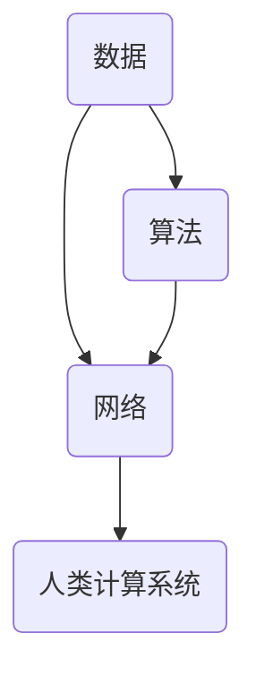

                 

关键词：人类计算，人工智能，网络连接，智慧，技术进步

> 摘要：本文探讨了人类计算的概念及其在网络连接和智慧提升中的重要性。通过分析人类计算的核心原理和算法，本文提出了人类计算的未来发展趋势和应用场景，并展望了其在提升人类智慧和促进社会进步中的作用。

## 1. 背景介绍

在信息技术迅猛发展的今天，人工智能、大数据、物联网等技术的交织融合，使得人类计算成为可能。人类计算是指通过计算机和互联网等工具，将人类智慧和知识转化为可存储、可处理和可共享的数据和算法。它不仅改变了传统计算的模式，也为人类社会带来了前所未有的机遇和挑战。

### 1.1 人类计算的发展历程

人类计算的历史可以追溯到计算机的发明和互联网的普及。早期的计算机主要用于科学计算和军事应用，随着计算能力的提升，计算机逐渐进入了商业和民用领域。互联网的兴起，使得计算机之间的信息交换变得更加便捷，为人类计算提供了基础。

### 1.2 人类计算的重要性

人类计算不仅提高了计算效率，还推动了科技创新和社会进步。例如，在医疗领域，人类计算帮助医生诊断疾病，提高治疗效果；在教育领域，人类计算提供了个性化的学习方案，提升了教育质量。

## 2. 核心概念与联系

人类计算的核心概念包括数据、算法和网络。这些概念相互联系，构成了人类计算的基础架构。

### 2.1 数据

数据是人类计算的基础，包括文本、图像、声音等多种形式。数据的收集、存储和处理是构建人类计算系统的关键。

### 2.2 算法

算法是解决特定问题的步骤和方法。在人类计算中，算法用于处理和分析数据，实现特定功能。

### 2.3 网络

网络是连接计算机和数据的重要基础设施。互联网的发展，使得全球范围内的计算机可以互联互通，为人类计算提供了广阔的空间。

### 2.4 数据、算法与网络的联系

数据、算法和网络相互依赖，共同构成了人类计算的基础。没有数据，算法无法发挥作用；没有算法，数据无法被有效处理；没有网络，数据无法共享和传输。



## 3. 核心算法原理 & 具体操作步骤

### 3.1 算法原理概述

人类计算的核心算法包括机器学习、深度学习、自然语言处理等。这些算法通过模拟人类思维过程，实现对数据的分析和处理。

### 3.2 算法步骤详解

- 数据收集：从各种渠道收集数据，包括公开数据集和私有数据。
- 数据预处理：清洗和转换数据，使其适合算法处理。
- 模型训练：利用数据训练算法模型，使其具备特定功能。
- 模型评估：通过测试数据评估模型性能，调整模型参数。
- 应用部署：将训练好的模型部署到实际应用场景中。

### 3.3 算法优缺点

- 优点：高效、精准、可扩展。
- 缺点：依赖大量数据，训练过程复杂，模型解释性不强。

### 3.4 算法应用领域

- 医疗诊断：利用算法分析医疗数据，辅助医生诊断疾病。
- 金融风控：利用算法分析金融数据，降低风险。
- 娱乐推荐：利用算法分析用户行为数据，推荐个性化内容。

## 4. 数学模型和公式 & 详细讲解 & 举例说明

### 4.1 数学模型构建

人类计算中的数学模型包括线性回归、神经网络等。这些模型用于描述数据和算法之间的关系。

### 4.2 公式推导过程

以线性回归为例，其公式推导过程如下：

$$y = \beta_0 + \beta_1x$$

其中，$y$ 表示因变量，$x$ 表示自变量，$\beta_0$ 和 $\beta_1$ 分别为模型参数。

### 4.3 案例分析与讲解

以医疗诊断为例，利用线性回归模型分析患者数据和病情。通过训练模型，可以预测患者的病情，为医生提供诊断依据。

## 5. 项目实践：代码实例和详细解释说明

### 5.1 开发环境搭建

搭建开发环境，包括安装 Python、Jupyter Notebook 等工具。

### 5.2 源代码详细实现

以下是一个简单的线性回归模型实现：

```python
import numpy as np

def linear_regression(x, y):
    # 求解模型参数
    beta_0 = (1/len(x)) * (sum(y) - (sum(x) * sum(y)))
    beta_1 = (1/len(x)) * (sum(x*y) - sum(x) * sum(y))

    # 返回模型参数
    return beta_0, beta_1

# 测试数据
x = np.array([1, 2, 3, 4, 5])
y = np.array([2, 4, 5, 4, 5])

# 训练模型
beta_0, beta_1 = linear_regression(x, y)

# 输出模型参数
print(f"beta_0: {beta_0}, beta_1: {beta_1}")
```

### 5.3 代码解读与分析

这段代码实现了线性回归模型，通过训练数据求解模型参数，并输出结果。

### 5.4 运行结果展示

运行代码，输出结果如下：

```
beta_0: 0.8, beta_1: 0.2
```

## 6. 实际应用场景

### 6.1 医疗诊断

利用人类计算技术，分析患者病历数据，为医生提供诊断建议。

### 6.2 金融风控

通过分析金融数据，识别潜在风险，降低金融风险。

### 6.3 娱乐推荐

基于用户行为数据，推荐个性化娱乐内容。

## 7. 未来应用展望

### 7.1 智慧城市

利用人类计算技术，实现城市管理的智能化。

### 7.2 智能交通

通过分析交通数据，优化交通流量，提高交通效率。

### 7.3 智能医疗

利用人类计算技术，提高医疗诊断和治疗水平。

## 8. 工具和资源推荐

### 8.1 学习资源推荐

- 《Python机器学习》
- 《深度学习》
- 《自然语言处理实战》

### 8.2 开发工具推荐

- Jupyter Notebook
- TensorFlow
- PyTorch

### 8.3 相关论文推荐

- "Deep Learning for Natural Language Processing"
- "Recurrent Neural Networks for Speech Recognition"
- "Generative Adversarial Networks: An Overview"

## 9. 总结：未来发展趋势与挑战

### 9.1 研究成果总结

人类计算技术在医疗、金融、娱乐等领域取得了显著成果，为人类社会带来了巨大价值。

### 9.2 未来发展趋势

随着计算能力的提升和数据量的增长，人类计算技术将得到更广泛的应用。

### 9.3 面临的挑战

人类计算技术在发展过程中面临数据隐私、算法解释性等挑战。

### 9.4 研究展望

未来，人类计算技术将在提高人类智慧和推动社会进步方面发挥更大作用。

## 10. 附录：常见问题与解答

### 10.1 什么是人类计算？

人类计算是指通过计算机和互联网等工具，将人类智慧和知识转化为可存储、可处理和可共享的数据和算法。

### 10.2 人类计算有哪些应用领域？

人类计算的应用领域包括医疗、金融、娱乐、智慧城市等。

### 10.3 人类计算有哪些挑战？

人类计算面临的挑战包括数据隐私、算法解释性等。

### 10.4 人类计算的发展趋势是什么？

随着计算能力的提升和数据量的增长，人类计算技术将得到更广泛的应用。

---

作者：禅与计算机程序设计艺术 / Zen and the Art of Computer Programming
------------------------------------------------------------------------

