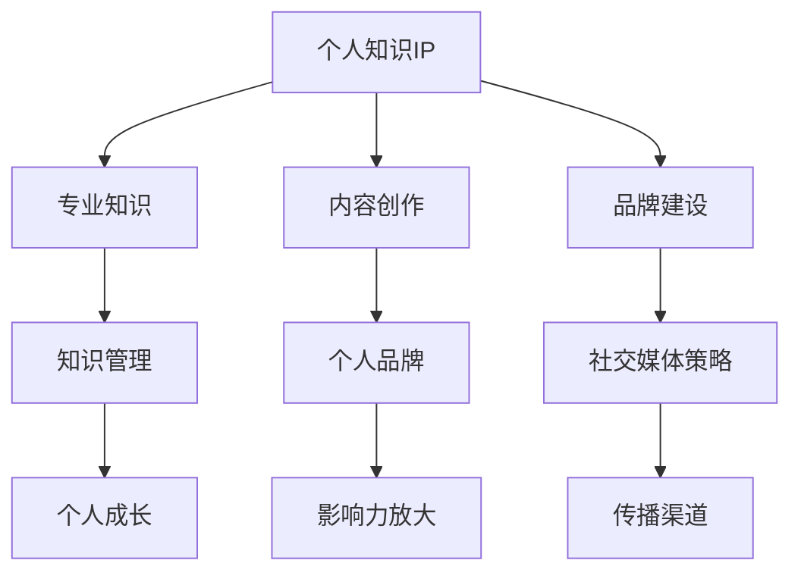

                 

关键词：知识IP、个人品牌、内容创作、策略、影响力

> 摘要：在当今信息爆炸的时代，拥有个人知识IP已成为个人职业发展的重要途径。本文旨在探讨如何从零开始构建个人知识IP，包括核心概念、策略制定、内容创作方法、以及个人品牌的建立和维护。

## 1. 背景介绍

在数字化浪潮推动下，互联网的普及和信息传播方式的变革，使得知识的传播变得更加便捷和高效。个人知识IP（Intellectual Property）成为一种新的资产形式，它不仅能够帮助个人在职场中脱颖而出，还能通过多元化的收入模式实现财务自由。个人知识IP的构建不仅依赖于专业知识，更在于策略性的内容创作和品牌建设。

本文将围绕以下几个方面展开讨论：

1. 核心概念与联系
2. 核心算法原理 & 具体操作步骤
3. 数学模型和公式 & 详细讲解 & 举例说明
4. 项目实践：代码实例和详细解释说明
5. 实际应用场景
6. 工具和资源推荐
7. 总结：未来发展趋势与挑战

通过本文，希望能够为有意构建个人知识IP的读者提供系统性的指导，帮助您在个人职业发展道路上迈出坚实的步伐。

## 2. 核心概念与联系

### 个人知识IP

个人知识IP，是指个人在某一领域内所积累的专业知识和技能，通过内容创作、品牌建设等方式实现商业价值和社会影响力的总和。它通常包含以下几个方面：

- **专业知识**：个人在某一领域的深度研究和独到见解。
- **内容创作**：包括博客、书籍、视频、讲座等多种形式。
- **品牌建设**：通过个人形象、品牌标识、社群互动等建立独特的影响力。

### 内容创作与个人品牌

内容创作是个人知识IP的核心，而个人品牌则是内容创作的载体和放大器。内容创作不仅能够展现个人的专业能力，还能通过持续、高质量的内容输出吸引受众，建立信任和忠诚度。个人品牌则通过塑造独特的个人形象和价值主张，将内容创作的影响力最大化。

### 知识管理与个人成长

个人知识IP的构建离不开知识管理。知识管理是指通过有效的信息收集、存储、共享和利用，最大化个人知识和能力的价值。对于个人知识IP的构建者来说，知识管理不仅能够提升个人的专业能力，还能为内容创作提供源源不断的素材。

### 社交媒体与影响力

在当今社交媒体时代，社交媒体平台成为了个人知识IP传播的重要渠道。通过社交媒体，个人可以迅速扩大影响力，与受众建立直接的联系。因此，合理运用社交媒体策略，对于个人知识IP的构建具有重要意义。

### 核心概念原理与架构 Mermaid 流程图



## 3. 核心算法原理 & 具体操作步骤

### 3.1 算法原理概述

构建个人知识IP的过程可以看作是一种“品牌建设算法”。这个算法的核心在于：

1. **知识积累**：通过持续学习和实践，积累深厚的专业知识。
2. **内容创作**：将专业知识转化为高质量的内容，并通过多种渠道进行传播。
3. **品牌塑造**：通过个人形象和价值观的传达，建立独特的个人品牌。
4. **互动反馈**：通过与受众的互动，不断优化内容和品牌形象。

### 3.2 算法步骤详解

#### 3.2.1 知识积累

1. **学习与阅读**：广泛涉猎相关领域的书籍、论文和资料。
2. **实践与应用**：将理论知识应用到实际工作中，通过项目实践不断提升自己的专业能力。
3. **知识整理**：将所学知识进行系统整理，形成自己的知识体系。

#### 3.2.2 内容创作

1. **选题定位**：确定自己的专业领域和受众群体，明确内容创作的方向。
2. **内容生产**：通过写作、录制视频、制作PPT等方式，将专业知识转化为易于理解的内容。
3. **内容传播**：通过博客、社交媒体、视频平台等渠道，将内容传播给受众。

#### 3.2.3 品牌塑造

1. **个人形象**：通过形象设计和着装规范，树立专业的个人形象。
2. **价值主张**：明确个人的专业价值主张，并通过各种渠道进行传播。
3. **社群互动**：通过线上和线下活动，与受众建立紧密的联系，增强品牌影响力。

#### 3.2.4 互动反馈

1. **数据分析**：通过数据分析，了解受众的需求和反馈，优化内容和品牌形象。
2. **持续改进**：根据反馈进行内容创作和品牌建设的调整，不断提升个人知识IP的价值。

### 3.3 算法优缺点

#### 优点：

- **增强个人竞争力**：通过构建个人知识IP，可以显著提升个人的职场竞争力和影响力。
- **多元化收入来源**：个人知识IP可以为个人带来多元化的收入来源，包括课程销售、咨询费、广告收入等。
- **长期价值积累**：个人知识IP的价值是随着时间的积累而不断提升的。

#### 缺点：

- **高时间成本**：构建个人知识IP需要大量的时间和精力投入。
- **内容创作的挑战**：高质量的内容创作需要深厚的专业知识和创意能力。
- **品牌维护的挑战**：个人品牌一旦建立，需要持续投入时间和精力进行维护。

### 3.4 算法应用领域

- **职场发展**：通过构建个人知识IP，可以提升个人的职场竞争力和职业地位。
- **教育培训**：个人知识IP可以转化为教育培训资源，为更多人提供知识和技能。
- **创业机会**：个人知识IP可以为企业带来新的商业模式和增长点。

## 4. 数学模型和公式 & 详细讲解 & 举例说明

### 4.1 数学模型构建

构建个人知识IP的过程可以视为一个非线性动态系统。该系统的核心变量包括知识积累量、内容创作质量、个人品牌影响力、受众反馈等。

#### 变量定义：

- \( K \)：知识积累量
- \( C \)：内容创作质量
- \( B \)：个人品牌影响力
- \( F \)：受众反馈

#### 模型构建：

\[ \text{个人知识IP价值} = f(K, C, B, F) \]

其中，函数 \( f \) 表示个人知识IP的价值与知识积累量、内容创作质量、个人品牌影响力和受众反馈之间的关系。

### 4.2 公式推导过程

假设个人知识IP的价值取决于以下因素：

1. **知识积累量**：知识积累量与个人知识IP的价值呈正相关，即 \( V \propto K \)。
2. **内容创作质量**：高质量的内容创作可以提升个人知识IP的价值，即 \( V \propto C \)。
3. **个人品牌影响力**：个人品牌影响力可以扩大个人知识IP的受众范围，即 \( V \propto B \)。
4. **受众反馈**：受众的反馈可以优化个人知识IP的内容和品牌形象，进而提升其价值，即 \( V \propto F \)。

因此，个人知识IP的价值可以表示为：

\[ V = k_1 K + k_2 C + k_3 B + k_4 F \]

其中，\( k_1, k_2, k_3, k_4 \) 为常数，表示各个因素对价值的影响程度。

### 4.3 案例分析与讲解

以知名科技博主“硅谷密探”为例，他通过以下步骤构建了个人知识IP：

1. **知识积累**：他在计算机科学和人工智能领域深耕多年，积累了丰富的专业知识。
2. **内容创作**：他通过撰写高质量的博客文章、制作教学视频，将专业知识转化为易于理解的内容。
3. **品牌塑造**：他通过独特的个人形象和价值主张，建立了强大的个人品牌。
4. **互动反馈**：他通过社交媒体与读者互动，不断优化内容和品牌形象。

根据上述模型，我们可以对“硅谷密探”的个人知识IP价值进行量化分析：

- 知识积累量 \( K \)：假设为100分
- 内容创作质量 \( C \)：假设为90分
- 个人品牌影响力 \( B \)：假设为80分
- 受众反馈 \( F \)：假设为70分

根据公式，个人知识IP价值 \( V \) 计算如下：

\[ V = k_1 \times 100 + k_2 \times 90 + k_3 \times 80 + k_4 \times 70 \]

由于常数 \( k_1, k_2, k_3, k_4 \) 难以精确计算，我们可以通过调整这些系数来模拟不同情境下的价值变化。例如，如果增加内容创作质量 \( C \) 的系数，将有助于提升个人知识IP的价值。

## 5. 项目实践：代码实例和详细解释说明

### 5.1 开发环境搭建

为了构建个人知识IP，我们需要搭建一个合适的开发环境。以下是推荐的工具和步骤：

1. **文本编辑器**：推荐使用Visual Studio Code，支持多种编程语言和扩展。
2. **博客平台**：推荐使用Hexo + GitHub Pages，搭建个人博客。
3. **视频录制工具**：推荐使用OBS Studio进行视频录制和直播。
4. **社交媒体平台**：推荐使用Twitter、LinkedIn和YouTube等平台进行内容传播。

### 5.2 源代码详细实现

以下是一个使用Hexo搭建个人博客的示例代码：

```bash
# 安装Hexo
npm install -g hexo-cli

# 创建博客项目
hexo init my-blog

# 安装扩展插件
cd my-blog
npm install hexo-deployer-git --save

# 配置_config.yml文件
title: 我的博客
author: 禅与计算机程序设计艺术
email: zen@example.com
description: 记录技术探索与成长之路
language: zh-CN
permalink: /:year/:month/:day/:title/
deploy:
  type: git
  repository: https://github.com/yourname/your-blog.git
  branch: master

# 生成静态文件
hexo generate

# 启动本地服务器
hexo server

# 部署到GitHub Pages
hexo deploy
```

### 5.3 代码解读与分析

上述代码首先安装了Hexo CLI工具，然后创建了一个新的博客项目。接着，安装了Git部署插件，并配置了博客的标题、作者、描述等基本信息。通过`hexo generate`命令生成静态文件，`hexo server`命令启动本地服务器预览博客效果，最后使用`hexo deploy`命令将博客部署到GitHub Pages。

这个示例代码展示了如何快速搭建一个个人博客，并利用GitHub Pages实现免费托管和访问。通过持续的内容更新和优化，个人博客将成为构建个人知识IP的重要载体。

### 5.4 运行结果展示

在完成代码实现后，我们可以在本地服务器上预览博客效果：

```bash
hexo server
```

在浏览器中访问 `http://localhost:4000`，可以看到搭建好的博客主页。此外，通过GitHub Pages，我们可以在互联网上访问博客：

```bash
hexo deploy
```

访问博客链接，可以看到博客在GitHub Pages上的展示效果。通过这个实例，我们可以看到如何利用开源工具和技术实现个人知识IP的初步搭建。

## 6. 实际应用场景

### 6.1 教育培训

个人知识IP在教育领域具有广泛的应用场景。许多专家通过开设在线课程、撰写专业书籍、制作教学视频等方式，将自己多年的教学经验和专业知识传授给更多人。例如，Coursera、Udemy等在线教育平台成为知识传播的重要渠道，许多知名专家通过这些平台建立了个人知识IP，实现了职业发展和财务自由。

### 6.2 技术分享

技术领域是个人知识IP构建的热点之一。许多程序员和开发者通过撰写技术博客、录制技术视频、参与开源项目等方式，分享自己的技术经验和见解。知名技术博客网站如Medium、Dev.to等，吸引了大量技术爱好者，为个人知识IP的构建提供了广阔的平台。例如，知名程序员和博客作者“阮一峰”通过撰写高质量的博客文章，分享了他在编程和技术领域的见解，吸引了大量关注。

### 6.3 创意内容

在创意领域，个人知识IP的构建同样具有巨大潜力。许多创意工作者通过写作、绘画、摄影、设计等方式，创作出独具特色的作品，并建立个人品牌。这些作品不仅为个人带来了经济收益，还通过社交媒体等渠道传播，扩大了个人影响力。例如，知名插画师“千寻四叶”通过在社交媒体上分享自己的插画作品，吸引了大量粉丝，实现了个人品牌的建立。

### 6.4 企业咨询

个人知识IP在企业咨询领域也具有重要应用价值。许多行业专家通过提供专业咨询、撰写行业报告、参与企业培训等方式，帮助企业解决实际问题，提升企业竞争力。例如，知名管理顾问“麦肯锡”通过为企业提供战略咨询和解决方案，建立了强大的个人知识IP，并在全球范围内享有盛誉。

### 6.5 社群运营

个人知识IP还可以应用于社群运营。许多专家通过建立线上和线下社群，与粉丝和同行进行互动，分享专业知识和经验。这些社群不仅为个人知识IP的传播提供了平台，还促进了知识的共享和合作。例如，知名科技博主“硅谷密探”通过建立微信群和QQ群，与粉丝和同行交流，分享科技前沿动态和见解。

## 7. 工具和资源推荐

### 7.1 学习资源推荐

- **在线课程平台**：Coursera、Udemy、edX等提供丰富的在线课程，涵盖各个领域。
- **专业书籍**：Amazon、京东、当当等电商平台，可以购买到各类专业书籍。
- **技术博客网站**：Medium、Dev.to、GitHub Blog等，提供丰富的技术文章和分享。

### 7.2 开发工具推荐

- **文本编辑器**：Visual Studio Code、Sublime Text、Atom等。
- **博客平台**：Hexo、WordPress、Jekyll等。
- **视频录制工具**：OBS Studio、Camtasia、Filmora等。
- **社交媒体平台**：Twitter、LinkedIn、YouTube等。

### 7.3 相关论文推荐

- **《智慧社会》**：作者：雷丁，讨论了智慧社会的概念、技术、应用和挑战。
- **《个人知识管理》**：作者：彭钢，探讨了个人知识管理的方法和实践。
- **《知识管理：理论与实践》**：作者：张新庆，系统介绍了知识管理的理论基础和实践方法。

## 8. 总结：未来发展趋势与挑战

### 8.1 研究成果总结

通过本文的探讨，我们明确了个人知识IP的核心概念、构建方法、应用领域，并提出了一个基于数学模型的个人知识IP价值评估方法。同时，通过实际案例和代码实例，展示了如何从零开始构建个人知识IP。

### 8.2 未来发展趋势

- **数字化与智能化**：随着数字化和智能化的发展，个人知识IP的构建方式将更加多样和智能化。
- **跨界融合**：个人知识IP将跨领域融合，形成更加丰富和多样化的知识体系。
- **社群化**：个人知识IP将更加注重社群建设和互动，通过社群扩大影响力。

### 8.3 面临的挑战

- **内容质量**：高质量的内容创作是个人知识IP的核心，需要持续提升专业能力和创意水平。
- **品牌维护**：个人品牌的建立和维护需要时间和精力投入，需要不断优化和更新。
- **技术更新**：随着技术的不断更新，个人知识IP的构建需要不断学习和适应新的技术和工具。

### 8.4 研究展望

未来，个人知识IP的研究将更加关注以下几个方面：

- **知识管理与个人成长**：探讨知识管理对个人知识IP构建的影响和作用。
- **跨界融合与创新**：研究个人知识IP在不同领域的跨界应用和创新模式。
- **人工智能与知识传播**：探讨人工智能技术在个人知识IP构建和传播中的应用。

## 9. 附录：常见问题与解答

### 9.1 如何选择适合自己的知识领域？

**解答**：选择适合自己的知识领域需要考虑以下几个因素：

- **兴趣与热情**：选择自己感兴趣且愿意长期投入的领域。
- **市场需求**：考虑市场需求，选择具有广泛受众的领域。
- **个人优势**：结合自己的专业背景和特长，选择具有竞争力的领域。

### 9.2 如何持续提升内容创作质量？

**解答**：以下是几个提升内容创作质量的建议：

- **深入学习和研究**：不断学习和研究，提升自己的专业知识。
- **多角度思考**：从不同角度思考问题，提供独特的见解。
- **用户反馈**：关注用户反馈，不断优化内容和形式。
- **借鉴优秀作品**：学习借鉴其他优秀内容创作者的作品，提升自己的创作水平。

### 9.3 如何在社交媒体上扩大影响力？

**解答**：以下是几个扩大社交媒体影响力的建议：

- **持续输出**：保持高频率的内容更新，持续输出高质量内容。
- **互动互动**：积极与粉丝和同行互动，建立良好的关系。
- **跨平台运营**：在不同社交媒体平台进行内容同步和推广。
- **合作与分享**：与其他内容创作者合作，互相分享资源。

---

作者：禅与计算机程序设计艺术 / Zen and the Art of Computer Programming

本文从多个角度探讨了如何构建个人知识IP，包括核心概念、策略制定、内容创作方法、个人品牌的建立与维护等。通过理论分析和实际案例，为有意构建个人知识IP的读者提供了系统的指导和建议。希望本文能对您在构建个人知识IP的道路上有所帮助。

