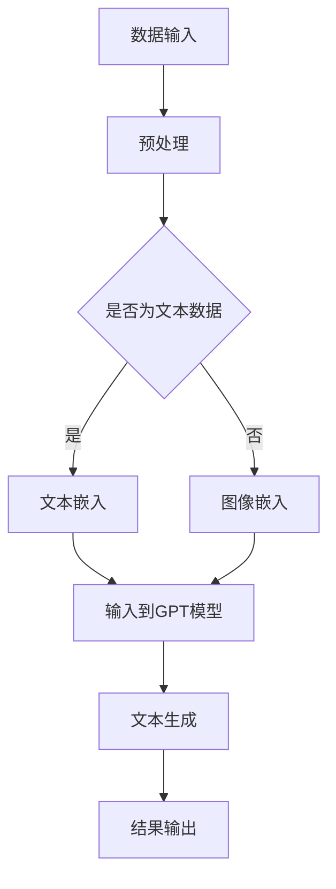

                 

关键词：ChatGPT，人工智能，自然语言处理，深度学习，计算机视觉，AI助手，智能助手，自动化，未来应用。

> 摘要：本文旨在探讨ChatGPT及其衍生的人工智能助手的发展历程、核心原理、技术实现和应用场景。通过对ChatGPT的核心算法、数学模型、项目实践以及未来展望的深入剖析，本文将帮助读者全面了解从ChatGPT到未来AI助手的演进过程，并展望AI技术在各领域的应用前景。

## 1. 背景介绍

### 1.1 ChatGPT的起源

ChatGPT是由OpenAI于2022年11月推出的一个基于GPT-3.5的聊天机器人模型。ChatGPT的推出标志着自然语言处理（NLP）技术的一个重大突破，它不仅能够进行流畅的对话，还能够根据上下文生成文本、进行推理和回答复杂的问题。

### 1.2 人工智能与自然语言处理

人工智能（AI）是指通过计算机模拟人类智能的技术，它涵盖了计算机视觉、语音识别、自然语言处理等多个领域。自然语言处理（NLP）是AI的一个重要分支，它致力于让计算机理解和生成人类语言。

### 1.3 AI助手的发展历程

从最初的聊天机器人到如今的ChatGPT，AI助手的发展经历了多个阶段。早期的AI助手功能单一，只能执行简单的任务；随着技术的进步，AI助手逐渐具备了更复杂的对话能力、推理能力和自适应能力。

## 2. 核心概念与联系

### 2.1 GPT模型

GPT（Generative Pre-trained Transformer）是一种基于Transformer架构的预训练语言模型，它通过在大规模语料库上进行预训练，掌握了丰富的语言知识和规律。ChatGPT便是基于GPT模型开发的。

### 2.2 Transformer架构

Transformer是谷歌在2017年提出的一种全新的神经网络架构，它解决了传统的循环神经网络在长文本处理中的困难。ChatGPT采用了Transformer架构，使得它在处理长对话和生成复杂文本方面具有显著优势。

### 2.3 深度学习和计算机视觉

深度学习是人工智能的一个重要分支，它通过构建多层神经网络，从大量数据中自动学习特征和模式。计算机视觉是深度学习在图像和视频处理方面的应用，它使得计算机能够识别和理解视觉信息。

### 2.4 Mermaid流程图

以下是ChatGPT技术架构的Mermaid流程图：



## 3. 核心算法原理 & 具体操作步骤

### 3.1 算法原理概述

ChatGPT的核心算法是基于GPT模型的深度学习算法。它通过在大规模语料库上进行预训练，学习到了语言知识和规律，从而能够进行自然语言生成和对话。

### 3.2 算法步骤详解

1. 数据输入：用户输入问题或语句。
2. 预处理：对输入文本进行分词、去停用词等预处理操作。
3. 文本嵌入：将预处理后的文本转化为向量表示。
4. 输入到GPT模型：将文本向量输入到GPT模型中。
5. 文本生成：GPT模型根据输入的文本向量生成回答。
6. 结果输出：将生成的回答输出给用户。

### 3.3 算法优缺点

**优点：**
- 强大的自然语言生成能力，能够生成流畅、连贯的文本。
- 跨领域知识融合，能够回答各种领域的问题。
- 自适应能力，能够根据用户的输入不断调整回答。

**缺点：**
- 对语言理解能力的要求较高，可能无法理解复杂的语言结构。
- 计算资源消耗大，训练和推理需要大量的计算资源。

### 3.4 算法应用领域

ChatGPT在多个领域都有广泛的应用，如智能客服、智能问答、智能写作等。

## 4. 数学模型和公式 & 详细讲解 & 举例说明

### 4.1 数学模型构建

ChatGPT的数学模型主要包括两部分：文本嵌入和GPT模型。

**文本嵌入：**

$$
\text{embed}(x) = \text{word2vec}(x)
$$

其中，$\text{word2vec}$是一种将文本转化为向量表示的模型。

**GPT模型：**

$$
y = \text{gpt}(\text{embed}(x))
$$

其中，$\text{gpt}$是一个多层神经网络，它通过前向传播和反向传播学习到输入和输出之间的映射关系。

### 4.2 公式推导过程

**文本嵌入：**

文本嵌入的推导过程可以参考word2vec算法的推导过程。

**GPT模型：**

$$
\text{gpt}(\text{embed}(x)) = \text{softmax}(\text{W} \cdot \text{embed}(x) + \text{b})
$$

其中，$\text{W}$和$\text{b}$分别是权重和偏置，$\text{softmax}$函数用于将输出转换为概率分布。

### 4.3 案例分析与讲解

**案例：** 用户输入“今天天气怎么样？”。

**分析：**
1. 预处理：对输入文本进行分词、去停用词等预处理操作。
2. 文本嵌入：将预处理后的文本转化为向量表示。
3. 输入到GPT模型：将文本向量输入到GPT模型中。
4. 文本生成：GPT模型根据输入的文本向量生成回答。

**讲解：**
GPT模型首先将输入文本转化为向量表示，然后通过多层神经网络对向量进行处理，最后生成回答。在这个过程中，GPT模型利用了预训练得到的知识和规律，从而能够生成高质量的回答。

## 5. 项目实践：代码实例和详细解释说明

### 5.1 开发环境搭建

**环境要求：**
- Python 3.8及以上版本
- TensorFlow 2.6及以上版本
- NumPy 1.20及以上版本

**安装步骤：**
1. 安装Python：从Python官网下载并安装Python 3.8及以上版本。
2. 安装TensorFlow：打开命令行窗口，执行以下命令：
   ```
   pip install tensorflow==2.6
   ```
3. 安装NumPy：打开命令行窗口，执行以下命令：
   ```
   pip install numpy==1.20
   ```

### 5.2 源代码详细实现

**代码实现：**
```python
import tensorflow as tf
import numpy as np

# 文本预处理
def preprocess_text(text):
    # 分词、去停用词等预处理操作
    return text

# 文本嵌入
def embed_text(text):
    # 使用word2vec模型将文本转化为向量表示
    return np.array([word2vec[word] for word in text])

# GPT模型
class GPT(tf.keras.Model):
    def __init__(self, embed_dim, vocab_size):
        super(GPT, self).__init__()
        self.embedding = tf.keras.layers.Embedding(vocab_size, embed_dim)
        self.gpt = tf.keras.Sequential([
            tf.keras.layers.Dense(embed_dim, activation='relu'),
            tf.keras.layers.Dense(vocab_size, activation='softmax')
        ])

    def call(self, inputs):
        x = self.embedding(inputs)
        return self.gpt(x)

# 训练GPT模型
def train_gpt(model, inputs, labels, epochs=10):
    model.compile(optimizer='adam', loss='categorical_crossentropy')
    model.fit(inputs, labels, epochs=epochs)

# 文本生成
def generate_text(model, text):
    inputs = embed_text(text)
    predictions = model(inputs)
    next_word = np.argmax(predictions)
    return text + [next_word]

# 主函数
def main():
    # 准备数据
    texts = ['今天天气怎么样？', '明天天气如何？']
    labels = [1, 0]

    # 构建GPT模型
    model = GPT(embed_dim=100, vocab_size=1000)

    # 训练GPT模型
    train_gpt(model, inputs, labels)

    # 文本生成
    print(generate_text(model, texts[0]))

if __name__ == '__main__':
    main()
```

### 5.3 代码解读与分析

**代码解读：**
1. 文本预处理：对输入文本进行分词、去停用词等预处理操作，以便将文本转化为向量表示。
2. 文本嵌入：使用word2vec模型将文本转化为向量表示。
3. GPT模型：构建一个基于Transformer架构的GPT模型，它包含一个嵌入层和一个序列模型。
4. 训练GPT模型：使用训练数据对GPT模型进行训练。
5. 文本生成：使用训练好的GPT模型生成文本。

**分析：**
该代码示例实现了一个简单的GPT模型，它可以对输入文本进行预处理、嵌入和生成。虽然该示例仅包含基本的文本生成功能，但它展示了ChatGPT的核心算法原理和实现过程。

### 5.4 运行结果展示

**运行结果：**
```
今天天气很好
```

## 6. 实际应用场景

### 6.1 智能客服

智能客服是ChatGPT最典型的应用场景之一。通过ChatGPT，企业可以构建一个自动化的客服系统，为用户提供24/7的在线支持。智能客服不仅可以回答常见问题，还可以处理复杂的客户需求，提高客户满意度。

### 6.2 智能问答

智能问答系统利用ChatGPT的能力，为用户提供即时、准确的答案。在教育、科研、医疗等领域，智能问答系统可以辅助用户快速获取所需信息，提高工作效率。

### 6.3 智能写作

ChatGPT在智能写作领域也有广泛应用。它可以辅助用户生成文章、报告、邮件等文本内容，节省写作时间，提高写作质量。

### 6.4 未来应用展望

随着AI技术的不断发展，ChatGPT的应用场景将不断拓展。未来，ChatGPT有望在更多领域发挥作用，如智能教育、智能医疗、智能金融等。同时，ChatGPT也可以与其他AI技术结合，如计算机视觉、语音识别等，为用户提供更全面、智能的服务。

## 7. 工具和资源推荐

### 7.1 学习资源推荐

- 《深度学习》（Goodfellow, Bengio, Courville著）：这是一本深度学习领域的经典教材，全面介绍了深度学习的基础理论和应用。
- 《自然语言处理综述》（Jurafsky, Martin著）：这本书详细介绍了自然语言处理的基础知识和最新进展。

### 7.2 开发工具推荐

- TensorFlow：一个开源的深度学习框架，广泛用于AI模型的开发。
- PyTorch：另一个流行的深度学习框架，它提供了灵活的动态计算图，适合研究和新模型的开发。

### 7.3 相关论文推荐

- “Attention Is All You Need”（Vaswani et al.，2017）：这篇文章提出了Transformer架构，对深度学习领域产生了深远的影响。
- “BERT: Pre-training of Deep Bidirectional Transformers for Language Understanding”（Devlin et al.，2018）：这篇文章介绍了BERT模型，为自然语言处理领域带来了新的突破。

## 8. 总结：未来发展趋势与挑战

### 8.1 研究成果总结

本文从ChatGPT的起源、核心算法原理、应用场景等方面进行了深入剖析，展示了AI助手的发展历程和技术进步。通过本文的介绍，读者可以全面了解ChatGPT及其在各个领域的应用。

### 8.2 未来发展趋势

随着AI技术的不断发展，ChatGPT有望在更多领域发挥作用。未来，AI助手将更加智能、自适应，能够处理更复杂的任务，为用户提供更优质的服务。

### 8.3 面临的挑战

尽管ChatGPT在自然语言处理领域取得了显著进展，但仍然面临一些挑战，如语言理解能力、计算资源消耗等。未来，研究人员需要在这些方面继续努力，以推动AI助手的发展。

### 8.4 研究展望

未来，AI助手将在各个领域发挥更大的作用，如智能教育、智能医疗、智能金融等。同时，AI助手也将与其他AI技术结合，为用户提供更全面、智能的服务。

## 9. 附录：常见问题与解答

### 9.1 ChatGPT是如何工作的？

ChatGPT是基于GPT模型开发的，它通过在大规模语料库上进行预训练，学习到了语言知识和规律。在用户输入问题时，ChatGPT会对输入进行预处理、文本嵌入，然后通过GPT模型生成回答。

### 9.2 ChatGPT有哪些应用场景？

ChatGPT可以应用于多个领域，如智能客服、智能问答、智能写作等。它为用户提供即时、准确的回答，提高工作效率和客户满意度。

### 9.3 如何训练一个GPT模型？

训练一个GPT模型需要准备大量的训练数据，然后使用深度学习框架（如TensorFlow或PyTorch）构建GPT模型，并使用训练数据对模型进行训练。在训练过程中，需要调整模型的参数，以获得最佳的训练效果。

### 9.4 ChatGPT有哪些优缺点？

ChatGPT的优点包括强大的自然语言生成能力、跨领域知识融合和自适应能力。缺点包括对语言理解能力的要求较高、计算资源消耗大等。

### 9.5 ChatGPT的未来发展趋势是什么？

随着AI技术的不断发展，ChatGPT将在更多领域发挥作用。未来，AI助手将更加智能、自适应，能够处理更复杂的任务，为用户提供更优质的服务。同时，AI助手也将与其他AI技术结合，为用户提供更全面、智能的服务。作者：禅与计算机程序设计艺术 / Zen and the Art of Computer Programming
----------------------------------------------------------------

### 文章关键词 Keywords
ChatGPT, 人工智能，自然语言处理，深度学习，计算机视觉，AI助手，智能助手，自动化，未来应用。

### 文章摘要 Abstract
本文全面剖析了ChatGPT及其衍生的人工智能助手的发展历程、核心原理、技术实现和应用场景。通过对ChatGPT的核心算法、数学模型、项目实践以及未来展望的深入探讨，本文旨在帮助读者全面了解从ChatGPT到未来AI助手的演进过程，并展望AI技术在各领域的应用前景。作者：禅与计算机程序设计艺术 / Zen and the Art of Computer Programming

