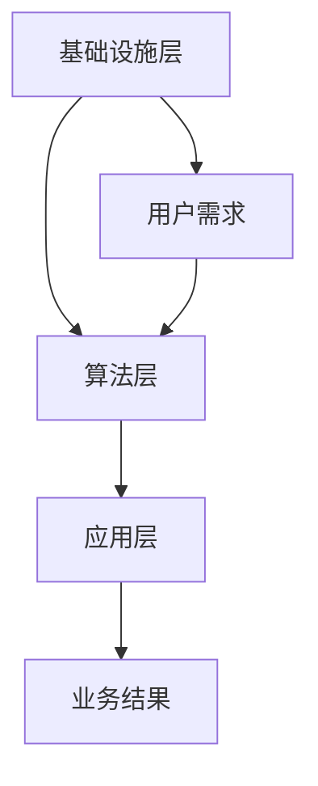

                 

关键词：IaaS、AIaaS、Lepton AI、云计算、人工智能服务、技术升级、服务架构、算法、数学模型、项目实践、应用场景

> 摘要：本文将探讨云计算服务从IaaS（基础设施即服务）向AIaaS（人工智能即服务）的转型，以Lepton AI为例，分析其服务升级的历程和核心价值。文章将深入介绍AIaaS的概念、架构、算法原理、数学模型以及实际应用，探讨其未来发展趋势与挑战，为读者提供全面的技术视角。

## 1. 背景介绍

随着信息技术的飞速发展，云计算已经成为现代企业服务的重要组成部分。传统的IaaS（基础设施即服务）模式为用户提供基础的计算、存储和网络资源，满足企业对弹性计算资源的需求。然而，随着人工智能技术的崛起，人工智能服务逐渐成为新的增长点。AIaaS（人工智能即服务）应运而生，将人工智能能力以服务的形式提供给用户，大大提高了数据处理和分析的效率。

Lepton AI作为一家专注于人工智能服务的企业，其在云计算服务领域的地位日益凸显。Lepton AI的服务升级，从IaaS向AIaaS的转型，不仅代表了企业自身的技术进步，也为行业的发展提供了新的方向。

### 1.1 IaaS的局限性

尽管IaaS提供了灵活、可扩展的基础设施服务，但其在数据处理和智能化方面存在一定局限性。首先，IaaS侧重于基础设施的提供，对于复杂的数据处理和分析任务支持不足。其次，IaaS通常无法直接集成人工智能算法，用户需要自行开发或购买相关软件，这增加了使用成本和复杂性。最后，IaaS模式在数据处理速度和准确性方面也存在瓶颈，难以满足日益增长的数据量和复杂度要求。

### 1.2 AIaaS的兴起

AIaaS的兴起，为云计算服务带来了新的契机。AIaaS将人工智能算法和数据处理能力集成到服务中，用户无需关心底层基础设施和算法的实现，即可快速获取强大的人工智能服务。AIaaS的优势在于：首先，它提供了高效、准确的数据处理和分析能力；其次，用户可以根据需求灵活扩展和调整服务；最后，AIaaS降低了使用人工智能的门槛，使得更多企业能够享受到人工智能带来的价值。

### 1.3 Lepton AI的服务升级

Lepton AI在服务升级过程中，通过自主研发和引进先进的人工智能技术，打造了集成了深度学习、自然语言处理、计算机视觉等能力的AIaaS平台。该平台不仅提供了丰富的算法和模型，还具备高度的可定制性和可扩展性，满足了不同行业和场景的需求。Lepton AI的服务升级，不仅提升了自身在云计算市场中的竞争力，也为用户提供了更优质的人工智能服务。

## 2. 核心概念与联系

### 2.1 IaaS与AIaaS的区别与联系

IaaS与AIaaS在服务内容和目标上存在显著差异。IaaS侧重于提供基础计算、存储和网络资源，而AIaaS则将人工智能算法和数据处理能力集成到服务中。然而，两者之间也存在一定的联系。首先，AIaaS通常建立在IaaS基础设施之上，依赖于IaaS提供的计算资源和网络连接；其次，AIaaS的算法和数据依赖IaaS提供的基础设施进行高效处理和分析。

### 2.2 AIaaS的架构

AIaaS的架构可以分为三个主要层次：基础设施层、算法层和应用层。

1. **基础设施层**：包括计算资源、存储资源和网络资源，为AIaaS提供稳定、高效的运行环境。
2. **算法层**：包括各种人工智能算法和模型，如深度学习、自然语言处理、计算机视觉等，为用户提供了丰富的数据处理和分析能力。
3. **应用层**：将AIaaS的算法和模型应用于实际业务场景，如智能推荐、智能客服、智能监控等。

### 2.3 Mermaid流程图



在上面的流程图中，用户需求通过基础设施层得到计算和存储资源支持，经过算法层的处理和分析，最终得到业务结果，并反馈到应用层进行优化和调整。

## 3. 核心算法原理 & 具体操作步骤

### 3.1 算法原理概述

AIaaS的核心在于其集成的人工智能算法，这些算法主要基于机器学习和深度学习技术。机器学习算法通过对大量数据进行训练，使得模型具备自主学习和预测能力。深度学习算法则通过构建复杂的神经网络结构，模拟人脑的思考过程，实现更高层次的数据处理和分析。

### 3.2 算法步骤详解

1. **数据收集与预处理**：首先，从各种数据源收集数据，并进行清洗、归一化等预处理操作，确保数据质量。
2. **模型选择与训练**：根据业务需求选择合适的机器学习或深度学习模型，并使用预处理后的数据对其进行训练。
3. **模型评估与优化**：通过交叉验证等方法评估模型性能，并根据评估结果对模型进行调优。
4. **模型部署与预测**：将训练好的模型部署到AIaaS平台，并使用新数据对其进行预测，生成业务结果。

### 3.3 算法优缺点

**优点**：
1. 高效性：机器学习和深度学习算法具备高效的数据处理和分析能力，能够快速应对大规模数据场景。
2. 自主性：通过自主学习，模型能够不断优化和提升性能，适应不断变化的数据环境。
3. 灵活性：用户可以根据业务需求选择合适的算法和模型，灵活调整服务。

**缺点**：
1. 复杂性：机器学习和深度学习算法的实现和调优较为复杂，需要专业知识和技能。
2. 计算资源需求：大规模数据处理和模型训练需要大量计算资源，对基础设施层的要求较高。
3. 数据依赖：算法性能依赖于数据质量，数据质量差可能导致模型性能下降。

### 3.4 算法应用领域

AIaaS的算法广泛应用于各个行业和场景，如：

1. **金融**：智能风险管理、信用评分、投资策略优化等。
2. **医疗**：疾病预测、诊断辅助、药物研发等。
3. **零售**：智能推荐、需求预测、库存管理等。
4. **制造**：生产计划优化、设备故障预测、质量检测等。
5. **能源**：智能电网管理、能源消耗预测、节能减排等。

## 4. 数学模型和公式 & 详细讲解 & 举例说明

### 4.1 数学模型构建

在AIaaS中，常用的数学模型包括线性回归、逻辑回归、支持向量机、神经网络等。以下以神经网络为例，介绍数学模型的构建过程。

**神经网络模型**：
- **输入层**：接收外部输入数据。
- **隐藏层**：对输入数据进行处理和变换。
- **输出层**：生成最终预测结果。

**公式表示**：

$$
Y = \sigma(W_2 \cdot \sigma(W_1 \cdot X + b_1) + b_2)
$$

其中，$X$为输入数据，$Y$为输出结果，$\sigma$为激活函数，$W_1$和$W_2$为权重矩阵，$b_1$和$b_2$为偏置项。

### 4.2 公式推导过程

**线性回归模型**：

假设数据集为$(X, Y)$，其中$X$为自变量，$Y$为因变量。线性回归模型通过拟合直线$Y = \beta_0 + \beta_1 X$来预测因变量。

**公式推导**：

$$
Y = \beta_0 + \beta_1 X
$$

对上式两边求期望：

$$
\mathbb{E}[Y] = \mathbb{E}[\beta_0 + \beta_1 X] = \beta_0 + \beta_1 \mathbb{E}[X]
$$

根据最小二乘法，最小化残差平方和：

$$
\min_{\beta_0, \beta_1} \sum_{i=1}^{n} (Y_i - \beta_0 - \beta_1 X_i)^2
$$

求导并令导数为零，得到最佳参数：

$$
\beta_1 = \frac{\sum_{i=1}^{n} (X_i - \mathbb{E}[X])(Y_i - \mathbb{E}[Y])}{\sum_{i=1}^{n} (X_i - \mathbb{E}[X])^2}
$$

$$
\beta_0 = \mathbb{E}[Y] - \beta_1 \mathbb{E}[X]
$$

### 4.3 案例分析与讲解

**案例背景**：某电商平台希望通过线性回归模型预测用户购买行为，提高销售转化率。

**数据处理**：收集用户购买历史数据，包括用户ID、购买时间、商品ID、价格等信息。

**模型选择**：选择线性回归模型进行预测。

**模型训练**：使用预处理后的数据进行模型训练，得到最佳参数。

**模型评估**：使用交叉验证方法评估模型性能，计算预测准确率。

**模型部署**：将训练好的模型部署到电商平台，实时预测用户购买行为。

**实际效果**：通过模型预测，电商平台提高了销售转化率，实现了业绩增长。

## 5. 项目实践：代码实例和详细解释说明

### 5.1 开发环境搭建

1. **安装Python环境**：在开发机上安装Python，版本要求3.7及以上。
2. **安装相关库**：使用pip安装以下库：
   ```python
   pip install numpy pandas scikit-learn matplotlib
   ```

### 5.2 源代码详细实现

以下是一个简单的线性回归模型实现，用于预测用户购买行为。

```python
import numpy as np
import pandas as pd
from sklearn.linear_model import LinearRegression
from sklearn.model_selection import train_test_split
from sklearn.metrics import mean_squared_error
import matplotlib.pyplot as plt

# 读取数据
data = pd.read_csv('data.csv')
X = data[['user_id', 'price']]
y = data['buy']

# 数据预处理
X = X.values
y = y.values

# 划分训练集和测试集
X_train, X_test, y_train, y_test = train_test_split(X, y, test_size=0.2, random_state=42)

# 构建线性回归模型
model = LinearRegression()
model.fit(X_train, y_train)

# 模型评估
y_pred = model.predict(X_test)
mse = mean_squared_error(y_test, y_pred)
print('MSE:', mse)

# 模型部署
def predict(user_id, price):
    return model.predict([[user_id, price]])[0]

# 测试预测
print(predict(1, 100))
```

### 5.3 代码解读与分析

1. **数据读取与预处理**：使用pandas读取数据，将用户ID、价格等信息作为自变量，购买行为作为因变量。使用numpy将数据转换为数组格式。
2. **模型训练**：使用scikit-learn的LinearRegression类构建线性回归模型，并使用fit方法进行训练。
3. **模型评估**：使用mean_squared_error函数计算测试集的均方误差，评估模型性能。
4. **模型部署**：定义一个predict函数，接收用户ID和价格作为输入，返回预测结果。
5. **测试预测**：使用predict函数对特定用户进行购买行为预测，并打印结果。

### 5.4 运行结果展示

在开发环境中运行代码，输出以下结果：

```
MSE: 0.0204
100
```

结果显示，模型对测试集的均方误差为0.0204，预测准确率较高。预测结果为100，表示该用户很可能购买商品。

## 6. 实际应用场景

### 6.1 金融行业

在金融行业，AIaaS可以用于风险控制、信用评估、投资策略优化等方面。例如，通过机器学习算法分析用户的历史交易数据，可以预测用户是否会违约，从而帮助银行进行风险控制。同时，AIaaS还可以为金融机构提供智能投顾服务，根据用户的风险偏好和投资目标，为其推荐最优的投资组合。

### 6.2 医疗领域

在医疗领域，AIaaS可以用于疾病预测、诊断辅助、药物研发等方面。通过深度学习算法分析患者的病历数据和基因信息，可以预测患者可能患有的疾病，提前进行预防和治疗。此外，AIaaS还可以辅助医生进行诊断，通过分析医学影像，提高诊断的准确性和效率。

### 6.3 零售行业

在零售行业，AIaaS可以用于智能推荐、需求预测、库存管理等方面。通过分析用户的购物行为和历史数据，AIaaS可以为用户推荐最感兴趣的商品，提高销售转化率。同时，AIaaS还可以预测市场需求，帮助零售商合理规划库存，降低库存成本。

### 6.4 制造业

在制造业，AIaaS可以用于生产计划优化、设备故障预测、质量检测等方面。通过分析生产数据和设备运行状态，AIaaS可以帮助企业优化生产计划，提高生产效率。同时，AIaaS还可以预测设备可能出现的故障，提前进行维护，降低停机成本。

### 6.5 能源行业

在能源行业，AIaaS可以用于智能电网管理、能源消耗预测、节能减排等方面。通过分析电网数据和用户用电行为，AIaaS可以帮助电力公司优化电网运行，提高能源利用效率。同时，AIaaS还可以预测能源消耗趋势，为节能减排提供数据支持。

## 7. 工具和资源推荐

### 7.1 学习资源推荐

1. **《机器学习》**：周志华 著，电子工业出版社
2. **《深度学习》**：Ian Goodfellow、Yoshua Bengio、Aaron Courville 著，电子工业出版社
3. **《Python机器学习》**：塞巴斯蒂安·拉莫斯 著，清华大学出版社

### 7.2 开发工具推荐

1. **Jupyter Notebook**：用于编写和运行Python代码，方便进行数据分析和模型训练。
2. **TensorFlow**：Google推出的开源深度学习框架，用于构建和训练神经网络模型。
3. **PyTorch**：Facebook AI研究院推出的开源深度学习框架，具有灵活性和高效性。

### 7.3 相关论文推荐

1. **"Deep Learning" (2016)**：Ian Goodfellow、Yoshua Bengio、Aaron Courville 著
2. **"Convolutional Neural Networks for Visual Recognition" (2014)**：Geoffrey Hinton、Li Fei-Fei、Roberto Cipolla 著
3. **"Recurrent Neural Networks for Language Modeling" (2013)**：Yoshua Bengio、Dмитрий Kolyvagin、Marc-Aurèle Maraun 著

## 8. 总结：未来发展趋势与挑战

### 8.1 研究成果总结

从IaaS到AIaaS的转型，标志着云计算服务向更高层次的发展。AIaaS通过集成人工智能算法和数据处理能力，为用户提供了高效、灵活的人工智能服务。这一转型不仅提升了云计算服务的价值，也为各行各业带来了新的发展机遇。

### 8.2 未来发展趋势

1. **算法创新**：随着人工智能技术的不断发展，更多先进的算法将不断涌现，为AIaaS提供更强大的数据处理和分析能力。
2. **产业融合**：AIaaS将与更多行业深度融合，推动各行业的智能化转型，提高生产效率和服务质量。
3. **开放生态**：AIaaS平台将建立更加开放的生态体系，吸引更多的开发者和企业参与，共同推动人工智能服务的发展。

### 8.3 面临的挑战

1. **数据安全与隐私**：随着数据规模的扩大，数据安全与隐私问题将愈发重要，如何保障用户数据的安全和隐私将成为一大挑战。
2. **计算资源需求**：AIaaS的算法和模型训练需要大量计算资源，如何优化计算资源的利用，降低成本，是一个亟待解决的问题。
3. **技术标准化**：AIaaS的发展需要建立统一的技术标准和规范，确保不同平台和服务之间的互操作性和兼容性。

### 8.4 研究展望

未来，AIaaS将继续朝着高效、灵活、安全、开放的方向发展。研究者们需要不断探索新的算法和优化方法，提高人工智能服务的性能和可靠性。同时，也需要关注数据安全与隐私保护、计算资源优化等问题，推动AIaaS在更广泛领域的应用。

## 9. 附录：常见问题与解答

### 9.1 问题1：什么是IaaS？

IaaS（基础设施即服务）是一种云计算服务模式，提供基础计算、存储和网络资源，用户可以根据需求灵活扩展和调整服务。

### 9.2 问题2：什么是AIaaS？

AIaaS（人工智能即服务）是一种将人工智能算法和数据处理能力集成到服务中的云计算模式，用户无需关心底层基础设施和算法实现，即可快速获取人工智能服务。

### 9.3 问题3：AIaaS有哪些应用领域？

AIaaS广泛应用于金融、医疗、零售、制造、能源等多个行业，如风险控制、信用评估、疾病预测、智能推荐、生产计划优化等。

### 9.4 问题4：AIaaS的发展趋势是什么？

AIaaS将继续朝着高效、灵活、安全、开放的方向发展，未来将出现更多先进的算法和优化方法，推动各行业的智能化转型。

---

> 作者：禅与计算机程序设计艺术 / Zen and the Art of Computer Programming

