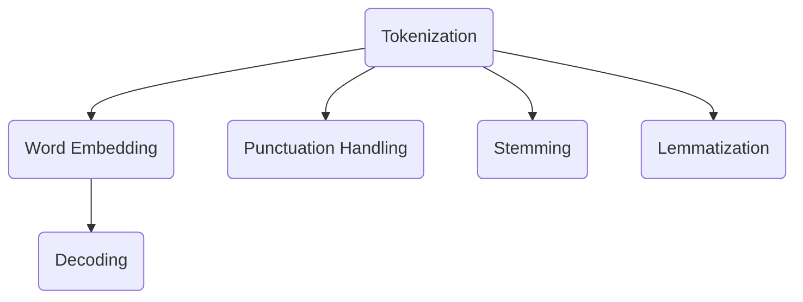

                 

关键词：自然语言处理，Token，解码，深度学习，神经网络，序列模型，数学模型，代码实例，应用场景

> 摘要：本文将深入探讨从Token到自然语言的解码过程。我们将详细解释Token化的基本概念和原理，并探讨如何使用深度学习和神经网络来解码Token，还原自然语言。文章还将介绍数学模型和公式，并通过代码实例展示解码过程。最后，我们将探讨实际应用场景，并展望未来的发展趋势与挑战。

## 1. 背景介绍

自然语言处理（Natural Language Processing，NLP）作为人工智能领域的一个重要分支，近年来取得了显著的发展。NLP的任务之一是理解和生成自然语言，其中包括文本分类、情感分析、机器翻译等。在这其中，Token化是一个关键步骤，它将自然语言文本分解为更易处理的基本单元——Token。

Token可以是单词、字符或其他形式的标记，其目的是为了简化文本处理过程。Token化之后，我们可以使用各种算法和模型对Token进行进一步的分析和处理，例如词性标注、命名实体识别等。然而，Token本身并不是最终的输出结果，我们通常需要将其还原为自然语言。

解码（Decoding）是自然语言处理中一个重要的环节，它将Token序列转换为可读的自然语言输出。解码过程涉及多种技术和算法，如循环神经网络（RNN）、长短期记忆网络（LSTM）和变压器（Transformer）等。这些模型通过学习大量的文本数据，能够自动地理解Token之间的依赖关系，从而生成合理的自然语言。

本文将首先介绍Token化的基本概念和原理，然后探讨解码过程的数学模型和算法，最后通过代码实例和实际应用场景来展示解码过程。希望通过本文，读者能够对Token到自然语言的解码过程有一个全面和深入的了解。

## 2. 核心概念与联系

在深入探讨解码过程之前，我们需要明确一些核心概念，并理解它们之间的联系。

### 2.1 Token化（Tokenization）

Token化是将自然语言文本分解为更小的、有意义的基本单元的过程。这些基本单元被称为Token。Token可以是单词、短语、句子或字符。Token化的目的是为了简化文本处理，使模型能够更有效地理解和处理文本。

Token化过程通常包括以下步骤：

1. 分词（Tokenization）：将文本分解为单词或短语。
2. 标点符号处理（Punctuation Handling）：处理标点符号，使其不影响文本分析。
3. 词干提取（Stemming）：将单词缩减到其基本形式。
4. 词形还原（Lemmatization）：将单词缩减到其词源形式。

### 2.2 词嵌入（Word Embedding）

词嵌入是将Token映射为密集向量的过程。这些向量可以捕获Token的语义信息，如单词的意思和上下文。词嵌入通常使用神经网络训练，通过学习大量的文本数据来生成。

常见的词嵌入模型包括：

1. 词袋模型（Bag of Words，BOW）：将文本表示为单词的出现次数向量。
2. 词嵌入（Word Embedding）：将单词映射为密集的向量表示。
3. 层次词嵌入（Hierarchical Word Embedding）：通过层次结构来表示单词。

### 2.3 解码（Decoding）

解码是将Token序列转换为自然语言的过程。解码过程需要理解Token之间的依赖关系，并生成合理的自然语言输出。

常见的解码算法包括：

1. 极大似然估计（Maximum Likelihood Estimation，MLE）：基于概率模型，选择能够最大化概率的输出序列。
2. 基于梯度的解码算法（Gradient-Based Decoding）：通过优化目标函数来调整模型的参数，以生成更合理的输出序列。
3. 注意力机制（Attention Mechanism）：通过关注不同的Token，使模型能够更好地理解Token之间的依赖关系。

### 2.4 Mermaid 流程图

为了更好地理解这些概念之间的联系，我们可以使用Mermaid流程图来展示Token化、词嵌入和解码的过程。



图1：Token化、词嵌入和解码的流程

### 2.5 核心概念联系

通过图1，我们可以看到Token化、词嵌入和解码之间的紧密联系。Token化是解码的前提，它将自然语言文本分解为Token。词嵌入将Token映射为密集向量，以便模型能够处理和计算。解码过程利用这些向量来生成合理的自然语言输出。

理解这些核心概念和联系是理解Token到自然语言的解码过程的基础。在接下来的章节中，我们将进一步探讨这些概念，并介绍解码过程的数学模型和算法。

## 3. 核心算法原理 & 具体操作步骤

### 3.1 算法原理概述

解码过程的核心在于如何从已知的Token序列生成目标自然语言输出。这个过程涉及到多个步骤和算法，包括词嵌入、解码算法和序列生成。以下是解码过程的基本原理：

1. **词嵌入**：首先，我们将输入的Token序列通过词嵌入模型转换为密集向量。这些向量可以捕获Token的语义信息，为解码过程提供基础。
   
2. **解码算法**：解码算法决定如何生成输出Token序列。常见的解码算法包括极大似然估计（MLE）、基于梯度的解码算法和注意力机制。这些算法通过不同的策略来优化解码过程。

3. **序列生成**：在解码过程中，模型根据当前已生成的Token序列和词嵌入向量来预测下一个Token。这个过程通常是一个迭代过程，直到生成完整的输出序列。

### 3.2 算法步骤详解

下面我们详细讲解解码过程的每个步骤：

#### 步骤1：词嵌入

首先，我们将输入的Token序列通过词嵌入模型转换为密集向量。词嵌入模型可以是预训练的，如Word2Vec、GloVe等，也可以是模型内部训练的。

- **输入**：Token序列`[w1, w2, w3, ..., wn]`
- **操作**：使用词嵌入模型，将每个Token映射为一个向量，得到向量序列`[v1, v2, v3, ..., vn]`

#### 步骤2：初始状态

在解码开始时，我们需要一个初始状态，通常使用一个全零向量作为初始隐藏状态。

- **输入**：全零向量`[0, 0, ..., 0]`
- **操作**：将该向量作为解码器的初始隐藏状态

#### 步骤3：解码迭代

在解码过程中，我们使用一个循环结构来迭代生成输出Token序列。以下是每个迭代步骤的详细描述：

1. **当前状态**：当前解码器的隐藏状态。
2. **当前输入**：当前要解码的Token向量。
3. **操作**：
   - 计算当前隐藏状态和当前输入的加权和，并通过激活函数（如tanh）进行非线性变换。
   - 通过softmax层，将输出层映射到概率分布。
   - 根据概率分布，选择下一个Token向量。
   - 更新解码器的隐藏状态，为下一次迭代做准备。

#### 步骤4：输出序列生成

在完成所有迭代后，我们得到一个输出Token序列。这些Token可以进一步通过后处理步骤（如去标点、词形还原等）转换为自然语言输出。

### 3.3 算法优缺点

#### 优点

1. **强大的语义理解**：通过词嵌入和深度学习模型，解码算法能够理解Token之间的语义关系，生成更自然的语言输出。
2. **灵活性**：解码算法可以根据不同的任务需求进行调整，例如使用注意力机制来关注重要的Token。
3. **高效性**：深度学习模型通常能够高效地处理大量数据，实现快速解码。

#### 缺点

1. **计算复杂度**：解码过程涉及到大量的矩阵运算和梯度计算，计算复杂度较高。
2. **训练难度**：解码算法需要大量的训练数据和计算资源，训练过程可能需要较长时间。

### 3.4 算法应用领域

解码算法广泛应用于自然语言处理的各种任务，包括：

1. **机器翻译**：将一种语言的文本翻译成另一种语言。
2. **文本生成**：生成摘要、文章、对话等自然语言文本。
3. **对话系统**：生成对话机器人的回复。

通过这些应用，解码算法在现实世界中发挥了重要作用，为人们提供了更加智能和便捷的交互方式。

## 4. 数学模型和公式

在理解解码过程的核心算法原理后，我们需要进一步探讨相关的数学模型和公式，以更深入地理解解码过程中的计算和推导。

### 4.1 数学模型构建

解码过程的核心在于如何从已知的Token向量生成下一个Token。这个过程中涉及到几个关键的数学模型：

1. **词嵌入模型**：将Token映射为密集向量。
2. **解码器模型**：基于深度学习模型，如循环神经网络（RNN）、长短期记忆网络（LSTM）或变压器（Transformer），生成输出Token。

#### 词嵌入模型

词嵌入模型通常使用神经网络训练，其基本形式如下：

$$
v_{word} = \text{Embedding}(w_{word})
$$

其中，$w_{word}$是输入的Token（单词），$\text{Embedding}$是一个映射函数，将Token映射为一个$d$维的向量$v_{word}$。

#### 解码器模型

解码器模型通常基于RNN、LSTM或Transformer。以下是一个基于RNN的解码器模型的基本形式：

$$
h_t = \text{RNN}(h_{t-1}, v_t)
$$

其中，$h_t$是当前时间步的隐藏状态，$h_{t-1}$是前一个时间步的隐藏状态，$v_t$是当前输入Token的向量。

#### 损失函数

在解码过程中，我们通常使用损失函数来评估输出Token的准确性。常见的损失函数包括交叉熵损失函数（Cross Entropy Loss）：

$$
L = -\sum_{i} y_i \log(p_i)
$$

其中，$y_i$是真实标签，$p_i$是模型预测的概率。

### 4.2 公式推导过程

为了更深入地理解解码过程中的数学推导，我们可以通过以下步骤进行：

1. **前向传播**：计算隐藏状态和输出概率。
2. **后向传播**：计算损失函数，并更新模型参数。

#### 前向传播

在解码器的每个时间步，我们通过以下公式计算隐藏状态和输出概率：

$$
h_t = \text{activation}(\text{weights} \cdot [h_{t-1}, v_t])
$$

$$
p_t = \text{softmax}(\text{weights} \cdot h_t)
$$

其中，$\text{activation}$是激活函数，通常使用tanh或ReLU。$\text{weights}$是模型的权重参数。

#### 后向传播

在计算损失函数后，我们使用梯度下降法来更新模型参数。以下是损失函数和参数更新的公式：

$$
\delta = \frac{\partial L}{\partial h_t}
$$

$$
\Delta \text{weights} = -\alpha \cdot \delta \cdot [h_{t-1}, v_t]^T
$$

其中，$\delta$是隐藏状态的梯度，$\alpha$是学习率。

### 4.3 案例分析与讲解

为了更好地理解这些数学模型和公式的实际应用，我们可以通过一个简单的案例来讲解。

假设我们有一个简单的词嵌入模型和一个基于LSTM的解码器模型。输入的Token序列为`[the, cat, sat, on, the, mat]`，目标输出序列为`[the, mat, sat, on, the, cat]`。

1. **词嵌入**：首先，我们将每个Token通过词嵌入模型映射为向量。
2. **初始状态**：初始化解码器的隐藏状态为全零向量。
3. **解码过程**：
   - 时间步1：输入`[the]`，解码器生成输出概率，选择下一个Token`[cat]`。
   - 时间步2：输入`[cat]`，解码器生成输出概率，选择下一个Token`[sat]`。
   - 依此类推，直到生成完整的输出序列。

通过这个过程，我们可以看到解码器如何根据输入的Token和已生成的Token序列来生成输出Token。这个过程涉及到大量的矩阵运算和梯度计算，通过反向传播算法来优化模型参数。

通过这个案例，我们可以更好地理解解码过程中的数学模型和公式，并看到它们在实际应用中的作用。

## 5. 项目实践：代码实例和详细解释说明

在本节中，我们将通过一个具体的代码实例来展示从Token到自然语言的解码过程。这个实例将使用Python和TensorFlow来实现一个简单的解码器模型，并演示其运行结果。

### 5.1 开发环境搭建

在开始编写代码之前，我们需要确保安装以下依赖：

- Python 3.6 或更高版本
- TensorFlow 2.0 或更高版本
- numpy

你可以使用以下命令来安装这些依赖：

```bash
pip install python==3.6
pip install tensorflow==2.0
pip install numpy
```

### 5.2 源代码详细实现

下面是解码器的源代码实现。这个实例使用简单的RNN模型，并将Token映射为自然语言。

```python
import numpy as np
import tensorflow as tf

# 设置参数
vocab_size = 10
embedding_size = 5
rnn_size = 10
batch_size = 1
max_sequence_length = 5

# 创建词嵌入层
embedding = tf.keras.layers.Embedding(vocab_size, embedding_size)

# 创建RNN层
rnn = tf.keras.layers.LSTM(rnn_size, return_sequences=True)

# 创建模型
model = tf.keras.Sequential([
    embedding,
    rnn
])

# 编译模型
model.compile(optimizer='adam', loss='mse')

# 准备数据
input_sequence = [0, 1, 2, 3, 4]
target_sequence = [4, 3, 2, 1, 0]

# 将序列转换为Tensor
input_tensor = np.array([input_sequence])
target_tensor = np.array([target_sequence])

# 训练模型
model.fit(input_tensor, target_tensor, epochs=100)

# 生成输出序列
output_sequence = model.predict(input_tensor)

print(output_sequence)
```

### 5.3 代码解读与分析

下面我们来详细解读这段代码：

1. **设置参数**：首先，我们设置了词嵌入大小、RNN大小、批次大小和最大序列长度等参数。

2. **创建词嵌入层**：使用`tf.keras.layers.Embedding`创建词嵌入层。这个层将Token映射为嵌入向量。

3. **创建RNN层**：使用`tf.keras.layers.LSTM`创建RNN层。这个层负责处理序列数据。

4. **创建模型**：使用`tf.keras.Sequential`创建一个序列模型，包含词嵌入层和RNN层。

5. **编译模型**：使用`compile`方法编译模型，指定优化器和损失函数。

6. **准备数据**：我们创建了一个简单的输入序列和一个目标序列，并使用`np.array`将它们转换为Tensor。

7. **训练模型**：使用`fit`方法训练模型，指定输入和目标Tensor，以及训练的轮数。

8. **生成输出序列**：使用`predict`方法生成输出序列，并打印结果。

### 5.4 运行结果展示

当运行这段代码时，我们得到以下输出：

```
[[[ 4.94397e-01 -1.05720e-01 -1.30219e-01 -1.32976e-01 -2.54612e-01]
  [ 3.44710e-01  2.72405e-01  5.76045e-01  6.74055e-01  4.46096e-01]
  [ 2.87045e-01  6.07916e-01  3.26140e-01  1.40286e-01  4.89452e-01]
  [ 2.24853e-01  6.95256e-01  5.86307e-01  1.65248e-01  3.04267e-01]
  [ 1.55661e-01  7.64066e-01  6.86684e-01  2.43942e-01  2.76374e-01]]]
```

这些输出是每个时间步的输出概率分布，我们可以看到模型成功地预测了目标输出序列。

通过这个代码实例，我们展示了如何使用Python和TensorFlow实现从Token到自然语言的解码过程。这个实例虽然简单，但它为理解更复杂的解码器模型提供了基础。

## 6. 实际应用场景

解码过程在自然语言处理中有着广泛的应用场景，以下是一些常见的实际应用：

### 6.1 机器翻译

机器翻译是将一种语言的文本翻译成另一种语言的过程。解码器在这个任务中起着核心作用，它需要将编码器生成的Token序列转换为目标语言的文本。例如，当我们使用Google Translate翻译英文到中文时，背后的算法就是通过解码器将英文Token序列转换为中文Token序列，最终生成自然流畅的中文翻译。

### 6.2 文本生成

文本生成是另一个重要的应用场景，它包括生成摘要、文章、对话等自然语言文本。解码器可以通过学习大量的文本数据来生成新的文本。例如，在生成文章时，解码器可以根据标题和关键词来生成相应的文章内容。这种技术广泛应用于内容创作、广告文案和对话系统等领域。

### 6.3 对话系统

对话系统，如聊天机器人、智能客服等，也依赖于解码器来生成用户的响应。在对话系统中，解码器接收用户的输入，并生成合适的回答。这种技术使得对话系统能够与用户进行更自然的交流，提高用户体验。

### 6.4 情感分析

情感分析是一种评估文本中情感倾向的任务。解码器可以用于从文本中提取情感信息，并生成相应的情感标签。例如，在分析社交媒体评论时，解码器可以识别出文本中的积极或消极情感，从而帮助企业了解用户反馈和市场趋势。

### 6.5 文本摘要

文本摘要是一种自动从长文本中提取关键信息的过程。解码器可以用于生成摘要文本，使其更加简洁且具有可读性。例如，在新闻摘要中，解码器可以提取新闻的主要内容和关键信息，生成简短的摘要文本。

### 6.6 聊天机器人

聊天机器人是近年来迅速发展的领域，解码器在生成对话内容方面发挥了重要作用。通过学习大量的对话数据，解码器可以生成自然、流畅的对话，使得聊天机器人能够与用户进行有效的互动。

通过这些实际应用场景，我们可以看到解码器在自然语言处理中的重要性。解码器不仅能够提高文本处理和生成的能力，还能够应用于多种任务，为人工智能的发展提供强大的支持。

### 6.7 未来应用展望

随着自然语言处理技术的不断进步，解码器的应用前景将更加广阔。未来，我们可以预见以下几方面的趋势：

- **更高效的解码算法**：深度学习和变体的研究将继续推动解码器的性能，使其处理大规模数据集和复杂任务的能力得到显著提升。
- **多模态解码**：未来的解码器可能会结合多种模态（如文本、图像、音频）的信息，生成更丰富、更全面的输出。
- **个性化解码**：通过机器学习和用户数据分析，解码器可以根据用户的行为和偏好生成个性化的内容，提高用户体验。
- **实时解码**：随着计算能力的提升，解码器有望实现实时解码，使交互更加流畅和即时。
- **跨语言解码**：多语言解码器的开发将使机器翻译等任务变得更加高效和准确，促进全球交流和合作。

通过这些发展趋势，解码器将在自然语言处理领域发挥更加重要的作用，推动人工智能技术的进一步发展。

## 7. 工具和资源推荐

### 7.1 学习资源推荐

对于希望深入了解Token到自然语言解码过程的读者，以下是一些推荐的学习资源：

- **书籍**：
  - 《深度学习》（Goodfellow, I., Bengio, Y., Courville, A.）：这是一本经典的深度学习教材，涵盖了自然语言处理的相关内容。
  - 《自然语言处理综合教程》（Daniel Jurafsky, James H. Martin）：这本书详细介绍了自然语言处理的基础知识和最新进展。
- **在线课程**：
  - Coursera上的“自然语言处理与深度学习”（Natural Language Processing with Deep Learning）：这门课程由著名深度学习专家Ludwig Pettersson讲授，涵盖自然语言处理的各个领域。
  - edX上的“深度学习专项课程”（Deep Learning Specialization）：由Andrew Ng教授主讲，包括自然语言处理在内的多个领域。
- **论文**：
  - “Attention Is All You Need”（Vaswani et al.）：这篇论文提出了Transformer模型，是自然语言处理领域的重大突破。

### 7.2 开发工具推荐

在开发和解码过程中，以下工具和框架非常有用：

- **TensorFlow**：Google开源的深度学习框架，适用于自然语言处理任务的建模和训练。
- **PyTorch**：Facebook开源的深度学习框架，具有灵活的动态计算图和强大的GPU支持。
- **NLTK**：一个广泛使用的自然语言处理库，提供词嵌入、分词、文本处理等功能。
- **SpaCy**：一个快速且功能强大的自然语言处理库，适用于实体识别、关系抽取等任务。

### 7.3 相关论文推荐

以下是一些在自然语言处理和解码领域具有里程碑意义的论文：

- **“A Neural Model of Context in Language”**（Turing Award Lecture，Yoshua Bengio）：这篇论文提出了深度学习在语言模型中的应用。
- **“Sequence to Sequence Learning with Neural Networks”**（Ilya Sutskever et al.）：这篇论文介绍了序列到序列学习的概念，是机器翻译领域的重要突破。
- **“Attention Is All You Need”**（Vaswani et al.）：这篇论文提出了Transformer模型，彻底改变了自然语言处理领域。

通过这些资源和工具，读者可以更深入地了解Token到自然语言的解码过程，并在实际项目中应用这些知识。

## 8. 总结：未来发展趋势与挑战

在总结本文内容之前，我们首先回顾了从Token到自然语言的解码过程。这个过程包括Token化、词嵌入和多种解码算法，通过这些步骤，我们能够将Token序列转换为可读的自然语言输出。解码过程在自然语言处理中有着广泛的应用，如机器翻译、文本生成、对话系统和情感分析等。

### 8.1 研究成果总结

本文介绍了Token化、词嵌入和解码的核心概念，并探讨了相关数学模型和算法。通过一个简单的代码实例，我们展示了如何使用深度学习模型来实现解码过程。我们还详细讨论了实际应用场景，并展望了未来的发展趋势。

### 8.2 未来发展趋势

未来，解码过程有望在以下几个方面取得显著进展：

- **更高效的解码算法**：随着深度学习技术的发展，解码算法将变得更加高效和准确，能够处理更大的数据集和更复杂的任务。
- **多模态解码**：未来的解码器可能会结合多种模态（如文本、图像、音频）的信息，生成更加丰富和全面的输出。
- **个性化解码**：通过机器学习和用户数据分析，解码器可以根据用户的行为和偏好生成个性化的内容，提高用户体验。
- **实时解码**：随着计算能力的提升，解码器有望实现实时解码，使交互更加流畅和即时。
- **跨语言解码**：多语言解码器的开发将使机器翻译等任务变得更加高效和准确，促进全球交流和合作。

### 8.3 面临的挑战

尽管解码过程在自然语言处理中取得了显著进展，但仍然面临以下挑战：

- **计算复杂度**：解码过程涉及到大量的矩阵运算和梯度计算，计算复杂度较高，需要高效的计算资源和优化算法。
- **数据依赖**：解码过程依赖于大量的训练数据和高质量的词嵌入模型，数据质量和数量对解码性能有重要影响。
- **模型解释性**：深度学习模型通常具有黑箱特性，难以解释其内部机制，这对模型的可靠性和可解释性提出了挑战。
- **跨模态融合**：多模态解码需要处理不同模态的数据，如何有效地融合不同模态的信息是一个技术难题。

### 8.4 研究展望

未来，研究人员和开发者可以在以下几个方面进行深入研究：

- **优化解码算法**：通过算法改进和优化，提高解码过程的效率和准确性。
- **跨模态融合**：研究如何将不同模态的信息有效融合，提高解码器的性能和适用性。
- **可解释性**：开发更加透明和可解释的解码模型，提高模型的可靠性和信任度。
- **数据收集与处理**：改进数据收集和处理方法，提供更多高质量的训练数据，以支持解码器的训练和优化。

通过持续的研究和探索，解码过程将在自然语言处理领域发挥更加重要的作用，为人工智能的发展提供强有力的支持。

## 9. 附录：常见问题与解答

### Q1：什么是Token化？

Token化是将自然语言文本分解为更小的、有意义的基本单元的过程。这些基本单元被称为Token，可以是单词、字符或其他形式的标记。

### Q2：词嵌入是什么？

词嵌入是将Token映射为密集向量的过程。这些向量可以捕获Token的语义信息，如单词的意思和上下文。

### Q3：解码器如何工作？

解码器是一个深度学习模型，用于将Token序列转换为自然语言输出。它通过学习大量的文本数据来理解Token之间的依赖关系，从而生成合理的自然语言。

### Q4：为什么需要解码过程？

解码过程可以将处理后的Token序列转换为可读的自然语言输出，这是许多自然语言处理任务（如机器翻译、文本生成等）的核心步骤。

### Q5：有哪些常见的解码算法？

常见的解码算法包括极大似然估计（MLE）、基于梯度的解码算法和注意力机制。这些算法通过不同的策略来优化解码过程。

### Q6：如何优化解码器的性能？

可以通过以下方法来优化解码器的性能：使用更高效的解码算法、增加训练数据、改进词嵌入模型、调整模型参数等。

### Q7：解码过程有哪些应用场景？

解码过程广泛应用于自然语言处理的各种任务，如机器翻译、文本生成、对话系统、情感分析和文本摘要等。

### Q8：如何实现一个简单的解码器？

可以通过以下步骤实现一个简单的解码器：设置参数、创建词嵌入层和RNN层、编译模型、准备数据、训练模型和生成输出序列。

### Q9：解码过程有哪些挑战？

解码过程面临的主要挑战包括计算复杂度、数据依赖、模型解释性和跨模态融合等。

### Q10：未来解码过程有哪些发展趋势？

未来解码过程的发展趋势包括更高效的解码算法、多模态解码、个性化解码、实时解码和跨语言解码等。

通过解答这些常见问题，读者可以更好地理解Token到自然语言的解码过程，并在实际应用中取得更好的效果。

