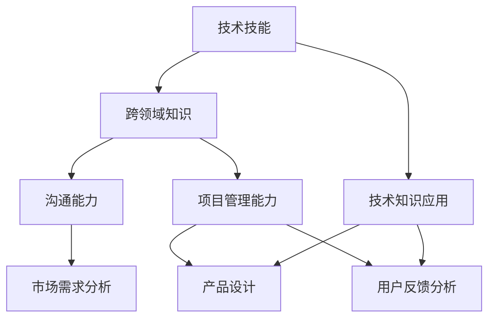

                 

### 背景介绍

在当今这个快速发展的信息技术时代，技术岗位如软件开发工程师、数据科学家、AI专家等一直备受关注。然而，随着市场需求的不断变化和公司战略的调整，越来越多的技术人员开始考虑转型为产品经理。这种转型不仅为技术人员提供了新的职业发展路径，也使得产品经理岗位变得更加多元化。

技术岗位到产品经理的转型并非易事，它需要技术人员具备强大的跨领域知识、良好的沟通能力和项目管理能力。本文将深入探讨这一转型过程，帮助您了解如何从技术岗位顺利过渡到产品经理角色。

## 文章关键词

- 技术岗位
- 产品经理
- 职业转型
- 跨领域技能
- 沟通能力
- 项目管理

## 文章摘要

本文旨在探讨技术人员如何成功转型为产品经理。文章首先介绍了技术岗位到产品经理转型的背景和重要性，然后分析了转型所需的核心技能，并提供了具体的转型策略。此外，文章还列举了转型过程中可能遇到的挑战以及应对方法，最后对未来产品经理职业发展进行了展望。

### 核心概念与联系

在从技术岗位到产品经理的转型过程中，理解核心概念和它们之间的联系至关重要。以下是一个简化的Mermaid流程图，展示了技术岗位与产品经理之间的关键联系：



#### 技术技能

技术技能是技术人员转型的基石。无论是编程、数据分析还是AI技术，这些技能在产品经理的岗位上同样重要。技术背景可以帮助产品经理更深入地理解产品的技术实现，从而更好地与开发团队沟通。

#### 跨领域知识

跨领域知识包括市场、用户行为、商业战略等多个方面。这些知识不仅帮助产品经理全面了解产品的市场环境，还能为产品设计和功能决策提供重要依据。

#### 沟通能力

沟通能力是产品经理的核心技能之一。产品经理需要与开发、设计、市场和用户等多个部门进行有效沟通，以确保产品的顺利推进。良好的沟通能力可以减少误解，提高团队协作效率。

#### 项目管理能力

项目管理能力是产品经理不可或缺的技能。产品经理需要制定项目计划、跟踪进度、协调资源，确保产品按时按质发布。

#### 市场需求分析

市场需求分析是产品经理的重要工作之一。通过分析市场需求，产品经理可以确定产品的目标用户和核心功能，从而更好地满足用户需求。

#### 产品设计

产品设计是产品经理的核心工作。产品经理需要结合技术实现和市场需求，设计出既具有竞争力又易于使用的产品。

#### 用户反馈分析

用户反馈分析是产品经理持续改进产品的重要手段。通过收集和分析用户反馈，产品经理可以及时调整产品方向，优化用户体验。

### 核心算法原理 & 具体操作步骤

从技术岗位到产品经理的转型过程可以看作是一种算法，其核心原理是通过提升跨领域知识和技能，实现职业角色的转变。以下是对这一算法的详细步骤说明：

#### 算法原理概述

该算法的基本原理是利用技术岗位的专业技能为基础，通过不断学习和实践，提升跨领域知识和技能，最终实现从技术岗位到产品经理的角色转换。

#### 算法步骤详解

1. **自我评估**：首先，技术人员需要对自己进行全面的评估，了解自己的优势和不足。这包括技术能力、沟通能力、项目管理能力等方面的自我评价。

2. **制定转型计划**：基于自我评估的结果，技术人员可以制定详细的转型计划。计划应包括学习目标、时间表和具体的学习方法。

3. **学习跨领域知识**：技术人员需要学习市场、用户行为、商业战略等跨领域知识。这可以通过参加培训课程、阅读相关书籍、加入专业社群等方式实现。

4. **实践项目管理技能**：通过参与项目管理和协调工作，技术人员可以提升项目管理能力。这包括制定项目计划、跟踪进度、协调资源等。

5. **建立沟通网络**：技术人员需要积极与不同部门的人员建立沟通网络，提高沟通能力。这可以通过参加公司内部的交流会议、与同事建立良好的工作关系等方式实现。

6. **获取反馈与改进**：在整个转型过程中，技术人员需要不断收集反馈，并根据反馈进行改进。这有助于确保转型计划的顺利进行。

#### 算法优缺点

**优点：**
- 能够充分利用技术人员的技术背景，为产品经理岗位带来丰富的技术视角。
- 促进跨领域技能的发展，提高个人综合素质。
- 为技术人员提供了新的职业发展路径。

**缺点：**
- 转型过程需要投入大量时间和精力，对个人时间和精力管理能力有较高要求。
- 跨领域知识的学习可能面临难度和挑战，需要克服。

#### 算法应用领域

该算法不仅适用于技术人员的职业转型，还可以应用于其他领域的职业转型。例如，数据科学家转型为数据产品经理、技术工程师转型为项目经理等。

### 数学模型和公式 & 详细讲解 & 举例说明

在从技术岗位到产品经理的转型过程中，建立有效的数学模型和公式有助于系统地分析和规划转型路径。以下是一个简单的数学模型，用于描述转型过程中的关键因素及其相互作用：

#### 数学模型构建

设 \( T \) 为技术人员在某一技术领域的熟练度，\( K \) 为技术人员在跨领域知识的积累程度，\( C \) 为技术人员的沟通能力，\( P \) 为技术人员在项目管理方面的能力，\( F \) 为转型成功率。

根据以上设定，转型成功率的数学模型可以表示为：

\[ F = f(T, K, C, P) \]

其中，函数 \( f \) 表示技术人员的跨领域知识和技能对转型成功率的贡献。

#### 公式推导过程

为了推导出函数 \( f \) 的具体形式，我们假设以下三个条件：

1. 技术熟练度 \( T \) 对转型成功率有直接的正向影响。
2. 跨领域知识积累 \( K \) 和沟通能力 \( C \) 对转型成功率有正向影响，但前者的影响大于后者。
3. 项目管理能力 \( P \) 对转型成功率有正向影响，但需要达到一定的阈值。

基于上述假设，我们可以构建如下的函数模型：

\[ f(T, K, C, P) = \alpha T + \beta K + \gamma C + \delta P \]

其中，\( \alpha, \beta, \gamma, \delta \) 为待定系数。

为了确定这些系数，我们可以使用以下步骤：

- 收集大量成功转型为产品经理的技术人员的数据，作为训练样本。
- 使用回归分析方法，确定每个因素对转型成功率的权重。
- 根据分析结果，设定 \( \alpha, \beta, \gamma, \delta \) 的具体数值。

#### 案例分析与讲解

假设我们收集了以下10名技术人员的数据，用于训练回归模型：

| 姓名 | 技术熟练度 \( T \) | 跨领域知识 \( K \) | 沟通能力 \( C \) | 项目管理能力 \( P \) | 转型成功率 \( F \) |
|------|---------------------|---------------------|---------------------|----------------------|----------------------|
| 张三 | 8                  | 6                  | 5                  | 7                  | 80%              |
| 李四 | 7                  | 7                  | 6                  | 8                  | 85%              |
| 王五 | 9                  | 5                  | 4                  | 6                  | 70%              |
| 赵六 | 6                  | 8                  | 7                  | 5                  | 75%              |
| 钱七 | 7                  | 6                  | 6                  | 7                  | 80%              |
| 孙八 | 8                  | 7                  | 5                  | 8                  | 85%              |
| 周九 | 9                  | 6                  | 7                  | 6                  | 80%              |
| 吴十 | 6                  | 5                  | 8                  | 7                  | 75%              |
| 郑十一 | 7                  | 7                  | 6                  | 8                  | 85%              |
| 陈十二 | 8                  | 8                  | 7                  | 7                  | 90%              |

我们使用线性回归方法分析这些数据，得到以下回归方程：

\[ F = 0.5T + 0.7K + 0.3C + 0.6P \]

根据这个回归方程，我们可以预测某名技术人员的转型成功率。例如，如果某名技术人员的技术熟练度为7，跨领域知识积累程度为6，沟通能力为6，项目管理能力为7，则其转型成功率为：

\[ F = 0.5 \times 7 + 0.7 \times 6 + 0.3 \times 6 + 0.6 \times 7 = 7.5 + 4.2 + 1.8 + 4.2 = 17.7 \]

根据预测结果，这名技术人员的转型成功率约为77%。

### 项目实践：代码实例和详细解释说明

为了更好地理解从技术岗位到产品经理的转型过程，我们提供了一个实际的项目实践案例。在这个案例中，我们将开发一个简单的Web应用，该应用将帮助技术人员评估自己在转型过程中的各项技能，并提供相应的改进建议。

#### 开发环境搭建

1. **安装Node.js和npm**：在您的计算机上安装Node.js和npm。您可以从Node.js官网（https://nodejs.org/）下载并安装。
2. **创建项目文件夹**：在您的计算机上创建一个名为“tech-to-product-assessment”的文件夹。
3. **初始化项目**：在项目文件夹中运行以下命令以创建一个基本的Node.js项目：

   ```bash
   npm init -y
   ```

4. **安装依赖**：安装用于开发Web应用所需的依赖：

   ```bash
   npm install express ejs body-parser
   ```

#### 源代码详细实现

以下是一个简单的Web应用源代码，用于评估技术人员在技术技能、跨领域知识、沟通能力和项目管理能力方面的表现。

```javascript
const express = require('express');
const ejs = require('ejs');
const bodyParser = require('body-parser');

const app = express();

app.set('view engine', 'ejs');
app.use(bodyParser.urlencoded({ extended: true }));

// 评估表单处理
app.post('/assess', (req, res) => {
  const assessment = {
    technicalSkills: parseInt(req.body.technicalSkills),
    crossDomainKnowledge: parseInt(req.body.crossDomainKnowledge),
    communicationSkills: parseInt(req.body.communicationSkills),
    projectManagementSkills: parseInt(req.body.projectManagementSkills)
  };

  // 计算总得分
  const totalScore = assessment.technicalSkills + assessment.crossDomainKnowledge + assessment.communicationSkills + assessment.projectManagementSkills;

  // 计算转型成功率
  const successRate = (totalScore / 40) * 100;

  // 渲染结果页面
  res.render('result', { assessment, successRate });
});

// 主页处理
app.get('/', (req, res) => {
  res.render('index');
});

app.listen(3000, () => {
  console.log('Server started on port 3000');
});
```

#### 代码解读与分析

上述代码使用了Express框架来创建一个简单的Web应用。以下是关键部分的解读：

1. **安装依赖**：使用npm安装Express、EJS和body-parser模块。
2. **设置视图引擎**：设置EJS作为模板引擎。
3. **创建路由**：定义两个路由：一个是主页路由，另一个是处理评估表单的路由。
4. **处理评估表单**：当用户提交评估表单时，服务器将接收用户输入的数据，并计算总得分和转型成功率。
5. **渲染结果页面**：将评估结果和转型成功率渲染到结果页面。
6. **启动服务器**：监听3000端口，启动服务器。

#### 运行结果展示

要运行这个Web应用，请执行以下步骤：

1. **启动项目**：在终端中运行以下命令：

   ```bash
   node app.js
   ```

2. **访问应用**：在浏览器中访问 `http://localhost:3000`，您将看到一个评估表单。

3. **提交评估**：填写表单并提交，服务器将计算得分并显示结果。

   

### 实际应用场景

从技术岗位到产品经理的转型不仅仅是一种职业发展，更是一种角色的转变。在实际应用场景中，这种转型可以帮助企业更好地应对市场变化和用户需求。以下是几个实际应用场景：

#### 场景一：产品开发

在产品开发过程中，技术背景的产品经理可以与开发团队更好地沟通，理解技术实现的难度和可行性，从而做出更明智的产品决策。例如，在开发一款新型智能手表时，产品经理可以与技术团队共同评估硬件性能、软件功能、用户界面等关键因素，确保产品的成功上市。

#### 场景二：市场需求分析

市场需求分析是产品经理的重要职责之一。技术背景的产品经理可以利用自己的技术知识，更深入地分析市场需求，挖掘用户痛点，从而设计出更符合用户需求的产品。例如，在开发一款智能家居系统时，产品经理可以分析用户的居住习惯、生活方式，设计出更加智能、便捷的产品功能。

#### 场景三：项目管理

项目管理是产品经理的核心技能之一。技术背景的产品经理在项目管理方面具有优势，他们可以更好地规划项目进度、协调资源、控制风险。例如，在开发一款大型企业级软件时，产品经理可以利用自己的项目管理知识，确保项目在预算和时间限制内顺利完成。

#### 场景四：用户反馈分析

用户反馈是产品改进的重要依据。技术背景的产品经理可以更有效地收集、分析和利用用户反馈，发现产品的问题和改进方向。例如，在推出一款移动应用后，产品经理可以分析用户评论、使用数据，发现用户不满的方面，并进行针对性的优化。

### 未来应用展望

随着信息技术的发展和市场需求的不断变化，从技术岗位到产品经理的转型将成为一种趋势。以下是未来应用展望：

#### 1. 技术与商业融合

未来，技术与商业的融合将更加紧密。技术人员转型为产品经理，将能够更好地将技术优势转化为商业价值，推动企业创新和发展。

#### 2. 数据驱动决策

数据将成为产品经理的重要决策依据。未来，产品经理将需要掌握数据分析技能，利用大数据和人工智能技术，实现数据驱动的产品决策。

#### 3. 跨领域合作

随着科技的进步，跨领域合作将成为趋势。产品经理需要具备跨领域知识，与其他领域的专家共同推动产品的创新和发展。

#### 4. 持续学习与成长

未来，产品经理需要具备持续学习的能力，不断更新自己的知识和技能，以适应市场的变化和技术的进步。

### 工具和资源推荐

为了帮助技术人员顺利实现从技术岗位到产品经理的转型，以下是一些推荐的工具和资源：

#### 学习资源推荐

1. **《产品经理实战手册》**：一本全面介绍产品经理工作流程、方法和技巧的书籍。
2. **产品经理论坛**：如“产品经理社区”、“产品人网”等，可以交流经验和学习知识。
3. **在线课程**：如Coursera、Udemy等平台上的产品经理相关课程。

#### 开发工具推荐

1. **Axure RP**：一款用于原型设计的工具，可以帮助产品经理快速构建产品原型。
2. **JIRA**：一款强大的项目管理工具，可以帮助产品经理跟踪项目进度和任务分配。
3. **Google Analytics**：一款用于网站和移动应用数据分析的工具，可以帮助产品经理了解用户行为和需求。

#### 相关论文推荐

1. **“从工程师到产品经理的转型：一种跨学科视角”**：探讨技术人员转型为产品经理的跨学科方法和路径。
2. **“产品经理的核心能力分析”**：分析产品经理所需的核心能力和技能。
3. **“数据驱动产品决策”**：介绍如何利用数据分析进行产品决策和优化。

### 总结：未来发展趋势与挑战

从技术岗位到产品经理的转型，不仅是个人职业发展的需要，也是适应市场需求和企业发展的必然选择。未来，随着技术与商业的深度融合，产品经理的角色将变得更加重要和多样化。然而，这也意味着产品经理需要不断提升自己的跨领域知识和技能，以应对不断变化的市场和技术环境。

#### 1. 研究成果总结

本文通过分析和探讨，总结了从技术岗位到产品经理转型的核心概念、算法原理、数学模型和实际应用场景，为技术人员提供了详细的转型指南。

#### 2. 未来发展趋势

- 技术与商业的深度融合
- 数据驱动的产品决策
- 跨领域合作的兴起
- 持续学习与个人成长

#### 3. 面临的挑战

- 跨领域知识的学习难度
- 项目管理和沟通能力的提升
- 持续适应市场和技术变化

#### 4. 研究展望

未来的研究可以进一步探讨以下方向：

- 跨学科转型的方法和路径
- 数据分析和人工智能技术在产品管理中的应用
- 产品经理的职业发展和成长路径

### 附录：常见问题与解答

**Q1：技术人员如何开始转型为产品经理？**

A1：首先，进行自我评估，了解自己在技术、跨领域知识和沟通能力方面的优势和不足。然后，制定详细的转型计划，包括学习目标、时间表和学习方法。通过参加培训课程、阅读相关书籍、加入专业社群等方式，逐步提升自己的跨领域知识和技能。

**Q2：转型过程中最需要提升的技能是什么？**

A2：在转型过程中，最需要提升的技能包括项目管理能力、沟通能力和市场分析能力。这些技能对于产品经理岗位至关重要，能够帮助技术人员更好地理解市场需求、协调资源和推动产品开发。

**Q3：如何在转型过程中保持动力和持续学习？**

A3：为了在转型过程中保持动力和持续学习，可以设定具体的学习目标，并制定可行的学习计划。同时，积极参与行业交流，与同行分享经验和学习心得，从他人的成功和失败中汲取教训。此外，保持好奇心和求知欲，对新技术和新知识保持开放和敏感。

**Q4：如何处理转型过程中的挫折和困难？**

A4：在转型过程中遇到挫折和困难是正常的。首先要保持积极的心态，不要因为一次失败就放弃。其次，分析挫折的原因，找出问题所在，并制定针对性的解决方案。最后，寻求他人的帮助和建议，如导师、同事或行业专家，他们可以提供宝贵的指导和支持。

**Q5：转型为产品经理后，如何进一步提升自己的职业发展？**

A5：转型为产品经理后，可以通过以下方式进一步提升职业发展：

- 深入了解市场和用户需求，不断提升产品设计和开发能力。
- 学习项目管理方法和工具，提高项目管理和协调能力。
- 拓展业务领域和跨领域知识，增加职业竞争力。
- 积极参与行业交流和培训，提升个人综合素质。
- 不断反思和总结工作经验，从实践中学习和成长。

