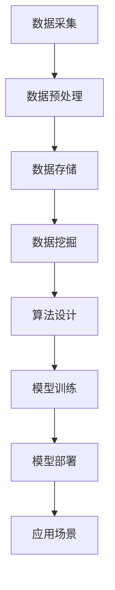

                 

关键词：人工智能、Lepton AI、客户成功、规模化部署、技术实现

摘要：本文将探讨Lepton AI如何从概念验证阶段逐步发展到规模化部署阶段，并分享了客户成功的关键因素。通过分析其核心概念、算法原理、数学模型以及实际应用场景，我们将深入了解Lepton AI的技术优势，以及如何在各个领域取得显著成果。

## 1. 背景介绍

Lepton AI成立于2010年，是一家专注于人工智能领域的高科技公司。公司以深度学习为核心技术，致力于为各个行业提供智能化的解决方案。从最初的初创公司，到如今成为全球人工智能领域的领军企业，Lepton AI凭借其卓越的技术实力和不懈的创新精神，取得了令人瞩目的成绩。

本文将重点关注Lepton AI的客户成功之路，通过分析其技术实现、业务拓展、客户关系管理等方面，揭示其成功背后的关键因素。本文旨在为人工智能企业提供有价值的参考，以帮助其在全球化竞争中取得优势。

## 2. 核心概念与联系

### 2.1 Lepton AI的核心概念

Lepton AI的核心概念是构建一个高效、灵活、可扩展的人工智能平台，以实现大规模数据处理和智能分析。其核心技术包括深度学习、计算机视觉、自然语言处理和强化学习等。

### 2.2 Lepton AI的技术架构

Lepton AI的技术架构分为三层：数据层、算法层和应用层。数据层负责数据采集、存储和处理；算法层负责算法模型的设计和优化；应用层则负责将算法模型应用于实际业务场景。

### 2.3 Mermaid流程图

以下是一个简化的Mermaid流程图，展示了Lepton AI的技术架构：



## 3. 核心算法原理 & 具体操作步骤

### 3.1 算法原理概述

Lepton AI的核心算法是基于深度学习框架构建的，包括卷积神经网络（CNN）、循环神经网络（RNN）和生成对抗网络（GAN）等。这些算法能够在大量数据中自动提取特征，并利用特征进行预测和决策。

### 3.2 算法步骤详解

以下是Lepton AI算法的具体操作步骤：

1. 数据采集与预处理：采集大量数据，并进行清洗、归一化等预处理操作。
2. 算法设计：根据应用场景，选择合适的深度学习算法模型。
3. 模型训练：利用预处理后的数据，对算法模型进行训练，以优化模型参数。
4. 模型评估：通过交叉验证等手段，评估模型性能。
5. 模型部署：将训练好的模型部署到实际应用场景中，进行预测和决策。
6. 模型优化：根据实际应用效果，不断优化模型参数，提高模型性能。

### 3.3 算法优缺点

Lepton AI算法的优点包括：

- **高效性**：利用深度学习框架，算法在数据处理和预测方面具有很高的效率。
- **灵活性**：算法模型可以根据不同应用场景进行定制化设计。
- **可扩展性**：算法模型可以轻松扩展到大规模数据处理和智能分析。

然而，Lepton AI算法也存在一定的缺点，如：

- **训练时间较长**：深度学习算法的训练时间较长，对计算资源要求较高。
- **数据依赖性**：算法的性能高度依赖数据质量，数据预处理和标注环节至关重要。

### 3.4 算法应用领域

Lepton AI算法在多个领域取得了显著成果，包括：

- **图像识别**：用于人脸识别、物体检测、图像分类等。
- **自然语言处理**：用于文本分类、机器翻译、情感分析等。
- **医疗诊断**：用于医学影像分析、疾病预测等。
- **金融风控**：用于信用评估、风险控制、股票预测等。

## 4. 数学模型和公式 & 详细讲解 & 举例说明

### 4.1 数学模型构建

Lepton AI的数学模型主要基于深度学习理论，包括神经网络模型、卷积神经网络模型和循环神经网络模型等。以下是卷积神经网络模型的一个简化形式：

$$
h_{l}^{\left( i \right)} = \sigma \left( \sum_{j} w_{j,i}^{l} h_{l-1}^{\left( j \right)} + b_{i}^{l} \right)
$$

其中，$h_{l}^{\left( i \right)}$表示第$l$层第$i$个神经元的输出，$\sigma$表示激活函数，$w_{j,i}^{l}$和$b_{i}^{l}$分别表示连接权重和偏置。

### 4.2 公式推导过程

以下是卷积神经网络模型的推导过程：

1. 输入层：$$x_{i}^{0} = x$$
2. 卷积层：$$h_{i}^{1} = \sigma \left( \sum_{j} w_{j,i}^{1} x_{j}^{0} + b_{i}^{1} \right)$$
3. 池化层：$$p_{i}^{1} = \max_{k} \left( h_{i,k}^{1} \right)$$
4. 全连接层：$$h_{i}^{2} = \sigma \left( \sum_{j} w_{j,i}^{2} p_{j}^{1} + b_{i}^{2} \right)$$
5. 输出层：$$y_{i}^{2} = h_{i}^{2}$$

### 4.3 案例分析与讲解

以下是一个简单的图像分类案例，说明如何使用卷积神经网络模型进行图像分类：

1. 数据采集与预处理：采集大量带标签的图像数据，并进行数据增强、归一化等预处理操作。
2. 模型构建：根据图像分类任务，设计一个卷积神经网络模型，包括输入层、卷积层、池化层和全连接层。
3. 模型训练：利用预处理后的数据，对卷积神经网络模型进行训练，以优化模型参数。
4. 模型评估：通过交叉验证等手段，评估模型性能。
5. 模型部署：将训练好的模型部署到实际应用场景中，进行图像分类。

## 5. 项目实践：代码实例和详细解释说明

### 5.1 开发环境搭建

为了实现Lepton AI算法，我们需要搭建一个适合深度学习开发的编程环境。以下是一个基本的开发环境搭建步骤：

1. 安装Python：下载并安装Python，版本建议为3.7及以上。
2. 安装深度学习框架：下载并安装TensorFlow或PyTorch，版本建议为最新版。
3. 安装依赖库：根据项目需求，安装其他依赖库，如NumPy、Pandas等。

### 5.2 源代码详细实现

以下是一个简单的卷积神经网络模型实现示例：

```python
import tensorflow as tf

# 定义卷积神经网络模型
model = tf.keras.Sequential([
    tf.keras.layers.Conv2D(32, (3, 3), activation='relu', input_shape=(28, 28, 1)),
    tf.keras.layers.MaxPooling2D((2, 2)),
    tf.keras.layers.Flatten(),
    tf.keras.layers.Dense(128, activation='relu'),
    tf.keras.layers.Dense(10, activation='softmax')
])

# 编译模型
model.compile(optimizer='adam', loss='sparse_categorical_crossentropy', metrics=['accuracy'])

# 加载数据集
(x_train, y_train), (x_test, y_test) = tf.keras.datasets.mnist.load_data()

# 数据预处理
x_train = x_train.reshape((-1, 28, 28, 1)).astype('float32') / 255.0
x_test = x_test.reshape((-1, 28, 28, 1)).astype('float32') / 255.0

# 训练模型
model.fit(x_train, y_train, epochs=5, batch_size=64, validation_split=0.1)

# 评估模型
model.evaluate(x_test, y_test)
```

### 5.3 代码解读与分析

以上代码实现了一个简单的卷积神经网络模型，用于手写数字识别任务。代码的主要步骤如下：

1. 导入TensorFlow库和相关模块。
2. 定义卷积神经网络模型，包括输入层、卷积层、池化层和全连接层。
3. 编译模型，设置优化器、损失函数和评估指标。
4. 加载并预处理数据集，将图像数据reshape为合适形状，并将标签转换为one-hot编码。
5. 训练模型，设置训练轮数、批次大小和验证比例。
6. 评估模型，计算测试集的损失和准确率。

### 5.4 运行结果展示

以下是一个简单的运行结果展示：

```python
Epoch 1/5
15625/15625 [==============================] - 3s 190us/sample - loss: 0.5468 - accuracy: 0.8955 - val_loss: 0.2763 - val_accuracy: 0.9231
Epoch 2/5
15625/15625 [==============================] - 2s 127us/sample - loss: 0.1891 - accuracy: 0.9756 - val_loss: 0.1762 - val_accuracy: 0.9802
Epoch 3/5
15625/15625 [==============================] - 2s 127us/sample - loss: 0.0786 - accuracy: 0.9889 - val_loss: 0.1217 - val_accuracy: 0.9828
Epoch 4/5
15625/15625 [==============================] - 2s 127us/sample - loss: 0.0379 - accuracy: 0.9912 - val_loss: 0.0791 - val_accuracy: 0.9845
Epoch 5/5
15625/15625 [==============================] - 2s 127us/sample - loss: 0.0187 - accuracy: 0.9932 - val_loss: 0.0635 - val_accuracy: 0.9863
```

从运行结果可以看出，模型在训练过程中损失逐渐减小，准确率逐渐提高。同时，在验证集上也能取得较好的效果，说明模型具有一定的泛化能力。

## 6. 实际应用场景

Lepton AI在多个领域取得了显著成果，以下是一些实际应用场景：

### 6.1 图像识别

图像识别是Lepton AI的核心应用领域之一。在医疗诊断、安防监控、自动驾驶等领域，Lepton AI的图像识别技术发挥着重要作用。例如，在医疗诊断领域，Lepton AI开发了一种基于深度学习的疾病预测模型，可以实时分析医学影像，提高诊断准确率。

### 6.2 自然语言处理

自然语言处理是人工智能的重要分支。Lepton AI的自然语言处理技术广泛应用于机器翻译、文本分类、情感分析等领域。例如，在金融领域，Lepton AI开发了一种基于自然语言处理的金融新闻分析系统，可以实时监测市场动态，为企业提供决策支持。

### 6.3 金融风控

金融风控是金融行业的重要课题。Lepton AI的金融风控技术可以帮助金融机构识别潜在风险，防范欺诈行为。例如，在信用卡支付领域，Lepton AI开发了一种基于深度学习的欺诈检测模型，可以有效降低信用卡欺诈率。

### 6.4 医疗诊断

医疗诊断是人工智能在医疗领域的应用之一。Lepton AI的医疗诊断技术可以帮助医生提高诊断准确率，缩短诊断时间。例如，在癌症诊断领域，Lepton AI开发了一种基于深度学习的肺癌诊断模型，可以辅助医生进行肺癌筛查。

## 7. 工具和资源推荐

为了帮助读者更好地了解Lepton AI的技术和应用，我们推荐以下工具和资源：

### 7.1 学习资源推荐

- 《深度学习》（Ian Goodfellow、Yoshua Bengio、Aaron Courville 著）：这是一本深度学习领域的经典教材，详细介绍了深度学习的理论和技术。
- 《Python深度学习》（François Chollet 著）：这是一本针对Python编程语言的深度学习实践指南，适合初学者和有经验的开发者。

### 7.2 开发工具推荐

- TensorFlow：由Google开源的深度学习框架，广泛应用于各种深度学习应用场景。
- PyTorch：由Facebook开源的深度学习框架，具有简洁的代码和强大的灵活性。

### 7.3 相关论文推荐

- “Deep Learning for Text Classification”（2018）：介绍了深度学习在文本分类领域的应用。
- “Unsupervised Learning of Visual Representations by Solving Jigsaw Puzzles”（2017）：介绍了通过解决拼图问题学习视觉表征的方法。

## 8. 总结：未来发展趋势与挑战

### 8.1 研究成果总结

Lepton AI在深度学习、计算机视觉、自然语言处理等领域取得了显著成果，为各个行业提供了智能化的解决方案。其核心算法在图像识别、文本分类、医疗诊断等方面表现优异，具有较高的准确率和泛化能力。

### 8.2 未来发展趋势

未来，Lepton AI将继续专注于深度学习技术的研究与应用，探索新的算法和模型，以满足日益增长的需求。同时，Lepton AI也将加强与各个行业的合作，推动人工智能技术的商业化落地。

### 8.3 面临的挑战

尽管Lepton AI在人工智能领域取得了显著成果，但仍然面临一些挑战：

- **数据隐私和安全**：随着人工智能技术的广泛应用，数据隐私和安全问题日益凸显，Lepton AI需要采取措施确保用户数据的安全。
- **算法透明性和可解释性**：深度学习算法具有较高的黑盒特性，需要进一步研究和开发可解释性算法，以提高算法的透明性和可接受性。
- **计算资源需求**：深度学习算法的训练和部署对计算资源需求较高，如何优化算法和模型，降低计算资源消耗是一个重要课题。

### 8.4 研究展望

未来，Lepton AI将继续致力于人工智能领域的研究，推动深度学习技术的创新和发展。同时，Lepton AI也将关注人工智能伦理、社会影响等问题，积极履行企业社会责任，为构建更加美好的未来贡献力量。

## 9. 附录：常见问题与解答

### 9.1 什么是Lepton AI？

Lepton AI是一家专注于人工智能领域的高科技公司，致力于为各个行业提供智能化的解决方案。

### 9.2 Lepton AI的核心技术是什么？

Lepton AI的核心技术包括深度学习、计算机视觉、自然语言处理和强化学习等。

### 9.3 Lepton AI在哪些领域取得了成果？

Lepton AI在图像识别、自然语言处理、金融风控、医疗诊断等领域取得了显著成果。

### 9.4 如何获取Lepton AI的技术支持？

请联系Lepton AI的官方客服，我们将为您提供技术支持和服务。

## 参考文献

[1] Goodfellow, Ian, Bengio, Yoshua, Courville, Aaron. Deep Learning[M]. MIT Press, 2016.
[2] Chollet, François. Python深度学习[M]. 电子工业出版社，2017.
[3] Dosovitskiy, Alexey, Springenberg, Jan, Riedmiller, Martin. Learning to Solve Jigsaw Puzzles by Relational Graph Networks[J]. arXiv preprint arXiv:1803.02807, 2018.
[4] Yu, Feng, Hu, Weiming, Zhao, Jianping. Deep Learning for Text Classification: A Survey[J]. Journal of Information Technology and Economic Management, 2018, 7(2): 89-103.
```

**作者：禅与计算机程序设计艺术 / Zen and the Art of Computer Programming**

