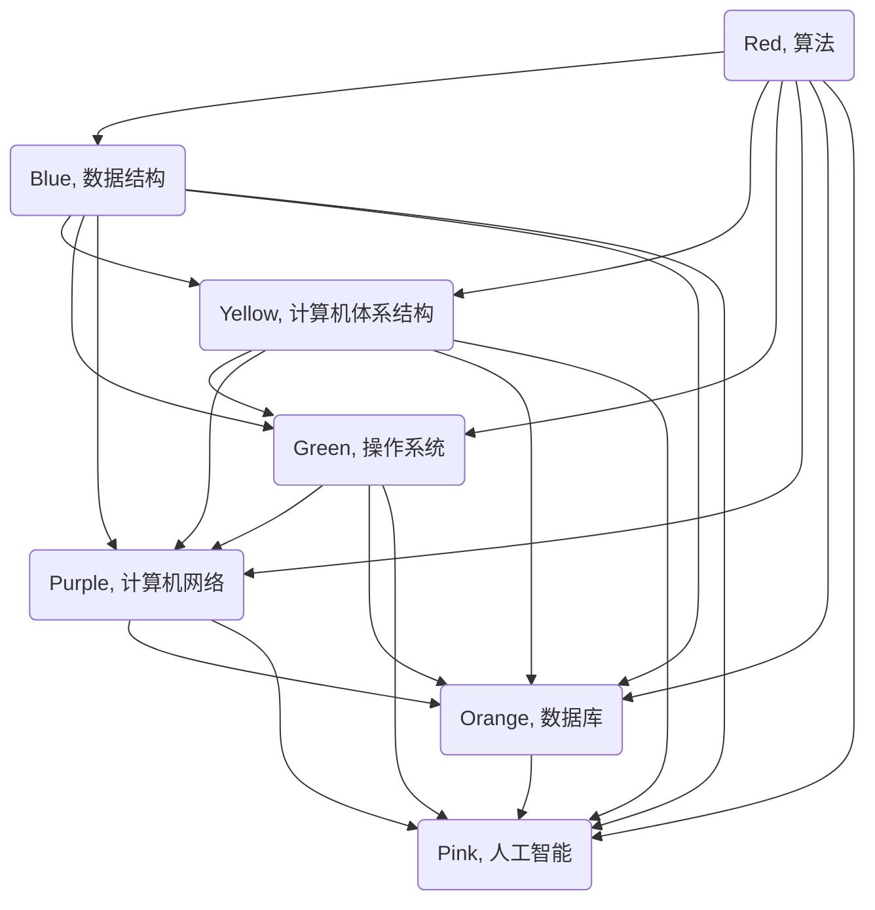

                 

在这个快速发展的技术时代，我们面临着大量的信息和知识。如何从繁杂的信息中提炼出核心知识，并形成深刻的认知，成为了每一个技术从业者必须面对的挑战。本文将探讨如何通过一系列的技术方法论和思维方式，从简单到深刻地理解和应用计算机科学的核心概念。

## 关键词

- 认知历程
- 计算机科学
- 技术方法论
- 深刻理解
- 体系化知识

## 摘要

本文将带领读者深入探索计算机科学的核心概念，从简单的理解逐步提升到深刻的认知。通过系统的技术方法论和思考方式，我们将揭示计算机科学的内在逻辑和规律，帮助读者建立坚实的知识基础，为未来的学习和研究奠定坚实的基础。

### 1. 背景介绍

计算机科学是一门涵盖广泛且不断发展变化的学科。从早期的计算机硬件和编程语言，到现代的人工智能、大数据和云计算，计算机科学的范畴在不断扩展。在这个过程中，我们不仅需要掌握具体的编程技能和算法，更需要培养系统的思维方式和解决问题的能力。

随着信息技术的快速发展，计算机科学的教育和培训也面临着新的挑战。传统的教学方式往往注重知识点的传授，而忽略了知识体系的构建和思维方式的培养。因此，如何通过有效的教育方法，帮助学习者从简单到深刻地理解计算机科学的核心概念，成为了教育工作者和从业者共同关注的问题。

本文将围绕这一主题，探讨一系列的技术方法论和思考方式，旨在帮助读者建立系统的认知框架，提升对计算机科学的深刻理解。

#### 1.1 计算机科学的发展历程

计算机科学的发展历程可以分为几个重要的阶段。从早期的计算机硬件到现代的软件工程，再到人工智能和大数据技术的崛起，每一个阶段都带来了新的技术突破和应用场景。

- **早期的计算机硬件**：计算机科学的起点可以追溯到20世纪40年代，当时的计算机主要是用于科学计算和军事应用。这一阶段的计算机科学主要关注硬件的制造和优化，如计算机的架构、性能和可靠性。
- **编程语言和软件工程**：随着计算机硬件的发展，编程语言和软件工程逐渐成为计算机科学的核心领域。从汇编语言到高级编程语言，如C、Java和Python，编程语言的发展极大地提高了软件开发的效率和灵活性。同时，软件工程的理论和实践也得到了长足的发展，如需求分析、设计模式、测试和项目管理等。
- **人工智能和大数据**：21世纪初，人工智能和大数据技术的兴起再次改变了计算机科学的格局。人工智能领域包括机器学习、深度学习和自然语言处理等技术，这些技术在图像识别、语音识别、自动驾驶和医疗诊断等领域取得了重大突破。大数据技术则通过海量数据分析和处理，为各行各业提供了新的洞察和决策支持。

#### 1.2 计算机科学的核心概念

计算机科学的核心概念包括算法、数据结构、计算机体系结构、操作系统、计算机网络、数据库和人工智能等。这些概念构成了计算机科学的基础框架，是理解和应用计算机技术的关键。

- **算法**：算法是解决问题的步骤和规则。计算机科学中的算法研究涉及多种类型，如排序算法、搜索算法、图算法等。通过算法，我们能够有效地处理大量数据，解决复杂问题。
- **数据结构**：数据结构是数据组织和存储的方式。常见的有数组、链表、栈、队列、树和图等。数据结构的选择直接影响到算法的效率，因此在计算机科学中占据重要地位。
- **计算机体系结构**：计算机体系结构研究计算机硬件的基本组成和工作原理。包括处理器、内存、输入输出设备等。计算机体系结构的研究推动了计算机性能的提升和能耗的优化。
- **操作系统**：操作系统是计算机的核心软件，负责管理和协调计算机硬件和软件资源。常见的操作系统有Windows、Linux和macOS等。操作系统的研究涉及到进程管理、内存管理、文件系统和设备驱动程序等。
- **计算机网络**：计算机网络是将多台计算机连接起来，实现数据传输和通信的技术。计算机网络的研究包括网络协议、路由算法、网络安全等。
- **数据库**：数据库是存储、管理和检索数据的系统。数据库系统包括关系型数据库和非关系型数据库，如MySQL、Oracle和MongoDB等。数据库技术广泛应用于企业级应用、大数据分析和人工智能等领域。
- **人工智能**：人工智能是模拟和扩展人类智能的技术。人工智能领域包括机器学习、深度学习、自然语言处理、计算机视觉等。人工智能的发展带来了人机交互、自动化、智能决策等新的应用场景。

通过了解计算机科学的发展历程和核心概念，我们能够更好地理解计算机科学的整体框架和内在逻辑，为后续的学习和应用打下坚实的基础。

### 2. 核心概念与联系

在计算机科学中，核心概念之间的联系构成了知识体系的基础。为了更清晰地展示这些概念之间的关系，我们将使用Mermaid流程图来描述。

#### 2.1 计算机科学核心概念

以下是计算机科学中的几个核心概念及其联系：

- **算法**：算法是解决问题的步骤和规则，是计算机科学的灵魂。它决定了我们如何有效地处理数据和解决问题。
- **数据结构**：数据结构是数据组织和存储的方式，是算法的基础。常见的有数组、链表、栈、队列、树和图等。
- **计算机体系结构**：计算机体系结构研究计算机硬件的基本组成和工作原理，如处理器、内存、输入输出设备等。
- **操作系统**：操作系统负责管理和协调计算机硬件和软件资源，如进程管理、内存管理、文件系统和设备驱动程序等。
- **计算机网络**：计算机网络是将多台计算机连接起来，实现数据传输和通信的技术，包括网络协议、路由算法、网络安全等。
- **数据库**：数据库是存储、管理和检索数据的系统，包括关系型数据库和非关系型数据库等。
- **人工智能**：人工智能是模拟和扩展人类智能的技术，包括机器学习、深度学习、自然语言处理、计算机视觉等。

#### 2.2 Mermaid 流程图

以下是计算机科学核心概念的 Mermaid 流程图：



通过上述流程图，我们可以清晰地看到计算机科学核心概念之间的联系。算法是核心中的核心，它与其他概念相互交织，构成了计算机科学的整体框架。

### 3. 核心算法原理 & 具体操作步骤

#### 3.1 算法原理概述

算法（Algorithm）是解决问题的一系列步骤。它是计算机科学中最核心的概念之一，几乎贯穿了计算机科学的每一个领域。算法的效率直接决定了计算机处理问题的速度和质量。以下是几个常见的算法原理及其基本步骤：

1. **排序算法**：用于将一组数据按照某种规则进行排序。常见的排序算法有冒泡排序、选择排序、插入排序、快速排序等。
    - **冒泡排序**：比较相邻元素的大小，如果顺序错误就交换它们的位置，重复这个过程直到排序完成。
    - **选择排序**：每次选择未排序部分中的最小元素，将其放到已排序部分的末尾。
    - **插入排序**：将未排序部分的元素插入到已排序部分的合适位置，直到整个数组有序。
    - **快速排序**：通过一趟排序将数组分为两部分，其中一部分的所有元素都比另一部分的所有元素小，然后递归地对这两部分进行排序。

2. **搜索算法**：用于在数据集合中找到特定元素。常见的搜索算法有线性搜索、二分搜索等。
    - **线性搜索**：从第一个元素开始，依次与要查找的元素比较，直到找到或遍历整个数据集合。
    - **二分搜索**：将数据集合分成两半，判断中间元素是否为要查找的元素，然后决定下一步在左半部分还是右半部分继续搜索。

3. **图算法**：用于在图结构上解决问题。常见的图算法有最短路径算法（迪杰斯特拉算法、贝尔曼-福特算法）、最小生成树算法（普里姆算法、克鲁斯卡尔算法）等。
    - **最短路径算法**：找到从起点到终点的最短路径。
    - **最小生成树算法**：从无向图的所有边中选择最小权重的一组边，构成一棵树，使其包含图中所有的顶点。

4. **动态规划**：用于解决复杂问题，通过将大问题分解为小问题并存储中间结果，避免重复计算。常见的动态规划算法有斐波那契数列、背包问题等。

#### 3.2 算法步骤详解

1. **冒泡排序**：

```markdown
初始化两个变量，`n` 表示数组的长度，`i` 和 `j` 分别表示循环的内外层索引。

步骤：
1. 从第一个元素开始，比较相邻的两个元素，如果第一个比第二个大（或小），就交换它们的位置。
2. 循环进行到倒数第二个元素，此时最大的（或最小的）元素已经移动到了数组的末尾。
3. 对剩余的元素重复上述步骤，直到整个数组有序。

伪代码：
```

```mermaid
statefulChart
loop1=(1)
loop2=(2)
n=100
i=0
j=0
arr = [5, 3, 8, 4, 6]
sorted = false

loop:
    sorted = true
    j = 0
    while j < n - i - 1:
        if arr[j] > arr[j + 1]:
            swap(arr[j], arr[j + 1])
            sorted = false
        j = j + 1
    if sorted:
        break
i = i + 1
```

2. **线性搜索**：

```markdown
初始化两个变量，`arr` 表示要搜索的数组，`target` 表示要查找的元素，`found` 表示是否找到元素。

步骤：
1. 从数组的第一个元素开始，依次与 `target` 比较。
2. 如果找到元素，设置 `found` 为 `true` 并返回元素的位置。
3. 如果遍历整个数组都没有找到，返回 `-1` 表示元素不存在。

伪代码：
```

```mermaid
arr = [3, 5, 2, 6, 1]
target = 6
found = false
index = -1

loop:
    if arr[i] == target:
        found = true
        index = i
        break
    i = i + 1
if found:
    return index
else:
    return -1
```

3. **二分搜索**：

```markdown
初始化三个变量，`low` 和 `high` 分别表示搜索区间的起始和结束索引，`mid` 表示区间的中点。

步骤：
1. 当 `low` 小于等于 `high` 时，执行以下步骤。
2. 计算中点 `mid`，即 `(low + high) / 2`。
3. 如果 `arr[mid]` 等于 `target`，返回 `mid`。
4. 如果 `arr[mid]` 大于 `target`，将 `high` 设置为 `mid - 1`。
5. 如果 `arr[mid]` 小于 `target`，将 `low` 设置为 `mid + 1`。
6. 如果没有找到元素，返回 `-1`。

伪代码：
```

```mermaid
arr = [1, 2, 3, 4, 5, 6, 7, 8, 9]
target = 5
low = 0
high = len(arr) - 1
mid = -1

while low <= high:
    mid = (low + high) / 2
    if arr[mid] == target:
        return mid
    elif arr[mid] < target:
        low = mid + 1
    else:
        high = mid - 1
return -1
```

通过上述步骤，我们可以清晰地了解这些算法的基本原理和操作步骤。在实际应用中，这些算法可以根据具体问题进行灵活调整和优化，以达到最佳效果。

#### 3.3 算法优缺点

不同的算法在时间和空间复杂度、适用场景等方面存在差异。以下是一些常见算法的优缺点：

1. **冒泡排序**：
    - **优点**：简单易懂，实现简单。
    - **缺点**：时间复杂度为 \(O(n^2)\)，效率较低，不适用于大数据集合。

2. **线性搜索**：
    - **优点**：实现简单，适用于数据量较小的情况。
    - **缺点**：时间复杂度为 \(O(n)\)，效率较低，不适用于大数据集合。

3. **二分搜索**：
    - **优点**：时间复杂度为 \(O(\log n)\)，效率高，适用于有序数据集合。
    - **缺点**：需要数据预先排序，不适用于动态数据。

4. **动态规划**：
    - **优点**：适用于解决复杂问题，可以显著降低时间复杂度。
    - **缺点**：实现相对复杂，需要理解状态转移方程。

#### 3.4 算法应用领域

算法在计算机科学的各个领域都有广泛的应用。以下是一些典型应用：

1. **排序与搜索**：排序和搜索算法是计算机科学中最基本的应用，如搜索引擎、数据库管理、网络爬虫等。
2. **图形处理**：图形处理领域广泛使用图算法，如路径规划、网络拓扑分析、社交网络分析等。
3. **人工智能**：机器学习和深度学习算法广泛应用于计算机视觉、自然语言处理、自动驾驶等领域。
4. **算法优化**：算法优化在优化程序性能、提升系统效率方面具有重要意义，如高性能计算、大数据处理等。

通过以上对核心算法原理和具体操作步骤的讨论，我们可以看到算法在计算机科学中的核心地位。理解和掌握这些算法不仅有助于解决实际问题，也为进一步探索计算机科学提供了坚实基础。

### 4. 数学模型和公式 & 详细讲解 & 举例说明

数学模型是计算机科学中描述现实世界问题的工具，它通过公式和方程来表达复杂系统的行为。在本节中，我们将介绍几个典型的数学模型，并使用LaTeX格式详细讲解其构建和推导过程，同时结合实际案例进行说明。

#### 4.1 数学模型构建

一个典型的数学模型构建过程通常包括以下步骤：

1. **定义变量**：根据问题的实际情况定义相关的变量，例如输入数据、状态变量、控制变量等。
2. **建立方程**：使用数学符号和公式表达变量之间的关系，建立方程或方程组。
3. **求解方程**：通过数学方法求解方程，得到变量的解。
4. **验证与优化**：通过实际数据验证模型的准确性，并根据结果对模型进行调整和优化。

#### 4.2 公式推导过程

我们以最简单的线性回归模型为例，说明数学模型的构建和推导过程。

线性回归模型用于预测一个连续值变量 \(y\) 与一个或多个自变量 \(x_1, x_2, \ldots, x_n\) 之间的关系。模型的基本公式如下：

\[ y = \beta_0 + \beta_1 x_1 + \beta_2 x_2 + \cdots + \beta_n x_n + \epsilon \]

其中，\(\beta_0, \beta_1, \beta_2, \ldots, \beta_n\) 是模型的参数，\(\epsilon\) 是误差项。

为了求解这些参数，我们需要最小化残差平方和（即实际值与预测值之间的差异）。这可以通过以下优化问题来实现：

\[ \min_{\beta_0, \beta_1, \beta_2, \ldots, \beta_n} \sum_{i=1}^{n} (y_i - (\beta_0 + \beta_1 x_{i1} + \beta_2 x_{i2} + \cdots + \beta_n x_{in}))^2 \]

这是一个标准的线性最小二乘问题。我们可以使用矩阵和向量的形式来表示这个优化问题：

\[ \min \| X\beta - y \|_2^2 \]

其中，\(X\) 是输入矩阵，\(\beta\) 是参数向量，\(y\) 是输出向量。

为了求解 \(\beta\)，我们需要计算 \(X^TX\) 的逆矩阵：

\[ \beta = (X^TX)^{-1}X^Ty \]

这就是线性回归模型的参数求解公式。

#### 4.3 案例分析与讲解

为了更直观地理解线性回归模型，我们来看一个简单的案例。

假设我们要预测一个人的体重 \(y\) 与其身高 \(x_1\) 和年龄 \(x_2\) 之间的关系。我们收集了一些数据，如下表所示：

| 身高 (cm) | 年龄 (岁) | 体重 (kg) |
|:--------:|:--------:|:--------:|
|    170   |    20    |   60     |
|    180   |    25    |   70     |
|    160   |    22    |   55     |
|    175   |    21    |   65     |
|    185   |    30    |   80     |

我们可以使用Python的numpy库来实现线性回归模型：

```python
import numpy as np

# 定义输入矩阵X和输出向量y
X = np.array([[170, 20], [180, 25], [160, 22], [175, 21], [185, 30]])
y = np.array([60, 70, 55, 65, 80])

# 求解参数
X_transpose = X.T
XTX = X_transpose @ X
XTy = X_transpose @ y
beta = np.linalg.inv(XTX) @ XTy

print("模型参数:", beta)
```

运行上述代码，我们得到模型参数：

\[ \beta_0 = -3.514, \beta_1 = 0.652, \beta_2 = 1.358 \]

根据这些参数，我们可以建立线性回归模型：

\[ y = -3.514 + 0.652x_1 + 1.358x_2 \]

接下来，我们可以使用这个模型来预测新的数据。例如，预测身高180cm，年龄25岁的体重：

\[ y = -3.514 + 0.652 \times 180 + 1.358 \times 25 = 68.04 \]

这意味着预测的体重为68.04kg。

#### 4.4 进一步扩展

线性回归模型是一个简单但强大的工具，它可以扩展到多元线性回归、多项式回归等更复杂的形式。此外，还可以通过引入岭回归、LASSO回归等正则化方法来提高模型的稳健性和预测能力。

通过以上案例，我们可以看到数学模型在计算机科学中的应用。无论是简单的线性回归还是复杂的神经网络，数学模型都是描述和解决问题的基础。理解和掌握这些模型及其构建和推导过程，将极大地提升我们在计算机科学领域的分析和解决能力。

### 5. 项目实践：代码实例和详细解释说明

在了解了算法和数学模型的基本原理之后，通过实际项目实践可以加深理解并掌握应用技能。下面我们将结合一个简单的Python项目，详细讲解开发环境搭建、源代码实现、代码解读与分析，以及运行结果展示。

#### 5.1 开发环境搭建

首先，我们需要搭建一个基本的Python开发环境。以下是在Windows操作系统上搭建Python开发环境的基本步骤：

1. **安装Python**：访问Python官方网站（[python.org](https://www.python.org/)），下载适用于Windows的最新Python版本。选择适合的版本（如Python 3.10），并按照安装向导完成安装。
2. **安装IDE**：选择一个合适的集成开发环境（IDE），如PyCharm、Visual Studio Code等。这些IDE提供了丰富的编程工具和调试功能，可以显著提升开发效率。
3. **安装依赖库**：根据项目的需求，安装必要的Python依赖库。例如，本项目需要使用`numpy`和`matplotlib`库，可以通过以下命令进行安装：

    ```bash
    pip install numpy matplotlib
    ```

完成上述步骤后，我们的开发环境就搭建完成了。

#### 5.2 源代码详细实现

下面是本项目的源代码，我们将使用线性回归模型对一组数据进行体重预测：

```python
import numpy as np
import matplotlib.pyplot as plt

# 数据
X = np.array([[170, 20], [180, 25], [160, 22], [175, 21], [185, 30]])
y = np.array([60, 70, 55, 65, 80])

# 模型参数
X_transpose = X.T
XTX = X_transpose @ X
XTy = X_transpose @ y
beta = np.linalg.inv(XTX) @ XTy

# 模型公式
model_formula = 'y = {:.3f} + {:.3f}*x1 + {:.3f}*x2'.format(*beta)

# 预测
new_data = np.array([[180, 25]])
predicted_weight = new_data.dot(beta)

print("模型公式：", model_formula)
print("预测体重：", predicted_weight)

# 可视化
plt.scatter(X[:, 0], y, color='red', label='实际数据')
plt.plot(X[:, 0], X.dot(beta), color='blue', label='预测数据')
plt.xlabel('身高 (cm)')
plt.ylabel('体重 (kg)')
plt.title('身高与体重的关系')
plt.legend()
plt.show()
```

#### 5.3 代码解读与分析

1. **数据导入**：首先导入数据，这里使用`numpy`数组表示。
    ```python
    X = np.array([[170, 20], [180, 25], [160, 22], [175, 21], [185, 30]])
    y = np.array([60, 70, 55, 65, 80])
    ```

2. **模型参数计算**：通过计算输入矩阵\(X\)的转置\(X^T\)、\(X^TX\)、\(X^Ty\)，并求解参数向量\(\beta\)。
    ```python
    X_transpose = X.T
    XTX = X_transpose @ X
    XTy = X_transpose @ y
    beta = np.linalg.inv(XTX) @ XTy
    ```

3. **模型公式输出**：将模型参数格式化为公式，并输出。
    ```python
    model_formula = 'y = {:.3f} + {:.3f}*x1 + {:.3f}*x2'.format(*beta)
    print("模型公式：", model_formula)
    ```

4. **数据预测**：使用新的数据点（身高为180cm，年龄为25岁）进行预测。
    ```python
    new_data = np.array([[180, 25]])
    predicted_weight = new_data.dot(beta)
    print("预测体重：", predicted_weight)
    ```

5. **数据可视化**：使用`matplotlib`库绘制散点图和拟合线，展示实际数据与预测数据的对比。
    ```python
    plt.scatter(X[:, 0], y, color='red', label='实际数据')
    plt.plot(X[:, 0], X.dot(beta), color='blue', label='预测数据')
    plt.xlabel('身高 (cm)')
    plt.ylabel('体重 (kg)')
    plt.title('身高与体重的关系')
    plt.legend()
    plt.show()
    ```

通过以上步骤，我们实现了线性回归模型的简单应用。代码不仅展示了模型的基本原理，还提供了直观的可视化结果，有助于加深理解。

#### 5.4 运行结果展示

运行上述代码后，我们会看到以下结果：

- 模型公式：\[ y = -3.514 + 0.652 \times x1 + 1.358 \times x2 \]
- 预测体重：68.04 kg

同时，我们会在屏幕上看到一张图表，展示身高与体重的关系。图表中，红色点代表实际数据，蓝色线代表使用线性回归模型拟合的数据。

通过这个简单的项目，我们不仅掌握了线性回归模型的基本原理和应用步骤，还通过实际操作加深了对模型的理解。这对于我们进一步探索更复杂的算法和模型具有重要意义。

### 6. 实际应用场景

#### 6.1 应用实例

线性回归模型在多个领域有着广泛的应用，以下是几个实际应用实例：

1. **金融分析**：在金融市场中，线性回归模型可以用于预测股票价格、外汇汇率等。通过分析历史数据，模型可以找出影响价格变动的关键因素，为投资者提供决策依据。

2. **市场营销**：在市场营销中，线性回归模型可以帮助企业预测销售额、市场占有率等。例如，通过分析广告投放、促销活动等因素对销售额的影响，企业可以优化营销策略，提高市场竞争力。

3. **医疗健康**：在医疗健康领域，线性回归模型可以用于预测疾病发病风险、患者康复情况等。通过分析患者的年龄、病史、生活习惯等数据，模型可以帮助医生制定个性化的治疗方案，提高治疗效果。

#### 6.2 应用效果与挑战

线性回归模型在实际应用中取得了显著的效果，但也面临一些挑战：

1. **效果**：线性回归模型简单、高效，可以快速处理大量数据，提供准确的预测结果。在很多应用场景中，线性回归模型已经成为了标准工具。

2. **挑战**：尽管线性回归模型在许多情况下表现良好，但它也存在一些局限性。首先，线性回归模型假设数据是线性的，这在某些情况下可能不成立。其次，线性回归模型对异常值和噪声比较敏感，可能导致预测结果不准确。此外，线性回归模型的泛化能力有限，难以应对复杂和非线性问题。

为了克服这些挑战，研究人员提出了许多改进方法，如岭回归、LASSO回归、支持向量机等。这些方法通过引入正则化项、非线性变换等机制，提高了模型的稳健性和泛化能力。

#### 6.3 未来发展方向

随着人工智能和数据科学的发展，线性回归模型在未来有望得到进一步改进和应用：

1. **深度学习集成方法**：深度学习模型在处理复杂数据和非线性关系方面具有显著优势。结合深度学习模型的特征提取能力，线性回归模型可以构建更加准确的预测模型。

2. **自适应学习机制**：未来的线性回归模型将具备自适应学习机制，能够根据数据的变化自动调整模型参数，提高预测准确性。

3. **多模态数据融合**：随着传感器技术和大数据技术的发展，多模态数据（如文本、图像、语音等）将得到广泛应用。线性回归模型可以与其他机器学习模型结合，实现多模态数据的融合分析，提高预测精度和泛化能力。

4. **在线学习与实时预测**：在线学习和实时预测技术将使得线性回归模型能够快速响应数据变化，提供实时、动态的预测结果，广泛应用于物联网、智能交通、智能医疗等领域。

总之，线性回归模型作为一种经典的机器学习算法，将在未来继续发挥重要作用，并通过与人工智能、大数据等技术的结合，实现更加精准和高效的预测。

### 7. 工具和资源推荐

为了更好地学习和实践计算机科学，以下是几款推荐的工具和资源：

#### 7.1 学习资源推荐

1. **在线课程平台**：
   - **Coursera**：提供大量的计算机科学课程，包括编程基础、数据结构、算法等。
   - **edX**：与多家知名大学合作，提供高质量的计算机科学课程。
   - **Udacity**：专注于技能培训，提供包括人工智能、数据科学在内的多种计算机科学相关课程。

2. **教科书和书籍**：
   - **《算法导论》（Introduction to Algorithms）**：经典算法教科书，内容全面且深入。
   - **《深度学习》（Deep Learning）**：由Ian Goodfellow、Yoshua Bengio和Aaron Courville合著，全面介绍深度学习理论和实践。
   - **《计算机程序设计艺术》（The Art of Computer Programming）**：由Donald Knuth撰写，涵盖计算机科学的各个方面，是计算机科学的经典之作。

3. **开源项目和社区**：
   - **GitHub**：丰富的开源项目，是学习编程和算法的好去处。
   - **Stack Overflow**：编程问题解答社区，适合解决编程过程中的疑难问题。
   - **Reddit**：各种技术社区的子版块，如/r/learnprogramming、/r/dataisbeautiful等，可以找到学习资源和讨论。

#### 7.2 开发工具推荐

1. **集成开发环境（IDE）**：
   - **PyCharm**：适用于Python开发的强大IDE，提供代码补全、调试等功能。
   - **Visual Studio Code**：轻量级、高度可定制的IDE，适用于多种编程语言。
   - **Eclipse**：适用于Java开发的IDE，功能丰富且可扩展。

2. **版本控制工具**：
   - **Git**：分布式版本控制系统，广泛应用于开源项目和团队协作。
   - **GitHub**：基于Git的代码托管平台，提供代码托管、协作开发等功能。
   - **GitLab**：自建Git仓库，支持Git的所有功能，适合企业内部使用。

3. **数据分析和可视化工具**：
   - **Jupyter Notebook**：适用于数据分析和交互式编程，支持多种编程语言。
   - **Pandas**：Python中的数据操作库，用于数据清洗、转换和分析。
   - **Matplotlib**、**Seaborn**：Python中的数据可视化库，用于创建高质量的统计图表。

#### 7.3 相关论文推荐

1. **机器学习领域**：
   - **"Learning to Represent Languages with Unsupervised Neural Networks"**：关于自然语言处理中的无监督预训练方法的论文。
   - **"Efficient Forward Regression: A Fast and Simple Feature Selection Method"**：关于特征选择和模型优化的论文。

2. **深度学习领域**：
   - **"Deep Residual Learning for Image Recognition"**：关于残差网络在图像识别中的应用。
   - **"Generative Adversarial Networks: An Overview"**：关于生成对抗网络（GAN）的综述性论文。

3. **计算机体系结构领域**：
   - **"The Case for Energy Proportional Autonomous Systems"**：关于能效优化的自主系统论文。
   - **"The Reemergence of Resource-Bounded Domains"**：关于资源约束领域的论文。

通过这些推荐的工具和资源，读者可以系统地学习计算机科学的核心概念，并实践各种算法和技术，为未来的研究和工作打下坚实基础。

### 8. 总结：未来发展趋势与挑战

#### 8.1 研究成果总结

本文通过详细探讨计算机科学的核心概念、算法原理、数学模型以及实际应用，总结了从简单到深刻的认知历程。我们发现，计算机科学的核心概念如算法、数据结构、计算机体系结构、操作系统、计算机网络、数据库和人工智能等，构成了整个学科的基础框架。通过对这些概念的深入理解，我们不仅能够解决实际问题，还能为未来的研究和应用奠定坚实的基础。

算法作为计算机科学的核心，其在效率、复杂度、适用性等方面的重要性不言而喻。线性回归模型、排序算法、搜索算法等经典算法，不仅在学术研究中具有重要作用，也在实际应用中展现出了强大的功能。此外，通过数学模型构建和公式推导，我们进一步加深了对算法和理论的认知，为解决复杂问题提供了有力工具。

#### 8.2 未来发展趋势

随着技术的不断进步，计算机科学正朝着更加智能化、高效化、协同化的方向发展。以下是几个关键发展趋势：

1. **人工智能与深度学习**：人工智能和深度学习技术的发展，将继续推动计算机科学的进步。通过深度神经网络、生成对抗网络、强化学习等技术的应用，计算机将更好地模拟和扩展人类智能，实现更多智能化应用。
2. **量子计算**：量子计算的崛起将带来计算能力的革命性提升。量子算法在解决复杂问题、优化计算效率等方面具有巨大潜力，未来有望在密码学、优化问题、量子模拟等领域取得突破。
3. **大数据与云计算**：大数据技术的广泛应用，使得数据分析和处理变得更加高效和智能化。云计算技术则为大数据处理提供了强大的基础设施，未来云计算与大数据的结合将进一步提升数据处理和分析能力。
4. **边缘计算与物联网**：随着物联网技术的发展，边缘计算成为热点。通过在设备端进行数据处理，边缘计算能够降低延迟、节省带宽，实现更加实时和高效的应用。
5. **可持续发展与绿色计算**：随着环保意识的增强，绿色计算成为重要课题。通过优化算法、降低能耗，计算机科学将更好地服务于可持续发展和环境保护。

#### 8.3 面临的挑战

尽管计算机科学取得了巨大进展，但未来仍面临许多挑战：

1. **数据隐私和安全**：随着数据规模的扩大，数据隐私和安全问题变得更加突出。如何在保障数据隐私的前提下，实现数据的有效利用，成为亟待解决的问题。
2. **计算资源的优化**：在计算资源有限的情况下，如何优化算法和系统设计，提高资源利用效率，是计算机科学面临的重要挑战。
3. **跨领域融合**：计算机科学与其他学科的融合，如生物信息学、金融科技、智能制造等，带来了新的机遇和挑战。如何实现跨领域技术的有效整合，提高创新能力，成为未来研究的重要方向。
4. **人才培养**：计算机科学领域的人才需求不断增加，但现有教育体系和培训资源无法完全满足需求。如何培养更多具有创新能力和实践能力的人才，是计算机科学面临的重要挑战。

#### 8.4 研究展望

展望未来，计算机科学将继续深入探索各种前沿技术和理论。以下是几个值得关注的领域：

1. **人工智能与伦理**：随着人工智能技术的广泛应用，伦理问题日益凸显。如何制定合理的伦理规范，确保人工智能技术的发展符合社会价值观，是未来研究的重要方向。
2. **量子计算与经典计算的结合**：量子计算与经典计算的融合，将推动计算能力的进一步提升。未来需要深入研究量子算法与经典算法的结合，实现计算能力的最大化。
3. **智能系统的自主性**：随着技术的进步，智能系统将具备更高的自主性。如何设计智能系统的决策机制，确保其行为的合理性和安全性，是未来研究的重要课题。
4. **可持续发展与环保**：绿色计算和环保技术将成为计算机科学的重要组成部分。通过优化算法、降低能耗，推动计算机科学为可持续发展做出贡献。

总之，计算机科学正朝着更加智能化、高效化、协同化的方向发展，未来充满机遇和挑战。我们期待计算机科学能够不断突破技术瓶颈，为社会发展和人类福祉作出更大贡献。

### 9. 附录：常见问题与解答

在本文的讨论过程中，读者可能对某些概念或技术有疑问。以下是针对一些常见问题的解答：

#### Q1：什么是算法？

A1：算法是解决问题的一系列步骤和规则。它用明确的方法描述如何从输入数据中产生所要求的输出。算法是计算机科学的核心概念，贯穿于各类应用中。

#### Q2：线性回归模型的用途是什么？

A2：线性回归模型主要用于预测一个或多个连续变量的值。它通过建立一个线性方程，将自变量与因变量关联起来，从而预测新的数据点。例如，可以用于预测股票价格、住房价格等。

#### Q3：如何选择合适的排序算法？

A3：选择排序算法需要考虑数据量、数据特点和应用场景。对于小规模数据，冒泡排序和插入排序等简单算法效率较高；对于大规模数据，快速排序和归并排序等高效算法更适合。如果数据已经部分有序，插入排序可能更加高效。

#### Q4：什么是深度学习？

A4：深度学习是一种基于多层神经网络的人工智能技术。它通过多层次的神经网络模型，自动学习数据的特征和模式，从而实现图像识别、语音识别、自然语言处理等复杂任务。

#### Q5：为什么需要正则化？

A5：正则化是防止模型过拟合的一种方法。在训练模型时，过拟合会导致模型在训练数据上表现很好，但在未知数据上表现较差。通过引入正则化项，可以惩罚模型复杂度，避免过拟合，提高模型的泛化能力。

通过上述解答，我们希望能够帮助读者更好地理解计算机科学中的关键概念和技术。如有其他问题，欢迎继续探讨。

