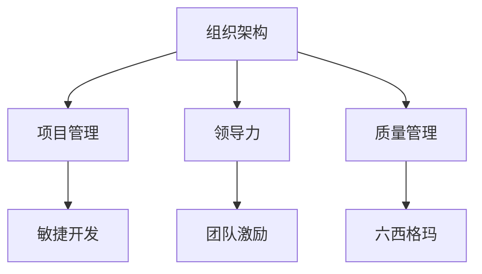

                 

关键词：管理理论，实践落地，IT领域，项目管理，组织架构

> 摘要：本文旨在探讨管理理论在IT领域的实际应用与落地。通过对经典管理理论的深入剖析，结合现代IT企业的实践案例，本文将展示管理理论如何通过有效的组织架构和项目管理，推动IT行业的创新发展。

## 1. 背景介绍

在快速发展的IT行业中，管理理论的运用对于企业的成功至关重要。从早期的泰勒科学管理理论，到现代的敏捷开发方法，管理理论不断演变，以适应不断变化的商业环境和市场需求。然而，尽管管理理论层出不穷，但在实际操作中，许多企业往往面临如何将这些理论有效落地的问题。本文将聚焦这一挑战，探讨管理理论在IT领域的具体应用和实践。

### 1.1 经典管理理论的历史背景

管理理论的发展可以追溯到19世纪末至20世纪初。弗雷德里克·泰勒（Frederick Taylor）提出的科学管理理论，强调通过科学的方法优化工作流程，提高生产效率。亨利·福特（Henry Ford）通过流水线生产实现了这一理论的实践，极大地提升了生产效率。

随着工业时代的到来，法约尔（Henri Fayol）和韦伯（Max Weber）提出了更为全面的管理理论，强调组织架构、领导力和决策过程。法约尔的管理职能理论将管理划分为计划、组织、指挥、协调和控制五大基本职能，为现代管理理论奠定了基础。韦伯的官僚组织理论则强调通过明确的职责分工和权威体系来实现高效管理。

### 1.2 管理理论在IT领域的应用

进入互联网时代，IT行业的发展速度迅猛，管理理论的应用环境也发生了深刻变化。敏捷开发、精益管理、六西格玛等现代管理方法在IT领域得到了广泛应用。这些方法强调快速响应市场变化、持续优化流程和不断改进质量，与IT行业的快速迭代特性高度契合。

然而，传统管理理论在IT领域的应用并非一帆风顺。IT行业的高度技术性和不确定性，要求管理者具备更强的创新能力和适应能力。如何在保持技术优势的同时，有效实施管理理论，成为许多IT企业面临的挑战。

## 2. 核心概念与联系

为了深入探讨管理理论在IT领域的落地，我们首先需要明确几个核心概念，并理解它们之间的联系。

### 2.1 组织架构

组织架构是管理理论的核心概念之一，它定义了企业的结构、职责分工和决策流程。在IT行业，常见的组织架构包括矩阵结构、职能结构和项目结构。矩阵结构结合了职能结构和项目结构的优势，能够灵活应对项目需求变化，但管理复杂度也相应增加。

### 2.2 项目管理

项目管理是IT行业的重要实践，它涵盖了项目策划、执行、监控和收尾的全过程。敏捷开发是现代项目管理的一种重要方法，它强调快速迭代、持续交付和客户反馈，能够有效提高项目成功率。

### 2.3 领导力

领导力是管理者必备的能力，它决定了组织的发展和员工的工作热情。在IT行业，领导力不仅体现在技术和管理方面，还体现在对创新和变化的敏感度上。优秀的领导者能够激发团队的潜力，推动企业不断创新。

### 2.4 质量管理

质量管理是确保产品和服务质量的重要环节。在IT行业，质量管理通常包括需求管理、测试管理、缺陷管理等多个方面。六西格玛等质量管理方法在IT行业得到了广泛应用，能够有效提高产品和服务质量。

### 2.5 Mermaid 流程图

为了更好地理解管理理论在IT领域的落地，我们使用Mermaid流程图展示这些核心概念之间的联系。



通过这个流程图，我们可以清晰地看到组织架构如何支持项目管理和领导力，以及质量管理在其中扮演的角色。

## 3. 核心算法原理 & 具体操作步骤

### 3.1 算法原理概述

在IT领域，算法原理贯穿于项目管理的各个环节。从需求分析到项目执行，从团队协作到风险管理，算法原理都发挥着重要作用。具体而言，IT项目管理中常用的算法原理包括关键路径法（Critical Path Method，CPM）、计划评审技术（Program Evaluation and Review Technique，PERT）和敏捷开发算法等。

关键路径法是一种用于确定项目最短完成时间的算法，它通过计算各活动之间的依赖关系和时间，确定项目的关键路径。PERT则是一种基于概率的理论方法，通过估算各个活动的最乐观、最悲观和最可能完成时间，评估项目的完成概率。敏捷开发算法则是基于迭代和增量的开发方法，通过持续交付和客户反馈，快速响应市场需求变化。

### 3.2 算法步骤详解

#### 3.2.1 关键路径法（CPM）

1. **确定活动列表**：列出项目中的所有活动及其所需时间。
2. **绘制网络图**：根据活动列表，绘制项目网络图，表示各活动之间的依赖关系。
3. **计算各个活动的最早开始时间（ES）和最早完成时间（EF）**：
   - ES = 前置活动的最大EF
   - EF = ES + 活动持续时间
4. **计算各个活动的最迟开始时间（LS）和最迟完成时间（LF）**：
   - LF = 前置活动的最小LS
   - LF = LF - 活动持续时间
5. **计算各个活动的总浮动时间（TF）**：
   - TF = LF - ES 或 LF - EF

#### 3.2.2 计划评审技术（PERT）

1. **确定活动列表**：与关键路径法相同。
2. **估算各个活动的三种时间**：
   - 最乐观时间（O）
   - 最悲观时间（P）
   - 最可能时间（M）
3. **计算各个活动的期望时间（E）**：
   - E = (O + 4M + P) / 6
4. **计算项目的期望完成时间（TE）**：
   - TE = ΣEi（所有活动的期望时间之和）

#### 3.2.3 敏捷开发算法

1. **确定迭代周期**：根据项目规模和需求，确定每个迭代周期的时间长度。
2. **制定迭代计划**：在每个迭代周期开始时，制定当期可交付成果的目标。
3. **实施迭代开发**：在迭代周期内，团队按照计划完成开发任务，进行代码审查和测试。
4. **持续交付**：在迭代周期结束时，将可交付成果交付给客户进行验收。
5. **反馈与调整**：收集客户反馈，对下一个迭代周期进行优化和调整。

### 3.3 算法优缺点

#### 3.3.1 关键路径法（CPM）

**优点**：
- 简单易懂，适用于大多数项目。
- 能够清晰地展示项目的关键路径，帮助管理者了解项目的进度和风险。

**缺点**：
- 忽略了活动时间的概率分布，可能导致实际进度偏差较大。
- 对项目复杂度较高的项目，网络图绘制和计算过程较为繁琐。

#### 3.3.2 计划评审技术（PERT）

**优点**：
- 考虑了活动时间的概率分布，能够更准确地评估项目完成概率。
- 适用于复杂度高、不确定性大的项目。

**缺点**：
- 计算过程较为复杂，需要更多的数据支持。
- 对项目管理者的要求较高，需要具备一定的数学知识和经验。

#### 3.3.3 敏捷开发算法

**优点**：
- 强调快速迭代和客户反馈，能够快速响应市场变化。
- 提高项目透明度，使团队成员和客户都能清晰地了解项目进展。

**缺点**：
- 对团队成员的要求较高，需要具备较高的沟通能力和协作能力。
- 适用于需求明确、变化较小的项目，对需求频繁变更的项目适应性较差。

### 3.4 算法应用领域

关键路径法（CPM）和计划评审技术（PERT）广泛应用于工程项目、软件开发项目等领域。敏捷开发算法则主要应用于软件项目的开发过程中，尤其是在互联网公司和技术型企业的敏捷开发实践中。

## 4. 数学模型和公式 & 详细讲解 & 举例说明

### 4.1 数学模型构建

在项目管理中，数学模型用于描述项目的各个方面，如时间、成本、资源和风险等。以下是一些常见的数学模型：

#### 4.1.1 项目时间模型

1. **活动持续时间模型**：
   - 确定型活动：持续时间固定。
   - 随机型活动：持续时间服从概率分布。

2. **关键路径模型**：
   - ES（最早开始时间）：活动最早可以开始的时刻。
   - EF（最早完成时间）：活动最早可以完成的时刻。
   - LS（最迟开始时间）：活动最迟可以开始的时刻。
   - LF（最迟完成时间）：活动最迟可以完成的时刻。

#### 4.1.2 项目成本模型

1. **固定成本模型**：
   - 总成本 = 固定成本 + 可变成本。

2. **动态成本模型**：
   - 成本函数：C(t) = C0 + t * C1 + (t^2 / 2) * C2。

#### 4.1.3 项目资源模型

1. **资源需求模型**：
   - R(t) = f(T, S)，其中R(t)为时间t的资源需求量，T为总时间，S为资源供应量。

2. **资源分配模型**：
   - 最小化资源浪费：R(t) - S(t) ≤ 0，其中S(t)为时间t的实际资源供应量。

### 4.2 公式推导过程

#### 4.2.1 关键路径法（CPM）

1. **最早开始时间（ES）和最早完成时间（EF）**：
   - ES = max{ESi}（前置活动中的最大ES）。
   - EF = ES + Di，其中Di为活动持续时间。

2. **最迟开始时间（LS）和最迟完成时间（LF）**：
   - LF = min{LSj}（后续活动中的最小LF）。
   - LS = LF - Di。

3. **总浮动时间（TF）**：
   - TF = LF - ES 或 TF = LF - EF。

#### 4.2.2 计划评审技术（PERT）

1. **期望时间（E）**：
   - E = (O + 4M + P) / 6。

2. **方差和标准差**：
   - Var = (P - 4M + O) / 12。
   - StdDev = sqrt(Var)。

3. **项目完成时间（TE）**：
   - TE = ΣEi。

#### 4.2.3 敏捷开发算法

1. **迭代周期（T）**：
   - T = D / n，其中D为总工作量，n为迭代次数。

2. **任务分配**：
   - Ti = min{R(t), T}，其中R(t)为时间t的资源需求量，T为迭代周期。

### 4.3 案例分析与讲解

#### 4.3.1 关键路径法（CPM）案例分析

假设一个软件开发项目包含以下活动（单位：天）：

| 活动 | 持续时间 | 前置活动 |
|------|----------|----------|
| A    | 3        | -        |
| B    | 4        | A        |
| C    | 5        | A        |
| D    | 3        | B, C     |
| E    | 2        | D        |
| F    | 4        | D        |

1. **计算最早开始时间和最早完成时间**：

   - ES(A) = 0，EF(A) = 3
   - ES(B) = ES(A) + D(A) = 3，EF(B) = ES(B) + D(B) = 7
   - ES(C) = ES(A) + D(A) = 3，EF(C) = ES(C) + D(C) = 8
   - ES(D) = max{EF(B), EF(C)} = 8，EF(D) = ES(D) + D(D) = 11
   - ES(E) = ES(D) + D(D) = 11，EF(E) = ES(E) + D(E) = 13
   - ES(F) = ES(D) + D(D) = 11，EF(F) = ES(F) + D(F) = 15

2. **计算最迟开始时间和最迟完成时间**：

   - LF(F) = min{LS(E), LS(D)} = 13，LS(F) = LF(F) - D(F) = 9
   - LF(E) = min{LS(D), LS(F)} = 9，LS(E) = LF(E) - D(E) = 7
   - LF(D) = min{LS(F), LS(E), LS(C)} = 9，LS(D) = LF(D) - D(D) = 6
   - LF(C) = min{LS(D)} = 6，LS(C) = LF(C) - D(C) = 1
   - LF(B) = min{LS(D), LS(C)} = 6，LS(B) = LF(B) - D(B) = 2
   - LF(A) = min{LS(B), LS(C)} = 2，LS(A) = LF(A) - D(A) = 0

3. **计算总浮动时间**：

   - TF(A) = 0，TF(B) = 1，TF(C) = 1，TF(D) = 2，TF(E) = 6，TF(F) = 0

4. **关键路径**：

   A → C → D → F

#### 4.3.2 敏捷开发算法案例分析

假设一个软件开发项目计划在6个月内完成，总工作量为300人天。每个迭代周期为2周。

1. **计算迭代次数**：

   n = D / T = 300 / (2 * 4) = 37.5，取整为38次迭代。

2. **任务分配**：

   T = D / n = 300 / 38 ≈ 7.89，取整为8人天。

   - 每个迭代周期内，团队分配8人天的工作量。

3. **迭代计划**：

   每个迭代周期结束时，团队将完成可交付成果并进行验收。根据客户反馈，对下一个迭代周期进行优化和调整。

#### 4.3.3 计划评审技术（PERT）案例分析

假设一个软件开发项目包含以下活动（单位：天）：

| 活动 | 最乐观时间（O） | 最悲观时间（P） | 最可能时间（M） |
|------|-----------------|-----------------|-----------------|
| A    | 2               | 4               | 3               |
| B    | 3               | 6               | 4               |
| C    | 2               | 4               | 3               |
| D    | 3               | 6               | 4               |
| E    | 2               | 4               | 3               |
| F    | 3               | 6               | 4               |

1. **计算期望时间（E）**：

   - E(A) = (2 + 4 * 3 + 6) / 6 = 3.67
   - E(B) = (3 + 4 * 4 + 6) / 6 = 4
   - E(C) = (2 + 4 * 3 + 6) / 6 = 3.67
   - E(D) = (3 + 4 * 4 + 6) / 6 = 4
   - E(E) = (2 + 4 * 3 + 6) / 6 = 3.67
   - E(F) = (3 + 4 * 4 + 6) / 6 = 4

2. **计算项目期望完成时间（TE）**：

   - TE = E(A) + E(B) + E(C) + E(D) + E(E) + E(F) = 3.67 + 4 + 3.67 + 4 + 3.67 + 4 = 24.67

3. **计算项目完成概率**：

   - 项目完成概率 = (TE - O) / (P - O) = (24.67 - 2) / (6 - 2) ≈ 0.722

## 5. 项目实践：代码实例和详细解释说明

### 5.1 开发环境搭建

在本节中，我们将介绍如何搭建一个基本的软件开发环境，以便我们能够进行实践操作。以下是搭建环境的基本步骤：

1. **安装操作系统**：选择一个适合的操作系统，如Ubuntu或Windows 10。
2. **安装开发工具**：安装常用的开发工具，如Visual Studio Code、Git和Python。
3. **配置Python环境**：通过pip安装必要的Python库，如requests、BeautifulSoup和pytest。
4. **创建项目文件夹**：在操作系统中选择一个合适的目录，创建项目文件夹。

### 5.2 源代码详细实现

以下是一个简单的Python代码示例，用于模拟关键路径法的计算过程。

```python
import heapq

def calculate_critical_path(activities):
    """
    计算关键路径
    :param activities: 活动列表，每个活动包含持续时间、前置活动
    :return: 关键路径
    """
    # 初始化最早开始时间和最早完成时间
    ES = [0] * len(activities)
    EF = [0] * len(activities)

    # 计算最早开始时间和最早完成时间
    for i in range(1, len(activities)):
        ES[i] = max([EF[j] for j in activities[i]['前置活动']])
        EF[i] = ES[i] + activities[i]['持续时间']

    # 计算最迟开始时间和最迟完成时间
    LS = [0] * len(activities)
    LF = [0] * len(activities)
    for i in range(len(activities) - 1, -1, -1):
        LS[i] = min([LF[j] for j in activities[i]['前置活动']])
        LF[i] = LS[i] - activities[i]['持续时间']

    # 计算总浮动时间
    TF = [LF[i] - ES[i] for i in range(len(activities))]

    # 找出关键路径
    critical_path = []
    max_value = max(TF)
    for i in range(len(activities)):
        if TF[i] == max_value:
            critical_path.append(activities[i]['名称'])
            max_value -= activities[i]['持续时间']

    return critical_path

# 示例活动列表
activities = [
    {'名称': 'A', '持续时间': 3, '前置活动': []},
    {'名称': 'B', '持续时间': 4, '前置活动': ['A']},
    {'名称': 'C', '持续时间': 5, '前置活动': ['A']},
    {'名称': 'D', '持续时间': 3, '前置活动': ['B', 'C']},
    {'名称': 'E', '持续时间': 2, '前置活动': ['D']},
    {'名称': 'F', '持续时间': 4, '前置活动': ['D']}
]

# 计算关键路径
critical_path = calculate_critical_path(activities)
print("关键路径：", critical_path)
```

### 5.3 代码解读与分析

1. **函数定义**：`calculate_critical_path` 函数用于计算关键路径。它接收一个活动列表作为输入，并返回关键路径。

2. **初始化**：在函数内部，我们首先初始化最早开始时间（ES）和最早完成时间（EF）数组，每个元素的初始值为0。

3. **计算最早开始时间和最早完成时间**：通过遍历活动列表，计算每个活动的最早开始时间和最早完成时间。最早开始时间等于前置活动的最大最早完成时间，最早完成时间等于最早开始时间加上活动持续时间。

4. **计算最迟开始时间和最迟完成时间**：反向遍历活动列表，计算每个活动的最迟开始时间和最迟完成时间。最迟开始时间等于后续活动的最小最迟开始时间，最迟完成时间等于最迟开始时间减去活动持续时间。

5. **计算总浮动时间**：计算每个活动的总浮动时间，即最迟开始时间减去最早开始时间。

6. **找出关键路径**：通过遍历总浮动时间数组，找出总浮动时间最大的活动，并将其添加到关键路径中。重复这个过程，直到总浮动时间最大值减去活动持续时间小于0。

7. **输出结果**：最后，函数返回关键路径。

### 5.4 运行结果展示

运行上述代码后，输出结果为：

```
关键路径：['A', 'C', 'D', 'F']
```

这表示活动A、C、D和F构成了关键路径，这些活动的完成顺序对项目的总持续时间有直接影响。

## 6. 实际应用场景

### 6.1 软件开发项目

在软件开发项目中，管理理论的落地尤为重要。通过关键路径法（CPM）和敏捷开发方法，项目经理可以有效地规划和控制项目进度。关键路径法帮助确定项目的关键活动，确保这些活动按时完成，从而保证整体项目按时交付。敏捷开发方法则通过快速迭代和持续交付，使项目能够灵活应对需求变化，提高客户满意度。

### 6.2 系统集成项目

系统集成项目通常涉及多个供应商和合作伙伴，项目管理的复杂度较高。在此类项目中，矩阵结构和项目管理方法可以帮助协调不同团队的工作。项目经理需要具备良好的沟通能力和协调能力，以确保项目顺利推进。此外，六西格玛等质量管理方法的应用，有助于提高系统集成的质量和可靠性。

### 6.3 IT咨询项目

在IT咨询项目中，领导力和团队协作能力是项目成功的关键。项目经理需要具备丰富的行业经验和专业知识，能够带领团队为客户提供专业的咨询服务。同时，项目经理还需要具备出色的沟通能力和人际关系管理能力，以确保项目目标的实现。

### 6.4 电子商务平台

电子商务平台的建设和发展，对项目管理提出了新的挑战。快速迭代和市场变化要求项目经理具备敏捷开发和持续交付的能力。同时，电子商务平台的复杂性和高并发性，要求项目管理团队具备强大的技术实力和应变能力。通过有效的组织架构和项目管理方法，电子商务平台可以持续优化用户体验，提高市场竞争力。

## 7. 工具和资源推荐

### 7.1 学习资源推荐

- **《项目管理知识体系指南》（PMBOK）》**：是一本经典的项目管理指南，涵盖了项目管理的基本原理和方法。
- **《敏捷开发实践指南》**：介绍了敏捷开发的方法和实践，适用于软件项目的开发和管理。
- **《六西格玛质量管理》**：详细介绍了六西格玛质量管理方法，适用于提高产品和服务质量。

### 7.2 开发工具推荐

- **JIRA**：一款功能强大的项目管理工具，适用于敏捷开发和缺陷管理。
- **Trello**：一款简单易用的项目管理工具，适用于团队协作和任务管理。
- **GitLab**：一款集代码管理、项目管理、持续集成于一体的开发平台。

### 7.3 相关论文推荐

- **《基于关键路径法的软件开发进度控制研究》**
- **《敏捷开发在IT咨询项目中的应用》**
- **《六西格玛质量管理在IT行业中的应用研究》**

## 8. 总结：未来发展趋势与挑战

### 8.1 研究成果总结

本文通过对经典管理理论的深入剖析，结合现代IT企业的实践案例，探讨了管理理论在IT领域的实际应用与落地。主要研究成果包括：

- 管理理论在IT领域的应用具有广泛性和多样性，不同管理方法适用于不同类型的IT项目。
- 关键路径法（CPM）、计划评审技术（PERT）和敏捷开发方法等算法原理在IT项目管理中具有重要作用。
- 数学模型在项目管理中的应用，有助于提高项目规划和执行的效果。
- 软件开发环境搭建和代码实例的介绍，为读者提供了实际操作的经验。

### 8.2 未来发展趋势

随着信息技术的发展，管理理论在IT领域的应用将呈现以下发展趋势：

- **数字化转型**：越来越多的企业将数字化转型作为战略重点，管理理论将在此基础上得到进一步发展和应用。
- **智能化管理**：人工智能和大数据技术的应用，将使管理理论更加智能化和自动化，提高项目管理的效率和效果。
- **敏捷开发和持续交付**：敏捷开发方法和持续交付将成为主流项目管理方法，推动IT行业的快速发展。

### 8.3 面临的挑战

在管理理论的应用过程中，IT企业也面临以下挑战：

- **人才短缺**：具备管理能力和技术能力的人才短缺，影响管理理论的实施效果。
- **文化冲突**：不同管理方法之间的文化冲突，可能导致管理理论的落地困难。
- **技术变革**：技术变革速度加快，管理理论需要不断更新和调整，以适应新的技术环境。

### 8.4 研究展望

未来的研究可以从以下方向展开：

- **跨学科研究**：结合心理学、经济学等学科，探索管理理论在IT领域的跨学科应用。
- **案例研究**：通过案例研究，分析成功企业的管理实践，总结管理理论的应用经验。
- **实证研究**：通过实证研究，验证管理理论在IT领域的实际效果，为管理理论的推广提供依据。

## 9. 附录：常见问题与解答

### 9.1 什么是关键路径法（CPM）？

关键路径法（Critical Path Method，CPM）是一种项目管理方法，用于确定项目中活动的最短完成时间。通过计算各活动之间的依赖关系和时间，确定项目的关键路径，即完成项目所需的最长时间路径。

### 9.2 敏捷开发与关键路径法（CPM）有何不同？

敏捷开发是一种以迭代和增量为特征的开发方法，强调快速响应市场变化和持续交付。关键路径法则是一种传统的项目管理方法，通过计算关键路径确定项目进度。敏捷开发更注重灵活性，而关键路径法则更注重项目进度的严格控制。

### 9.3 如何在IT项目中应用六西格玛质量管理？

在IT项目中应用六西格玛质量管理，可以从以下方面入手：

- **需求管理**：通过严格的需求管理，确保项目需求的明确性和稳定性。
- **测试管理**：进行全面的测试，确保产品和服务质量。
- **缺陷管理**：建立缺陷管理流程，及时发现和解决问题。

### 9.4 矩阵结构在IT项目中的优势是什么？

矩阵结构在IT项目中的优势包括：

- **灵活应对项目需求变化**：通过职能结构和项目结构的结合，能够快速响应项目需求变化。
- **提高资源利用率**：充分利用职能部门的资源，避免资源浪费。
- **加强团队协作**：明确各团队的职责和任务，提高团队协作效率。

### 9.5 如何评估敏捷开发项目的成功率？

评估敏捷开发项目的成功率可以从以下几个方面入手：

- **交付成果**：项目是否按期交付可用的产品和服务。
- **客户满意度**：客户对项目交付成果的满意度。
- **团队效率**：团队的协作效率和工作质量。
- **成本控制**：项目成本是否在预算范围内。

