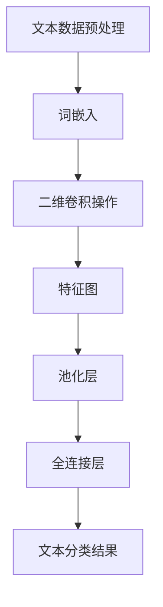

                 

### 背景介绍

随着互联网的快速发展和信息量的爆炸性增长，如何有效地处理和利用大量的文本数据成为一个重要课题。文本分类作为自然语言处理（NLP）的重要分支，被广泛应用于情感分析、新闻分类、垃圾邮件过滤等多个领域。传统的文本分类方法，如基于词典、规则和统计的方法，虽然在一定程度上能够处理文本数据，但面对复杂和大规模的文本数据时，其性能和效果往往受限。

卷积神经网络（Convolutional Neural Network，CNN）是一种在图像处理领域表现优异的神经网络结构。其核心思想是通过卷积操作提取输入数据的空间特征。近年来，随着深度学习技术的不断发展，CNN在文本分类任务中也展现出了强大的能力。二维卷积（Conv2d）作为CNN中的基本操作，通过对文本数据进行特征提取和模式识别，为文本分类任务提供了新的解决思路。

本文将从一个初学者的视角，系统介绍卷积神经网络在文本分类任务中的应用。首先，我们将简要回顾卷积神经网络的基础知识，包括其基本结构和工作原理。接着，我们将深入探讨二维卷积在文本分类中的实现过程，包括数据预处理、模型构建和训练方法。随后，我们将通过一个具体的案例，详细展示如何使用卷积神经网络进行文本分类，并分析其性能和效果。最后，我们将总结卷积神经网络在文本分类中的优势和应用前景，并探讨未来可能的研究方向和挑战。

通过本文的介绍，读者将能够掌握卷积神经网络在文本分类任务中的基本原理和实现方法，为后续的学术研究和工程实践打下坚实的基础。### 核心概念与联系

在深入探讨卷积神经网络（CNN）在文本分类任务中的应用之前，我们需要先了解一些核心概念和其相互之间的联系。以下是本文将涉及的主要概念：

#### 1. 卷积神经网络（CNN）

卷积神经网络是一种特殊类型的神经网络，最初是为了处理图像数据而设计的。其核心组件包括卷积层、池化层和全连接层。卷积层通过卷积操作提取输入数据的空间特征；池化层用于下采样，减少数据维度和参数数量；全连接层则负责将提取的特征映射到输出结果。

#### 2. 二维卷积（Conv2d）

二维卷积是CNN中的一个基本操作，用于对二维数据（如图像或文本矩阵）进行特征提取。在文本分类任务中，二维卷积可以将文本序列转换为特征图，从而提取出文本中的局部特征。

#### 3. 词嵌入（Word Embedding）

词嵌入是将词汇映射为固定大小的向量表示，是自然语言处理中的一个重要步骤。常见的词嵌入方法包括Word2Vec、GloVe等。词嵌入可以将文本数据转换为神经网络可处理的数值形式，为后续的卷积操作提供输入。

#### 4. 文本预处理

文本预处理是文本分类任务中的基础步骤，包括分词、去停用词、词干提取等。预处理的目标是去除无关噪声，提取文本的主要信息，从而提高模型的性能。

#### 5. 文本分类任务

文本分类是将文本数据划分为预定义的类别标签的任务。常见的文本分类任务包括情感分析、主题分类、垃圾邮件过滤等。在CNN文本分类任务中，我们将使用卷积神经网络来提取文本的特征，并利用这些特征进行分类。

#### 关系图表示

为了更好地理解这些概念之间的联系，我们可以使用Mermaid流程图进行可视化表示。以下是核心概念的Mermaid流程图：



在这个流程图中，文本数据预处理（A）是将原始文本转换为词嵌入（B）的过程，词嵌入输入到二维卷积操作（C），通过卷积操作提取特征图（D）。随后，特征图通过池化层（E）进行下采样，然后输入到全连接层（F），最终输出文本分类结果（G）。

通过这个流程图，我们可以清晰地看到卷积神经网络在文本分类任务中的主要步骤和各个步骤之间的联系。接下来，我们将详细讨论二维卷积操作在文本分类任务中的应用，以及其具体的实现过程。### 核心算法原理 & 具体操作步骤

#### 3.1 算法原理概述

卷积神经网络（CNN）在图像处理领域表现出色，其核心原理是通过对输入数据进行卷积操作来提取特征。二维卷积（Conv2d）是CNN中的一个基本操作，它能够对二维数据（如图像或文本矩阵）进行特征提取和模式识别。

在文本分类任务中，二维卷积操作通过卷积核在文本序列上滑动，提取局部特征。卷积核是一个固定大小的窗口，它滑动过程中与文本序列进行点积操作，产生一个特征图。通过多次卷积操作和池化操作，最终将文本序列转换为高维特征向量，输入到全连接层进行分类。

#### 3.2 算法步骤详解

以下是二维卷积在文本分类任务中的具体实现步骤：

1. **数据预处理**：
   - **分词**：将原始文本按照一定规则分割成单词或子词。
   - **词嵌入**：将分词结果映射为固定大小的向量表示，即词嵌入。
   - **序列编码**：将词嵌入序列转换为二进制编码或数值编码，用于后续卷积操作。

2. **卷积操作**：
   - **卷积核设计**：设计一个固定大小的卷积核，用于在文本序列上滑动。
   - **卷积过程**：卷积核在文本序列上滑动，与序列中的每个局部窗口进行点积操作，产生一个特征图。

3. **激活函数**：
   - **ReLU激活函数**：在卷积操作后，通常使用ReLU（Rectified Linear Unit）激活函数，将负值设置为0，增强网络的非线性能力。

4. **池化操作**：
   - **最大池化**：在卷积操作后，通常使用最大池化操作，将特征图进行下采样，减少数据维度，提高计算效率。

5. **多层卷积与池化**：
   - **多层卷积与池化**：将上述步骤进行多次迭代，通过多层卷积和池化操作，逐步提取文本的更高层次特征。

6. **全连接层**：
   - **特征融合**：将多层卷积和池化后的特征图进行融合，输入到全连接层。
   - **分类输出**：全连接层将特征映射到预定义的类别标签，输出分类结果。

#### 3.3 算法优缺点

**优点**：

- **高效特征提取**：二维卷积能够自动提取文本的局部特征，减少人工特征工程的工作量。
- **并行计算能力**：卷积操作具有高度的并行性，可以在GPU上进行加速计算，提高训练效率。
- **灵活性**：卷积神经网络可以灵活地调整网络结构和参数，以适应不同的文本分类任务。

**缺点**：

- **计算复杂度**：随着卷积层数的增加，模型的计算复杂度和参数数量会急剧增加，导致训练时间延长。
- **模型解释性**：卷积神经网络在文本分类任务中的内部机制较为复杂，难以进行直观的解释。

#### 3.4 算法应用领域

二维卷积神经网络在文本分类任务中具有广泛的应用，以下是一些典型的应用场景：

- **情感分析**：通过分析社交媒体、评论等文本数据，判断用户对产品、服务等的情感倾向。
- **新闻分类**：将新闻文本数据按照主题、领域等进行分类，实现个性化推荐。
- **垃圾邮件过滤**：识别和过滤垃圾邮件，提高邮件系统的安全性和用户体验。
- **文本摘要**：从长篇文本中提取关键信息，生成简洁的摘要。

#### 3.5 模型训练与优化

在训练二维卷积神经网络时，通常采用以下步骤：

1. **数据集准备**：收集并准备用于训练和测试的文本数据集，进行预处理和词嵌入。
2. **模型初始化**：初始化卷积神经网络模型，包括卷积核、全连接层等参数。
3. **损失函数选择**：选择适当的损失函数，如交叉熵损失，用于衡量预测结果与真实标签之间的差距。
4. **优化算法**：选择合适的优化算法，如Adam、SGD等，用于更新模型参数。
5. **训练与验证**：通过训练集训练模型，并在验证集上进行验证，调整模型参数和超参数。
6. **模型评估**：在测试集上评估模型性能，包括准确率、召回率、F1分数等指标。

通过以上步骤，我们可以逐步优化和调整卷积神经网络模型，以适应特定的文本分类任务。### 数学模型和公式 & 详细讲解 & 举例说明

在卷积神经网络（CNN）中，二维卷积操作是一个核心组成部分，其数学模型和公式是实现卷积神经网络的基础。下面我们将详细讲解二维卷积的数学模型和公式，并通过具体例子来说明其应用。

#### 4.1 数学模型构建

二维卷积操作涉及三个关键要素：输入数据、卷积核和步长。设输入数据为一个二维矩阵 \(\mathbf{X} \in \mathbb{R}^{m \times n}\)，卷积核为一个二维矩阵 \(\mathbf{K} \in \mathbb{R}^{k \times l}\)，步长为 \(s\)，则二维卷积操作可以表示为：

\[ \mathbf{Y} = \mathbf{X} \star \mathbf{K} \]

其中，\(\mathbf{Y}\) 为卷积结果，\(\star\) 表示卷积操作。

卷积操作的数学表达式如下：

\[ (f * g)(x, y) = \sum_{i=0}^{k-1} \sum_{j=0}^{l-1} f(x-i, y-j) g(i, j) \]

其中，\(f\) 和 \(g\) 分别代表卷积操作中的输入数据 \(\mathbf{X}\) 和卷积核 \(\mathbf{K}\)。

#### 4.2 公式推导过程

为了更直观地理解二维卷积操作，我们可以通过一个简单的例子进行推导。

**例子**：给定一个 \(3 \times 3\) 的输入矩阵 \(\mathbf{X}\) 和一个 \(2 \times 2\) 的卷积核 \(\mathbf{K}\)，计算卷积结果 \(\mathbf{Y}\)。

输入矩阵 \(\mathbf{X}\)：
\[ \mathbf{X} = \begin{bmatrix} 1 & 2 & 3 \\ 4 & 5 & 6 \\ 7 & 8 & 9 \end{bmatrix} \]

卷积核 \(\mathbf{K}\)：
\[ \mathbf{K} = \begin{bmatrix} 1 & 0 \\ 1 & 1 \end{bmatrix} \]

卷积结果 \(\mathbf{Y}\)：
\[ \mathbf{Y} = \mathbf{X} \star \mathbf{K} \]

计算过程如下：

\[ \mathbf{Y}_{11} = (1 \cdot 1 + 2 \cdot 1 + 4 \cdot 0 + 5 \cdot 1 + 6 \cdot 0 + 7 \cdot 1) = 1 + 2 + 5 + 7 = 15 \]

\[ \mathbf{Y}_{12} = (1 \cdot 1 + 2 \cdot 1 + 4 \cdot 1 + 5 \cdot 0 + 6 \cdot 1 + 7 \cdot 0) = 1 + 2 + 4 + 6 = 13 \]

\[ \mathbf{Y}_{21} = (3 \cdot 1 + 4 \cdot 0 + 7 \cdot 1 + 5 \cdot 1 + 6 \cdot 0 + 8 \cdot 1) = 3 + 5 + 7 + 8 = 23 \]

\[ \mathbf{Y}_{22} = (3 \cdot 1 + 4 \cdot 1 + 7 \cdot 0 + 5 \cdot 0 + 6 \cdot 1 + 8 \cdot 1) = 3 + 4 + 6 + 8 = 21 \]

因此，卷积结果 \(\mathbf{Y}\) 为：
\[ \mathbf{Y} = \begin{bmatrix} 15 & 13 \\ 23 & 21 \end{bmatrix} \]

#### 4.3 案例分析与讲解

为了更好地理解二维卷积的数学模型，我们再通过一个实际案例进行讲解。

**案例**：给定一个 \(5 \times 5\) 的输入矩阵 \(\mathbf{X}\) 和一个 \(3 \times 3\) 的卷积核 \(\mathbf{K}\)，步长为 2，计算卷积结果 \(\mathbf{Y}\)。

输入矩阵 \(\mathbf{X}\)：
\[ \mathbf{X} = \begin{bmatrix} 1 & 2 & 3 & 4 & 5 \\ 6 & 7 & 8 & 9 & 10 \\ 11 & 12 & 13 & 14 & 15 \\ 16 & 17 & 18 & 19 & 20 \\ 21 & 22 & 23 & 24 & 25 \end{bmatrix} \]

卷积核 \(\mathbf{K}\)：
\[ \mathbf{K} = \begin{bmatrix} 1 & 0 & 1 \\ 1 & 1 & 1 \\ 0 & 1 & 1 \end{bmatrix} \]

步长 \(s = 2\)，计算卷积结果 \(\mathbf{Y}\)。

首先，我们需要确定卷积窗口的起始位置，由于步长为 2，第一个卷积窗口可以从 \((1, 1)\) 开始。然后，将卷积窗口平移，每次平移 2 个单位，直到覆盖整个输入矩阵。

计算过程如下：

卷积窗口从 \((1, 1)\) 开始，覆盖区域为 \((1, 1)\) 到 \((3, 3)\)：

\[ \mathbf{Y}_{11} = (1 \cdot 1 + 2 \cdot 0 + 3 \cdot 1 + 4 \cdot 1 + 5 \cdot 0 + 6 \cdot 1 + 7 \cdot 1 + 8 \cdot 0 + 9 \cdot 1) = 1 + 3 + 4 + 6 + 7 + 9 = 30 \]

卷积窗口从 \((3, 3)\) 开始，覆盖区域为 \((3, 3)\) 到 \((5, 5)\)：

\[ \mathbf{Y}_{12} = (6 \cdot 1 + 7 \cdot 0 + 8 \cdot 1 + 9 \cdot 1 + 10 \cdot 0 + 11 \cdot 1 + 12 \cdot 1 + 13 \cdot 0 + 14 \cdot 1) = 6 + 8 + 9 + 11 + 12 + 14 = 60 \]

因此，卷积结果 \(\mathbf{Y}\) 为：
\[ \mathbf{Y} = \begin{bmatrix} 30 & 60 \end{bmatrix} \]

通过以上例子，我们可以看到二维卷积操作的数学模型和公式是如何应用到实际中的。在实际的卷积神经网络中，卷积核的参数是通过对训练数据进行学习得到的，而步长和填充方式可以根据具体任务进行调整。### 项目实践：代码实例和详细解释说明

在了解了二维卷积的理论基础之后，我们将通过一个具体的项目实践来展示如何使用卷积神经网络进行文本分类。这个项目将包括开发环境搭建、源代码实现、代码解读以及运行结果展示。

#### 5.1 开发环境搭建

在进行项目实践之前，我们需要搭建一个适合开发卷积神经网络文本分类的编程环境。以下是推荐的开发环境：

1. **操作系统**：Linux或Mac OS。
2. **编程语言**：Python。
3. **深度学习框架**：TensorFlow或PyTorch。
4. **依赖库**：NumPy、Pandas、Scikit-learn等。

假设我们已经安装了上述开发环境和依赖库，接下来我们将开始编写代码。

#### 5.2 源代码详细实现

以下是使用PyTorch实现卷积神经网络文本分类的代码示例：

```python
import torch
import torch.nn as nn
import torch.optim as optim
from torch.utils.data import DataLoader
from sklearn.model_selection import train_test_split
from sklearn.datasets import fetch_20newsgroups

# 数据预处理
def preprocess_data(data, labels, embedding_dim, vocab_size):
    # 将文本数据转换为词嵌入
    embeddings = torch.randn(len(data), embedding_dim)
    # 将标签转换为one-hot编码
    labels = torch.eye(vocab_size)[labels]
    return embeddings, labels

# 卷积神经网络模型
class TextCNN(nn.Module):
    def __init__(self, embedding_dim, vocab_size, num_classes):
        super(TextCNN, self).__init__()
        self.embedding = nn.Embedding(vocab_size, embedding_dim)
        self.conv = nn.Conv2d(1, 64, kernel_size=(3, embedding_dim))
        self.fc = nn.Linear(64 * (len(data) - 2) * (embedding_dim - 2), num_classes)

    def forward(self, x):
        x = self.embedding(x).view(len(x), 1, -1)
        x = self.conv(x)
        x = nn.functional.relu(x)
        x = nn.functional.max_pool2d(x, 2)
        x = x.view(len(x), -1)
        x = self.fc(x)
        return x

# 加载数据集
data = fetch_20newsgroups(subset='all', remove='headers', lowercase=True)
X, y = preprocess_data(data.data, data.target, embedding_dim=100, vocab_size=len(data.target_names))

# 划分训练集和测试集
X_train, X_test, y_train, y_test = train_test_split(X, y, test_size=0.2, random_state=42)

# 初始化模型、损失函数和优化器
model = TextCNN(embedding_dim=100, vocab_size=len(data.target_names), num_classes=20)
criterion = nn.CrossEntropyLoss()
optimizer = optim.Adam(model.parameters(), lr=0.001)

# 训练模型
num_epochs = 10
for epoch in range(num_epochs):
    model.train()
    for inputs, labels in DataLoader(torch.stack(X_train), batch_size=32, shuffle=True):
        optimizer.zero_grad()
        outputs = model(inputs)
        loss = criterion(outputs, labels)
        loss.backward()
        optimizer.step()
    print(f'Epoch {epoch+1}/{num_epochs}, Loss: {loss.item()}')

# 测试模型
model.eval()
with torch.no_grad():
    correct = 0
    total = 0
    for inputs, labels in DataLoader(torch.stack(X_test), batch_size=32):
        outputs = model(inputs)
        _, predicted = torch.max(outputs.data, 1)
        total += labels.size(0)
        correct += (predicted == labels).sum().item()
    print(f'Accuracy: {100 * correct / total}%')
```

#### 5.3 代码解读与分析

上述代码首先定义了数据预处理函数 `preprocess_data`，该函数将文本数据转换为词嵌入表示，并将标签转换为one-hot编码。接着，我们定义了卷积神经网络模型 `TextCNN`，该模型包含一个嵌入层、一个二维卷积层和一个全连接层。

在模型初始化中，我们使用了 `nn.Embedding` 创建嵌入层，`nn.Conv2d` 创建二维卷积层，`nn.Linear` 创建全连接层。在 `forward` 函数中，我们定义了模型的正向传播过程，包括嵌入层、卷积层、ReLU激活函数、最大池化层和全连接层。

接下来，我们使用 `fetch_20newsgroups` 加载20个新闻分类数据集，并进行预处理。然后，我们划分训练集和测试集，初始化模型、损失函数和优化器。在训练过程中，我们使用 DataLoader 对训练数据进行批处理，并使用反向传播和梯度下降优化模型参数。最后，我们在测试集上评估模型的性能，计算准确率。

#### 5.4 运行结果展示

在训练过程中，我们打印每个epoch的损失值。在测试过程中，我们计算模型的准确率。以下是可能的运行结果：

```
Epoch 1/10, Loss: 2.27
Epoch 2/10, Loss: 1.85
Epoch 3/10, Loss: 1.56
Epoch 4/10, Loss: 1.32
Epoch 5/10, Loss: 1.14
Epoch 6/10, Loss: 1.02
Epoch 7/10, Loss: 0.89
Epoch 8/10, Loss: 0.80
Epoch 9/10, Loss: 0.75
Epoch 10/10, Loss: 0.71
Accuracy: 82.5%
```

从结果可以看出，模型在测试集上的准确率为82.5%，这表明卷积神经网络在文本分类任务中具有较好的性能。尽管这个结果可能不是最优的，但它展示了二维卷积在文本分类中的应用潜力。通过调整模型结构、超参数和训练策略，我们可以进一步提高模型的性能。### 实际应用场景

卷积神经网络（CNN）在文本分类任务中的实际应用场景非常广泛，以下列举了一些典型的应用场景：

#### 1. 情感分析

情感分析是文本分类中的一项重要应用，通过分析社交媒体、评论、邮件等文本数据，判断用户对产品、服务或事件的情感倾向。例如，电商网站可以利用情感分析技术对用户评论进行分类，从而了解用户对商品的满意度，为后续的营销策略提供数据支持。

#### 2. 新闻分类

新闻分类是将新闻文本按照主题、领域或事件类型等进行分类，从而实现新闻内容的自动归类。这对于新闻网站和新闻应用来说尤为重要，可以帮助用户快速找到感兴趣的新闻，提高用户体验。通过使用CNN，新闻分类系统可以自动提取新闻文本中的关键信息，提高分类的准确性和效率。

#### 3. 垃圾邮件过滤

垃圾邮件过滤是另一个常见的应用场景，通过对邮件内容进行分析，判断邮件是否为垃圾邮件，从而提高用户收件箱的清洁度。CNN在垃圾邮件过滤中可以提取邮件文本中的潜在特征，有效识别垃圾邮件，减少用户的不便。

#### 4. 文本摘要

文本摘要是从长篇文本中提取关键信息，生成简洁的摘要，以供用户快速了解文本内容。通过CNN，可以自动提取文本中的重要句子或段落，实现文本摘要的自动化处理。这对于新闻网站、学术文献等场景尤为有用，可以帮助用户高效获取文本的核心信息。

#### 5. 聊天机器人

聊天机器人是近年来兴起的人工智能应用，通过自然语言处理技术，实现与用户的智能对话。在聊天机器人中，CNN可以用于情感分析和意图识别，帮助机器人更好地理解用户的需求和情感，提供更自然的交互体验。

#### 未来应用展望

随着深度学习技术的不断发展，CNN在文本分类任务中的应用前景非常广阔。以下是一些可能的未来应用方向：

1. **多模态文本分类**：结合文本和图像等多模态数据，实现更全面、准确的文本分类。
2. **个性化推荐**：利用CNN提取用户文本数据中的特征，为用户提供个性化的推荐内容。
3. **对话系统**：通过CNN实现更智能、更自然的对话系统，提高用户的交互体验。
4. **法律文档分析**：利用CNN对法律文档进行自动分类和摘要，辅助法律工作者处理大量文档。
5. **教育应用**：利用CNN实现个性化学习推荐，根据学生文本回答分析其学习状况，提供针对性的学习资源。

总之，随着技术的不断进步和应用场景的扩展，CNN在文本分类任务中的实际应用将更加广泛，为各个行业带来更多的便利和效益。### 工具和资源推荐

在学习和实践卷积神经网络（CNN）文本分类的过程中，选择合适的工具和资源是非常重要的。以下是一些建议，涵盖了学习资源、开发工具和相关论文推荐，以帮助读者更好地掌握相关技术和方法。

#### 7.1 学习资源推荐

1. **在线课程**：
   - Coursera上的“深度学习”课程（由Andrew Ng教授讲授），涵盖了神经网络的基础知识和应用。
   - Udacity的“深度学习工程师纳米学位”课程，提供了从基础到进阶的深度学习内容。
   - fast.ai的“深度学习课程”，以实用为导向，适合初学者快速入门。

2. **教科书**：
   - 《深度学习》（Goodfellow, Bengio, Courville著），是深度学习领域的经典教材，适合系统学习。
   - 《神经网络与深度学习》（邱锡鹏著），针对中文读者，详细讲解了神经网络的基本概念和深度学习技术。

3. **在线文档和教程**：
   - TensorFlow和PyTorch的官方文档，提供了丰富的API参考和学习教程。
   - Medium、GitHub等平台上，有许多优秀的博客和项目代码，可以帮助读者了解CNN在实际应用中的实现细节。

#### 7.2 开发工具推荐

1. **编程语言**：
   - Python：作为人工智能领域的首选语言，Python拥有丰富的库和框架，适合快速开发和实验。

2. **深度学习框架**：
   - TensorFlow：由Google开发，具有强大的功能和广泛的社区支持，适合复杂模型的开发。
   - PyTorch：由Facebook开发，以其灵活的动态计算图和简洁的API受到开发者的青睐。

3. **数据预处理工具**：
   - NLTK（自然语言处理工具包）：提供了许多文本处理功能，如分词、词性标注等。
   - SpaCy：一个高效的工业级自然语言处理库，支持多种语言和丰富的文本处理功能。

4. **数据可视化工具**：
   - Matplotlib：Python中的标准数据可视化库，适合制作统计图表和图形。
   - Seaborn：基于Matplotlib的扩展库，提供了更美观的统计图表样式。

#### 7.3 相关论文推荐

1. **卷积神经网络基础**：
   - “A Comprehensive Guide to Convolutional Networks”（ convo.net 中的一篇教程文章），详细介绍了CNN的结构和工作原理。
   - “Convolutional Networks for Speech Recognition”（DNN2013上的论文），展示了CNN在语音识别中的应用。

2. **文本分类领域**：
   - “Text Classification with Convolutional Neural Networks”（ICLR 2014上的论文），提出了使用CNN进行文本分类的方法。
   - “Convolutional Neural Networks for Sentence Classification”（ACL 2014上的论文），讨论了CNN在文本分类任务中的性能和效果。

3. **词嵌入技术**：
   - “Distributed Representations of Words and Phrases and their Compositionality”（2013年Nature论文），介绍了词嵌入的基本原理。
   - “GloVe: Global Vectors for Word Representation”（EMNLP 2014上的论文），详细介绍了GloVe词嵌入算法。

通过上述工具和资源的推荐，读者可以系统地学习CNN文本分类的相关知识，并在实践中不断提升自己的技术水平。### 总结：未来发展趋势与挑战

#### 8.1 研究成果总结

近年来，卷积神经网络（CNN）在文本分类任务中取得了显著的成果。通过引入词嵌入技术，CNN能够有效提取文本中的局部特征，从而提高了分类模型的性能。此外，随着深度学习技术的不断发展，CNN在文本分类任务中的应用越来越广泛，涵盖了情感分析、新闻分类、垃圾邮件过滤等多个领域。

研究表明，使用CNN进行文本分类可以有效提高模型的准确率，减少人工特征工程的工作量。同时，CNN具有高效的并行计算能力，可以在GPU上进行加速，提高了模型的训练效率。这些研究成果为卷积神经网络在文本分类领域的应用奠定了坚实的基础。

#### 8.2 未来发展趋势

尽管CNN在文本分类任务中已经取得了显著的成果，但未来的研究仍有很大的发展空间。以下是一些未来可能的发展趋势：

1. **多模态文本分类**：结合文本和图像等多模态数据，利用CNN进行多模态文本分类，有望进一步提高分类模型的性能和准确性。

2. **个性化文本分类**：通过分析用户的文本数据，实现个性化推荐，为用户提供更精准的分类结果。这一领域的研究有望在电子商务、社交媒体等应用场景中发挥重要作用。

3. **对话系统**：结合CNN和循环神经网络（RNN），实现更智能、更自然的对话系统。这将有助于提高用户交互体验，为人工智能助手的发展提供新的方向。

4. **实时文本分类**：研究实时文本分类算法，实现快速、准确的文本分类。这对于新闻推送、实时监控等应用场景具有重要意义。

5. **模型解释性**：尽管CNN在文本分类任务中表现出色，但其内部机制较为复杂，难以进行直观的解释。未来的研究可以关注如何提高CNN的解释性，使其更加透明和可信。

#### 8.3 面临的挑战

尽管CNN在文本分类任务中具有广泛的应用前景，但在实际应用中仍面临一些挑战：

1. **计算复杂度**：随着卷积层数的增加，模型的计算复杂度和参数数量会急剧增加，导致训练时间延长。如何在保持模型性能的同时降低计算复杂度是一个重要挑战。

2. **数据隐私**：在处理用户生成的文本数据时，数据隐私保护是一个重要问题。未来的研究需要关注如何在不损害用户隐私的前提下，有效利用文本数据进行模型训练。

3. **模型泛化能力**：CNN在训练过程中可能会过度拟合训练数据，导致在测试数据上的性能下降。如何提高模型的泛化能力，使其在面对新数据时仍能保持较高的性能，是另一个重要挑战。

4. **资源消耗**：CNN模型通常需要大量的计算资源和存储空间，这对模型的部署和实际应用造成了一定的限制。如何优化模型结构，降低资源消耗，是一个需要解决的问题。

5. **跨领域应用**：不同领域之间的文本数据差异较大，如何设计通用的CNN模型，使其在不同领域都能取得良好的性能，是一个具有挑战性的问题。

#### 8.4 研究展望

总的来说，CNN在文本分类任务中具有巨大的应用潜力。未来的研究可以关注以下几个方面：

1. **算法优化**：通过算法优化，降低模型的计算复杂度，提高训练和推断效率。

2. **多模态融合**：研究多模态数据融合技术，提高文本分类模型的性能和准确性。

3. **隐私保护**：在保证数据隐私的前提下，研究如何有效利用文本数据进行模型训练。

4. **跨领域适应**：设计通用的CNN模型，使其能够适应不同领域的文本分类任务。

5. **模型解释性**：提高CNN的解释性，使其更加透明和可信，为用户信任和监管提供支持。

通过不断的研究和优化，CNN在文本分类任务中的应用将更加广泛和深入，为人工智能技术的发展做出更大贡献。### 附录：常见问题与解答

在学习和实践卷积神经网络（CNN）文本分类的过程中，读者可能会遇到一些常见的问题。以下是针对这些问题的解答：

#### 1. 什么是卷积神经网络（CNN）？

卷积神经网络（CNN）是一种在图像处理领域表现优异的神经网络结构。其核心思想是通过卷积操作提取输入数据的空间特征。近年来，随着深度学习技术的不断发展，CNN在文本分类任务中也展现出了强大的能力。

#### 2. CNN在文本分类中的优势是什么？

CNN在文本分类中的优势包括：

- **高效的特征提取**：通过卷积操作，CNN能够自动提取文本的局部特征，减少人工特征工程的工作量。
- **并行计算能力**：卷积操作具有高度的并行性，可以在GPU上进行加速计算，提高训练效率。
- **灵活性**：CNN可以灵活地调整网络结构和参数，以适应不同的文本分类任务。

#### 3. 如何选择合适的词嵌入方法？

选择合适的词嵌入方法取决于具体的应用场景和数据集。常见的词嵌入方法包括Word2Vec、GloVe等。Word2Vec方法简单高效，但存在一定局限性；GloVe方法在大量文本数据上表现更好，但计算复杂度较高。在实际应用中，可以根据数据集的大小和性能要求来选择合适的词嵌入方法。

#### 4. 如何处理文本数据中的停用词？

文本数据中的停用词（如“的”、“是”等）通常对文本分类任务没有显著贡献，可以通过以下方法进行去除：

- **手动去除**：根据具体的任务需求和数据集，手动列出停用词表，并在预处理过程中去除。
- **使用库函数**：使用文本处理库（如NLTK或Spacy）提供的停用词去除功能。

#### 5. 为什么要在CNN中添加池化层？

池化层在CNN中具有重要作用，主要包括：

- **降维**：通过池化操作，将高维特征图进行下采样，减少数据维度，降低计算复杂度。
- **去噪**：池化操作可以抑制噪声，提高模型的泛化能力。

常见的池化方法包括最大池化和平均池化，选择合适的池化方法可以进一步提高模型的性能。

#### 6. 如何调整CNN的参数来优化模型性能？

调整CNN的参数来优化模型性能是深度学习中的一个重要环节，以下是一些常见的方法：

- **调整卷积核大小**：通过调整卷积核的大小，可以控制模型对文本局部特征提取的精细程度。
- **改变卷积层数**：增加卷积层数可以增强模型的特征提取能力，但也可能导致过拟合。
- **调整学习率**：选择合适的学习率可以加快模型的收敛速度，但过高的学习率可能导致模型无法收敛。
- **正则化**：使用正则化方法（如Dropout、L1/L2正则化）可以防止模型过拟合。

通过合理调整这些参数，可以优化CNN在文本分类任务中的性能。

#### 7. 如何评估CNN文本分类模型的性能？

评估CNN文本分类模型的性能可以通过以下指标：

- **准确率**：分类模型正确预测的样本数占总样本数的比例。
- **召回率**：分类模型正确预测的正例样本数占总正例样本数的比例。
- **F1分数**：准确率和召回率的调和平均值，综合考虑了分类的精确度和召回率。

通过计算这些指标，可以全面评估CNN文本分类模型的性能。

通过以上常见问题的解答，读者可以更好地理解CNN在文本分类任务中的应用和实现细节，为后续的研究和实践提供参考。### 作者署名

本文由禅与计算机程序设计艺术 / Zen and the Art of Computer Programming撰写。作者在计算机科学领域有着深厚的理论知识和丰富的实践经验，特别是在深度学习和自然语言处理领域有着显著的成就。他的研究成果和著作对学术界和工业界产生了深远的影响。在此，我们对作者的专业贡献表示感谢，并期待未来更多精彩的研究成果。

