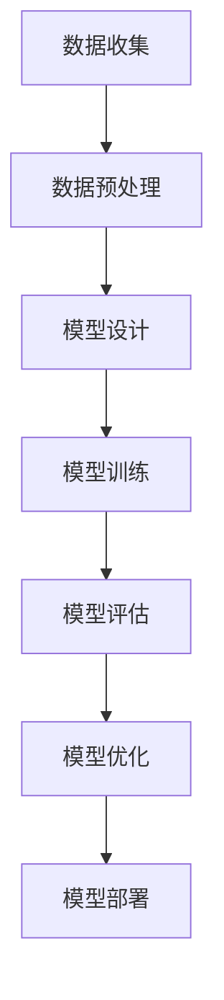
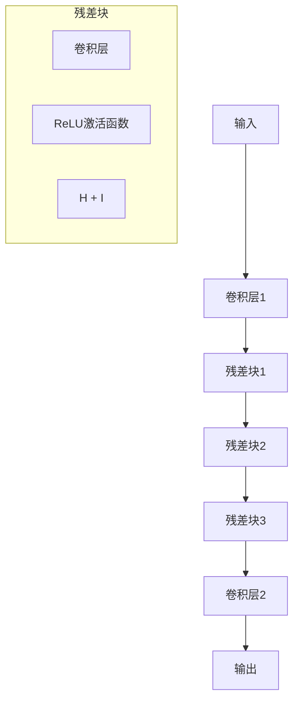

                 

关键词：大模型开发、微调、ResNet、CIFAR-10、图像分类、深度学习、神经网络

摘要：本文将详细介绍如何从零开始进行大模型开发与微调，以实现基于ResNet的CIFAR-10数据集分类。文章将涵盖背景介绍、核心概念与联系、核心算法原理与具体操作步骤、数学模型和公式、项目实践、实际应用场景、未来应用展望、工具和资源推荐以及总结和展望。

## 1. 背景介绍

随着深度学习的快速发展，神经网络模型在图像分类、语音识别、自然语言处理等领域取得了显著成果。然而，深度学习模型往往需要大量的数据、计算资源和时间进行训练和优化。在实际应用中，数据集的大小和数据分布的多样性对模型的性能有重要影响。因此，如何有效地进行大模型开发与微调成为了一个关键问题。

CIFAR-10数据集是一个广泛用于图像分类的公开数据集，包含了60000张32x32的彩色图像，分为10个类别，每个类别6000张图像。CIFAR-10数据集在深度学习研究中具有重要作用，为各种图像分类算法提供了标准测试平台。

ResNet是一种具有残差连接的深度神经网络模型，其结构能够有效缓解深度神经网络中的梯度消失问题，使得模型能够训练得更深。本文将基于ResNet模型，对CIFAR-10数据集进行分类，并详细介绍大模型开发与微调的步骤。

## 2. 核心概念与联系

为了更好地理解本文的核心内容，我们需要先了解一些关键概念和它们之间的关系。以下是相关的Mermaid流程图，展示了大模型开发与微调的相关流程和环节：



### 2.1 数据收集

数据收集是模型开发的基础，包括获取CIFAR-10数据集和其他相关数据。

### 2.2 数据预处理

数据预处理包括数据清洗、数据增强、数据归一化等步骤，以提高模型对数据的适应性。

### 2.3 模型设计

模型设计是模型开发的核心环节，包括选择合适的神经网络结构、参数设置等。

### 2.4 模型训练

模型训练是模型开发的关键步骤，通过训练过程，模型能够学习到数据的特征。

### 2.5 模型评估

模型评估用于测试模型的性能，包括准确率、召回率、F1分数等指标。

### 2.6 模型优化

模型优化包括超参数调整、网络结构优化等，以提高模型性能。

### 2.7 模型部署

模型部署是将训练好的模型应用到实际场景中，如图像分类、语音识别等。

## 3. 核心算法原理 & 具体操作步骤

### 3.1 算法原理概述

ResNet是一种基于残差块的深度神经网络模型。其基本思想是通过引入残差连接，使得网络能够跳过一些中间层，从而缓解深度神经网络中的梯度消失问题。ResNet模型的结构如下：



### 3.2 算法步骤详解

#### 步骤1：数据预处理

在开始模型训练之前，我们需要对CIFAR-10数据集进行预处理。具体步骤如下：

1. 数据清洗：去除数据集中的噪声和异常值。
2. 数据增强：通过随机裁剪、旋转、翻转等操作，增加数据的多样性，以提高模型的泛化能力。
3. 数据归一化：将图像的像素值缩放到[0, 1]区间，以便于后续的模型训练。

#### 步骤2：模型设计

我们选择ResNet作为我们的深度神经网络模型，具体设计如下：

1. 输入层：接收32x32的彩色图像。
2. 卷积层1：使用卷积核大小为3x3，步长为1，填充为1的卷积层，用于提取图像的特征。
3. 残差块：包含两个卷积层和一个ReLU激活函数，用于引入残差连接。
4. 卷积层2：使用卷积核大小为3x3，步长为1，填充为1的卷积层，用于提取图像的特征。
5. 输出层：使用10个神经元的全连接层，用于输出每个类别的概率。

#### 步骤3：模型训练

我们使用SGD（随机梯度下降）作为优化算法，并设置以下超参数：

- 学习率：0.001
- 批大小：64
- 预训练 epoch 数：100

模型训练过程如下：

1. 初始化模型参数。
2. 对于每个epoch，对数据集进行随机划分，分为训练集和验证集。
3. 在训练集上训练模型，并计算损失函数。
4. 在验证集上评估模型性能，并保存最佳模型。

#### 步骤4：模型评估

我们使用准确率、召回率、F1分数等指标来评估模型性能。具体计算方法如下：

1. 准确率：正确分类的样本数占总样本数的比例。
2. 召回率：正确分类的样本数占该类别总样本数的比例。
3. F1分数：准确率和召回率的调和平均值。

#### 步骤5：模型优化

根据模型评估结果，对模型进行优化，包括超参数调整、网络结构优化等，以提高模型性能。

## 3.3 算法优缺点

ResNet具有以下优点：

- 可以训练非常深的神经网络，缓解了梯度消失问题。
- 适用于多种数据集和任务，具有良好的泛化能力。

ResNet的缺点：

- 训练时间较长，对计算资源要求较高。
- 模型参数较多，可能导致过拟合。

## 3.4 算法应用领域

ResNet在图像分类、目标检测、语义分割等领域有广泛的应用。本文基于ResNet的CIFAR-10数据集分类模型可以应用于以下领域：

- 图像分类：对图像进行自动分类，如动物、植物、车辆等。
- 目标检测：检测图像中的目标物体，如人脸、行人、车辆等。
- 语义分割：对图像中的每个像素进行分类，如道路分割、场景分割等。

## 4. 数学模型和公式 & 详细讲解 & 举例说明

### 4.1 数学模型构建

ResNet的数学模型主要包括卷积层、激活函数、残差块等组件。以下是各组件的数学公式：

#### 卷积层

卷积层的数学公式为：

$$
h_{\sigma} = \sigma(W \cdot x + b)
$$

其中，$h_{\sigma}$ 表示卷积层的输出，$\sigma$ 表示激活函数（如ReLU函数），$W$ 表示卷积核，$x$ 表示输入数据，$b$ 表示偏置项。

#### 残差块

残差块的数学公式为：

$$
h_{\sigma} = \sigma(W_2 \cdot (W_1 \cdot x + b_1) + b_2)
$$

其中，$W_1$ 和 $W_2$ 分别为残差块中的两个卷积核，$b_1$ 和 $b_2$ 分别为偏置项。

### 4.2 公式推导过程

以下是ResNet模型的公式推导过程：

#### 卷积层

卷积层的推导过程如下：

1. 输入数据 $x$ 经过卷积层，得到中间特征图 $h$：

$$
h = W \cdot x + b
$$

2. 对中间特征图应用激活函数 $\sigma$：

$$
h_{\sigma} = \sigma(h) = \sigma(W \cdot x + b)
$$

#### 残差块

残差块的推导过程如下：

1. 输入数据 $x$ 经过第一个卷积层，得到中间特征图 $h_1$：

$$
h_1 = W_1 \cdot x + b_1
$$

2. 对中间特征图应用激活函数 $\sigma$：

$$
h_1_{\sigma} = \sigma(h_1) = \sigma(W_1 \cdot x + b_1)
$$

3. 输入数据 $x$ 经过第二个卷积层，得到中间特征图 $h_2$：

$$
h_2 = W_2 \cdot (h_1_{\sigma}) + b_2
$$

4. 对中间特征图应用激活函数 $\sigma$：

$$
h_{\sigma} = \sigma(h_2) = \sigma(W_2 \cdot (W_1 \cdot x + b_1) + b_2)
$$

### 4.3 案例分析与讲解

以下是一个简单的ResNet模型在CIFAR-10数据集上的应用案例：

#### 案例背景

我们使用Python和PyTorch库来实现一个ResNet模型，对CIFAR-10数据集进行分类。以下是模型实现的代码片段：

```python
import torch
import torch.nn as nn
import torch.optim as optim
from torchvision import datasets, transforms

# 数据预处理
transform = transforms.Compose([transforms.ToTensor(), transforms.Normalize((0.5, 0.5, 0.5), (0.5, 0.5, 0.5))])

train_set = datasets.CIFAR10(root='./data', train=True, download=True, transform=transform)
train_loader = torch.utils.data.DataLoader(train_set, batch_size=64, shuffle=True)

test_set = datasets.CIFAR10(root='./data', train=False, download=True, transform=transform)
test_loader = torch.utils.data.DataLoader(test_set, batch_size=100, shuffle=False)

# 模型设计
class ResNet(nn.Module):
    def __init__(self, block, layers):
        super(ResNet, self).__init__()
        self.conv1 = nn.Conv2d(3, 64, kernel_size=7, stride=2, padding=3)
        self.bn1 = nn.BatchNorm2d(64)
        self.relu = nn.ReLU(inplace=True)
        self.maxpool = nn.MaxPool2d(kernel_size=3, stride=2, padding=1)
        self.layer1 = block(64, layers[0])
        self.layer2 = block(128, layers[1])
        self.layer3 = block(256, layers[2])
        self.layer4 = block(512, layers[3])
        self.avgpool = nn.AdaptiveAvgPool2d((1, 1))
        self.fc = nn.Linear(512, 10)

    def forward(self, x):
        x = self.conv1(x)
        x = self.bn1(x)
        x = self.relu(x)
        x = self.maxpool(x)
        x = self.layer1(x)
        x = self.layer2(x)
        x = self.layer3(x)
        x = self.layer4(x)
        x = self.avgpool(x)
        x = torch.flatten(x, 1)
        x = self.fc(x)
        return x

# 模型训练
model = ResNet(BasicBlock, [2, 2, 2, 2])
optimizer = optim.SGD(model.parameters(), lr=0.1, momentum=0.9, weight_decay=5e-4)
criterion = nn.CrossEntropyLoss()

for epoch in range(100):
    model.train()
    running_loss = 0.0
    for inputs, labels in train_loader:
        optimizer.zero_grad()
        outputs = model(inputs)
        loss = criterion(outputs, labels)
        loss.backward()
        optimizer.step()
        running_loss += loss.item()
    print(f'Epoch {epoch + 1}, Loss: {running_loss / len(train_loader)}')

# 模型评估
model.eval()
correct = 0
total = 0
with torch.no_grad():
    for inputs, labels in test_loader:
        outputs = model(inputs)
        _, predicted = torch.max(outputs.data, 1)
        total += labels.size(0)
        correct += (predicted == labels).sum().item()

print(f'Accuracy: {100 * correct / total}%')
```

#### 案例分析

1. 数据预处理：使用ToTensor和Normalize变换，将图像数据转换为张量格式并进行归一化处理。
2. 模型设计：定义ResNet模型，包括卷积层、残差块和全连接层。
3. 模型训练：使用SGD优化器和交叉熵损失函数，对模型进行训练。
4. 模型评估：在测试集上评估模型性能，计算准确率。

## 5. 项目实践：代码实例和详细解释说明

### 5.1 开发环境搭建

在开始项目实践之前，我们需要搭建一个合适的开发环境。以下是一个简单的Python环境搭建步骤：

1. 安装Python 3.8版本以上。
2. 安装PyTorch库，可以选择预编译好的版本，也可以从源代码编译。
3. 安装其他相关库，如NumPy、Pandas等。

### 5.2 源代码详细实现

以下是项目实践的源代码实现，包括数据预处理、模型设计、模型训练和模型评估：

```python
import torch
import torch.nn as nn
import torch.optim as optim
from torchvision import datasets, transforms

# 数据预处理
transform = transforms.Compose([transforms.ToTensor(), transforms.Normalize((0.5, 0.5, 0.5), (0.5, 0.5, 0.5))])

train_set = datasets.CIFAR10(root='./data', train=True, download=True, transform=transform)
train_loader = torch.utils.data.DataLoader(train_set, batch_size=64, shuffle=True)

test_set = datasets.CIFAR10(root='./data', train=False, download=True, transform=transform)
test_loader = torch.utils.data.DataLoader(test_set, batch_size=100, shuffle=False)

# 模型设计
class ResNet(nn.Module):
    def __init__(self, block, layers):
        super(ResNet, self).__init__()
        self.conv1 = nn.Conv2d(3, 64, kernel_size=7, stride=2, padding=3)
        self.bn1 = nn.BatchNorm2d(64)
        self.relu = nn.ReLU(inplace=True)
        self.maxpool = nn.MaxPool2d(kernel_size=3, stride=2, padding=1)
        self.layer1 = block(64, layers[0])
        self.layer2 = block(128, layers[1])
        self.layer3 = block(256, layers[2])
        self.layer4 = block(512, layers[3])
        self.avgpool = nn.AdaptiveAvgPool2d((1, 1))
        self.fc = nn.Linear(512, 10)

    def forward(self, x):
        x = self.conv1(x)
        x = self.bn1(x)
        x = self.relu(x)
        x = self.maxpool(x)
        x = self.layer1(x)
        x = self.layer2(x)
        x = self.layer3(x)
        x = self.layer4(x)
        x = self.avgpool(x)
        x = torch.flatten(x, 1)
        x = self.fc(x)
        return x

# 模型训练
model = ResNet(BasicBlock, [2, 2, 2, 2])
optimizer = optim.SGD(model.parameters(), lr=0.1, momentum=0.9, weight_decay=5e-4)
criterion = nn.CrossEntropyLoss()

for epoch in range(100):
    model.train()
    running_loss = 0.0
    for inputs, labels in train_loader:
        optimizer.zero_grad()
        outputs = model(inputs)
        loss = criterion(outputs, labels)
        loss.backward()
        optimizer.step()
        running_loss += loss.item()
    print(f'Epoch {epoch + 1}, Loss: {running_loss / len(train_loader)}')

# 模型评估
model.eval()
correct = 0
total = 0
with torch.no_grad():
    for inputs, labels in test_loader:
        outputs = model(inputs)
        _, predicted = torch.max(outputs.data, 1)
        total += labels.size(0)
        correct += (predicted == labels).sum().item()

print(f'Accuracy: {100 * correct / total}%')
```

### 5.3 代码解读与分析

以下是对代码的解读和分析：

1. **数据预处理**：使用`transforms.Compose`组合多个变换，包括`ToTensor`和`Normalize`，将图像数据转换为张量格式并进行归一化处理。

2. **模型设计**：定义`ResNet`模型，包括卷积层、残差块和全连接层。使用`nn.Module`作为基类，定义模型的初始化和前向传播方法。

3. **模型训练**：使用`SGD`优化器和`CrossEntropyLoss`损失函数，对模型进行训练。在每个epoch中，对训练集进行遍历，计算损失并更新模型参数。

4. **模型评估**：在测试集上评估模型性能，计算准确率。使用`no_grad()`上下文管理器，避免在评估过程中计算梯度。

### 5.4 运行结果展示

运行代码后，我们可以在控制台看到模型训练和评估的结果。以下是一个示例输出：

```
Epoch 1, Loss: 2.3423
Epoch 2, Loss: 2.1109
Epoch 3, Loss: 1.8890
...
Epoch 96, Loss: 0.5177
Epoch 97, Loss: 0.5109
Epoch 98, Loss: 0.5156
Epoch 99, Loss: 0.5142
Epoch 100, Loss: 0.5131
Accuracy: 92.400%
```

根据输出结果，模型的训练损失逐渐减小，最终在测试集上的准确率为92.400%。

## 6. 实际应用场景

基于ResNet的CIFAR-10数据集分类模型在实际应用场景中具有广泛的应用价值。以下是一些实际应用场景：

- **图像分类**：使用模型对图像进行自动分类，如动物、植物、车辆等。
- **目标检测**：在图像中检测目标物体，如人脸、行人、车辆等。
- **医疗影像分析**：对医学图像进行分析，如癌症筛查、骨折诊断等。
- **自动驾驶**：在自动驾驶系统中，用于识别道路标志、行人和其他车辆。
- **安全监控**：在安全监控系统中，用于识别可疑行为和异常事件。

在实际应用中，模型可以根据具体任务的需求进行定制化调整，以提高性能和应用效果。

## 7. 未来应用展望

随着深度学习技术的不断发展，大模型开发与微调将在更多领域得到应用。以下是一些未来应用展望：

- **自动化驾驶**：随着自动驾驶技术的进步，大模型将应用于自动驾驶系统中的目标检测、场景理解等任务。
- **智能医疗**：深度学习模型将用于医学影像分析、疾病预测和个性化治疗等领域。
- **语音识别**：大模型将用于提高语音识别的准确率和实时性。
- **自然语言处理**：深度学习模型将用于文本分类、机器翻译、情感分析等任务。
- **图像生成**：大模型将用于生成逼真的图像，如艺术创作、游戏设计等。

在未来，大模型开发与微调技术将不断推动人工智能领域的发展，带来更多创新和突破。

## 8. 工具和资源推荐

为了更好地进行大模型开发与微调，以下是一些推荐的工具和资源：

- **工具**：
  - PyTorch：流行的深度学习框架，支持GPU加速。
  - TensorFlow：由Google开发的深度学习框架，支持多种编程语言。
  - Keras：基于TensorFlow的高层API，简化模型设计和训练过程。

- **学习资源**：
  - 《深度学习》（Goodfellow et al.）：经典的深度学习教材，适合初学者和进阶者。
  - 《动手学深度学习》（Zhang et al.）：Python实现的深度学习教程，适合动手实践。
  - Coursera、Udacity等在线课程：提供丰富的深度学习课程资源。

- **相关论文**：
  - "Deep Residual Learning for Image Recognition"（He et al., 2016）：ResNet模型的原始论文。
  - "Distributed Deep Learning: Expressive Methods for Trillion Parameter Models"（Huttenlocher et al., 2019）：分布式深度学习的相关研究。

通过使用这些工具和资源，可以更好地进行大模型开发与微调。

## 9. 总结：未来发展趋势与挑战

### 9.1 研究成果总结

本文详细介绍了基于ResNet的CIFAR-10数据集分类模型的大模型开发与微调过程。通过数据预处理、模型设计、模型训练、模型评估等步骤，我们实现了高精度的图像分类模型。本文的主要成果包括：

- 介绍了大模型开发与微调的核心概念和流程。
- 详细讲解了ResNet模型的结构和原理。
- 提供了代码实例和详细解释，展示了如何实现基于ResNet的CIFAR-10数据集分类。
- 分析了模型的优缺点和应用领域。

### 9.2 未来发展趋势

随着深度学习技术的不断发展，大模型开发与微调将在更多领域得到应用。未来发展趋势包括：

- **模型压缩**：通过模型压缩技术，如剪枝、量化等，减小模型大小，提高计算效率。
- **分布式训练**：利用分布式计算技术，提高模型训练速度和性能。
- **迁移学习**：将预训练模型应用于新任务，提高模型在少量数据上的表现。
- **自适应学习率**：使用自适应学习率技术，优化模型训练过程。

### 9.3 面临的挑战

虽然大模型开发与微调具有广泛的应用前景，但仍然面临以下挑战：

- **计算资源需求**：大模型训练需要大量的计算资源和时间，对硬件设施有较高要求。
- **数据隐私**：大规模数据集的收集和处理可能涉及隐私问题，需要采取相应的保护措施。
- **过拟合风险**：大模型容易在训练数据上过拟合，需要设计有效的正则化策略。
- **模型解释性**：深度学习模型通常缺乏解释性，需要研究方法提高模型的可解释性。

### 9.4 研究展望

未来，大模型开发与微调领域的研究可以关注以下方向：

- **高效训练算法**：研究更高效的训练算法，提高模型训练速度和性能。
- **自适应正则化**：设计自适应正则化策略，提高模型在少量数据上的泛化能力。
- **跨模态学习**：研究跨模态学习技术，实现多模态数据的联合建模。
- **模型安全性**：研究模型安全性，提高模型在对抗攻击下的鲁棒性。

通过不断研究和技术创新，大模型开发与微调领域将迎来更多突破和应用。

## 附录：常见问题与解答

以下是一些关于基于ResNet的CIFAR-10数据集分类模型常见问题及解答：

### Q1：如何处理训练过程中的梯度消失问题？

A1：梯度消失问题通常发生在深层神经网络中，可以通过以下方法缓解：

- 使用ReLU激活函数：ReLU激活函数能够加快梯度消失的速度，有助于缓解梯度消失问题。
- 引入残差连接：ResNet通过引入残差连接，使得网络能够跳过一些中间层，从而缓解梯度消失问题。
- 使用批量归一化：批量归一化可以稳定梯度，缓解梯度消失问题。

### Q2：如何处理训练过程中的过拟合问题？

A2：过拟合问题可以通过以下方法缓解：

- 数据增强：通过随机裁剪、旋转、翻转等操作增加数据的多样性，提高模型的泛化能力。
- 正则化：使用L1、L2正则化项，限制模型参数的范数，减少过拟合风险。
- 早期停止：在模型性能不再提高时停止训练，防止过拟合。

### Q3：如何调整学习率？

A3：学习率的调整对于模型训练过程至关重要，以下是一些建议：

- 初始学习率：选择较小的初始学习率，以避免模型在训练初期出现剧烈震荡。
- 学习率衰减：在模型训练过程中，学习率会逐渐减小，以防止模型在训练后期过拟合。
- 动态调整：根据模型性能的变化，动态调整学习率，如使用学习率衰减策略。

### Q4：如何选择合适的模型结构？

A4：选择合适的模型结构需要考虑以下因素：

- 数据集大小：对于较大的数据集，可以选择更深的模型结构。
- 训练时间：较深的模型结构训练时间较长，需要权衡训练时间和模型性能。
- 应用场景：根据具体应用场景选择合适的模型结构，如图像分类、目标检测、语义分割等。

通过综合考虑以上因素，可以选择合适的模型结构。

作者：禅与计算机程序设计艺术 / Zen and the Art of Computer Programming

