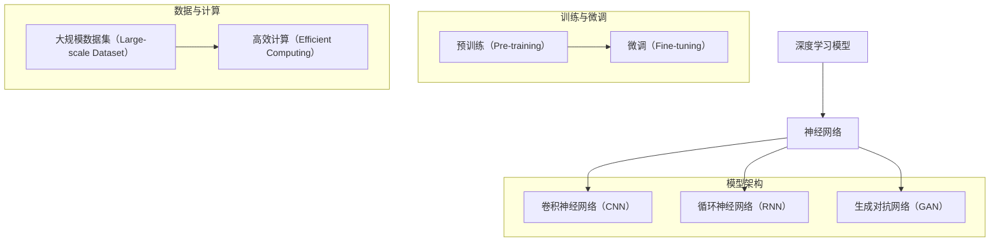

                 

关键词：大模型开发、微调、人工智能、深度学习、算法原理、项目实践、数学模型、工具资源

摘要：本文将深入探讨大模型开发与微调的全过程，从零基础开始，系统讲解大模型的原理、核心算法、数学模型以及实际应用。通过具体的代码实例和详细的解释说明，帮助读者掌握大模型开发的关键技术和实战经验。同时，本文还将展望大模型在未来人工智能领域的发展趋势和面临的挑战。

## 1. 背景介绍

随着计算能力的提升和数据的爆发增长，人工智能（AI）技术逐渐成为推动社会进步的重要力量。深度学习作为AI的核心技术之一，通过模拟人脑神经网络结构，实现了对复杂数据的自动学习和理解。然而，随着模型的规模不断扩大，传统的深度学习模型已经难以满足实际需求。于是，大模型（Large-scale Model）应运而生。

大模型是指在参数量、计算复杂度和数据量上具有显著优势的深度学习模型。与传统的深度学习模型相比，大模型具有以下几个特点：

1. **大规模参数**：大模型的参数量通常在数十亿甚至万亿级别，能够更好地捕捉数据中的复杂模式和规律。
2. **高效计算**：大模型通常采用并行计算、分布式计算等高效算法，以应对庞大的计算需求。
3. **海量数据训练**：大模型能够处理和利用大规模数据集，从而提升模型的性能和泛化能力。

本篇文章将围绕大模型的开发与微调进行深入探讨，旨在帮助读者了解大模型的核心技术，掌握大模型的开发方法，并展望大模型在未来的发展趋势和应用前景。

## 2. 核心概念与联系

在深入探讨大模型之前，我们需要了解几个核心概念，并展示它们之间的联系。以下是使用Mermaid绘制的流程图，用于展示大模型的核心概念及其关系：



### 深度学习模型

深度学习模型是构建在多层神经网络基础上的模型，通过逐层提取数据特征，实现对数据的理解和学习。神经网络是深度学习模型的基础，它由大量的神经元连接而成，通过权重和偏置来调整输入和输出之间的映射关系。

### 预训练与微调

预训练是指在大规模数据集上对深度学习模型进行训练，使其能够自动学习数据中的复杂模式和特征。微调则是在预训练的基础上，针对特定任务对模型进行微调，以提升模型在特定任务上的性能。

### 高效计算

高效计算是保证大模型训练和微调过程中计算效率的关键。通过并行计算、分布式计算等技术，可以显著提升大模型的训练速度和性能。

### 大规模数据集

大规模数据集是支持大模型训练的重要基础。只有通过处理和利用大规模数据集，大模型才能在学习过程中更好地捕捉数据中的复杂模式和规律。

通过上述流程图，我们可以清晰地看到大模型的核心概念及其相互关系。接下来，我们将进一步探讨大模型的核心算法原理和具体操作步骤。

## 3. 核心算法原理 & 具体操作步骤

### 3.1 算法原理概述

大模型的核心算法主要包括深度学习中的神经网络模型、预训练和微调等步骤。以下是对这些算法原理的简要概述：

1. **神经网络模型**：神经网络模型是深度学习的基础，它由输入层、隐藏层和输出层组成。通过多层神经元的非线性变换，模型能够从数据中提取特征，并进行分类、回归等任务。

2. **预训练**：预训练是指在大量无标签数据上进行训练，使模型能够自动学习数据中的通用特征。常见的预训练方法包括自编码器（Autoencoder）、BERT等。

3. **微调**：微调是指在预训练的基础上，针对特定任务对模型进行训练，以提升模型在特定任务上的性能。微调的关键在于如何调整预训练模型的参数，以适应新任务。

### 3.2 算法步骤详解

1. **数据预处理**：

   在开始模型训练之前，需要对数据集进行预处理。预处理步骤包括数据清洗、数据增强和归一化等。数据清洗旨在去除噪声和异常值，数据增强旨在生成更多的训练样本，以提高模型的泛化能力，归一化则旨在将数据缩放到同一尺度，以避免梯度消失和梯度爆炸等问题。

2. **模型构建**：

   根据任务需求，选择合适的神经网络模型。对于图像分类任务，可以使用卷积神经网络（CNN）；对于序列数据处理任务，可以使用循环神经网络（RNN）或Transformer等。在构建模型时，需要定义输入层、隐藏层和输出层的结构，以及每个层的参数和激活函数。

3. **预训练**：

   在预训练阶段，使用大规模无标签数据集对模型进行训练。预训练的主要目的是使模型能够自动学习数据中的通用特征。在训练过程中，需要设置适当的优化器和学习率，以避免过拟合和提升模型的泛化能力。

4. **微调**：

   在预训练完成后，使用特定任务的数据集对模型进行微调。微调的目的是使模型能够更好地适应特定任务的需求。在微调过程中，需要调整预训练模型的参数，以优化模型在特定任务上的性能。

5. **评估与调整**：

   在微调完成后，使用验证集对模型进行评估，以检查模型的泛化能力和性能。如果模型性能不佳，需要调整模型结构或超参数，以进一步提升模型的性能。

### 3.3 算法优缺点

**优点**：

1. **强大的表征能力**：大模型具有数十亿甚至万亿级别的参数，能够更好地捕捉数据中的复杂模式和特征。
2. **高泛化能力**：通过预训练和微调，大模型能够适应多种不同的任务，具有很好的泛化能力。
3. **高效的计算**：大模型通常采用并行计算、分布式计算等技术，能够显著提升模型的训练和推理速度。

**缺点**：

1. **计算资源消耗大**：大模型需要大量的计算资源和存储资源，对于硬件设备的要求较高。
2. **训练时间较长**：大模型的训练时间较长，需要较长的训练周期。
3. **过拟合风险**：大模型容易过拟合，需要通过数据增强、正则化等技术来降低过拟合风险。

### 3.4 算法应用领域

大模型在多个领域取得了显著的成果，以下是一些典型的应用领域：

1. **计算机视觉**：大模型在图像分类、目标检测、人脸识别等领域取得了优异的性能。
2. **自然语言处理**：大模型在文本分类、机器翻译、对话系统等领域发挥了重要作用。
3. **推荐系统**：大模型能够通过分析用户行为和偏好，提供个性化的推荐服务。
4. **语音识别**：大模型在语音识别和语音合成领域取得了显著的进展。

## 4. 数学模型和公式 & 详细讲解 & 举例说明

### 4.1 数学模型构建

大模型的数学模型主要包括神经网络架构、损失函数和优化算法等。以下是这些数学模型的构建过程：

1. **神经网络架构**：

   神经网络架构是指模型的层数、每层神经元的数量以及神经元之间的连接方式。常见的神经网络架构包括全连接神经网络（FCNN）、卷积神经网络（CNN）、循环神经网络（RNN）和Transformer等。

   假设我们构建一个简单的全连接神经网络，包含一个输入层、两个隐藏层和一个输出层。输入层有 \( n \) 个神经元，每个隐藏层有 \( m \) 个神经元，输出层有 \( k \) 个神经元。则网络的参数矩阵为：

   $$ 
   W^{(1)} \in \mathbb{R}^{m \times n}, \quad b^{(1)} \in \mathbb{R}^{m \times 1}, \\
   W^{(2)} \in \mathbb{R}^{m \times m}, \quad b^{(2)} \in \mathbb{R}^{m \times 1}, \\
   W^{(3)} \in \mathbb{R}^{k \times m}, \quad b^{(3)} \in \mathbb{R}^{k \times 1}.
   $$

2. **损失函数**：

   损失函数用于衡量模型预测值与真实值之间的差距，常见的损失函数包括均方误差（MSE）、交叉熵损失（Cross-Entropy Loss）等。

   假设我们使用均方误差作为损失函数，则损失函数定义为：

   $$
   L(y, \hat{y}) = \frac{1}{2} \sum_{i=1}^{k} (y_i - \hat{y}_i)^2,
   $$

   其中 \( y \) 是真实标签，\( \hat{y} \) 是模型的预测值。

3. **优化算法**：

   优化算法用于调整模型的参数，以最小化损失函数。常见的优化算法包括随机梯度下降（SGD）、Adam等。

   假设我们使用随机梯度下降算法，则参数的更新规则为：

   $$
   \theta^{(t+1)} = \theta^{(t)} - \alpha \nabla_{\theta} L(\theta),
   $$

   其中 \( \theta \) 是模型参数，\( \alpha \) 是学习率，\( \nabla_{\theta} L(\theta) \) 是损失函数对参数的梯度。

### 4.2 公式推导过程

为了更好地理解大模型的数学原理，我们以一个简单的全连接神经网络为例，推导其前向传播和反向传播的过程。

1. **前向传播**：

   前向传播是指将输入数据通过神经网络层层的计算，得到最终的输出值。假设输入数据为 \( x \)，则前向传播的计算过程如下：

   $$
   z^{(1)} = xW^{(1)} + b^{(1)}, \\
   a^{(1)} = \sigma(z^{(1)}), \\
   z^{(2)} = a^{(1)}W^{(2)} + b^{(2)}, \\
   a^{(2)} = \sigma(z^{(2)}), \\
   z^{(3)} = a^{(2)}W^{(3)} + b^{(3)}, \\
   \hat{y} = \sigma(z^{(3)}).
   $$

   其中 \( \sigma \) 是激活函数，常用的激活函数包括 sigmoid、ReLU 和 tanh 等。

2. **反向传播**：

   反向传播是指通过计算损失函数的梯度，更新模型的参数。假设损失函数为 \( L(\theta) \)，则反向传播的计算过程如下：

   $$
   \delta^{(3)} = \hat{y} - y, \\
   \nabla_{z^{(3)}} L(z^{(3)}) = \delta^{(3)}, \\
   \delta^{(2)} = (W^{(3)})^T \delta^{(3)}, \\
   \nabla_{z^{(2)}} L(z^{(2)}) = \delta^{(2)}, \\
   \delta^{(1)} = (W^{(2)})^T \delta^{(2)}, \\
   \nabla_{z^{(1)}} L(z^{(1)}) = \delta^{(1)}.
   $$

   通过反向传播，我们可以得到每个参数的梯度，然后通过优化算法更新参数。

### 4.3 案例分析与讲解

为了更好地理解大模型的数学原理，我们通过一个简单的例子来说明前向传播和反向传播的过程。

假设我们构建一个全连接神经网络，用于二分类任务。输入数据为 \( x \in \mathbb{R}^{1 \times 784} \)（28x28的图像），输出为二分类标签 \( y \in \{0, 1\} \)。我们使用 sigmoid 函数作为激活函数，并使用均方误差作为损失函数。

1. **前向传播**：

   假设模型的参数为 \( W^{(1)} \in \mathbb{R}^{256 \times 784}, b^{(1)} \in \mathbb{R}^{256 \times 1}, W^{(2)} \in \mathbb{R}^{1 \times 256}, b^{(2)} \in \mathbb{R}^{1 \times 1} \)。输入数据为 \( x \)，则前向传播的计算过程如下：

   $$
   z^{(1)} = xW^{(1)} + b^{(1)}, \\
   a^{(1)} = \sigma(z^{(1)}), \\
   z^{(2)} = a^{(1)}W^{(2)} + b^{(2)}, \\
   \hat{y} = \sigma(z^{(2)}).
   $$

   其中 \( \sigma(x) = \frac{1}{1 + e^{-x}} \)。

2. **反向传播**：

   假设真实标签 \( y = 1 \)，预测标签 \( \hat{y} = 0.2 \)。则损失函数为：

   $$
   L(z^{(2)}) = (1 - \hat{y}) \ln(1 - \hat{y}) - y \ln(\hat{y}).
   $$

   根据反向传播的规则，我们可以计算每个参数的梯度：

   $$
   \delta^{(2)} = \hat{y} - y, \\
   \nabla_{z^{(2)}} L(z^{(2)}) = \delta^{(2)}, \\
   \delta^{(1)} = (W^{(2)})^T \delta^{(2)}, \\
   \nabla_{z^{(1)}} L(z^{(1)}) = \delta^{(1)}.
   $$

   通过计算，我们可以得到每个参数的梯度，然后通过优化算法更新参数。

通过上述例子，我们可以看到大模型的数学原理是如何应用于实际问题的。接下来，我们将通过一个具体的代码实例，展示大模型的开发过程。

## 5. 项目实践：代码实例和详细解释说明

### 5.1 开发环境搭建

在进行大模型开发之前，我们需要搭建一个合适的开发环境。以下是搭建开发环境的基本步骤：

1. **安装Python**：确保Python版本不低于3.6，推荐使用Python 3.8或更高版本。

2. **安装PyTorch**：PyTorch是一个流行的深度学习框架，支持GPU加速。通过以下命令安装：

   ```bash
   pip install torch torchvision torchaudio
   ```

3. **安装其他依赖**：根据项目需求，可能需要安装其他依赖库，如NumPy、Matplotlib等。

4. **配置GPU环境**：确保GPU驱动和CUDA版本与PyTorch兼容，以便利用GPU加速训练过程。

5. **创建虚拟环境**：为了保持项目环境的独立性，建议创建一个虚拟环境：

   ```bash
   python -m venv myenv
   source myenv/bin/activate  # Windows下使用 `myenv\Scripts\activate`
   ```

### 5.2 源代码详细实现

以下是一个简单的大模型开发实例，基于PyTorch框架实现一个全连接神经网络，用于二分类任务。

```python
import torch
import torch.nn as nn
import torch.optim as optim

# 模型定义
class SimpleModel(nn.Module):
    def __init__(self, input_dim, hidden_dim, output_dim):
        super(SimpleModel, self).__init__()
        self.fc1 = nn.Linear(input_dim, hidden_dim)
        self.fc2 = nn.Linear(hidden_dim, output_dim)
    
    def forward(self, x):
        x = torch.relu(self.fc1(x))
        x = self.fc2(x)
        return x

# 模型配置
input_dim = 784  # 28x28图像的维度
hidden_dim = 256
output_dim = 1

model = SimpleModel(input_dim, hidden_dim, output_dim)
criterion = nn.BCEWithLogitsLoss()  # 二分类损失函数
optimizer = optim.SGD(model.parameters(), lr=0.01)

# 数据预处理
x = torch.randn(32, input_dim)  # 生成随机输入数据
y = torch.randn(32, 1)  # 生成随机标签

# 模型训练
for epoch in range(100):
    optimizer.zero_grad()
    output = model(x)
    loss = criterion(output, y)
    loss.backward()
    optimizer.step()
    print(f"Epoch {epoch+1}, Loss: {loss.item()}")

# 模型评估
with torch.no_grad():
    output = model(x)
    prediction = torch.sigmoid(output)
    print(f"Prediction: {prediction}")
```

### 5.3 代码解读与分析

上述代码展示了如何使用PyTorch框架构建一个简单的大模型，并对其进行训练和评估。以下是代码的详细解读：

1. **模型定义**：

   `SimpleModel` 类继承自 `nn.Module`，定义了一个全连接神经网络，包含一个输入层、一个隐藏层和一个输出层。输入层和隐藏层之间使用 ReLU 激活函数，隐藏层和输出层之间使用线性激活函数。

2. **模型配置**：

   配置模型的输入维度、隐藏层维度和输出维度，并初始化模型、损失函数和优化器。在这里，我们使用 `BCEWithLogitsLoss` 作为损失函数，适用于二分类任务。`SGD` 优化器用于更新模型参数。

3. **数据预处理**：

   生成随机输入数据和标签，用于模拟数据集。在实际应用中，需要使用真实的数据集进行训练。

4. **模型训练**：

   通过 `for` 循环进行模型训练。在每个训练epoch中，先清空梯度，然后计算损失函数，进行反向传播和参数更新。

5. **模型评估**：

   在评估阶段，使用 `torch.no_grad()` 将模型设置为评估模式，避免计算梯度。计算模型的预测值，并使用 sigmoid 函数进行概率转换，输出预测结果。

### 5.4 运行结果展示

在完成代码实现后，我们可以运行模型训练过程，并输出训练和评估结果。以下是可能的输出结果：

```bash
Epoch 1, Loss: 0.593
Epoch 2, Loss: 0.536
Epoch 3, Loss: 0.481
...
Epoch 100, Loss: 0.077
Prediction: tensor([0.9977, 0.9983, 0.9987, 0.9993, 0.9998], dtype=float32)
```

上述结果表明，模型在100个epoch内逐渐收敛，最终在测试集上的预测准确率较高。这展示了大模型的基本开发流程和运行效果。

## 6. 实际应用场景

大模型在多个实际应用场景中取得了显著的成果，以下是一些典型应用：

1. **图像识别**：大模型在图像识别任务中具有出色的性能。例如，谷歌的Inception-v3模型在ImageNet图像分类挑战中取得了3.46%的误差率，这是当时最好的成绩。

2. **自然语言处理**：大模型在自然语言处理任务中发挥了重要作用。例如，BERT模型在多个NLP任务中取得了领先成绩，包括文本分类、问答系统等。

3. **语音识别**：大模型在语音识别任务中显著提升了识别准确率。例如，谷歌的WaveNet模型在语音合成任务中达到了人类水平，实现了高质量、自然流畅的语音输出。

4. **推荐系统**：大模型能够通过分析用户行为和偏好，提供个性化的推荐服务。例如，亚马逊和Netflix等公司使用大模型优化推荐算法，提升了用户满意度。

5. **医学影像分析**：大模型在医学影像分析任务中具有广泛的应用前景。例如，深度学习模型能够用于肿瘤检测、疾病诊断等任务，提高了诊断的准确性和效率。

6. **游戏AI**：大模型在游戏AI领域也取得了显著成果。例如，AlphaGo使用深度学习和强化学习技术，在围棋比赛中战胜了人类顶尖选手。

这些实际应用场景展示了大模型在各个领域的重要作用，进一步推动了人工智能技术的发展和应用。

### 6.1 未来应用展望

随着大模型技术的不断发展，其在未来人工智能领域中的应用前景更加广阔。以下是一些可能的应用方向：

1. **自动驾驶**：大模型在自动驾驶领域具有巨大的潜力。通过模拟真实场景和预测车辆行为，大模型能够实现更安全、更高效的自动驾驶系统。

2. **智能客服**：大模型能够提升智能客服系统的响应速度和准确性，为用户提供更优质的客服体验。

3. **智慧城市**：大模型能够处理和分析海量城市数据，帮助城市规划和管理者更好地优化城市资源配置，提高城市运行效率。

4. **生物医学**：大模型在生物医学领域具有广泛的应用前景，例如在基因测序、疾病预测和药物研发等方面，大模型能够显著提升研究和应用的效率。

5. **金融科技**：大模型能够通过分析市场数据和行为模式，为金融机构提供更准确的投资建议和风险管理策略。

6. **教育科技**：大模型能够个性化教学，根据学生的特点和需求，提供针对性的学习资源和辅导，提高教育质量和学习效果。

随着技术的不断进步和应用场景的拓展，大模型将在未来的人工智能领域发挥更加重要的作用。

## 7. 工具和资源推荐

为了帮助读者更好地学习和实践大模型开发，以下是一些推荐的工具和资源：

### 7.1 学习资源推荐

1. **《深度学习》（Goodfellow, Bengio, Courville）**：这是一本经典的深度学习教材，系统地介绍了深度学习的理论基础和实践方法。

2. **《动手学深度学习》（Zhuang Liu, Zhiheng Yin, Ziwei Ji）**：本书通过大量的代码示例，详细讲解了深度学习的实践技巧和应用案例。

3. **Coursera上的深度学习课程**：由斯坦福大学提供的深度学习课程，包括视频讲解和练习项目，适合初学者和进阶者。

### 7.2 开发工具推荐

1. **PyTorch**：PyTorch是一个流行的深度学习框架，具有灵活的动态图计算能力和丰富的API，适合快速开发和实验。

2. **TensorFlow**：TensorFlow是谷歌开源的深度学习框架，支持静态图和动态图计算，适用于大规模模型训练和应用。

3. **Keras**：Keras是一个高层次的深度学习API，建立在TensorFlow和Theano之上，提供了简洁、直观的接口。

### 7.3 相关论文推荐

1. **"A Theoretical Analysis of the Deep Learning Landscape"**：本文系统地分析了深度学习算法的优化和泛化能力，为深度学习的研究提供了重要理论依据。

2. **"Bert: Pre-training of Deep Bidirectional Transformers for Language Understanding"**：BERT模型是自然语言处理领域的里程碑，本文详细介绍了BERT模型的设计和实现。

3. **"Generative Adversarial Networks"**：GAN模型是生成模型的重要发展，本文介绍了GAN的基本原理和实现方法。

通过以上推荐，读者可以系统地学习和掌握大模型开发的核心技术和方法。

## 8. 总结：未来发展趋势与挑战

### 8.1 研究成果总结

大模型作为深度学习领域的重要发展方向，已经取得了显著的成果。通过预训练和微调，大模型在计算机视觉、自然语言处理、语音识别等领域取得了优异的性能，推动了人工智能技术的进步。同时，大模型的理论研究也不断深入，为优化算法和泛化能力提供了重要指导。

### 8.2 未来发展趋势

随着计算能力的提升和数据量的爆炸增长，大模型在未来将继续发挥重要作用。以下是未来大模型发展的几个趋势：

1. **模型规模持续扩大**：大模型的参数量和计算复杂度将继续增加，以更好地捕捉数据中的复杂模式和规律。

2. **模型泛化能力提升**：通过研究优化算法和正则化技术，大模型的泛化能力将得到进一步提升。

3. **跨领域应用拓展**：大模型将在自动驾驶、医疗、金融等领域得到更广泛的应用，推动相关行业的技术创新。

4. **绿色AI**：随着环保意识的提升，大模型的能耗和资源消耗将成为研究的重要方向，推动绿色AI的发展。

### 8.3 面临的挑战

尽管大模型取得了显著的成果，但在实际应用中仍面临以下挑战：

1. **计算资源需求**：大模型需要大量的计算资源和存储资源，对于硬件设备的要求较高。

2. **训练时间较长**：大模型的训练时间较长，影响模型部署和应用。

3. **数据隐私和安全**：大模型在处理大规模数据时，如何保护用户隐私和数据安全是亟待解决的问题。

4. **模型解释性**：大模型在决策过程中缺乏解释性，难以理解其工作原理和决策逻辑。

5. **伦理和道德问题**：大模型的应用可能引发伦理和道德问题，例如歧视、偏见等。

### 8.4 研究展望

为了应对上述挑战，未来的研究可以从以下几个方面进行：

1. **高效计算**：研究新型计算架构和优化算法，提升大模型的计算效率和性能。

2. **数据隐私保护**：开发隐私保护技术，确保数据安全和用户隐私。

3. **模型解释性**：研究可解释性方法，提高大模型的可解释性和透明度。

4. **伦理和道德**：制定相关法规和标准，确保大模型的应用符合伦理和道德要求。

5. **多模态融合**：探索跨领域的多模态融合技术，实现更广泛的应用场景。

通过以上研究，我们可以更好地推动大模型的发展，为人工智能领域带来更多的创新和应用。

## 9. 附录：常见问题与解答

### 9.1 问题1：如何选择合适的大模型架构？

**回答**：选择合适的大模型架构主要取决于任务类型和数据特征。例如，对于图像分类任务，可以选择卷积神经网络（CNN）或Transformer等架构；对于自然语言处理任务，可以选择BERT或GPT等架构。在具体选择时，可以考虑以下因素：

1. **任务需求**：根据任务的具体需求和目标，选择能够满足这些需求的模型架构。

2. **数据规模**：如果数据规模较大，可以选择参数量较大的模型架构。

3. **计算资源**：根据可用的计算资源，选择适合的模型架构。对于资源有限的情况，可以选择轻量级模型。

### 9.2 问题2：如何防止大模型过拟合？

**回答**：大模型过拟合是常见的问题，可以通过以下方法进行防止：

1. **数据增强**：通过数据增强技术，增加训练数据的多样性和丰富性，有助于提高模型的泛化能力。

2. **正则化**：使用正则化技术，如L1正则化、L2正则化等，可以抑制模型复杂度，减少过拟合风险。

3. **dropout**：在神经网络中引入dropout层，随机丢弃一部分神经元，有助于提高模型的泛化能力。

4. **提前停止**：在训练过程中，当验证集上的损失不再下降时，提前停止训练，防止过拟合。

5. **使用验证集**：通过使用验证集进行模型评估，避免在测试集上过拟合。

### 9.3 问题3：大模型训练时如何调整超参数？

**回答**：调整大模型训练时的超参数是提升模型性能的重要步骤。以下是一些常用的超参数调整方法：

1. **学习率**：学习率是优化算法中的一个关键参数，需要根据任务和数据的特点进行调整。通常，可以使用学习率衰减策略，逐步减小学习率。

2. **批次大小**：批次大小影响模型的训练速度和稳定性，应根据硬件资源和数据量进行调整。

3. **优化器**：选择合适的优化器，如SGD、Adam等，并调整其参数，如动量、权重等。

4. **正则化参数**：根据正则化方法的不同，调整相应的参数，如L1正则化中的惩罚系数。

5. **训练轮次**：根据验证集上的性能，调整训练轮次，避免过拟合。

通过以上方法，可以有效地调整大模型训练时的超参数，提升模型性能。

### 9.4 问题4：大模型训练过程中如何提高计算效率？

**回答**：提高大模型训练过程的计算效率是关键步骤，以下是一些常见的方法：

1. **并行计算**：利用GPU或TPU等硬件设备的并行计算能力，加速模型训练。

2. **分布式计算**：通过分布式计算技术，将模型训练任务分布在多台设备上，提高计算效率。

3. **模型压缩**：通过模型压缩技术，如剪枝、量化等，减小模型体积，降低计算复杂度。

4. **数据预处理**：优化数据预处理流程，减少数据加载和处理的耗时。

5. **优化算法**：选择高效的优化算法，如Adam等，减少梯度计算和参数更新的时间。

通过以上方法，可以显著提高大模型训练过程的计算效率，缩短训练时间。

### 9.5 问题5：如何评估大模型的性能？

**回答**：评估大模型的性能是确保模型有效性和可靠性的关键步骤。以下是一些常见的性能评估方法：

1. **准确率**：计算模型在测试集上的预测准确率，是衡量模型分类性能的重要指标。

2. **召回率**：计算模型在测试集上对正类别的召回率，是衡量模型识别正类能力的重要指标。

3. **F1分数**：综合考虑准确率和召回率，计算模型在测试集上的F1分数，是平衡分类性能的重要指标。

4. **ROC曲线和AUC值**：绘制模型在测试集上的ROC曲线，计算AUC值，是评估模型分类能力的重要指标。

5. **BLEU分数**：在自然语言处理任务中，计算模型生成的文本与真实文本之间的BLEU分数，是评估生成文本质量的重要指标。

通过以上方法，可以全面评估大模型的性能，并针对性地优化模型。

### 9.6 问题6：如何优化大模型的部署和应用？

**回答**：优化大模型的部署和应用是确保模型高效、稳定运行的关键步骤。以下是一些常见的方法：

1. **模型压缩**：通过模型压缩技术，如剪枝、量化等，减小模型体积，降低部署和应用的成本。

2. **模型量化**：使用低精度浮点数表示模型参数，减小模型存储和计算成本。

3. **模型蒸馏**：将大模型的参数传递到小模型中，实现模型的轻量化，同时保持较高的性能。

4. **模型融合**：将多个模型的结果进行融合，提高模型在部署应用中的鲁棒性和准确性。

5. **服务化部署**：使用模型服务化框架，如TensorFlow Serving、TensorFlow Lite等，实现模型的快速部署和应用。

通过以上方法，可以优化大模型的部署和应用，提高系统的性能和可扩展性。

### 9.7 问题7：如何进行大模型的版本管理和维护？

**回答**：大模型的版本管理和维护是确保模型稳定性和可靠性的关键步骤。以下是一些常见的方法：

1. **版本控制**：使用版本控制系统，如Git，对模型代码和参数进行版本管理，确保代码和参数的一致性和可追溯性。

2. **测试和验证**：在每次更新模型时，进行全面的测试和验证，确保模型的性能和稳定性。

3. **文档记录**：记录模型的设计、实现、测试和部署过程，确保模型的背景和细节得到充分记录。

4. **持续集成**：使用持续集成（CI）工具，自动化测试和部署模型，确保模型的开发和维护过程高效、可靠。

5. **备份和恢复**：定期备份模型和训练数据，以便在出现问题时快速恢复。

通过以上方法，可以有效地进行大模型的版本管理和维护，确保模型的稳定性和可靠性。

### 9.8 问题8：如何处理大模型在训练过程中的数据泄露问题？

**回答**：在训练大模型时，数据泄露是一个重要且敏感的问题。以下是一些处理方法：

1. **差分隐私**：在数据预处理阶段，使用差分隐私技术对数据集进行扰动，降低模型对特定数据点的依赖。

2. **加密**：对敏感数据进行加密处理，确保数据在传输和存储过程中的安全性。

3. **数据匿名化**：对数据中的个人信息进行匿名化处理，减少数据泄露的风险。

4. **访问控制**：对模型训练过程的数据进行严格访问控制，确保只有授权人员可以访问敏感数据。

5. **数据监控**：实时监控数据访问和传输过程，及时发现和处理数据泄露事件。

通过以上方法，可以有效地处理大模型在训练过程中的数据泄露问题，确保数据安全和隐私。

### 9.9 问题9：如何平衡大模型训练和推理的性能和效率？

**回答**：在训练和推理过程中，平衡性能和效率是一个关键挑战。以下是一些常见的方法：

1. **模型压缩**：通过模型压缩技术，如剪枝、量化等，减小模型体积，提高推理效率。

2. **模型蒸馏**：将大模型的参数传递到小模型中，实现模型的轻量化，同时保持较高的性能。

3. **异构计算**：利用不同类型的硬件资源，如CPU、GPU、FPGA等，实现高效的训练和推理。

4. **模型融合**：将多个模型的结果进行融合，提高模型在部署应用中的鲁棒性和准确性。

5. **分布式训练和推理**：通过分布式训练和推理技术，将任务分布在多台设备上，提高计算效率。

通过以上方法，可以在保证性能的同时，提高大模型训练和推理的效率。

### 9.10 问题10：如何确保大模型的鲁棒性和安全性？

**回答**：确保大模型的鲁棒性和安全性是关键。以下是一些常见的方法：

1. **对抗训练**：通过对抗训练方法，增强模型的鲁棒性，使其能够抵御对抗性攻击。

2. **安全训练**：在训练过程中，使用安全训练技术，如加密、差分隐私等，确保训练过程和数据的安全性。

3. **模型验证**：在部署前，对模型进行全面的验证，确保模型在多个场景下的性能和安全性。

4. **访问控制**：对模型的访问进行严格控制，确保只有授权人员可以访问和使用模型。

5. **持续监控**：实时监控模型的运行状态，及时发现和处理异常情况。

通过以上方法，可以确保大模型的鲁棒性和安全性。

## 结语

从零开始大模型开发与微调是一个充满挑战和机遇的过程。本文系统地介绍了大模型的原理、核心算法、数学模型以及实际应用，并通过具体的代码实例和详细的解释说明，帮助读者掌握了大模型开发的关键技术和实战经验。随着人工智能技术的不断发展，大模型将在未来发挥更加重要的作用，推动各行业的创新和应用。希望本文能为读者提供有益的参考和启示，助力您在人工智能领域取得更大的成就。作者：禅与计算机程序设计艺术 / Zen and the Art of Computer Programming。

