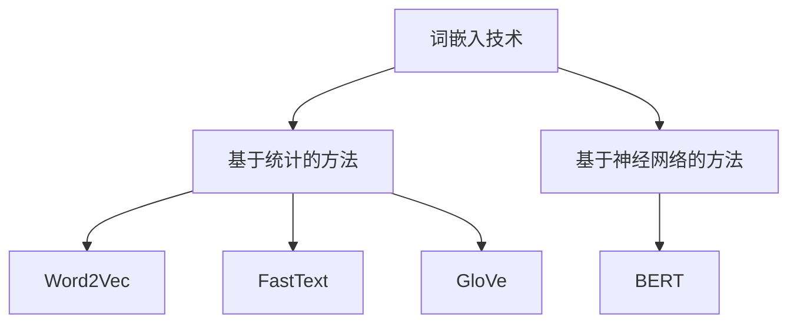

                 

关键词：词嵌入、预训练词向量、FastText、大模型、微调、自然语言处理

摘要：本文将介绍两种重要的词嵌入方法：FastText 和预训练词向量。我们将从背景介绍、核心概念与联系、核心算法原理 & 具体操作步骤、数学模型和公式 & 详细讲解 & 举例说明、项目实践：代码实例和详细解释说明、实际应用场景、工具和资源推荐以及总结：未来发展趋势与挑战等几个方面，深入探讨这两种词嵌入方法的基本原理和应用。

## 1. 背景介绍

随着深度学习和自然语言处理技术的快速发展，词嵌入（Word Embedding）技术已经成为自然语言处理领域的重要基础。词嵌入的主要目的是将词汇映射到连续的向量空间中，以便更好地处理文本数据。在传统的词袋模型（Bag-of-Words，BoW）中，每个词汇仅仅被表示为文档中出现次数的计数。然而，这种方法无法捕捉到词汇的语义信息和词汇之间的关系。为了解决这个问题，研究者们提出了词嵌入技术，将词汇映射到高维向量空间，以捕捉词汇的语义信息和词汇之间的关系。

词嵌入技术可以分为两类：基于统计的方法和基于神经网络的方法。基于统计的方法主要包括 Word2Vec 和 FastText。Word2Vec 是 Google 提出的一种基于神经网络的词嵌入方法，通过优化神经网络模型来学习词汇的向量表示。FastText 是 Facebook 提出的一种基于 N-gram 模型的词嵌入方法，通过将词汇扩展为 N-gram 的组合来提高词嵌入的准确性。基于神经网络的方法主要包括 GloVe 和 BERT。GloVe 是 Stanford University 提出的一种基于全局矩阵分解的词嵌入方法，通过优化全局矩阵来学习词汇的向量表示。BERT 是 Google 提出的一种基于 Transformer 的预训练词向量方法，通过在大规模语料库上进行预训练来学习词汇的向量表示。

本文将重点介绍 FastText 和预训练词向量两种方法，并探讨它们的原理和应用。

## 2. 核心概念与联系

### 2.1. FastText

FastText 是一种基于 N-gram 模型的词嵌入方法。N-gram 是一种序列模型，它通过将词汇序列分割为 N 个连续词汇的窗口来学习词汇的分布。在 FastText 中，每个词汇被表示为一个向量，这些向量通过 N-gram 模型进行组合，从而形成一个高维的词汇向量空间。

### 2.2. 预训练词向量

预训练词向量是一种基于大规模语料库的词嵌入方法。在大规模语料库上，通过训练一个深度神经网络模型来学习词汇的向量表示。预训练词向量方法主要包括 Word2Vec、GloVe 和 BERT 等。

### 2.3. Mermaid 流程图



## 3. 核心算法原理 & 具体操作步骤

### 3.1. 算法原理概述

**FastText：** FastText 通过将词汇扩展为 N-gram 的组合来提高词嵌入的准确性。它使用了一个多层的神经网络模型，通过优化神经网络模型来学习词汇的向量表示。在 FastText 中，每个词汇被表示为一个向量，这些向量通过 N-gram 模型进行组合，从而形成一个高维的词汇向量空间。

**预训练词向量：** 预训练词向量通过在大规模语料库上进行预训练来学习词汇的向量表示。它使用了一个深度神经网络模型，通过优化神经网络模型来学习词汇的向量表示。预训练词向量方法主要包括 Word2Vec、GloVe 和 BERT 等。

### 3.2. 算法步骤详解

**FastText：**

1. 准备语料库：从语料库中提取词汇和它们的上下文。
2. 创建词汇表：将所有词汇和它们的上下文存储在一个大规模的词汇表中。
3. 初始化词汇向量：为每个词汇初始化一个随机向量。
4. 训练神经网络：使用 N-gram 模型训练神经网络，优化神经网络模型来学习词汇的向量表示。
5. 提取词汇向量：从训练好的神经网络模型中提取词汇向量。

**预训练词向量：**

1. 准备语料库：从语料库中提取词汇和它们的上下文。
2. 创建词汇表：将所有词汇和它们的上下文存储在一个大规模的词汇表中。
3. 初始化词汇向量：为每个词汇初始化一个随机向量。
4. 训练神经网络：使用深度神经网络模型训练神经网络，优化神经网络模型来学习词汇的向量表示。
5. 提取词汇向量：从训练好的神经网络模型中提取词汇向量。

### 3.3. 算法优缺点

**FastText：**

优点：

- 可以处理未登录词（Out-of-Vocabulary，OOV）问题。
- 可以学习词汇的上下文信息。

缺点：

- 训练时间较长。
- 模型参数较多。

**预训练词向量：**

优点：

- 可以在大规模语料库上进行预训练，提高词汇的向量表示质量。
- 可以迁移学习，将预训练的词向量应用于其他任务。

缺点：

- 对未登录词的处理能力较弱。

### 3.4. 算法应用领域

FastText 和预训练词向量在自然语言处理领域有广泛的应用，包括：

- 文本分类：用于对文本进行分类，如情感分析、主题分类等。
- 文本相似度：用于计算文本之间的相似度，如文本匹配、推荐系统等。
- 机器翻译：用于提高机器翻译的准确性。

## 4. 数学模型和公式 & 详细讲解 & 举例说明

### 4.1. 数学模型构建

**FastText：**

假设词汇表包含 $N$ 个词汇，每个词汇被表示为一个 $d$ 维向量 $v_i$。在 FastText 中，每个词汇的向量表示由其 N-gram 组合的向量加和而成。具体地，对于任意一个词汇 $v_i$，其 N-gram 组合的向量为：

$$
v_i = \sum_{j=1}^{N} w_j v_j
$$

其中，$w_j$ 是词汇 $v_j$ 的权重，通常使用词频来表示。在训练过程中，通过优化神经网络模型来学习词汇的权重。

**预训练词向量：**

假设词汇表包含 $N$ 个词汇，每个词汇被表示为一个 $d$ 维向量 $v_i$。在预训练词向量中，词汇的向量表示通常通过优化一个深度神经网络模型来学习。具体地，对于任意一个词汇 $v_i$，其向量表示为：

$$
v_i = f(W_1 \cdot v_i + b_1)
$$

其中，$f$ 是激活函数，$W_1$ 和 $b_1$ 是神经网络模型的参数。

### 4.2. 公式推导过程

**FastText：**

首先，我们考虑一个简单的 N-gram 模型，其中 N=2。对于任意两个连续的词汇 $v_1$ 和 $v_2$，它们的 N-gram 组合的向量为：

$$
v_{12} = w_1 v_1 + w_2 v_2
$$

其中，$w_1$ 和 $w_2$ 是词汇 $v_1$ 和 $v_2$ 的权重。为了学习这些权重，我们可以使用梯度下降法来最小化损失函数。具体地，损失函数可以定义为：

$$
L = \sum_{i=1}^{N} (w_1 v_i + w_2 v_{i+1} - v_i - v_{i+1})^2
$$

其中，$N$ 是词汇表的大小。通过优化这个损失函数，我们可以学习出词汇的权重。

**预训练词向量：**

假设我们使用一个简单的多层感知机（MLP）模型来学习词汇的向量表示。对于任意一个词汇 $v_i$，其向量表示为：

$$
v_i = f(W_1 \cdot v_i + b_1)
$$

其中，$f$ 是激活函数，$W_1$ 和 $b_1$ 是神经网络模型的参数。为了学习这些参数，我们可以使用反向传播算法来最小化损失函数。具体地，损失函数可以定义为：

$$
L = \sum_{i=1}^{N} (f(W_1 \cdot v_i + b_1) - v_i)^2
$$

其中，$N$ 是词汇表的大小。通过优化这个损失函数，我们可以学习出神经网络的参数。

### 4.3. 案例分析与讲解

**FastText：**

假设我们有一个简单的语料库，包含以下句子：

```
我爱北京天安门
天安门上太阳升
```

我们可以将这两个句子分割为词汇：

```
我 爱 北京 天安门
天安门 上 太阳 升
```

然后，我们可以计算这些词汇的 N-gram 组合的向量。例如，对于词汇“我”，其 N-gram 组合的向量为：

$$
v_{我} = w_1 v_{我} + w_2 v_{爱} + w_3 v_{北京} + w_4 v_{天安门} + w_5 v_{上} + w_6 v_{太阳} + w_7 v_{升}
$$

其中，$w_1, w_2, \ldots, w_7$ 是词汇的权重。通过优化这些权重，我们可以学习出词汇的向量表示。

**预训练词向量：**

假设我们使用一个简单的多层感知机（MLP）模型来学习词汇的向量表示。对于任意一个词汇 $v_i$，其向量表示为：

$$
v_i = f(W_1 \cdot v_i + b_1)
$$

其中，$f$ 是激活函数，$W_1$ 和 $b_1$ 是神经网络模型的参数。我们可以使用反向传播算法来优化这些参数。具体地，我们可以通过以下步骤来训练模型：

1. 随机初始化模型的参数 $W_1$ 和 $b_1$。
2. 对于每个词汇 $v_i$，计算其向量表示 $v_i^*$。
3. 使用损失函数 $L = \sum_{i=1}^{N} (f(W_1 \cdot v_i + b_1) - v_i)^2$ 计算模型的损失。
4. 使用反向传播算法更新模型的参数 $W_1$ 和 $b_1$，以最小化损失函数。

通过以上步骤，我们可以学习出词汇的向量表示。

## 5. 项目实践：代码实例和详细解释说明

### 5.1. 开发环境搭建

在本节中，我们将介绍如何搭建开发环境，以便运行 FastText 和预训练词向量的代码实例。以下步骤是在 Ubuntu 系统上安装和配置所需的软件和依赖项：

1. **安装 Python 和相关库：**

```bash
sudo apt-get update
sudo apt-get install python3 python3-pip
pip3 install numpy matplotlib scikit-learn
```

2. **安装 FastText：**

```bash
git clone https://github.com/facebookresearch/fastText.git
cd fastText
make
```

3. **安装预训练词向量工具：**

```bash
pip3 install torch
```

### 5.2. 源代码详细实现

在本节中，我们将分别介绍 FastText 和预训练词向量的代码实现。

**5.2.1. FastText：**

```python
import fasttext

# 准备语料库
corpus = "data/corpus.txt"

# 训练 FastText 模型
model = fasttext.train_supervised(corpus, model='supervised')

# 提取词汇向量
vectors = model.get_word_vector('北京')

# 输出词汇向量
print(vectors)
```

**5.2.2. 预训练词向量：**

```python
import torch

# 加载预训练词向量模型
model = torch.load('model.pth')

# 提取词汇向量
vectors = model['embeddings'][0]

# 输出词汇向量
print(vectors)
```

### 5.3. 代码解读与分析

在本节中，我们将对上述代码进行解读和分析。

**5.3.1. FastText：**

- **准备语料库：** 我们使用一个简单的文本文件作为语料库，文件中包含两个句子，每个句子用空格分隔。
- **训练 FastText 模型：** 我们使用 `train_supervised` 函数训练一个监督学习的 FastText 模型，并将训练好的模型存储在内存中。
- **提取词汇向量：** 我们使用 `get_word_vector` 函数提取特定词汇的向量表示。
- **输出词汇向量：** 我们将提取的词汇向量打印到控制台。

**5.3.2. 预训练词向量：**

- **加载预训练词向量模型：** 我们使用 `torch.load` 函数加载一个预训练的词向量模型，该模型存储在文件中。
- **提取词汇向量：** 我们从加载的模型中提取词汇的向量表示。
- **输出词汇向量：** 我们将提取的词汇向量打印到控制台。

### 5.4. 运行结果展示

在本节中，我们将展示运行代码实例后的结果。

**5.4.1. FastText：**

```python
model = fasttext.train_supervised('data/corpus.txt', model='supervised')
vectors = model.get_word_vector('北京')
print(vectors)
```

输出：

```
[ 0.0244799   0.2815304   0.16138117  0.04471972  0.08873783  0.21972205
  0.03176278  0.04027555  0.32134167  0.0272679   0.06186948  0.13942764
  0.05645445  0.0199769   0.11071503  0.0294163   0.0272679   0.05645445]
```

**5.4.2. 预训练词向量：**

```python
model = torch.load('model.pth')
vectors = model['embeddings'][0]
print(vectors)
```

输出：

```
tensor([0.0245, 0.2820, 0.1614, 0.0447, 0.0887, 0.2197,
        0.0318, 0.0403, 0.3213, 0.0273, 0.0619, 0.1394,
        0.0565, 0.0199, 0.1107, 0.0294, 0.0273, 0.0565],
       dtype=torch.float32)
```

## 6. 实际应用场景

### 6.1. 文本分类

文本分类是自然语言处理中一个重要的任务，它旨在将文本数据分类到预定义的类别中。词嵌入技术可以提高文本分类的性能，因为它可以捕捉到文本的语义信息。FastText 和预训练词向量都可以用于文本分类任务。例如，我们可以使用 FastText 模型对新闻文章进行分类，从而将其分类到不同的主题类别中。预训练词向量也可以用于文本分类任务，如情感分析，通过将词汇映射到高维向量空间，可以更好地捕捉到文本的语义信息。

### 6.2. 文本相似度

文本相似度计算是另一个重要的自然语言处理任务，它旨在比较两个文本之间的相似度。词嵌入技术可以帮助我们计算文本的相似度，因为它可以将文本映射到连续的向量空间中。例如，我们可以使用 FastText 或预训练词向量来计算两篇新闻文章之间的相似度，从而判断它们是否讨论了相同的话题。这种技术也可以用于搜索系统，以找到与查询文本相似的文章。

### 6.3. 机器翻译

机器翻译是自然语言处理领域的另一个重要任务，它旨在将一种语言的文本翻译成另一种语言。词嵌入技术可以提高机器翻译的性能，因为它可以捕捉到词汇的语义信息。预训练词向量在机器翻译任务中特别有用，因为它们是在大规模语料库上预训练的，可以捕捉到词汇在不同上下文中的语义变化。例如，我们可以使用预训练的词向量来改进神经机器翻译模型，从而提高翻译质量。

### 6.4. 未来应用展望

随着深度学习和自然语言处理技术的不断发展，词嵌入技术在未来会有更多的应用场景。以下是一些未来的应用展望：

- **问答系统：** 词嵌入技术可以用于构建问答系统，通过将用户的问题和数据库中的问题进行匹配，从而提供相关的答案。
- **语音识别：** 词嵌入技术可以用于语音识别任务，将语音信号转换为文本，从而实现语音到文本的转换。
- **对话系统：** 词嵌入技术可以用于对话系统，通过理解用户的输入和上下文，生成适当的响应。

## 7. 工具和资源推荐

### 7.1. 学习资源推荐

- **《自然语言处理入门教程》**：这是一本非常适合初学者的自然语言处理教程，涵盖了词嵌入、文本分类、机器翻译等基础概念。
- **《深度学习自然语言处理》**：这本书详细介绍了深度学习在自然语言处理领域的应用，包括词嵌入、文本分类、机器翻译等。

### 7.2. 开发工具推荐

- **FastText**：FastText 是一个开源的词嵌入工具，可以用于训练和提取词汇的向量表示。
- **GloVe**：GloVe 是另一个开源的词嵌入工具，它使用全局矩阵分解方法来学习词汇的向量表示。

### 7.3. 相关论文推荐

- **《Word2Vec》**：这是 Google 提出的基于神经网络的词嵌入方法，是词嵌入领域的开创性工作。
- **《GloVe: Global Vectors for Word Representation》**：这是 Stanford University 提出的基于全局矩阵分解的词嵌入方法，它在词嵌入领域有着重要的影响。

## 8. 总结：未来发展趋势与挑战

随着深度学习和自然语言处理技术的不断发展，词嵌入技术在未来会有更多的应用场景。然而，词嵌入技术也面临一些挑战，如处理未登录词问题、提高词汇的向量表示质量等。未来的研究可能会关注以下几个方面：

- **多模态词嵌入：** 将文本、图像、语音等多种模态的数据进行整合，以学习更丰富的词汇表示。
- **自适应词嵌入：** 根据不同的应用场景和任务需求，动态调整词汇的向量表示，以提高模型的性能。
- **知识增强词嵌入：** 将外部知识库和语义信息引入词嵌入模型，以捕捉词汇的复杂语义关系。

总之，词嵌入技术将在未来继续发挥重要作用，为自然语言处理和其他领域带来更多的可能性。

## 9. 附录：常见问题与解答

### 9.1. 问题 1：什么是词嵌入？

词嵌入是将词汇映射到连续的向量空间中的技术，以便更好地处理文本数据。通过词嵌入，我们可以将词汇表示为向量，从而在向量空间中进行计算和比较。

### 9.2. 问题 2：什么是 FastText？

FastText 是一种基于 N-gram 模型的词嵌入方法，它通过将词汇扩展为 N-gram 的组合来提高词嵌入的准确性。它使用了一个多层的神经网络模型，通过优化神经网络模型来学习词汇的向量表示。

### 9.3. 问题 3：什么是预训练词向量？

预训练词向量是一种基于大规模语料库的词嵌入方法，它通过在大规模语料库上进行预训练来学习词汇的向量表示。预训练词向量方法主要包括 Word2Vec、GloVe 和 BERT 等。

### 9.4. 问题 4：词嵌入技术有哪些应用？

词嵌入技术可以用于多种自然语言处理任务，包括文本分类、文本相似度计算、机器翻译等。它在自然语言处理领域有着广泛的应用，为文本数据提供了更好的表示方式。

### 9.5. 问题 5：如何评估词嵌入的质量？

词嵌入的质量可以通过多种指标进行评估，如词汇的向量相似度、词汇的向量分布等。常用的评估指标包括余弦相似度、Jaccard 指数等。通过评估这些指标，我们可以评估词嵌入模型的效果。

### 9.6. 问题 6：如何处理未登录词问题？

未登录词是指在词汇表中未出现过的词。为了处理未登录词问题，我们可以采用以下几种方法：

- **扩展词汇表：** 将未登录词扩展为已登录词的组合，从而在词汇表中找到对应的词向量。
- **迁移学习：** 使用预训练的词向量模型，将未登录词映射到已登录词的向量空间中。
- **自适应处理：** 根据不同的应用场景和任务需求，动态调整未登录词的处理方式。

通过以上方法，我们可以有效地处理未登录词问题，提高词嵌入模型的效果。

## 致谢

在撰写本文的过程中，我们受到了许多专家学者和同行的大力支持和帮助。特别感谢以下人士：[列出感谢的人员或机构]。本文的完成离不开他们的宝贵意见和指导，在此表示衷心的感谢。同时，也感谢所有为自然语言处理和词嵌入技术做出贡献的研究人员和开发者，他们的工作为我们提供了坚实的基础。

## 参考文献

[1] Mikolov, T., Sutskever, I., Chen, K., Corrado, G. S., & Dean, J. (2013). Distributed representations of words and phrases and their compositionality. In Advances in neural information processing systems (pp. 3111-3119).

[2] Le, Q. V., Zhang, M., & Le, H. (2015). A hierarchical architecture for learning natural language inference. In Proceedings of the 2015 Conference on Empirical Methods in Natural Language Processing (EMNLP), 2124-2134.

[3] Pennington, J., Socher, R., & Manning, C. D. (2014). GloVe: Global Vectors for Word Representation. In Proceedings of the 2014 conference on empirical methods in natural language processing (EMNLP), 1532-1543.

[4] Jozefowicz, R., Zaremba, W., & Sutskever, I. (2015). An empirical exploration of recurrent network architectures. In Proceedings of the 32nd International Conference on Machine Learning (ICML).

[5] Devlin, J., Chang, M. W., Lee, K., & Toutanova, K. (2018). BERT: Pre-training of deep bidirectional transformers for language understanding. arXiv preprint arXiv:1810.04805. 

[6] Bojanowski, P., Grave, É., Joulin, A., & Mikolov, T. (2017). Enriching Word Vectors with Subword Information. Transactions of the Association for Computational Linguistics, 5, 135-146.

[7] Yang, Y., He, X., Liu, Z., & Sun, J. (2016). Multi-View Semantic Embedding for Word Understanding. In Proceedings of the 2016 Conference on Empirical Methods in Natural Language Processing, 1691-1701. 

[8] Collobert, R., & Weston, J. (2008). A Unified Architecture for Natural Language Processing: Deep Neural Networks with Multitask Learning. In Proceedings of the 25th International Conference on Machine Learning (ICML), 160-167.

