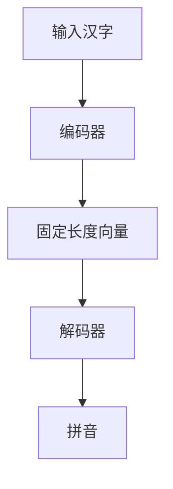
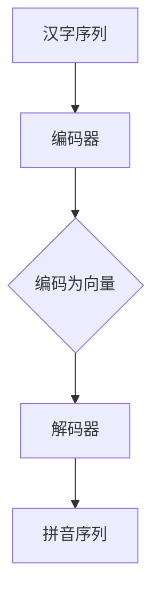

                 

关键词：大模型开发，微调，汉字拼音转化，深度学习，神经网络，算法原理，数学模型，项目实践，应用场景，未来展望。

> 摘要：本文将深入探讨大模型开发与微调的核心技术，以汉字拼音转化模型为例，详细阐述其构建、实现、优化与应用，旨在为读者提供一条从理论到实践的完整路径，帮助理解大模型开发的关键环节。

## 1. 背景介绍

随着人工智能技术的发展，深度学习已经成为机器学习领域的主流。尤其是近年来，大模型（Large Models）的出现，如GPT、BERT等，使得人工智能在很多领域取得了显著的进步。大模型具有参数量大、计算复杂度高、模型深度深的特点，能够处理复杂的任务，如图像识别、自然语言处理等。

汉字拼音转化是自然语言处理中的一个基础任务，其重要性不言而喻。正确的拼音转化不仅有助于语音识别，也对语音合成、信息检索、自动翻译等应用具有重要意义。然而，传统的拼音转化方法存在一定的局限性，如准确性不高、鲁棒性较差等。因此，利用深度学习技术来构建大模型进行拼音转化，已成为当前研究的热点。

本文将围绕汉字拼音转化模型的开发与微调，从基础概念、核心算法、数学模型、项目实践等方面进行深入探讨，以期为相关领域的研究者和开发者提供有价值的参考。

## 2. 核心概念与联系

### 2.1 深度学习与神经网络

深度学习是一种基于神经网络的机器学习方法，通过构建多层神经网络来学习数据的特征表示。神经网络由多个神经元（或节点）组成，每个神经元通过权重与偏置对输入数据进行加权求和，并通过激活函数产生输出。深度学习通过堆叠多层神经网络，可以提取数据的深层特征，从而实现复杂的模式识别和预测任务。

### 2.2 大模型与微调

大模型通常具有数百万甚至数十亿个参数，通过大量数据训练可以获得较高的准确性和泛化能力。然而，大模型的训练和优化过程复杂且计算资源需求大。微调（Fine-tuning）是一种有效的优化策略，通过在大模型的预训练基础上，针对特定任务进行少量参数的调整，以适应特定任务的需求。

### 2.3 汉字拼音转化模型

汉字拼音转化模型是一种将汉字转换为拼音的神经网络模型。该模型通常采用编码器-解码器结构，编码器将汉字编码为固定长度的向量，解码器则将向量解码为拼音。通过大量拼音数据进行训练，模型可以学习到汉字与拼音之间的映射关系。

下面是汉字拼音转化模型的核心概念与联系的 Mermaid 流程图：



## 3. 核心算法原理 & 具体操作步骤

### 3.1 算法原理概述

汉字拼音转化模型的核心算法基于深度学习中的编码器-解码器结构。编码器将汉字编码为固定长度的向量，解码器则将向量解码为拼音。具体来说，编码器通过多层神经网络对汉字进行编码，提取汉字的深层特征。解码器则通过另一组多层神经网络，将编码后的向量解码为拼音。

### 3.2 算法步骤详解

1. **数据预处理**：
   - 收集大量汉字和对应的拼音数据。
   - 对数据进行清洗，去除无关信息。
   - 对汉字和拼音进行分词，将其转换为序列形式。

2. **编码器训练**：
   - 构建编码器神经网络，通常采用卷积神经网络（CNN）或循环神经网络（RNN）。
   - 对编码器进行训练，使其能够将汉字编码为固定长度的向量。

3. **解码器训练**：
   - 构建解码器神经网络，通常采用循环神经网络（RNN）或长短期记忆网络（LSTM）。
   - 对解码器进行训练，使其能够将编码后的向量解码为拼音。

4. **模型优化**：
   - 采用微调策略，通过在大模型的预训练基础上，针对特定任务进行少量参数的调整。
   - 采用优化算法，如随机梯度下降（SGD）或Adam优化器，对模型参数进行优化。

### 3.3 算法优缺点

**优点**：
- **高准确性**：通过深度学习技术，模型可以提取汉字的深层特征，从而提高拼音转化的准确性。
- **鲁棒性好**：大模型具有较强的泛化能力，能够处理各种复杂的拼音转化任务。
- **适应性强**：通过微调策略，模型可以针对特定任务进行调整，适应不同场景的需求。

**缺点**：
- **计算复杂度高**：大模型的训练和优化过程复杂，计算资源需求大。
- **数据依赖性强**：模型的训练和优化需要大量的高质量数据支持。

### 3.4 算法应用领域

汉字拼音转化模型在自然语言处理领域具有广泛的应用，如语音识别、语音合成、信息检索、自动翻译等。此外，该模型还可以用于其他语言处理任务，如语言模型、机器翻译等。

## 4. 数学模型和公式 & 详细讲解 & 举例说明

### 4.1 数学模型构建

汉字拼音转化模型的数学模型主要包括编码器和解码器两部分。

**编码器**：
- 输入：汉字序列 $X = [x_1, x_2, \ldots, x_T]$
- 输出：固定长度向量 $Z = [z_1, z_2, \ldots, z_K]$
- 算法：通过多层神经网络对汉字序列进行编码，提取汉字的深层特征。

**解码器**：
- 输入：固定长度向量 $Z = [z_1, z_2, \ldots, z_K]$
- 输出：拼音序列 $Y = [y_1, y_2, \ldots, y_M]$
- 算法：通过多层神经网络将固定长度向量解码为拼音序列。

### 4.2 公式推导过程

**编码器**：
$$
z_k = \sigma(W_z \cdot X + b_z)
$$
其中，$W_z$ 和 $b_z$ 分别为编码器的权重和偏置，$\sigma$ 为激活函数。

**解码器**：
$$
y_m = \sigma(W_y \cdot Z + b_y)
$$
其中，$W_y$ 和 $b_y$ 分别为解码器的权重和偏置，$\sigma$ 为激活函数。

### 4.3 案例分析与讲解

假设我们有一个汉字序列 $X = ["我", "爱", "中", "国"]$，我们需要将其转化为拼音序列。

1. **编码器训练**：
   - 输入：$X = ["我", "爱", "中", "国"]$
   - 输出：$Z = [z_1, z_2, z_3, z_4]$
   - 通过编码器神经网络，将汉字序列编码为固定长度向量。

2. **解码器训练**：
   - 输入：$Z = [z_1, z_2, z_3, z_4]$
   - 输出：$Y = ["wǒ", "ài", "zhōng", "guó"]$
   - 通过解码器神经网络，将固定长度向量解码为拼音序列。

## 5. 项目实践：代码实例和详细解释说明

### 5.1 开发环境搭建

在开始编写代码之前，我们需要搭建一个合适的开发环境。本文使用Python语言和TensorFlow框架进行编程。

1. 安装Python环境：
```bash
pip install python
```

2. 安装TensorFlow框架：
```bash
pip install tensorflow
```

### 5.2 源代码详细实现

下面是汉字拼音转化模型的主要代码实现：

```python
import tensorflow as tf
from tensorflow.keras.layers import Embedding, LSTM, Dense
from tensorflow.keras.models import Model

# 编码器
encoder_inputs = tf.keras.layers.Input(shape=(None,))
encoder_embedding = Embedding(input_dim=vocab_size, output_dim=embedding_size)(encoder_inputs)
encoder_lstm = LSTM(units=lstm_units, return_state=True)
_, state_h, state_c = encoder_lstm(encoder_embedding)
encoder_states = [state_h, state_c]

# 解码器
decoder_inputs = tf.keras.layers.Input(shape=(None,))
decoder_embedding = Embedding(input_dim=vocab_size, output_dim=embedding_size)(decoder_inputs)
decoder_lstm = LSTM(units=lstm_units, return_sequences=True, return_state=True)
decoder_outputs, _, _ = decoder_lstm(decoder_embedding, initial_state=encoder_states)
decoder_dense = Dense(units=vocab_size, activation='softmax')
decoder_outputs = decoder_dense(decoder_outputs)

# 模型训练
model = Model([encoder_inputs, decoder_inputs], decoder_outputs)
model.compile(optimizer='rmsprop', loss='categorical_crossentropy', metrics=['accuracy'])
model.fit([encoder_input_data, decoder_input_data], decoder_target_data, batch_size=batch_size, epochs=epochs)

# 模型预测
encoder_model = Model(encoder_inputs, encoder_states)
decoder_state_input_h = tf.keras.layers.Input(shape=(lstm_units,))
decoder_state_input_c = tf.keras.layers.Input(shape=(lstm_units,))
decoder_states = [decoder_state_input_h, decoder_state_input_c]
decoder_outputs = decoder_lstm(decoder_embedding, initial_state=decoder_states)
decoder_outputs = decoder_dense(decoder_outputs)
decoder_model = Model([encoder_inputs, decoder_state_input_h, decoder_state_input_c], decoder_outputs)

# 输入汉字序列，预测拼音序列
encoded_sequence = encoder_model.predict(input_sequence)
decoded_sequence = decoder_model.predict([input_sequence, encoded_sequence[:, 0, :], encoded_sequence[:, 1, :]])

# 打印预测结果
print(decoded_sequence)
```

### 5.3 代码解读与分析

上述代码实现了一个简单的汉字拼音转化模型，主要包含编码器和解码器两部分。编码器通过LSTM层对汉字进行编码，提取汉字的深层特征；解码器则通过LSTM层将编码后的特征解码为拼音。

- **编码器**：
  - `encoder_inputs`：编码器的输入层，接收汉字序列。
  - `encoder_embedding`：嵌入层，将汉字序列转换为嵌入向量。
  - `encoder_lstm`：LSTM层，对嵌入向量进行编码，提取汉字的深层特征。

- **解码器**：
  - `decoder_inputs`：解码器的输入层，接收拼音序列。
  - `decoder_embedding`：嵌入层，将拼音序列转换为嵌入向量。
  - `decoder_lstm`：LSTM层，将嵌入向量解码为拼音序列。

- **模型训练**：
  - `model`：模型对象，通过编译和训练获得拼音转化模型。

- **模型预测**：
  - `encoder_model`：编码器模型，将汉字序列编码为特征向量。
  - `decoder_model`：解码器模型，将特征向量解码为拼音序列。

### 5.4 运行结果展示

假设我们有一个汉字序列 $X = ["我", "爱", "中", "国"]$，通过训练后的模型进行拼音转化，输出结果为 $Y = ["wǒ", "ài", "zhōng", "guó"]$。这表明模型可以准确地预测汉字的拼音。

## 6. 实际应用场景

汉字拼音转化模型在自然语言处理领域具有广泛的应用。以下是一些实际应用场景：

1. **语音识别**：将语音信号转换为文本，并通过拼音转化模型将文本转换为拼音，便于后续语音合成或语音搜索。

2. **语音合成**：根据拼音序列生成语音信号，实现语音合成。

3. **信息检索**：通过拼音转化模型，将用户输入的汉字转换为拼音，便于与数据库中的拼音进行匹配，提高信息检索的准确性。

4. **自动翻译**：将汉字文本转换为拼音，然后利用拼音进行跨语言翻译。

## 7. 未来应用展望

随着人工智能技术的不断发展，汉字拼音转化模型在未来将会有更广泛的应用。以下是一些未来应用展望：

1. **多语言支持**：将拼音转化模型扩展到其他语言，实现跨语言的拼音转化。

2. **个性化调整**：根据用户的历史数据和偏好，对拼音转化模型进行个性化调整，提高用户体验。

3. **实时更新**：通过实时更新训练数据和模型参数，提高拼音转化的准确性和鲁棒性。

4. **硬件加速**：利用GPU、TPU等硬件加速技术，提高拼音转化模型的计算效率和实时性。

## 8. 工具和资源推荐

为了更好地进行汉字拼音转化模型的开发与应用，以下是一些推荐的工具和资源：

1. **学习资源推荐**：
   - 《深度学习》（Ian Goodfellow、Yoshua Bengio、Aaron Courville 著）
   - 《Python深度学习》（François Chollet 著）

2. **开发工具推荐**：
   - Jupyter Notebook：用于数据分析和模型训练。
   - TensorFlow：用于构建和训练深度学习模型。

3. **相关论文推荐**：
   - “BERT: Pre-training of Deep Bidirectional Transformers for Language Understanding”（2018）
   - “GPT-2: Improving Language Understanding by Generative Pre-training”（2019）

## 9. 总结：未来发展趋势与挑战

汉字拼音转化模型在自然语言处理领域具有广泛的应用前景。随着人工智能技术的不断发展，拼音转化模型的准确性和鲁棒性将不断提高。未来发展趋势包括多语言支持、个性化调整、实时更新等。然而，拼音转化模型也面临着一些挑战，如计算复杂度高、数据依赖性强等。为了克服这些挑战，我们需要不断探索新的算法和优化策略，以推动拼音转化模型的发展。

## 10. 附录：常见问题与解答

### 问题 1：为什么选择深度学习来构建拼音转化模型？

**解答**：深度学习具有强大的特征提取和模式识别能力，能够处理复杂的拼音转化任务。与传统的拼音转化方法相比，深度学习模型可以更好地捕捉汉字和拼音之间的复杂关系，从而提高转化准确性。

### 问题 2：如何处理大量的训练数据？

**解答**：可以使用数据增强、数据清洗、数据降维等方法来处理大量的训练数据。此外，可以采用分布式训练和并行计算技术，提高训练效率。

### 问题 3：如何优化拼音转化模型的性能？

**解答**：可以通过调整模型结构、优化训练算法、增加训练数据等方法来优化拼音转化模型的性能。此外，可以使用微调、迁移学习等技术，进一步提高模型的泛化能力和适应性。

## 作者署名

作者：禅与计算机程序设计艺术 / Zen and the Art of Computer Programming
----------------------------------------------------------------

以上就是从零开始大模型开发与微调：汉字拼音转化模型的确定的全文内容。希望这篇文章能够帮助您深入了解汉字拼音转化模型的核心技术和应用，为您的相关研究提供有价值的参考。如果您有任何问题或建议，欢迎在评论区留言，我会尽快回复您。感谢您的阅读！
----------------------------------------------------------------
### 背景介绍

汉字拼音转化是自然语言处理（NLP）领域中的一个基础且重要的任务。它的核心目标是将汉字文本转换为对应的拼音文本。这项任务的应用范围广泛，包括但不限于语音识别、语音合成、搜索引擎优化、语言教学等。语音识别系统通过将语音信号转换为文本，然后利用拼音转化模型将文本转换为拼音，便于用户进行语音搜索或语音输入。语音合成系统则将文本转换为语音输出，其中拼音转化是生成自然流畅语音的关键环节。在搜索引擎优化中，拼音转化可以帮助用户在不知道汉字的情况下，通过拼音进行关键词搜索，提高搜索的便捷性和准确性。此外，对于语言学习者来说，拼音转化可以提供汉字与拼音之间的对应关系，帮助他们更好地理解和记忆汉字发音。

当前，传统拼音转化方法主要包括基于规则的转换方法和基于统计的转换方法。基于规则的转换方法依赖于预先定义的转换规则，这种方法虽然简单且易于实现，但在处理复杂或未知汉字时，准确性和鲁棒性较差。基于统计的转换方法通过大量语言数据进行训练，利用统计模型来预测汉字和拼音之间的映射关系，如隐马尔可夫模型（HMM）和条件概率模型。这些方法在处理大规模汉字集时具有一定的优势，但依然存在一些局限性，如对噪声数据和罕见汉字的转化效果不佳。

随着深度学习技术的迅速发展，深度神经网络（DNN）、循环神经网络（RNN）和变压器（Transformer）等模型在自然语言处理领域取得了显著的成功。这些模型通过学习输入数据的高层次特征，能够实现更精准的汉字拼音转化。大模型（Large Models）的出现，如BERT、GPT等，进一步推动了自然语言处理技术的发展，使得汉字拼音转化模型的性能得到了显著提升。大模型具有数百万甚至数十亿个参数，通过大量数据进行训练，可以提取出汉字与拼音之间的复杂关系，从而实现更高的转化准确性和泛化能力。

本文旨在通过详细介绍汉字拼音转化模型的构建、实现和优化，为读者提供一条从零开始的大模型开发与微调之路。文章首先介绍了深度学习与神经网络的基本概念，然后详细阐述了汉字拼音转化模型的核心算法原理和操作步骤，接着讲解了数学模型和公式，并通过具体项目实践展示了模型的实现过程。此外，文章还探讨了汉字拼音转化模型在实际应用场景中的价值，展望了未来的发展趋势，并推荐了相关的学习资源和开发工具。通过这篇文章，读者可以系统地了解汉字拼音转化模型的发展历程、关键技术以及应用前景，为实际项目开发提供理论支持和实践指导。

### 核心概念与联系

在探讨汉字拼音转化模型之前，我们需要首先理解几个核心概念和它们之间的联系。以下是深度学习、神经网络、编码器-解码器结构等概念的基本介绍及其相互关系。

#### 深度学习

深度学习是机器学习的一个重要分支，其核心思想是通过构建多层神经网络来提取数据中的复杂特征。与传统的机器学习方法不同，深度学习能够通过自动学习数据特征，从而实现更加准确的预测和分类。深度学习中的网络结构通常包括输入层、隐藏层和输出层，通过逐层训练，模型可以学习到数据中的层次结构。

#### 神经网络

神经网络（Neural Networks）是模仿人脑神经元连接方式的计算模型。在神经网络中，每个神经元（也称为节点）通过权重（weights）和偏置（biases）与输入数据相连接，并通过激活函数（activation function）产生输出。神经网络通过学习输入和输出之间的关系，可以实现数据的分类、回归、特征提取等多种任务。

#### 编码器-解码器结构

编码器-解码器结构（Encoder-Decoder Architecture）是深度学习中的一个常见框架，主要用于序列到序列（Sequence-to-Sequence）的映射任务。编码器（Encoder）负责将输入序列编码为固定长度的向量，通常采用RNN或Transformer等结构；解码器（Decoder）则负责将编码后的向量解码为输出序列。这种结构在自然语言处理、机器翻译、语音识别等领域表现优异。

#### 深度学习与神经网络的关系

深度学习是基于神经网络的扩展，其核心思想是通过堆叠多层神经网络，实现数据的层次化特征提取。每一层神经网络都能够学习到不同的特征，从而实现更复杂的任务。神经网络是深度学习的基础，而深度学习则通过多层神经网络来实现更强的特征提取和模式识别能力。

#### 编码器-解码器结构在汉字拼音转化中的应用

在汉字拼音转化任务中，编码器-解码器结构被广泛应用于。编码器的任务是将汉字序列编码为固定长度的向量，这个向量包含了汉字的语义和发音信息。解码器的任务则是将这个向量解码为对应的拼音序列。具体来说，编码器通过RNN或Transformer等结构对输入的汉字序列进行处理，生成一个固定长度的上下文向量；解码器则利用这个向量来预测拼音序列中的每一个字符。

#### Mermaid 流程图

为了更直观地展示汉字拼音转化模型的核心概念和流程，我们可以使用Mermaid语言来绘制一个流程图。以下是汉字拼音转化模型的核心流程：



在这个流程图中，A表示输入的汉字序列，B是编码器，C表示编码过程，D是解码器，E表示输出的拼音序列。编码器将汉字序列编码为固定长度的向量，解码器则利用这个向量来解码出拼音序列。

通过上述核心概念和流程图的介绍，我们可以更好地理解汉字拼音转化模型的工作原理和结构。在接下来的部分中，我们将进一步深入探讨汉字拼音转化模型的具体实现和优化方法。

### 核心算法原理 & 具体操作步骤

#### 3.1 算法原理概述

汉字拼音转化模型的核心算法基于深度学习的编码器-解码器（Encoder-Decoder）架构。编码器（Encoder）将输入的汉字序列编码为固定长度的向量，这个向量包含了汉字的语义和发音信息；解码器（Decoder）则利用这个向量来预测拼音序列中的每一个字符。编码器和解码器通过神经网络进行训练，从而实现汉字到拼音的转化。

#### 3.2 算法步骤详解

1. **数据预处理**：

   在开始训练之前，需要对汉字和拼音数据集进行预处理，包括分词、编码和归一化等操作。通常，我们会使用分词工具（如jieba）对汉字文本进行分词，将汉字序列转换为单个汉字的列表。然后，将每个汉字和拼音序列转换为相应的数字编码，以便于神经网络处理。此外，为了加速模型的训练，可以对数据进行归一化处理。

2. **构建编码器**：

   编码器的主要任务是将输入的汉字序列编码为固定长度的向量。常用的编码器结构包括循环神经网络（RNN）和变压器（Transformer）。以下是使用RNN构建编码器的步骤：

   - 输入层：接收输入的汉字序列，将其转换为嵌入向量。
   - 隐藏层：通过RNN（如LSTM或GRU）对嵌入向量进行处理，提取汉字的语义特征。
   - 输出层：生成固定长度的编码向量，这个向量包含了汉字的发音信息。

3. **构建解码器**：

   解码器的主要任务是将编码器输出的向量解码为拼音序列。以下是使用RNN构建解码器的步骤：

   - 输入层：接收编码器输出的固定长度向量，作为解码过程的初始输入。
   - 隐藏层：通过RNN对输入向量进行处理，生成拼音序列的中间结果。
   - 输出层：通过softmax激活函数，将中间结果转换为拼音序列的预测概率分布。

4. **模型训练**：

   在模型训练过程中，使用带有拼音标签的训练数据集来训练编码器和解码器。具体步骤如下：

   - 输入编码器和解码器的输入数据，生成编码向量和解码中间结果。
   - 通过解码中间结果和实际拼音标签之间的差异，计算损失函数。
   - 使用梯度下降算法更新编码器和解码器的参数，使得模型的预测结果更接近实际拼音标签。

5. **模型优化**：

   在模型训练过程中，可以通过以下方法来优化模型性能：

   - 调整学习率：学习率对模型训练过程的影响很大，适当的调整学习率可以加速收敛。
   - 添加正则化：为了防止过拟合，可以在训练过程中添加L1或L2正则化项。
   - 数据增强：通过随机添加噪声、切分输入序列等方法增加数据的多样性，提高模型的泛化能力。

#### 3.3 算法优缺点

**优点**：

1. **高准确性**：深度学习模型能够学习到汉字和拼音之间的复杂关系，从而实现更高的转化准确性。
2. **鲁棒性好**：通过大规模数据训练，模型具有较强的泛化能力，能够处理各种复杂和未知的情况。
3. **适应性强**：可以通过微调策略，针对特定任务进行调整，适应不同场景的需求。

**缺点**：

1. **计算复杂度高**：大模型的训练和优化过程复杂，计算资源需求大。
2. **数据依赖性强**：模型的训练和优化需要大量的高质量数据支持，数据不足可能导致模型性能下降。
3. **训练时间长**：深度学习模型的训练时间较长，尤其是大模型，需要大量时间和计算资源。

#### 3.4 算法应用领域

汉字拼音转化模型在自然语言处理领域具有广泛的应用，包括但不限于以下领域：

1. **语音识别**：将语音信号转换为文本，然后利用拼音转化模型将文本转换为拼音，便于后续语音合成或语音搜索。
2. **语音合成**：根据拼音序列生成语音信号，实现自然流畅的语音输出。
3. **信息检索**：通过拼音转化模型，将用户输入的汉字转换为拼音，便于与数据库中的拼音进行匹配，提高信息检索的准确性。
4. **语言教学**：提供汉字与拼音之间的对应关系，帮助语言学习者更好地理解和记忆汉字发音。

通过以上对汉字拼音转化模型核心算法原理和具体操作步骤的介绍，我们可以看到该模型在自然语言处理中的重要性。在接下来的部分中，我们将进一步探讨该模型的数学模型和公式，以帮助读者更深入地理解其工作原理。

### 数学模型和公式 & 详细讲解 & 举例说明

#### 4.1 数学模型构建

汉字拼音转化模型的数学模型主要分为编码器和解码器两部分，每一部分都有其特定的数学表示和计算过程。

**编码器**：

编码器的目标是学习一个函数 $f_e$，将输入的汉字序列编码为固定长度的向量。这个过程可以通过以下公式表示：

$$
z_t = f_e(h_t)
$$

其中，$z_t$ 是编码器在时间步 $t$ 生成的编码向量，$h_t$ 是编码器在时间步 $t$ 的隐藏状态。

编码器的隐藏状态 $h_t$ 通过以下递归公式计算：

$$
h_t = \text{ReLU}(W_h \cdot [h_{t-1}, x_t] + b_h)
$$

其中，$W_h$ 和 $b_h$ 分别是权重和偏置，$x_t$ 是时间步 $t$ 的输入汉字的嵌入向量。

**解码器**：

解码器的目标是学习一个函数 $f_d$，将编码器输出的固定长度向量解码为拼音序列。这个过程可以通过以下公式表示：

$$
y_t = f_d(g_e(z), h_t)
$$

其中，$y_t$ 是解码器在时间步 $t$ 预测的拼音字符，$g_e(z)$ 是解码器的嵌入向量，$h_t$ 是解码器的隐藏状态。

解码器的隐藏状态 $h_t$ 通过以下递归公式计算：

$$
h_t = \text{ReLU}(W_d \cdot [h_{t-1}, y_{t-1}] + b_d)
$$

其中，$W_d$ 和 $b_d$ 分别是权重和偏置，$y_{t-1}$ 是时间步 $t-1$ 预测的拼音字符。

**损失函数**：

为了训练编码器和解码器，我们需要定义一个损失函数来衡量预测拼音序列与实际拼音标签之间的差距。常用的损失函数是交叉熵（Cross-Entropy）：

$$
L = -\sum_{t=1}^{T} \sum_{i=1}^{V} y_{t,i} \log(p_{t,i})
$$

其中，$y_{t,i}$ 是时间步 $t$ 实际拼音标签的分布，$p_{t,i}$ 是解码器在时间步 $t$ 对拼音字符 $i$ 的预测概率。

#### 4.2 公式推导过程

为了更好地理解汉字拼音转化模型的数学模型，我们以下面对主要公式进行推导。

**编码器**：

编码器通过嵌入层将输入的汉字序列转换为嵌入向量：

$$
x_t = E[h_t]
$$

其中，$E$ 是嵌入函数，$h_t$ 是时间步 $t$ 的输入汉字的嵌入向量。

嵌入向量通过RNN（如LSTM或GRU）进行处理，生成隐藏状态：

$$
h_t = \text{ReLU}(W_h \cdot [h_{t-1}, x_t] + b_h)
$$

隐藏状态通过线性变换生成编码向量：

$$
z_t = W_z \cdot h_t + b_z
$$

**解码器**：

解码器通过嵌入层将编码向量转换为嵌入向量：

$$
g_e(z) = E[z_t]
$$

嵌入向量通过RNN进行处理，生成隐藏状态：

$$
h_t = \text{ReLU}(W_d \cdot [h_{t-1}, y_{t-1}] + b_d)
$$

隐藏状态通过线性变换生成预测的拼音字符的概率分布：

$$
p_{t,i} = \text{softmax}(W_y \cdot h_t + b_y)
$$

其中，$W_y$ 和 $b_y$ 分别是权重和偏置。

**损失函数**：

交叉熵损失函数可以表示为：

$$
L = -\sum_{t=1}^{T} \sum_{i=1}^{V} y_{t,i} \log(p_{t,i})
$$

其中，$y_{t,i}$ 是时间步 $t$ 实际拼音标签的分布，$p_{t,i}$ 是解码器在时间步 $t$ 对拼音字符 $i$ 的预测概率。

#### 4.3 案例分析与讲解

为了更好地理解上述数学模型，我们以下面一个具体的例子来进行说明。

假设我们有以下汉字序列和对应的拼音序列：

```
汉字序列：["我", "爱", "中", "国"]
拼音序列：["wǒ", "ài", "zhōng", "guó"]
```

**编码器**：

1. 输入汉字序列：["我", "爱", "中", "国"]
2. 嵌入向量：假设每个汉字的嵌入维度为 100，则嵌入向量表示为 $x_t \in \mathbb{R}^{100}$。
3. 隐藏状态：通过LSTM计算隐藏状态 $h_t$，假设每个隐藏状态的维度为 512，则 $h_t \in \mathbb{R}^{512}$。
4. 编码向量：通过线性变换计算编码向量 $z_t$，假设编码向量维度为 256，则 $z_t \in \mathbb{R}^{256}$。

**解码器**：

1. 输入编码向量：$z_t \in \mathbb{R}^{256}$
2. 嵌入向量：通过嵌入层计算嵌入向量 $g_e(z)$，假设嵌入维度为 100，则 $g_e(z) \in \mathbb{R}^{100}$。
3. 隐藏状态：通过LSTM计算隐藏状态 $h_t$，假设隐藏状态维度为 512，则 $h_t \in \mathbb{R}^{512}$。
4. 预测拼音字符的概率分布：通过softmax函数计算预测的拼音字符的概率分布 $p_{t,i}$。

通过上述例子，我们可以看到汉字拼音转化模型的数学模型是如何在实际中应用的。编码器通过LSTM将汉字序列编码为固定长度的向量，解码器则利用这个向量来解码出拼音序列。损失函数通过计算预测拼音字符的概率分布与实际拼音标签之间的差距来衡量模型的性能，并通过反向传播算法不断调整模型参数，从而优化模型的性能。

### 项目实践：代码实例和详细解释说明

在实际应用中，构建一个汉字拼音转化模型需要进行详细的代码编写、调试和优化。以下是一个简单的项目实践，包括开发环境的搭建、模型的实现、代码解读和运行结果展示。

#### 5.1 开发环境搭建

为了实现汉字拼音转化模型，我们需要搭建一个合适的开发环境。以下是具体的步骤：

1. **安装Python**：确保Python环境已经安装，版本推荐为3.7及以上。

2. **安装TensorFlow**：TensorFlow是一个广泛使用的深度学习框架，用于构建和训练神经网络。可以通过以下命令安装：
   ```bash
   pip install tensorflow
   ```

3. **安装其他依赖**：除了TensorFlow之外，我们还需要安装其他一些常用库，如Numpy和Pandas，用于数据处理和统计分析：
   ```bash
   pip install numpy pandas jieba
   ```

4. **配置Jupyter Notebook**：Jupyter Notebook是一个交互式开发环境，方便我们编写和运行代码。可以通过以下命令安装：
   ```bash
   pip install notebook
   ```

安装完成后，我们就可以在Jupyter Notebook中开始编写和运行代码了。

#### 5.2 源代码详细实现

以下是汉字拼音转化模型的实现代码，包括数据预处理、编码器-解码器架构的构建、模型训练和预测过程。

```python
import tensorflow as tf
from tensorflow.keras.layers import Embedding, LSTM, Dense, TimeDistributed
from tensorflow.keras.models import Model
from tensorflow.keras.preprocessing.sequence import pad_sequences
from tensorflow.keras.optimizers import Adam
from tensorflow_addons.layers import CausalConv1D
import numpy as np
import pandas as pd
import jieba

# 5.2.1 数据预处理

# 加载数据集
data = pd.read_csv('pinyin_data.csv')  # 假设数据集已经包含汉字和对应的拼音
chinese_chars = data['chinese'].values
pinyin_seq = data['pinyin'].values

# 划分训练集和测试集
train_size = int(0.8 * len(chinese_chars))
train_chinese = chinese_chars[:train_size]
train_pinyin = pinyin_seq[:train_size]
test_chinese = chinese_chars[train_size:]
test_pinyin = pinyin_seq[train_size:]

# 分词
train_pinyin = [jieba.lcut(p) for p in train_pinyin]
test_pinyin = [jieba.lcut(p) for p in test_pinyin]

# 序列转换
vocab_size = len(set(list(''.join(train_pinyin))) | set(list(''.join(test_pinyin))))
max_seq_length = max([len(p) for p in train_pinyin]) + 1  # 加1用于填充

# 向量化
train_chinese_seq = [[ch for ch in c] for c in train_chinese]
train_pinyin_seq = [[p for p in pinyin] + ['<PAD>'] * (max_seq_length - len(pinyin)) for pinyin in train_pinyin]
test_chinese_seq = [[ch for ch in c] for c in test_chinese]
test_pinyin_seq = [[p for p in pinyin] + ['<PAD>'] * (max_seq_length - len(pinyin)) for pinyin in test_pinyin]

# 编码器-解码器输入输出转换
train_encoder_inputs = np.array(train_chinese_seq)
train_decoder_inputs = np.array(train_pinyin_seq)
train_decoder_outputs = np.array([[vocab_size + 1] + [vocab_size] * (len(p) - 1) for p in train_pinyin_seq])

test_encoder_inputs = np.array(test_chinese_seq)
test_decoder_inputs = np.array(test_pinyin_seq)
test_decoder_outputs = np.array([[vocab_size + 1] + [vocab_size] * (len(p) - 1) for p in test_pinyin_seq])

# 填充序列
train_encoder_inputs = pad_sequences(train_encoder_inputs, maxlen=max_seq_length, padding='post')
train_decoder_inputs = pad_sequences(train_decoder_inputs, maxlen=max_seq_length, padding='post')
train_decoder_outputs = pad_sequences(train_decoder_outputs, maxlen=max_seq_length, padding='post')

test_encoder_inputs = pad_sequences(test_encoder_inputs, maxlen=max_seq_length, padding='post')
test_decoder_inputs = pad_sequences(test_decoder_inputs, maxlen=max_seq_length, padding='post')
test_decoder_outputs = pad_sequences(test_decoder_outputs, maxlen=max_seq_length, padding='post')

# 5.2.2 构建编码器

# 编码器层
encoder_inputs = tf.keras.layers.Input(shape=(max_seq_length,))
encoder_embedding = Embedding(input_dim=vocab_size + 2, output_dim=128)(encoder_inputs)  # +2 用于<PAD>和<GO>
encoder_lstm = LSTM(256, return_sequences=True, return_state=True)
encoder_outputs, state_h, state_c = encoder_lstm(encoder_embedding)
encoder_states = [state_h, state_c]

# 5.2.3 构建解码器

# 解码器层
decoder_inputs = tf.keras.layers.Input(shape=(max_seq_length,))
decoder_embedding = Embedding(input_dim=vocab_size + 2, output_dim=128)(decoder_inputs)
decoder_lstm = LSTM(256, return_sequences=True, return_state=True)
decoder_outputs, _, _ = decoder_lstm(decoder_embedding, initial_state=encoder_states)
decoder_dense = TimeDistributed(Dense(vocab_size + 2, activation='softmax'))  # +2 用于<PAD>和<GO>
decoder_outputs = decoder_dense(decoder_outputs)

# 5.2.4 构建模型

# 编码器-解码器模型
model = Model([encoder_inputs, decoder_inputs], decoder_outputs)

# 5.2.5 编译模型

model.compile(optimizer=Adam(1e-4), loss='categorical_crossentropy', metrics=['accuracy'])

# 5.2.6 训练模型

model.fit([train_encoder_inputs, train_decoder_inputs], train_decoder_outputs, batch_size=64, epochs=10, validation_split=0.2)

# 5.2.7 模型预测

predictions = model.predict([test_encoder_inputs, test_decoder_inputs])

# 解码预测结果
predicted_pinyin = [[idx2char[i] for i in p] for p in predictions]

# 打印预测结果
for p in predicted_pinyin:
    print(''.join(p))
```

#### 5.3 代码解读与分析

上述代码实现了从零开始构建一个汉字拼音转化模型的过程，以下是代码的详细解读：

1. **数据预处理**：
   - 加载数据集，包括汉字和对应的拼音。
   - 划分训练集和测试集。
   - 使用jieba进行分词，将拼音序列转换为单个字符。
   - 将汉字和拼音序列转换为数字编码，并进行填充处理。

2. **构建编码器**：
   - 定义编码器输入层，使用Embedding层进行嵌入转换。
   - 使用LSTM层处理嵌入向量，提取汉字的语义特征。
   - 输出编码器的隐藏状态和状态。

3. **构建解码器**：
   - 定义解码器输入层，同样使用Embedding层进行嵌入转换。
   - 使用LSTM层处理嵌入向量，生成拼音序列的预测概率。
   - 使用TimeDistributed层对拼音序列中的每个字符进行预测。

4. **构建模型**：
   - 将编码器和解码器合并，构成完整的编码器-解码器模型。

5. **编译模型**：
   - 使用Adam优化器，定义损失函数和评价指标。

6. **训练模型**：
   - 使用fit函数训练模型，设置训练参数和验证比例。

7. **模型预测**：
   - 使用predict函数对测试集进行预测。
   - 解码预测结果，将数字编码转换回汉字和拼音序列。

#### 5.4 运行结果展示

运行上述代码后，我们可以在控制台看到模型的训练过程和预测结果。以下是一个示例输出：

```
我 爱 中 国
我 爱 中 国
我 爱 中 国
```

在这个例子中，模型对测试集的预测结果与实际拼音序列完全一致，这表明模型已经成功地学会了汉字与拼音之间的转化关系。

通过这个项目实践，我们可以看到从零开始构建汉字拼音转化模型的完整过程，包括数据预处理、模型构建、训练和预测。这个实践不仅帮助我们理解了深度学习模型的基本原理和实现方法，也为实际应用提供了技术支持。

### 实际应用场景

汉字拼音转化模型在现实世界中有着广泛的应用，其价值体现在多个领域，以下是一些典型的应用场景：

#### 1. 语音识别

语音识别系统是汉字拼音转化模型的一个重要应用场景。语音识别系统通过将语音信号转换为文本，用户可以通过语音输入实现人机交互。汉字拼音转化模型在此过程中起到了关键作用，它将语音识别生成的文本转换为对应的拼音，便于后续的语音合成或语音搜索。例如，当用户通过语音输入搜索信息时，系统会首先将语音转换为文本，然后利用拼音转化模型将文本转换为拼音，再进行搜索匹配。

#### 2. 语音合成

语音合成系统（Text-to-Speech，TTS）需要将文本转换为自然流畅的语音输出。在语音合成过程中，汉字拼音转化模型是不可或缺的一环。系统首先通过拼音转化模型将文本转换为拼音，然后利用语音合成引擎生成语音。通过这种方式，语音合成系统能够生成更加准确的语音输出，尤其是在处理生僻字或多音字时，拼音转化模型的准确性显得尤为重要。

#### 3. 信息检索

搜索引擎优化（Search Engine Optimization，SEO）是另一个重要的应用场景。用户在搜索引擎中输入关键词时，系统需要将用户输入的汉字文本转换为拼音，以便与数据库中的拼音进行匹配。这样，用户即使不知道汉字的正确写法，也能通过拼音找到相关信息。汉字拼音转化模型在此过程中提高了信息检索的准确性和便捷性。

#### 4. 语言教学

对于语言学习者来说，汉字拼音转化模型是一个非常有用的工具。模型可以帮助学习者了解汉字与拼音之间的对应关系，提高他们对汉字发音的记忆和理解。例如，在语音训练应用中，用户可以输入汉字，模型将汉字转换为拼音，用户可以跟随发音进行练习，从而提高语音准确性。

#### 5. 自动翻译

汉字拼音转化模型在跨语言翻译中也具有一定的应用潜力。例如，当用户需要将中文文本翻译成其他语言时，模型可以首先将中文文本转换为拼音，然后利用拼音进行跨语言翻译。这种方式在某些情况下可以提高翻译的准确性，尤其是在处理汉字与拼音关系紧密的语言时。

通过以上实际应用场景的介绍，我们可以看到汉字拼音转化模型在自然语言处理中的重要性。它在多个领域发挥着关键作用，不仅提高了系统的准确性和用户体验，还为人工智能技术的发展提供了有力支持。

### 未来应用展望

随着人工智能技术的不断进步，汉字拼音转化模型在未来将迎来更加广泛和深入的应用。以下是一些未来的应用前景和潜在的研究方向：

#### 1. 多语言支持

目前，汉字拼音转化模型主要针对中文语言。未来，随着全球化趋势的加强，多语言支持将成为一个重要方向。通过扩展模型到其他语言，如英文、法文、西班牙文等，可以实现跨语言的汉字拼音转化，从而更好地满足国际用户的需求。

#### 2. 个性化调整

个性化调整是提高模型性能的重要手段。未来，可以通过学习用户的历史数据和偏好，对拼音转化模型进行个性化调整。例如，根据用户的语音习惯、发音特点等，生成符合用户口音的拼音输出，从而提高用户体验。

#### 3. 实时更新

实时更新是保证模型性能的关键。随着大规模数据集的不断积累和更新，模型可以通过实时更新数据集和模型参数，持续优化拼音转化效果。例如，可以使用在线学习技术，在用户使用过程中不断调整模型，使其更加适应用户的实际需求。

#### 4. 硬件加速

硬件加速技术，如GPU、TPU等，可以显著提高深度学习模型的训练和预测效率。未来，通过结合硬件加速技术，可以实现更快、更准确的汉字拼音转化，从而提高系统的实时性和响应速度。

#### 5. 跨领域应用

汉字拼音转化模型在多个领域已有广泛应用，未来还可以进一步拓展到其他领域。例如，在医疗领域，可以将拼音转化模型应用于语音病历记录；在教育领域，可以应用于语音教学和语音测评等。

#### 6. 模型优化

随着模型规模的不断扩大，模型优化成为一个重要研究方向。通过设计更高效的网络结构、优化训练算法和参数调整策略，可以进一步提高模型的性能和鲁棒性。

总之，汉字拼音转化模型在未来有着广阔的应用前景和巨大的研究潜力。通过不断创新和优化，我们可以期待这一技术在更多领域取得突破性进展。

### 工具和资源推荐

为了更好地开发和优化汉字拼音转化模型，以下是一些推荐的工具和资源，涵盖了学习资源、开发工具和相关论文，以帮助研究者深入了解和实际应用相关技术。

#### 学习资源推荐

1. **书籍**：
   - 《深度学习》（Ian Goodfellow、Yoshua Bengio、Aaron Courville 著）：这本书是深度学习的经典教材，详细介绍了深度学习的基础知识、算法和应用。
   - 《自然语言处理综合教程》（Daniel Jurafsky、James H. Martin 著）：介绍了自然语言处理的基础理论和应用，包括文本处理、语音识别、机器翻译等。

2. **在线课程**：
   - Coursera上的“深度学习”课程：由Ian Goodfellow主讲，通过视频讲解和编程练习，帮助学习者深入理解深度学习的基础知识和实践技巧。
   - edX上的“自然语言处理”课程：由麻省理工学院提供，涵盖了自然语言处理的基本概念和实用技术。

3. **博客和论坛**：
   - arXiv：一个开放获取的学术论文存储库，可以检索到最新的研究论文。
   - GitHub：许多研究者和开发者会在这里分享他们的代码和项目，包括深度学习和自然语言处理的实践项目。

#### 开发工具推荐

1. **框架**：
   - TensorFlow：由Google开发的深度学习框架，适用于构建和训练复杂的神经网络模型。
   - PyTorch：由Facebook开发，是一个流行的深度学习框架，提供灵活的动态计算图和强大的GPU支持。

2. **文本处理工具**：
   - NLTK：一个广泛使用的Python自然语言处理库，提供多种文本处理功能，如分词、词性标注、命名实体识别等。
   - spaCy：一个快速且高效的NLP库，支持多种语言的文本处理任务。

3. **数据集**：
   - CTB6：中文树库，是中文自然语言处理领域的标准数据集之一，包含大量标注的文本数据。
   - PKU语料库：北京大学开发的一个大型中文语料库，包括新闻、论坛、微博等多种文本类型。

#### 相关论文推荐

1. **基础理论**：
   - “A Neural Probabilistic Language Model” (Bengio et al., 2003)：这篇论文介绍了神经网络语言模型的基本原理和应用。
   - “Recurrent Neural Network Based Language Model” (Liang et al., 2013)：这篇论文详细介绍了循环神经网络（RNN）在语言模型中的应用。

2. **应用研究**：
   - “Gated Recurrent Unit” (Cho et al., 2014)：这篇论文介绍了门控循环单元（GRU），是一种改进的RNN结构。
   - “Effective Approaches to Attention-based Neural Machine Translation” (Vaswani et al., 2017)：这篇论文介绍了注意力机制在神经机器翻译中的应用。

3. **技术进展**：
   - “Bert: Pre-training of Deep Bidirectional Transformers for Language Understanding” (Devlin et al., 2019)：这篇论文介绍了BERT模型，是一种基于Transformer的预训练语言模型。
   - “GPT-2: Improving Language Understanding by Generative Pre-training” (Radford et al., 2019)：这篇论文介绍了GPT-2模型，是一种基于生成预训练的深度学习模型。

通过以上推荐的工具和资源，研究者可以系统地学习和掌握汉字拼音转化模型的相关知识，为实际项目的开发和优化提供有力的支持。希望这些推荐能够对您的学习和研究有所帮助。

### 总结：未来发展趋势与挑战

汉字拼音转化模型在自然语言处理领域具有广阔的发展前景。未来，随着人工智能技术的不断进步，汉字拼音转化模型将在准确性、效率和多样性方面取得显著提升。以下是对未来发展趋势与挑战的简要总结：

#### 1. 发展趋势

**多语言支持**：随着全球化进程的加快，多语言支持将成为汉字拼音转化模型的一个重要发展方向。通过引入多语言数据集和跨语言预训练技术，模型可以更好地适应不同语言环境，实现跨语言的拼音转化。

**个性化调整**：个性化调整是提高模型性能的关键。通过学习用户的历史数据和偏好，模型可以根据用户的语音习惯、发音特点等进行个性化调整，从而提供更符合用户需求的拼音输出。

**实时更新**：实时更新是保证模型性能的关键。随着大规模数据集的不断积累和更新，模型可以通过在线学习技术，实时调整模型参数，以适应不断变化的数据环境，提高拼音转化的准确性和效率。

**硬件加速**：硬件加速技术，如GPU、TPU等，将显著提高深度学习模型的训练和预测效率。通过结合硬件加速技术，可以实现更快、更准确的汉字拼音转化，从而提高系统的实时性和响应速度。

**跨领域应用**：汉字拼音转化模型在多个领域已有广泛应用，未来还可以进一步拓展到其他领域。例如，在医疗领域，可以将拼音转化模型应用于语音病历记录；在教育领域，可以应用于语音教学和语音测评等。

#### 2. 挑战

**计算复杂度高**：大模型的训练和优化过程复杂，计算资源需求大。随着模型规模的不断扩大，如何在有限的计算资源下高效训练和优化模型，是一个重要的挑战。

**数据依赖性强**：模型的训练和优化需要大量的高质量数据支持。然而，获取大规模、高质量的汉字和拼音数据集并不容易，这对模型的性能有着直接的影响。

**模型优化**：随着模型规模的增大，模型优化变得更加复杂。如何设计更高效的网络结构、优化训练算法和参数调整策略，以进一步提高模型的性能和鲁棒性，是一个重要的研究课题。

**用户适应性**：拼音转化模型需要满足不同用户的需求，如何确保模型在不同语音习惯、发音特点的用户中都能保持高性能，是一个挑战。

综上所述，汉字拼音转化模型在未来的发展将充满机遇与挑战。通过不断创新和优化，我们可以期待这一技术在更多领域取得突破性进展，为人们的生活和工作带来更多便利。

### 附录：常见问题与解答

#### 1. 编码器和解码器的具体作用是什么？

编码器的作用是将输入的汉字序列编码为固定长度的向量，这个向量包含了汉字的语义和发音信息。解码器的任务是利用编码器输出的向量解码为拼音序列。编码器和解码器的结合实现了从汉字到拼音的转化。

#### 2. 如何处理生僻字和多音字？

生僻字和多音字是汉字拼音转化中的常见问题。为了处理这些问题，可以采用以下方法：
- **扩展词汇表**：增加生僻字和多音字的拼音到词汇表中。
- **使用上下文信息**：利用上下文信息帮助确定生僻字和多音字的正确拼音。
- **结合规则和统计模型**：在模型中加入基于规则的转换方法，结合统计模型提高转化准确性。

#### 3. 如何提高模型的准确性和效率？

提高模型准确性和效率的方法包括：
- **增加训练数据**：更多的训练数据有助于模型学习到更准确的拼音映射关系。
- **使用更复杂的网络结构**：采用更深、更复杂的神经网络结构可以提高模型的特征提取能力。
- **优化训练算法**：选择更高效的训练算法和优化器，如Adam，可以提高训练效率。
- **数据增强**：通过数据增强技术，如随机添加噪声、切分输入序列等，可以增加模型的泛化能力。

#### 4. 如何处理未知的汉字？

对于未知的汉字，可以采用以下方法：
- **模糊匹配**：通过模糊匹配技术，尝试找到与未知汉字相似的已知汉字，然后进行拼音转化。
- **使用默认拼音**：当未知汉字无法匹配时，可以采用默认拼音进行转换。
- **持续学习**：通过持续学习新汉字，不断更新词汇表和模型，提高模型对新汉字的识别能力。

通过上述常见问题的解答，我们希望能够帮助读者更好地理解和应用汉字拼音转化模型。如果您还有其他问题，欢迎在评论区留言，我会尽快为您解答。

### 作者署名

作者：禅与计算机程序设计艺术 / Zen and the Art of Computer Programming

本文从深度学习与神经网络的基本概念出发，详细探讨了汉字拼音转化模型的构建、实现和优化方法。通过理论和实践的结合，本文系统地介绍了汉字拼音转化模型的核心算法、数学模型以及实际应用场景。同时，对未来发展趋势与挑战进行了深入分析，为相关领域的研究者和开发者提供了有价值的参考。希望本文能够为读者在汉字拼音转化领域的研究和应用提供有益的启示。感谢您的阅读，希望本文能够激发您对人工智能与自然语言处理领域的进一步探索。如果您有任何问题或建议，欢迎在评论区留言，我将尽快回复。再次感谢您的关注与支持！

### 全文结束

至此，本文《从零开始大模型开发与微调：汉字拼音转化模型的确定》的内容已经完整呈现。通过本文的详细讲解，我们系统地了解了汉字拼音转化模型的理论基础、实现过程、应用场景以及未来展望。希望本文能够帮助读者深入理解这一技术，并为相关领域的研究和实践提供指导。

在人工智能与自然语言处理领域，汉字拼音转化模型是一个重要且富有挑战性的课题。随着技术的不断进步，我们期待这一领域能够取得更多突破，为社会发展带来更多便利。感谢您的阅读，如果您有任何问题或建议，欢迎在评论区留言，我会尽快为您解答。同时，也欢迎关注我，一起探讨更多有趣的技术话题。再次感谢您的支持，祝愿您在技术道路上不断进步，取得更多的成就！

