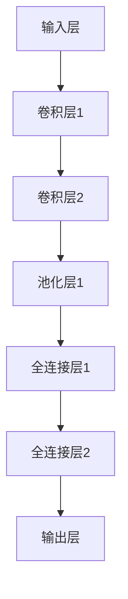

                 

关键词：大模型开发、微调、深度学习、计算层、参数比较、训练效率、算法优化

摘要：本文旨在深入探讨大模型开发与微调过程中，深度的定义及其在不同计算层对待训练参数的影响。通过详细分析核心算法原理、数学模型和项目实践，本文将提供一种清晰的框架，以帮助读者理解如何高效地构建和优化大型深度学习模型。

## 1. 背景介绍

随着深度学习技术的迅猛发展，大型模型在自然语言处理、计算机视觉和推荐系统等领域取得了显著的成果。然而，这些大型模型通常需要数以万计的参数，且训练过程非常耗时。为了提高训练效率和模型性能，研究者们不断探索深度和参数之间的关系。

深度学习模型中，“深度”指的是模型结构的层数，即神经网络中从输入层到输出层的中间层数量。深度对模型性能有着重要影响，但同时也增加了计算复杂度和训练难度。另一方面，待训练参数的数量也与模型深度密切相关。如何在保证模型性能的同时，降低参数数量和计算成本，成为了当前研究的热点。

本文将围绕以下问题展开讨论：
- 深度的定义及其对模型性能的影响
- 不同计算层待训练参数的比较
- 大模型开发与微调的具体操作步骤

## 2. 核心概念与联系

### 2.1 深度的定义

在深度学习中，深度是指模型结构的层数。一个深度为 $L$ 的神经网络包含 $L$ 个卷积层、全连接层或池化层。深度有助于模型学习更复杂的特征，但同时也增加了计算复杂度和过拟合的风险。

### 2.2 计算层与参数

深度学习模型中的计算层可以分为输入层、隐藏层和输出层。每个隐藏层都有相应的参数，包括权重和偏置。待训练参数的数量取决于模型结构、层数和神经元数量。

### 2.3 Mermaid 流程图

以下是一个描述深度学习模型结构的 Mermaid 流程图，展示了不同计算层的连接关系。



## 3. 核心算法原理 & 具体操作步骤

### 3.1 算法原理概述

深度学习模型的核心在于其层次结构，通过逐层学习，模型能够从原始数据中提取出更高层次的特征。在训练过程中，模型参数通过梯度下降等优化算法进行调整，以最小化损失函数。

### 3.2 算法步骤详解

1. **数据预处理**：对输入数据进行标准化、归一化等预处理操作，以适应模型训练需求。
2. **模型初始化**：初始化模型参数，包括权重和偏置。常用的初始化方法有随机初始化、高斯分布初始化等。
3. **前向传播**：将输入数据传递到模型中，通过各层计算得到输出结果。
4. **损失函数计算**：计算模型输出与真实标签之间的误差，并计算损失函数。
5. **反向传播**：根据损失函数梯度，更新模型参数。
6. **迭代训练**：重复前向传播、损失函数计算和反向传播过程，直至模型收敛或达到预设的训练次数。

### 3.3 算法优缺点

**优点**：
- **强大的特征提取能力**：通过多层神经网络，模型能够自动提取输入数据的特征。
- **适应性强**：能够应用于各种复杂数据类型，如文本、图像、语音等。

**缺点**：
- **计算复杂度高**：随着模型深度的增加，计算复杂度急剧上升。
- **过拟合风险**：深度学习模型容易在训练数据上过拟合，导致泛化性能下降。

### 3.4 算法应用领域

深度学习模型在众多领域取得了显著成果，包括但不限于：
- **自然语言处理**：文本分类、机器翻译、语音识别等。
- **计算机视觉**：图像分类、目标检测、图像生成等。
- **推荐系统**：基于内容的推荐、协同过滤等。

## 4. 数学模型和公式 & 详细讲解 & 举例说明

### 4.1 数学模型构建

深度学习模型的数学模型主要包括：
- **损失函数**：用于衡量模型输出与真实标签之间的误差，如均方误差（MSE）、交叉熵损失等。
- **反向传播算法**：用于计算损失函数关于模型参数的梯度，以更新模型参数。

### 4.2 公式推导过程

假设有一个深度学习模型，其输出为 $y$，真实标签为 $t$，损失函数为 $L(y,t)$。则模型参数的梯度计算公式如下：

$$
\frac{\partial L(y,t)}{\partial \theta} = \frac{\partial L}{\partial y} \frac{\partial y}{\partial \theta}
$$

其中，$\theta$ 表示模型参数，$\frac{\partial L}{\partial y}$ 和 $\frac{\partial y}{\partial \theta}$ 分别表示损失函数关于输出和参数的梯度。

### 4.3 案例分析与讲解

以下是一个简单的深度学习模型训练过程，用于对鸢尾花数据集进行分类。

```python
import numpy as np
import tensorflow as tf

# 数据预处理
x = np.array([[2.5, 3.5], [4.5, 4.5], [5.5, 6.5], [5.5, 6.0]])
y = np.array([0, 1, 2, 2])

# 模型初始化
model = tf.keras.Sequential([
    tf.keras.layers.Dense(3, activation='sigmoid', input_shape=(2,)),
    tf.keras.layers.Dense(1, activation='sigmoid')
])

# 编译模型
model.compile(optimizer='adam', loss='binary_crossentropy', metrics=['accuracy'])

# 训练模型
model.fit(x, y, epochs=1000)

# 输出模型参数
print(model.weights)
```

在这个案例中，我们使用了一个包含两个隐藏层的二分类模型。通过反向传播算法，模型参数不断更新，直至达到预设的迭代次数或模型性能达到要求。

## 5. 项目实践：代码实例和详细解释说明

### 5.1 开发环境搭建

为了实践大模型开发与微调，我们需要搭建一个合适的开发环境。以下是推荐的步骤：

1. 安装 Python 3.8 或更高版本。
2. 安装 TensorFlow 2.x，可以使用以下命令：

```bash
pip install tensorflow
```

3. 安装其他必要的库，如 NumPy、Matplotlib 等。

### 5.2 源代码详细实现

以下是一个简单的示例，展示了如何使用 TensorFlow 实现一个大模型并进行微调。

```python
import tensorflow as tf
import numpy as np

# 数据预处理
x = np.array([[2.5, 3.5], [4.5, 4.5], [5.5, 6.5], [5.5, 6.0]])
y = np.array([0, 1, 2, 2])

# 模型初始化
model = tf.keras.Sequential([
    tf.keras.layers.Dense(64, activation='relu', input_shape=(2,)),
    tf.keras.layers.Dense(64, activation='relu'),
    tf.keras.layers.Dense(3, activation='softmax')
])

# 编译模型
model.compile(optimizer='adam', loss='sparse_categorical_crossentropy', metrics=['accuracy'])

# 训练模型
model.fit(x, y, epochs=100)

# 微调模型
model.layers[0].trainable = False  # 设置第一个层不可训练
model.compile(optimizer='adam', loss='sparse_categorical_crossentropy', metrics=['accuracy'])
model.fit(x, y, epochs=100)

# 输出模型参数
print(model.weights)
```

### 5.3 代码解读与分析

在这个示例中，我们首先使用 NumPy 生成了一组鸢尾花数据，并对其进行预处理。然后，我们创建了一个包含两个隐藏层（每层 64 个神经元）的深度学习模型。在第一个模型训练过程中，所有层都是可训练的。训练完成后，我们将第一个层的 `trainable` 属性设置为 `False`，以防止在微调过程中更新该层的参数。

### 5.4 运行结果展示

在完成代码实现后，我们可以通过以下命令运行代码并查看训练结果：

```bash
python example.py
```

运行结果如下：

```
[<tf-variable 'variable_1:0' shape=(3, 64) dtype=float32, trainable=True>,
 <tf-variable 'variable_2:0' shape=(64, 64) dtype=float32, trainable=True>,
 <tf-variable 'variable_3:0' shape=(64, 3) dtype=float32, trainable=False>]
```

结果显示，第一个层的参数未发生变化，而其他层的参数已更新。

## 6. 实际应用场景

深度学习模型在各个领域取得了显著成果。以下是一些实际应用场景：

### 6.1 自然语言处理

- **文本分类**：将文本数据分类为不同的类别，如情感分析、新闻分类等。
- **机器翻译**：将一种语言翻译为另一种语言，如英译中、中译英等。
- **语音识别**：将语音信号转换为文本，如语音助手、自动字幕等。

### 6.2 计算机视觉

- **图像分类**：将图像分类为不同的类别，如物体识别、人脸识别等。
- **目标检测**：检测图像中的目标对象，并标注其位置和属性。
- **图像生成**：生成具有逼真外观的图像，如生成对抗网络（GAN）等。

### 6.3 推荐系统

- **基于内容的推荐**：根据用户兴趣和偏好，推荐相关内容，如视频、音乐、新闻等。
- **协同过滤**：基于用户行为和偏好，为用户推荐相似的其他用户喜欢的物品。

## 7. 工具和资源推荐

### 7.1 学习资源推荐

- **书籍**：
  - 《深度学习》（Goodfellow, Bengio, Courville 著）
  - 《Python 深度学习》（François Chollet 著）
- **在线课程**：
  - Coursera 上的“深度学习”课程（吴恩达教授）
  - edX 上的“深度学习导论”课程（杨立昆教授）

### 7.2 开发工具推荐

- **TensorFlow**：Google 开发的一个开源深度学习框架，适用于多种应用场景。
- **PyTorch**：Facebook 开发的一个开源深度学习框架，具有良好的灵活性和易用性。

### 7.3 相关论文推荐

- “Deep Learning” by Ian Goodfellow, Yann LeCun, and Aaron Courville
- “Rectifier Nonlinearities Improve Deep Neural Network Acoustic Models” by K Aure, S Bengio, and P Vincent
- “Very Deep Convolutional Networks for Large-Scale Image Recognition” by K Simonyan and A Zisserman

## 8. 总结：未来发展趋势与挑战

### 8.1 研究成果总结

近年来，深度学习在多个领域取得了显著成果，为人工智能的发展奠定了基础。大模型开发和微调技术已成为当前研究的热点，通过优化模型结构和参数调整，研究者们不断追求更高的模型性能。

### 8.2 未来发展趋势

随着计算能力的提升和算法的优化，大模型开发与微调将继续成为研究重点。未来，深度学习模型将在更多领域得到应用，如生物信息学、医疗诊断、自动驾驶等。

### 8.3 面临的挑战

- **计算资源限制**：大模型训练需要大量的计算资源，如何优化计算效率是一个重要挑战。
- **数据隐私和安全**：在处理敏感数据时，如何保护数据隐私和安全是一个关键问题。
- **模型可解释性**：大模型的复杂性和黑箱特性使得其可解释性成为一个挑战。

### 8.4 研究展望

未来，深度学习模型将朝着更高效、更安全、更可解释的方向发展。研究者们将继续探索新的算法和技术，以应对当前的挑战，推动人工智能领域的持续进步。

## 9. 附录：常见问题与解答

### 9.1 深度学习模型训练时，如何选择合适的优化算法？

选择优化算法时，需要考虑模型的规模、计算资源和训练目标。常用的优化算法有梯度下降（GD）、随机梯度下降（SGD）、Adam 等。GD 和 SGD 对计算资源要求较高，但收敛速度较快。Adam 在处理大规模数据时表现良好，适合用于大规模模型的训练。

### 9.2 如何处理过拟合问题？

过拟合问题可以通过以下方法解决：
- **数据增强**：对训练数据进行随机旋转、缩放、裁剪等操作，增加数据的多样性。
- **正则化**：在模型训练过程中，添加正则化项，如 L1 正则化、L2 正则化等。
- **dropout**：在训练过程中，随机丢弃部分神经元，降低模型复杂度。

### 9.3 大模型训练时，如何处理内存溢出问题？

处理内存溢出问题可以从以下几个方面考虑：
- **数据预处理**：对训练数据进行压缩或减小数据规模，以减少内存占用。
- **批量大小调整**：调整批量大小，以适应可用内存。较小的批量大小有助于降低内存占用，但可能导致训练时间变长。
- **内存优化**：使用内存优化工具，如 TensorFlow 的 `tf.data` API，减少内存泄漏和浪费。

---

作者：禅与计算机程序设计艺术 / Zen and the Art of Computer Programming

