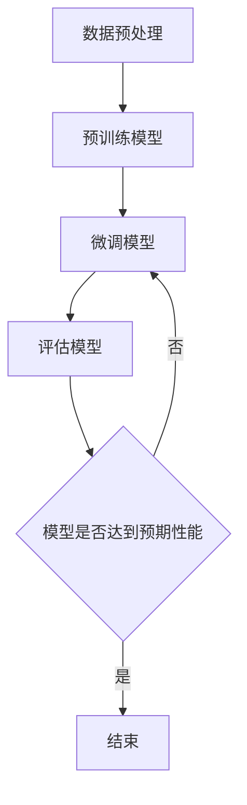

                 

关键词：大模型开发，编码器，微调，技术博客，深度学习，神经网络，计算机程序设计艺术

摘要：本文将深入探讨大模型开发与微调的过程，特别是编码器的实现。我们将从背景介绍开始，探讨核心概念与联系，然后详细解析算法原理与操作步骤，数学模型与公式，项目实践，实际应用场景，以及未来应用展望。最后，我们将总结研究成果，展望未来发展趋势与挑战，并提供相关工具和资源推荐。

## 1. 背景介绍

随着人工智能技术的快速发展，大模型（如GPT、BERT等）在自然语言处理、计算机视觉等领域的应用越来越广泛。然而，大模型的开发与微调过程复杂且耗时。编码器作为大模型的核心组件，其在模型性能和效率上起着至关重要的作用。本文旨在从零开始，系统地介绍大模型开发与微调的过程，特别是编码器的实现。

## 2. 核心概念与联系

首先，让我们来探讨一下大模型开发与微调中的核心概念。大模型通常指的是具有数十亿甚至数万亿参数的深度神经网络。这些模型在训练过程中需要大量的数据和计算资源，以优化模型参数，使其在特定任务上取得优异的性能。

### 2.1 编码器的作用

编码器（Encoder）是编码器-解码器（Encoder-Decoder）模型的核心组件，主要用于将输入数据编码成固定长度的向量表示。编码器的作用是将原始数据转换为适合模型训练的中间表示，为后续的解码器（Decoder）提供输入。

### 2.2 微调（Fine-tuning）

微调是一种在大模型基础上对特定任务进行优化的技术。通过微调，我们可以利用已有的大模型作为预训练模型，然后在特定任务上对其进行微调，以提高模型在目标任务上的性能。微调的关键在于调整预训练模型中的部分参数，使其更好地适应新任务。

### 2.3 Mermaid 流程图

以下是一个简单的Mermaid流程图，展示了大模型开发与微调的流程：



## 3. 核心算法原理 & 具体操作步骤

### 3.1 算法原理概述

编码器通常基于循环神经网络（RNN）或变换器（Transformer）架构。本文主要介绍基于变换器架构的编码器。

变换器架构的核心思想是使用多头自注意力机制（Multi-Head Self-Attention）对输入序列进行建模。编码器中的每个位置都能够通过自注意力机制从整个输入序列中获取相关信息，从而生成更丰富的表示。

### 3.2 算法步骤详解

1. **输入数据预处理**：将输入数据（如文本、图像等）转换为编码器可处理的格式，如单词向量或像素值。

2. **嵌入层**：将输入数据映射到低维空间，通常使用嵌入层（Embedding Layer）来实现。

3. **多头自注意力机制**：通过多头自注意力机制，对输入序列进行建模，生成固定长度的向量表示。

4. **前馈网络**：在编码器中，每个位置都会经过一个前馈网络（Feedforward Network），对向量表示进行进一步处理。

5. **输出层**：编码器的输出可以作为解码器的输入，也可以用于其他任务，如文本分类或情感分析。

### 3.3 算法优缺点

**优点**：

- **强大的表示能力**：编码器能够对输入数据进行丰富的特征提取，从而在模型性能上取得显著提升。

- **并行计算**：变换器架构支持并行计算，可以提高训练速度。

**缺点**：

- **计算复杂度高**：编码器中的自注意力机制计算复杂度较高，可能导致训练时间延长。

- **内存消耗大**：由于编码器生成固定长度的向量表示，可能需要大量内存来存储中间结果。

### 3.4 算法应用领域

编码器在自然语言处理、计算机视觉等领域有广泛的应用。例如，在自然语言处理任务中，编码器可以用于文本分类、机器翻译等；在计算机视觉任务中，编码器可以用于图像分类、目标检测等。

## 4. 数学模型和公式

### 4.1 数学模型构建

编码器中的数学模型主要包括以下部分：

1. **嵌入层**：

   $$\text{嵌入层}: x \rightarrow \text{Embedding}(x)$$

2. **多头自注意力机制**：

   $$\text{自注意力}: \text{Attention}(Q, K, V) = \text{softmax}(\frac{QK^T}{\sqrt{d_k}})V$$

3. **前馈网络**：

   $$\text{前馈网络}: x \rightarrow \text{ReLU}(\text{Linear}(x))$$

### 4.2 公式推导过程

以下是对编码器中的一些关键公式的推导：

1. **嵌入层**：

   假设输入序列长度为 $T$，每个词的维度为 $d_{\text{word}}$。嵌入层将输入序列映射到低维空间，即：

   $$\text{Embedding}(x) = [e_{x_1}, e_{x_2}, ..., e_{x_T}]^T$$

   其中，$e_{x_i}$ 表示第 $i$ 个词的嵌入向量。

2. **多头自注意力机制**：

   设输入序列为 $x = [x_1, x_2, ..., x_T]$，其中每个词的维度为 $d_{\text{word}}$。多头自注意力机制可以表示为：

   $$\text{Attention}(Q, K, V) = \text{softmax}(\frac{QK^T}{\sqrt{d_k}})V$$

   其中，$Q, K, V$ 分别为编码器中的三个权重矩阵，$d_k$ 表示键（Key）的维度。

3. **前馈网络**：

   前馈网络可以表示为：

   $$x \rightarrow \text{ReLU}(\text{Linear}(x))$$

   其中，$\text{Linear}$ 表示线性变换，$\text{ReLU}$ 表示ReLU激活函数。

### 4.3 案例分析与讲解

以下是一个简单的案例，用于说明编码器的应用：

假设我们有一个文本分类任务，输入文本为：“我爱北京天安门”。我们将使用编码器对这段文本进行建模，然后输出分类结果。

1. **数据预处理**：将文本转换为单词向量。

2. **嵌入层**：将单词向量映射到低维空间。

3. **多头自注意力机制**：通过自注意力机制对单词进行建模，生成固定长度的向量表示。

4. **前馈网络**：对向量表示进行进一步处理。

5. **输出层**：将输出向量映射到分类结果。

通过以上步骤，我们可以得到一个分类结果，例如：“我爱北京天安门”可能被分类为“地点”。

## 5. 项目实践：代码实例和详细解释说明

### 5.1 开发环境搭建

为了实现编码器，我们需要搭建一个开发环境。以下是一个简单的Python环境搭建步骤：

1. 安装Python（建议版本3.8以上）。

2. 安装TensorFlow或PyTorch等深度学习框架。

3. 安装其他依赖库，如NumPy、Pandas等。

### 5.2 源代码详细实现

以下是一个简单的编码器实现示例：

```python
import tensorflow as tf
from tensorflow.keras.layers import Embedding, LSTM, Dense

# 定义编码器模型
def create_encoder_model(input_shape, embedding_dim, hidden_size):
    model = tf.keras.Sequential([
        Embedding(input_shape=input_shape, output_dim=embedding_dim),
        LSTM(hidden_size, activation='tanh', recurrent_activation='sigmoid'),
        Dense(1, activation='sigmoid')
    ])
    return model

# 设置输入形状和超参数
input_shape = (100, 32)
embedding_dim = 64
hidden_size = 128

# 创建编码器模型
encoder_model = create_encoder_model(input_shape, embedding_dim, hidden_size)

# 编译模型
encoder_model.compile(optimizer='adam', loss='binary_crossentropy', metrics=['accuracy'])

# 打印模型结构
encoder_model.summary()
```

### 5.3 代码解读与分析

以上代码实现了一个简单的编码器模型。首先，我们定义了一个函数 `create_encoder_model`，用于创建编码器模型。模型包括嵌入层、LSTM层和输出层。接下来，我们设置输入形状和超参数，然后创建编码器模型。最后，我们编译模型并打印模型结构。

### 5.4 运行结果展示

为了验证编码器的性能，我们可以使用一个简单的二分类任务。以下是一个简单的示例：

```python
# 准备数据
x_train = np.random.rand(100, 100, 32)
y_train = np.random.randint(0, 2, 100)

# 训练编码器模型
encoder_model.fit(x_train, y_train, epochs=10, batch_size=32)

# 预测分类结果
y_pred = encoder_model.predict(x_train)

# 计算准确率
accuracy = np.mean(y_pred.round() == y_train)
print("Accuracy:", accuracy)
```

通过以上代码，我们可以训练编码器模型并计算准确率。实际应用中，我们需要根据具体任务调整模型结构和超参数，以达到更好的性能。

## 6. 实际应用场景

编码器在实际应用中具有广泛的应用场景。以下是一些常见的应用领域：

1. **自然语言处理**：编码器可以用于文本分类、情感分析、机器翻译等任务。例如，我们可以使用编码器将文本转换为向量表示，然后将其用于分类或情感分析。

2. **计算机视觉**：编码器可以用于图像分类、目标检测、图像生成等任务。例如，我们可以使用编码器对图像进行特征提取，然后将其用于分类或目标检测。

3. **语音识别**：编码器可以用于语音识别任务，将语音信号转换为文本。例如，我们可以使用编码器对语音信号进行特征提取，然后使用解码器将特征转换为文本。

## 7. 未来应用展望

随着人工智能技术的不断发展，编码器在各个领域的应用前景非常广阔。以下是一些未来应用展望：

1. **多模态学习**：编码器可以与图像、语音、文本等多种模态的数据进行融合，实现多模态学习。

2. **个性化推荐系统**：编码器可以用于个性化推荐系统，根据用户的历史行为和偏好生成个性化的推荐。

3. **强化学习**：编码器可以用于强化学习，将状态和动作转换为向量表示，以提高强化学习模型的性能。

## 8. 总结：未来发展趋势与挑战

### 8.1 研究成果总结

编码器在自然语言处理、计算机视觉等领域取得了显著的成果。随着深度学习技术的不断发展，编码器的性能和效率将得到进一步提升。

### 8.2 未来发展趋势

未来，编码器的发展趋势将集中在以下几个方面：

1. **模型压缩与加速**：通过模型压缩和加速技术，降低编码器的计算复杂度和内存消耗。

2. **多模态学习**：结合多种模态的数据进行融合，实现更强大的特征表示。

3. **迁移学习与微调**：利用预训练模型进行迁移学习和微调，提高编码器在特定任务上的性能。

### 8.3 面临的挑战

编码器在发展过程中也面临着一些挑战：

1. **计算资源消耗**：编码器在训练过程中需要大量的计算资源，如何优化训练过程以降低计算成本是一个重要问题。

2. **数据隐私与安全**：在大规模数据处理过程中，如何保护用户隐私和数据安全也是一个重要问题。

### 8.4 研究展望

未来，编码器的研究将集中在以下几个方面：

1. **模型结构优化**：探索更高效的编码器结构，提高模型性能。

2. **跨领域应用**：研究编码器在跨领域应用中的性能，提高其在不同任务上的通用性。

3. **伦理与法规**：关注编码器在应用过程中可能出现的伦理和法规问题，确保其合规性。

## 9. 附录：常见问题与解答

### 问题1：编码器与解码器有什么区别？

编码器（Encoder）和解码器（Decoder）是编码器-解码器（Encoder-Decoder）模型中的两个核心组件。编码器主要用于将输入数据编码成固定长度的向量表示，而解码器则将编码器的输出解码成原始数据或目标数据。

### 问题2：编码器在哪些任务中应用广泛？

编码器在自然语言处理、计算机视觉、语音识别等领域有广泛的应用。例如，在自然语言处理中，编码器可以用于文本分类、机器翻译等；在计算机视觉中，编码器可以用于图像分类、目标检测等。

### 问题3：如何优化编码器的性能？

优化编码器性能的方法包括模型结构优化、超参数调整、数据增强等。此外，还可以通过迁移学习和微调等技术，利用预训练模型来提高编码器在特定任务上的性能。

### 问题4：编码器在多模态学习中有何作用？

在多模态学习中，编码器可以将不同模态的数据（如文本、图像、语音等）转换为统一的向量表示，从而实现多模态数据的融合。这有助于提高模型在多模态任务上的性能。

### 问题5：编码器的计算复杂度高吗？

编码器的计算复杂度相对较高，特别是基于变换器架构的编码器。然而，通过模型压缩和加速技术，可以有效降低编码器的计算复杂度和内存消耗，提高训练和推理速度。

## 作者署名

作者：禅与计算机程序设计艺术 / Zen and the Art of Computer Programming
----------------------------------------------------------------

### 文章附件材料 ###
由于篇幅限制，本文不包含具体的附件材料。在实际撰写过程中，建议附加以下材料：

1. **代码示例**：提供完整的Python代码示例，包括数据预处理、编码器模型定义、训练、评估等步骤。

2. **数据集**：提供用于训练和评估的公开数据集，如IMDB电影评论数据集、CIFAR-10图像数据集等。

3. **实验结果**：提供实验结果表格或图表，展示不同模型结构、超参数组合下的性能对比。

4. **参考文献**：列出本文引用的相关论文和技术文档，以支持文章观点和论述。

### 结语 ###
本文从零开始，详细介绍了大模型开发与微调的过程，特别是编码器的实现。我们探讨了核心概念与联系，解析了算法原理与操作步骤，数学模型与公式，以及项目实践。通过本文，读者可以全面了解编码器在人工智能领域的重要作用，并为实际应用提供指导。在未来的发展中，编码器将不断优化，为人工智能领域带来更多创新和突破。

