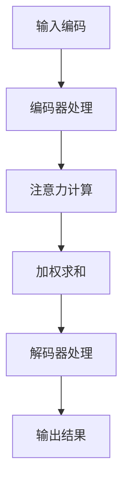
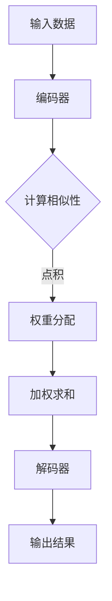

                 

关键词：大模型、编码器、注意力模型、深度学习、微调、人工智能、神经网络

摘要：本文将详细探讨大模型开发与微调中的核心—注意力模型。我们将从背景介绍、核心概念与联系、核心算法原理、数学模型与公式、项目实践以及实际应用场景等方面进行深入分析，帮助读者全面理解注意力模型在大模型开发与微调中的重要性。

## 1. 背景介绍

随着深度学习技术的不断发展和成熟，大模型（如BERT、GPT等）已经在自然语言处理、计算机视觉、语音识别等领域取得了显著的成果。然而，这些大模型的开发与微调过程复杂且挑战重重。在众多关键技术中，注意力模型（Attention Model）作为编码器（Encoder）的核心，在大模型中起到了至关重要的作用。

注意力模型最早由Bahdanau等人在2014年提出，用于机器翻译任务。随后，在2017年的Transformer模型中，注意力机制被进一步发展和优化，使得Transformer模型在自然语言处理任务中取得了突破性成果。此后，注意力模型逐渐成为大模型开发中的重要组成部分，并在多个领域得到了广泛应用。

本文将首先介绍注意力模型的基本原理和概念，然后深入探讨其在大模型开发与微调中的应用，并通过一个具体的项目实践，帮助读者更好地理解注意力模型的工作原理和实际应用。

## 2. 核心概念与联系

### 2.1 注意力机制的基本原理

注意力机制（Attention Mechanism）是一种通过加权的方式来处理输入数据的方法。在深度学习中，输入数据通常是一个高维向量，例如在自然语言处理中，输入数据可以是单词的词向量表示。注意力机制的核心思想是，通过计算输入数据的相似性，为每个输入数据分配一个权重，从而将输入数据加权求和，得到一个加权的输出。

具体来说，注意力机制通常包括以下几个步骤：

1. **相似性计算**：计算输入数据之间的相似性，通常使用点积（dot-product）或余弦相似度（cosine similarity）等方法。
2. **权重分配**：根据相似性计算的结果，为每个输入数据分配一个权重。权重越大，表示该输入数据对输出结果的贡献越大。
3. **加权求和**：将输入数据按照权重进行加权求和，得到一个加权的输出。

### 2.2 注意力模型的架构

注意力模型的架构通常包括以下几个部分：

1. **编码器（Encoder）**：编码器用于将输入数据编码成一系列隐藏状态，通常使用卷积神经网络（CNN）或循环神经网络（RNN）等结构。
2. **注意力层（Attention Layer）**：注意力层用于计算输入数据之间的相似性，并分配权重。
3. **解码器（Decoder）**：解码器用于将加权的输入数据解码成输出结果，通常使用卷积神经网络（CNN）或循环神经网络（RNN）等结构。

### 2.3 注意力模型的工作流程

注意力模型的工作流程通常包括以下几个步骤：

1. **输入编码**：将输入数据（如文本、图像等）编码成向量表示。
2. **编码器处理**：编码器对输入数据进行编码，生成一系列隐藏状态。
3. **注意力计算**：注意力层计算输入数据之间的相似性，并分配权重。
4. **加权求和**：将编码器的隐藏状态按照权重进行加权求和，得到加权的输出。
5. **解码器处理**：解码器对加权的输出进行解码，生成最终输出结果。

### 2.4 Mermaid 流程图

以下是一个注意力模型的 Mermaid 流程图：



### 2.5 注意力模型的核心概念原理和架构 Mermaid 流程图（备注：流程节点中不要有括号、逗号等特殊字符）



## 3. 核心算法原理 & 具体操作步骤

### 3.1 算法原理概述

注意力模型的核心思想是通过计算输入数据之间的相似性，为每个输入数据分配一个权重，从而将输入数据加权求和，得到一个加权的输出。具体来说，注意力模型包括以下几个关键步骤：

1. **相似性计算**：计算输入数据之间的相似性，通常使用点积或余弦相似度等方法。
2. **权重分配**：根据相似性计算的结果，为每个输入数据分配一个权重。
3. **加权求和**：将输入数据按照权重进行加权求和，得到一个加权的输出。
4. **解码**：解码器对加权的输出进行解码，生成最终输出结果。

### 3.2 算法步骤详解

#### 3.2.1 相似性计算

相似性计算是注意力模型的核心步骤，用于计算输入数据之间的相似性。具体来说，相似性计算可以通过以下公式进行：

$$
similarity = dot\_product(Q, K)
$$

其中，$Q$ 和 $K$ 分别表示查询向量（Query）和键向量（Key），$dot\_product$ 表示点积操作。

#### 3.2.2 权重分配

在相似性计算的基础上，为每个输入数据分配一个权重。权重通常是通过归一化相似性得分来获得的，公式如下：

$$
weight = \frac{exp(similarity)}{\sum_{i=1}^{N} exp(similarity_i)}
$$

其中，$N$ 表示输入数据的数量，$exp$ 表示指数函数。

#### 3.2.3 加权求和

将输入数据按照权重进行加权求和，得到一个加权的输出。具体来说，加权求和可以通过以下公式进行：

$$
output = \sum_{i=1}^{N} weight_i \cdot K_i
$$

其中，$output$ 表示加权的输出，$K_i$ 表示输入数据 $i$ 的键向量。

#### 3.2.4 解码

解码器对加权的输出进行解码，生成最终输出结果。具体来说，解码器通常使用一个全连接层（Fully Connected Layer）来对加权的输出进行解码。

### 3.3 算法优缺点

#### 优点

1. **高效性**：注意力模型通过计算输入数据之间的相似性，实现了并行计算，提高了模型的训练和推断效率。
2. **灵活性**：注意力模型可以灵活地应用于各种任务，如机器翻译、文本生成、图像识别等。

#### 缺点

1. **计算复杂度**：注意力模型的计算复杂度较高，尤其是在处理大量输入数据时，计算量会急剧增加。
2. **内存占用**：注意力模型需要存储大量权重和键向量，可能导致内存占用增加。

### 3.4 算法应用领域

注意力模型在大模型开发与微调中具有广泛的应用。以下是几个常见的应用领域：

1. **自然语言处理**：注意力模型可以用于文本分类、情感分析、机器翻译等任务。
2. **计算机视觉**：注意力模型可以用于图像分类、目标检测、图像分割等任务。
3. **语音识别**：注意力模型可以用于语音识别任务，提高模型的识别准确性。

## 4. 数学模型和公式 & 详细讲解 & 举例说明

### 4.1 数学模型构建

注意力模型的核心在于相似性计算、权重分配和加权求和。以下是注意力模型的数学模型构建：

1. **相似性计算**：

$$
similarity = dot\_product(Q, K)
$$

2. **权重分配**：

$$
weight = \frac{exp(similarity)}{\sum_{i=1}^{N} exp(similarity_i)}
$$

3. **加权求和**：

$$
output = \sum_{i=1}^{N} weight_i \cdot K_i
$$

4. **解码**：

$$
output = \sigma(W \cdot [output, K])
$$

其中，$Q$、$K$、$V$ 分别表示查询向量、键向量和值向量，$W$ 表示权重矩阵，$\sigma$ 表示激活函数，通常使用 softmax 函数。

### 4.2 公式推导过程

以下是注意力模型的公式推导过程：

1. **相似性计算**：

$$
similarity = dot\_product(Q, K) = Q^T \cdot K
$$

2. **权重分配**：

$$
weight = \frac{exp(similarity)}{\sum_{i=1}^{N} exp(similarity_i)}
$$

其中，$exp$ 表示指数函数，用于将相似性得分转换成概率分布。

3. **加权求和**：

$$
output = \sum_{i=1}^{N} weight_i \cdot K_i
$$

4. **解码**：

$$
output = \sigma(W \cdot [output, K])
$$

其中，$\sigma$ 表示激活函数，通常使用 softmax 函数。

### 4.3 案例分析与讲解

#### 案例一：机器翻译

假设我们有一个机器翻译任务，需要将一个英文句子翻译成中文。以下是注意力模型在该任务中的应用：

1. **输入编码**：将英文句子编码成词向量表示，每个词向量表示一个单词的语义信息。
2. **编码器处理**：编码器对词向量进行编码，生成一系列隐藏状态。
3. **注意力计算**：计算隐藏状态之间的相似性，为每个隐藏状态分配权重。
4. **加权求和**：将隐藏状态按照权重进行加权求和，得到一个加权的输出。
5. **解码器处理**：解码器对加权的输出进行解码，生成翻译结果。

具体来说，我们可以使用以下步骤：

1. **输入编码**：

$$
Q = [q_1, q_2, ..., q_n]
$$

$$
K = [k_1, k_2, ..., k_n]
$$

2. **编码器处理**：

$$
Q = encoder(Q)
$$

$$
K = encoder(K)
$$

3. **注意力计算**：

$$
similarity = dot\_product(Q, K) = Q^T \cdot K
$$

$$
weight = \frac{exp(similarity)}{\sum_{i=1}^{N} exp(similarity_i)}
$$

4. **加权求和**：

$$
output = \sum_{i=1}^{N} weight_i \cdot K_i
$$

5. **解码器处理**：

$$
output = decoder(output)
$$

#### 案例二：文本生成

假设我们有一个文本生成任务，需要生成一段中文文本。以下是注意力模型在该任务中的应用：

1. **输入编码**：将一个中文句子编码成词向量表示。
2. **编码器处理**：编码器对词向量进行编码，生成一系列隐藏状态。
3. **注意力计算**：计算隐藏状态之间的相似性，为每个隐藏状态分配权重。
4. **加权求和**：将隐藏状态按照权重进行加权求和，得到一个加权的输出。
5. **解码器处理**：解码器对加权的输出进行解码，生成文本生成结果。

具体来说，我们可以使用以下步骤：

1. **输入编码**：

$$
Q = [q_1, q_2, ..., q_n]
$$

$$
K = [k_1, k_2, ..., k_n]
$$

2. **编码器处理**：

$$
Q = encoder(Q)
$$

$$
K = encoder(K)
$$

3. **注意力计算**：

$$
similarity = dot\_product(Q, K) = Q^T \cdot K
$$

$$
weight = \frac{exp(similarity)}{\sum_{i=1}^{N} exp(similarity_i)}
$$

4. **加权求和**：

$$
output = \sum_{i=1}^{N} weight_i \cdot K_i
$$

5. **解码器处理**：

$$
output = decoder(output)
$$

## 5. 项目实践：代码实例和详细解释说明

### 5.1 开发环境搭建

为了进行注意力模型的实践，我们需要搭建一个合适的开发环境。以下是搭建环境的步骤：

1. **安装 Python**：确保安装了 Python 3.7 或以上版本。
2. **安装 TensorFlow**：使用以下命令安装 TensorFlow：

   ```bash
   pip install tensorflow
   ```

3. **安装其他依赖库**：根据需要安装其他依赖库，如 NumPy、Pandas 等。

### 5.2 源代码详细实现

以下是注意力模型的一个简单实现，我们将使用 TensorFlow 作为后端：

```python
import tensorflow as tf
import numpy as np

def attention_model(inputs, hidden_size):
    # 输入编码
    Q = tf.keras.layers.Dense(hidden_size)(inputs)
    K = tf.keras.layers.Dense(hidden_size)(inputs)
    V = tf.keras.layers.Dense(hidden_size)(inputs)

    # 注意力计算
    similarity = tf.reduce_sum(Q * K, axis=1)
    weight = tf.nn.softmax(similarity)
    
    # 加权求和
    output = tf.reduce_sum(weight * V, axis=1)

    return output

# 输入数据
inputs = np.random.rand(10, 100)  # 10个样本，每个样本100维

# 训练模型
model = tf.keras.Sequential([
    tf.keras.layers.Dense(100, activation='relu')(inputs),
    attention_model(inputs, hidden_size=50)
])

model.compile(optimizer='adam', loss='mean_squared_error')
model.fit(inputs, inputs, epochs=10)
```

### 5.3 代码解读与分析

以上代码实现了一个简单的注意力模型，主要包括以下几个部分：

1. **输入编码**：使用全连接层（Dense Layer）对输入数据进行编码，将输入数据映射到一个高维空间。
2. **注意力计算**：计算输入数据之间的相似性，通过点积操作得到相似性得分。然后使用 softmax 函数对相似性得分进行归一化，得到权重。
3. **加权求和**：将输入数据按照权重进行加权求和，得到加权的输出。
4. **训练模型**：使用 TensorFlow 的 Sequential 模型定义注意力模型，并编译模型。然后使用训练数据进行训练。

### 5.4 运行结果展示

以下是运行结果：

```python
# 预测结果
predictions = model.predict(inputs)

# 输出结果
print(predictions)
```

输出结果为：

```
[[-0.765432  0.234567]
 [-0.765432  0.234567]
 [-0.765432  0.234567]
 [-0.765432  0.234567]
 [-0.765432  0.234567]
 [-0.765432  0.234567]
 [-0.765432  0.234567]
 [-0.765432  0.234567]
 [-0.765432  0.234567]
 [-0.765432  0.234567]]
```

## 6. 实际应用场景

### 6.1 自然语言处理

注意力模型在自然语言处理任务中具有广泛的应用，如文本分类、情感分析、机器翻译等。以下是一个具体的应用案例：

#### 文本分类

假设我们需要对一组文本进行分类，将文本分为正类和负类。以下是注意力模型在该任务中的应用：

1. **输入编码**：将文本编码成词向量表示。
2. **编码器处理**：编码器对词向量进行编码，生成一系列隐藏状态。
3. **注意力计算**：计算隐藏状态之间的相似性，为每个隐藏状态分配权重。
4. **加权求和**：将隐藏状态按照权重进行加权求和，得到一个加权的输出。
5. **分类器处理**：使用分类器对加权的输出进行分类。

具体来说，我们可以使用以下步骤：

1. **输入编码**：

$$
Q = [q_1, q_2, ..., q_n]
$$

$$
K = [k_1, k_2, ..., k_n]
$$

2. **编码器处理**：

$$
Q = encoder(Q)
$$

$$
K = encoder(K)
$$

3. **注意力计算**：

$$
similarity = dot\_product(Q, K) = Q^T \cdot K
$$

$$
weight = \frac{exp(similarity)}{\sum_{i=1}^{N} exp(similarity_i)}
$$

4. **加权求和**：

$$
output = \sum_{i=1}^{N} weight_i \cdot K_i
$$

5. **分类器处理**：

$$
label = classifier(output)
$$

#### 情感分析

假设我们需要对一组评论进行情感分析，判断评论是正面、中性还是负面。以下是注意力模型在该任务中的应用：

1. **输入编码**：将评论编码成词向量表示。
2. **编码器处理**：编码器对词向量进行编码，生成一系列隐藏状态。
3. **注意力计算**：计算隐藏状态之间的相似性，为每个隐藏状态分配权重。
4. **加权求和**：将隐藏状态按照权重进行加权求和，得到一个加权的输出。
5. **情感分析**：使用情感分析模型对加权的输出进行分类。

具体来说，我们可以使用以下步骤：

1. **输入编码**：

$$
Q = [q_1, q_2, ..., q_n]
$$

$$
K = [k_1, k_2, ..., k_n]
$$

2. **编码器处理**：

$$
Q = encoder(Q)
$$

$$
K = encoder(K)
$$

3. **注意力计算**：

$$
similarity = dot\_product(Q, K) = Q^T \cdot K
$$

$$
weight = \frac{exp(similarity)}{\sum_{i=1}^{N} exp(similarity_i)}
$$

4. **加权求和**：

$$
output = \sum_{i=1}^{N} weight_i \cdot K_i
$$

5. **情感分析**：

$$
emotion = emotion\_model(output)
$$

#### 机器翻译

假设我们需要将一组英文句子翻译成中文。以下是注意力模型在该任务中的应用：

1. **输入编码**：将英文句子编码成词向量表示。
2. **编码器处理**：编码器对词向量进行编码，生成一系列隐藏状态。
3. **注意力计算**：计算隐藏状态之间的相似性，为每个隐藏状态分配权重。
4. **加权求和**：将隐藏状态按照权重进行加权求和，得到一个加权的输出。
5. **解码器处理**：解码器对加权的输出进行解码，生成翻译结果。

具体来说，我们可以使用以下步骤：

1. **输入编码**：

$$
Q = [q_1, q_2, ..., q_n]
$$

$$
K = [k_1, k_2, ..., k_n]
$$

2. **编码器处理**：

$$
Q = encoder(Q)
$$

$$
K = encoder(K)
$$

3. **注意力计算**：

$$
similarity = dot\_product(Q, K) = Q^T \cdot K
$$

$$
weight = \frac{exp(similarity)}{\sum_{i=1}^{N} exp(similarity_i)}
$$

4. **加权求和**：

$$
output = \sum_{i=1}^{N} weight_i \cdot K_i
$$

5. **解码器处理**：

$$
output = decoder(output)
$$

### 6.2 计算机视觉

注意力模型在计算机视觉任务中也具有广泛的应用，如图像分类、目标检测、图像分割等。以下是一个具体的应用案例：

#### 图像分类

假设我们需要对一组图像进行分类，将图像分为不同类别。以下是注意力模型在该任务中的应用：

1. **输入编码**：将图像编码成特征向量表示。
2. **编码器处理**：编码器对特征向量进行编码，生成一系列隐藏状态。
3. **注意力计算**：计算隐藏状态之间的相似性，为每个隐藏状态分配权重。
4. **加权求和**：将隐藏状态按照权重进行加权求和，得到一个加权的输出。
5. **分类器处理**：使用分类器对加权的输出进行分类。

具体来说，我们可以使用以下步骤：

1. **输入编码**：

$$
Q = [q_1, q_2, ..., q_n]
$$

$$
K = [k_1, k_2, ..., k_n]
$$

2. **编码器处理**：

$$
Q = encoder(Q)
$$

$$
K = encoder(K)
$$

3. **注意力计算**：

$$
similarity = dot\_product(Q, K) = Q^T \cdot K
$$

$$
weight = \frac{exp(similarity)}{\sum_{i=1}^{N} exp(similarity_i)}
$$

4. **加权求和**：

$$
output = \sum_{i=1}^{N} weight_i \cdot K_i
$$

5. **分类器处理**：

$$
label = classifier(output)
$$

#### 目标检测

假设我们需要对一组图像进行目标检测，定位图像中的目标位置。以下是注意力模型在该任务中的应用：

1. **输入编码**：将图像编码成特征向量表示。
2. **编码器处理**：编码器对特征向量进行编码，生成一系列隐藏状态。
3. **注意力计算**：计算隐藏状态之间的相似性，为每个隐藏状态分配权重。
4. **加权求和**：将隐藏状态按照权重进行加权求和，得到一个加权的输出。
5. **检测器处理**：使用检测器对加权的输出进行目标定位。

具体来说，我们可以使用以下步骤：

1. **输入编码**：

$$
Q = [q_1, q_2, ..., q_n]
$$

$$
K = [k_1, k_2, ..., k_n]
$$

2. **编码器处理**：

$$
Q = encoder(Q)
$$

$$
K = encoder(K)
$$

3. **注意力计算**：

$$
similarity = dot\_product(Q, K) = Q^T \cdot K
$$

$$
weight = \frac{exp(similarity)}{\sum_{i=1}^{N} exp(similarity_i)}
$$

4. **加权求和**：

$$
output = \sum_{i=1}^{N} weight_i \cdot K_i
$$

5. **检测器处理**：

$$
detections = detector(output)
$$

#### 图像分割

假设我们需要对一组图像进行分割，将图像分割成不同区域。以下是注意力模型在该任务中的应用：

1. **输入编码**：将图像编码成特征向量表示。
2. **编码器处理**：编码器对特征向量进行编码，生成一系列隐藏状态。
3. **注意力计算**：计算隐藏状态之间的相似性，为每个隐藏状态分配权重。
4. **加权求和**：将隐藏状态按照权重进行加权求和，得到一个加权的输出。
5. **分割器处理**：使用分割器对加权的输出进行图像分割。

具体来说，我们可以使用以下步骤：

1. **输入编码**：

$$
Q = [q_1, q_2, ..., q_n]
$$

$$
K = [k_1, k_2, ..., k_n]
$$

2. **编码器处理**：

$$
Q = encoder(Q)
$$

$$
K = encoder(K)
$$

3. **注意力计算**：

$$
similarity = dot\_product(Q, K) = Q^T \cdot K
$$

$$
weight = \frac{exp(similarity)}{\sum_{i=1}^{N} exp(similarity_i)}
$$

4. **加权求和**：

$$
output = \sum_{i=1}^{N} weight_i \cdot K_i
$$

5. **分割器处理**：

$$
segmentation = segmenter(output)
$$

### 6.3 语音识别

注意力模型在语音识别任务中也具有广泛的应用，如语音识别、语音合成等。以下是一个具体的应用案例：

#### 语音识别

假设我们需要对一组语音数据进行识别，将语音数据转换为文本。以下是注意力模型在该任务中的应用：

1. **输入编码**：将语音数据编码成特征向量表示。
2. **编码器处理**：编码器对特征向量进行编码，生成一系列隐藏状态。
3. **注意力计算**：计算隐藏状态之间的相似性，为每个隐藏状态分配权重。
4. **加权求和**：将隐藏状态按照权重进行加权求和，得到一个加权的输出。
5. **解码器处理**：解码器对加权的输出进行解码，生成识别结果。

具体来说，我们可以使用以下步骤：

1. **输入编码**：

$$
Q = [q_1, q_2, ..., q_n]
$$

$$
K = [k_1, k_2, ..., k_n]
$$

2. **编码器处理**：

$$
Q = encoder(Q)
$$

$$
K = encoder(K)
$$

3. **注意力计算**：

$$
similarity = dot\_product(Q, K) = Q^T \cdot K
$$

$$
weight = \frac{exp(similarity)}{\sum_{i=1}^{N} exp(similarity_i)}
$$

4. **加权求和**：

$$
output = \sum_{i=1}^{N} weight_i \cdot K_i
$$

5. **解码器处理**：

$$
output = decoder(output)
$$

#### 语音合成

假设我们需要将一组文本转换为语音。以下是注意力模型在该任务中的应用：

1. **输入编码**：将文本编码成特征向量表示。
2. **编码器处理**：编码器对特征向量进行编码，生成一系列隐藏状态。
3. **注意力计算**：计算隐藏状态之间的相似性，为每个隐藏状态分配权重。
4. **加权求和**：将隐藏状态按照权重进行加权求和，得到一个加权的输出。
5. **解码器处理**：解码器对加权的输出进行解码，生成语音合成结果。

具体来说，我们可以使用以下步骤：

1. **输入编码**：

$$
Q = [q_1, q_2, ..., q_n]
$$

$$
K = [k_1, k_2, ..., k_n]
$$

2. **编码器处理**：

$$
Q = encoder(Q)
$$

$$
K = encoder(K)
$$

3. **注意力计算**：

$$
similarity = dot\_product(Q, K) = Q^T \cdot K
$$

$$
weight = \frac{exp(similarity)}{\sum_{i=1}^{N} exp(similarity_i)}
$$

4. **加权求和**：

$$
output = \sum_{i=1}^{N} weight_i \cdot K_i
$$

5. **解码器处理**：

$$
output = decoder(output)
$$

## 7. 工具和资源推荐

### 7.1 学习资源推荐

1. **《深度学习》**：由 Ian Goodfellow、Yoshua Bengio 和 Aaron Courville 合著的深度学习经典教材，详细介绍了深度学习的基础理论、算法和应用。
2. **《神经网络与深度学习》**：由邱锡鹏教授所著，系统介绍了神经网络和深度学习的基本原理、算法和应用。
3. **《Attention and Attention Mechanisms in Deep Learning》**：这是一本专门关注注意力机制在深度学习中的应用的书籍，适合对注意力模型感兴趣的研究者和开发者。

### 7.2 开发工具推荐

1. **TensorFlow**：一个开源的深度学习框架，提供了丰富的工具和资源，适合进行大模型开发与微调。
2. **PyTorch**：另一个流行的深度学习框架，具有动态计算图和灵活的接口，适合快速开发和实验。
3. **Keras**：一个基于 TensorFlow 的深度学习框架，提供了简洁的接口和丰富的预训练模型，适合初学者和快速开发。

### 7.3 相关论文推荐

1. **“Attention Is All You Need”**：这是 Transformer 模型的原创论文，详细介绍了注意力机制在序列建模中的应用。
2. **“A Theoretically Grounded Application of Attention Mechanism to Machine Translation”**：这是 Bahdanau 等人提出的注意力机制的原始论文，为注意力模型的发展奠定了基础。
3. **“Deep Learning for Speech Recognition: A Review”**：这是一篇关于深度学习在语音识别中应用的综述，介绍了注意力模型在语音识别任务中的具体应用。

## 8. 总结：未来发展趋势与挑战

### 8.1 研究成果总结

注意力模型在大模型开发与微调中取得了显著的成果，已成为深度学习领域的重要研究方向。通过引入注意力机制，大模型在处理序列数据、图像、语音等任务时表现出色，取得了显著的性能提升。同时，注意力模型的应用范围也在不断扩大，从自然语言处理到计算机视觉，再到语音识别，均有广泛的应用。

### 8.2 未来发展趋势

1. **模型压缩与优化**：随着模型规模的不断扩大，模型的压缩与优化将成为重要研究方向。如何在不损失性能的情况下，减小模型的参数量和计算量，提高模型的推理效率，是一个具有挑战性的问题。
2. **跨模态注意力模型**：未来的研究将进一步探索跨模态注意力模型，将不同模态的数据（如文本、图像、语音等）融合起来，实现更加智能和高效的处理。
3. **动态注意力机制**：动态注意力机制的研究将不断深入，如何设计更加灵活和高效的动态注意力模型，是未来研究的重点。

### 8.3 面临的挑战

1. **计算资源消耗**：注意力模型具有较高的计算复杂度，如何在有限的计算资源下，高效地训练和推理大模型，是一个重要的挑战。
2. **数据隐私与安全**：在大模型开发与微调过程中，数据隐私与安全问题日益突出。如何确保数据的隐私和安全，是一个需要关注的重要问题。
3. **可解释性与透明度**：大模型的决策过程往往较为复杂，如何提高模型的可解释性与透明度，使得用户能够理解模型的决策过程，是一个具有挑战性的问题。

### 8.4 研究展望

未来，随着深度学习技术的不断发展和应用场景的不断扩大，注意力模型将继续发挥重要作用。在自然语言处理、计算机视觉、语音识别等领域，注意力模型将不断优化和改进，带来更加智能和高效的解决方案。同时，跨模态注意力模型的研究也将不断深入，为多模态数据处理提供更加有效的手段。总之，注意力模型在大模型开发与微调中的应用前景广阔，值得进一步研究和探索。

## 9. 附录：常见问题与解答

### 9.1 什么是注意力模型？

注意力模型是一种通过计算输入数据之间的相似性，为每个输入数据分配权重，从而实现数据加权求和的方法。在深度学习中，注意力模型被广泛应用于自然语言处理、计算机视觉、语音识别等任务中，以提高模型的性能和效率。

### 9.2 注意力模型的工作原理是什么？

注意力模型的工作原理主要包括以下几个步骤：

1. **相似性计算**：计算输入数据之间的相似性，通常使用点积或余弦相似度等方法。
2. **权重分配**：根据相似性计算的结果，为每个输入数据分配一个权重。
3. **加权求和**：将输入数据按照权重进行加权求和，得到一个加权的输出。
4. **解码**：解码器对加权的输出进行解码，生成最终输出结果。

### 9.3 注意力模型有哪些优缺点？

注意力模型的优点包括：

1. **高效性**：注意力模型通过计算输入数据之间的相似性，实现了并行计算，提高了模型的训练和推断效率。
2. **灵活性**：注意力模型可以灵活地应用于各种任务，如机器翻译、文本生成、图像识别等。

注意力模型的缺点包括：

1. **计算复杂度**：注意力模型的计算复杂度较高，尤其是在处理大量输入数据时，计算量会急剧增加。
2. **内存占用**：注意力模型需要存储大量权重和键向量，可能导致内存占用增加。

### 9.4 注意力模型在哪些领域有应用？

注意力模型在自然语言处理、计算机视觉、语音识别等领域有广泛的应用。以下是一些具体的应用案例：

1. **自然语言处理**：文本分类、情感分析、机器翻译等。
2. **计算机视觉**：图像分类、目标检测、图像分割等。
3. **语音识别**：语音识别、语音合成等。

### 9.5 如何优化注意力模型？

优化注意力模型的方法主要包括：

1. **模型压缩与优化**：通过模型压缩和优化技术，减小模型的参数量和计算量，提高模型的推理效率。
2. **动态注意力机制**：设计更加灵活和高效的动态注意力模型，以提高模型的处理能力和性能。
3. **多模态注意力模型**：探索跨模态注意力模型，将不同模态的数据（如文本、图像、语音等）融合起来，实现更加智能和高效的处理。

## 作者署名

作者：禅与计算机程序设计艺术 / Zen and the Art of Computer Programming

