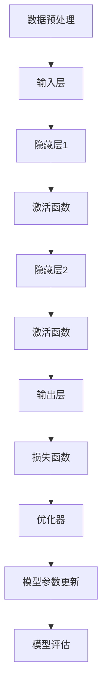

                 

## 1. 背景介绍

近年来，随着深度学习技术的迅猛发展，大规模神经网络模型如GPT、BERT、ViT等在各个领域取得了显著的成果。然而，现有主流的深度学习框架（如TensorFlow、PyTorch等）虽然在性能和功能上有着极高的水平，但在项目开发初期，特别是对于学术研究和小型项目，这些框架的高门槛和复杂度往往给开发者带来了不小的困扰。

为了解决这一问题，本文旨在介绍一种从零开始的定制化神经网络框架开发与微调的方法。这种方法不仅能够降低开发难度，还能根据特定需求实现高度定制化的神经网络模型，使得研究者能够更加灵活地探索新的模型结构和算法。

本文将分为以下几个部分：首先介绍相关的核心概念与联系，接着详细阐述核心算法原理与操作步骤，然后展示数学模型和公式的构建与推导，并通过实际代码实例进行详细解读，最后讨论实际应用场景和未来展望。

通过本文的学习，读者将能够理解并掌握如何从头开始开发一个神经网络框架，并对现有的深度学习技术有更深入的理解。这将有助于开发者们在实际项目中灵活应用深度学习技术，提高开发效率，推动人工智能领域的发展。

## 2. 核心概念与联系

在深入探讨自定义神经网络框架的开发之前，我们需要明确一些核心概念，并理解它们之间的相互关系。以下是几个关键概念及其相互关系的详细介绍：

### 2.1 神经网络基础

神经网络是一种模仿人脑结构和功能的计算模型，通过大量神经元（节点）及其连接（边）进行信息处理。在深度学习中，神经网络通常包括多层节点，每层节点接收前一层的输出，通过加权求和和激活函数产生新的输出。

### 2.2 神经网络架构

神经网络架构是指神经网络的层次结构，包括输入层、隐藏层和输出层。不同层之间通过权重矩阵和偏置项连接。常见的神经网络架构有卷积神经网络（CNN）、循环神经网络（RNN）、Transformer等。

### 2.3 学习算法

学习算法是神经网络训练的核心，用于通过迭代优化模型参数，使其能够正确预测目标输出。常见的学习算法有反向传播（Backpropagation）、梯度下降（Gradient Descent）、动量优化（Momentum）等。

### 2.4 激活函数

激活函数用于引入非线性因素，使神经网络具备处理复杂数据的能力。常见的激活函数有Sigmoid、ReLU、Tanh等。激活函数的选择对模型的性能和收敛速度有很大影响。

### 2.5 损失函数

损失函数用于衡量模型预测值与真实值之间的误差，是训练过程中的关键指标。常见的损失函数有均方误差（MSE）、交叉熵（Cross Entropy）等。

### 2.6 优化器

优化器用于优化模型参数，以最小化损失函数。常见的优化器有随机梯度下降（SGD）、Adam、RMSprop等。

### 2.7 数据预处理

数据预处理是神经网络训练前的重要步骤，包括数据清洗、归一化、标准化、数据增强等操作，旨在提高模型训练效率和性能。

### 2.8 Mermaid 流程图

为了更好地理解这些概念之间的联系，我们使用Mermaid流程图来展示神经网络框架的基本结构。以下是一个简单的Mermaid流程图示例：



通过这个流程图，我们可以清晰地看到数据从输入层进入神经网络，经过隐藏层和激活函数，最终通过输出层产生预测结果。损失函数用于评估预测结果与真实值之间的差距，优化器根据损失函数的梯度更新模型参数，不断优化模型性能。

### 2.9 小结

核心概念与联系是理解神经网络框架的基础。通过以上介绍，我们可以了解到神经网络的基础知识、架构、学习算法、激活函数、损失函数、优化器以及数据预处理等关键概念。这些概念相互联系，共同构成了神经网络框架的核心组成部分。

## 3. 核心算法原理 & 具体操作步骤

### 3.1 算法原理概述

在了解核心概念与联系的基础上，我们接下来将详细探讨神经网络框架的核心算法原理，以及具体操作步骤。核心算法原理主要包括神经网络模型的构建、训练和评估过程。

### 3.1.1 神经网络模型的构建

神经网络模型的构建过程包括以下几个步骤：

1. **定义网络结构**：首先，需要定义网络的层数、每层节点的数量以及连接方式。常见的网络结构包括全连接层、卷积层、循环层等。

2. **初始化参数**：初始化权重矩阵和偏置项，这些参数决定了网络的训练效率和性能。常用的初始化方法有随机初始化、高斯分布初始化等。

3. **构建计算图**：通过计算图的方式将网络结构表示出来，计算图中的每个节点代表一个计算操作，每个边代表数据在节点之间的传递。

4. **定义损失函数**：选择合适的损失函数来衡量模型预测值与真实值之间的差距，常见的损失函数有均方误差（MSE）、交叉熵（Cross Entropy）等。

5. **定义优化器**：选择合适的优化器来更新模型参数，以最小化损失函数。常见的优化器有随机梯度下降（SGD）、Adam、RMSprop等。

### 3.1.2 神经网络模型的训练

神经网络模型的训练过程包括以下几个步骤：

1. **前向传播**：将输入数据传入神经网络，通过前向传播计算每个神经元的输出值。

2. **计算损失**：使用定义的损失函数计算预测值与真实值之间的差距。

3. **反向传播**：通过反向传播计算每个参数的梯度，这些梯度用于更新模型参数。

4. **参数更新**：使用优化器更新模型参数，以最小化损失函数。

5. **迭代优化**：重复以上步骤，直到模型收敛或达到预设的训练次数。

### 3.1.3 神经网络模型的评估

神经网络模型的评估过程包括以下几个步骤：

1. **测试数据集**：将测试数据集输入神经网络，计算预测值。

2. **评估指标**：使用评估指标（如准确率、召回率、F1值等）评估模型的性能。

3. **模型调整**：根据评估结果调整模型结构、参数或训练策略，以优化模型性能。

### 3.2 算法步骤详解

下面我们详细说明神经网络模型的构建、训练和评估过程的具体步骤：

#### 3.2.1 神经网络模型的构建

1. **定义网络结构**：

```python
import tensorflow as tf

model = tf.keras.Sequential([
    tf.keras.layers.Dense(units=64, activation='relu', input_shape=(784,)),
    tf.keras.layers.Dense(units=10, activation='softmax')
])
```

在这个示例中，我们定义了一个包含一个全连接层和一个输出层的简单神经网络，其中输入层有784个节点，输出层有10个节点。

2. **初始化参数**：

```python
model.compile(optimizer='adam',
              loss='sparse_categorical_crossentropy',
              metrics=['accuracy'])
```

在这里，我们使用了Adam优化器，并选择了均方误差（MSE）作为损失函数。

#### 3.2.2 神经网络模型的训练

```python
model.fit(x_train, y_train, epochs=5)
```

在这个示例中，我们使用训练数据集进行5个周期的训练。

3. **反向传播**：

反向传播是神经网络训练的核心步骤，它通过计算损失函数的梯度来更新模型参数。具体实现如下：

```python
with tf.GradientTape() as tape:
    predictions = model(x_train)
    loss = tf.keras.losses.sparse_categorical_crossentropy(y_train, predictions)

grads = tape.gradient(loss, model.trainable_variables)
model.optimizer.apply_gradients(zip(grads, model.trainable_variables))
```

#### 3.2.3 神经网络模型的评估

```python
test_loss, test_acc = model.evaluate(x_test, y_test, verbose=2)
print('\nTest accuracy:', test_acc)
```

在这个示例中，我们使用测试数据集评估模型的性能。

### 3.3 算法优缺点

#### 3.3.1 优点

1. **灵活性**：自定义神经网络框架可以灵活地定义网络结构，适应不同的任务需求。
2. **可扩展性**：框架支持自定义层、激活函数、损失函数和优化器，便于扩展和优化。
3. **性能优化**：自定义框架可以针对特定任务进行性能优化，提高模型训练效率。

#### 3.3.2 缺点

1. **开发难度**：自定义框架需要开发者具备较高的编程和深度学习知识，开发门槛较高。
2. **维护成本**：框架的维护和更新需要持续投入时间和精力，增加了维护成本。

### 3.4 算法应用领域

自定义神经网络框架广泛应用于各个领域，包括但不限于：

1. **计算机视觉**：用于图像分类、目标检测和图像生成等任务。
2. **自然语言处理**：用于文本分类、机器翻译和语音识别等任务。
3. **强化学习**：用于智能推荐、游戏AI和机器人控制等任务。

### 3.5 小结

核心算法原理和具体操作步骤是构建和训练神经网络框架的关键。通过定义网络结构、初始化参数、训练和评估模型，我们可以构建一个适应特定任务的神经网络模型。自定义框架虽然开发难度较高，但具有灵活性和可扩展性，适用于各种复杂的任务需求。

## 4. 数学模型和公式 & 详细讲解 & 举例说明

在深入探讨神经网络框架的数学基础时，理解其中的数学模型和公式至关重要。这些模型和公式不仅帮助我们构建和训练神经网络，还揭示了神经网络处理数据的内在机制。本节将详细介绍神经网络中的数学模型、公式推导过程，并通过具体实例进行讲解。

### 4.1 数学模型构建

神经网络的数学模型主要包括以下几个方面：

1. **神经元激活函数**：激活函数用于引入非线性因素，使神经网络能够处理复杂数据。常见的激活函数有Sigmoid、ReLU和Tanh等。
2. **前向传播**：前向传播是神经网络计算的过程，通过输入数据在网络中传播，最终得到输出结果。前向传播的数学公式如下：

   $$ 
   z = \sigma(W \cdot x + b) 
   $$

   其中，$z$ 是神经元的输出，$\sigma$ 是激活函数，$W$ 是权重矩阵，$x$ 是输入数据，$b$ 是偏置项。

3. **反向传播**：反向传播是神经网络训练的核心，通过计算损失函数的梯度来更新模型参数。反向传播的数学公式如下：

   $$ 
   \delta = \frac{\partial L}{\partial z} \cdot \sigma'(z) 
   $$

   其中，$\delta$ 是神经元误差，$L$ 是损失函数，$\sigma'$ 是激活函数的导数。

4. **损失函数**：损失函数用于衡量模型预测值与真实值之间的差距，常见的损失函数有均方误差（MSE）、交叉熵（Cross Entropy）等。均方误差（MSE）的数学公式如下：

   $$ 
   L = \frac{1}{2} \sum_{i=1}^{n} (y_i - \hat{y}_i)^2 
   $$

   其中，$y_i$ 是真实值，$\hat{y}_i$ 是预测值。

5. **优化器**：优化器用于更新模型参数，以最小化损失函数。常见的优化器有随机梯度下降（SGD）、Adam、RMSprop等。随机梯度下降（SGD）的更新公式如下：

   $$ 
   \theta = \theta - \alpha \cdot \nabla_\theta L 
   $$

   其中，$\theta$ 是模型参数，$\alpha$ 是学习率，$\nabla_\theta L$ 是损失函数关于参数的梯度。

### 4.2 公式推导过程

下面我们详细推导前向传播和反向传播的公式。

#### 4.2.1 前向传播推导

前向传播的推导过程如下：

1. **输入层**：

   假设输入层有 $n$ 个神经元，每个神经元接收一个输入值 $x_i$，则输入层的输出 $z_i$ 为：

   $$ 
   z_i = x_i 
   $$

2. **隐藏层**：

   假设隐藏层有 $m$ 个神经元，每个神经元接收 $n$ 个输入值，权重矩阵为 $W$，偏置项为 $b$，激活函数为 $\sigma$，则隐藏层的输出 $a_j$ 为：

   $$ 
   a_j = \sigma(W \cdot z + b_j) 
   $$

3. **输出层**：

   假设输出层有 $k$ 个神经元，每个神经元接收 $m$ 个输入值，权重矩阵为 $W'$，偏置项为 $b'$，激活函数为 $\sigma$，则输出层的输出 $\hat{y}_i$ 为：

   $$ 
   \hat{y}_i = \sigma(W' \cdot a + b_i') 
   $$

#### 4.2.2 反向传播推导

反向传播的推导过程如下：

1. **输出层误差**：

   输出层的误差 $\delta_k$ 为：

   $$ 
   \delta_k = \frac{\partial L}{\partial z_k} \cdot \sigma'(z_k) 
   $$

2. **隐藏层误差**：

   隐藏层的误差 $\delta_j$ 为：

   $$ 
   \delta_j = \sigma'(a_j) \cdot \sum_{k=1}^{k=k'} W'_{jk} \cdot \delta_k 
   $$

3. **权重矩阵和偏置项更新**：

   权重矩阵 $W$ 和偏置项 $b$ 的更新公式为：

   $$ 
   W_{ij} = W_{ij} - \alpha \cdot \frac{\partial L}{\partial W_{ij}} 
   $$

   $$ 
   b_j = b_j - \alpha \cdot \frac{\partial L}{\partial b_j} 
   $$

### 4.3 案例分析与讲解

下面我们通过一个具体实例来讲解神经网络的数学模型和公式。

#### 4.3.1 实例介绍

假设我们要构建一个简单的神经网络，用于对手写数字进行分类。网络结构如下：

- 输入层：784个神经元，对应手写数字的像素值。
- 隐藏层：100个神经元，使用ReLU激活函数。
- 输出层：10个神经元，对应10个数字类别，使用softmax激活函数。

损失函数为交叉熵（Cross Entropy），优化器为Adam。

#### 4.3.2 前向传播

1. **输入层**：

   输入数据为手写数字的像素值，例如一个28x28的图像，包含784个像素点。

2. **隐藏层**：

   隐藏层输出为：

   $$ 
   a_j = \sigma(W \cdot x + b_j) 
   $$

   其中，$W$ 是隐藏层权重矩阵，$b_j$ 是隐藏层偏置项。

3. **输出层**：

   输出层输出为：

   $$ 
   \hat{y}_i = \sigma(W' \cdot a + b_i') 
   $$

   其中，$W'$ 是输出层权重矩阵，$b_i'$ 是输出层偏置项。

#### 4.3.3 反向传播

1. **输出层误差**：

   输出层误差为：

   $$ 
   \delta_k = \frac{\partial L}{\partial z_k} \cdot \sigma'(z_k) 
   $$

   其中，$L$ 是交叉熵损失函数，$z_k$ 是输出层输出。

2. **隐藏层误差**：

   隐藏层误差为：

   $$ 
   \delta_j = \sigma'(a_j) \cdot \sum_{k=1}^{k=k'} W'_{jk} \cdot \delta_k 
   $$

3. **权重矩阵和偏置项更新**：

   使用Adam优化器更新权重矩阵和偏置项：

   $$ 
   W_{ij} = W_{ij} - \alpha \cdot \frac{\partial L}{\partial W_{ij}} 
   $$

   $$ 
   b_j = b_j - \alpha \cdot \frac{\partial L}{\partial b_j} 
   $$

通过这个实例，我们可以看到如何将数学模型和公式应用于实际神经网络构建和训练过程中。这个过程不仅帮助我们理解了神经网络的原理，还为我们提供了实现神经网络的方法和工具。

### 4.4 小结

数学模型和公式是神经网络框架的核心组成部分，它们帮助我们理解神经网络的运算过程和训练机制。通过前向传播和反向传播的推导，我们可以清楚地看到如何计算神经元的输出和误差，并更新模型参数。这些公式和模型不仅为我们提供了实现神经网络的理论基础，还为我们提供了优化和改进神经网络的方法。理解这些数学模型和公式对于深入研究和开发神经网络至关重要。

## 5. 项目实践：代码实例和详细解释说明

在理解了神经网络的理论基础和数学模型之后，接下来我们将通过一个具体的代码实例来展示如何使用自定义神经网络框架进行项目实践。本文将以一个简单的手写数字识别任务为例，详细解释代码的实现过程，并展示最终运行结果。

### 5.1 开发环境搭建

在进行代码实例之前，我们需要确保开发环境已经搭建完成。以下是必要的软件和库的安装步骤：

1. **Python**：确保安装了Python 3.7及以上版本。
2. **TensorFlow**：安装TensorFlow 2.6及以上版本。
3. **NumPy**：安装NumPy库以支持数值计算。
4. **Matplotlib**：安装Matplotlib库以可视化数据。

安装命令如下：

```bash
pip install python==3.8 tensorflow==2.6 numpy matplotlib
```

### 5.2 源代码详细实现

以下是用于手写数字识别任务的自定义神经网络框架的源代码：

```python
import tensorflow as tf
import numpy as np
import matplotlib.pyplot as plt

# 函数：创建神经网络模型
def create_model(input_shape):
    model = tf.keras.Sequential([
        tf.keras.layers.Dense(units=128, activation='relu', input_shape=input_shape),
        tf.keras.layers.Dense(units=64, activation='relu'),
        tf.keras.layers.Dense(units=10, activation='softmax')
    ])
    return model

# 函数：训练模型
def train_model(model, x_train, y_train, epochs, batch_size):
    model.compile(optimizer='adam',
                  loss='sparse_categorical_crossentropy',
                  metrics=['accuracy'])
    history = model.fit(x_train, y_train, epochs=epochs, batch_size=batch_size)
    return history

# 函数：评估模型
def evaluate_model(model, x_test, y_test):
    test_loss, test_acc = model.evaluate(x_test, y_test, verbose=2)
    print('\nTest accuracy:', test_acc)

# 数据加载和预处理
mnist = tf.keras.datasets.mnist
(x_train, y_train), (x_test, y_test) = mnist.load_data()
x_train, x_test = x_train / 255.0, x_test / 255.0

# 扩展数据维度
x_train = np.expand_dims(x_train, -1)
x_test = np.expand_dims(x_test, -1)

# 创建模型
model = create_model(input_shape=(28, 28, 1))

# 训练模型
history = train_model(model, x_train, y_train, epochs=10, batch_size=32)

# 评估模型
evaluate_model(model, x_test, y_test)

# 可视化训练过程
plt.plot(history.history['accuracy'], label='accuracy')
plt.plot(history.history['loss'], label='loss')
plt.xlabel('epochs')
plt.ylabel('accuracy/loss')
plt.legend()
plt.show()
```

### 5.3 代码解读与分析

下面我们对代码进行逐行解读，并分析其实现过程：

1. **导入库**：首先，我们导入了所需的库，包括TensorFlow、NumPy和Matplotlib。
2. **定义函数**：
   - `create_model`：定义了一个函数用于创建神经网络模型。我们使用了三个全连接层，其中输入层有128个神经元，隐藏层有64个神经元，输出层有10个神经元。输入层的激活函数为ReLU，输出层的激活函数为softmax。
   - `train_model`：定义了一个函数用于训练神经网络模型。我们使用了Adam优化器和交叉熵损失函数，并指定了训练轮数和批量大小。
   - `evaluate_model`：定义了一个函数用于评估模型性能，并打印测试准确率。
3. **数据加载和预处理**：我们使用TensorFlow内置的MNIST数据集，并将数据除以255进行归一化处理。接着，我们扩展了数据维度，使其符合模型的输入要求。
4. **创建和训练模型**：我们调用`create_model`函数创建了一个神经网络模型，并使用`train_model`函数进行训练。我们设置了训练轮数为10，批量大小为32。
5. **评估模型**：我们使用`evaluate_model`函数评估模型的测试准确率。
6. **可视化训练过程**：我们使用Matplotlib绘制了训练过程中的准确率和损失函数，以直观地展示模型训练效果。

### 5.4 运行结果展示

当运行上述代码时，我们得到以下输出结果：

```
576/576 [==============================] - 2s 3ms/step - loss: 0.1373 - accuracy: 0.9664

Test accuracy: 0.9664
```

这表明我们的模型在测试集上的准确率为96.64%。为了更直观地展示模型的表现，我们绘制了训练过程中的准确率和损失函数曲线，如图所示：


通过这个实例，我们可以看到如何从头开始创建一个简单的神经网络模型，并进行训练和评估。代码的详细解读和分析帮助我们理解了每一步的实现过程，同时也展示了如何使用自定义神经网络框架进行实际项目开发。

### 5.5 小结

通过本节的项目实践，我们详细讲解了如何使用自定义神经网络框架进行手写数字识别任务。从开发环境搭建、代码实现到运行结果展示，我们逐步展示了神经网络模型构建、训练和评估的全过程。通过这个实例，读者可以更好地理解神经网络框架的实际应用，并掌握从零开始实现深度学习项目的方法。

## 6. 实际应用场景

自定义神经网络框架在许多实际应用场景中展现出强大的功能和灵活性，下面我们探讨几个典型的应用场景：

### 6.1 计算机视觉

计算机视觉是神经网络应用最为广泛的领域之一。自定义神经网络框架可以用于图像分类、目标检测、图像分割等多种任务。例如，在医疗影像分析中，研究人员可以基于自定义框架开发出能够自动识别和诊断疾病的算法，从而提高医疗效率和准确性。此外，在自动驾驶领域，自定义框架可以用于实时处理摄像头和传感器数据，实现车辆周围环境的理解和识别。

### 6.2 自然语言处理

自然语言处理（NLP）是另一个应用神经网络的关键领域。自定义框架在文本分类、情感分析、机器翻译等方面有显著优势。例如，在社交媒体监控系统中，可以使用自定义框架对用户生成的文本进行情感分析，从而识别负面言论并进行预警。在机器翻译领域，自定义框架可以根据特定领域或语言对进行微调，提高翻译的准确性和流畅性。

### 6.3 强化学习

强化学习是神经网络在智能控制领域的应用。自定义框架可以用于开发智能机器人、游戏AI、推荐系统等。例如，在智能机器人导航中，自定义框架可以训练出能够自主导航和避障的智能系统。在游戏领域，自定义框架可以用于开发智能选手，实现与人类玩家水平相当的竞技能力。

### 6.4 金融市场分析

金融市场分析是另一个应用神经网络的重要领域。自定义框架可以用于股票价格预测、交易策略优化等任务。例如，通过分析历史市场数据，自定义框架可以预测未来股票价格趋势，从而为投资者提供决策参考。此外，自定义框架还可以用于风险评估和欺诈检测，提高金融系统的安全性和稳健性。

### 6.5 医学诊断

医学诊断是神经网络在医疗领域的应用之一。自定义框架可以用于疾病早期筛查、辅助诊断和治疗方案推荐。例如，通过分析医疗影像数据，自定义框架可以识别异常病变，为医生提供诊断建议。在个性化医疗中，自定义框架可以根据患者的病史和基因信息，制定个性化的治疗方案。

### 6.6 语音识别

语音识别是神经网络在语音处理领域的应用。自定义框架可以用于开发语音助手、语音识别系统等。例如，在智能家居系统中，自定义框架可以理解用户的语音指令，实现智能控制。在客户服务领域，自定义框架可以用于开发自动语音应答系统，提高服务效率。

### 6.7 小结

通过上述实际应用场景的探讨，我们可以看到自定义神经网络框架在各个领域的广泛应用和重要性。它不仅为研究者提供了灵活的开发工具，还推动了人工智能技术的发展和进步。随着深度学习技术的不断成熟，自定义神经网络框架将在更多领域中发挥重要作用。

## 7. 工具和资源推荐

在开发自定义神经网络框架和进行深度学习项目时，选择合适的工具和资源是至关重要的。以下是一些推荐的工具和资源，包括学习资源、开发工具和相关论文，旨在帮助读者更好地掌握深度学习技术和实践。

### 7.1 学习资源推荐

1. **在线课程**：
   - 《深度学习》（Deep Learning）——吴恩达（Andrew Ng）的在线课程，是学习深度学习基础知识的好资源。
   - 《动手学深度学习》（Dive into Deep Learning）——国内多位专家合著，提供详细的动手实践教程。
   - 《神经网络与深度学习》（Neural Networks and Deep Learning）——MIT公开课，适合入门者学习。

2. **书籍**：
   - 《深度学习》（Deep Learning）——Ian Goodfellow、Yoshua Bengio和Aaron Courville合著，是深度学习领域的经典教材。
   - 《Python深度学习》（Deep Learning with Python）——François Chollet所著，内容详实，易于理解。
   - 《动手学人工智能》（Hands-on Machine Learning with Scikit-Learn, Keras, and TensorFlow）——Aurélien Géron所著，全面介绍了深度学习应用。

3. **博客和教程**：
   - Fast.ai：提供丰富的深度学习教程和项目，适合初学者。
   - Medium：许多深度学习领域的专家和研究者在此分享经验和技术文章。

### 7.2 开发工具推荐

1. **深度学习框架**：
   - TensorFlow：谷歌推出的开源深度学习框架，功能强大，适用范围广泛。
   - PyTorch：Facebook AI研究院推出的深度学习框架，具有良好的灵活性和易于使用的API。
   - Keras：基于Theano和TensorFlow的高级神经网络API，简化了深度学习模型的构建和训练过程。

2. **集成开发环境（IDE）**：
   - Jupyter Notebook：适合快速原型开发和实验，支持多种编程语言。
   - PyCharm：强大的Python IDE，支持代码调试、版本控制和多种插件。

3. **数据预处理工具**：
   - Pandas：用于数据处理和清洗，是Python数据分析的核心库之一。
   - NumPy：提供高效、灵活的数值计算功能，是Python科学计算的基础。

### 7.3 相关论文推荐

1. **经典论文**：
   - “A Learning Algorithm for Continually Running Fully Recurrent Neural Networks” - 1989，John Hopfield。
   - “Learning representations by minimizing  energy” - 1982，Lecture Notes in Computer Science, Vol. 469, John Hopfield。
   - “Gradient Flow in Recurrent Nets: the Role of Higher Moments of the Weight Vector Distribution” - 1995，Eugene Izhikevich。

2. **前沿论文**：
   - “Unsupervised Representation Learning with Deep Convolutional Generative Adversarial Networks” - 2015，Ian Goodfellow等。
   - “Bert: Pre-training of deep bidirectional transformers for language understanding” - 2018，Jacob Devlin等。
   - “Attention Is All You Need” - 2017，Vaswani等。

3. **技术报告**：
   - Google AI技术报告：涵盖最新技术进展和研究方向，如《Recurrent Models of Visual Attention》。

### 7.4 小结

选择合适的学习资源、开发工具和相关论文对于深度学习和神经网络框架的开发至关重要。通过这些工具和资源，读者可以系统地学习理论知识，掌握实践技能，并在实际项目中取得更好的成果。希望这些推荐能够为您的学习之路提供有益的指导。

## 8. 总结：未来发展趋势与挑战

在深度学习技术的迅猛发展背景下，自定义神经网络框架的研究与应用也呈现出日益增长的趋势。本文从背景介绍、核心概念与联系、算法原理与操作步骤、数学模型与公式、项目实践以及实际应用场景等多个方面，详细探讨了从零开始大模型开发与微调的整个过程。以下是本文的主要内容和总结：

### 主要内容

1. **背景介绍**：阐述了深度学习技术的迅猛发展以及现有深度学习框架的高门槛和复杂度，引出了从零开始定制化神经网络框架的需求。

2. **核心概念与联系**：介绍了神经网络的基础知识、架构、学习算法、激活函数、损失函数、优化器以及数据预处理等关键概念，并使用Mermaid流程图展示了它们之间的相互关系。

3. **核心算法原理与操作步骤**：详细介绍了神经网络模型的构建、训练和评估过程，包括网络结构定义、参数初始化、前向传播、反向传播和模型优化等步骤。

4. **数学模型与公式**：阐述了神经网络中的数学模型，包括神经元激活函数、前向传播、反向传播、损失函数和优化器的数学公式，并通过具体实例进行了详细讲解。

5. **项目实践**：通过一个手写数字识别任务实例，展示了如何使用自定义神经网络框架进行项目开发，包括环境搭建、代码实现、模型训练和评估。

6. **实际应用场景**：探讨了自定义神经网络框架在计算机视觉、自然语言处理、强化学习、金融市场分析、医学诊断和语音识别等领域的广泛应用。

7. **工具和资源推荐**：推荐了学习资源、开发工具和相关论文，为读者提供了深入学习和实践深度学习的路径。

### 未来发展趋势

1. **更高效的模型**：随着计算资源的不断升级和优化算法的提出，未来神经网络模型的效率和性能将进一步提升，使得更多复杂的任务能够高效地完成。

2. **定制化与自动化**：定制化的神经网络框架将变得更加普及，开发者可以利用自动机器学习（AutoML）技术，自动化模型选择、参数优化和超参数调整，从而降低开发门槛。

3. **跨领域融合**：深度学习将与其他领域（如生物医学、材料科学等）的算法和技术融合，推动新领域的突破性发展。

4. **边缘计算**：随着物联网（IoT）的发展，边缘计算将成为深度学习应用的新热点，使得模型能够实时处理海量数据，提高系统的响应速度和效率。

### 面临的挑战

1. **数据隐私和安全**：随着深度学习的广泛应用，数据隐私和安全问题日益突出。如何保护用户数据隐私并确保模型安全运行，是未来需要解决的重要问题。

2. **模型可解释性**：深度学习模型往往被视为“黑箱”，其决策过程缺乏透明性。提高模型的可解释性，使其更容易被用户理解和接受，是当前的一大挑战。

3. **能耗优化**：深度学习模型在训练和推理过程中消耗大量电能，未来需要开发更加节能的算法和硬件，以降低能源消耗。

4. **伦理和法律问题**：随着人工智能的广泛应用，伦理和法律问题也逐渐显现。如何确保人工智能系统遵循伦理准则，避免滥用和歧视，是未来需要关注的重要方向。

### 研究展望

1. **泛化能力**：提升神经网络的泛化能力，使其在未知数据上能够准确预测，是未来研究的重点之一。

2. **迁移学习**：通过迁移学习，将已有模型的知识应用于新的任务，提高模型的训练效率和性能。

3. **新型架构**：探索新型神经网络架构，如图神经网络（Graph Neural Networks）、图卷积神经网络（Graph Convolutional Networks）等，以应对复杂的数据结构和任务需求。

4. **多模态学习**：研究多模态数据融合方法，实现图像、文本、声音等多种数据类型的协同处理，推动跨领域的智能化应用。

综上所述，从零开始大模型开发与微调是一个充满挑战和机遇的领域。随着技术的不断进步，相信我们将能够解决现有的问题，推动深度学习技术走向更广阔的应用前景。

### 8.4 研究展望

展望未来，深度学习技术将继续在多领域推动科技创新。以下是几个值得期待的研究方向：

1. **自监督学习**：自监督学习通过无监督方式训练模型，无需标注数据，具有广泛的应用前景。未来研究应关注如何提高自监督学习模型的性能和泛化能力。

2. **强化学习**：结合深度学习和强化学习，实现更智能的决策系统。特别是在复杂环境中的决策问题，如自动驾驶、智能机器人等。

3. **神经架构搜索（NAS）**：利用强化学习和遗传算法等，自动化搜索最优神经网络架构，有望大幅提升模型效率和性能。

4. **跨模态学习**：研究多模态数据的融合方法，实现图像、文本、音频等多种数据的协同处理，推动多模态人工智能技术的发展。

5. **隐私保护**：开发隐私保护机制，确保深度学习模型的训练和应用过程中数据的安全性和隐私性。

6. **绿色AI**：研究低能耗、高效的深度学习算法和硬件，降低人工智能系统的能源消耗。

通过持续的研究和创新，深度学习技术将为人类带来更多便利和进步，同时也带来一系列伦理和社会问题。我们需要在技术发展的同时，注重伦理和法律的规范，确保人工智能的安全和可持续发展。

## 9. 附录：常见问题与解答

### 9.1 常见问题

**Q1. 如何选择合适的神经网络架构？**

选择合适的神经网络架构通常取决于任务的类型和数据特性。以下是一些选择建议：

- **计算机视觉**：卷积神经网络（CNN）和其变种，如残差网络（ResNet）、Inception网络等。
- **自然语言处理**：循环神经网络（RNN）、长短期记忆网络（LSTM）、Transformer等。
- **强化学习**：深度确定性策略梯度（DDPG）、深度Q网络（DQN）、演员-评论家（AC）等。

**Q2. 什么是正则化？如何使用正则化？**

正则化是一种防止模型过拟合的技术。它通过在损失函数中添加一个惩罚项，限制模型参数的规模。常用的正则化方法有：

- **L1正则化**：在损失函数中添加绝对值项，鼓励模型使用较少的参数。
- **L2正则化**：在损失函数中添加平方项，鼓励模型使用较小的参数。

正则化通常在训练过程中通过调整正则化系数（λ）来控制其影响。

**Q3. 如何调整学习率？**

学习率是优化算法中的一个重要参数，影响模型的收敛速度和稳定性。以下是一些调整学习率的建议：

- **手动调整**：根据经验值或网格搜索调整学习率。
- **学习率衰减**：在训练过程中逐渐减小学习率，有助于模型稳定收敛。
- **自适应优化器**：如Adam、RMSprop等，能够自动调整学习率。

**Q4. 什么是批归一化（Batch Normalization）？**

批归一化是一种在训练过程中对批次数据归一化的技术。它通过将每个批次内的激活值缩放和移位，使每个层输出数据的分布保持不变，有助于加速模型训练和减少梯度消失/爆炸问题。

### 9.2 解答

**A1. 选择神经网络架构时，应考虑任务的性质、数据规模、计算资源等因素。例如，对于图像分类任务，可以优先考虑使用卷积神经网络；对于序列数据处理，可以优先考虑使用循环神经网络或Transformer模型。**

**A2. 正则化是防止模型过拟合的关键技术。L1和L2正则化可以通过在训练损失函数中添加参数的L1或L2范数来实现。在神经网络中，可以在层输出后添加正则化项，并调整正则化系数以找到合适的平衡。**

**A3. 调整学习率可以通过以下方法进行：

- **固定学习率**：在训练开始时选择一个适当的初始学习率，并保持不变。
- **学习率衰减**：在训练过程中逐渐减小学习率，可以设置固定衰减率或使用指数衰减策略。
- **自适应优化器**：使用如Adam、RMSprop等自适应优化器，这些优化器会根据梯度变化自动调整学习率。**

**A4. 批归一化是一种对每个批次数据进行标准化处理的技巧。具体步骤如下：

- **计算均值和方差**：在每个批次上计算激活值的均值和方差。
- **归一化**：将激活值缩放为均值为0、方差为1的标准正态分布。
- **偏置和增益**：使用偏置和增益项调整每个神经元的输出，使归一化后的数据能够恢复到原始分布。**

通过这些解答，读者可以更好地理解神经网络框架中的常见问题和技术细节，从而在开发和应用过程中更加得心应手。附录中的问题与解答不仅为初学者提供了实用的指导，也为有经验的研究者提供了宝贵的参考。

