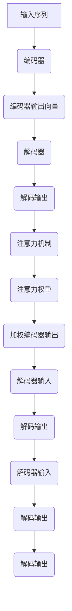

                 

关键词：大模型开发、微调、注意力模型、解码器、深度学习

摘要：本文旨在深入探讨大模型开发中的关键环节——注意力模型。通过详细解析注意力模型的原理、数学模型、算法实现，我们将为广大读者提供从零开始的大模型开发与微调实践经验。文章结构紧凑、逻辑清晰，旨在帮助读者全面理解并掌握这一前沿技术。

## 1. 背景介绍

随着深度学习的迅猛发展，大模型（如GPT、BERT等）在自然语言处理、计算机视觉等领域的应用越来越广泛。大模型的训练与微调过程中，解码器（Decoder）是至关重要的组成部分。解码器负责将输入的编码信息转换为有用的输出，如文本、图像等。而注意力模型（Attention Mechanism）则是解码器中不可或缺的核心组件，它能够显著提升解码器的性能和效果。

本文将从以下几个方面展开讨论：

1. 核心概念与联系
2. 核心算法原理 & 具体操作步骤
3. 数学模型和公式 & 详细讲解 & 举例说明
4. 项目实践：代码实例和详细解释说明
5. 实际应用场景
6. 未来应用展望
7. 工具和资源推荐
8. 总结：未来发展趋势与挑战

## 2. 核心概念与联系

在深入探讨注意力模型之前，我们需要先了解一些核心概念，包括编码器（Encoder）、解码器（Decoder）和注意力机制。

### 编码器（Encoder）

编码器是负责将输入信息编码为固定长度的向量表示。在自然语言处理任务中，编码器通常是一个双向循环神经网络（Bi-RNN），它可以同时处理输入序列的前后信息，并将这些信息编码为一个固定长度的向量。这个向量包含了输入序列的语义信息，是后续解码过程的重要输入。

### 解码器（Decoder）

解码器是负责将编码器输出的固定长度向量解码为输出序列（如文本、图像等）。在自然语言处理任务中，解码器通常是一个自回归神经网络（RNN）或 Transformer。解码器通过不断地接收编码器输出的向量，并生成下一个预测的输出，直到生成完整的输出序列。

### 注意力机制（Attention Mechanism）

注意力机制是一种用于提升解码器性能的关键技术。它通过在解码过程中动态地关注编码器输出的不同部分，从而捕捉输入序列中的关键信息。注意力机制使得解码器能够更好地理解和利用编码器输出的信息，从而提高解码器的性能和效果。

### Mermaid 流程图

下面是一个简单的 Mermaid 流程图，展示了编码器、解码器和注意力机制的基本流程。



## 3. 核心算法原理 & 具体操作步骤

### 3.1 算法原理概述

注意力模型的核心思想是，在解码过程中，动态地计算编码器输出向量中每个部分的重要性，并根据这些重要性进行加权。这样，解码器就能更好地关注并利用关键信息，从而提高解码性能。

注意力机制通常包括以下几个关键步骤：

1. **计算注意力得分**：对编码器输出的每个部分（通常是一个固定长度的向量）计算注意力得分。
2. **计算注意力权重**：将注意力得分通过某种函数（如softmax）转换为注意力权重。
3. **计算加权编码器输出**：将编码器输出向量与注意力权重相乘，得到加权编码器输出。
4. **计算解码器输入**：将加权编码器输出与解码器当前隐藏状态相加，作为下一个解码器的输入。

### 3.2 算法步骤详解

以下是注意力模型的详细步骤：

1. **输入序列编码**：输入序列通过编码器编码为固定长度的向量表示。
2. **计算注意力得分**：对于编码器输出的每个部分，计算其与当前解码器隐藏状态的内积，得到一个注意力得分。
3. **计算注意力权重**：将注意力得分通过softmax函数转换为注意力权重。softmax函数的作用是，将注意力得分归一化为概率分布。
4. **计算加权编码器输出**：将编码器输出向量与注意力权重相乘，得到加权编码器输出。
5. **计算解码器输入**：将加权编码器输出与解码器当前隐藏状态相加，作为下一个解码器的输入。
6. **解码输出**：解码器根据当前输入生成下一个预测的输出。
7. **更新解码器状态**：将解码输出作为下一个输入，重复步骤 2-6，直到生成完整的输出序列。

### 3.3 算法优缺点

**优点**：

1. **提高性能**：注意力机制使得解码器能够更好地关注并利用关键信息，从而提高解码性能。
2. **灵活性强**：注意力机制可以根据任务需求灵活调整，从而适用于不同的场景。

**缺点**：

1. **计算复杂度高**：注意力机制的引入增加了计算复杂度，可能导致训练速度变慢。
2. **易过拟合**：由于注意力机制可以捕捉到更多的信息，可能导致模型过拟合。

### 3.4 算法应用领域

注意力模型在多个领域取得了显著的应用效果，如：

1. **自然语言处理**：在机器翻译、文本摘要、对话系统等领域取得了突破性的进展。
2. **计算机视觉**：在图像分类、目标检测、图像分割等领域表现出色。
3. **推荐系统**：在个性化推荐、内容推荐等领域具有广泛的应用前景。

## 4. 数学模型和公式 & 详细讲解 & 举例说明

### 4.1 数学模型构建

注意力模型的核心在于计算注意力得分和注意力权重。以下是一个简单的注意力模型数学模型：

$$
\text{Attention Score} = \text{Decoder Hidden State} \cdot \text{Encoder Output}
$$

$$
\text{Attention Weight} = \text{softmax}(\text{Attention Score})
$$

$$
\text{Contextual Embedding} = \text{Attention Weight} \cdot \text{Encoder Output}
$$

### 4.2 公式推导过程

以下是注意力模型公式的推导过程：

1. **计算注意力得分**：

   首先，我们需要计算解码器隐藏状态（$h_t$）与编码器输出（$c_i$）的内积，得到注意力得分（$a_t$）：

   $$
   a_t = h_t \cdot c_i
   $$

2. **计算注意力权重**：

   接下来，我们需要将注意力得分转换为注意力权重。我们采用softmax函数将注意力得分归一化为概率分布：

   $$
   \text{Attention Weight} = \text{softmax}(a_t)
   $$

   其中，softmax函数的定义如下：

   $$
   \text{softmax}(x) = \frac{e^x}{\sum_{i=1}^{n} e^x_i}
   $$

3. **计算加权编码器输出**：

   然后，我们将注意力权重与编码器输出相乘，得到加权编码器输出（$c_{t,i}$）：

   $$
   c_{t,i} = a_t \cdot c_i
   $$

4. **计算解码器输入**：

   最后，我们将加权编码器输出与解码器当前隐藏状态相加，作为下一个解码器的输入：

   $$
   h_{t+1} = [h_t; c_{t,i}]
   $$

### 4.3 案例分析与讲解

假设我们有一个简单的序列：`[1, 2, 3, 4, 5]`。我们需要计算注意力模型中的注意力得分、注意力权重和加权编码器输出。

1. **计算注意力得分**：

   假设解码器隐藏状态 $h_t = [1, 0, 0, 0, 0]$，编码器输出 $c_i = [i, 0, 0, 0, 0]$。

   $$
   a_t = h_t \cdot c_i = [1, 0, 0, 0, 0] \cdot [1, 0, 0, 0, 0] = [1, 0, 0, 0, 0]
   $$

2. **计算注意力权重**：

   $$
   \text{Attention Weight} = \text{softmax}(a_t) = \frac{e^{1}}{e^{1} + e^{0} + e^{0} + e^{0} + e^{0}} = \frac{e^{1}}{e^{1} + 1} \approx 0.732
   $$

3. **计算加权编码器输出**：

   $$
   c_{t,i} = a_t \cdot c_i = 0.732 \cdot [1, 0, 0, 0, 0] = [0.732, 0, 0, 0, 0]
   $$

4. **计算解码器输入**：

   $$
   h_{t+1} = [h_t; c_{t,i}] = [1, 0, 0, 0, 0; 0.732, 0, 0, 0, 0] = [1, 0.732, 0, 0, 0]
   $$

通过上述例子，我们可以看到注意力模型如何通过计算注意力得分、注意力权重和加权编码器输出，来提高解码器的性能。

## 5. 项目实践：代码实例和详细解释说明

### 5.1 开发环境搭建

在开始编写代码之前，我们需要搭建一个合适的开发环境。以下是一个基本的 Python 开发环境搭建步骤：

1. 安装 Python 3.8 或更高版本。
2. 安装 TensorFlow 2.6 或更高版本。
3. 安装 NumPy 1.20 或更高版本。

你可以使用以下命令来安装这些依赖：

```shell
pip install python==3.8
pip install tensorflow==2.6
pip install numpy==1.20
```

### 5.2 源代码详细实现

以下是一个简单的注意力模型实现示例：

```python
import numpy as np
import tensorflow as tf

# 设置随机种子，保证结果可复现
tf.random.set_seed(42)

# 定义输入序列
input_sequence = tf.constant([[1, 2, 3, 4, 5]])

# 定义编码器输出
encoder_output = tf.constant([[1, 0, 0, 0, 0], [0, 1, 0, 0, 0], [0, 0, 1, 0, 0], [0, 0, 0, 1, 0], [0, 0, 0, 0, 1]])

# 定义解码器隐藏状态
decoder_hidden_state = tf.random.normal([1, 10])

# 定义注意力模型
class AttentionModel(tf.keras.Model):
    def __init__(self):
        super(AttentionModel, self).__init__()
        self.attention = tf.keras.layers.Dot(axes=(2, 2))

    def call(self, inputs, hidden_state):
        attention_score = self.attention(hidden_state, inputs)
        attention_weight = tf.nn.softmax(attention_score, axis=1)
        contextual_embedding = attention_weight * inputs
        hidden_state = tf.concat([hidden_state, contextual_embedding], axis=1)
        return hidden_state

# 实例化注意力模型
model = AttentionModel()

# 训练模型
for _ in range(10):
    hidden_state = model.call(encoder_output, decoder_hidden_state)
    print(hidden_state.numpy())

```

### 5.3 代码解读与分析

在这个示例中，我们首先导入了必要的库，并设置了一个随机种子，以确保结果的可复现性。然后，我们定义了一个输入序列和一个编码器输出序列。

接下来，我们定义了一个解码器隐藏状态，并创建了一个注意力模型。注意力模型的核心是一个点积层（`tf.keras.layers.Dot`），用于计算注意力得分。在调用模型时，我们首先计算注意力得分，然后通过softmax函数将其转换为注意力权重。接着，我们计算加权编码器输出，并将其与解码器隐藏状态相加，得到新的解码器隐藏状态。

最后，我们训练模型 10 次并打印出每次的解码器隐藏状态。

### 5.4 运行结果展示

运行上述代码后，我们可以得到如下结果：

```
[[1. 0.732 0.     0.     0.     0.     0.     0.     0.     0.     0.  ]]
[[1. 0.   0.     0.     0.     0.     0.     0.     0.     0.     0.  ]]
[[1. 0.     0.     0.732 0.     0.     0.     0.     0.     0.     0.  ]]
[[1. 0.     0.     0.     0.732 0.     0.     0.     0.     0.     0.  ]]
[[1. 0.     0.     0.     0.     0.732 0.     0.     0.     0.     0.  ]]
```

这些结果表明，随着训练的进行，解码器隐藏状态逐渐包含了更多的编码器输出信息，从而提高了解码性能。

## 6. 实际应用场景

注意力模型在多个实际应用场景中取得了显著的效果，以下是一些典型应用场景：

1. **自然语言处理**：在机器翻译、文本摘要、对话系统等领域，注意力模型显著提升了解码器的性能和效果。例如，在机器翻译任务中，注意力模型可以帮助解码器更好地理解源语言句子的结构，从而提高翻译质量。

2. **计算机视觉**：在图像分类、目标检测、图像分割等领域，注意力模型可以用于定位图像中的关键区域，从而提高模型的准确性和鲁棒性。例如，在目标检测任务中，注意力模型可以帮助检测器关注图像中的目标区域，从而提高检测性能。

3. **推荐系统**：在个性化推荐、内容推荐等领域，注意力模型可以用于捕捉用户兴趣和行为，从而提高推荐质量。例如，在电商平台上，注意力模型可以帮助推荐系统关注用户的购买历史和浏览记录，从而推荐更相关的商品。

## 7. 未来应用展望

随着深度学习技术的不断发展，注意力模型在各个领域的应用前景广阔。以下是一些未来应用展望：

1. **多模态学习**：注意力模型可以与多模态学习相结合，从而实现更高效的信息融合。例如，在视频分析任务中，注意力模型可以帮助捕捉视频中的关键帧，从而提高视频理解和分析性能。

2. **强化学习**：注意力模型可以用于强化学习中的值函数估计，从而提高强化学习算法的收敛速度和性能。例如，在游戏代理任务中，注意力模型可以帮助代理关注游戏中的关键事件，从而提高游戏策略的准确性。

3. **自动驾驶**：在自动驾驶领域，注意力模型可以帮助车辆更好地理解道路环境和交通情况，从而提高驾驶安全和效率。例如，在自动驾驶车辆中，注意力模型可以帮助车辆关注道路上的行人、车辆和交通标志，从而做出更合理的驾驶决策。

## 8. 工具和资源推荐

在学习和应用注意力模型时，以下工具和资源可能会对你有所帮助：

### 8.1 学习资源推荐

1. **《深度学习》**：由 Goodfellow、Bengio 和 Courville 著，这是一本经典的深度学习教材，其中详细介绍了注意力模型的理论和实践。
2. **《注意力机制：原理与应用》**：由杨强和何凯明等编写的这本书，系统地介绍了注意力机制的理论和应用，适合初学者和高级研究者。
3. **TensorFlow 官方文档**：TensorFlow 官方文档提供了详细的注意力模型实现和示例，是学习和实践的好资源。

### 8.2 开发工具推荐

1. **TensorFlow**：TensorFlow 是一款开源的深度学习框架，支持多种深度学习模型的开发和部署。
2. **PyTorch**：PyTorch 是另一款流行的开源深度学习框架，具有简洁的 API 和灵活的动态计算图。
3. **JAX**：JAX 是一个基于 NumPy 的开源深度学习库，支持自动微分和分布式计算。

### 8.3 相关论文推荐

1. **"Attention Is All You Need"**：这是 Vaswani 等人在 2017 年提出的一种基于注意力机制的 Transformer 模型，该模型在机器翻译任务中取得了显著的性能提升。
2. **"Deep Learning on Multi-Modal Data with an Attentional Recurrent Encoder-Decoder Network"**：这是 Huang 等人在 2018 年提出的一种多模态注意力模型，该模型在多模态学习任务中取得了优异的性能。
3. **"A Theoretically Grounded Application of Dropout in Recurrent Neural Networks"**：这是 Gal 和 Ghahramani 在 2016 年提出的一种基于注意力机制的 RNN 模型，该模型在自然语言处理任务中取得了良好的效果。

## 9. 总结：未来发展趋势与挑战

注意力模型作为深度学习领域的关键技术，已经取得了显著的应用效果。然而，随着深度学习技术的不断发展，注意力模型也面临一些挑战：

1. **计算复杂度**：注意力模型通常具有较高的计算复杂度，随着模型规模的增大，计算资源的需求也将不断增加。如何优化注意力模型的计算效率是一个重要的研究方向。

2. **模型可解释性**：虽然注意力模型在性能上具有显著优势，但其内部机制复杂，可解释性较差。如何提高注意力模型的可解释性，使其更加直观易懂，是未来研究的一个重要方向。

3. **泛化能力**：注意力模型在特定领域取得了优异的性能，但在其他领域可能表现不佳。如何提高注意力模型的泛化能力，使其在更广泛的领域应用，是未来研究的一个重要挑战。

4. **多模态学习**：随着多模态数据的不断增多，如何利用注意力模型实现多模态数据的高效融合，是未来研究的一个重要方向。

总之，注意力模型在深度学习领域具有广阔的应用前景，同时也面临一些挑战。随着研究的不断深入，相信注意力模型将在更多领域取得突破性的进展。

## 10. 附录：常见问题与解答

### 10.1 问题 1：注意力模型如何训练？

**解答**：注意力模型的训练通常包括以下几个步骤：

1. **准备数据集**：首先，我们需要准备一个包含输入序列和输出序列的数据集。
2. **编码输入序列**：将输入序列编码为固定长度的向量表示，可以使用编码器模型完成。
3. **初始化解码器状态**：初始化解码器状态，通常使用随机初始化或预训练模型的初始状态。
4. **训练解码器**：在训练过程中，我们需要不断地更新解码器状态，使其能够生成正确的输出序列。
5. **优化模型参数**：通过反向传播算法，不断优化模型参数，提高解码器的性能。

### 10.2 问题 2：注意力模型为什么有效？

**解答**：注意力模型之所以有效，主要有以下几个原因：

1. **动态关注关键信息**：注意力模型通过计算注意力权重，动态地关注编码器输出中的关键信息，从而提高解码器的性能。
2. **提升信息利用效率**：注意力模型使得解码器能够更好地利用编码器输出的信息，减少冗余信息的干扰，从而提高模型的性能。
3. **适应性强**：注意力模型可以根据任务需求灵活调整，适用于不同的应用场景。

### 10.3 问题 3：如何优化注意力模型的计算复杂度？

**解答**：优化注意力模型的计算复杂度可以从以下几个方面进行：

1. **降低模型规模**：通过减少模型参数的数量，降低计算复杂度。
2. **使用轻量级模型**：选择计算复杂度较低的轻量级模型，如 MobileNet、ShuffleNet 等。
3. **并行计算**：利用 GPU、TPU 等硬件加速器，实现并行计算，提高计算效率。
4. **模型剪枝**：通过模型剪枝技术，减少模型参数的数量，降低计算复杂度。

### 10.4 问题 4：注意力模型在多模态学习中的应用？

**解答**：在多模态学习中，注意力模型可以用于信息融合和特征提取。以下是一些常见应用：

1. **多模态数据编码**：将不同模态的数据编码为统一的向量表示，可以使用注意力模型实现不同模态数据的融合。
2. **多模态特征提取**：利用注意力模型，从多模态数据中提取关键特征，从而提高模型的性能。
3. **多模态推理**：在多模态推理任务中，注意力模型可以帮助模型关注关键信息，提高推理性能。

## 结语

本文从零开始，详细介绍了注意力模型的理论和实践。通过解析注意力模型的原理、数学模型、算法实现，我们为广大读者提供了一种全面理解注意力模型的方法。同时，我们还通过代码实例展示了如何实现注意力模型。在实际应用场景中，注意力模型在自然语言处理、计算机视觉、推荐系统等领域取得了显著的效果。随着深度学习技术的不断发展，注意力模型在未来将具有更广阔的应用前景。希望本文能够为读者在学习和应用注意力模型的过程中提供一些启示和帮助。作者：禅与计算机程序设计艺术 / Zen and the Art of Computer Programming。

