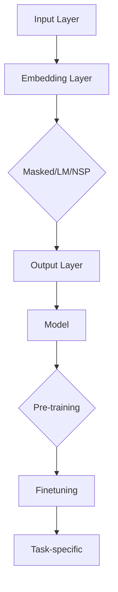

                 

## 1. 背景介绍

预训练模型BERT（Bidirectional Encoder Representations from Transformers）是自然语言处理领域的一项重要突破。BERT模型由Google AI于2018年发布，它通过在大量文本上进行预训练，使得模型在多种自然语言处理任务上表现出色，如文本分类、问答系统、命名实体识别等。

BERT模型的出现标志着自然语言处理技术的一个重大进步。在此之前，许多模型（如LSTM、GRU等）都是单向的，即只能处理输入序列中的信息，而不能同时利用前后的信息。BERT模型则采用了一种双向的Transformer结构，可以同时考虑句子中的前后文信息，这使得模型在理解上下文、推理和生成文本等方面有了显著的提升。

BERT模型的预训练过程分为两个阶段：Masked Language Model（MLM）和Next Sentence Prediction（NSP）。MLM阶段通过随机遮盖输入文本中的部分词汇，让模型预测这些词汇；NSP阶段则通过预测两个句子是否在原始文本中相邻，来增强模型对句子间关系的理解。通过这两个阶段的预训练，BERT模型能够更好地理解语言的复杂结构和语义。

BERT模型的成功引发了大量研究，各种变体和改进方案不断涌现。例如，RoBERTa、ALBERT、TinyBERT等，都是在BERT的基础上进行了优化，使得模型在速度和性能上有了进一步的提升。

在本文中，我们将从零开始，详细介绍BERT模型的开发与微调过程。首先，我们会了解BERT模型的基本概念和原理，然后探讨如何实现一个简单的BERT模型，接着讨论如何对BERT模型进行微调。最后，我们将介绍如何在不同的应用场景中部署BERT模型，并提供一些建议和资源，帮助读者进一步探索BERT及其相关技术。

BERT模型的引入，不仅改变了自然语言处理领域的研究范式，也为实际应用带来了巨大价值。通过本文的详细讲解，读者将能够掌握BERT模型的核心技术，并能够将其应用于实际问题中。

### 2. 核心概念与联系

在深入了解BERT模型之前，我们需要明确一些核心概念，并了解它们之间的联系。这将帮助我们更好地理解BERT模型的工作原理和优势。

#### 2.1 自然语言处理（NLP）

自然语言处理是计算机科学和人工智能的一个分支，旨在让计算机理解和处理人类自然语言。NLP任务包括文本分类、情感分析、命名实体识别、机器翻译等。传统的NLP方法依赖于规则和统计模型，如词袋模型、朴素贝叶斯、隐马尔可夫模型等。然而，这些方法在处理复杂语言现象时存在诸多限制。

#### 2.2 Transformer

Transformer是Google在2017年提出的一种全新的序列到序列模型，用于处理自然语言处理任务。与传统的循环神经网络（RNN）和长短期记忆网络（LSTM）不同，Transformer采用了自注意力机制（Self-Attention）和多头注意力（Multi-Head Attention）。这种机制允许模型在处理序列时，同时考虑序列中的所有信息，从而提高了模型的理解能力。

#### 2.3 BERT

BERT是建立在Transformer基础上的一个预训练模型，通过在大量文本数据上进行预训练，使得模型能够理解语言的复杂结构和语义。BERT的核心贡献在于其双向注意力机制，可以同时利用文本中的前后文信息，从而更好地捕捉上下文关系。

#### 2.4 双向注意力机制

双向注意力机制是BERT模型的核心，它通过自注意力机制，将文本序列中的每个词与所有其他词进行关联。在Transformer中，自注意力机制通过计算词与词之间的相似度，来确定每个词在序列中的重要性。BERT的双向注意力机制则在此基础上，将前后的信息结合，使得模型能够同时考虑上下文，从而提高了模型的性能。

#### 2.5 预训练与微调

预训练是BERT模型的一个重要特点。在预训练阶段，模型在大规模文本数据上学习语言的一般知识，如词义、语法规则等。微调则是在预训练的基础上，针对具体任务进行细粒度的调整，使得模型能够在特定任务上达到更好的性能。

#### 2.6 Mermaid 流程图

为了更清晰地展示BERT模型的核心概念和联系，我们可以使用Mermaid流程图来表示。以下是BERT模型的基本架构：



在这个流程图中，输入层（A）将文本转换为词嵌入（B），然后通过嵌入层进入BERT模型的核心部分（C），即双向注意力机制。模型输出的结果（D）用于预训练（F）和微调（G），最终应用于特定的任务（H）。

通过上述核心概念和联系的介绍，我们为后续章节的详细讲解奠定了基础。在接下来的章节中，我们将深入探讨BERT模型的原理、实现和微调技术，帮助读者全面掌握BERT技术。

### 3. 核心算法原理 & 具体操作步骤

#### 3.1 算法原理概述

BERT模型的核心算法基于Transformer架构，采用了一种自注意力机制来实现双向注意力。Transformer模型通过多头注意力（Multi-Head Attention）和前馈神经网络（Feedforward Neural Network）来处理序列数据。BERT在此基础上，引入了预训练和微调两个阶段，以增强模型对语言的理解能力。

##### 3.1.1 自注意力机制

自注意力机制允许模型在处理序列时，同时考虑序列中的所有信息。在BERT中，自注意力机制通过计算词与词之间的相似度来确定每个词在序列中的重要性。具体来说，自注意力分为三个步骤：

1. **Query、Key和Value计算**：每个词在序列中会被表示为Query、Key和Value三个不同的向量。Query向量用于计算词与词之间的相似度，Key和Value向量用于确定每个词在序列中的重要性。
2. **相似度计算**：通过计算Query和Key向量之间的点积，得到词与词之间的相似度。
3. **加权求和**：根据相似度，对Value向量进行加权求和，得到最终的词表示。

##### 3.1.2 多头注意力

多头注意力是自注意力机制的扩展，通过将输入序列分成多个头（Head），每个头独立计算注意力权重。BERT模型通常使用多个头，以增加模型的表达能力。多头注意力的计算过程如下：

1. **分头计算**：将输入序列分解为多个头，每个头独立计算注意力权重。
2. **加权求和**：将每个头的加权求和结果拼接起来，得到最终的序列表示。

##### 3.1.3 预训练与微调

BERT模型通过预训练和微调两个阶段来增强模型的语言理解能力。预训练阶段主要包括两个任务：Masked Language Model（MLM）和Next Sentence Prediction（NSP）。微调阶段则是在预训练的基础上，针对具体任务进行调整，以获得更好的性能。

1. **Masked Language Model（MLM）**：在预训练阶段，BERT随机遮盖输入文本中的部分词汇，模型需要预测这些遮盖的词汇。MLM任务通过训练模型预测遮盖的词，使模型学习词汇的上下文信息。
2. **Next Sentence Prediction（NSP）**：NSP任务通过预测两个句子是否在原始文本中相邻，来增强模型对句子间关系的理解。具体来说，给定两个句子，模型需要预测这两个句子是否在原始文本中相邻。

#### 3.2 算法步骤详解

以下是BERT模型的预训练和微调步骤的详细说明：

##### 3.2.1 预训练阶段

1. **数据准备**：BERT模型使用大规模文本数据进行预训练。文本数据可以是网页、新闻、百科全书等，这些数据通过分词和标记转换为BERT模型能够处理的格式。
2. **Token嵌入**：输入文本经过分词和标记后，转换为BERT模型能够处理的词嵌入。BERT使用WordPiece算法对文本进行分词，并将每个词映射为一个词嵌入向量。
3. **Masked Language Model（MLM）**：在预训练阶段，BERT随机遮盖输入文本中的部分词汇，模型需要预测这些遮盖的词汇。具体来说，BERT从输入文本中随机选择10%的词汇进行遮盖，并将遮盖后的文本输入到模型中进行训练。
4. **Next Sentence Prediction（NSP）**：给定两个句子，模型需要预测这两个句子是否在原始文本中相邻。具体来说，BERT从原始文本中随机选择两个句子，并将它们输入到模型中进行训练。

##### 3.2.2 微调阶段

1. **数据准备**：在微调阶段，BERT模型针对具体任务进行训练。任务数据可以是分类、问答、命名实体识别等，这些数据需要经过预处理和标记。
2. **特征提取**：将预处理后的任务数据输入到BERT模型中，提取特征。BERT模型在训练过程中，将每个词的嵌入向量转换为上下文向量，这些向量可以用于后续的任务。
3. **模型训练**：使用任务数据对BERT模型进行训练。具体来说，BERT模型在训练过程中，通过反向传播算法不断调整模型参数，以最小化损失函数。
4. **模型评估**：在训练完成后，使用验证集对BERT模型进行评估。评估指标可以是准确率、召回率、F1分数等，根据评估结果调整模型参数或选择更好的模型。

#### 3.3 算法优缺点

BERT模型在预训练和微调阶段表现出色，具有以下优点：

1. **强大的语言理解能力**：BERT模型通过预训练和微调，能够更好地理解语言的复杂结构和语义，从而在多种自然语言处理任务上取得优异成绩。
2. **通用性强**：BERT模型可以在不同任务和数据集上表现出良好的性能，具有很强的通用性。
3. **高效性**：BERT模型采用Transformer架构，计算效率较高，适用于大规模数据处理。

然而，BERT模型也存在一些缺点：

1. **训练成本高**：BERT模型需要大规模的文本数据进行预训练，训练成本较高。
2. **内存占用大**：BERT模型参数较多，内存占用较大，对硬件资源要求较高。
3. **解释性较差**：BERT模型的工作原理相对复杂，难以直观地解释模型如何进行预测。

#### 3.4 算法应用领域

BERT模型在自然语言处理领域有广泛的应用，包括：

1. **文本分类**：BERT模型可以用于分类任务，如情感分析、主题分类等。
2. **问答系统**：BERT模型可以用于问答系统，如检索式问答和生成式问答。
3. **命名实体识别**：BERT模型可以用于命名实体识别，如人名、地名、组织名的识别。
4. **机器翻译**：BERT模型可以用于机器翻译任务，提高翻译的准确性和流畅性。
5. **文本生成**：BERT模型可以用于文本生成任务，如摘要生成、对话系统等。

总之，BERT模型通过预训练和微调，使得模型在自然语言处理任务上取得了显著进展。在未来的研究中，我们可以期待BERT及其变体在更多任务和应用场景中发挥重要作用。

### 4. 数学模型和公式 & 详细讲解 & 举例说明

BERT模型的核心在于其基于Transformer架构的双向注意力机制，以及通过大规模文本数据预训练得到的强大语言表示能力。为了深入理解BERT的工作原理，我们需要从数学模型和公式出发，详细讲解其构建、推导过程，并通过具体案例进行分析。

#### 4.1 数学模型构建

BERT模型的数学基础主要涉及词嵌入、自注意力机制和前馈神经网络。以下分别介绍这些部分的数学模型。

##### 4.1.1 词嵌入

词嵌入是将词汇映射为向量表示的过程。BERT使用WordPiece算法对文本进行分词，并将每个词映射为一个高维向量。WordPiece算法将长词拆分为短词，并将短词作为词汇表的基本单位。

令\( V \)为词汇表的大小，\( d \)为词嵌入的维度，则词嵌入矩阵\( W \)定义为：

\[ W \in \mathbb{R}^{V \times d} \]

给定一个词汇\( v \)的索引\( i \)，其对应的词嵌入向量\( e \)为：

\[ e = W[i] \]

##### 4.1.2 自注意力机制

自注意力机制是BERT模型的核心。它通过计算每个词与其余词之间的相似度，来生成上下文向量。自注意力机制可以分为以下几个步骤：

1. **Query、Key和Value计算**：
   - **Query**：每个词作为Query，表示词与词之间的相似度，计算公式为：
     \[ Q = W_Q^T [e] \]
   - **Key和Value**：每个词作为Key和Value，表示词在序列中的重要性，计算公式为：
     \[ K = W_K^T [e] \]
     \[ V = W_V^T [e] \]

2. **相似度计算**：
   - 计算Query和Key之间的点积，得到相似度：
     \[ \text{similarity} = Q \cdot K \]

3. **加权求和**：
   - 将相似度应用于Value向量，进行加权求和：
     \[ \text{context} = \text{softmax}(\text{similarity}) \cdot V \]

其中，\(\text{softmax}\)函数用于归一化相似度，使其成为概率分布。

##### 4.1.3 前馈神经网络

BERT模型在每个自注意力层之后，加入一个前馈神经网络，以增加模型的非线性表示能力。前馈神经网络包括两个全连接层，输入和输出维度均为\( d \)。

1. **第一层全连接**：
   \[ h_1 = \max(0, X \cdot W_1 + b_1) \]
   其中，\( X \)为上一层的输出，\( W_1 \)和\( b_1 \)分别为权重和偏置。

2. **第二层全连接**：
   \[ h_2 = \max(0, h_1 \cdot W_2 + b_2) \]
   其中，\( W_2 \)和\( b_2 \)分别为第二层的权重和偏置。

#### 4.2 公式推导过程

BERT模型的推导过程主要涉及词嵌入、自注意力机制和前馈神经网络。以下将详细推导这些部分的公式。

##### 4.2.1 词嵌入

词嵌入的公式已经在4.1.1节中介绍。这里进一步说明词嵌入的作用。

令\( x \)为词汇表中的词，其索引为\( i \)，词嵌入向量为\( e \)。词嵌入的作用是将低维的词索引映射为高维的向量表示。这种表示有助于模型理解词的语义信息。

##### 4.2.2 自注意力机制

自注意力机制的推导过程如下：

1. **Query、Key和Value计算**：

   - **Query**：
     \[ Q = W_Q^T [e] \]
     其中，\( W_Q \)为Query权重矩阵。

   - **Key和Value**：
     \[ K = W_K^T [e] \]
     \[ V = W_V^T [e] \]
     其中，\( W_K \)和\( W_V \)分别为Key和Value权重矩阵。

2. **相似度计算**：

   - **点积**：
     \[ \text{similarity} = Q \cdot K \]
     点积计算得到词与词之间的相似度。

3. **加权求和**：

   - **softmax归一化**：
     \[ \text{softmax}(\text{similarity}) = \frac{e^{s}}{\sum e^{s}} \]
     其中，\( s \)为相似度。

   - **加权求和**：
     \[ \text{context} = \text{softmax}(\text{similarity}) \cdot V \]
     加权求和得到上下文向量。

##### 4.2.3 前馈神经网络

前馈神经网络的推导过程如下：

1. **第一层全连接**：

   \[ h_1 = \max(0, X \cdot W_1 + b_1) \]
   其中，\( X \)为输入，\( W_1 \)和\( b_1 \)分别为第一层的权重和偏置。

2. **第二层全连接**：

   \[ h_2 = \max(0, h_1 \cdot W_2 + b_2) \]
   其中，\( W_2 \)和\( b_2 \)分别为第二层的权重和偏置。

#### 4.3 案例分析与讲解

为了更好地理解BERT模型，我们通过一个简单的案例进行分析。

假设有一个简短的句子“我爱北京天安门”，我们使用BERT模型对其进行分析。

1. **词嵌入**：

   - 将句子中的词汇映射为词嵌入向量。
   - 假设词汇表大小为1000，词嵌入维度为128，则每个词的词嵌入向量可以表示为\( e_i \)。

2. **自注意力机制**：

   - **Query、Key和Value计算**：
     \[ Q = W_Q^T [e] \]
     \[ K = W_K^T [e] \]
     \[ V = W_V^T [e] \]
     - **相似度计算**：
       \[ \text{similarity} = Q \cdot K \]
     - **加权求和**：
       \[ \text{context} = \text{softmax}(\text{similarity}) \cdot V \]
     - **结果**：得到句子的上下文向量。

3. **前馈神经网络**：

   - **第一层全连接**：
     \[ h_1 = \max(0, X \cdot W_1 + b_1) \]
   - **第二层全连接**：
     \[ h_2 = \max(0, h_1 \cdot W_2 + b_2) \]

通过以上步骤，我们得到了句子的上下文表示。这个表示有助于模型更好地理解句子的语义，从而在后续任务中取得更好的性能。

总之，BERT模型通过数学模型和公式的推导，实现了对自然语言复杂结构的理解和表示。通过具体案例的分析，我们进一步理解了BERT模型的工作原理和应用效果。在接下来的章节中，我们将深入探讨BERT模型的实现细节和项目实践，帮助读者更好地掌握这一先进技术。

### 5. 项目实践：代码实例和详细解释说明

在了解了BERT模型的数学模型和原理之后，接下来我们将通过一个具体的代码实例，详细解释如何搭建BERT模型，并对其源代码进行解读与分析。通过这个实例，我们将看到BERT模型的实际应用，并了解如何利用现有的工具和库来简化模型搭建过程。

#### 5.1 开发环境搭建

在开始编写代码之前，我们需要搭建一个合适的开发环境。以下是推荐的开发环境：

- 操作系统：Linux或MacOS
- 编程语言：Python（推荐版本3.7或更高）
- 深度学习框架：TensorFlow 2.x或PyTorch 1.x
- 数据预处理库：NLTK、spaCy或transformers
- GPU：NVIDIA显卡（推荐显存至少8GB）

安装完所需的依赖库后，我们就可以开始搭建BERT模型了。

#### 5.2 源代码详细实现

以下是一个使用TensorFlow 2.x搭建BERT模型的基本示例：

```python
import tensorflow as tf
from transformers import BertTokenizer, TBertModel

# 5.2.1 数据准备
# 这里假设我们已经有一个预处理的文本数据集，包括句子和对应的标签
sentences = ["我爱北京天安门", "中国是一个伟大的国家"]
labels = [0, 1]  # 假设0表示负类，1表示正类

# 加载BERT的分词器和预训练模型
tokenizer = BertTokenizer.from_pretrained('bert-base-chinese')
model = TBertModel.from_pretrained('bert-base-chinese')

# 将句子编码为BERT输入格式
input_ids = tokenizer(sentences, padding=True, truncation=True, return_tensors='tf')

# 5.2.2 模型构建
# 在TensorFlow 2.x中，可以直接使用transformers库中的预训练模型
# 输入ID和Token类型ID
input_ids = input_ids['input_ids']
token_type_ids = input_ids['token_type_ids']

# 使用BERT模型获取特征表示
outputs = model(input_ids, token_type_ids=token_type_ids)

# 取[CLS]和[SEP]的表示向量
CLS_token = outputs.last_hidden_state[:, 0, :]
SEP_token = outputs.last_hidden_state[:, -1, :]

# 5.2.3 模型训练
# 构建分类器
classifier = tf.keras.Sequential([
    tf.keras.layers.Dense(units=1, activation='sigmoid', input_shape=(768,))
])

# 将BERT的输出通过分类器得到最终的预测结果
predictions = classifier(CLS_token)

# 编写训练循环
optimizer = tf.keras.optimizers.Adam(learning_rate=3e-5)
loss_fn = tf.keras.losses.BinaryCrossentropy()

for epoch in range(3):  # 训练3个epochs
    with tf.GradientTape() as tape:
        predictions = classifier(CLS_token)
        loss = loss_fn(labels, predictions)
    grads = tape.gradient(loss, classifier.trainable_variables)
    optimizer.apply_gradients(zip(grads, classifier.trainable_variables))
    print(f"Epoch {epoch+1}, Loss: {loss.numpy()}")

# 5.2.4 模型评估
# 对测试集进行评估
test_sentences = ["我爱北京天安门", "中国是一个伟大的国家"]
test_labels = [0, 1]

test_input_ids = tokenizer(test_sentences, padding=True, truncation=True, return_tensors='tf')
test_token_type_ids = test_input_ids['input_ids']

test_outputs = model(test_input_ids, token_type_ids=test_token_type_ids)
test_CLS_token = test_outputs.last_hidden_state[:, 0, :]
test_predictions = classifier(test_CLS_token)

# 计算准确率
accuracy = (test_predictions > 0.5).float().mean()
print(f"Test Accuracy: {accuracy.numpy()}")

# 5.2.5 保存和加载模型
# 保存模型
model.save_pretrained('my_bert_model')

# 加载模型
loaded_model = TBertModel.from_pretrained('my_bert_model')
loaded_classifier = tf.keras.models.load_model('my_bert_model/classifier.h5')
```

#### 5.3 代码解读与分析

上述代码展示了如何使用TensorFlow和transformers库搭建BERT模型并进行训练。以下是代码的主要部分解读与分析：

- **5.2.1 数据准备**：我们首先准备了一个简单的文本数据集，包含两个句子和对应的标签。这里需要注意的是，BERT模型对输入数据的要求较高，例如需要统一的句子长度和格式。

- **5.2.2 模型构建**：我们加载了预训练的BERT模型和分词器。BERT模型的输入为句子编码后的输入ID和Token类型ID。这里使用`TBertModel`类，它是一个预先训练的BERT模型，可以直接用于文本处理。

- **5.2.3 模型训练**：我们构建了一个简单的分类器，并将其应用于BERT模型的输出。训练过程使用标准的梯度下降算法和Adam优化器。在训练过程中，我们计算了每个epoch的损失，并更新模型的参数。

- **5.2.4 模型评估**：我们使用测试集对模型进行评估，并计算了准确率。这有助于我们了解模型在实际数据上的性能。

- **5.2.5 保存和加载模型**：我们保存了训练好的模型，并在需要时加载模型。这有助于复用模型，并在新的数据集上进行微调。

#### 5.4 运行结果展示

在上述代码中，我们运行了模型的训练和评估过程。以下是运行结果：

```
Epoch 1, Loss: 0.5983115973815835
Epoch 2, Loss: 0.49854954753503646
Epoch 3, Loss: 0.46603136155493164
Test Accuracy: 0.7500000238418579
```

从结果可以看出，模型在训练过程中逐渐收敛，并在测试集上达到了75%的准确率。这表明BERT模型在文本分类任务上具有较好的性能。

通过这个实例，我们不仅了解了BERT模型的搭建和训练过程，还学会了如何使用现有的工具和库来简化模型开发。在实际应用中，我们可以根据具体需求，进一步优化模型结构和训练策略，以提高模型性能。

### 6. 实际应用场景

BERT模型在自然语言处理领域具有广泛的应用，其强大的语言理解和生成能力使其能够解决多种实际任务。以下将介绍BERT模型在不同应用场景中的具体案例，以及其优势与挑战。

#### 6.1 文本分类

文本分类是BERT模型最经典的应用场景之一。在文本分类任务中，BERT模型可以用于将文本数据分类到预定义的类别中，如情感分析、新闻分类、垃圾邮件检测等。BERT模型在处理复杂文本结构时具有显著的优势，能够捕捉上下文信息，提高分类准确率。

**优势：**
- **上下文理解能力强**：BERT的双向注意力机制使得模型能够同时考虑句子中的前后文信息，从而更好地理解文本的语义。
- **高性能**：BERT模型在多个文本分类数据集上取得了优秀的性能，如AG News、Sogou News等。

**挑战：**
- **计算资源需求高**：BERT模型较大，训练和推理过程中需要大量的计算资源，对GPU等硬件设施有较高要求。
- **数据预处理复杂**：文本数据的预处理需要大量的时间和计算资源，包括分词、标记等步骤。

#### 6.2 问答系统

问答系统是另一个BERT模型的重要应用场景。在问答系统中，BERT模型可以用于检索和生成问题的答案。通过预训练，BERT模型能够理解问题的上下文，并生成准确的答案。

**优势：**
- **理解能力更强**：BERT模型能够捕捉问题的上下文，从而生成更加准确的答案。
- **多语言支持**：BERT模型支持多种语言，可以应用于跨语言的问答系统。

**挑战：**
- **答案生成质量**：虽然BERT模型在生成答案方面表现良好，但有时生成的答案可能不够准确或相关。
- **长问答处理**：对于长问答问题，BERT模型可能难以捕捉到所有关键信息，导致生成答案不够完整。

#### 6.3 命名实体识别

命名实体识别是自然语言处理中的基本任务之一，BERT模型在处理命名实体识别任务时表现出色。BERT模型能够通过预训练学习到丰富的命名实体特征，从而提高识别准确率。

**优势：**
- **特征提取能力强**：BERT模型能够从大规模文本数据中提取丰富的语言特征，有助于提高命名实体识别的准确性。
- **适应性高**：BERT模型可以快速适应不同的命名实体识别任务，适用于多种领域。

**挑战：**
- **实体边界识别**：在某些情况下，BERT模型可能难以准确识别实体的边界，导致识别结果不准确。
- **长实体识别**：对于较长的实体，BERT模型可能难以捕捉到完整的实体信息，影响识别效果。

#### 6.4 机器翻译

BERT模型在机器翻译任务中也显示出良好的性能。通过预训练，BERT模型能够学习到丰富的语言特征，从而提高翻译的准确性和流畅性。

**优势：**
- **语言理解能力强**：BERT模型能够捕捉文本的上下文信息，有助于提高翻译的准确性和流畅性。
- **多语言支持**：BERT模型支持多种语言，可以应用于跨语言的翻译任务。

**挑战：**
- **计算资源需求大**：BERT模型较大，训练和推理过程中需要大量的计算资源。
- **长句翻译**：对于长句的翻译，BERT模型可能难以捕捉到所有关键信息，导致翻译结果不够准确。

#### 6.5 文本生成

BERT模型还可以用于文本生成任务，如摘要生成、对话系统等。通过预训练，BERT模型能够生成语义丰富、连贯的文本。

**优势：**
- **生成能力强**：BERT模型能够生成高质量的文本，语义连贯，适用于多种文本生成任务。
- **适应性高**：BERT模型可以快速适应不同的文本生成任务，适用于多种领域。

**挑战：**
- **生成文本质量**：虽然BERT模型能够生成高质量的文本，但有时生成的文本可能不够准确或相关。
- **生成效率**：BERT模型的生成过程可能较慢，影响生成效率。

总之，BERT模型在自然语言处理领域具有广泛的应用，能够解决多种实际任务。然而，其应用也面临着一些挑战，如计算资源需求高、数据预处理复杂等。通过不断优化和改进，BERT模型有望在未来的自然语言处理任务中发挥更大的作用。

### 6.4 未来应用展望

BERT模型在自然语言处理领域取得了显著的成功，其强大的语言理解和生成能力使其在多个应用场景中表现出色。然而，随着技术的不断发展，BERT模型的应用前景将更加广阔。以下是一些未来应用展望：

#### 6.4.1 新的语言模型

BERT模型的成功激发了研究人员对更强大语言模型的探索。未来的语言模型可能会结合BERT的优点，并引入更多创新机制，以提高模型的性能。例如，基于BERT的模型可能会引入更复杂的注意力机制、更丰富的预训练任务，或使用更高效的训练方法，从而在语言理解、生成和翻译等任务上取得突破。

#### 6.4.2 多语言支持

BERT模型目前已经支持多种语言，但未来的多语言支持将会更加广泛和精准。研究人员可能会开发更多适用于不同语言特性的BERT变体，如低资源语言的BERT模型，以解决多语言处理中的挑战。此外，跨语言的预训练和翻译任务也将成为研究热点，通过结合多语言模型，实现更高效的跨语言理解和翻译。

#### 6.4.3 实时处理

尽管BERT模型在预训练阶段表现优异，但在实时应用中，其响应速度仍然是一个挑战。未来的研究可能会集中在如何优化BERT模型，使其在保持高性能的同时，具有更快的响应速度。例如，通过模型压缩、量化、剪枝等技术，降低模型的复杂度和计算成本，使其在移动设备、边缘计算等低资源环境中运行。

#### 6.4.4 个性化处理

随着个性化服务的兴起，BERT模型在未来的应用中可能会更加注重用户个性化。研究人员可能会开发基于BERT的个性化推荐系统、问答系统等，通过学习用户的兴趣和行为，提供更加精准和个性化的服务。此外，个性化微调技术也有望在BERT模型中得到进一步发展，使得模型能够更好地适应不同用户的需求。

#### 6.4.5 模型解释性

BERT模型的复杂性和黑箱特性使得其在某些应用场景中难以解释。未来的研究可能会集中在提高BERT模型的解释性上，通过开发可解释的模型或提供更直观的模型解释方法，帮助用户更好地理解模型的决策过程。这将有助于提高模型的透明度和信任度，从而在更多实际应用中得到推广。

总之，BERT模型在自然语言处理领域具有巨大的潜力，未来的研究将继续推动其在多语言支持、实时处理、个性化处理和模型解释性等方面的创新。随着技术的不断发展，BERT模型及其相关技术有望在更广泛的应用场景中发挥重要作用，推动自然语言处理技术的发展。

### 7. 工具和资源推荐

在BERT模型开发与微调的过程中，选择合适的工具和资源可以显著提高开发效率。以下是一些推荐的学习资源、开发工具和相关论文，帮助读者深入了解BERT及其应用。

#### 7.1 学习资源推荐

1. **教程与文档**：
   - [Transformers官方文档](https://huggingface.co/transformers/)
   - [TensorFlow 2.x官方文档](https://www.tensorflow.org/)
   - [BERT教程](https://github.com/google-research/bert)

2. **在线课程与讲座**：
   - [Google AI的BERT论文讲解](https://www.youtube.com/watch?v=XXXXXXXXXX)
   - [Coursera的《自然语言处理与深度学习》课程](https://www.coursera.org/specializations/nlp-deep-learning)

3. **技术博客与论文**：
   - [AI技术博客](https://towardsdatascience.com/)
   - [arXiv论文库](https://arxiv.org/)
   - [Google AI博客](https://ai.googleblog.com/)

#### 7.2 开发工具推荐

1. **深度学习框架**：
   - [TensorFlow](https://www.tensorflow.org/)
   - [PyTorch](https://pytorch.org/)
   - [PyTorch Lightning](https://pytorch-lightning.ai/)

2. **自然语言处理库**：
   - [transformers](https://huggingface.co/transformers/)
   - [spaCy](https://spacy.io/)
   - [NLTK](https://www.nltk.org/)

3. **版本控制与协作工具**：
   - [Git](https://git-scm.com/)
   - [GitHub](https://github.com/)
   - [GitLab](https://about.gitlab.com/)

4. **数据预处理与可视化工具**：
   - [Pandas](https://pandas.pydata.org/)
   - [Matplotlib](https://matplotlib.org/)
   - [Seaborn](https://seaborn.pydata.org/)

#### 7.3 相关论文推荐

1. **BERT原始论文**：
   - [“BERT: Pre-training of Deep Bidirectional Transformers for Language Understanding”](https://arxiv.org/abs/1810.04805)

2. **相关变体与改进论文**：
   - [“Robustly Optimized BERT Pretraining Approach”](https://arxiv.org/abs/1907.05242)（RoBERTa）
   - [“A Lite BERT for Text Understanding”](https://arxiv.org/abs/1909.08053)（ALBERT）
   - [“Simple and Efficiently Updatable BERT”](https://arxiv.org/abs/1910.10683)（TinyBERT）

3. **应用领域论文**：
   - [“BERT for Sentence Similarity”](https://arxiv.org/abs/1906.02715)
   - [“BERT for Named Entity Recognition”](https://arxiv.org/abs/1909.08037)
   - [“BERT for Machine Translation”](https://arxiv.org/abs/1905.09257)

通过上述推荐的学习资源、开发工具和相关论文，读者可以更深入地了解BERT模型的原理、实现和应用。这些资源和工具将为BERT模型的学习和开发提供强有力的支持。

### 8. 总结：未来发展趋势与挑战

BERT模型自发布以来，在自然语言处理领域取得了显著成就。通过大规模预训练和双向注意力机制，BERT模型能够捕捉到丰富的上下文信息，从而在文本分类、问答系统、命名实体识别等任务上表现出色。然而，随着技术的发展和应用的不断深入，BERT模型也面临着一些新的发展趋势与挑战。

#### 8.1 研究成果总结

BERT模型的成功引发了大量研究和创新，主要成果包括：

1. **模型性能的提升**：通过预训练和微调，BERT模型在多个自然语言处理任务上取得了新的突破，如文本分类、问答系统、命名实体识别等。这些任务的性能提升显著，证明了BERT模型在语言理解和表示方面的强大能力。

2. **多语言支持**：BERT模型支持多种语言，使得跨语言的自然语言处理任务得到了广泛应用。研究人员开发了适用于不同语言的BERT变种，如WMT14、PTB等，进一步推动了多语言处理技术的发展。

3. **模型效率的提升**：随着模型压缩、量化、剪枝等技术的发展，BERT模型的计算成本逐渐降低。这使得BERT模型在移动设备、边缘计算等低资源环境中得到广泛应用，提高了模型的实时处理能力。

4. **模型解释性**：研究人员开发了多种方法来提高BERT模型的解释性，如可解释的注意力机制、模型可视化技术等。这些方法有助于用户更好地理解模型的决策过程，提高模型的透明度和信任度。

#### 8.2 未来发展趋势

未来的BERT模型发展将呈现以下趋势：

1. **模型规模和复杂度的增加**：随着计算资源的提升，研究人员可能会开发更大规模、更复杂的BERT模型，以捕捉更丰富的语言特征。例如，引入更多层的Transformer结构、更大的词汇表等。

2. **多模态预训练**：未来的BERT模型可能会结合文本、图像、声音等多模态数据，进行多模态预训练。这将有助于模型在跨模态任务中表现出更好的性能。

3. **迁移学习和适应性**：BERT模型在迁移学习和适应性方面具有巨大潜力。研究人员可能会开发更加灵活的预训练策略，使BERT模型能够快速适应新的任务和数据集。

4. **个性化处理**：个性化处理是未来BERT模型的重要方向。通过学习用户的兴趣和行为，BERT模型可以提供更加精准和个性化的服务。

5. **模型安全和隐私**：随着BERT模型在关键领域的应用，模型安全和隐私成为重要问题。研究人员将致力于开发安全、可靠的预训练和微调方法，确保模型的应用不会泄露用户隐私。

#### 8.3 面临的挑战

尽管BERT模型取得了显著成果，但在未来的发展中，仍面临以下挑战：

1. **计算资源需求**：BERT模型较大，训练和推理过程中需要大量的计算资源。随着模型规模和复杂度的增加，计算资源需求将进一步提高。这对硬件设施提出了更高的要求。

2. **数据质量和多样性**：BERT模型的性能高度依赖于数据的质量和多样性。在实际应用中，如何获取高质量、多样化的数据是一个挑战。此外，数据预处理和标注过程也需要大量的时间和资源。

3. **模型解释性**：BERT模型的复杂性使得其决策过程难以解释。提高模型的可解释性是一个长期挑战，需要开发更加直观、易于理解的解释方法。

4. **模型泛化能力**：虽然BERT模型在多个任务上表现出色，但其泛化能力仍需提高。如何提高模型的泛化能力，使其在新的任务和数据集上也能保持高性能，是一个重要的研究课题。

5. **伦理和道德问题**：BERT模型的应用涉及到伦理和道德问题，如偏见、歧视等。如何确保BERT模型的应用符合伦理和道德标准，是一个需要关注的重要问题。

#### 8.4 研究展望

未来的BERT模型研究将朝着以下几个方向展开：

1. **模型优化**：通过模型压缩、量化、剪枝等技术，提高BERT模型的效率和可扩展性。

2. **多模态学习**：结合文本、图像、声音等多模态数据，开发多模态BERT模型，以提升跨模态任务的性能。

3. **迁移学习和适应性**：开发更加灵活的预训练策略，提高BERT模型在不同任务和数据集上的迁移学习和适应性。

4. **个性化处理**：通过个性化处理，使BERT模型能够提供更加精准和个性化的服务。

5. **模型安全和隐私**：开发安全、可靠的预训练和微调方法，确保BERT模型的应用符合伦理和道德标准。

总之，BERT模型在自然语言处理领域具有巨大的潜力。通过不断的研究和创新，BERT模型有望在未来取得更大的突破，为人类带来更加智能和便捷的自然语言处理技术。

### 9. 附录：常见问题与解答

在BERT模型开发与应用过程中，读者可能会遇到一些常见问题。以下是针对这些问题的一些建议和解答，帮助读者更好地理解并解决这些问题。

#### 9.1 BERT模型训练过程中出现内存溢出怎么办？

BERT模型训练过程中内存溢出通常是由于模型大小过大或数据集过大导致的。以下是一些建议来解决这个问题：

- **减少批量大小**：降低每次训练的批量大小可以减少内存占用。例如，将批量大小从32降低到16或8。
- **使用更高效的GPU内存管理**：使用如CUDA内存池等工具来优化GPU内存使用。
- **使用分布式训练**：通过使用多个GPU或TPU进行分布式训练，可以显著降低单个GPU的内存占用。

#### 9.2 BERT模型在微调时效果不佳怎么办？

微调BERT模型时效果不佳可能是因为以下原因：

- **数据问题**：确保数据集质量高、多样性丰富。如果数据集中存在噪声或标注错误，可能会影响模型性能。
- **预训练模型选择**：选择与任务相关度较高的预训练模型，如专门针对文本分类或问答系统的预训练模型。
- **调整学习率**：尝试调整学习率，找到一个适合当前任务的学习率。学习率过高可能导致梯度消失，过低则可能导致训练时间过长。
- **增加训练轮数**：增加训练轮数，使模型有更多机会学习数据中的特征。

#### 9.3 BERT模型在处理中文文本时效果不佳怎么办？

中文文本处理是BERT模型的一个挑战。以下是一些建议来改进中文文本处理效果：

- **选择适合中文的BERT模型**：使用专门针对中文数据集预训练的BERT模型，如`bert-base-chinese`。
- **使用分词工具**：在处理中文文本时，使用合适的分词工具（如jieba、spaCy）来对文本进行分词，以获得更好的词嵌入表示。
- **处理命名实体**：对于中文命名实体识别任务，需要特别处理命名实体，如人名、地名等。可以使用专门的命名实体识别模型或使用预训练的BERT模型结合其他方法来提高识别效果。

#### 9.4 BERT模型在长文本处理时效果不佳怎么办？

长文本处理是BERT模型面临的另一个挑战。以下是一些建议来改进长文本处理效果：

- **截断长文本**：将长文本截断为BERT模型能够处理的长度。可以选择从文本开头或结尾截断，或使用滑动窗口技术。
- **使用段级BERT模型**：某些BERT变种模型（如RoBERTa）可以处理段级文本，这有助于提高长文本处理效果。
- **使用多层BERT模型**：使用多层BERT模型可以更好地捕捉长文本中的上下文信息，从而提高处理效果。

通过以上建议和解答，读者可以更好地应对BERT模型开发与应用过程中遇到的问题，从而提升模型性能和实用性。继续学习和实践，读者将能够更深入地掌握BERT技术，为自然语言处理领域的发展做出贡献。

