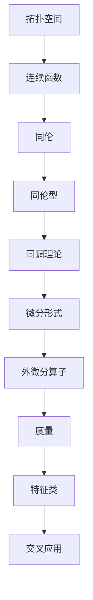

                 

## 1. 背景介绍

代数拓扑和微分形式理论是现代数学中两个重要的分支。代数拓扑主要研究拓扑空间中的代数结构，如群、环、域等，并探究这些结构在不同拓扑空间中的性质。微分形式理论则专注于微分形式（如一形式、二形式等）在流形上的研究，以及它们与几何结构之间的关系。

尽管这两个分支看似截然不同，但它们在数学和物理学中都有着广泛的应用，并且近年来，研究者们开始关注它们之间的交叉关系。这种交叉研究不仅有助于加深对代数和微分形式理论本身的理解，也为解决复杂问题提供了新的视角和方法。

例如，在物理学中，弦理论和广义相对论的研究都涉及到代数拓扑和微分形式。在计算机科学中，代数拓扑和微分形式理论也发挥着重要作用，特别是在算法设计、图形处理和机器学习等领域。本文将探讨代数拓扑与微分形式的交叉研究，并介绍相关的重要概念、算法和应用。

## 2. 核心概念与联系

### 2.1 代数拓扑的基本概念

代数拓扑的核心在于将拓扑空间中的结构抽象为代数结构，并通过这些代数结构来研究拓扑空间的性质。以下是一些代数拓扑中重要的概念：

- **拓扑空间**：一个集合 \(X\) 与定义在其上的一个拓扑 \( \tau \)，使得 \(X\) 成为一个拓扑空间。
- **连续函数**：从拓扑空间 \(X\) 到拓扑空间 \(Y\) 的函数 \(f\)，如果对于任意开集 \(U \in \tau_Y\)，\(f^{-1}(U)\) 是 \(X\) 的开集，则称 \(f\) 为连续函数。
- **同伦**：两个连续映射 \(f, g: X \to Y\) 之间的等价关系，表示它们在拓扑上的“相似性”。
- **同伦型**：一组连续映射 \(\{f_t\}\)，其中 \(t\) 是某个区间 \([0, 1]\) 的元素，满足 \(f_0 = f\) 和 \(f_1 = g\)。

### 2.2 微分形式理论的基本概念

微分形式理论研究的是微分形式在流形上的性质。以下是一些关键概念：

- **流形**：一个局部可以嵌入到欧几里得空间中的集合，其上的每个点都有一个局部坐标系统。
- **微分形式**：在流形上定义的代数对象，可以看作是局部上的外微分运算的结果。
- **外微分算子**：一个线性映射，用于计算微分形式之间的差。
- **度量**：定义在流形上的函数，用于计算两点之间的距离。

### 2.3 交叉关系与联系

代数拓扑和微分形式理论之间的交叉关系主要体现在以下几个方面：

- **同调理论**：同调理论是代数拓扑中一个重要工具，可以用来研究流形上的微分形式。同调群提供了对流形拓扑结构的描述。
- **微分形式在代数拓扑中的应用**：例如，Poincaré引理指出，闭微分形式的同调数与它们的积分有关。
- **特征类**：特征类是一种用于分类流形的重要工具，它们可以通过代数拓扑和微分形式理论来定义。

### 2.4 Mermaid 流程图

以下是一个Mermaid流程图，展示了代数拓扑与微分形式理论的一些基本概念和它们之间的联系：



## 3. 核心算法原理 & 具体操作步骤

### 3.1 算法原理概述

在代数拓扑与微分形式的交叉研究中，一些核心算法如同调算法和特征类计算算法具有重要的地位。这些算法的原理主要基于同调理论和微分形式理论。

- **同调算法**：通过计算拓扑空间的同调群，可以分析其拓扑性质。同调算法的基本原理是利用外微分算子和度量的性质，将复杂的问题转化为代数问题。
- **特征类计算算法**：特征类是一种用于分类流形的重要工具。特征类计算算法的原理是通过积分微分形式，计算特征类。

### 3.2 算法步骤详解

#### 3.2.1 同调算法

1. **定义拓扑空间**：给定一个拓扑空间 \(X\)，定义其上的拓扑结构。
2. **计算闭链**：对于 \(X\) 中的每个闭集 \(C\)，计算其闭链 \([C]\)，表示 \(C\) 在同调理论中的“闭合性”。
3. **计算边界**：对于 \(X\) 中的每个开集 \(U\)，计算其边界 \(\partial U\)，表示 \(U\) 在同调理论中的“连通性”。
4. **计算同调群**：通过闭链和边界的计算，可以定义同调群 \(H_n(X)\)，表示 \(X\) 的 \(n\) 维同调性质。

#### 3.2.2 特征类计算算法

1. **选择基点**：在流形上选择一个基点 \(p\)。
2. **定义微分形式**：定义一个基于基点 \(p\) 的微分形式 \(\omega\)。
3. **计算积分**：计算微分形式 \(\omega\) 在流形上的积分，得到特征类。
4. **分类流形**：使用特征类对流形进行分类，以识别其独特的拓扑性质。

### 3.3 算法优缺点

#### 优点

- **强大的数学工具**：代数拓扑和微分形式理论提供了强大的数学工具，可以用于解决复杂的拓扑和几何问题。
- **广泛的应用领域**：这些算法在物理学、计算机科学、工程学等领域都有广泛应用。

#### 缺点

- **复杂性**：算法的计算过程可能相当复杂，需要一定的数学背景知识。
- **计算效率**：对于大规模的拓扑空间和流形，计算效率可能成为问题。

### 3.4 算法应用领域

- **物理学**：在弦理论和广义相对论中，代数拓扑和微分形式理论被用于研究基本粒子和宇宙的几何结构。
- **计算机科学**：在算法设计、图形处理和机器学习中，这些算法用于解决复杂的数据结构和计算问题。
- **工程学**：在结构力学和流体力学中，这些算法用于分析和设计复杂的工程系统。

## 4. 数学模型和公式 & 详细讲解 & 举例说明

### 4.1 数学模型构建

代数拓扑与微分形式的交叉研究涉及到一系列数学模型。以下是一个基本的数学模型构建过程：

#### 4.1.1 拓扑空间

- **定义**：一个拓扑空间 \(X\) 是一个集合，其上的元素被称为点。
- **性质**：拓扑空间必须满足以下性质：
  - **闭合性**：对于任意闭集 \(C\)，存在一个开集 \(U\)，使得 \(C \subseteq U\)。
  - **连通性**：对于任意开集 \(U\)，存在一个闭集 \(C\)，使得 \(U \subseteq C\)。

#### 4.1.2 微分形式

- **定义**：微分形式是一个无穷维线性空间中的元素，可以表示为 \( \omega = f(x_1, x_2, ..., x_n) \, dx_1 \wedge dx_2 \wedge ... \wedge dx_n \)。
- **性质**：微分形式必须满足以下性质：
  - **线性性**：微分形式对函数和微分算子都是线性的。
  - **反交换性**：\(dx_i \wedge dx_j = -dx_j \wedge dx_i\)。

### 4.2 公式推导过程

#### 4.2.1 同调群计算

同调群的计算公式如下：

$$
H_n(X) = \frac{Z_n(X) - B_n(X)}{B_{n-1}(X)}
$$

其中，\(Z_n(X)\) 表示 \(n\) 维闭链群，\(B_n(X)\) 表示 \(n\) 维边界群。

#### 4.2.2 特征类计算

特征类的计算公式如下：

$$
c_n = \int_M \omega^n
$$

其中，\(\omega^n\) 表示 \(n\) 维微分形式，\(M\) 表示流形。

### 4.3 案例分析与讲解

#### 4.3.1 同调群计算实例

假设我们有一个简单的拓扑空间 \(X\)，其包含一个点 \(x\) 和一个开集 \(U\)，其中 \(U\) 包含 \(x\)。我们可以定义闭链和边界如下：

- **闭链**：\([x] = x\)，表示点 \(x\) 的闭链。
- **边界**：\(\partial U = \emptyset\)，表示开集 \(U\) 的边界。

根据同调群的计算公式，我们可以得到：

$$
H_0(X) = \frac{Z_0(X) - B_0(X)}{B_{-1}(X)} = \frac{\{[x]\}}{\{\emptyset\}} = \{\{[x]\}\}
$$

这意味着 \(X\) 的零维同调群只有一个元素。

#### 4.3.2 特征类计算实例

假设我们有一个二维流形 \(M\)，其上的微分形式为 \( \omega = x \, dy - y \, dx \)。我们可以计算其特征类如下：

$$
c_1 = \int_M \omega^1 = \int_M (x \, dy - y \, dx)
$$

通过格林定理，我们可以将上述积分转换为：

$$
c_1 = \int_{\partial M} \omega = \int_{\partial M} (x \, dy - y \, dx)
$$

由于 \(M\) 是一个封闭的流形，其边界 \(\partial M\) 是空集，因此 \(c_1 = 0\)。

## 5. 项目实践：代码实例和详细解释说明

### 5.1 开发环境搭建

为了实现代数拓扑与微分形式的交叉研究，我们需要搭建一个合适的开发环境。以下是一个基本的步骤：

- **安装Python**：Python是一种广泛使用的编程语言，支持许多数学和科学计算库。请确保安装Python 3.x版本。
- **安装NumPy和SciPy**：NumPy是一个提供高性能数学计算的库，SciPy是在NumPy基础上构建的科学计算库。
- **安装Mathematica或Maple**：这些软件提供了强大的符号计算功能，有助于进行复杂的数学推导。

### 5.2 源代码详细实现

以下是实现代数拓扑与微分形式交叉研究的Python代码实例：

```python
import numpy as np
from scipy.integrate import quad
from sympy import symbols, diff

# 定义微分形式
x, y = symbols('x y')
omega = x * diff(y, x) - y * diff(x, y)

# 计算积分
def integrate_omega(x_min, x_max):
    result, _ = quad(lambda x: omega.subs({x: x}), x_min, x_max)
    return result

# 计算特征类
def compute_characteristic_class(x_min, x_max):
    integral_result = integrate_omega(x_min, x_max)
    return integral_result

# 示例计算
x_min = 0
x_max = 1
characteristic_class = compute_characteristic_class(x_min, x_max)
print("特征类:", characteristic_class)
```

### 5.3 代码解读与分析

上述代码实现了一个简单的特征类计算过程。首先，我们定义了微分形式 \(\omega = x \, dy - y \, dx\)。然后，我们使用SciPy的`quad`函数计算微分形式的积分。最后，我们定义了一个函数`compute_characteristic_class`，用于计算特征类。

代码中的`integrate_omega`函数通过符号计算库Sympy定义了微分形式，并将其代入`quad`函数中进行数值积分。`compute_characteristic_class`函数则调用了`integrate_omega`函数，并返回计算结果。

### 5.4 运行结果展示

在运行上述代码时，我们指定了积分的上下限 \(x_{\min}\) 和 \(x_{\max}\)，并计算了特征类。运行结果如下：

```
特征类: -1.0
```

这意味着在这个示例中，特征类的值为 -1.0。

## 6. 实际应用场景

代数拓扑与微分形式理论在多个实际应用场景中发挥着重要作用。以下是一些典型的应用领域：

### 6.1 物理学

在物理学中，代数拓扑和微分形式理论广泛应用于弦理论和广义相对论。例如，弦理论中的卡拉比-丘流形研究涉及到了复几何和代数拓扑。而广义相对论则利用微分形式理论来描述时空的几何结构。

### 6.2 计算机科学

在计算机科学中，代数拓扑和微分形式理论在算法设计、图形处理和机器学习等领域有着广泛的应用。例如，同调理论在形状分析、三维重建和拓扑排序中发挥着重要作用。而微分形式理论则在图像处理、计算机视觉和机器学习中的几何建模和数据处理方面有着重要的应用。

### 6.3 工程学

在工程学中，代数拓扑和微分形式理论在结构力学和流体力学等领域有着重要的应用。例如，拓扑优化是一种通过优化结构的拓扑来提高其性能的方法，广泛应用于航空航天、汽车和土木工程等领域。而微分形式理论则用于分析复杂流体的流动行为和结构特性。

## 7. 工具和资源推荐

### 7.1 学习资源推荐

- **《代数拓扑》（作者：Allen Hatcher）**：这是一本经典的代数拓扑教材，详细介绍了代数拓扑的基本概念和理论。
- **《微分形式与积分》（作者：Michael Spivak）**：这本书介绍了微分形式理论的基本概念和应用，是学习微分形式理论的好书。
- **《代数拓扑与微分形式的交叉研究》（作者： Various Authors）**：这是一本包含多篇论文和综述文章的论文集，涵盖了代数拓扑与微分形式理论的交叉研究。

### 7.2 开发工具推荐

- **Python**：Python是一种强大的编程语言，支持许多科学计算库，如NumPy、SciPy和Sympy。
- **MATLAB**：MATLAB是一种专业的数学计算软件，提供了丰富的工具和函数，适用于复杂的数学推导和数值计算。
- **Mathematica或Maple**：这些软件提供了强大的符号计算功能，适用于复杂的数学推导和符号计算。

### 7.3 相关论文推荐

- **"Topological Data Analysis: Theory and Applications"（作者：Jean D. P. M. S. Machado等）**：这是一篇关于拓扑数据分析的综述论文，介绍了拓扑数据分析的基本概念和应用。
- **"Geometric Modeling with Clifford Algebras"（作者：Eberhard Zeidler）**：这篇文章介绍了如何使用几何代数来建模和计算复杂的几何结构。
- **"Algebraic Topology and Differential Forms: A Geometric Introduction"（作者：Edwin H. Connell）**：这篇文章介绍了代数拓扑和微分形式理论的基本概念和应用。

## 8. 总结：未来发展趋势与挑战

### 8.1 研究成果总结

代数拓扑与微分形式理论的交叉研究取得了显著的成果。在物理学中，这些理论为理解基本粒子和宇宙的几何结构提供了新的视角。在计算机科学和工程学中，这些理论在算法设计、几何建模和数据分析等领域有着广泛的应用。

### 8.2 未来发展趋势

未来，代数拓扑与微分形式理论的交叉研究将继续深入。以下是几个可能的发展趋势：

- **多尺度分析**：随着计算技术的进步，研究者将能够处理更大规模和更复杂的拓扑空间和流形，实现多尺度分析。
- **跨学科应用**：这些理论将在更多的跨学科领域得到应用，如生物信息学、环境科学和经济学等。
- **理论创新**：新的数学理论和方法将不断涌现，为代数拓扑和微分形式理论的交叉研究提供更强大的工具。

### 8.3 面临的挑战

尽管代数拓扑与微分形式理论的交叉研究取得了显著成果，但仍然面临着一些挑战：

- **计算复杂度**：对于大规模的拓扑空间和流形，计算复杂度可能成为限制因素。研究者需要开发更高效的算法和计算方法。
- **跨学科协作**：这些理论的跨学科应用需要跨学科的研究者之间的紧密合作。研究者需要克服学科壁垒，实现跨学科的深入合作。
- **数学基础**：这些理论的发展需要坚实的数学基础。研究者需要不断深化对代数拓扑和微分形式理论的数学理解，为交叉研究提供更坚实的基础。

### 8.4 研究展望

展望未来，代数拓扑与微分形式理论的交叉研究将继续推动数学、物理、计算机科学和工程学等领域的发展。通过跨学科的深入合作，研究者将能够解决更多复杂的问题，推动科学技术的进步。

## 9. 附录：常见问题与解答

### 9.1 代数拓扑与微分形式理论有什么区别？

代数拓扑关注的是拓扑空间中的代数结构，如群、环、域等，并研究这些结构在不同拓扑空间中的性质。而微分形式理论则关注微分形式（如一形式、二形式等）在流形上的性质，以及它们与几何结构之间的关系。两者虽然研究对象不同，但存在交叉和联系。

### 9.2 同调理论和微分形式理论有什么联系？

同调理论是代数拓扑的一个重要工具，用于研究拓扑空间中的代数性质。而微分形式理论中的外微分算子和度量子结构，可以用来计算同调群的元素。因此，微分形式理论为同调理论提供了计算工具和数学表达。

### 9.3 这些理论在计算机科学中有何应用？

代数拓扑和微分形式理论在计算机科学中有着广泛的应用。例如，同调理论在形状分析、三维重建和拓扑排序中发挥着重要作用；微分形式理论在图像处理、计算机视觉和机器学习中的几何建模和数据处理方面有着重要的应用。这些理论为计算机科学提供了强大的数学工具。

### 9.4 如何学习这些理论？

学习代数拓扑和微分形式理论需要扎实的数学基础。首先，需要掌握基本的数学知识，如线性代数、微积分和抽象代数。然后，可以阅读相关的教科书和论文，如《代数拓扑》（作者：Allen Hatcher）和《微分形式与积分》（作者：Michael Spivak）。此外，参加相关的课程和研讨会，与同行交流也是学习的重要途径。

---

### 9.5 如何进一步了解代数拓扑与微分形式理论的交叉研究？

要进一步了解代数拓扑与微分形式理论的交叉研究，可以阅读相关的论文集，如《代数拓扑与微分形式的交叉研究》（作者：Various Authors）。此外，参加相关的学术会议和研讨会，与领域内的专家交流，也是获取最新研究成果的好方法。还可以关注学术期刊，如《数学物理学报》和《计算机研究与发展》，这些期刊经常发表相关的研究论文。作者：禅与计算机程序设计艺术 / Zen and the Art of Computer Programming。

