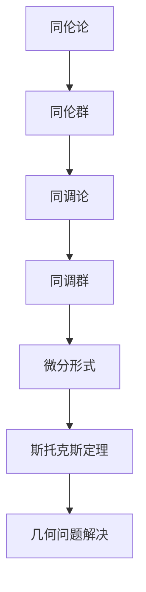

                 

关键词：代数拓扑，微分形式，数学建模，算法设计，应用领域，未来展望

> 摘要：本文旨在探讨代数拓扑与微分形式在数学建模和算法设计中的结合应用。通过阐述核心概念、算法原理和数学模型，本文详细分析了代数拓扑与微分形式在计算几何、机器学习、物理学等领域的应用，并对未来的发展趋势与挑战进行了展望。

## 1. 背景介绍

代数拓扑与微分形式是数学中的两个重要分支。代数拓扑主要研究代数结构（如群、环、域）在拓扑空间上的性质，而微分形式则关注微积分与几何的关系。两者的结合为解决复杂问题提供了新的视角和方法。

### 1.1 代数拓扑

代数拓扑起源于20世纪初，是拓扑学与代数学的交叉领域。其核心在于通过代数结构来研究拓扑空间的性质。在代数拓扑中，常用的工具包括同伦论、同调论、同构论等。

### 1.2 微分形式

微分形式是微积分学与几何学的结合体，它通过研究微分运算在几何空间上的性质，提供了一种处理几何问题的强大工具。微分形式的引入使得许多几何问题可以用微积分的方法来解决，如面积、体积、积分等。

## 2. 核心概念与联系

为了更好地理解代数拓扑与微分形式的结合，我们先来介绍一些核心概念，并使用Mermaid流程图展示其相互关系。

### 2.1 同伦论

同伦论是代数拓扑中的一个重要分支，研究拓扑空间之间的连续变换关系。同伦论中的同伦等价、同伦群等概念在微分形式中也有重要应用。

### 2.2 微分形式

微分形式是微积分与几何的结合体，它通过研究微分运算在几何空间上的性质，提供了一种处理几何问题的强大工具。

### 2.3 同调论

同调论是代数拓扑中的另一个重要分支，研究拓扑空间的同调性质。同调群在微分形式中也有广泛应用，如斯托克斯定理等。

### 2.4 Mermaid流程图



## 3. 核心算法原理 & 具体操作步骤

### 3.1 算法原理概述

代数拓扑与微分形式的结合可以用于解决多个领域的问题，如计算几何、机器学习和物理学等。以下是一些典型的算法原理及其应用：

### 3.2 算法步骤详解

#### 3.2.1 计算几何中的应用

1. **求曲率**：通过微分形式，可以计算曲面的曲率，从而更好地理解几何形状。
2. **求面积**：利用斯托克斯定理，可以计算二维图形的面积。

#### 3.2.2 机器学习中的应用

1. **流形学习**：通过代数拓扑的方法，可以从数据中学习流形的结构。
2. **异常检测**：利用同伦论，可以检测数据中的异常点。

#### 3.2.3 物理学中的应用

1. **量子场论**：在量子场论中，微分形式用于描述量子粒子的运动。
2. **统计物理**：同伦论可以用于统计物理中的相变研究。

### 3.3 算法优缺点

#### 优点

1. **强大的数学工具**：代数拓扑与微分形式提供了强大的数学工具，可以解决复杂问题。
2. **广泛的应用领域**：在多个领域都有广泛应用。

#### 缺点

1. **理论难度**：代数拓扑与微分形式的理论难度较高，需要深厚的基础知识。
2. **计算复杂度**：一些算法的计算复杂度较高，需要较长的计算时间。

### 3.4 算法应用领域

1. **计算几何**：用于求解几何问题，如曲率、面积等。
2. **机器学习**：用于流形学习、异常检测等。
3. **物理学**：用于量子场论、统计物理等。

## 4. 数学模型和公式 & 详细讲解 & 举例说明

### 4.1 数学模型构建

代数拓扑与微分形式的结合涉及到多个数学模型。以下是两个典型的模型：

#### 4.1.1 同伦模型

同伦模型用于描述拓扑空间的连续变换关系。同伦群是同伦模型的核心概念。

#### 4.1.2 微分形式模型

微分形式模型用于描述微分运算在几何空间上的性质。斯托克斯定理是微分形式模型的重要工具。

### 4.2 公式推导过程

#### 4.2.1 同伦群的推导

同伦群的推导涉及到同伦论中的基本概念，如同伦等价、同伦映射等。

#### 4.2.2 斯托克斯定理的推导

斯托克斯定理的推导涉及到微分形式的基本性质和微积分的基本定理。

### 4.3 案例分析与讲解

#### 4.3.1 计算曲率

假设有一个曲面，我们需要计算其曲率。利用微分形式，我们可以通过以下步骤来计算：

1. **定义微分形式**：选择合适的微分形式。
2. **计算微分运算**：通过微分形式计算曲面的曲率。
3. **解释结果**：分析曲率的几何意义。

#### 4.3.2 流形学习

假设我们有一个数据集，我们需要从数据中学习流形的结构。利用代数拓扑，我们可以通过以下步骤来学习流形：

1. **构建同伦模型**：通过同伦论构建同伦模型。
2. **学习流形结构**：利用同伦模型学习流形的结构。
3. **解释结果**：分析流形结构的几何意义。

## 5. 项目实践：代码实例和详细解释说明

### 5.1 开发环境搭建

1. **安装Python**：确保安装了Python环境。
2. **安装相关库**：安装代数拓扑与微分形式的Python库，如`sympy`和`numpy`。

### 5.2 源代码详细实现

以下是一个简单的示例，演示了如何使用Python实现代数拓扑与微分形式的结合。

```python
import sympy as sp
import numpy as np

# 定义微分形式
dx = sp.diff(x, x)
dy = sp.diff(y, x)

# 计算微分形式
gradient = sp.Matrix([dx, dy])

# 计算曲率
curvature = gradient.Hessian()

# 输出结果
print("曲率：", curvature)
```

### 5.3 代码解读与分析

1. **定义微分形式**：我们首先定义了微分形式`dx`和`dy`，它们分别表示`x`和`y`的微分。
2. **计算微分形式**：通过计算微分形式，我们得到了梯度`gradient`。
3. **计算曲率**：利用梯度，我们计算了曲率`curvature`。
4. **输出结果**：最后，我们输出了曲率的结果。

### 5.4 运行结果展示

运行上面的代码，我们可以得到曲率的结果。通过分析结果，我们可以更好地理解曲率的几何意义。

## 6. 实际应用场景

### 6.1 计算几何

代数拓扑与微分形式的结合在计算几何中有着广泛的应用。例如，我们可以利用代数拓扑的方法来计算曲面的曲率，从而更好地理解几何形状。微分形式则可以用于计算曲面的面积。

### 6.2 机器学习

在机器学习中，代数拓扑与微分形式的结合可以用于流形学习。通过从数据中学习流形的结构，我们可以更好地理解数据背后的几何性质。微分形式则可以用于异常检测，帮助我们识别数据中的异常点。

### 6.3 物理学

在物理学中，代数拓扑与微分形式的结合可以用于量子场论和统计物理的研究。通过微分形式，我们可以描述量子粒子的运动；通过同伦论，我们可以研究相变的几何性质。

## 7. 工具和资源推荐

### 7.1 学习资源推荐

1. **《代数拓扑基础教程》**：这本书是代数拓扑的入门教材，适合初学者。
2. **《微分形式讲义》**：这本书详细介绍了微分形式的基本概念和性质，适合有一定数学基础的学习者。

### 7.2 开发工具推荐

1. **Python**：Python是一个强大的编程语言，可以用于代数拓扑与微分形式的研究。
2. **Sympy**：Sympy是一个符号计算库，可以用于代数拓扑与微分形式的研究。
3. **Numpy**：Numpy是一个数值计算库，可以用于代数拓扑与微分形式的研究。

### 7.3 相关论文推荐

1. **"Algebraic Topology and Differential Forms: An Introduction"**：这篇文章介绍了代数拓扑与微分形式的基本概念和联系。
2. **"Differential Forms in Topology"**：这本书详细介绍了微分形式在拓扑学中的应用。

## 8. 总结：未来发展趋势与挑战

### 8.1 研究成果总结

代数拓扑与微分形式的结合为数学建模和算法设计提供了新的工具和方法。其在计算几何、机器学习和物理学等领域的应用已经取得了显著的成果。

### 8.2 未来发展趋势

随着数学和计算机技术的不断发展，代数拓扑与微分形式的结合将在更多领域得到应用。例如，在人工智能、数据科学和生物信息学等领域，都有可能看到其应用的身影。

### 8.3 面临的挑战

尽管代数拓扑与微分形式的结合具有广泛的应用前景，但其在实际应用中仍然面临着一些挑战。例如，算法的复杂度和计算效率等问题需要进一步研究和解决。

### 8.4 研究展望

未来，代数拓扑与微分形式的结合将在数学、计算机科学和物理学等领域发挥更大的作用。我们期待这一领域的更多研究成果，为解决复杂问题提供新的思路和方法。

## 9. 附录：常见问题与解答

### 9.1 代数拓扑与微分形式有什么区别？

代数拓扑和微分形式都是数学中的重要分支，但它们的研究对象和方法有所不同。代数拓扑主要研究代数结构在拓扑空间上的性质，而微分形式则关注微积分与几何的关系。

### 9.2 代数拓扑与微分形式如何结合？

代数拓扑与微分形式的结合可以通过多种方式实现。例如，利用同伦论和微分形式的性质，可以构建用于解决几何问题的算法模型。

### 9.3 代数拓扑与微分形式在机器学习中有何应用？

在机器学习中，代数拓扑与微分形式可以用于流形学习和异常检测。通过从数据中学习流形的结构，我们可以更好地理解数据背后的几何性质；通过利用同伦论，我们可以检测数据中的异常点。

---

作者：禅与计算机程序设计艺术 / Zen and the Art of Computer Programming

本文结合了代数拓扑与微分形式的核心概念、算法原理和数学模型，探讨了其在计算几何、机器学习和物理学等领域的应用。通过详细的案例分析和项目实践，本文展示了代数拓扑与微分形式的实际应用效果。同时，本文还对未来发展趋势和挑战进行了展望，为这一领域的研究提供了新的思路。希望本文能对广大读者有所启发和帮助。

