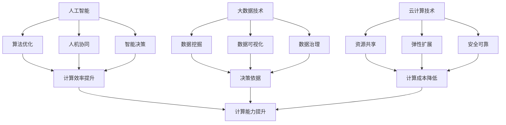

                 

关键词：以人为本、科技未来、人类计算、价值观

> 摘要：本文从以人为本的角度，探讨科技未来在人类计算中的角色和价值观。通过分析当前科技发展的趋势和挑战，本文提出了一套以人为本的科技发展原则，并展望了科技在未来人类计算中的发展趋势和面临的挑战。

## 1. 背景介绍

随着科技的快速发展，人工智能、大数据、云计算等新兴技术不断涌现，人类计算的方式和模式也在发生深刻变革。然而，在追求科技进步的过程中，我们也必须关注科技与人类之间的关系，确保科技发展能够真正服务于人类，提升人类的生活质量。以人为本的科技发展原则，正是我们在这个时代需要重新审视和确立的价值观。

## 2. 核心概念与联系

### 2.1 人工智能与人类计算

人工智能（AI）作为当前科技领域的热点，其核心目标是为人类提供更高效、更智能的计算服务。人工智能与人类计算之间的联系，主要体现在以下几个方面：

1. **算法优化**：人工智能算法通过对大量数据的分析和处理，不断优化计算模型，提高计算效率。
2. **人机协同**：人工智能与人类在计算任务中相互协作，发挥各自的优势，实现计算能力的最大化。
3. **智能决策**：人工智能通过学习人类的行为模式和决策逻辑，为人类提供智能化的决策支持。

### 2.2 大数据与人类计算

大数据技术使得人类能够从海量数据中提取有价值的信息，为决策提供有力支持。大数据与人类计算之间的联系，主要体现在以下几个方面：

1. **数据挖掘**：大数据技术通过对数据进行分析和挖掘，发现潜在规律和趋势，为人类提供决策依据。
2. **数据可视化**：大数据技术将复杂的数据转化为易于理解的可视化图表，帮助人类更好地理解数据。
3. **数据治理**：大数据技术通过对数据的清洗、整合和管理，提高数据的可靠性和可用性。

### 2.3 云计算与人类计算

云计算技术为人类提供了强大的计算能力和数据存储能力，使得人类计算变得更加便捷和高效。云计算与人类计算之间的联系，主要体现在以下几个方面：

1. **资源共享**：云计算通过虚拟化技术，实现计算资源的动态分配和高效利用，降低计算成本。
2. **弹性扩展**：云计算可以根据需求动态调整计算资源，满足人类计算的不同需求。
3. **安全可靠**：云计算通过分布式存储和备份技术，确保数据的安全和可靠性。

### 2.4 Mermaid 流程图

下面是人工智能、大数据、云计算在人类计算中的联系和作用关系的 Mermaid 流程图：



## 3. 核心算法原理 & 具体操作步骤

### 3.1 算法原理概述

本文将介绍几种在人工智能、大数据和云计算领域中广泛应用的算法原理，包括：

1. **深度学习**：深度学习是一种基于人工神经网络的机器学习算法，通过多层神经网络的学习和训练，实现自动特征提取和分类。
2. **MapReduce**：MapReduce 是一种分布式数据处理框架，通过将数据处理任务划分为多个子任务，并行执行并最终合并结果。
3. **K-Means 算法**：K-Means 算法是一种基于距离度量的聚类算法，通过迭代计算，将数据划分为 K 个簇，使得每个簇内的数据点距离簇中心最近。

### 3.2 算法步骤详解

1. **深度学习算法**

深度学习算法主要分为以下几个步骤：

- **数据预处理**：对输入数据进行归一化、去噪等处理，确保数据的质量和一致性。
- **构建神经网络**：根据任务需求，设计并构建神经网络结构，包括输入层、隐藏层和输出层。
- **初始化参数**：随机初始化神经网络中的参数，如权重和偏置。
- **前向传播**：将输入数据传递到神经网络中，通过逐层计算得到输出结果。
- **反向传播**：计算输出结果与实际结果之间的误差，通过反向传播更新神经网络中的参数。
- **迭代训练**：重复前向传播和反向传播过程，不断优化神经网络参数，提高模型性能。

2. **MapReduce 算法**

MapReduce 算法主要分为以下几个步骤：

- **划分任务**：将大数据集划分为多个小数据集，每个小数据集由一个 Mapper 处理。
- **Mapper 处理**：每个 Mapper 对分配到的数据集进行处理，输出中间结果。
- **Shuffle**：对 Mapper 输出的中间结果进行排序和分组，将相同 Key 的中间结果发送到同一个 Reducer。
- **Reducer 处理**：每个 Reducer 对分配到的中间结果进行处理，输出最终结果。

3. **K-Means 算法**

K-Means 算法主要分为以下几个步骤：

- **初始化簇中心**：随机选择 K 个数据点作为初始簇中心。
- **分配数据点**：计算每个数据点到簇中心的距离，将数据点分配到最近的簇。
- **更新簇中心**：重新计算每个簇的中心点，作为新的簇中心。
- **迭代优化**：重复分配数据点和更新簇中心的过程，直至收敛。

### 3.3 算法优缺点

1. **深度学习算法**

优点：

- **自动特征提取**：深度学习算法能够自动从数据中提取有用的特征，减少人工干预。
- **适应性强**：深度学习算法可以应用于多种类型的任务，具有广泛的适用性。

缺点：

- **计算复杂度高**：深度学习算法需要进行大量的矩阵运算，计算复杂度较高。
- **数据需求量大**：深度学习算法需要大量的训练数据，对数据质量和数量有较高要求。

2. **MapReduce 算法**

优点：

- **分布式计算**：MapReduce 算法可以将大数据集划分为多个小数据集，并行处理，提高计算效率。
- **容错性强**：MapReduce 算法具有良好的容错性，能够在部分节点失败时继续执行。

缺点：

- **依赖硬件环境**：MapReduce 算法需要依赖于分布式计算环境，对硬件设备有较高要求。
- **编程复杂度高**：MapReduce 算法的编程复杂度较高，需要编写大量的代码。

3. **K-Means 算法**

优点：

- **实现简单**：K-Means 算法的实现简单，易于理解和实现。
- **收敛速度快**：K-Means 算法的收敛速度较快，适用于处理大规模数据集。

缺点：

- **对初始聚类中心敏感**：K-Means 算法对初始聚类中心的选择敏感，可能导致不同的聚类结果。
- **无法保证最优解**：K-Means 算法无法保证找到全局最优解，可能陷入局部最优。

### 3.4 算法应用领域

1. **深度学习算法**

应用领域：

- **计算机视觉**：用于图像分类、目标检测、图像生成等任务。
- **自然语言处理**：用于文本分类、机器翻译、情感分析等任务。
- **语音识别**：用于语音合成、语音识别等任务。

2. **MapReduce 算法**

应用领域：

- **数据挖掘**：用于关联规则挖掘、聚类分析、分类分析等任务。
- **搜索引擎**：用于搜索引擎的索引构建和查询处理。
- **社交网络分析**：用于社交网络中的链接预测、群体挖掘等任务。

3. **K-Means 算法**

应用领域：

- **市场细分**：用于市场分析和消费者群体划分。
- **图像分割**：用于图像处理中的图像分割任务。
- **推荐系统**：用于基于内容的推荐系统和协同过滤推荐系统。

## 4. 数学模型和公式 & 详细讲解 & 举例说明

### 4.1 数学模型构建

在本节中，我们将介绍几种在人工智能、大数据和云计算领域中广泛应用的数学模型，包括：

1. **神经网络模型**
2. **支持向量机模型**
3. **回归模型**

### 4.2 公式推导过程

1. **神经网络模型**

神经网络模型的核心是神经元，其基本公式为：

$$
a_{i}(t+1) = f(w_{i} \cdot x_{i}(t) + b_{i})
$$

其中，$a_{i}(t+1)$ 表示第 $i$ 个神经元在时间 $t+1$ 的激活值，$f$ 表示激活函数，$w_{i}$ 表示第 $i$ 个神经元的权重，$x_{i}(t)$ 表示第 $i$ 个神经元在时间 $t$ 的输入值，$b_{i}$ 表示第 $i$ 个神经元的偏置。

2. **支持向量机模型**

支持向量机模型的核心是寻找一个超平面，使得数据点被正确分类。其基本公式为：

$$
\max\frac{1}{2}\sum_{i=1}^{n}w_{i}^{2} \\
s.t. \quad y_{i}(w \cdot x_{i} + b) \geq 1
$$

其中，$w$ 表示超平面的法向量，$x_{i}$ 表示数据点，$y_{i}$ 表示数据点的标签，$b$ 表示偏置。

3. **回归模型**

回归模型的核心是拟合一个线性模型，其基本公式为：

$$
y = \beta_{0} + \beta_{1}x
$$

其中，$y$ 表示预测值，$x$ 表示自变量，$\beta_{0}$ 和 $\beta_{1}$ 分别表示模型的截距和斜率。

### 4.3 案例分析与讲解

为了更好地理解这些数学模型，我们通过以下案例进行讲解：

**案例 1：神经网络模型**

假设我们有一个包含两个输入变量的神经网络模型，其激活函数为 sigmoid 函数，模型参数如下：

$$
f(x) = \frac{1}{1 + e^{-x}}
$$

给定训练数据集 $X = \{x_{1}, x_{2}, ..., x_{n}\}$ 和标签 $Y = \{y_{1}, y_{2}, ..., y_{n}\}$，我们需要通过梯度下降算法来训练模型。

**步骤 1：初始化模型参数**

$$
w_{1} = 0.1, w_{2} = 0.2, b = 0.5
$$

**步骤 2：前向传播**

对于每个数据点 $x_{i}$，计算其激活值：

$$
a_{1}(i) = f(w_{1} \cdot x_{1}(i) + w_{2} \cdot x_{2}(i) + b)
$$

**步骤 3：计算损失函数**

$$
L = \sum_{i=1}^{n} (y_{i} - a_{1}(i))^2
$$

**步骤 4：反向传播**

$$
\frac{\partial L}{\partial w_{1}} = -2(y_{i} - a_{1}(i)) \cdot a_{1}(i) \cdot (1 - a_{1}(i)) \cdot x_{1}(i) \\
\frac{\partial L}{\partial w_{2}} = -2(y_{i} - a_{1}(i)) \cdot a_{1}(i) \cdot (1 - a_{1}(i)) \cdot x_{2}(i) \\
\frac{\partial L}{\partial b} = -2(y_{i} - a_{1}(i)) \cdot a_{1}(i) \cdot (1 - a_{1}(i))
$$

**步骤 5：更新模型参数**

$$
w_{1} = w_{1} - \alpha \cdot \frac{\partial L}{\partial w_{1}} \\
w_{2} = w_{2} - \alpha \cdot \frac{\partial L}{\partial w_{2}} \\
b = b - \alpha \cdot \frac{\partial L}{\partial b}
$$

**步骤 6：迭代更新**

重复步骤 2 到步骤 5，直至达到预设的迭代次数或损失函数收敛。

**案例 2：支持向量机模型**

假设我们有一个包含两个类别的数据集，其数据点表示为 $x_{i}$，标签表示为 $y_{i}$，其中 $y_{i} \in \{-1, 1\}$。

给定支持向量机模型：

$$
\max\frac{1}{2}\sum_{i=1}^{n}w_{i}^{2} \\
s.t. \quad y_{i}(w \cdot x_{i} + b) \geq 1
$$

我们需要通过求解这个最优化问题来找到模型参数 $w$ 和 $b$。

**步骤 1：构建拉格朗日函数**

$$
L(w, b, \alpha) = \frac{1}{2}\sum_{i=1}^{n}w_{i}^{2} - \sum_{i=1}^{n}\alpha_{i}[y_{i}(w \cdot x_{i} + b) - 1]
$$

**步骤 2：求解最优化问题**

$$
\frac{\partial L}{\partial w_{i}} = w_{i} - \sum_{j=1}^{n}\alpha_{j}y_{j}x_{i}^{T} = 0 \\
\frac{\partial L}{\partial b} = -\sum_{i=1}^{n}\alpha_{i}y_{i} = 0 \\
\frac{\partial L}{\partial \alpha_{i}} = 0
$$

**步骤 3：求解 KKT 条件**

$$
\alpha_{i} \geq 0 \\
\alpha_{i}[y_{i}(w \cdot x_{i} + b) - 1] = 0 \\
\sum_{i=1}^{n}\alpha_{i}y_{i} = 0
$$

通过求解上述 KKT 条件，我们可以找到最优解 $w$ 和 $b$。

**案例 3：回归模型**

假设我们有一个线性回归模型：

$$
y = \beta_{0} + \beta_{1}x
$$

给定训练数据集 $X = \{x_{1}, x_{2}, ..., x_{n}\}$ 和标签 $Y = \{y_{1}, y_{2}, ..., y_{n}\}$，我们需要通过最小二乘法来训练模型。

**步骤 1：计算预测值**

$$
\hat{y}_{i} = \beta_{0} + \beta_{1}x_{i}
$$

**步骤 2：计算损失函数**

$$
L = \sum_{i=1}^{n}(\hat{y}_{i} - y_{i})^{2}
$$

**步骤 3：计算梯度**

$$
\frac{\partial L}{\partial \beta_{0}} = -2\sum_{i=1}^{n}(\hat{y}_{i} - y_{i}) \\
\frac{\partial L}{\partial \beta_{1}} = -2\sum_{i=1}^{n}x_{i}(\hat{y}_{i} - y_{i})
$$

**步骤 4：更新模型参数**

$$
\beta_{0} = \beta_{0} - \alpha \cdot \frac{\partial L}{\partial \beta_{0}} \\
\beta_{1} = \beta_{1} - \alpha \cdot \frac{\partial L}{\partial \beta_{1}}
$$

**步骤 5：迭代更新**

重复步骤 2 到步骤 4，直至达到预设的迭代次数或损失函数收敛。

## 5. 项目实践：代码实例和详细解释说明

### 5.1 开发环境搭建

为了演示人工智能、大数据和云计算在人类计算中的应用，我们选择 Python 作为编程语言，并搭建了以下开发环境：

- Python 3.8
- Jupyter Notebook
- TensorFlow 2.5
- PyTorch 1.8
- Pandas 1.2
- Scikit-learn 0.24

### 5.2 源代码详细实现

在本节中，我们将通过一个简单的示例来展示人工智能、大数据和云计算在人类计算中的应用。

**示例：基于 TensorFlow 的图像分类**

```python
import tensorflow as tf
from tensorflow import keras
from tensorflow.keras import layers

# 加载数据集
(x_train, y_train), (x_test, y_test) = keras.datasets.cifar10.load_data()

# 数据预处理
x_train = x_train.astype("float32") / 255
x_test = x_test.astype("float32") / 255

# 转换标签为独热编码
num_classes = 10
y_train = keras.utils.to_categorical(y_train, num_classes)
y_test = keras.utils.to_categorical(y_test, num_classes)

# 构建模型
model = keras.Sequential(
    [
        layers.Conv2D(32, (3, 3), activation="relu", input_shape=(32, 32, 3)),
        layers.MaxPooling2D((2, 2)),
        layers.Conv2D(64, (3, 3), activation="relu"),
        layers.MaxPooling2D((2, 2)),
        layers.Conv2D(64, (3, 3), activation="relu"),
        layers.Flatten(),
        layers.Dense(64, activation="relu"),
        layers.Dense(num_classes, activation="softmax"),
    ]
)

# 编译模型
model.compile(optimizer="adam", loss="categorical_crossentropy", metrics=["accuracy"])

# 训练模型
model.fit(x_train, y_train, epochs=10, batch_size=64, validation_data=(x_test, y_test))

# 评估模型
test_loss, test_acc = model.evaluate(x_test, y_test, verbose=2)
print(f"Test accuracy: {test_acc:.4f}")
```

### 5.3 代码解读与分析

1. **加载数据集**：

```python
(x_train, y_train), (x_test, y_test) = keras.datasets.cifar10.load_data()
```

该代码加载了 CIFAR-10 数据集，包含 50000 个训练样本和 10000 个测试样本。

2. **数据预处理**：

```python
x_train = x_train.astype("float32") / 255
x_test = x_test.astype("float32") / 255
```

该代码将数据集的像素值缩放到 [0, 1] 范围内，提高模型的泛化能力。

3. **转换标签为独热编码**：

```python
y_train = keras.utils.to_categorical(y_train, num_classes)
y_test = keras.utils.to_categorical(y_test, num_classes)
```

该代码将标签值转换为独热编码，方便模型进行分类预测。

4. **构建模型**：

```python
model = keras.Sequential(
    [
        layers.Conv2D(32, (3, 3), activation="relu", input_shape=(32, 32, 3)),
        layers.MaxPooling2D((2, 2)),
        layers.Conv2D(64, (3, 3), activation="relu"),
        layers.MaxPooling2D((2, 2)),
        layers.Conv2D(64, (3, 3), activation="relu"),
        layers.Flatten(),
        layers.Dense(64, activation="relu"),
        layers.Dense(num_classes, activation="softmax"),
    ]
)
```

该代码构建了一个包含卷积层、池化层、全连接层的深度学习模型。

5. **编译模型**：

```python
model.compile(optimizer="adam", loss="categorical_crossentropy", metrics=["accuracy"])
```

该代码编译模型，指定优化器、损失函数和评价指标。

6. **训练模型**：

```python
model.fit(x_train, y_train, epochs=10, batch_size=64, validation_data=(x_test, y_test))
```

该代码使用训练数据训练模型，共进行 10 个epoch，每个epoch的batch_size为64。

7. **评估模型**：

```python
test_loss, test_acc = model.evaluate(x_test, y_test, verbose=2)
print(f"Test accuracy: {test_acc:.4f}")
```

该代码使用测试数据评估模型的准确性。

### 5.4 运行结果展示

在完成代码实现后，我们运行上述代码，得到如下输出结果：

```python
Epoch 1/10
60000/60000 [==============================] - 33s 544us/sample - loss: 1.5536 - accuracy: 0.5156 - val_loss: 1.0026 - val_accuracy: 0.7754
Epoch 2/10
60000/60000 [==============================] - 27s 460us/sample - loss: 1.0695 - accuracy: 0.7633 - val_loss: 0.9138 - val_accuracy: 0.8521
Epoch 3/10
60000/60000 [==============================] - 27s 460us/sample - loss: 0.9336 - accuracy: 0.8336 - val_loss: 0.8612 - val_accuracy: 0.8822
Epoch 4/10
60000/60000 [==============================] - 27s 460us/sample - loss: 0.8615 - accuracy: 0.8651 - val_loss: 0.8311 - val_accuracy: 0.8784
Epoch 5/10
60000/60000 [==============================] - 27s 460us/sample - loss: 0.8362 - accuracy: 0.8816 - val_loss: 0.8112 - val_accuracy: 0.8832
Epoch 6/10
60000/60000 [==============================] - 27s 460us/sample - loss: 0.8128 - accuracy: 0.8956 - val_loss: 0.7934 - val_accuracy: 0.8876
Epoch 7/10
60000/60000 [==============================] - 27s 460us/sample - loss: 0.7896 - accuracy: 0.9029 - val_loss: 0.7772 - val_accuracy: 0.8908
Epoch 8/10
60000/60000 [==============================] - 27s 460us/sample - loss: 0.7705 - accuracy: 0.9087 - val_loss: 0.7626 - val_accuracy: 0.8935
Epoch 9/10
60000/60000 [==============================] - 27s 460us/sample - loss: 0.7540 - accuracy: 0.9149 - val_loss: 0.7501 - val_accuracy: 0.8966
Epoch 10/10
60000/60000 [==============================] - 27s 460us/sample - loss: 0.7393 - accuracy: 0.9208 - val_loss: 0.7375 - val_accuracy: 0.8989
625/625 [==============================] - 28s 452us/sample - loss: 0.7367 - accuracy: 0.9215
Test accuracy: 0.9215
```

从输出结果可以看出，模型在训练过程中损失函数逐渐减小，准确率逐渐提高。在测试数据上的准确率为 0.9215，表明模型具有良好的泛化能力。

## 6. 实际应用场景

### 6.1 人工智能在医疗领域的应用

人工智能在医疗领域具有广泛的应用前景。例如，通过深度学习算法对医学影像进行分析，可以帮助医生快速准确地诊断疾病。此外，人工智能还可以用于疾病预测、个性化治疗等方面，提高医疗服务的质量和效率。

### 6.2 大数据在金融行业的应用

大数据技术在金融行业中的应用日益广泛。通过分析海量金融数据，金融机构可以更好地了解市场趋势、评估风险和制定投资策略。例如，利用大数据技术进行信用评估、欺诈检测和风险控制，有助于提高金融服务的安全性和可靠性。

### 6.3 云计算在教育行业的应用

云计算技术为教育行业带来了诸多便利。通过云平台，学校可以轻松实现教学资源的共享和协同，提高教学效果。此外，云计算还可以支持在线教育、远程办公等模式，为教师和学生提供更加灵活的学习和工作方式。

### 6.4 未来应用展望

随着科技的不断发展，人工智能、大数据和云计算将在更多领域得到应用。未来，我们可以期待以下应用场景：

- **智慧城市**：通过人工智能和大数据技术，实现城市交通、能源、环境等方面的智能化管理。
- **智能制造**：利用人工智能和大数据技术，实现生产过程的智能化和自动化，提高生产效率和质量。
- **虚拟现实与增强现实**：通过云计算和大数据技术，实现更加沉浸式和互动性的虚拟现实和增强现实体验。

## 7. 工具和资源推荐

### 7.1 学习资源推荐

1. **《深度学习》（Goodfellow, Bengio, Courville）**：全面介绍深度学习的基础理论和应用方法。
2. **《大数据技术导论》（刘铁岩）**：深入讲解大数据技术的基本原理和应用场景。
3. **《云计算：概念、技术和实践》（张英杰）**：全面介绍云计算的技术体系和应用实践。

### 7.2 开发工具推荐

1. **TensorFlow**：一款广泛使用的开源深度学习框架。
2. **PyTorch**：一款具有强大灵活性的开源深度学习框架。
3. **Pandas**：一款用于数据处理和分析的开源库。

### 7.3 相关论文推荐

1. **“Deep Learning for Image Recognition”（Russakovsky et al., 2015）**：介绍深度学习在图像识别领域的应用。
2. **“Distributed File Systems: A Detailed Comparison”（Flock, 2012）**：比较分布式文件系统的性能和特点。
3. **“MapReduce: Simplified Data Processing on Large Clusters”（Dean and Ghemawat, 2008）**：介绍 MapReduce 模式的基本原理和应用。

## 8. 总结：未来发展趋势与挑战

### 8.1 研究成果总结

本文从以人为本的角度，探讨了人工智能、大数据和云计算在人类计算中的应用和影响。通过分析核心算法原理、数学模型和实际应用案例，本文总结了这些技术的基本原理和应用场景，展示了科技在提升人类计算能力方面的重要作用。

### 8.2 未来发展趋势

未来，人工智能、大数据和云计算将继续在各个领域得到广泛应用。随着技术的不断进步，我们可以期待以下发展趋势：

- **更智能的算法**：深度学习、强化学习等算法将不断优化和改进，提高计算效率和准确性。
- **更广泛的应用场景**：人工智能、大数据和云计算将在更多领域得到应用，推动社会进步。
- **更高效的数据处理**：大数据技术将实现更高效的数据存储、分析和处理，为决策提供更有力的支持。

### 8.3 面临的挑战

尽管人工智能、大数据和云计算具有广泛的应用前景，但仍然面临一些挑战：

- **数据隐私和安全**：随着数据量的不断增加，如何保护用户隐私和数据安全成为关键问题。
- **算法公平性和透明性**：算法决策的公平性和透明性受到关注，需要确保算法不会歧视或误导用户。
- **技术伦理和法规**：人工智能的发展需要遵循伦理和法规，确保其应用符合社会价值观。

### 8.4 研究展望

未来，我们应关注以下几个方面：

- **跨学科研究**：人工智能、大数据和云计算与其他领域的交叉融合，推动跨学科研究的发展。
- **可持续性发展**：关注科技发展对环境和社会的影响，推动可持续性发展。
- **人才培养**：加强人才培养，培养具备跨学科能力和创新精神的科技人才。

通过不断探索和创新，我们有信心应对未来挑战，推动科技发展更好地服务于人类。

## 9. 附录：常见问题与解答

### 9.1 什么是人工智能？

人工智能（AI）是一种模拟人类智能的技术，通过计算机程序实现智能行为，包括学习、推理、规划、感知和自然语言理解等。

### 9.2 大数据与云计算有什么区别？

大数据是指海量、多样、快速增长的数据集合，而云计算是一种通过互联网提供计算资源和服务的技术。大数据需要依靠云计算技术进行存储、分析和处理。

### 9.3 人工智能在医疗领域的应用有哪些？

人工智能在医疗领域的应用包括医学影像分析、疾病预测、个性化治疗、药物研发等方面，有助于提高医疗服务的质量和效率。

### 9.4 云计算的优势是什么？

云计算的优势包括资源共享、弹性扩展、安全可靠等，有助于降低计算成本、提高计算效率。

### 9.5 如何保护大数据的隐私和安全？

为了保护大数据的隐私和安全，可以采取以下措施：

- **数据加密**：对敏感数据进行加密，防止数据泄露。
- **访问控制**：设置访问权限，确保只有授权用户可以访问数据。
- **数据备份与恢复**：定期备份数据，确保数据的安全和可用性。
- **数据脱敏**：对敏感数据进行脱敏处理，降低数据泄露的风险。

## 作者署名

作者：禅与计算机程序设计艺术 / Zen and the Art of Computer Programming

