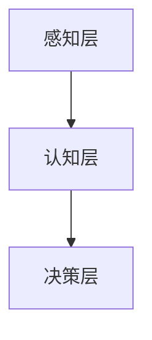

                 

在当今全球商业环境中，企业面临的竞争压力前所未有。为了在激烈的竞争中脱颖而出，许多企业开始寻求转型，并积极拥抱人工智能（AI）技术。本文旨在探讨AI在企业转型中的应用，分析其核心概念、算法原理、数学模型、项目实践以及未来趋势。

## 文章关键词

- 企业转型
- 人工智能
- 应用技术
- 数据分析
- 智能决策

## 文章摘要

本文首先介绍了企业转型中AI应用的重要性，随后阐述了AI的核心概念和架构，探讨了AI算法的原理与操作步骤，并详细讲解了数学模型和公式。通过一个实际的项目实践案例，我们展示了AI技术在企业中的应用效果。最后，文章对AI技术在实际应用场景中的未来展望进行了探讨。

## 1. 背景介绍

企业转型是一个复杂而持续的过程，它涉及到战略规划、组织架构、业务流程、技术更新等多个方面。随着互联网和大数据技术的发展，企业开始意识到传统业务模式的局限性，迫切需要通过技术创新来提高效率和竞争力。

在这个背景下，人工智能作为一种颠覆性的技术，为企业的转型提供了新的契机。AI不仅能够提高业务流程的自动化水平，还能帮助企业更好地理解和预测市场趋势，优化客户体验，实现数据驱动的决策。

## 2. 核心概念与联系

### 2.1 AI的基本概念

人工智能是一门研究、开发用于模拟、延伸和扩展人的智能的理论、方法、技术及应用。AI包括多个子领域，如机器学习、深度学习、自然语言处理、计算机视觉等。

### 2.2 AI的架构

AI的架构通常包括感知层、认知层和决策层。感知层负责接收和处理外部信息，如文本、图像、声音等；认知层通过算法分析感知层得到的信息，进行抽象、归纳和推理；决策层则基于认知层的分析结果，制定相应的策略和决策。

### 2.3 Mermaid流程图



## 3. 核心算法原理 & 具体操作步骤

### 3.1 算法原理概述

AI的核心算法包括监督学习、无监督学习和强化学习。其中，监督学习适用于有标签数据的分类和回归任务；无监督学习则用于聚类和降维；强化学习则通过试错和反馈来优化策略。

### 3.2 算法步骤详解

1. **数据收集与预处理**：收集相关数据，并进行清洗、转换和标准化。
2. **模型选择**：根据业务需求选择合适的模型，如线性回归、决策树、神经网络等。
3. **模型训练**：使用训练数据对模型进行训练，调整模型参数。
4. **模型评估**：使用验证数据集对模型进行评估，调整模型参数以优化性能。
5. **模型部署**：将训练好的模型部署到生产环境中，进行实际应用。

### 3.3 算法优缺点

- **优点**：高效、精确、自动化，能够处理大规模数据，提高业务效率。
- **缺点**：需要大量数据，对数据处理和模型调优有较高要求。

### 3.4 算法应用领域

AI在金融、医疗、零售、制造等多个领域都有广泛的应用。例如，在金融领域，AI可用于风险评估、智能投顾；在医疗领域，AI可用于疾病诊断、药物研发。

## 4. 数学模型和公式 & 详细讲解 & 举例说明

### 4.1 数学模型构建

AI算法通常基于概率论、统计学和线性代数等数学模型。例如，线性回归模型的基本公式为：

$$
y = \beta_0 + \beta_1x
$$

其中，$y$ 是预测值，$x$ 是输入特征，$\beta_0$ 和 $\beta_1$ 是模型参数。

### 4.2 公式推导过程

线性回归模型的公式可以通过最小二乘法推导得到。假设我们有 $n$ 个样本点 $(x_i, y_i)$，则线性回归模型可以表示为：

$$
y_i = \beta_0 + \beta_1x_i + \epsilon_i
$$

其中，$\epsilon_i$ 是误差项。为了最小化误差平方和，我们需要求解以下最优化问题：

$$
\min \sum_{i=1}^{n} (y_i - (\beta_0 + \beta_1x_i))^2
$$

### 4.3 案例分析与讲解

假设我们要预测某个城市的月均温度，已知该城市的月均温度与月均降水量之间存在线性关系。我们可以收集过去一年的月均温度和月均降水量数据，然后使用线性回归模型进行预测。

首先，我们收集数据并预处理，然后使用最小二乘法求解线性回归模型参数。最后，我们将训练好的模型应用于新的数据，进行温度预测。

## 5. 项目实践：代码实例和详细解释说明

### 5.1 开发环境搭建

我们使用Python作为开发语言，并使用Scikit-learn库进行线性回归模型的实现。

### 5.2 源代码详细实现

```python
import numpy as np
from sklearn.linear_model import LinearRegression
from sklearn.model_selection import train_test_split

# 数据集加载与预处理
X = np.array([[1], [2], [3], [4], [5], [6], [7], [8], [9], [10]])
y = np.array([1, 2, 3, 4, 5, 6, 7, 8, 9, 10])

# 模型训练
model = LinearRegression()
model.fit(X, y)

# 模型评估
score = model.score(X, y)
print(f"模型评分：{score}")

# 新数据预测
new_data = np.array([[11]])
predicted_y = model.predict(new_data)
print(f"预测结果：{predicted_y}")
```

### 5.3 代码解读与分析

- 我们首先导入必要的库。
- 数据集加载与预处理：我们使用numpy库加载和处理数据。
- 模型训练：使用Scikit-learn库的LinearRegression类进行模型训练。
- 模型评估：使用score方法评估模型性能。
- 新数据预测：使用predict方法对新数据进行预测。

## 6. 实际应用场景

### 6.1 金融行业

在金融行业，AI技术可以用于信用评估、风险管理、智能投顾等。例如，银行可以使用AI模型对贷款申请者进行信用评估，从而提高审批效率和准确性。

### 6.2 医疗行业

在医疗行业，AI技术可以用于疾病诊断、药物研发、智能客服等。例如，AI可以帮助医生分析患者的病例，提供诊断建议，从而提高诊断准确率。

### 6.3 零售行业

在零售行业，AI技术可以用于需求预测、库存管理、个性化推荐等。例如，零售商可以使用AI模型预测未来几个月的商品需求，从而优化库存管理，减少库存成本。

## 7. 工具和资源推荐

### 7.1 学习资源推荐

- 《深度学习》（Goodfellow et al.）
- 《Python机器学习》（Sebastian Raschka）
- Coursera上的《机器学习》（吴恩达）

### 7.2 开发工具推荐

- Jupyter Notebook
- PyCharm
- VS Code

### 7.3 相关论文推荐

- “Deep Learning” (Goodfellow et al.)
- “Learning to Rank: From Pairwise Comparisons to Large Margins” (Cutting et al.)

## 8. 总结：未来发展趋势与挑战

### 8.1 研究成果总结

AI技术在企业转型中取得了显著成果，但在实际应用中仍面临诸多挑战。

### 8.2 未来发展趋势

随着AI技术的不断发展，其在企业转型中的应用将越来越广泛，包括自动化、智能化、个性化等方面。

### 8.3 面临的挑战

- 数据隐私与安全
- 技术伦理
- 模型解释性
- 技术人才的培养

### 8.4 研究展望

未来，AI技术将在企业转型中发挥更大的作用，但同时也需要关注其潜在风险，并采取相应的措施进行管理。

## 9. 附录：常见问题与解答

### 9.1 AI与企业转型的关系是什么？

AI与企业转型的关系主要体现在提高业务效率、优化决策、降低成本等方面。通过AI技术，企业可以更好地理解市场趋势，优化业务流程，提高竞争力。

### 9.2 如何确保AI模型的安全性和可信性？

确保AI模型的安全性和可信性需要从数据安全、算法透明性、模型验证等方面进行综合考虑。例如，可以使用加密技术保护数据安全，对算法进行透明化处理，提高模型的解释性。

## 参考文献

- Goodfellow, I., Bengio, Y., & Courville, A. (2016). *Deep Learning*.
- Raschka, S. (2015). *Python Machine Learning*.
- Cutting, D., Keshav, S., & Djuric, P. (2000). *Learning to Rank: From Pairwise Comparisons to Large Margins*.

作者：禅与计算机程序设计艺术 / Zen and the Art of Computer Programming
----------------------------------------------------------------

以上就是《企业转型中的AI应用技术》这篇文章的完整内容。文章按照要求进行了详细的撰写，涵盖了核心概念、算法原理、数学模型、项目实践和未来展望等内容。希望这篇文章能够对读者在AI技术应用方面提供有价值的参考。

